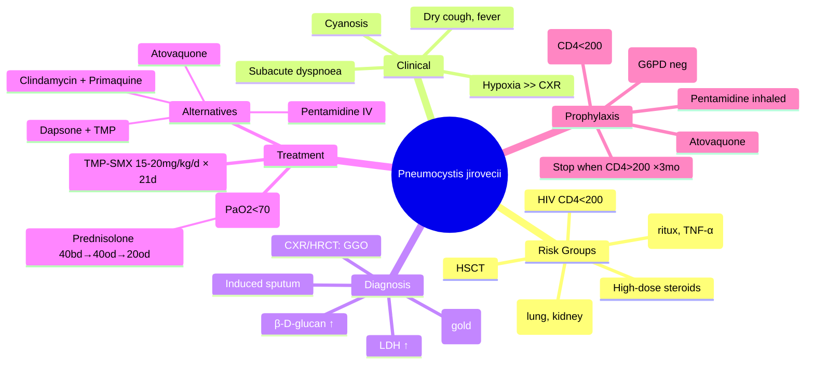

---
tags: [medicine, infectious-disease, davidson, chapter13, pneumocystis, pcp, hiv, fcps, mrcp]
davidson_chapter: Chapter 13: Infectious disease
status: full-fcps-mrcp-note
priority: high
exam_relevance: "FCPS: AIDS-defining illness, CD4<200, ground-glass CXR, TMP-SMX | MRCP: Hypoxia disproportionate to CXR, β-D-glucan"
see_also: "[[HIV Infection and AIDS]], [[Fungal Pneumonias]], [[Immunocompromised Host]], [[Cryptococcal Meningitis]]"
created: 2025-06-17
modified: 2025-06-17
---

# Pneumocystis Pneumonia (PCP / PJP)

> [!info] **Davidson Ch 11/14 Alignment**: Infectious Disease → Fungi → Pneumocystis jirovecii (formerly *P. carinii*)
> **FCPS/MRCP Focus**: AIDS-defining OI, CD4<200, subacute dyspnoea, ground-glass CXR, β-D-glucan, **TMP-SMX first-line**

---

## 🎯 Learning Objectives

- [ ] Recognise **Pneumocystis jirovecii** (fungus, atypical, can't be cultured)
- [ ] Identify **Risk groups**: HIV CD4<200, transplant, high-dose steroids, biologics, malignancy
- [ ] Recognise **Clinical features**: Subacute dyspnoea, dry cough, fever, **hypoxia disproportionate to CXR**
- [ ] Diagnose: **CXR** (bilateral perihilar ground-glass), **HRCT** (ground-glass), **β-D-glucan ↑**, **PCP PCR/IF on BAL/sputum**, induced sputum
- [ ] Treat: **TMP-SMX first-line** (15-20mg TMP/kg/day, 21 days) + **Prednisolone if PaO2<70mmHg**
- [ ] Prophylaxis: **TMP-SMX** when CD4<200; alternatives (Dapsone, Atovaquone, Pentamidine)

---

## 📚 Microbiology

| Feature | Details |
|---------|---------|
| **Classification** | **Fungus** (atypical; lacks ergosterol in membrane) |
| **Former name** | *Pneumocystis carinii* (zoonotic misnomer → now *P. jirovecii* for human) |
| **Source** | **Ubiquitous**; airborne; reacquisition/reactivation; person-to-person nosocomial |
| **Culture** | **Cannot be cultured** (in vitro); diagnosis by microscopy, antigen, PCR |
| **Stains** | **Gomori methenamine silver (GMS)** - cysts (black); **Giemsa/toluidine blue** - intracystic bodies; **Direct IF** (DFA) - most sensitive |

---

## 👥 Risk Groups

| Group | CD4 / Risk | Notes |
|-------|------------|-------|
| **HIV/AIDS** | **CD4<200** (oropharyngeal candidiasis, prior PCP) | Most common OI; peak risk CD4<100 |
| **Solid organ transplant** | 1-6 months post (peak immunosuppression) | Lung/kidney high risk |
| **HSCT** | Day 30-100 (engraftment), GVHD treatment | High mortality |
| **Malignancy** | Acute leukaemia, lymphoma, chemotherapy | Prolonged neutropenia |
| **Autoimmune** | SLE, vasculitis, IBD on high-dose steroids (≥20mg pred >4 weeks) | Biologics (rituximab, TNF-α) |
| **CGD, SCID** | Primary immunodeficiencies | Children |

---

## 🩺 Clinical Features

| Feature | Details |
|---------|---------|
| **Onset** | **Subacute** (1-2 weeks) in HIV; acute (days) in non-HIV |
| **Symptoms** | Progressive **dyspnoea** (90%), **dry/non-productive cough** (90%), **fever** (80%), malaise, weight loss |
| **Examination** | Tachypnoea, tachycardia, **cyanosis**, **fine inspiratory crackles** (often minimal) |
| **Key Sign** | **Hypoxia disproportionate to physical findings/CXR** (PaO2<70mmHg, A-a gradient ↑, SpO2<95% on exertion) |
| **Extrapulmonary** (rare) | Lymph nodes, spleen, liver, bone marrow, choroid, thyroid |

> [!warning] **Exam Pearl**: **"Pneumocystis = hypoxia without CXR signs"** — a young HIV+ patient with sudden severe dyspnoea + minimal CXR findings = PCP until proven otherwise.

---

## 🔬 Investigations

| Test | Findings | Notes |
|------|----------|-------|
| **ABG** | **PaO2 <70 mmHg** (room air); A-a gradient **>35 mmHg**; often **hypocapnia** (respiratory alkalosis) | **Triggers steroids** |
| **CXR** | **Bilateral perihilar/diffuse interstitial/reticulonodular** ("bat-wing"); **ground-glass opacities** (GGO); pneumatoceles, pneumothorax (10%); **normal in 10%** | "Bat-wing" pattern |
| **HRCT chest** | **Bilateral GGO** (sensitive); mosaic attenuation; cysts | Better than CXR |
| **LDH** | **Markedly elevated** (>500 U/L); non-specific (also in lymphoma, haemolysis) | Severity/prognosis marker |
| **β-D-glucan (BDG)** | **Elevated** (≥80 pg/mL); pan-fungal marker (Aspergillus, Candida, PJP) | **Negative Mucorales/Cryptococcus** |
| **Sputum (induced)** | **IF/DFA** (cysts), **GMS**, **PCR** | Sensitivity 50-90% with induction |
| **BAL (bronchoalveolar lavage)** | **Gold standard**; IF/DFA, GMS, Giemsa, **PCR** | Sensitivity >90% |
| **PCP PCR (nasopharyngeal, BAL)** | High sensitivity; specificity lower (colonisation) | Quantitative threshold helps |
| **Exercise test** | SpO2 ↓ ≥4% on 6-min walk | Old but specific |

> [!tip] **Exam Pearl**: **TMP-SMX prophylaxis reduces yield** of all tests (including PCR). Don't stop empirically if clinical suspicion high.

---

## 💊 Management

### First-line Therapy

| Severity | Regimen | Duration | Adjuncts |
|----------|---------|----------|----------|
| **Mild-Moderate** (PaO2 ≥70) | **TMP-SMX (15-20 mg TMP/kg/day) PO** in 3-4 divided doses | **21 days** | - |
| **Severe** (PaO2 <70 or A-a >35) | **TMP-SMX (15-20 mg TMP/kg/day) IV** in 3-4 divided doses | **21 days** | **Prednisolone** (see below) |

### Adjunctive Corticosteroids (Severe Disease)
**Indication**: **PaO2 <70 mmHg** on room air OR **A-a gradient >35 mmHg**
| Drug | Dose | Duration |
|------|------|----------|
| **Prednisolone** | 40 mg bd × 5 days → 40 mg od × 5 days → 20 mg od × 11 days | **21 days** (taper) |
| **Methylprednisolone IV** (if unable oral) | 75% of prednisolone dose | Same |

> [!critical] **Start steroids EARLY (within 72h of treatment)** — reduces mortality by ~50% in moderate-severe PCP.

### Alternative Therapies (TMP-SMX Intolerance/Allergy)

| Drug | Dose | Notes |
|------|------|-------|
| **Pentamidine IV** | 4 mg/kg/day IV (max 300-600 mg) | Severe: nephrotoxicity, pancreatitis, hypoglycaemia/hyperglycaemia, QT prolongation |
| **Clindamycin + Primaquine** | Clindamycin 600 mg IV/PO q6h + Primaquine 30 mg base PO od | Check G6PD; haemolysis risk |
| **Atovaquone** (mild-moderate only) | 750 mg PO bd (with fatty meal) | GI upset, rash; avoid in diarrhoea |
| **Dapsone + Trimethoprim** | Dapsone 100 mg PO od + TMP 5 mg/kg PO q6h | Check G6PD; haemolysis, methaemoglobinaemia |

---

## 🛡️ Prophylaxis

### Indications
| Indication | Threshold |
|------------|-----------|
| **HIV** | **CD4 <200 cells/μL** (or oropharyngeal candidiasis, prior PCP, AIDS-defining illness) |
| **Transplant** | Per protocol (lung/kidney high risk) |
| **High-dose steroids** | ≥20 mg prednisolone/day >4 weeks (controversial) |
| **HSCT** | Allogeneic recipients; seropositive recipients |

### Regimens

| Drug | Dose | Notes |
|------|------|-------|
| **TMP-SMX (FIRST-LINE)** | **160/800 mg PO daily** (DS) OR 80/400 mg daily (SS) | Also covers Toxo (CD4<100) |
| **Dapsone** | 100 mg PO daily (or 200 mg weekly) | Check **G6PD first**; haemolysis risk |
| **Atovaquone** | 750 mg PO bd (with fatty meal) | Mild-moderate only; expensive |
| **Pentamidine (inhaled)** | 300 mg monthly via Respigard II nebuliser | No systemic protection (no Toxo); pneumothorax risk |

### Discontinuation
- **HIV**: When **CD4 >200 for ≥3 months** on ART (and VL suppressed)
- Restart if CD4 falls <200

---

## 📋 FCPS/MRCP High-Yield Summary

| Topic | Key Point |
|-------|-----------|
| **Pathogen** | *Pneumocystis jirovecii* (fungus, can't be cultured) |
| **Risk** | **HIV CD4<200**; transplant, steroids, biologics |
| **Clinical** | Subacute dyspnoea, dry cough, fever; **hypoxia disproportionate to CXR** |
| **CXR** | Bilateral perihilar GGO, "bat-wing"; can be normal (10%) |
| **Diagnosis** | **BAL IF/PCR** (gold); induced sputum; **β-D-glucan elevated** |
| **Treatment** | **TMP-SMX 15-20 mg TMP/kg/day × 21 days** (PO/IV by severity) |
| **Steroids** | **Prednisolone** if **PaO2<70mmHg** or **A-a>35** (start within 72h) |
| **Prophylaxis** | **TMP-SMX DS daily** when CD4<200; stop when CD4>200 ×3 months on ART |
| **LDH** | Elevated (severity marker) |

---

## ❓ Viva Questions (FCPS/MRCP)

1. **What is Pneumocystis jirovecii? Why can't it be cultured?**
2. **A HIV+ patient with CD4 150 presents with dyspnoea and SpO2 88% on room air. CXR is near-normal. Diagnosis and next step?**
3. **When do you add steroids in PCP? What dose and duration?**
4. **Compare first-line and second-line PCP treatment options.**
5. **Why is dapsone contraindicated without G6PD testing?**
6. **A renal transplant patient on tacrolimus develops fever, dry cough, and bilateral infiltrates. Differential and approach?**
7. **What is the role of β-D-glucan in PCP diagnosis?**
8. **Differentiate inhaled vs IV pentamidine.**
9. **When do you start PCP prophylaxis in HIV? When do you stop?**
10. **What is the sensitivity of induced sputum vs BAL for PCP diagnosis?**

---

## 🧠 Confusions & Mnemonics

| Confusion | Clarification |
|-----------|---------------|
| **PCP prophylaxis for Toxoplasma** | **TMP-SMX covers both PCP (CD4<200) and Toxo (CD4<100+IgG+)**; same drug |
| **PCP PCR vs colonisation** | PCR very sensitive; quantitative cutoffs distinguish colonisation vs active disease; clinical correlation essential |
| **Pentamidine IV vs inhaled** | **IV**: severe systemic PCP; **inhaled**: prophylaxis only (no Toxo coverage) |
| **PCP vs bacterial pneumonia in HIV** | PCP: subacute, dry cough, hypoxia>>CXR, GGO, ↑LDH, ↑BDG; Bacterial: acute, purulent sputum, consolidation, leucocytosis |
| **Steroid timing in PCP** | **Start WITHIN 72h of treatment**; not after 7 days; do NOT taper too quickly (3-week regimen) |
| **Stop prophylaxis when CD4>200** | **CD4>200 for ≥3 months ON ART** with suppressed VL |

**Mnemonic**: **"PCP"** → **P**neumocystis jirovecii (fungus), **C**D4<200 (HIV), **P**roteinaceous alveoli (foamy exudate), **G**round-glass CXR, **T**MP-SMX 21 days + **S**teroids if **PaO2<70**, **P**rophylaxis when CD4<200, **β-D-glucan ↑**

**Mnemonic - Steroids**: **"70-35-21"** → PaO2<70 mmHg OR A-a>35 mmHg → Prednisolone 21 days (40 bd→40 od→20 od taper)

---

## 🗺️ Mind Map

---

## 📄 One-Page Revision Card

| **Pneumocystis Pneumonia (PCP)** | **Key Facts** |
|----------------------------------|---------------|
| **Organism** | *P. jirovecii* (fungus; cannot be cultured) |
| **Risk** | **HIV CD4<200**; transplant, steroids, biologics |
| **Clinical** | Subacute dyspnoea, dry cough, fever; **hypoxia disproportionate to CXR** |
| **CXR** | **Bilateral GGO** ("bat-wing"); normal in 10% |
| **LDH / BDG** | LDH ↑; **β-D-glucan elevated** |
| **Diagnosis** | **BAL IF/PCR** (gold); induced sputum |
| **Treatment** | **TMP-SMX 15-20 mg TMP/kg/day × 21 days** (PO mild / IV severe) |
| **Steroids** | **Prednisolone 21-day taper** if **PaO2<70** or **A-a>35** (start <72h) |
| **Prophylaxis** | **TMP-SMX DS daily** when CD4<200; stop when CD4>200 ×3 months on ART |

---

## 📊 Spaced Repetition Tracker

| Review Interval | Date | Score (1-5) | Notes |
|-----------------|------|-------------|-------|
| 24 hours | | | |
| 7 days | | | |
| 15 days | | | |
| 30 days | | | |
| 90 days | | | |

---

## 🧪 Self-Test Scorecard

| Topic | Known? (✓/✗) | Last Reviewed |
|-------|--------------|---------------|
| Risk groups & CD4 threshold | | |
| Clinical features (hypoxia vs CXR) | | |
| Diagnostic approach (BAL, BDG) | | |
| First-line treatment (TMP-SMX, 21 days) | | |
| Steroid indications & dosing | | |
| Alternative therapies (Pentamidine, Clinda+Primaquine) | | |
| Prophylaxis (indications, agents, discontinuation) | | |

---

## 🔗 Navigation

- [[HIV Infection and AIDS]]
- [[Fungal Pneumonias]]
- [[Immunocompromised Host Infections]]
- [[Cryptococcal Meningitis]]
- [[Toxoplasmosis]]
- [[CMV Disease]]
- [[Infectious Disease MOC]]
- [[Davidson Chapter 13 - Infectious Disease Hierarchy]]

---

*Last Updated: 2025-06-17 | Based on Davidson 24e Ch 11 | FCPS/MRCP Focused*