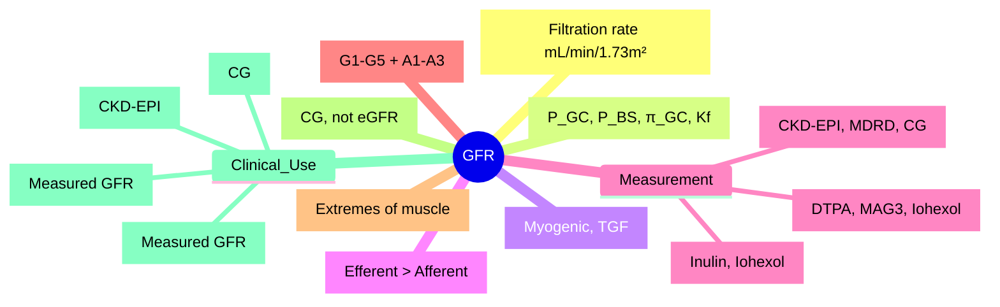

# Glomerular Filtration Rate

<callout icon="🩺" color="red_bg">
**Topic:** Glomerular Filtration Rate — Nephrology & Urology
**Style:** Sea Knowledge study infographic
**Audience:** FCPS / MRCP exam prep
</callout>

**Related:** [[Functional Anatomy and Physiology of the Kidney and Urinary Tract]], [[Investigation of Renal and Urinary Tract Disease]], [[Acute Kidney Injury (AKI)]], [[Chronic Kidney Disease (CKD)]], [[Nephrology and Urology MOC]]

> [!important]
> **GFR = Kf × (P_GC - P_BS - π_GC). Normal ~120 mL/min/1.73m². Autoregulation: myogenic + TGF (MAP 80–180 mmHg). Ang II constricts efferent > afferent → maintains P_GC. Cockcroft-Gault, CKD-EPI, MDRD for estimation. Inulin clearance = gold standard; DTPA/MAG3 = clinical standard. CKD staging: G1–G5 by eGFR + A1–A3 by ACR.**

---

## 1. Learning Objectives
- Define GFR and understand its physiological determinants
- Apply GFR estimation equations (Cockcroft-Gault, CKD-EPI, MDRD)
- Interpret GFR values for CKD staging
- Know gold standard and clinical methods for GFR measurement
- Apply GFR to drug dosing and clinical decision-making

---

## 2. Definition & Physiology

### Definition
> **GFR** = volume of plasma filtered by glomeruli per unit time (mL/min/1.73m²)

### Normal Values
| Population | GFR (mL/min/1.73m²) |
|------------|---------------------|
| **Young adult** | ~120–130 |
| **Elderly (>70)** | ~70–80 |
| **Child (2yr+)** | ~120 (indexed to BSA) |

### Physiological Determinants (Starling Forces)
$$GFR = K_f \times (P_{GC} - P_{BS} - \pi_{GC})$$

| Force | Typical Value | Effect on GFR |
|-------|---------------|---------------|
| **P_GC** (glomerular capillary hydrostatic) | ~45 mmHg | **Major driving force** |
| **P_BS** (Bowman's space hydrostatic) | ~15 mmHg | Opposes filtration |
| **π_GC** (glomerular capillary oncotic) | ~30 mmHg | Opposes filtration (oncotic) |
| **K_f** (filtration coefficient) | ~12.5 mL/min/mmHg | Permeability × surface area |

> **Net Filtration Pressure** = P_GC - P_BS - π_GC ≈ 45 - 15 - 30 = **~0 mmHg** (theoretical)
> **Actual GFR** maintained by high K_f and dynamic forces

---

## 3. Autoregulation of GFR (MAP 80–180 mmHg)

| Mechanism | Mechanism | Mediator | Timeframe |
|-----------|-----------|----------|-----------|
| **Myogenic** | Stretch → afferent constriction | Vascular smooth muscle | Seconds |
| **Tubuloglomerular Feedback (TGF)** | ↑ NaCl at macula densa → afferent constriction | **Adenosine**, ATP | Seconds–minutes |
| **RAAS** | Ang II → efferent > afferent constriction | Angiotensin II | Minutes–hours |

> [!key]
> **Autoregulation range**: MAP 80–180 mmHg. Below 80 → GFR falls; Above 180 → hyperfiltration risk.

---

## 4. GFR Measurement Methods

### Gold Standard
| Method | Substrate | Principle | Use |
|--------|-----------|-----------|-----|
| **Inulin clearance** | Inulin (5 kDa fructose polymer) | Freely filtered, not secreted/reabsorbed | **Gold standard** (research) |
| **Iohexol/Iothalamate** | Contrast agents | Similar to inulin | **Clinical gold standard** |
| **DTPA (⁹⁹ᵐTc)** | Radiolabelled DTPA | Gamma camera, plasma clearance | **Clinical standard** (nuclear med) |
| **MAG3 (⁹ᵐTc)** | Mercaptoacetyltriglycine | Tubular secretion + filtration | Better at low GFR; **Renal scan** |

---

## 5. GFR Estimation Equations

### CKD-EPI 2021 (Preferred)
$$eGFR = 142 × (Scr/κ)^{-α} × (0.9938)^{Age} × (1.012 \text{ if female}) × (1.159 \text{ if Black})$$

| Variable | Female | Male |
|----------|--------|------|
| **κ** | 0.7 | 0.9 |
| **α** | 0.241 | 0.302 |

### Cockcroft-Gault (Drug Dosing)
$$CrCl = \frac{(140 - Age) × Weight (kg)}{72 \times Scr} × (0.85 \text{ if female})$$

| Equation | Best For | Limitations |
|----------|----------|-------------|
| **CKD-EPI 2021** | **General population**, CKD staging | Less accurate at extremes (very high/low GFR) |
| **MDRD** | CKD populations | Underestimates at GFR >60 |
| **Cockcroft-Gault** | **Drug dosing** (FDA/EMA) | Overestimates in obesity, elderly |
| **Cystatin C** | **Extremes of muscle mass** (elderly, amputees, malnutrition) | Affected by thyroid, steroids, inflammation |

---

## 6. CKD Staging (KDIGO 2012) — G + A Classification

| GFR Category | eGFR (mL/min/1.73m²) | Description |
|--------------|----------------------|-------------|
| **G1** | ≥90 | Normal/High |
| **G2** | 60–89 | Mildly decreased |
| **G3a** | 45–59 | Mild–moderate |
| **G3b** | 30–44 | Moderate–severe |
| **G4** | 15–29 | Severe |
| **G5** | <15 | Kidney failure |

| Albuminuria Category | ACR (mg/mmol) | Description |
|----------------------|---------------|-------------|
| **A1** | <3 | Normal to mildly increased |
| **A2** | 3–30 | Moderately increased (microalbuminuria) |
| **A3** | >30 | Severely increased (macroalbuminuria) |

| Combined Risk | G1 | G2 | G3a | G3b | G4 | G5 |
|---------------|----|----|-----|-----|----|----|
| **A1** | Low | Low | Moderate | High | Very High | Very High |
| **A2** | Low | Moderate | High | Very High | Very High | Very High |
| **A3** | Moderate | High | Very High | Very High | Very High | Very High |

---

## 7. GFR Measurement in Clinical Practice

### When to Measure GFR (vs Estimate)
| Indication | Method |
|------------|--------|
| **Drug dosing** (narrow TI) | Cockcroft-Gault (CrCl) |
| **CKD staging** | CKD-EPI eGFR |
| **Potential living donor** | **Measured GFR (iohexol/DTPA)** |
| **Chemotherapy dosing** (carboplatin) | Measured GFR (EDTA/DTPA) |
| **Pre-transplant evaluation** | Measured GFR (iohexol/DTPA) |
| **CKD G3–G5** | Serial eGFR trends; Cystatin C if discordant |

---

## 8. Cystatin C

| Property | Creatinine | Cystatin C |
|----------|------------|------------|
| **Source** | Muscle metabolism | All nucleated cells |
| **Muscle dependence** | High | Low |
| **Tubular handling** | Secreted (10–20%) | Reabsorbed + catabolised |
| **Best for** | General population | **Extremes of muscle mass** (elderly, amputees, malnutrition, obesity) |
| **Combined** | **CKD-EPI Cr-CysC** = most accurate | **Best overall accuracy** |

---

## 9. Drug Dosing Adjustment by GFR

| Drug Class | eGFR Threshold | Adjustment |
|-----------|----------------|------------|
| **Aminoglycosides** | <60 | Extended interval / TDM |
| **Vancomycin** | <50 | Trough-guided, extended interval |
| **Metformin** | <30 (contraindicated), 30–45 (↓ dose) | Contraindicated <30; ↓ dose 30–45 |
| **DOACs (Apixaban, Rivaroxaban)** | <30 (avoid), 15–30 (↓ dose) | Follow specific guidelines |
| **DOACs (Dabigatran)** | <30 (avoid), 30–50 (↓ dose) | Avoid <30; 75mg BID if 30–50 |
| **Carboplatin** (AUC dosing) | Calvert formula: Dose = AUC × (GFR + 25) | **Measured GFR essential** |
| **Gadolinium (MRI)** | <30 (avoid linear); macrocyclic preferred | Avoid linear if eGFR <30 |

---

## 10. High-Yield FCPS/MRCP Points

> [!important]
> - **GFR = Kf × (P_GC - P_BS - π_GC)**
> - **Autoregulation**: Myogenic + TGF (MAP 80–180 mmHg)
> - **Ang II**: Efferent > afferent constriction → maintains P_GC
> - **CKD-EPI 2021** = preferred eGFR equation
> - **Cockcroft-Gault** = drug dosing only
> - **CKD Staging**: G1–G5 + A1–A3
> - **Cystatin C**: extremes of muscle mass (elderly, amputees)
> - **Drug dosing**: use Cockcroft-Gault (CrCl)
> - **Carboplatin**: Calvert formula (measured GFR)
> - **Metformin**: contraindicated <30, reduce 30–45
> - **DOACs**: dose adjust per renal function

---

## 11. Common Confusions / Exam Traps

| Trap | Correction |
|------|------------|
| **GFR = Creatinine Clearance** | CrCl > GFR (creatinine secretion); CG > true GFR |
| **eGFR = True GFR** | eGFR = estimate; ±30% accuracy |
| **CKD-EPI = Cockcroft-Gault** | CKD-EPI = GFR estimate; CG = CrCl (drug dosing) |
| **eGFR <60 = CKD** | **CKD = eGFR <60 for ≥3 months** (or markers of damage) |
| **Cystatin C = perfect** | Affected by thyroid, steroids, inflammation, smoking |
| **GFR = Constant** | Declines ~1 mL/min/yr after 40; accelerated in disease |
| **eGFR <60 = CKD G3** | G3a = 45–59; G3b = 30–44 — different prognosis |
| **Drug dose = eGFR** | **Drug dose = CrCl (Cockcroft-Gault)** per FDA/EMA |

---

## 12. Mnemonics

- **GFR equation**: **K**f × (**P**_GC - **P**_BS - **π**_GC) = **KPP**
- **Autoregulation**: **M**yogenic + **T**GF = **MT**
- **CKD stages**: **G**1 (>90), **G**2 (60–89), **G3**a (45–59), **G3**b (30–44), **G4** (15–29), **G5** (<15)
- **Albuminuria**: **A**1 (<3), **A2** (3–30), **A3** (>30)
- **CKD-EPI**: **C**KD-**E**PI = **C**urrent **E**stimate
- **Cystatin C**: **C**ystatin = **C**omplement to **C**reatinine
- **Cockcroft-Gault**: **(140-Age) × Wt / (72 × Cr) × 0.85 (♀)**

---

## 13. Mind Map

---

## 14. 24-Hour Recall Prompts
1. GFR equation (Starling forces)
2. Autoregulation mechanisms (myogenic + TGF)
3. Ang II effect on arterioles
4. TGF mechanism (macula densa → afferent constriction)
5. CKD-EPI vs Cockcroft-Gault (when to use which)
6. CKD staging (G1–G5, A1–A3)
6. Cystatin C indications
7. Drug dosing: CG vs eGFR
7. Carboplatin dosing formula
8. Metformin renal thresholds

---

## 15. 7-Day / 15-Day / 30-Day Revision Tracker

| Day | Date | Recall (1-5) | Notes |
|-----|------|--------------|-------|
| 1   |      |              |       |
| 7   |      |              |       |
| 15  |      |              |       |
| 30  |      |              |       |

---

## 16. Must Know / Should Know / Nice to Know

| Priority | Content |
|----------|---------|
| **Must Know 🔴** | GFR equation, autoregulation, Ang II effect, CKD-EPI vs CG, CKD staging, drug dosing principles, metformin/DOAC thresholds |
| **Should Know 🟡** | Cystatin C utility, measured GFR methods, carboplatin dosing, GFR physiology details |
| **Nice to Know 🟢** | Novel GFR biomarkers, machine learning GFR prediction, novel filtration markers |

---

## 17. MCQs (10)

1. **GFR equation (Starling forces):**
   A. GFR = RPF × FF
   B. **GFR = Kf × (P_GC - P_BS - π_GC)**
   C. GFR = RPF × (1 - Hct)
   D. GFR = U_inulin × V / P_inulin
   E. GFR = RPF × (1 - FF)

2. **Autoregulation of GFR - mechanisms:**
   A. Myogenic only
   B. TGF only
   C. **Myogenic + Tubuloglomerular feedback**
   D. Angiotensin II only
   E. Sympathetic only

3. **Angiotensin II effect on glomerular arterioles:**
   A. Afferent constriction
   B. **Efferent > Afferent constriction**
   C. Afferent dilation
   D. Efferent dilation
   E. No effect

4. **CKD-EPI equation is preferred over MDRD because:**
   A. Simpler
   B. **More accurate at GFR >60, less race-dependent**
   C. Uses only creatinine
   D. No age variable
   E. Better for drug dosing

4. **Cockcroft-Gault equation is used for:**
   A. CKD staging
   B. **Drug dosing (FDA/EMA)**
   C. GFR estimation in elderly
   D. Carboplatin dosing
   E. Carboplatin dosing

5. **Cystatin C is preferred over creatinine when:**
   A. Patient is obese
   B. **Extremes of muscle mass (elderly, amputees, malnutrition)**
   C. Patient has liver disease
   D. Patient is pregnant
   E. Patient is on dialysis

5. **Carboplatin dosing uses:**
   A. Cockcroft-Gault
   B. **Calvert formula: Dose = Target AUC × (GFR + 25)**
   C. CKD-EPI eGFR
   D. Body surface area only
   E. Creatinine clearance only

6. **Metformin is contraindicated if eGFR:**
   A. <60
   B. <45
   C. **<30**
   D. <15
   E. <60 with contrast

---

## 18. MCQs (10)

1. **GFR = ?**
   A. RPF × FF
   B. **Kf × (P_GC - P_BS - π_GC)**
   C. CrCl × FF
   D. U_inulin × V / P_inulin
   E. RPF × (1-FF)

2. **Autoregulation range:**
   A. MAP 60–100
   B. **MAP 80–180**
   C. MAP 90–200
   D. MAP 70–150
   E. MAP 100–200

3. **Ang II effect:**
   A. Afferent constriction
   B. **Efferent > Afferent constriction**
   C. Both dilate
   D. No effect
   E. Efferent dilation

4. **TGF mediator:**
   A. Angiotensin II
   B. **Adenosine**
   C. Prostaglandins
   D. NO
   E. Endothelin

4. **CKD-EPI vs MDRD:**
   A. More complex
   B. **Better at GFR >60, less race bias**
   C. Uses cystatin C only
   D. No age variable
   E. For drug dosing only

5. **Cockcroft-Gault use:**
   A. CKD staging
   B. **Drug dosing**
   C. Carboplatin dosing
   D. CKD-EPI preferred
   E. Only in elderly

6. **Cystatin C indication:**
   A. All patients
   B. **Extremes of muscle mass (elderly, amputees)**
   C. Pregnancy
   C. Children only
   E. Liver disease

6. **Carboplatin formula:**
   A. Dose = AUC × CrCl
   B. **Dose = AUC × (GFR + 25)**
   C. Dose = AUC × BSA
   D. Dose = AUC × Weight
   E. Dose = AUC / GFR

7. **Metformin contraindication:**
   A. eGFR <60
   B. <45
   C. **<30**
   D. <15
   E. <60 with contrast

8. **DOAC renal dosing (apixaban):**
   A. No adjustment needed
   B. **<30: avoid; 15–30: 2.5mg BD**
   C. <50: 2.5mg BD
   D. <60: 2.5mg BD
   E. No adjustment ever

---

## 19. SBA Questions (10)

1. **70-year-old woman, weight 45kg, Scr 120 µmol/L. eGFR 32 (CKD-EPI), CrCl 42 (CG). Metformin 1g BD. Action:**
   A. Continue
   B. **Reduce dose (eGFR 30–45)**
   C. Stop
   C. Reduce by half
   E. Switch to gliclazide

2. **Carboplatin AUC 5, measured GFR 45. Dose (Calvert):**
   A. 250 mg
   B. **350 mg (5 × (45+25))**
   C. 400 mg
   D. 300 mg
   E. 250 mg

3. **Patient on apixaban 5mg BD. eGFR drops to 25. Management:**
   A. Continue 5mg BD
   B. **Reduce to 2.5mg BD (eGFR 15–30)**
   C. Switch to warfarin
   D. Stop
   E. Reduce to 2.5mg OD

4. **Carboplatin AUC 6, measured GFR 60. Dose:**
   A. 400
   B. **510 (6 × (60+25))**
   C. 450
   D. 600
   E. 350

5. **Patient on apixaban 5mg BD. eGFR drops to 10. Action:**
   A. Continue
   B. Reduce to 2.5mg BD
   C. **Stop (avoid if eGFR <15)**
   D. Switch to warfarin
   E. Reduce to 2.5mg OD

5. **Patient on metformin 1g BD, eGFR drops from 45 to 28. Action:**
   A. Continue
   B. **Stop (contraindicated <30)**
   C. Reduce to 500mg BD
   D. Switch to gliclazide
   E. Continue with monitoring

6. **Patient on DOAC (rivaroxaban 20mg OD). eGFR drops to 25. Dose:**
   A. 20mg OD
   B. **15mg OD (CrCl 15–50)**
   C. 10mg OD
   C. Stop
   E. Switch to warfarin

7. **Metformin eGFR threshold for contraindication (FDA):**
   A. <60
   B. <45
   C. **<30**
   D. <15
   E. <60 with contrast

7. **Carboplatin AUC 5, eGFR 30 (CG). Dose:**
   A. 250
   B. **275 (5 × (30+25))**
   C. 300
   D. 250
   E. 325

8. **DOAC (dabigatran) in renal impairment:**
   A. No dose adjustment
   B. **<30: avoid; 30–50: 75mg BD**
   C. <50: 110mg BD
   D. <30: 75mg BD
   E. <15: avoid

---

## 20. Flashcards

- Q: GFR formula?
  A: Kf × (P_GC - P_BS - π_GC)

- Q: Autoregulation range?
  A: MAP 80–180 mmHg

- Q: Autoregulation mechanisms?
  A: Myogenic + TGF

- Q: Ang II effect?
  A: Efferent > Afferent constriction

- Q: TGF mediator?
  A: Adenosine

- Q: CKD-EPI vs CG?
  A: CKD-EPI = staging; CG = drug dosing

- Q: CKD stages?
  A: G1 >90, G2 60–89, G3a 45–59, G3b 30–44, G4 15–29, G5 <15

- Q: ACR categories?
  A: A1 <3, A2 3–30, A3 >30 mg/mmol

- Q: Cystatin C use?
  A: Extremes of muscle mass

- Q: Carboplatin formula?
  A: Dose = AUC × (GFR + 25)

- Q: Metformin contraindication?
  A: eGFR <30

- Q: DOAC apixaban renal dosing?
  A: <15 avoid; 15–30: 2.5mg BD; >30: 5mg BD

- Q: Metformin eGFR 30–45?
  A: Reduce dose

- Q: Carboplatin dose AUC 5, GFR 45?
  A: 350 mg

- Q: Apixaban eGFR 25?
  A: 2.5mg BD

---

## 21. Answer Key with Explanations

### MCQs
1. **A** — Starling equation
2. **C** — Myogenic + TGF
3. **B** — Efferent > Afferent
4. **B** — Adenosine
5. **B** — Better at higher GFR, less race bias
6. **B** — Drug dosing (FDA/EMA)
7. **B** — Extremes of muscle mass
8. **B** — Calvert formula
9. **C** — Contraindicated <30
10. **B** — 15–30: 2.5mg BD

### SBAs
1. **B** — eGFR 30–45 → reduce metformin dose
2. **B** — Calvert: 5 × (45+25) = 350 mg
3. **B** — Apixaban 2.5mg BD if CrCl 15–30
4. **B** — 6 × (60+25) = 510
5. **C** — Avoid if eGFR <15
6. **B** — Stop if eGFR <30
7. **B** — Rivaroxaban 15mg OD if CrCl 15–50
8. **C** — FDA: contraindicated <30
9. **B** — Calvert: 5 × (30+25) = 275
10. **B** — Dabigatran <30 avoid; 30–50: 75mg BD

---

## 22. Summary

**Glomerular Filtration Rate** is a **Must Know 🔴** topic.
**Key takeaway:** GFR = Kf × (P_GC - P_BS - π_GC). Autoregulation: myogenic + TGF (MAP 80–180). Ang II: efferent > afferent. CKD-EPI for staging, CG for drug dosing. Cystatin C for muscle-wasted. CKD: G1–G5 + A1–A3. Drug dosing: CG. Carboplatin: Calvert (AUC × (GFR+25)). Metformin <30 contraindicated. DOACs dose-adjust per renal function.
**Exam focus:** GFR equation, autoregulation, Ang II, CKD staging, drug dosing adjustments, carboplatin formula, metformin/DOAC thresholds.
**Clinical relevance:** Drug dosing, AKI/CKD staging, chemotherapy dosing, contrast nephropathy risk, dialysis timing.