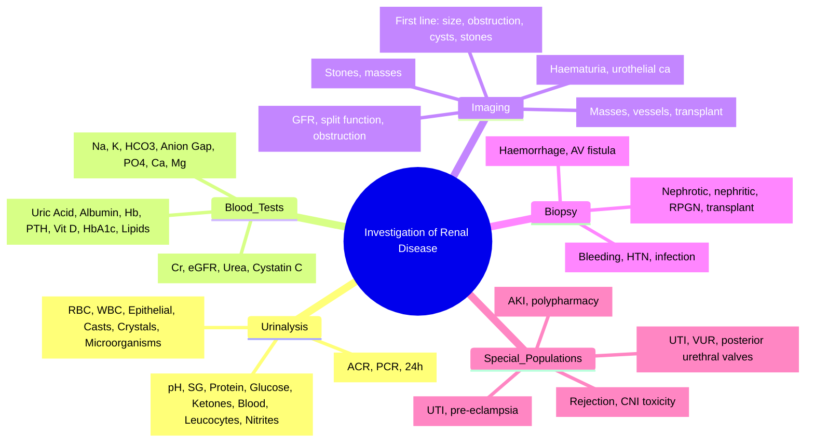

# Investigation of Renal and Urinary Tract Disease

<callout icon="🩺" color="red_bg">
**Topic:** Investigation of Renal and Urinary Tract Disease — Nephrology & Urology
**Style:** Sea Knowledge study infographic
**Audience:** FCPS / MRCP exam prep
</callout>

**Related:** [[Clinical Examination of the Kidney and Urinary Tract]], [[Functional Anatomy and Physiology of the Kidney and Urinary Tract]], [[Glomerular Filtration Rate]], [[Urine Investigations]], [[Blood Tests in Renal Disease]], [[Acute Kidney Injury (AKI)]], [[Chronic Kidney Disease (CKD)]], [[Nephrology and Urology MOC]]

> [!important]
> **Systematic investigation: Urinalysis (dipstick, microscopy, culture) → Blood tests (urea, creatinine, eGFR, electrolytes, acid-base) → Imaging (US, CT, MRI) → Special tests (GFR measurement, biopsy). Key: Urinalysis = renal biopsy of the poor; proteinuria = dipstick/ACR; haematuria = microscopy; AKI = KDIGO criteria; CKD = KDIGO staging.**

---

## 1. Learning Objectives
- Apply systematic approach to investigating renal/urinary disease
- Interpret urinalysis (dipstick, microscopy, ACR, PCR)
- Interpret blood tests (urea, creatinine, eGFR, cystatin C, electrolytes)
- Select and interpret imaging modalities (US, CT, MRI, IVU, DTPA/MAG3)
- Understand indications and interpretation of renal biopsy

---

## 2. Urinalysis — The "Renal Biopsy of the Poor"

### Sample Collection
| Type | Method | Use |
|------|--------|-----|
| **Random** | Void into sterile container | Routine screening |
| **First morning** | First void after waking | Concentrated, best for proteinuria, microscopic haematuria |
| **Catheterised** | Sterile catheter | Unconscious, obstructed, contaminated |
| **Suprapubic aspiration** | Suprapubic needle | Infants, contaminated samples |
| **Timed (24h)** | 24h collection | Proteinuria, creatinine clearance, electrolytes |

### Dipstick Analysis
| Parameter | Normal | Abnormal Significance |
|-----------|--------|----------------------|
| **pH** | 4.5–8.0 | Low: acidosis, UTI (urea-splitters); High: alkalosis, urea-splitters |
| **Specific Gravity** | 1.005–1.030 | Low: DI, CKD; High: dehydration, glycosuria, proteinuria |
| **Protein** | Negative | **Proteinuria** (glomerular > tubular > overflow); false +ve: alkaline, bloody |
| **Glucose** | Negative | **Glycosuria** (DM, renal glycosuria, pregnancy, SGLT2i) |
| **Ketones** | Negative | **Ketonuria** (DKA, starvation, low carb diet) |
| **Blood** | Negative | **Haematuria** (RBC >3/HPF); false +ve: myoglobin, Hb |
| **Leucocytes** | Negative | **Leucocyturia** (UTI, sterile pyuria = TB, stones, interstitial nephritis) |
| **Nitrites** | Negative | **Nitrituria** (Gram-negative UTI, sensitivity ~50%) |
| **Bilirubin** | Negative | Liver disease, haemolysis |
| **Urobilinogen** | Normal | Increased: haemolysis, haemolytic anaemia |

> [!key]
> **Proteinuria**: Dipstick detects albumin; ACR (albumin:creatinine ratio) = gold standard for quantification. **ACR >30 mg/mmol = proteinuria**; **ACR >300 = nephrotic range**.
> **Haematuria**: Dipstick +ve + microscopy RBC >3/HPF = true haematuria. False +ve: myoglobinuria, haemoglobinuria.

---

## 3. Urine Microscopy

| Element | Normal | Abnormal Significance |
|---------|--------|----------------------|
| **RBC** | 0–2/HPF | **>3/HPF = haematuria**; dysmorphic = glomerular; isomorphic = non-glomerular |
| **WBC** | 0–5/HPF | **>5/HPF = pyuria**; sterile pyuria = TB, interstitial nephritis, stones, carcinoma |
| **Epithelial cells** | Few | Squamous = contamination; Transitional = bladder/TCC; Renal tubular = ATN, interstitial nephritis |
| **Casts** | Hyaline few | **Pathological**: RBC cast = glomerulonephritis; WBC cast = pyelonephritis/interstitial nephritis; Granular/muddy brown = ATN; Waxy/broad = advanced CKD; Fatty = nephrotic syndrome |
| **Crystals** | Few urates | **Cystine** (hexagonal = cystinuria), **Uric acid** (needles/rosettes), **Calcium oxalate** (envelopes), **Triple phosphate** (coffin-lid = struvite/Proteus) |
| **Microorganisms** | None | Bacteria = UTI; Yeast = Candida; Parasites (Schistosoma) |

---

## 4. Special Urine Tests

### Proteinuria Quantification
| Test | Method | Normal | Advantages |
|------|--------|--------|------------|
| **ACR** | Albumin:creatinine ratio (spot urine) | <3 mg/mmol | **Gold standard**; corrects for concentration |
| **PCR** | Protein:creatinine ratio | <15 mg/mmol | Includes non-albumin proteins; overestimates if tubular protein |
| **24h urine protein** | 24h collection | <150 mg/day | Gold standard but cumbersome |
| **Albustix/dipstick** | Semi-quantitative | Negative | Screening only |

| ACR Category | Range (mg/mmol) | Significance |
|--------------|-----------------|--------------|
| **A1 (Normal)** | <3 | Normal |
| **A2 (Microalbuminuria)** | 3–30 | Early diabetic nephropathy, hypertensive nephropathy |
| **A3 (Macroalbuminuria)** | >30 | Overt proteinuria, nephrotic if >220 |

### Haematuria Investigation
| Step | Test | Significance |
|------|------|--------------|
| 1 | **Confirm** | Repeat dipstick + microscopy (>3 RBC/HPF) |
| 2 | **Dysmorphic RBC** | >50% dysmorphic = glomerular; isomorphic = non-glomerular |
| 3 | **Proteinuria** | ACR >30 + haematuria = glomerular disease |
| 4 | **Renal function** | eGFR, BP |
| 5 | **Imaging** | US KUB (stone, tumour, cyst); CT urogram (haematuria >40yr) |
| 6 | **Cystoscopy** | If >40yr or risk factors (smoker, analgesic abuse) |
| 6 | **Serology** | ASOT (post-strep), ANA, ANCA, anti-GBM, C3/C4, HIV, Hep B/C |

---

## 5. Blood Tests in Renal Disease

### Renal Function Tests
| Test | Normal Range | Interpretation |
|-------|--------------|----------------|
| **Serum Creatinine** | 60–110 μmol/L (M), 45–90 (F) | ↑ = ↓ GFR; muscle mass dependent |
| **eGFR (CKD-EPI)** | >90 mL/min/1.73m² | **CKD staging**: G1 (>90), G2 (60-89), G3a (45-59), G3b (30-44), G4 (15-29), G5 (<15) |
| **Cystatin C** | 0.5–1.0 mg/L | Less muscle-mass dependent; better at low GFR |
| **Urea** | 2.5–7.5 mmol/L | ↑ in CKD, dehydration, high protein, GI bleed, catabolism; less specific than Cr |
| **BUN:Creatinine ratio** | 10–20:1 | **>20**: pre-renal (dehydration, GI bleed); **<10**: liver disease, malnutrition |

### Electrolytes & Acid-Base
| Test | Normal | Renal Significance |
|--------|--------|-------------------|
| **Na+** | 135–145 mmol/L | Hyponatraemia (SIADH, diuretics, CKD); Hypernatraemia (dehydration, DI) |
| **K+** | 3.5–5.0 mmol/L | **Hyperkalaemia** = CKD, AKI, ACEi/ARA, K-sparing; **Hypokalaemia** = diuretics, RTA, diarrhoea |
| **HCO3-** | 22–29 mmol/L | **Metabolic acidosis** (CKD, RTA, DKA); **Metabolic alkalosis** |
| **Anion Gap** | 8–12 mmol/L | **HAGMA**: DKA, AKI, CKD, lactate, toxins (MUDPILES) |
| **Phosphate** | 0.8–1.4 mmol/L | **Hyperphosphataemia** = CKD; Hypophos = refeeding, alcohol, PT |
| **Calcium** | 2.2–2.6 mmol/L | **Hypocalcaemia** = CKD (↓ Vit D), hyperphos; corrected for albumin |
| **Magnesium** | 0.7–1.0 mmol/L | Hypomagnesaemia = diuretics, PPI, Gitelman, refeeding |

### Other Blood Tests
| Test | Renal Relevance |
|--------|----------------|
| **Uric acid** | ↑ in gout, tumour lysis, CKD, diuretics; ↓ in Fanconi, Wilson's |
| **Albumin** | ↓ in nephrotic syndrome, malnutrition, inflammation |
| **Hb (Hb)** | Anaemia of CKD (↓ EPO), blood loss, haemolysis |
| **HbA1c** | Diabetic nephropathy monitoring |
| **Lipids** | Nephrotic syndrome (↑ TC, TG, LDL); CKD cardiovascular risk |
| **PTH** | ↑ in CKD (secondary HPT); target in CKD-MBD |
| **Vit D (25-OH)** | Deficiency in CKD (↓ 1α-hydroxylase) |
| **HbA1c** | Diabetic nephropathy monitoring |

---

## 6. Imaging Modalities

| Modality | Indications | Advantages | Limitations |
|----------|-------------|------------|-------------|
| **Ultrasound (US)** | **First-line**: kidney size, obstruction (hydronephrosis), cysts, masses, stones, bladder volume, transplant | No radiation, portable, real-time, cheap, Doppler | Operator-dependent; limited by obesity, gas |
| **CT (Non-contrast)** | **Stones** (gold standard), renal masses, trauma | High sensitivity for stones; rapid | Radiation, contrast nephropathy risk |
| **CT Urogram (CTU)** | Haematuria, urothelial cancer, obstruction | Excellent urothelial detail | Contrast, radiation |
| **MRI/MRA** | Renal masses (characterisation), renal arteries, transplant vasculopathy | No radiation; excellent soft tissue | Expensive, time, gadolinium risk (NSF) |
| **DTPA/MAG3 Scan** | **GFR measurement** (gold standard mGFR), split function, obstruction | Functional info; drainage curves | Radiation, time, no anatomy |
| **IVU** | Historical | Obsolete | Replaced by CTU |
| **Cystoscopy** | Haematuria, bladder tumour, stricture | Direct vision, biopsy | Invasive, anaesthesia |

---

## 7. Renal Biopsy

### Indications
| Indication | Examples |
|------------|----------|
| **Nephrotic syndrome** | Adult: minimal change, membranous, FSGS; Child: rule out MCGN |
| **Acute nephritic syndrome** | RPGN, GN |
| **Acute kidney injury** | Unknown cause, RPGN, vasculitis, AIN |
| **Proteinuria** | Unexplained >1g/day, ACR >30 |
| **CKD** | Unexplained, rapid progression, systemic disease |
| **Transplant** | Dysfunction (rejection, CNI toxicity, recurrence) |

### Contraindications
| Absolute | Relative |
|----------|----------|
| Uncorrected bleeding diathesis | Single native kidney |
| Uncontrolled hypertension | Uncontrolled hypertension |
| Uncooperative patient | Severe obesity |
| Active infection | Pregnancy (relative) |

### Complications
| Complication | Frequency | Management |
|------------|-----------|------------|
| **Haematuria** | >90% (microscopic), 5–10% macroscopic | Observation, bed rest |
| **Perinephric haematoma** | ~1% | Observation, transfusion if large |
| **AV fistula** | <1% | Usually spontaneous resolution |
| **Biopsy inadequate** | 1–5% | Repeat if clinical indication |

---

## 8. High-Yield FCPS/MRCP Points

> [!important]
> - **Urinalysis** = renal biopsy of the poor; first test in renal disease
> - **Proteinuria**: ACR >30 = proteinuria; ACR >300 = nephrotic range
> - **Haematuria**: >3 RBC/HPF + dysmorphic = glomerular; isomorphic = non-glomerular
> - **Casts**: RBC cast = GN; WBC cast = pyelo/interstitial; granular = ATN; waxy = advanced CKD
> - **Crystals**: Cystine (hexagonal), Uric acid (needles), Ca oxalate (envelopes), Struvite (coffin-lid)
> - **Creatinine vs eGFR**: Cr muscle-dependent; eGFR (CKD-EPI) standard for staging
> - **Cystatin C**: less muscle-dependent, better at low GFR
> - **CKD staging**: G1–G5 by eGFR; add A1/A2/A3 by ACR
> - **US first-line imaging**: size, obstruction, cysts, stones
> - **CT non-contrast** = stones; **CTU** = haematuria/masses
> - **DTPA/MAG3** = mGFR, split function, obstruction
> - **Renal biopsy**: nephrotic, nephritic, rapid CKD, transplant dysfunction
> - **Complications**: haematuria >90%, perinephric haematoma 1%

---

## 9. Common Confusions / Exam Traps

| Trap | Correction |
|------|------------|
| **Dipstick protein = all protein** | Dipstick = albumin only; misses tubular proteins (Bence Jones) |
| **Microalbuminuria = diabetic only** | Also hypertensive, early CKD, heart failure |
| **eGFR = true GFR** | eGFR = estimate; creatinine-based equations have error |
| **Cystatin C = perfect** | Affected by thyroid, steroids, inflammation |
| **Haematuria = always gross** | Microscopic = >3 RBC/HPF; gross = visible |
| **Dysmorphic RBC = only GN** | Also in vasculitis, some interstitial |
| **Cystatin C = perfect** | Affected by steroids, thyroid, inflammation |
| **eGFR = accurate in all** | Inaccurate in extremes of muscle, amputees, obesity |
| **Proteinuria = always glomerular** | Tubular (Fanconi, drugs), overflow (myeloma) |
| **Biopsy = always needed for CKD** | Not if obvious diagnosis (diabetic nephropathy, ADPKD) |

---

## 10. Mnemonics

- **Urinalysis components**: **C**olour, **O**dour, **T**urbidity, **p**H, **S**G, **P**rotein, **G**lucose, **K**etones, **B**lood, **L**eucocytes, **N**itrites = **COTPSGKBN**
- **Proteinuria categories**: **A1** (<3), **A2** (3–30), **A3** (>30) = **A1, A2, A3**
- **Cast types**: **R**BC cast = GN; **W**BC cast = pyelo/interstitial; **G**ranular = ATN; **W**axy = chronic; **F**atty = nephrotic = **RWGWF**
- **Crystal shapes**: **C**ystine = **H**exagonal; **U**ric acid = **N**eedles; **C**a **Ox**alate = **E**nvelopes; **T**riple **P**hosphate = **C**offin-lid = **HUNECTPC**

---

## 11. Mind Map

---

## 12. 24-Hour Recall Prompts
1. Urinalysis components (dipstick + microscopy)
2. ACR categories (A1, A2, A3)
3. Cast types and significance
4. Crystal shapes (cystine, urate, Ca oxalate, struvite)
5. eGFR vs creatinine
6. CKD-EPI staging (G1–G5, A1–A3)
7. Cystatin C vs creatinine
8. Indications for renal biopsy
9. Biopsy contraindications
10. Imaging modalities (US, CT, CTU, MRI, DTPA)

---

## 13. 7-Day / 15-Day / 30-Day Revision Tracker

| Day | Date | Recall (1-5) | Notes |
|-----|------|--------------|-------|
| 1   |      |              |       |
| 7   |      |              |       |
| 15  |      |              |       |
| 30  |      |              |       |

---

## 14. Must Know / Should Know / Nice to Know

| Priority | Content |
|----------|---------|
| **Must Know 🔴** | Urinalysis (dipstick + microscopy), ACR/PCR, haematuria investigation, blood tests (Cr, eGFR, electrolytes), imaging modalities (US, CT, CTU), biopsy indications/contraindications |
| **Should Know 🟡** | Cystatin C, 24h urine protein, renal biopsy technique/complications, DTPA/MAG3, CTU indications |
| **Nice to Know 🟢** | Novel biomarkers (NGAL, KIM-1), genetic testing, liquid biopsy, AI interpretation |

---

## 15. MCQs (10)

1. **Gold standard for quantifying proteinuria:**
   A. Dipstick protein
   B. **Albumin:Creatinine Ratio (ACR)**
   C. 24h urinary protein
   D. Protein:Creatinine Ratio (PCR)
   E. Dipstick protein + creatinine

2. **Microalbuminuria (A2) ACR range:**
   A. <3 mg/mmol
   B. **3–30 mg/mmol**
   C. 30–300
   D. >300
   E. 30–3000

3. **Dysmorphic RBCs in urine indicate:**
   A. Non-glomerular haematuria
   B. **Glomerular haematuria**
   C. UTI
   D. stone disease
   E. Trauma

4. **RBC casts in urine indicate:**
   A. Pyelonephritis
   B. **Glomerulonephritis**
   C. ATN
   D. Interstitial nephritis
   E. Tumour

5. **Waxy casts indicate:**
   A. Acute tubular necrosis
   B. Nephrotic syndrome
   C. **Advanced chronic kidney disease**
   D. Acute interstitial nephritis
   E. Minimal change disease

6. **Cystine crystals are:**
   A. Needle-shaped
   B. **Hexagonal**
   C. Envelope-shaped
   C. Coffin-lid
   E. Amorphous

6. **Best initial imaging for suspected renal colic:**
   A. IVU
   B. **Non-contrast CT KUB**
   C. Ultrasound
   D. IVP
   E. MRI

7. **Gold standard for measuring GFR:**
   A. Serum creatinine
   B. eGFR (CKD-EPI)
   C. **Inulin clearance (or DTPA/MAG3)**
   D. Cockcroft-Gault
   E. Cystatin C

8. **Cystatin C is preferred over creatinine in:**
   A. Obesity
   B. **Extremes of muscle mass (amputees, elderly, malnutrition)**
   C. Pregnancy
   D. Children
   E. Pregnancy and children

9. **Renal biopsy indication:**
   A. Asymptomatic microhaematuria
   B. **Nephrotic syndrome (adult)**
   C. Simple UTI
   D. Asymptomatic proteinuria <1g/day
   E. Diabetic nephropathy (classic)

10. **Renal biopsy contraindication:**
    A. Single kidney
    B. Uncontrolled hypertension
    C. Bleeding diathesis
    D. **All of the above**
    E. None of the above

---

## 16. SBA Questions (10)

1. **65-year-old diabetic, HbA1c 8.2%. Urine ACR 45 mg/mmol. Classification:**
   A. Normal
   B. **Microalbuminuria (A2)**
   C. Macroalbuminuria (A3)
   D. Normal
   E. Nephrotic range

2. **45-year-old man with macroscopic haematuria. Urine microscopy: isomorphic RBCs, no casts. Next best investigation:**
   A. Renal biopsy
   B. **CT urogram (or CT KUB) + cystoscopy**
   C. Renal biopsy
   D. Ultrasound only
   E. Cystoscopy only

3. **60-year-old man, nephrotic syndrome. Renal biopsy shows: diffuse thickening of GBM, subepithelial deposits, "spike and dome" on EM. Diagnosis:**
   A. Minimal change disease
   B. **Membranous nephropathy**
   C. FSGS
   D. MPGN
   E. Diabetic nephropathy

4. **30-year-old woman with macroscopic haematuria after URTI. Urine: RBCs dysmorphic, RBC casts+, proteinuria ACR 200. Diagnosis:**
   A. IgA nephropathy
   B. **Post-streptococcal GN**
   C. Thin basement membrane disease
   D. Alport syndrome
   E. Vasculitis

5. **65-year-old man, macroscopic haematuria, no pain. CTU: 3cm enhancing mass in bladder. Next step:**
   A. Radical cystectomy
   B. **TURBT (transurethral resection of bladder tumour)**
   C. Radical nephrectomy
   D. BCG instillation
   E. Radiotherapy

6. **60-year-old woman with CKD stage 3. Bloods: Na 138, K 5.8, HCO3 18, Cr 180, eGFR 34. Acid-base:**
   A. Respiratory acidosis
   B. **Metabolic acidosis (normal anion gap)**
   C. Respiratory alkalosis
   D. Metabolic alkalosis
   E. Mixed

6. **Patient on ACE inhibitor, eGFR drops from 45 to 30 after 2 weeks. Best action:**
   A. Stop ACEi
   B. **Accept if <30% drop, continue; monitor K+ and Cr**
   C. Double diuretic
   D. Switch to ARB
   E. Stop ACEi, start ARB

7. **Patient with macroscopic haematuria, age 55, smoker. Best initial imaging:**
   A. Ultrasound
   B. **CT urogram + cystoscopy**
   C. CT KUB
   D. MRI
   E. IVU

7. **30-year-old woman with recurrent UTIs. Ultrasound: normal kidneys, no hydronephrosis. Next investigation:**
   A. CT KUB
   B. **Cystoscopy**
   C. MCU
   D. IVU
   E. No further investigation

8. **Patient on ACE inhibitor, eGFR drops 25% after 2 weeks. Management:**
   A. Stop ACEi
   B. **Continue if <30% drop; monitor K+, Cr**
   C. Halve dose
   D. Switch to ARB
   E. Stop and switch to CCB

---

## 17. Flashcards

- Q: Gold standard proteinuria quantification?
  A: ACR (albumin:creatinine ratio)

- Q: Microalbuminuria ACR range?
  A: 3–30 mg/mmol

- Q: Macroalbuminuria ACR?
  A: >30 mg/mmol

- Q: Dysmorphic RBCs = ?
  A: Glomerular haematuria

- Q: Isomorphic RBCs = ?
  A: Non-glomerular (urological)

- Q: RBC casts = ?
  A: Glomerulonephritis

- Q: WBC casts = ?
  A: Pyelonephritis / interstitial nephritis

- Q: Granular casts = ?
  A: ATN

- Q: Waxy casts = ?
  A: Advanced CKD

- Q: Fatty casts = ?
  A: Nephrotic syndrome

- Q: Cystine crystals?
  A: Hexagonal

- Q: Uric acid crystals?
  A: Needles/rosettes

- Q: Ca oxalate crystals?
  A: Envelope-shaped

- Q: Struvite crystals?
  A: Coffin-lid (coffin-lid shaped)

- Q: Best imaging for renal colic?
  A: Non-contrast CT KUB

- Q: Gold standard GFR measurement?
  A: Inulin clearance (DTPA/MAG3 for clinical)

- Q: Cystatin C use?
  A: Extremes of muscle mass (elderly, amputees)

- Q: Renal biopsy indication?
  A: Nephrotic syndrome, RPGN, unexplained AKI/renal failure, transplant dysfunction

- Q: Renal biopsy contraindication?
  A: Bleeding diathesis, uncontrolled HTN, single kidney, uncooperative

---

## 18. Answer Key with Explanations

### MCQs
1. **B** — ACR = gold standard for proteinuria quantification
2. **B** — A2 = 3–30 mg/mmol (microalbuminuria)
3. **B** — Dysmorphic = glomerular origin
4. **B** — RBC casts = pathognomonic for GN
5. **C** — Waxy/broad casts = advanced CKD
6. **B** — Cystine = hexagonal crystals
7. **B** — Non-contrast CT KUB = gold standard for stones
8. **C** — Inulin clearance = gold standard; DTPA/MAG3 clinical standard
9. **B** — Cystatin C better in extremes of muscle mass (elderly, amputees, malnutrition)
10. **D** — All are contraindications

### SBAs
1. **C** — ACR 45 = A3 (macroalbuminuria)
2. **B** — Microscopic haematuria >40yr = CT urogram + cystoscopy
3. **B** — Subepithelial deposits, spike-and-dome = membranous nephropathy
4. **B** — Post-strep GN: post-URTI, dysmorphic RBCs, RBC casts, proteinuria
5. **B** — Bladder mass on CTU → TURBT (diagnosis + treatment)
6. **B** — Normal anion gap metabolic acidosis (hyperchloraemic from renal tubular acidosis/CKD)
7. **B** — ACEi: accept <30% eGFR drop and K+ <5.5; continue with monitoring
9. **B** — Macroscopic haematuria >40yr smoker → CTU + cystoscopy
10. **B** — <30% eGFR drop is acceptable; monitor K+/Cr

---

## 19. Summary

**Investigation of Renal and Urinary Tract Disease** is a **Must Know 🔴** topic.
**Key takeaway:** Urinalysis = renal biopsy of the poor. ACR = gold standard proteinuria. Haematuria: dysmorphic = glomerular. Casts: RBC = GN, WBC = pyelo/interstitial, granular = ATN, waxy = advanced CKD. Crystals: cystine (hex), uric acid (needles), Ca oxalate (envelopes), struvite (coffin-lid). Bloods: Cr/eGFR (CKD-EPI), cystatin C (muscle-independent). Imaging: US first-line, CT stones, CTU haematuria, MRI masses, DTPA GFR. Biopsy indications: nephrotic, nephritic, unexplained AKI/CKD, transplant. Contraindications: bleeding, HTN, solitary kidney.
**Exam focus:** Urinalysis interpretation, ACR categories, cast/crystal identification, investigation algorithms, imaging selection, biopsy indications/contraindications.
**Clinical relevance:** First-line investigation in all renal presentations, guides diagnosis and management.