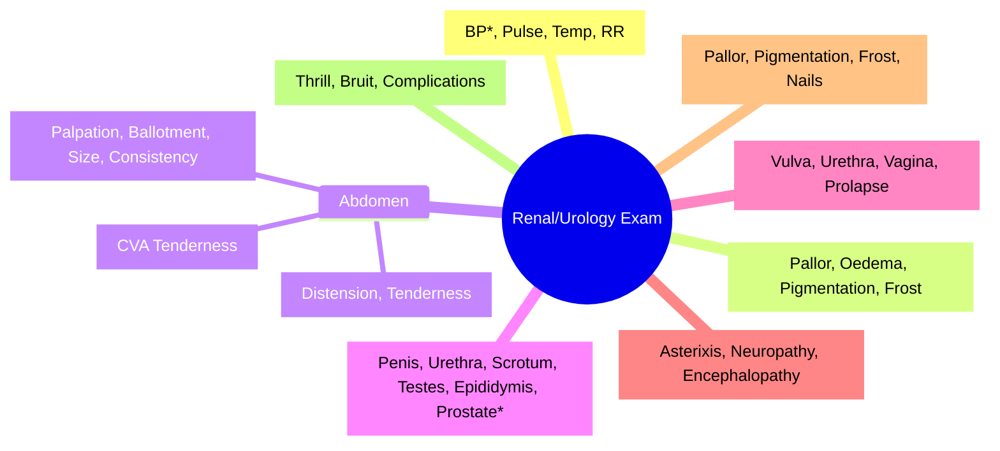

# Clinical Examination of the Kidney and Urinary Tract

**Related:** [[Functional Anatomy and Physiology of the Kidney and Urinary Tract]], [[Investigation of Renal and Urinary Tract Disease]], [[Acute Kidney Injury (AKI)]], [[Chronic Kidney Disease (CKD)]], [[Nephrology and Urology MOC]]

> [!important]
> **Systematic examination: BP (both arms), fluid status, abdomen (palpate kidneys, bladder), genitalia, DRE, neurological (uremic neuropathy), skin (pallor, pigmentation, bruising, uraemic frost). BP is the most important vital sign in renal disease.**

---

## Learning Objectives
- Perform systematic clinical examination of renal and urinary systems
- Identify key findings in renal and urological diseases
- Correlate examination findings with underlying pathology
- Apply examination findings to FCPS/MRCP clinical vignettes

---

## General Assessment

| Component | Key Points |
|-----------|------------|
| **Vital Signs** | **BP (both arms, sitting/standing)** — hypertension is both cause and consequence of renal disease; **Pulse** — tachycardia in uraemia, sepsis; **Temp** — infection (UTI, perinephric abscess); **RR** — Kussmaul breathing in metabolic acidosis |
| **General Appearance** | **Pallor** (anaemia of CKD); **Pigmentation** (uraemic, Addison's); **Oedema** (nephrotic, CKD, heart failure); **Uraemic frost** (severe uraemia); **Bruising/ecchymoses** (uraemic platelet dysfunction) |
| **Fluid Status** | **JVP** (raised in fluid overload, heart failure); **Skin turgor** (dehydration); **Peripheral oedema** (nephrotic, CCF, hepatic); **Sacral oedema** (bedbound); **Ascites** (nephrotic, hepatic, malignant) |

---

## Abdominal Examination

### Kidney Palpation
| Kidney | Technique | Normal | Abnormal Findings |
|--------|-----------|--------|-------------------|
| **Right** | Ballotment in RUQ, inspiration | Not palpable | Enlarged (PKD, hydronephrosis, RCC, infiltration), small/irregular (chronic scarring) |
| **Left** | Ballotment in LUQ, inspiration | May be palpable in thin | Enlarged (PKD, hydronephrosis, RCC, splenomegaly mimic), small/irregular |

| Finding | Significance |
|---------|--------------|
| **Ballotable kidney** | Hydronephrosis, PKD, RCC, perinephric abscess |
| **Irregular, hard, fixed** | Renal cell carcinoma, TB, amyloidosis |
| **Smooth, firm, enlarged** | Acute glomerulonephritis, early PKD, infiltration |
| **Small, irregular, contracted** | Chronic pyelonephritis, chronic glomerulonephritis, hypertensive nephrosclerosis, reflux nephropathy |

### Bladder Palpation
| Finding | Significance |
|---------|--------------|
| **Palpable bladder** | Urinary retention (outflow obstruction, neurogenic bladder), distended bladder |
| **Suprapubic tenderness** | Cystitis, acute retention, peritonitis |

### Flank Tenderness
| Location | Significance |
|----------|--------------|
| **Costovertebral angle (CVA) tenderness** | Pyelonephritis, perinephric abscess, renal infarction, ureteric colic |
| **Renal angle tenderness** | Perinephric collection, subcapsular haemorrhage |

---

## Genitourinary Examination

### Male
| Component | Key Findings |
|-----------|--------------|
| **Penis** | Hypospadias, epispadias, phimosis, balanitis, warts, ulcers (HSV, syphilis), carcinoma |
| **Urethral meatus** | Stricture (calibre), discharge (gonorrhoea, chlamydia), meatal stenosis |
| **Scrotum** | Swelling (hydrocele, hernia, tumour), erythema (Fournier's gangrene) |
| **Testes** | Size (atrophy in CKD, hypogonadism), consistency (hard = tumour), position (undescended), tenderness (epididymo-orchitis) |
| **Epididymis** | Tenderness, thickening (epididymitis, TB), nodules (tumour) |
| **Spermatic cord** | Varicocele (left > right, increases with Valsalva), hernia |

### Prostate (Digital Rectal Examination)
| Finding | Significance |
|---------|--------------|
| **Smooth, firm, non-tender, 20-30g** | Normal |
| **Smooth, firm, enlarged, non-tender** | Benign Prostatic Hyperplasia (BPH) |
| **Hard, irregular, nodular, fixed** | Prostate carcinoma |
| **Tender, boggy, warm** | Acute prostatitis |
| **Fluctuant** | Prostatic abscess |

### Female
| Component | Key Findings |
|-----------|--------------|
| **Vulva** | Atrophy (post-menopausal), ulcers (lichen sclerosus, carcinoma), warts |
| **Urethra** | Caruncle, diverticulum, stricture, discharge |
| **Vagina** | Atrophy, prolapse (cystocele, rectocele, uterine), discharge (infection) |
| **Urethral meatus** | Stricture, diversion, meatal stenosis |

---

## Neurological Examination (Uraemic Complications)

| Finding | Significance |
|---------|--------------|
| **Asterixis (flapping tremor)** | Uraemic encephalopathy, hepatic encephalopathy |
| **Peripheral neuropathy** | Sensory > motor, stocking-glove (uraemic, diabetic) |
| **Cranial nerve palsies** | Uraemic cranial neuropathy (rare) |
| **Myoclonus, seizures** | Uraemic encephalopathy |
| **Cognitive impairment** | Uraemic encephalopathy, dialysis dementia |

---

## Skin Examination (Renal Disease)

| Finding | Associated Condition |
|---------|---------------------|
| **Pallor** | Anaemia (CKD, ESRD) |
| **Hyperpigmentation** | Uraemia, Addison's, haemochromatosis |
| **Uraemic frost** | Severe uraemia (urea crystallises on skin) |
| **Ecchymoses, petechiae** | Uraemic platelet dysfunction |
| **Calcinosis cutis** | Calciphylaxis (ESRD, hyperparathyroidism) |
| **Pruritus, excoriations** | Uraemic pruritus, cholestasis |
| **Purpura, livedo reticularis** | Vasculitis, cholesterol emboli, APS |
| **Nail changes** | Half-and-half nails (Lindsay's nails = CKD), Beau's lines |

---

## Vascular Access Examination (Dialysis Patients)

| Access Type | Examination Points |
|-------------|-------------------|
| **AVF (Radiocephalic, Brachiocephalic, Brachiobasilic)** | **Thrill** (palpable), **Bruit** (continuous, machinery-like), **Maturation** (vein diameter >6mm, depth <6mm, length >6cm), **No stenosis** (no collateral veins, no arm swelling) |
| **AVG (PTFE graft)** | Thrill, bruit, signs of infection |
| **CVC (Tunnelled, Non-tunnelled)** | Exit site (infection, tunnel), patency (blood return), fibrin sheath |

| Complication | Signs |
|--------------|-------|
| **Stenosis** | Loss of thrill/bruit, prolonged bleeding post-dialysis, high venous pressure, collateral veins, arm oedema |
| **Thrombosis** | Loss of thrill/bruit, no blood return |
| **Infection** | Erythema, warmth, purulent discharge, fever, bacteraemia |
| **Aneurysm** | Pulsatile swelling, thinning skin |

---

## High-Yield FCPS/MRCP Points

> [!important]
> - **BP** measurement is the single most important examination in renal disease
> - **Ballotable kidney** = hydronephrosis, PKD, RCC
> - **Small, irregular kidneys** = chronic irreversible disease
> - **CVA tenderness** = pyelonephritis, ureteric colic
> - **DRE** mandatory in male urinary symptoms (BPH, prostate Ca)
> - **Asterixis** = uraemic/hepatic encephalopathy
> - **Uraemic frost** = severe uraemia
> - **Half-and-half nails** = CKD (Lindsay's nails)
> - **AVF thrill/bruit** = patent; loss = stenosis/thrombosis

---

## Common Confusions / Exam Traps

| Trap | Correction |
|------|------------|
| **Renal angle vs CVA tenderness** | Renal angle = perinephric; CVA = pyelonephritis/colic |
| **BPH vs Prostate Cancer** | BPH = smooth, firm, symmetric; CaP = hard, irregular, nodular |
| **Enlarged kidney = obstruction** | Also PKD, RCC, infiltration, early GN |
| **Small kidney = chronic disease** | Also congenital, vascular, reflux |
| **AVF bruit = always patent** | Early stenosis may still have bruit |
| **Uraemic frost = uraemia only** | Also in severe dehydration with high urea |

---

## Mnemonics

- **Renal exam**: **B**P, **B**allotment, **C**VA, **D**RE, **S**kin, **N**ails = **BBCDSN**
- **Kidney enlargement causes**: **P**KD, **H**ydronephrosis, **R**CC, **I**nfiltration = **PHRI**
- **Small kidney causes**: **C**hronic pyelo, **G**N, **H**ypertensive, **R**eflux = **CGHR**
- **AVF maturation**: **D**iameter >6mm, **D**epth <6mm, **L**ength >6cm = **DDL**

---

## Mind Map

---

## 24-Hour Recall Prompts
1. How to ballot kidneys? What does ballotable mean?
2. CVA tenderness vs renal angle tenderness
3. Normal prostate vs BPH vs prostate cancer on DRE
4. AVF maturation criteria (rule of 6s)
5. Asterixis — causes, mechanism
3. Uraemic frost — mechanism
4. Half-and-half nails = ?
5. CVA tenderness vs renal angle tenderness
6. AVF thrill vs bruit significance

---

## 7-Day / 15-Day / 30-Day Revision Tracker

| Day | Date | Recall (1-5) | Notes |
|-----|------|--------------|-------|
| 1   |      |              |       |
| 7   |      |              |       |
| 15  |      |              |       |
| 30  |      |              |       |

---

## Must Know / Should Know / Nice to Know

| Priority | Content |
|----------|---------|
| **Must Know 🔴** | BP measurement, kidney palpation/ballotment, CVA tenderness, DRE, AVF assessment, asterixis, uraemic frost |
| **Should Know 🟡** | Peripheral neuropathy, skin changes, bladder palpation, female GU exam |
| **Nice to Know 🟢** | Urological neurological exam, female urethral examination |

---

## MCQs (10)

1. **The single most important vital sign to measure in a patient with renal disease is:**
   A. Temperature
   B. **Blood pressure**
   C. Pulse rate
   D. Respiratory rate
   E. Oxygen saturation

2. **A ballotable kidney is most suggestive of:**
   A. Chronic glomerulonephritis
   B. **Hydronephrosis or polycystic kidney disease**
   C. Chronic pyelonephritis
   D. Renal cortical necrosis
   E. Renal artery stenosis

3. **On DRE, a hard, irregular, nodular prostate suggests:**
   A. BPH
   B. **Prostate carcinoma**
   C. Prostatitis
   D. Prostatic abscess
   D. Normal prostate

4. **CVA tenderness is classically associated with:**
   A. Renal artery stenosis
   B. Perinephric abscess
   C. **Pyelonephritis or ureteric colic**
   D. Renal cortical necrosis
   E. Renal artery thrombosis

5. **AVF maturation requires which "Rule of 6s"?**
   A. Diameter >4mm, Depth <4mm, Length >4cm
   B. **Diameter >6mm, Depth <6mm, Length >6cm**
   C. Diameter >8mm, Depth <8mm, Length >8cm
   D. Diameter >10mm, Depth <10mm, Length >10cm
   E. Diameter >12mm, Depth <12mm, Length >12cm

6. **Asterixis (flapping tremor) is most characteristic of:**
   A. Parkinson's disease
   B. **Uraemic or hepatic encephalopathy**
   C. Hyperthyroidism
   D. CO2 retention
   E. Alcohol withdrawal

6. **Uraemic frost is caused by:**
   A. Hypercalcaemia
   B. **Urea crystallising on skin from sweat**
   C. Hyperphosphataemia
   D. Secondary hyperparathyroidism
   E. Calciphylaxis

7. **Half-and-half (Lindsay's) nails are characteristic of:**
   A. Iron deficiency anaemia
   B. **Chronic kidney disease**
   C. Liver cirrhosis
   D. Congestive heart failure
   E. HIV/AIDS

8. **On DRE, a hard, irregular, nodular prostate suggests:**
   A. BPH
   B. **Prostate carcinoma**
   C. Prostatitis
   D. Cyst
   E. Normal

8. **Ballotable left kidney in a thin patient may be normal, but ballotable right kidney is more suggestive of pathology because:**
   A. Right kidney is lower
   B. **Right kidney is more posterolateral and easier to ballot when enlarged**
   C. Left kidney is protected by spleen
   D. Right kidney is larger
   E. Left kidney is never ballotable

10. **Loss of thrill and bruit in AVF suggests:**
    A. Maturation
    B. **Thrombosis or stenosis**
    C. Maturation
    D. High flow
    E. Infection

---

## SBA Questions (10)

1. **55-year-old man with CKD stage 4. On examination: BP 160/95, pale conjunctivae, bilateral pedal oedema. Abdominal exam: right kidney ballotable, left kidney not palpable. Most likely diagnosis:**
   A. Chronic glomerulonephritis
   B. **Autosomal dominant polycystic kidney disease (ADPKD)**
   C. Bilateral renal artery stenosis
   C. Chronic pyelonephritis
   E. Renal amyloidosis

2. **65-year-old man with LUTS. DRE: prostate 40g, smooth, firm, non-tender, median sulcus present. PSA 3.5 ng/mL. Most likely diagnosis:**
   A. Prostate cancer
   B. **Benign Prostatic Hyperplasia (BPH)**
   C. Prostatitis
   D. Prostatic abscess
   E. Normal prostate

3. **70-year-old woman with AKI. On exam: asterixis present. This sign indicates:**
   A. Hepatic encephalopathy only
   B. **Uraemic (or hepatic) encephalopathy**
   C. Parkinsonism
   D. CO2 narcosis
   E. Hypercapnic respiratory failure

4. **45-year-old man on haemodialysis via AVF. Arm swollen, dilated collateral veins, no thrill/bruit. Most likely complication:**
   A. Infection
   B. **Stenosis or thrombosis of AVF**
   C. Aneurysm
   D. High output cardiac failure
   E. Steal syndrome

5. **30-year-old man with loin pain. CVA tenderness on right. Urine dipstick: blood++, protein+. Most likely:**
   A. Pyelonephritis
   B. **Ureteric colic (renal colic)**
   C. Renal cortical necrosis
   D. Renal artery thrombosis
   E. RCC

6. **72-year-old man on haemodialysis. AVF at wrist: thrill and bruit present, but arm swollen with collaterals. Best next step:**
   A. Anticoagulation
   B. **Refer for fistulogram/angioplasty (suspected stenosis)**
   C. Ligature
   D. Create new AVF
   D. Anticoagulation

7. **DRE in 60-year-old man: prostate hard, irregular, fixed, right lobe nodule. PSA 25 ng/mL. Next step:**
   A. TRUS biopsy
   B. **TRUS biopsy + MRI prostate + bone scan (staging)**
   C. MRI only
   D. Start androgen deprivation
   E. Palliative care

8. **50-year-old woman with recurrent UTIs. Suprapubic tenderness on palpation. Best initial investigation:**
   A. CT urogram
   B. **Urine culture + sensitivity**
   C. Cystoscopy
   D. Ultrasound KUB
   E. IVU

9. **Patient on HD via AVF. Pre-dialysis: thrill present, bruit continuous. Post-dialysis: thrill absent, bruit absent. Most likely:**
   A. AVF thrombosis
   B. **AVF stenosis (loss of thrill/bruit after dialysis = outflow stenosis)**
   C. AVF maturation
   D. Access recirculation
   E. Cardiac failure

10. **12-year-old boy with nephrotic syndrome. ON exam: bilateral pitting oedema, ascites. Nail finding characteristic of CKD:**
    A. Clubbing
    B. **Half-and-half (Lindsay's) nails**
    C. Koilonychia
    D. Beau's lines
    E. Splinter haemorrhages

---

## Flashcards

- Q: Most important vital sign in renal disease?
  A: Blood pressure

- Q: Ballotable kidney = ?
  A: Hydronephrosis or PKD (or RCC)

- Q: CVA tenderness = ?
  A: Pyelonephritis or ureteric colic

- Q: AVF maturation rule of 6s?
  A: Diameter >6mm, Depth <6mm, Length >6cm

- Q: DRE prostate cancer?
  A: Hard, irregular, nodular, fixed

- Q: DRE BPH?
  A: Smooth, firm, symmetrical, non-tender, median sulcus present

- Q: Asterixis = ?
  A: Uraemic/hepatic encephalopathy

- Q: Uraemic frost mechanism?
  A: Urea crystallising from sweat

- Q: Half-and-half nails = ?
  A: CKD (Lindsay's nails)

- Q: AVF thrill/bruit loss?
  A: Thrombosis or stenosis

---

## Answer Key with Explanations

### MCQs
1. **B** — BP is the single most important vital sign in renal disease
2. **B** — Ballotable = hydronephrosis, PKD, RCC (enlarged, mobile kidney)
3. **B** — Hard, irregular, nodular = prostate cancer
4. **C** — CVA tenderness = pyelonephritis or ureteric colic
5. **B** — Rule of 6s: diameter >6mm, depth <6mm, length >6cm
6. **B** — Asterixis = uraemic/hepatic encephalopathy (flapping tremor)
7. **B** — Urea in sweat crystallises on skin = uraemic frost
8. **B** — Half-and-half (Lindsay's) nails = CKD
9. **B** — Repeated for emphasis: hard, irregular = CaP
10. **B** — Right kidney more posterolateral, easier to ballot when enlarged
11. **B** — Loss of thrill/bruit = thrombosis or stenosis

### SBAs
1. **B** — Bilateral ballotable kidneys + CKD + family history = ADPKD
2. **B** — Smooth, firm, non-tender, enlarged with sulcus = BPH
3. **B** — Asterixis = uraemic encephalopathy (CKD 4/5)
4. **B** — Swollen arm + collaterals + loss of thrill/bruit = outflow stenosis
5. **B** — CVA tenderness + haematuria = ureteric colic (stone)
6. **B** — Swollen arm + collaterals + loss of thrill = stenosis → fistulogram + angioplasty
7. **B** — Hard, irregular prostate + PSA 25 → TRUS biopsy + staging (MRI/bone scan)
8. **B** — Suprapubic tenderness + recurrent UTI → urine culture first
9. **B** — Loss of thrill/bruit POST-dialysis = outflow stenosis (post-dialysis venous pressure drop)
10. **B** — Lindsay's nails = half-and-half = CKD/nephrotic syndrome

---

## Summary

**Clinical Examination of the Kidney and Urinary Tract** is a **Must Know 🔴** topic.
**Key takeaway:** Systematic exam: BP → fluid status → abdomen (kidneys, bladder, CVA) → GU (male/female) → neuro (asterixis) → skin (pallor, frost, nails) → vascular access (AVF). BP is #1 vital sign. Ballotable kidney = obstruction/PKD. CVA tenderness = pyelo/colic. DRE: BPH vs CaP. AVF: thrill/bruit = patent; loss = stenosis/thrombosis. Asterixis = uraemic encephalopathy. Uraemic frost = urea in sweat. Half-and-half nails = CKD.
**Exam focus:** BP, ballotment, CVA, DRE, AVF assessment, asterixis, skin/nail signs.
**Clinical relevance:** Bedside diagnosis of AKI, CKD, obstruction, infection, dialysis access complications.