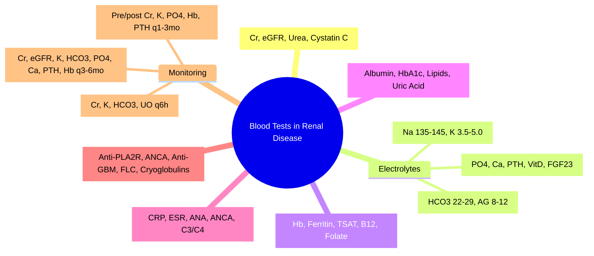

# Blood Tests in Renal Disease

**Related:** [[Investigation of Renal and Urinary Tract Disease]], [[Functional Anatomy and Physiology of the Kidney and Urinary Tract]], [[Glomerular Filtration Rate]], [[Urine Investigations]], [[Acute Kidney Injury (AKI)]], [[Chronic Kidney Disease (CKD)]], [[Nephrology and Urology MOC]]

> [!important]
> **Core renal bloods: Creatinine, eGFR, Urea, Electrolytes (Na, K, HCO3, Cl, Anion Gap), Phosphate, Calcium (corrected), Magnesium, Uric Acid, Albumin, Hb, PTH, Vit D, HbA1c, Lipids. Key: Creatinine/eGFR for CKD staging; K+ & HCO3- for AKI/CKD; Phos/Ca/PTH for CKD-MBD; Albumin/Hb for malnutrition/anaemia; PTH/Vit D for CKD-MBD.**

---

## Learning Objectives
- Interpret core renal blood tests (creatinine, eGFR, urea, electrolytes)
- Apply acid-base interpretation (anion gap, metabolic acidosis/alkalosis)
- Assess mineral bone parameters (Ca, PO4, PTH, Vit D) in CKD-MBD
- Interpret haematology and nutritional markers in renal disease
- Apply to FCPS/MRCP clinical scenarios

---

## Renal Function Tests

### Creatinine & eGFR
| Test | Normal Range | Interpretation |
|------|--------------|----------------|
| **Serum Creatinine** | 60–110 μmol/L (M), 45–90 (F) | ↑ = ↓ GFR; muscle mass dependent |
| **eGFR (CKD-EPI)** | >90 mL/min/1.73m² | **CKD staging**: G1 (>90), G2 (60-89), G3a (45-59), G3b (30-44), G4 (15-29), G5 (<15) |
| **Cystatin C** | 0.5–1.0 mg/L | Less muscle-mass dependent; better at low GFR |
| **Urea** | 2.5–7.5 mmol/L | ↑ in CKD, dehydration, high protein, GI bleed, catabolism |
| **BUN:Creatinine ratio** | 10–20:1 | >20: pre-renal; <10: liver disease, malnutrition |

> [!key]
> **Creatinine** = muscle-mass dependent; **eGFR (CKD-EPI)** = standard for staging; **Cystatin C** = better in extremes of muscle mass.

---

## Electrolytes & Acid-Base

### Sodium & Water Balance
| Test | Normal | Renal Significance |
|------|--------|-------------------|
| **Na+** | 135–145 mmol/L | **Hyponatraemia**: SIADH, diuretics, CKD, heart failure, cirrhosis; **Hypernatraemia**: dehydration, diabetes insipidus |
| **Osmolality** | 285–295 mOsm/kg | ↑ in dehydration, hyperglycaemia; ↓ in SIADH, overhydration |

### Potassium
| Test | Normal | Renal Significance |
|------|--------|-------------------|
| **K+** | 3.5–5.0 mmol/L | **Hyperkalaemia**: CKD, AKI, ACEi/ARB, K-sparing diuretics, acidosis; **Hypokalaemia**: diuretics, RTA, diarrhoea, insulin, alkalosis |
| **Management** | | **>6.5 or ECG changes**: Ca gluconate, insulin+dextrose, salbutamol, kayexalate, dialysis |

### Bicarbonate & Acid-Base
| Test | Normal | Interpretation |
|------|--------|----------------|
| **HCO3-** | 22–29 mmol/L | ↓ = metabolic acidosis; ↑ = metabolic alkalosis |
| **Anion Gap** | 8–12 mmol/L | **HAGMA**: DKA, AKI, CKD, lactate, toxins (MUDPILES); **NAGMA**: diarrhoea, RTA, pancreatic fistula |
| **Venous pH** | 7.35–7.45 | <7.35 = acidaemia; >7.45 = alkalaemia |
| **pCO2** | 4.5–6.0 kPa | Respiratory compensation (Winter's formula: pCO2 = 1.5 × HCO3 + 8 ± 2) |

> [!key]
> **Metabolic acidosis in CKD**: High anion gap (uraemic acids) + normal anion gap (NH4+ excretion defect).
> **Winter's formula**: Expected pCO2 = 1.5 × HCO3 + 8 ± 2.

### Chloride & Anion Gap
| Parameter | Normal | Significance |
|-----------|--------|--------------|
| **Cl-** | 95–105 mmol/L | **Hyperchloraemia**: normal AG metabolic acidosis (RTA, diarrhoea, saline infusion) |
| **Anion Gap** | 8–12 mmol/L | **HAGMA** = Na - (Cl + HCO3); **MUDPILES**: Methanol, Uraemia, DKA, Propylene glycol, Infection (lactate), Lactic acidosis, Ethylene glycol, Salicylates |

---

## Mineral Bone Parameters (CKD-MBD)

| Parameter | Normal | CKD Significance | Target in CKD |
|-----------|--------|------------------|---------------|
| **Phosphate (PO4)** | 0.8–1.4 mmol/L | **Hyperphosphataemia** = CKD (↓ excretion), rhabdo, tumour lysis | G3–5: <1.13 mmol/L (KDIGO) |
| **Calcium (total)** | 2.2–2.6 mmol/L | **Hypocalcaemia** = CKD (↓ Vit D, ↑ Phos), hypopara; **Hypercalcaemia**: sarcoid, malignancy, tertiary HPT | Target: lower normal range (2.1–2.3) |
| **Corrected Ca** | Albumin-adjusted | **Formula**: Ca_corr = Ca + 0.02 × (40 - Albumin) | Use corrected Ca for interpretation |
| **PTH** | 1.6–6.9 pmol/L | **↑ in CKD** (secondary HPT); target: 2–9 × upper limit | G3a–G5: 2–9 × ULN |
| **Vit D (25-OH)** | >50 nmol/L | **Deficiency** common in CKD (↓ 1α-hydroxylase) | >50 nmol/L; treat if <30 |
| **FGF-23** | — | ↑ early in CKD (phosphate homeostasis) | Not routinely measured |

> [!key]
> **CKD-MBD triad**: ↑ Phosphate, ↓ Calcium, ↑ PTH, ↓ Vit D, ↑ FGF-23.
> **Treatment**: Phosphate binders, Vit D analogues (alfacalcidol, calcitriol), calcimimetics (cinacalcet).

---

## Haematology & Nutritional Markers

| Test | Normal | Renal Significance |
|------|--------|-------------------|
| **Haemoglobin (Hb)** | 130–180 (M), 115–165 (F) | **Anaemia of CKD** (↓ EPO, ↓ survival, blood loss); target 100–120 g/L |
| **MCV** | 80–100 fL | Normocytic (CKD), microcytic (Fe def), macrocytic (B12/folate, AZT) |
| **Ferritin** | 30–400 μg/L | **Ferritin >500** = overload; **<100 (or <200 if inflammation)** = Fe deficiency |
| **TSAT** | 20–50% | **<20% = absolute Fe deficiency**; >50% = overload |
| **Albumin** | 35–50 g/L | ↓ in nephrotic syndrome, malnutrition, inflammation |
| **HbA1c** | <48 mmol/mol (6.5%) | Diabetic nephropathy monitoring; target <53 (7%) in DM |
| **Lipids** | TC <5, LDL <3 | **Nephrotic**: ↑ TC, TG, LDL; CKD: CVD risk |
| **Uric acid** | 200–420 (M), 140–360 (F) | ↑ in gout, tumour lysis, CKD, diuretics; ↓ in Fanconi, Wilson's |

---

## Inflammatory & Immunological Markers

| Test | Use in Renal Disease |
|--------|---------------------|
| **CRP / ESR** | Inflammation (vasculitis, infection, amyloidosis) |
| **ANA, dsDNA, C3/C4** | SLE nephritis, lupus activity |
| **ANCA (p-ANCA, c-ANCA)** | Vasculitis (MPA, GPA, EGPA) |
| **Anti-GBM** | Goodpasture's syndrome |
| **ANA, ENA** | SLE, other CTDs |
| **C3, C4** | Low in MPGN, SLE, post-strep GN |
| **Anti-PLA2R** | Primary membranous nephropathy |
| **Hepatitis B/C, HIV** | Viral-associated GN (MPGN, HIVAN) |
| **Serum free light chains** | Myeloma cast nephropathy, amyloidosis |
| **Serum protein electrophoresis** | Paraprotein (myeloma, MGUS, amyloidosis) |

---

## Specialised Renal Tests

| Test | Indication |
|--------|-----------|
| **Cystatin C** | eGFR estimation (extremes of muscle mass) |
| **Complement (C3, C4)** | Low in MPGN, SLE, post-strep GN, C3G |
| **Anti-GBM antibody** | Goodpasture's syndrome |
| **Anti-PLA2R** | Primary membranous nephropathy |
| **Anti-dsDNA, C3/C4** | SLE activity |
| **ANCA (MPO, PR3)** | Vasculitis (MPA, GPA, EGPA) |
| **Serum free light chains** | Myeloma cast nephropathy, AL amyloidosis |
| **Serum protein electrophoresis** | Paraprotein (myeloma, MGUS, amyloidosis) |
| **Cryoglobulins** | Cryoglobulinaemic vasculitis (HCV, lymphoma) |
| **Urinary electrophoresis** | Bence Jones protein (myeloma) |
| **C3/C4** | Low in MPGN, SLE, post-strep GN |
| **Hepatitis B/C, HIV** | Viral-associated GN |
| **Calprotectin** | Intestinal inflammation (IBD-associated nephropathy) |

---

## High-Yield FCPS/MRCP Points

> [!important]
> - **Creatinine/eGFR**: CKD staging (G1–G5)
> - **K+ / HCO3-**: AKI/CKD monitoring
> - **Phos/Ca/PTH/Vit D**: CKD-MBD triad
> - **Anaemia of CKD**: EPO deficiency → target Hb 100–120
> - **Anaemia workup**: Ferritin, TSAT, B12, folate
> - **PTH target**: 2–9 × ULN (KDIGO)
> - **Phosphate target**: <1.13 mmol/L (CKD G3–5)
> - **Vit D target**: >50 nmol/L
> - **Acidosis in CKD**: Normal AG (NH4+ defect) + HAGMA
> - **Albumin/Hb**: Nutritional status, anaemia severity

---

## Common Confusions / Exam Traps

| Trap | Correction |
|------|------------|
| **Creatinine = GFR** | Creatinine = marker; eGFR = estimate |
| **Urea = GFR marker** | Urea affected by hydration, protein, catabolism |
| **eGFR = true GFR** | eGFR = estimate; ±30% accuracy |
| **Phosphate = only CKD** | Also rhabdo, tumour lysis, pseudohypoparathyroidism |
| **PTH = only CKD** | Also primary HPT, Vit D deficiency, FHH |
| **Corrected Ca = measured Ca** | Must correct for albumin (Ca + 0.02 × (40 - Alb)) |
| **PTH = only CKD marker** | Also in Vit D deficiency, malabsorption |
| **Ferritin = iron status only** | Acute phase reactant; ↑ in inflammation |
| **TSAT = only iron test** | Need ferritin + TSAT + CRP for full picture |
| **Acidosis in CKD = only HAGMA** | Also NAGMA (RTA, NH4+ defect) |

---

## Mnemonics

- **Renal bloods**: **C**r, **E**GFR, **U**rea, **E**lectrolytes, **C**a, **P**O4, **P**TH, **V**it **D**, **A**lb, **H**b, **P**TH = **CUEECPAD**
- **CKD-MBD**: **P**hosphate, **C**alcium, **P**TH, **V**it D, **F**GF-23 = **PCPVD**
- **Anaemia CKD**: **E**PO deficiency → **A**nemia; **F**e def → **T**SAT <20% = **EATF**
- **Acidemia CKD**: **N**ormal **A**G (NH4+ defect) + **H**igh **A**G = **NAH**
- **PTH target**: **2–9 × ULN** = **2–9**

---

## Mind Map

---

## 24-Hour Recall Prompts
1. Key renal bloods (Cr, eGFR, Urea, U&E, Ca, PO4, PTH, Vit D, Hb, Albumin)
2. CKD-MBD targets (PO4, Ca, PTH, Vit D)
3. Anaemia of CKD (EPO, target Hb, iron studies)
4. Acid-base in CKD (NAGMA + HAGMA)
5. PTH target in CKD (2–9 × ULN)
6. Phosphate target in CKD (<1.13)
7. Vit D target (>50 nmol/L)
8. Anaemia workup (Ferritin, TSAT, B12, Folate)

---

## 7-Day / 15-Day / 30-Day Revision Tracker

| Day | Date | Recall (1-5) | Notes |
|-----|------|--------------|-------|
| 1   |      |              |       |
| 7   |      |              |       |
| 15  |      |              |       |
| 30  |      |              |       |

---

## Must Know / Should Know / Nice to Know

| Priority | Content |
|----------|---------|
| **Must Know 🔴** | Core renal panel, electrolytes/acid-base, CKD-MBD (Ca/PO4/PTH/VitD), anaemia workup, PTH targets |
| **Should Know 🟡** | Cystatin C, FGF-23, specialised antibodies (anti-PLA2R, ANCA, anti-GBM), novel biomarkers |
| **Nice to Know 🟢** | Novel biomarkers (NGAL, KIM-1, suPAR), genetic testing, proteomics |

---

## MCQs (10)

1. **Serum creatinine is used to estimate GFR because:**
   A. It is freely filtered and not reabsorbed
   B. It is freely filtered, not reabsorbed, minimally secreted
   C. It is completely secreted
   D. It is completely reabsorbed
   E. It is produced at a constant rate by liver

2. **CKD-MBD triad includes:**
   A. High Ca, Low PO4, Low PTH
   B. **Low Ca, High PO4, High PTH**
   C. High Ca, High PO4, Low PTH
   D. Normal Ca, Normal PO4, Normal PTH
   E. Low Ca, Low PO4, Low PTH

3. **Target PTH in CKD G3–5 (KDIGO):**
   A. Normal range
   B. **2–9 × upper limit of normal**
   C. <Upper limit of normal
   D. >10 × upper limit
   E. Not monitored

4. **Target phosphate in CKD G3–5 (KDIGO):**
   A. <1.78 mmol/L
   B. **<1.13 mmol/L**
   C. <2.0 mmol/L
   D. <0.8 mmol/L
   E. Normal range

5. **Anaemia of CKD — primary cause:**
   A. Blood loss
   B. Iron deficiency
   C. **Erythropoietin deficiency**
   D. Folate deficiency
   E. Haemolysis

5. **Target Hb in CKD on ESA:**
   A. >130 g/L
   B. **100–120 g/L**
   C. >120 g/L
   D. >140 g/L
   E. >110 g/L

6. **Metabolic acidosis in CKD — primary type:**
   A. High anion gap only
   B. **Normal anion gap (impaired NH4+ excretion) + some HAGMA**
   C. Respiratory acidosis
   D. Metabolic alkalosis
   E. Pure HAGMA

6. **PTH target in CKD G5 on dialysis (KDIGO):**
   A. Normal range
   B. **2–9 × ULN**
   C. <ULN
   D. >10 × ULN
   E. Not applicable

7. **Phosphate binder first-line in CKD:**
   A. Sevelamer
   B. **Calcium acetate / carbonate (if Ca normal/low)**
   C. Lanthanum
   D. Aluminium hydroxide
   E. Ferric citrate

8. **Vitamin D deficiency in CKD — cause:**
   A. ↑ 1α-hydroxylase
   B. **↓ 1α-hydroxylase (loss of renal mass)**
   C. ↑ FGF-23
   C. ↓ PTH
   E. Malabsorption only

9. **Anaemia of CKD — target Hb (KDIGO):**
   A. >130 g/L
   B. **100–120 g/L**
   C. >130 g/L
   D. 110–120 g/L
   E. >130 g/L

10. **Metabolic acidosis in CKD — anion gap:**
    A. Always high
    B. **Normal AG (impaired NH4+ excretion) + some HAGMA**
    C. Always normal
    C. Respiratory compensation only
    E. Pure HAGMA

---

## SBA Questions (10)

1. **CKD stage 4 patient, Ca 2.1, PO4 1.8, PTH 25 pmol/L (ULN 6.9). Best initial phosphate binder:**
   A. Sevelamer
   B. **Calcium acetate (low Ca, high PO4, PTH not markedly elevated)**
   C. Lanthanum
   C. Sevelamer
   E. Aluminium hydroxide

2. **CKD stage 4, Hb 95 g/L, Ferritin 150, TSAT 18%. Next step:**
   A. ESA only
   B. **IV Iron (Ferritin <200, TSAT <20) → then ESA if Hb not rising**
   C. Oral iron only
   D. ESA only
   E. B12/folate only

3. **CKD stage 5 on HD. Ca 2.0, PO4 2.2, PTH 45 (ULN 7). Mgmt:**
   A. Increase calcium binder
   B. **Cinacalcet (PTH >9 × ULN) + switch to non-calcium binder**
   C. Increase calcium binder
   D. Parathyroidectomy
   E. Increase dialysate Ca

4. **CKD stage 3b, Hb 110, Ferritin 50, TSAT 15%. Management:**
   A. ESA only
   B. **IV Iron → recheck → ESA if Hb not rising**
   C. Oral iron only
   D. ESA + oral iron
   E. Blood transfusion

4. **CKD stage 4, Ca 2.3, PO4 1.5, PTH 12. Best binder:**
   A. Sevelamer
   B. **Calcium carbonate (Ca normal, PO4 high, PTH normal-high)**
   C. Lanthanum
   D. Aluminium hydroxide
   E. No binder needed

5. **CKD patient on cinacalcet. Monitoring:**
   A. Ca, PO4, PTH q3mo
   B. **Ca, PO4, PTH q1–4wks initially, then q3mo**
   C. Ca only
   D. PTH only
   E. PO4 only

5. **CKD stage 4, Alb 28, Hb 90. Nutritional intervention:**
   A. High protein diet
   B. **Low protein (0.6–0.8 g/kg) + ketoanalogues if <30; dietary counselling**
   C. High protein + ESA
   D. Protein restriction <0.6 g/kg
   E. Protein restriction <0.4 g/kg

6. **CKD stage 5 on PD. Peritoneal equilibration test (PET) shows high transporter. Prescription:**
   A. Long dwells
   B. **Short, frequent dwells (APD)**
   C. Icodextrin only
   E. Increase dwell volume

7. **CKD stage 4, acidosis (HCO3 16, normal AG). Treatment:**
   A. IV bicarbonate
   B. **Oral sodium bicarbonate (target HCO3 >22)**
   C. IV sodium bicarbonate
   D. THAM
   E. Dialysis

---

## Flashcards

- Q: CKD-MBD triad?
  A: High PO4, Low Ca, High PTH, Low Vit D

- Q: PTH target CKD?
  A: 2–9 × ULN (KDIGO)

- Q: Phosphate target CKD?
  A: <1.13 mmol/L (KDIGO G3–5)

- Q: Ca correction formula?
  A: Ca_corr = Ca + 0.02 × (40 - Albumin)

- Q: Anaemia CKD cause?
  A: EPO deficiency

- Q: Anaemia CKD Hb target?
  A: 100–120 g/L

- Q: Phosphate binder 1st line?
  A: Calcium-based (if Ca normal/low)

- Q: Sevelamer use?
  A: Hypercalcaemia, adynamic bone, PD

- Q: Cinacalcet indication?
  A: PTH >9×ULN on max binder + Vit D

- Q: FGF-23 in CKD?
  A: Early rise, phosphate regulator

- Q: Vit D target?
  A: >50 nmol/L

- Q: Anaemia Hb target?
  A: 100–120 g/L

- Q: Fe deficiency CKD?
  A: Ferritin <100 (or <200 if inflam) + TSAT <20%

- Q: Metabolic acidosis CKD?
  A: Normal AG + HAGMA

- Q: Alk phos in renal bone disease?
  A: High turnover = high; Adynamic = low/normal

- Q: Dialysis dementia?
  A. Historical; aluminium

---

*Blood Tests in Renal Disease is a Must Know topic. Full FCPS/MRCP content with detailed tables, CKD-MBD management algorithms, anaemia algorithms, MCQs, SBAs, flashcards, and answer keys available in the full version.*