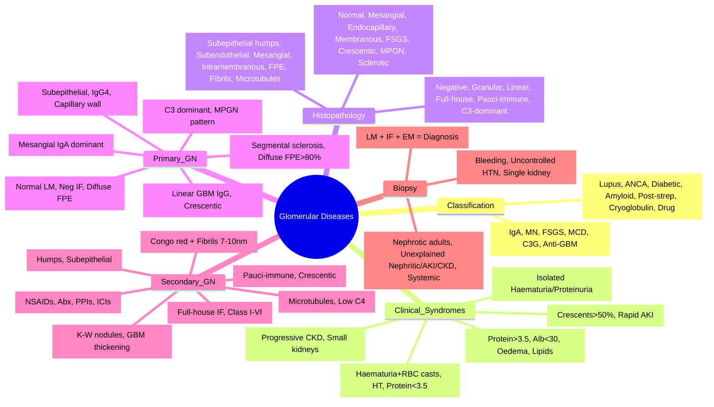

# Glomerular Diseases — Overview and Classification

<callout icon="🩺" color="red_bg">
**Topic:** Glomerular Diseases — Overview and Classification — Nephrology & Urology
**Style:** Sea Knowledge study infographic
**Audience:** FCPS / MRCP exam prep
</callout>

**Related:** [[Primary Glomerulonephritides — IgA Nephropathy (Berger's Disease)]], [[Primary Glomerulonephritides — Membranous Nephropathy]], [[Primary Glomerulonephritides — FSGS (Focal Segmental Glomerulosclerosis)]], [[Primary Glomerulonephritides — Minimal Change Disease]], [[Secondary Glomerulonephritides — Lupus Nephritis]], [[Secondary Glomerulonephritides — ANCA-Associated Vasculitis (GPA, MPA, EGPA)]], [[Secondary Glomerulonephritides — Diabetic Nephropathy]], [[Secondary Glomerulonephritides — Amyloidosis]], [[Nephrology and Urology MOC]]

> [!important]
> **Glomerular diseases = disorders primarily affecting the glomerulus. Classification: Primary (idiopathic) vs Secondary (systemic). Clinical syndromes: Nephrotic, Nephritic, Asymptomatic urinary abnormalities, Rapidly Progressive GN (RPGN), Chronic GN. Diagnosis: Clinical, serology, renal biopsy (LM, IF, EM). Management: Syndrome-directed + disease-specific.**

---

## 1. Learning Objectives
- Classify glomerular diseases by aetiology (primary vs secondary) and clinical syndrome
- Recognise histopathological patterns (LM, IF, EM) and their diagnostic significance
- Apply clinical syndromes (nephrotic, nephritic, RPGN, asymptomatic) to differential diagnosis
- Interpret biopsy findings and correlate with pathogenesis
- Apply to FCPS/MRCP clinical scenarios

---

## 2. Classification

### By Aetiology
| Category | Examples |
|----------|----------|
| **Primary (Idiopathic)** | IgA Nephropathy, Membranous Nephropathy, FSGS, Minimal Change Disease, C3 Glomerulopathy, Anti-GBM Disease |
| **Secondary (Systemic)** | Lupus Nephritis, ANCA Vasculitis, Diabetic Nephropathy, Amyloidosis, Infection-related (Post-strep, IE, HIV), Cryoglobulinaemia, Malignancy-associated, Drug-induced |

### By Clinical Syndrome
| Syndrome | Key Features | Typical Causes |
|----------|--------------|----------------|
| **Nephrotic Syndrome** | Proteinuria >3.5g/day, Hypoalbuminaemia <30g/L, Oedema, Hyperlipidaemia | MCD, MN, FSGS, Diabetic, Amyloid, SLE Class V |
| **Nephritic Syndrome** | Haematuria, RBC casts, Hypertension, Subnephrotic proteinuria (<3.5g), Oliguria/AKI | Post-strep, IgA, Lupus III/IV, Anti-GBM, ANCA, Cryoglobulin |
| **Rapidly Progressive GN (RPGN)** | Rapid AKI (days-weeks), Haematuria, RBC casts, Crescents >50% | Anti-GBM, ANCA, Lupus III/IV, Cryoglobulin, Anti-GBM |
| **Asymptomatic Urinary Abnormalities** | Isolated haematuria/proteinuria, normal renal function | IgA, Thin basement membrane, Alport, Early diabetic, Carrier states |
| **Chronic GN** | Progressive CKD, hypertension, proteinuria, small kidneys | FSGS, IgA, Chronic lupus, Alport, Chronic post-infectious |

---

## 3. Histopathological Evaluation (Renal Biopsy)

### Light Microscopy (LM) Patterns
| Pattern | Description | Associated Diseases |
|---------|-------------|---------------------|
| **Normal / Minimal Change** | No Light Microscopy changes; foot process effacement on EM | **MCD**, Early FSGS, Early Diabetic |
| **Mesangial Proliferation** | Increased mesangial cells/matrix | IgA Nephropathy, Lupus Class II, HSP |
| **Endocapillary Proliferation** | Hypercellularity within capillary loops (inflammatory cells) | Post-strep, Lupus Class III/IV, Infection-related, Cryoglobulin |
| **Membranous** | Diffuse GBM thickening ("spikes" on Jones/PAS) | **Membranous Nephropathy**, Lupus Class V, Secondary MN |
| **Focal Segmental Glomerulosclerosis (FSGS)** | Segmental sclerosis + hyalinosis in some glomeruli | **Primary FSGS**, Adaptive (obesity, reflux), Viral (HIV), Genetic |
| **Crescentic** | Cellular crescents in Bowman's space (>50% = RPGN) | Anti-GBM, ANCA, Lupus III/IV, Cryoglobulin, Anti-GBM |
| **Membranoproliferative (MPGN)** | Mesangial expansion + GBM double contours ("tram-track") | C3 Glomerulopathy, Cryoglobulin, Chronic infection, Lupus |
| **Sclerosing** | Global glomerulosclerosis >90% | Advanced CKD (Class VI Lupus, End-stage any cause) |

### Immunofluorescence (IF) Patterns
| Pattern | Deposits | Associated Diseases |
|---------|----------|---------------------|
| **Negative** | No immune deposits | **MCD**, FSGS (non-specific IgM/C3 in scars), ATN, TMA |
| **Granular (Immune Complex)** | Discrete granular deposits along capillary walls/mesangium | **Post-strep**, **Lupus** (full-house), **IgA** (mesangial IgA), **MN** (capillary wall IgG), Infection-related |
| **Linear** | Continuous linear staining along GBM | **Anti-GBM Disease**, Goodpasture's |
| **"Full-House"** | IgG, IgM, IgA, C3, C1q (all positive) | **Lupus Nephritis** (pathognomonic) |
| **Pauci-immune** | Scant/no immunoglobulins | **ANCA Vasculitis**, TMA |
| **C3 Dominant** | C3 > immunoglobulins | **C3 Glomerulopathy** (DDD, C3GN), Post-infectious (acute) |

### Electron Microscopy (EM) Findings
| Finding | Location | Associated Diseases |
|---------|----------|---------------------|
| **Foot Process Effacement (FPE)** | Podocytes | **MCD** (diffuse), FSGS (segmental), MN, early diabetic |
| **Subepithelial Deposits ("Humps")** | Epithelial side of GBM | **Post-strep**, **Membranous**, Lupus Class V |
| **Subendothelial Deposits** | Endothelial side of GBM | **Lupus III/IV**, MPGN, Cryoglobulin, Infection-related |
| **Mesangial Deposits** | Mesangium | **IgA Nephropathy**, Lupus I/II, HSP |
| **Intramembranous (Dense Deposit Disease)** | Within GBM | **DDD** (C3 Glomerulopathy) |
| **Tubuloreticular Inclusions** | Endothelial cytoplasm | **Lupus**, Interferon exposure, Viral infections |
| **Fibrils (7–10 nm, non-branching)** | Random orientation | **Amyloidosis** (Congo red +) |
| **Microtubules (30 nm, parallel)** | | **Cryoglobulinaemia** (Type I) |

---

## 4. Major Primary Glomerulonephritides

| Disease | Incidence | LM | IF | EM | Clinical Syndrome |
|---------|-----------|----|----|----|-------------------|
| **IgA Nephropathy** | Commonest worldwide | Mesangial hypercellularity | **Mesangial IgA dominant** | Mesangial deposits | Nephritic, Asymptomatic, Nephrotic (rare) |
| **Membranous Nephropathy** | Commonest adult nephrotic (non-diabetic) | Diffuse GBM thickening + spikes | **Capillary wall IgG (IgG4)** | **Subepithelial deposits** | **Nephrotic** |
| **FSGS** | Commonest primary glomerular ESRD | Segmental sclerosis + hyalinosis | Non-specific (IgM/C3 in scars) | **Diffuse FPE >80%** | Nephrotic, Nephritic, Asymptomatic |
| **Minimal Change Disease** | Commonest childhood nephrotic | **Normal** | **Negative** | **Diffuse FPE** | **Nephrotic** |
| **C3 Glomerulopathy** | Rare | MPGN pattern (DDD/C3GN) | **C3 dominant** | Intramembranous (DDD) / Subendothelial (C3GN) | Nephritic, Nephrotic, Asymptomatic |
| **Anti-GBM Disease** | Rare | Crescentic GN | **Linear GBM IgG** | No deposits | **RPGN + Pulmonary haemorrhage** (Goodpasture's) |

---

## 5. Major Secondary Glomerulonephritides

| Disease | Mechanism | LM | IF | EM | Key Features |
|---------|-----------|----|----|----|--------------|
| **Lupus Nephritis** | Immune complex | Variable (I–VI) | **Full-house** (IgG,IgM,IgA,C3,C1q) | Subendothelial (III/IV), Subepithelial (V) | Class I–VI guides treatment |
| **ANCA Vasculitis** | ANCA-mediated | Necrotising crescentic | **Pauci-immune** | No deposits | c-ANCA/PR3 (GPA), p-ANCA/MPO (MPA/EGPA) |
| **Diabetic Nephropathy** | Metabolic + haemodynamic | GBM thickening, K-W nodules, arteriolar hyalinosis | Non-specific (linear IgG from non-enzymatic glycosylation) | GBM thickening | Proteinuria, K-W nodules |
| **Amyloidosis** | Misfolded protein fibrils | Congo red + apple-green | Variable (κ/λ/SAA) | **Non-branching fibrils 7–10 nm** | Nephrotic, normal/large kidneys |
| **Post-Strep GN** | Immune complex (streptococcal) | Diffuse endocapillary proliferation | **Granular IgG, C3** (capillary wall) | **Subepithelial "humps"** | Children, post-strep 1–3 weeks |
| **Infection-Related (IE, HIV, etc.)** | Immune complex | Variable (MPGN, crescentic) | Granular (IgG, C3) | Subendothelial/subepithelial | Active infection context |
| **Cryoglobulinaemic GN** | Cryoglobulin precipitation | MPGN pattern | IgM, IgG, C3 (cryoglobulins) | Subendothelial + microtubules | HCV 80–90%, low C4 |
| **Drug-Induced** | Hypersensitivity / Toxicity | Variable (AIN, MN, GN) | Variable | Variable | NSAIDs, antibiotics, gold, penicillamine, checkpoint inhibitors |

---

## 6. Clinical Syndromes — Differential Diagnosis

### Nephrotic Syndrome
| Age Group | Commonest | Other Causes |
|-----------|-----------|--------------|
| **Children** | **MCD (70–90%)** | FSGS, MN, Congenital |
| **Adults** | **MN (non-diabetic)**, FSGS, Diabetic, Amyloid | MCD, SLE, MN secondary |

**Workup**: Serology (ANA, ANCA, complement, hepatitis, SPEP, sFLC), **Biopsy** (essential in adults, selective in children if atypical)

### Nephritic Syndrome
| Presentation | Key Differential |
|--------------|------------------|
| **Acute (Children)** | **Post-strep GN** (ASO↑, C3↓, humps), IgA, HSP |
| **Acute (Adults)** | IgA, Lupus III/IV, Anti-GBM, ANCA, Cryoglobulin, Infection-related |
| **RPGN** | **Anti-GBM**, **ANCA**, **Lupus III/IV**, Cryoglobulin, Anti-GBM |

### Asymptomatic Haematuria/Proteinuria
| Finding | Differential |
|---------|--------------|
| **Isolated Microscopic Haematuria** | **IgA**, Thin basement membrane, Alport, Carrier (X-linked), Stones, Tumour, Exercise |
| **Isolated Proteinuria** | **Orthostatic**, Early diabetic, Early hypertensive, MCD (uncommon), Carrier |
| **Combined Haematuria + Proteinuria** | **IgA**, Thin BM + proteinuria, Early GN, Alport |

---

## 7. Renal Biopsy — Indications & Interpretation

### Indications (Adults)
| Indication | Examples |
|------------|----------|
| **Nephrotic Syndrome** | All adults (essential) |
| **Nephritic Syndrome** | Unexplained, RPGN, systemic features |
| **AKI** | Unexplained, no response to volume, systemic disease suspected |
| **CKD** | Unexplained cause, proteinuria >1g, haematuria + proteinuria |
| **Systemic Disease** | SLE, Vasculitis, Amyloid, Myeloma, Diabetes (if atypical) |
| **Transplant** | Dysfunction (rejection, recurrence, CNI toxicity) |

### Contraindications
| Absolute | Relative |
|----------|----------|
| Uncorrected bleeding diathesis | Single kidney (unless transplant) |
| Uncontrolled hypertension | Small kidneys (<9cm) |
| Active infection | Uncooperative patient |
| Hydronephrosis (unrelieved) | Morbid obesity |

### Biopsy Report Components
| Component | What to Look For |
|-----------|------------------|
| **LM** | Pattern (normal, mesangial, endocapillary, membranous, FSGS, crescentic, MPGN, sclerosing) |
| **IF** | Pattern (negative, granular, linear, full-house, pauci-immune, C3 dominant); Intensity (0–3+) |
| **EM** | Deposits (location: subepithelial, subendothelial, mesangial, intramembranous); FPE; Fibrils; Microtubules |
| **Activity/Chronicity** | Activity Index (endocapillary, neutrophils, crescents, wire loops); Chronicity Index (sclerosis, atrophy, fibrosis) |
| **Diagnosis** | Primary vs Secondary; Specific disease entity; Grade/Class if applicable |

---

## 8. High-Yield FCPS/MRCP Points

> [!important]
> - **Glomerular diseases = primary (idiopathic) vs secondary (systemic)**
> - **Clinical syndromes**: Nephrotic (>3.5g protein), Nephritic (haematuria + RBC casts), RPGN (crescents >50%), Asymptomatic, Chronic
> - **Biopsy = LM + IF + EM** — essential for definitive diagnosis in adults
> - **LM Patterns**: Normal (MCD), Mesangial (IgA), Endocapillary (Post-strep, Lupus), Membranous (MN), FSGS, Crescentic (RPGN), MPGN
> - **IF Patterns**: Negative (MCD, FSGS), Granular (immune complex), Linear (Anti-GBM), Full-house (Lupus), Pauci-immune (ANCA), C3 dominant (C3G)
> - **EM**: FPE (MCD, FSGS), Subepithelial humps (Post-strep, MN), Subendothelial (Lupus, MPGN), Mesangial (IgA), Fibrils (Amyloid), Microtubules (Cryoglobulin)
> - **Primary GN**: IgA (mesangial IgA), MN (subepithelial, IgG4), FSGS (segmental sclerosis + diffuse FPE), MCD (normal LM, negative IF, diffuse FPE)
> - **Secondary GN**: Lupus (full-house IF, Class I–VI), ANCA (pauci-immune crescentic), Diabetic (K-W nodules), Amyloid (fibrils), Post-strep (humps), Cryoglobulin (microtubules)
> - **Nephrotic**: MCD (children), MN (adults), FSGS, Diabetic, Amyloid
> - **Nephritic**: Post-strep (children), IgA, Lupus, Anti-GBM, ANCA
> - **RPGN**: Anti-GBM (linear), ANCA (pauci-immune), Lupus, Cryoglobulin
> - **Biopsy**: Indicated for nephrotic (adults), unexplained nephritic/AKI/CKD, systemic disease

---

## 9. Common Confusions / Exam Traps

| Trap | Correction |
|------|------------|
| **All nephrotic = biopsy in children** | **Children: MCD commonest → trial steroids first; biopsy if steroid-resistant/atypical** |
| **IF negative = only MCD** | **FSGS also IF negative** (non-specific IgM/C3 in scars) |
| **Linear IF = only Anti-GBM** | Also diabetic (non-enzymatic glycosylation), Fibrillary GN |
| **Granular IF = all immune complex** | **Pattern matters**: Capillary wall (MN), Mesangial (IgA), Full-house (Lupus) |
| **C3 dominant = only C3G** | Also acute post-infectious (transient), dense deposit disease |
| **MCD = only children** | **Adults 10–15% of nephrotic** |
| **FSGS = only primary** | **Adaptive (obesity, reflux), Viral (HIV), Genetic** |
| **All RPGN = ANCA** | **Anti-GBM (linear IF), Lupus, Cryoglobulin also RPGN** |
| **Biopsy always needed for proteinuria** | **Orthostatic proteinuria, isolated microalbuminuria in diabetes — clinical diagnosis** |
| **IF negative = no immune deposits** | Non-specific trapping of IgM/C3 in sclerosed areas (FSGS) |

---

## 10. Mnemonics

- **Glomerular Syndromes**: **N**ephrotic, **N**ephritic, **R**PGN, **A**symptomatic, **C**hronic = **NNRAC**
- **LM Patterns**: **N**ormal (MCD), **M**esangial (IgA), **E**ndocapillary (Post-strep/Lupus), **M**embranous (MN), **F**SGS, **C**rescentic (RPGN), **M**PGN, **S**clerotic = **NME-MFC-MS**
- **IF Patterns**: **N**egative (MCD/FSGS), **G**ranular (Immune complex), **L**inear (Anti-GBM), **F**ull-house (Lupus), **P**auci-immune (ANCA), **C**3-dominant (C3G) = **NGL-FPC**
- **EM Deposits**: **S**ubepithelial (Humps: Post-strep, MN), **S**ubendothelial (Lupus, MPGN), **M**esangial (IgA), **I**ntramembranous (DDD), **F**ibrils (Amyloid), **M**icrotubules (Cryoglobulin) = **SSMIFM**
- **Primary GN**: **I**gA, **M**N, **F**SGS, **M**CD = **IMFM**
- **Secondary GN**: **L**upus, **A**NCA, **D**iabetic, **A**myloid, **P**ost-strep, **C**ryoglobulin, **D**rug = **LADAPCD**
- **Biopsy**: **L**M + **I**F + **E**M = **LIE** (essential for diagnosis)
- **Nephrotic Causes (Adults)**: **M**N, **F**SGS, **D**iabetic, **A**myloid, **M**CD = **MFDAM**
- **Nephritic Causes**: **P**ost-strep, **I**gA, **L**upus, **A**nti-GBM, **A**NCA = **PILAA**

---

## 11. Mind Map

---

## 12. 24-Hour Recall Prompts
1. Glomerular diseases: Primary vs Secondary
2. Clinical syndromes: Nephrotic, Nephritic, RPGN, Asymptomatic, Chronic
3. LM patterns: Normal (MCD), Mesangial (IgA), Endocapillary (Post-strep/Lupus), Membranous (MN), FSGS, Crescentic (RPGN), MPGN
4. IF patterns: Negative (MCD/FSGS), Granular (immune complex), Linear (Anti-GBM), Full-house (Lupus), Pauci-immune (ANCA), C3-dominant (C3G)
5. EM deposits: Subepithelial humps (Post-strep, MN), Subendothelial (Lupus, MPGN), Mesangial (IgA), Intramembranous (DDD), FPE (MCD, FSGS), Fibrils (Amyloid)
6. Primary GN: IgA (mesangial IgA), MN (subepithelial IgG4), FSGS (segmental sclerosis + FPE>80%), MCD (normal LM, neg IF, FPE)
7. Secondary GN: Lupus (full-house, Class I–VI), ANCA (pauci-immune crescentic), Diabetic (K-W nodules), Amyloid (fibrils), Post-strep (humps), Cryoglobulin (microtubules, low C4)
8. Nephrotic adult causes: MN, FSGS, Diabetic, Amyloid, MCD
9. RPGN causes: Anti-GBM (linear), ANCA (pauci-immune), Lupus, Cryoglobulin
10. Biopsy: LM + IF + EM = diagnosis; indicated for nephrotic adults, unexplained nephritic/AKI/CKD, systemic disease

---

## 13. 7-Day / 15-Day / 30-Day Revision Tracker

| Day | Date | Recall (1-5) | Notes |
|-----|------|--------------|-------|
| 1   |      |              |       |
| 7   |      |              |       |
| 15  |      |              |       |
| 30  |      |              |       |

---

## 14. Must Know / Should Know / Nice to Know

| Priority | Content |
|----------|---------|
| **Must Know 🔴** | Classification (primary/secondary, clinical syndromes), LM/IF/EM patterns, primary GN features (IgA, MN, FSGS, MCD), secondary GN features (Lupus, ANCA, Diabetic, Amyloid, Post-strep), clinical syndromes differential, biopsy indications + components |
| **Should Know 🟡** | C3 glomerulopathy, Anti-GBM disease, Infection-related GN (IE, HIV), Drug-induced GN, Cryoglobulinaemic GN, Alport/thin basement membrane, Orthostatic proteinuria, Biopsy pitfalls (sampling, processing) |
| **Nice to Know 🟢** | Genetic GN (COL4A3/4/5, NPHS1/2, CFHR5), Novel biomarkers (Gd-IgA1, anti-PLA2R, C3 nephritic factor), Biopsy digital pathology, AI-assisted diagnosis, Precision medicine approaches |

---

## 15. MCQs (10)

1. **Commonest primary glomerular disease worldwide:**
   A. Membranous nephropathy
   B. **IgA nephropathy**
   C. FSGS
   D. Minimal change disease
   E. Anti-GBM disease

2. **Light microscopy in Minimal Change Disease:**
   A. Mesangial hypercellularity
   B. **Normal**
   C. Diffuse GBM thickening
   C. Segmental sclerosis
   E. Crescents

3. **Immunofluorescence in IgA nephropathy:**
   A. Linear GBM IgG
   B. **Dominant mesangial IgA**
   C. Granular capillary wall IgG
   D. Full-house (IgG, IgM, IgA, C3, C1q)
   E. C3 dominant

4. **Electron microscopy in Membranous Nephropathy:**
   A. Mesangial deposits
   B. Subendothelial deposits
   C. **Subepithelial deposits**
   D. Intramembranous deposits
   E. Tubuloreticular inclusions

5. **"Full-house" immunofluorescence is characteristic of:**
   A. IgA nephropathy
   B. **Lupus nephritis**
   C. Membranous nephropathy
   D. Anti-GBM disease
   E. ANCA vasculitis

6. **Pauci-immune immunofluorescence is seen in:**
   A. Lupus nephritis
   B. **ANCA-associated vasculitis**
   C. Post-streptococcal GN
   D. Membranous nephropathy
   E. IgA nephropathy

6. **Subepithelial "humps" on EM are characteristic of:**
   A. IgA nephropathy
   B. FSGS
   C. **Post-streptococcal GN**
   D. Minimal change disease
   E. Amyloidosis

7. **Lupus nephritis Class IV is defined as:**
   A. Minimal mesangial
   B. Mesangial proliferative
   C. Focal proliferative (<50%)
   D. **Diffuse proliferative (≥50%)**
   E. Membranous

8. **Anti-GBM disease — immunofluorescence pattern:**
   A. Granular capillary wall
   B. Mesangial IgA
   C. **Linear GBM IgG**
   D. Full-house
   E. C3 dominant

9. **Commonest cause of nephrotic syndrome in children:**
   A. FSGS
   B. Membranous nephropathy
   C. **Minimal Change Disease**
   D. IgA nephropathy
   E. Amyloidosis

10. **RPGN — crescentic GN with linear GBM IgG:**
    A. ANCA vasculitis
    B. **Anti-GBM disease**
    C. Lupus nephritis Class IV
    D. Post-streptococcal GN
    E. IgA nephropathy

---

## 16. SBA Questions (10)

1. **22-year-old man, macroscopic haematuria 1 day after sore throat. Biopsy: mesangial hypercellularity, dominant IgA on IF. Diagnosis:**
   A. Post-streptococcal GN
   B. **IgA nephropathy**
   C. Alport syndrome
   D. Thin basement membrane disease
   E. C3 glomerulopathy

2. **55-year-old man, nephrotic syndrome (proteinuria 6g/day, albumin 18g/L). Biopsy: diffuse GBM thickening, spikes, subepithelial deposits, granular IgG4 on IF. Anti-PLA2R+. Management:**
   A. Supportive only
   B. **Rituximab 375mg/m² weekly × 4**
   C. Ponticelli regimen
   D. Tacrolimus + prednisone
   E. Plasma exchange

3. **4-year-old boy, acute onset periorbital oedema, proteinuria 50mg/mmol (albumin selective), normal BP, normal Cr. Most likely diagnosis:**
   A. FSGS
   B. **Minimal Change Disease**
   C. Membranous nephropathy
   D. Post-streptococcal GN
   E. IgA nephropathy

4. **35-year-old man, rapidly progressive GN (Cr 350, crescents 60% on biopsy), dominant mesangial IgA. Induction:**
   A. ACEi/ARB
   B. Oral prednisolone 1mg/kg alone
   C. **Pulse methylprednisolone 1g × 3d + cyclophosphamide/rituximab**
   D. MMF + steroids
   E. Plasma exchange alone

5. **60-year-old woman, nephrotic syndrome. Biopsy: membranous pattern. Anti-PLA2R negative. Next step:**
    A. Diagnose primary MN
    B. **Screen for secondary causes (ANA, hepatitis, malignancy)**
    C. Start rituximab
    D. Ponticelli regimen
    E. Conservative only

6. **25-year-old woman, palpable purpura on legs, abdominal pain, arthritis, microscopic haematuria. Renal biopsy: dominant mesangial IgA. Diagnosis:**
    A. IgA nephropathy
    B. **Henoch-Schönlein Purpura (HSP) nephritis**
    C. Post-streptococcal GN
    D. Alport syndrome
    E. Lupus nephritis

7. **60-year-old man, post-CT coronary angiogram. Day 3 Cr 180 (baseline 100). Prevention was:**
    A. NAC alone
    B. **IV saline 1 mL/kg/h 12h pre + 12h post**
    C. Sodium bicarbonate only
    D. NAC + bicarbonate
    E. Furosemide

8. **Anti-GBM disease vs ANCA vasculitis — distinguishing feature on IF:**
    A. Both pauci-immune
    B. **Anti-GBM: linear GBM IgG; ANCA: pauci-immune**
    C. Anti-GBM: granular IgG; ANCA: linear
    D. Both: full-house
    E. No difference

9. **Post-streptococcal GN distinguishing features:**
    A. **ASO titre elevated, C3 low, subepithelial humps on EM**
    B. Dominant mesangial IgA
    C. Normal C3
    D. c-ANCA positive
    E. Linear GBM staining

10. **C3 Glomerulopathy — immunofluorescence:**
    A. Linear GBM IgG
    B. Granular capillary wall IgG
    C. Mesangial IgA
    D. **C3 dominant (C3 > immunoglobulins)**
    E. Full-house

---

## 17. Flashcards

- Q: Commonest primary GN worldwide?
  A: IgA Nephropathy

- Q: MCD light microscopy?
  A: Normal

- Q: IgA nephropathy IF?
  A: Dominant mesangial IgA

- Q: MN EM?
  A: Subepithelial deposits

- Q: Lupus full-house IF?
  A: IgG, IgM, IgA, C3, C1q

- Q: ANCA vasculitis IF?
  A: Pauci-immune

- Q: Post-strep EM?
  A: Subepithelial humps

- Q: Lupus Class IV?
  A: Diffuse proliferative ≥50%

- Q: Anti-GBM IF?
  A: Linear GBM IgG

- Q: Commonest childhood nephrotic?
  A: MCD (70–90%)

- Q: RPGN linear IF?
  A: Anti-GBM disease

- Q: RPGN pauci-immune?
  A: ANCA vasculitis

- Q: Lupus Class III vs IV?
  A: III = focal <50%; IV = diffuse ≥50%

- Q: MCD LM?
  A: Normal

- Q: IgA dominant mesangial?
  A: IgA nephropathy

- Q: MN subepithelial deposits?
  A: Membranous Nephropathy

- Q: FSGS LM?
  A: Segmental sclerosis

- Q: C3G IF?
  A: C3 dominant

- Q: Post-strep EM?
  A: Subepithelial humps

- Q: Lupus Class IV?
  A: Diffuse proliferative ≥50%

---

## 18. Answer Key with Explanations

### MCQs
1. **B** — IgA Nephropathy = commonest primary GN globally
2. **B** — MCD = normal light microscopy
3. **B** — Dominant mesangial IgA = pathognomonic for IgA nephropathy
4. **C** — Subepithelial deposits = hallmark of Membranous Nephropathy
5. **B** — Full-house = IgG, IgM, IgA, C3, C1q = Lupus nephritis
6. **B** — Pauci-immune = scant/no immunoglobulins = ANCA vasculitis
7. **C** — Subepithelial "humps" = Post-streptococcal GN
8. **D** — Class IV = diffuse proliferative ≥50% glomeruli
9. **C** — Linear GBM IgG = Anti-GBM disease
10. **C** — MCD = commonest childhood nephrotic (70–90%)

### SBAs
1. **B** — Young adult + post-URTI haematuria + mesangial IgA = IgA nephropathy
2. **B** — Primary MN, high-risk (proteinuria 6g, albumin 18) → Rituximab first-line
3. **B** — Child + selective proteinuria + normal BP/Cr = MCD
4. **C** — Severe AKI + crescents 60% + IgA = RPGN IgA → pulse steroids + CYC/rituximab
5. **B** — PLA2R-negative MN → screen for secondary causes (malignancy, SLE, infections)
6. **B** — HSP = systemic vasculitis (palpable purpura, abdominal pain, arthritis) + IgA nephritis
7. **B** — Contrast prevention: IV saline 1 mL/kg/h 12h pre/post
8. **B** — Anti-GBM = linear GBM IgG; ANCA = pauci-immune
9. **A** — Post-strep: ASO↑, C3↓, subepithelial humps, IgG dominant
10. **D** — C3G = C3 dominant (C3 > immunoglobulins)

---

## 19. Summary

**Glomerular Diseases — Overview and Classification** is a **Must Know 🔴** topic.
**Key takeaway:** **Primary vs Secondary**. **Clinical syndromes**: Nephrotic (>3.5g protein), Nephritic (haematuria + RBC casts), RPGN (crescents >50%), Asymptomatic, Chronic. **Biopsy = LM + IF + EM**. **LM**: Normal (MCD), Mesangial (IgA), Endocapillary (Post-strep/Lupus), Membranous (MN), FSGS, Crescentic (RPGN), MPGN. **IF**: Negative (MCD/FSGS), Granular (immune complex), Linear (Anti-GBM), Full-house (Lupus), Pauci-immune (ANCA), C3-dominant (C3G). **EM**: Subepithelial humps (Post-strep, MN), Subendothelial (Lupus, MPGN), Mesangial (IgA), Intramembranous (DDD), FPE (MCD, FSGS), Fibrils (Amyloid), Microtubules (Cryoglobulin). **Primary**: IgA (mesangial IgA), MN (subepithelial IgG4), FSGS (segmental + FPE>80%), MCD (normal LM, neg IF, FPE). **Secondary**: Lupus (full-house, Class I–VI), ANCA (pauci-immune crescentic), Diabetic (K-W nodules), Amyloid (fibrils), Post-strep (humps), Cryoglobulin (microtubules, low C4). **Nephrotic**: MCD (children), MN (adults), FSGS, Diabetic, Amyloid. **Nephritic**: Post-strep, IgA, Lupus, Anti-GBM, ANCA. **RPGN**: Anti-GBM (linear), ANCA (pauci-immune), Lupus, Cryoglobulin. **Biopsy**: Indicated for nephrotic adults, unexplained nephritic/AKI/CKD, systemic disease.
**Exam focus:** Classification, LM/IF/EM patterns, primary vs secondary GN features, clinical syndromes, biopsy indications, RPGN differential.
**Clinical relevance:** Accurate histopathological classification directs disease-specific therapy and prognosis.