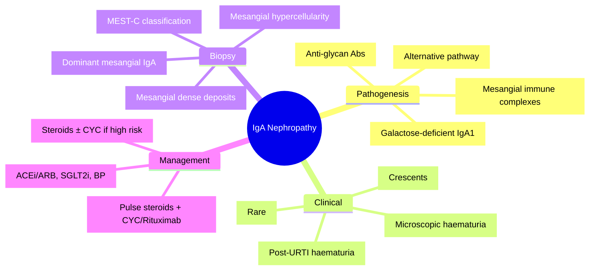

# Primary Glomerulonephritides — IgA Nephropathy (Berger's Disease)

<callout icon="🩺" color="red_bg">
**Topic:** Primary Glomerulonephritides — IgA Nephropathy (Berger's Disease) — Nephrology & Urology
**Style:** Sea Knowledge study infographic
**Audience:** FCPS / MRCP exam prep
</callout>

**Related:** [[Glomerular Diseases — Overview and Classification]], [[Primary Glomerulonephritides — Membranous Nephropathy]], [[Primary Glomerulonephritides — FSGS]], [[Primary Glomerulonephritides — Minimal Change Disease]], [[Nephrology and Urology MOC]]

> [!important]
> **IgA Nephropathy = commonest primary GN worldwide. Aberrant IgA1 glycosylation → immune complexes → mesangial deposition. Classic: macroscopic haematuria 1–2 days post-URTI. Diagnosis: renal biopsy (dominant mesangial IgA on IF). Management: supportive (ACEi/ARB, SGLT2i) ± immunosuppression if high-risk.**

---

## 1. Learning Objectives
- Recognise clinical presentations (synpharyngitic haematuria, asymptomatic, nephrotic, RPGN)
- Interpret biopsy findings (LM, IF, EM) and Oxford MEST-C classification
- Apply risk stratification and treatment algorithm
- Differentiate from HSP nephritis, post-strep GN, IgA-dominant infection-related GN

---

## 2. Epidemiology & Pathogenesis

| Feature | Detail |
|---------|--------|
| **Epidemiology** | Commonest primary GN worldwide; young adults (20–30s); M>F; high prevalence in East Asia |
| **Pathogenesis** | **Aberrant IgA1 O-glycosylation** → galactose-deficient IgA1 → anti-glycan IgG/IgA autoantibodies → immune complexes → mesangial deposition → complement activation (alternative pathway) → inflammation |
| **Genetics** | GWAS: HLA region, complement regulators (CFH, C3), mucosal immunity loci; familial clustering |
| **Associations** | Celiac disease, liver disease, IBD, HIV, Hank's disease |

---

## 3. Clinical Presentation

| Type | Features |
|------|----------|
| **Classic (Synpharyngitic)** | Episodic macroscopic haematuria 1–2 days post-URTI (often with loin pain); self-limiting, recurs |
| **Asymptomatic** | Microscopic haematuria ± proteinuria (incidental on screening); most common presentation |
| **Nephrotic Syndrome** | <5%; heavy proteinuria, oedema, hypoalbuminaemia, hyperlipidaemia |
| **Rapidly Progressive GN (RPGN)** | Rare; crescentic transformation (>50% crescents); acute kidney injury |
| **Chronic Progressive** | Gradual eGFR decline, hypertension, proteinuria |

---

## 4. Histopathology

| Modality | Findings |
|----------|----------|
| **Light Microscopy** | Mesangial hypercellularity, matrix expansion; segmental/global sclerosis in chronic; crescents if RPGN |
| **Immunofluorescence** | **Dominant mesangial IgA** (+ C3, IgG, IgM); **no IgG dominance** (distinguishes from infection-related) |
| **Electron Microscopy** | **Mesangial electron-dense deposits**; no subepithelial/subendothelial deposits (if present = overlap) |

---

## 5. Oxford MEST-C Classification (Prognostic)

| Lesion | Score | Definition | Prognostic Significance |
|--------|-------|------------|------------------------|
| **M** (Mesangial hypercellularity) | M0/M1 | M0: <50% glomeruli; M1: ≥50% | M1 → worse renal survival |
| **E** (Endocapillary hypercellularity) | E0/E1 | E1: hypercellularity in any glomerulus | E1 → worse prognosis; responds to immunosuppression |
| **S** (Segmental glomerulosclerosis) | S0/S1 | S1: adhesion/sclerosis in any glomerulus | S1 → worse renal survival |
| **T** (Tubular atrophy/Interstitial fibrosis) | T0/T1/T2 | T0: <25%; T1: 25–50%; T2: >50% | **Strongest predictor** of progression |
| **C** (Crescents) | C0/C1/C2 | C0: none; C1: <25%; C2: ≥25% | C1/C2 → worse outcome; indicates immunosuppression |

> [!key]
> **Oxford MEST-C**: M1, E1, S1, T1/2, C1/2 = adverse features. **T score is strongest predictor** of progression.

---

## 6. Risk Stratification & Management Algorithm

| Risk Category | Criteria | Management |
|---------------|----------|------------|
| **Low Risk** | Proteinuria <0.5g/day, eGFR >60, normal BP, no MEST-C adverse features | **Supportive only**: ACEi/ARB (max tolerated), SGLT2i, BP <130/80, statin, weight loss, smoking cessation |
| **Intermediate Risk** | Proteinuria 0.5–1g/day, or eGFR 45–60, or isolated MEST-C E1/S1 | Supportive + **consider 6mo steroids** if persistent proteinuria >0.75g despite 3–6mo ACEi/ARB (TESTING trial) |
| **High Risk** | Proteinuria >1g/day, or eGFR <45, or crescents (C1/C2), or T1/T2 | **Immunosuppression**: 6mo steroids ± cyclophosphamide (if crescentic); consider MMF/rituximab |
| **RPGN** | >50% crescents, rapidly rising Cr | **Pulse methylprednisolone** 1g × 3d → oral pred 1mg/kg + **cyclophosphamide** 0.5g/m² IV monthly × 6mo (or rituximab) |

---

## 7. Supportive Care (All Patients)

| Intervention | Target / Dose |
|--------------|---------------|
| **ACEi/ARB** | Max tolerated dose; target BP <130/80; monitor K+/Cr |
| **SGLT2 Inhibitor** | Dapagliflozin/empagliflozin (if eGFR ≥20); reduces progression by 35–40% |
| **Blood Pressure** | <130/80 (KDIGO 2021) |
| **Lipids** | Statin if >50yo or CVD risk |
| **Diet** | Low salt (<2g Na/day), moderate protein (0.8g/kg) |
| **Weight/Smoking** | BMI <25, smoking cessation |
| **Monitoring** | UPCR, eGFR, BP every 3–6mo |

---

## 8. Differential Diagnosis

| Condition | Distinguishing Feature |
|-----------|----------------------|
| **Henoch-Schönlein Purpura (HSP) Nephritis** | Systemic vasculitis (palpable purpura, abdominal pain, arthritis); same pathology (IgA) but **systemic** |
| **Post-Streptococcal GN** | ASO titre ↑, C3 low, subepithelial "humps" on EM; follows strep by 1–3 weeks |
| **IgA-Dominant Infection-Related GN** | Staph infection, **IgG co-dominance** on IF, older patients, systemic infection |
| **C3 Glomerulopathy** | **C3 dominant** on IF, IgA absent/minimal; alternative pathway dysregulation |
| **Lupus Nephritis Class II** | **Full-house IF** (IgG, IgM, IgA, C3, C1q), positive ANA/anti-dsDNA |

---

## 9. High-Yield FCPS/MRCP Points

> [!important]
> - **Commonest primary GN worldwide** → IgA Nephropathy
> - **Classic**: Macroscopic haematuria 1–2 days post-URTI (synpharyngitic)
> - **Biopsy**: Mesangial IgA dominant on IF; mesangial deposits on EM
> - **Oxford MEST-C**: **T score = strongest predictor** of progression
> - **Supportive**: ACEi/ARB + SGLT2i + BP control (KDIGO 2021)
> - **Immunosuppression**: Persistent proteinuria >1g despite 3–6mo ACEi/ARB → 6mo steroids (STOP-IgAN, TESTING trials)
> - **RPGN with crescents**: Pulse steroids + cyclophosphamide/rituximab
> - **HSP vs IgA**: HSP = systemic (purpura, abdominal pain, arthritis); same renal pathology

---

## 10. Common Confusions / Exam Traps

| Trap | Correction |
|------|------------|
| **IgA = always benign** | 30–40% progress to ESRD at 20 years |
| **All need immunosuppression** | Only high-risk (>1g proteinuria, crescents, declining eGFR); low-risk = supportive |
| **Post-strep = IgA dominant** | Post-strep = IgG dominant, C3 low, subepithelial humps |
| **HSP = different disease** | HSP nephritis = systemic IgA vasculitis; same renal pathology |
| **Steroids always harmful** | 6mo steroids reduce ESRD risk in high-risk (TESTING trial; lower dose safer) |
| **MEST-C all equal** | **T score (tubular atrophy/fibrosis) is strongest predictor** |

---

## 11. Mnemonics

- **IgA classic**: **S**ynpharyngitic **H**aematuria post-**U**RTI = **SHU**
- **Oxford MEST-C**: **M**esangial, **E**ndocapillary, **S**egmental sclerosis, **T**ubular atrophy, **C**rescents = **MEST-C**
- **Biopsy**: **M**esangial **I**gA **D**eposits = **MID**
- **Risk**: **P**roteinuria >1g, **E**GFR <45, **C**rescents, **T**ubular atrophy = **PECT**

---

## 12. Mind Map

---

## 13. 24-Hour Recall Prompts
1. IgA classic presentation (synpharyngitic haematuria timeline)
2. Biopsy: IF finding (dominant mesangial IgA)
3. Oxford MEST-C components and which is strongest predictor
4. When to immunosuppress (proteinuria threshold, crescents)
5. HSP nephritis vs IgA (systemic vs renal-only)
5. Supportive care: ACEi/ARB, SGLT2i, BP target
6. TESTING/STOP-IgAN trial significance

---

## 14. 7-Day / 15-Day / 30-Day Revision Tracker

| Day | Date | Recall (1-5) | Notes |
|-----|------|--------------|-------|
| 1   |      |              |       |
| 7   |      |              |       |
| 15  |      |              |       |
| 30  |      |              |       |

---

## 15. Must Know / Should Know / Nice to Know

| Priority | Content |
|----------|---------|
| **Must Know 🔴** | Clinical presentation, biopsy (IF/EM), Oxford MEST-C (esp T score), supportive care (ACEi/ARB, SGLT2i, BP), immunosuppression threshold (>1g proteinuria) |
| **Should Know 🟡** | Pathogenesis (aberrant IgA1), TESTING/STOP-IgAN trials, RPGN management, differential (HSP, post-strep, infection-related) |
| **Nice to Know 🟢** | Genetic associations, novel biomarkers (Gd-IgA1), clinical trials pipeline, complement inhibition therapy |

---

## 16. MCQs (10)

1. **Commonest primary glomerulonephropathy worldwide:**
   A. Membranous nephropathy
   B. **IgA nephropathy**
   C. FSGS
   D. Minimal change disease
   E. Post-streptococcal GN

2. **Classic presentation of IgA nephropathy:**
   A. Nephrotic syndrome
   B. **Macroscopic haematuria 1–2 days post-URTI**
   C. Rapidly progressive GN
   D. Asymptomatic proteinuria
   E. Hypertensive emergency

3. **Immunofluorescence hallmark of IgA nephropathy:**
   A. Granular capillary wall IgG
   B. **Dominant mesangial IgA**
   C. Linear GBM IgG
   D. Mesangial C3 only
   E. Subepithelial IgG

4. **Oxford MEST-C score - strongest predictor of progression:**
   A. M (Mesangial hypercellularity)
   B. E (Endocapillary hypercellularity)
   C. S (Segmental sclerosis)
   D. **T (Tubular atrophy/Interstitial fibrosis)**
   E. C (Crescents)

5. **First-line supportive management for all IgA nephropathy patients:**
   A. High-dose steroids
   B. **ACEi/ARB + SGLT2i + BP <130/80**
   C. Cyclophosphamide
   D. Rituximab
   E. Mycophenolate mofetil

6. **Immunosuppression indicated when:**
   A. Proteinuria >0.5g/day
   B. **Proteinuria >1g/day despite 3–6mo ACEi/ARB**
   C. Any microscopic haematuria
   D. eGFR >60
   E. Oxford M0

6. **TESTING trial investigated:**
   A. Rituximab in IgA
   B. **Steroids in IgA (6mo reduced ESRD but increased infections)**
   C. SGLT2i in IgA
   D. CYC in IgA
   E. Complement inhibition

7. **Henoch-Schönlein Purpura (HSP) nephritis vs IgA nephropathy:**
   A. Different IF findings
   B. **HSP = systemic vasculitis (purpura, abdominal pain, arthritis)**
   C. HSP has no haematuria
   D. HSP only in adults
   E. HSP = subepithelial deposits

8. **Post-streptococcal GN distinguishing features:**
   A. **ASO titre elevated, C3 low, subepithelial humps on EM**
   B. Dominant mesangial IgA
   C. Normal C3
   D. c-ANCA positive
   E. Linear GBM staining

9. **Oxford 'E' lesion indicates:**
   A. Mesangial hypercellularity
   B. **Endocapillary hypercellularity**
   C. Segmental sclerosis
   D. Tubular atrophy
   E. Crescents

10. **RPGN in IgA (crescentic >50%):**
    A. ACEi/ARB only
    B. **Pulse methylprednisolone + cyclophosphamide/rituximab**
    C. SGLT2i alone
    D. Observation
    E. Plasma exchange alone

---

## 17. SBA Questions (10)

1. **22-year-old man, macroscopic haematuria 1 day after sore throat. Biopsy: mesangial hypercellularity, dominant IgA on IF. Diagnosis:**
   A. Post-streptococcal GN
   B. **IgA nephropathy**
   C. Alport syndrome
   D. Thin basement membrane disease
   E. C3 glomerulopathy

2. **30-year-old woman, incidental microscopic haematuria + proteinuria 0.8g/day, eGFR 75. Biopsy: M1E0S0T0C0. Management:**
   A. Pulse steroids + CYC
   B. Rituximab
   C. **ACEi/ARB + SGLT2i + BP control, monitor**
   D. MMF
   E. Plasma exchange

3. **40-year-old man, proteinuria 2.5g/day, eGFR 45, biopsy: M1E1S1T1C1. Best next step:**
   A. Supportive only
   B. **6-month steroids ± cyclophosphamide**
   C. Rituximab alone
   E. Transplant referral
   D. ACEi/ARB only

4. **15-year-old boy, palpable purpura on legs, abdominal pain, arthritis, microscopic haematuria. Renal biopsy: dominant mesangial IgA. Diagnosis:**
   A. IgA nephropathy
   B. **Henoch-Schönlein Purpura (HSP) nephritis**
   C. Post-streptococcal GN
   D. Alport syndrome
   E. Lupus nephritis

5. **60-year-old man, Staph aureus bacteraemia, AKI, nephrotic range proteinuria. Biopsy: IgA-dominant, IgG co-dominant, subepithelial deposits. Diagnosis:**
   A. IgA nephropathy
   B. **IgA-dominant infection-related GN**
   C. Membranous nephropathy
   D. Post-streptococcal GN
   E. C3 glomerulopathy

6. **Oxford MEST-C 'T2' score means:**
   A. No tubular atrophy
   B. <25% tubular atrophy/fibrosis
   C. 25–50% tubular atrophy/fibrosis
   D. **>50% tubular atrophy/interstitial fibrosis**
   E. Crescents in >50% glomeruli

7. **In IgA nephropathy, which complement pathway is primarily activated?**
   A. Classical
   B. Lectin
   C. **Alternative**
   D. Terminal only
   E. None

8. **KDIGO 2024 BP target for IgA nephropathy with proteinuria:**
   A. <140/90
   B. **<130/80**
   C. <120/70
   D. <150/90
   E. No specific target

9. **SGLT2 inhibitor benefit in IgA nephropathy (DAPA-CKD, EMPA-KIDNEY):**
   A. Reduces proteinuria only
   B. **Reduces kidney failure progression by ~35–40% regardless of diabetes**
   C. Only works in diabetic patients
   D. Increases eGFR acutely
   E. Replaces ACEi/ARB

10. **25-year-old woman, RPGN (Cr 350, crescents 60% on biopsy), dominant mesangial IgA. Induction:**
    A. ACEi/ARB
    B. Oral prednisolone 1mg/kg alone
    C. **Pulse methylprednisolone 1g × 3d + cyclophosphamide/rituximab**
    D. MMF + steroids
    E. Plasma exchange alone

---

## 18. Flashcards

- Q: Commonest primary GN worldwide?
  A: IgA Nephropathy

- Q: IgA classic presentation?
  A: Macroscopic haematuria 1–2 days post-URTI (synpharyngitic)

- Q: IF hallmark of IgA nephropathy?
  A: Dominant mesangial IgA (+C3), no IgG dominance

- Q: EM finding in IgA?
  A: Mesangial electron-dense deposits

- Q: Oxford MEST-C components?
  A: Mesangial, Endocapillary, Segmental sclerosis, Tubular atrophy/fibrosis, Crescents

- Q: Oxford MEST-C strongest predictor?
  A: T score (Tubular atrophy/Interstitial fibrosis)

- Q: Supportive Rx for all IgA?
  A: ACEi/ARB + SGLT2i + BP <130/80 + statin + lifestyle

- Q: When to immunosupress?
  A: Proteinuria >1g/day despite 3–6mo ACEi/ARB, or crescents, or eGFR <45

- Q: RPGN IgA management?
  A: Pulse methylpred + CYC/rituximab

- Q: HSP vs IgA?
  A: HSP = systemic (purpura, abdominal pain, arthritis); same renal pathology

- Q: Post-strep vs IgA?
  A: Post-strep = ASO↑, C3 low, subepithelial humps, IgG dominant

- Q: IgA-dominant infection-related GN?
  A: Staph infection, older, IgG co-dominance, systemic infection

- Q: Complement pathway in IgA?
  A: Alternative pathway

- Q: Oxford E1 significance?
  A: Endocapillary hypercellularity; responds to immunosuppression

- Q: TESTING trial result?
  A: 6mo steroids reduce ESRD but increase infections; lower dose safer

---

## 19. Answer Key with Explanations

### MCQs
1. **B** — IgA nephropathy is commonest primary GN globally
2. **B** — Classic = synpharyngitic macroscopic haematuria 1–2d post-URTI
3. **B** — Dominant mesangial IgA on IF (pathognomonic)
4. **D** — T score (tubular atrophy/interstitial fibrosis) = strongest predictor
5. **B** — Supportive: ACEi/ARB + SGLT2i + BP control is first-line for all
6. **B** — KDIGO: immunosuppression if proteinuria >1g despite 3–6mo ACEi/ARB
7. **B** — TESTING: 6mo methylpred reduced ESRD but increased adverse events (infections)
8. **B** — HSP = systemic IgA vasculitis (purpura, abdominal pain, arthritis)
9. **A** — Post-strep: ASO↑, C3↓, subepithelial "humps", IgG dominant
10. **B** — E = endocapillary hypercellularity
11. **B** — Crescentic RPGN: pulse steroids + CYC/rituximab

### SBAs
1. **B** — Young adult + post-URTI haematuria + mesangial IgA = IgA nephropathy
2. **C** — Proteinuria 0.8g, eGFR 75, M1 only → low/intermediate risk → supportive
3. **B** — Proteinuria >1g, eGFR 45, adverse MEST-C (E1, S1, T1, C1) → immunosuppression
4. **B** — HSP = systemic vasculitis (palpable purpura, abdominal pain, arthritis) + IgA nephritis
5. **B** — Infection-related GN: IgA/IgG co-dominance, subepithelial deposits, active infection
6. **D** — T2 = >50% tubular atrophy/interstitial fibrosis (worst prognosis)
7. **C** — Alternative pathway (C3 deposition, no C1q/C4)
8. **B** — KDIGO 2024: BP <130/80 for proteinuric CKD
9. **B** — DAPA-CKD/EMPA-KIDNEY: SGLT2i reduces progression ~35–40% in CKD incl. IgA (non-diabetic)
10. **C** — RPGN with >50% crescents: pulse steroids + CYC/rituximab

---

## 20. Summary

**IgA Nephropathy** is a **Must Know 🔴** topic.
**Key takeaway:** Commonest primary GN. Classic = synpharyngitic macroscopic haematuria. Biopsy = dominant mesangial IgA on IF, mesangial deposits on EM. Oxford MEST-C for prognosis (**T score strongest**). Supportive = ACEi/ARB + SGLT2i + BP <130/80. Immunosuppression = proteinuria >1g despite 3–6mo ACEi/ARB → 6mo steroids (TESTING). RPGN = pulse steroids + CYC/rituximab. HSP = systemic vasculitis + same renal pathology.
**Exam focus:** Clinical presentations, biopsy interpretation, Oxford MEST-C, supportive vs immunosuppressive thresholds, HSP distinction, TESTING trial.
**Clinical relevance:** Most common GN; early recognition + ACEi/ARB + SGLT2i prevents progression.