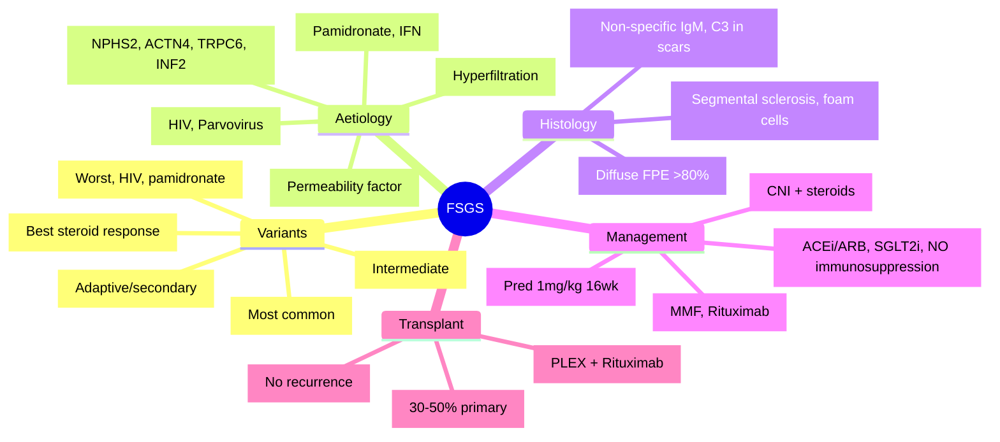

# Focal Segmental Glomerulosclerosis (FSGS)

**Related:** [[Glomerular Diseases — Overview and Classification]], [[Primary Glomerulonephritides — IgA Nephropathy (Berger's Disease)]], [[Primary Glomerulonephritides — Membranous Nephropathy]], [[Primary Glomerulonephritides — Minimal Change Disease]], [[Nephrology and Urology MOC]]

> [!important]
> **FSGS = commonest primary glomerular cause of ESRD in adults. Segmental sclerosis of some glomeruli. Primary (genetic, circulating permeability factor) vs Secondary (adaptive, viral, drug). Primary: steroid-resistant ~60%. Management: high-dose steroids induction, then CNI/MMF/rituximab. Recurrence post-transplant ~30–50% (circulating factor).**

---

## Learning Objectives
- Classify FSGS variants (Columbia classification) and their prognostic significance
- Distinguish primary vs secondary FSGS
- Apply treatment algorithms (steroids, CNI, MMF, rituximab)
- Recognise post-transplant recurrence risk

---

## Classification (Columbia Histological Variants)

| Variant | Histology | Prognosis | Notes |
|---------|-----------|-----------|-------|
| **Collapsing** | Segmental/global collapse + podocyte hyperplasia | **Worst** (rapid progression to ESRD) | HIV-associated, pamidronate, interferon |
| **Tip Lesion** | Sclerosis at tubular pole (tip) | **Best** (high steroid response) | Often nephrotic |
| **Cellular** | Endocapillary hypercellularity + foam cells | Intermediate | May represent early collapsing |
| **Perihilar** | Sclerosis at vascular pole (hilar) | Intermediate | Often **secondary/adaptive** (hyperfiltration) |
| **NOS** (Not Otherwise Specified) | Segmental sclerosis not fitting above | Intermediate | Most common variant |

---

## Aetiology

| Category | Mechanism | Examples |
|----------|-----------|----------|
| **Primary (Idiopathic)** | Circulating permeability factor (unknown), **podocyte injury** | Genetic (NPHS2, ACTN4, TRPC6, INF2), idiopathic |
| **Secondary — Adaptive** | Hyperfiltration, reduced nephron mass | Obesity, reduced renal mass, reflux nephropathy, prematurity |
| **Secondary — Viral** | Direct podocyte infection | **HIV** (collapsing variant), Parvovirus B19 |
| **Secondary — Drug/Toxin** | Podocyte toxicity | Pamidronate, interferon, lithium, sirolimus |
| **Secondary — Familial/Genetic** | Podocyte structural protein mutations | **NPHS2** (podocin, AR, childhood), **ACTN4** (α-actinin-4, AD, adult), **TRPC6**, **INF2** |

> [!key]
> **Primary FSGS**: Permeability factor, steroid-sensitive ~40%, recurrence post-Tx 30–50%.
> **Adaptive FSGS**: Subnephrotic proteinuria, non-progressive if underlying cause treated.
> **Collapsing variant**: Worst prognosis; HIV, pamidronate, interferon.

---

## Clinical Presentation

| Feature | Primary FSGS | Adaptive/Secondary FSGS |
|---------|--------------|-------------------------|
| **Proteinuria** | Nephrotic range (>3.5g/day) common | Subnephrotic (<3.5g) common |
| **Nephrotic Syndrome** | ~70% | Rare |
| **Renal Impairment** | Common at presentation | Variable |
| **Hypertension** | Common | Common |
| **Haematuria** | Microscopic ~50% | Less common |
| **Extrarenal** | None | Obesity, HIV, drug history |

---

## Histopathology

| Modality | Findings |
|----------|----------|
| **Light Microscopy** | **Segmental glomerulosclerosis** (adhesion to Bowman's capsule); foam cells; variant-specific features |
| **Immunofluorescence** | Non-specific: IgM, C3 in sclerotic areas ("trapped"); no immune complex pattern |
| **Electron Microscopy** | **Diffuse foot process effacement** (>80%); no electron-dense deposits |

---

## Genetic Testing Indications

| Indication | Genes |
|------------|-------|
| **Childhood-onset** SRNS | **NPHS2** (podocin, AR), **WT1**, **PLCE1** |
| **Adult-onset** SRNS + family history | **ACTN4** (AD), **TRPC6** (AD), **INF2** (AD) |
| **Pre-transplant** workup | Exclude genetic (no recurrence if genetic) |
| **Syndromic features** | WT1 (Denys-Drash, Frasier), LMX1B (nail-patella) |

> [!key]
> **Genetic FSGS = no recurrence post-transplant** (no circulating factor). **NPHS2** = childhood, AR. **ACTN4/INF2/TRPC6** = adult, AD.

---

## Management

### Primary FSGS — Nephrotic Syndrome

| Phase | Regimen |
|-------|---------|
| **Induction** | **Prednisolone 1 mg/kg/day (max 80mg) × 16 weeks** → if remission, taper over 6mo |
| **Steroid-Resistant** (no remission at 16 weeks) | **Cyclosporine/Tacrolimus** (CNIs) — target trough CsA 150–250, Tac 5–10 ng/mL + low-dose steroids |
| **CNI-Intolerant/Resistant** | **Mycophenolate mofetil** 2–3g/day + steroids; **Rituximab** 375mg/m² × 4 weekly (evidence evolving) |
| **Relapse** | Restart steroids; CNI/rituximab |

### Adaptive/Secondary FSGS

| Approach | Detail |
|----------|--------|
| **Treat underlying cause** | Weight loss (obesity), stop offending drug, treat HIV, control BP |
| **ACEi/ARB + SGLT2i** | Reduce proteinuria, slow progression |
| **Immunosuppression** | **Not indicated** (no permeability factor) |

---

## Post-Transplant Recurrence

| Feature | Detail |
|---------|--------|
| **Risk** | 30–50% (primary FSGS); **collapsing variant highest** |
| **Timing** | Immediate to days-weeks post-Tx (circulating factor) |
| **Presentation** | Sudden nephrotic proteinuria, allograft dysfunction |
| **Prophylaxis** | **Plasmapheresis** preemptive (controversial, not standard) |
| **Treatment** | **Plasmapheresis** (removes factor) + **rituximab** + CNI optimisation |
| **Genetic FSGS** | **No recurrence** (no circulating factor) |

---

## High-Yield FCPS/MRCP Points

> [!important]
> - **FSGS = commonest primary glomerular cause of ESRD in adults**
> - **Columbia variants**: Collapsing (worst), Tip (best steroid response), Perihilar (adaptive/secondary)
> - **Primary vs Secondary**: Primary = nephrotic, permeability factor; Secondary = adaptive (hyperfiltration), viral, drug
> - **EM**: **Diffuse foot process effacement >80%** (vs segmental in MCD)
> - **Induction**: Pred 1mg/kg × 16 weeks (primary)
> - **Steroid-resistant**: CNI (CsA/Tac) + low-dose steroids
> - **Post-Tx recurrence**: 30–50% (primary); **no recurrence if genetic**
> - **Collapsing variant**: HIV, pamidronate, interferon; worst prognosis
> - **Genetic**: NPHS2 (childhood, AR), ACTN4/INF2/TRPC6 (adult, AD)

---

## Common Confusions / Exam Traps

| Trap | Correction |
|------|------------|
| **All FSGS = primary** | Adaptive (obesity, reduced renal mass) = no immunosuppression |
| **Foot process effacement = MCD** | MCD = **diffuse** but **selective** proteinuria; FSGS = diffuse + non-selective |
| **Steroids work for all** | Primary: ~40% respond; Adaptive: NO; Genetic: NO |
| **Recurrence = all FSGS post-Tx** | Only primary (circulating factor); genetic = no recurrence |
| **Collapsing = only HIV** | Also pamidronate, interferon, idiopathic |
| **Perihilar = primary** | Perihilar = **adaptive/secondary** (hyperfiltration) |
| **FSGS = always nephrotic** | Adaptive FSGS often subnephrotic |

---

## Mnemonics

- **Columbia variants**: **C**ollapsing, **T**ip, **C**ellular, **P**erihilar, **N**OS = **CTCPN**
- **Prognosis**: **C**ollapsing **W**orst, **T**ip **B**est = **CW/TB**
- **Primary FSGS**: **P**ermeability **F**actor, **S**teroid **R**esistant ~60% = **PFSR**
- **Genetic**: **N**PHS2 = **N**eonatal/**N**ephrotic **C**hildhood, **A**R; **A**CTN4 = **A**dult **A**D
- **Post-Tx**: **P**rimary FSGS **R**ecurs (30–50%), **G**enetic **N**o = **PR/GN**

---

## Mind Map

---

## 24-Hour Recall Prompts
1. Commonest primary glomerular cause of ESRD in adults
2. Columbia variants: Collapsing (worst), Tip (best), Perihilar (adaptive)
3. Primary vs Adaptive FSGS features
4. EM: Diffuse foot process effacement >80%
5. Induction: Pred 1mg/kg × 16 weeks
6. Steroid-resistant: CNI + low-dose steroids
7. Post-Tx recurrence: 30–50% primary; no recurrence if genetic
8. Genetic: NPHS2 (childhood AR), ACTN4/INF2/TRPC6 (adult AD)

---

## 7-Day / 15-Day / 30-Day Revision Tracker

| Day | Date | Recall (1-5) | Notes |
|-----|------|--------------|-------|
| 1   |      |              |       |
| 7   |      |              |       |
| 15  |      |              |       |
| 30  |      |              |       |

---

## Must Know / Should Know / Nice to Know

| Priority | Content |
|----------|---------|
| **Must Know 🔴** | Columbia variants, primary vs secondary/adaptive, EM findings, steroid induction, CNI for resistance, post-Tx recurrence, genetic implications |
| **Should Know 🟡** | Specific genetic genes, collapsing variant associations, rituximab role, plasmapheresis for recurrence |
| **Nice to Know 🟢** | Circulating permeability factor research, suPAR, novel therapies (sparsentan), APOL1 risk variants |

---

## MCQs (10)

1. **Commonest primary glomerular cause of ESRD in adults:**
   A. IgA nephropathy
   B. Membranous nephropathy
   C. **FSGS**
   D. Minimal change disease
   E. Anti-GBM disease

2. **Columbia variant with BEST steroid response:**
   A. Collapsing
   B. **Tip lesion**
   C. Cellular
   D. Perihilar
   E. NOS

3. **Columbia variant associated with HIV and pamidronate:**
   A. Tip lesion
   B. **Collapsing variant**
   C. Cellular
   D. Perihilar
   E. NOS

4. **Adaptive FSGS (secondary) — typical proteinuria:**
   A. Nephrotic range (>3.5g/day)
   B. **Subnephrotic (<3.5g/day)**
   C. Always nephrotic
   D. No proteinuria
   E. Only microscopic haematuria

5. **EM finding in FSGS:**
   A. Subepithelial deposits
   B. Subendothelial deposits
   C. Mesangial deposits
   D. **Diffuse foot process effacement >80%**
   E. Tubuloreticular inclusions

6. **Primary FSGS induction therapy (nephrotic):**
   A. CNI first-line
   B. **Prednisolone 1mg/kg/day × 16 weeks**
   C. Rituximab first-line
   D. MMF + steroids
   E. Plasma exchange

7. **Steroid-resistant FSGS — next line:**
   A. Increase steroids
   B. **Cyclosporine/Tacrolimus + low-dose steroids**
   C. Plasma exchange
   D. Rituximab alone
   E. Transplant referral

8. **Post-transplant FSGS recurrence risk (primary):**
   A. <5%
   B. 10–15%
   C. **30–50%**
   D. 70–80%
   E. 100%

9. **Genetic FSGS post-transplant recurrence:**
   A. Same as primary (30–50%)
   B. Higher (50–70%)
   C. **No recurrence**
   D. Only if NPHS2
   E. Only if ACTN4

10. **Perihilar variant FSGS suggests:**
    A. Primary idiopathic
    B. **Adaptive/secondary (hyperfiltration)**
    C. Drug-induced
    D. Genetic
    E. Viral

---

## SBA Questions (10)

1. **35-year-old man, nephrotic syndrome, proteinuria 5g/day. Biopsy: segmental sclerosis at tubular pole, foot process effacement >80%. Variant and prognosis:**
   A. Collapsing — worst
   B. **Tip lesion — best steroid response**
   C. Cellular — intermediate
   D. Perihilar — adaptive
   E. NOS — intermediate

2. **45-year-old obese man (BMI 42), proteinuria 1.8g/day, eGFR 65. Biopsy: perihilar sclerosis. Management:**
   A. High-dose steroids
   B. **Weight loss, ACEi/ARB + SGLT2i, BP control**
   C. Cyclosporine
   D. Rituximab
   E. Plasma exchange

3. **25-year-old HIV+ man, nephrotic syndrome, AKI. Biopsy: collapsing glomerulopathy. Management:**
   A. Steroids alone
   B. **ART optimisation + ACEi/ARB; steroids if severe (controversial)**
   C. CNI
   D. Rituximab
   E. Plasma exchange

4. **12-year-old boy, steroid-resistant nephrotic syndrome. Genetic testing before transplant. Gene most likely:**
   A. ACTN4
   B. **NPHS2 (podocin)**
   C. TRPC6
   D. INF2
   E. APOL1

5. **Adult FSGS, family history, AD inheritance. Gene:**
   A. NPHS2
   B. **ACTN4 or INF2 or TRPC6**
   C. WT1
   D. PLCE1
   E. APOL1

6. **FSGS post-transplant day 3: sudden proteinuria 8g/day. Native disease: primary FSGS. Immediate management:**
   A. Increase CNI
   B. **Plasmapheresis + rituximab**
   C. Pulse steroids only
   D. Biopsy only
   E. Switch to mTOR inhibitor

7. **Adaptive FSGS vs Primary FSGS — key distinguishing feature:**
   A. EM foot process effacement
   B. **Proteinuria: subnephrotic (adaptive) vs nephrotic (primary)**
   C. LM segmental sclerosis
   D. IF IgM/C3 trapping
   E. All above

8. **Pamidronate-associated FSGS variant:**
   A. Tip
   B. **Collapsing**
   C. Cellular
   D. Perihilar
   E. NOS

9. **Genetic FSGS — no recurrence post-transplant because:**
   A. CNI prevents it
   B. **No circulating permeability factor (structural podocyte defect)**
   C. Rituximab prophylaxis
   D. Plasmapheresis prophylaxis
   E. Different histology

10. **NPHS2 mutation — inheritance and onset:**
    A. AD, adult
    B. **AR, childhood**
    C. AD, childhood
    A. AR, adult
    E. X-linked

---

## Flashcards

- Q: Commonest primary glomerular cause of ESRD in adults?
  A: FSGS

- Q: Columbia variants?
  A: Collapsing, Tip, Cellular, Perihilar, NOS

- Q: Worst prognosis variant?
  A: Collapsing

- Q: Best steroid response variant?
  A: Tip lesion

- Q: Perihilar variant suggests?
  A: Adaptive/secondary (hyperfiltration)

- Q: EM in FSGS?
  A: Diffuse foot process effacement >80%

- Q: Primary FSGS induction?
  A: Pred 1mg/kg × 16 weeks

- Q: Steroid-resistant FSGS?
  A: CNI (CsA/Tac) + low-dose steroids

- Q: Adaptive FSGS proteinuria?
  A: Subnephrotic (<3.5g/day)

- Q: Post-Tx recurrence primary FSGS?
  A: 30–50%

- Q: Genetic FSGS post-Tx recurrence?
  A: None (no circulating factor)

- Q: NPHS2 — inheritance, onset?
  A: AR, childhood

- Q: ACTN4/INF2/TRPC6 — inheritance, onset?
  A: AD, adult

- Q: Collapsing variant associations?
  A: HIV, pamidronate, interferon

- Q: Post-Tx recurrence treatment?
  A: Plasmapheresis + rituximab + CNI optimisation

---

## Answer Key with Explanations

### MCQs
1. **C** — FSGS = commonest primary glomerular cause of ESRD in adults
2. **B** — Tip lesion = best steroid response, best prognosis
3. **B** — Collapsing variant = HIV, pamidronate, interferon; worst prognosis
4. **B** — Adaptive FSGS = subnephrotic proteinuria (hyperfiltration mechanism)
5. **D** — EM: diffuse foot process effacement >80% (vs MCD also diffuse but clinical difference)
6. **B** — Primary FSGS nephrotic: pred 1mg/kg × 16 weeks induction
7. **B** — Steroid-resistant: CNI + low-dose steroids next line
8. **C** — Post-Tx recurrence 30–50% for primary FSGS
9. **C** — Genetic FSGS = no circulating factor = no recurrence
10. **B** — Perihilar = adaptive/secondary (obesity, reduced renal mass)

### SBAs
1. **B** — Tip lesion (tubular pole) = best steroid response
2. **B** — Obesity + subnephrotic + perihilar = adaptive FSGS → supportive only
3. **B** — HIV collapsing: ART optimisation primary; steroids controversial
4. **B** — Childhood SRNS = NPHS2 (podocin) most common (AR)
5. **B** — Adult AD FSGS = ACTN4, INF2, TRPC6
6. **B** — Post-Tx recurrence: plasmapheresis (removes factor) + rituximab (B-cell depletion)
7. **B** — Adaptive = subnephrotic; Primary = nephrotic (key clinical distinction)
8. **B** — Pamidronate = collapsing variant
9. **B** — Genetic = structural podocyte defect, no circulating factor
10. **B** — NPHS2 = AR, childhood onset

---

## Summary

**FSGS** is a **Must Know 🔴** topic.
**Key takeaway:** Commonest primary glomerular cause of ESRD. Columbia variants: Collapsing (worst, HIV/pamidronate), Tip (best steroid response), Perihilar (adaptive). Primary = nephrotic, permeability factor; Adaptive = subnephrotic, hyperfiltration. EM = diffuse FPE >80%. Induction = pred 1mg/kg × 16wk. Steroid-resistant = CNI + steroids. Post-Tx recurrence 30–50% (primary only); genetic = no recurrence. Genetic: NPHS2 (AR, childhood), ACTN4/INF2/TRPC6 (AD, adult).
**Exam focus:** Variants prognosis, primary vs adaptive distinction, EM findings, treatment algorithm, post-Tx recurrence, genetics.
**Clinical relevance:** Early aggressive treatment improves outcomes; genetic testing avoids unnecessary immunosuppression and predicts transplant recurrence.