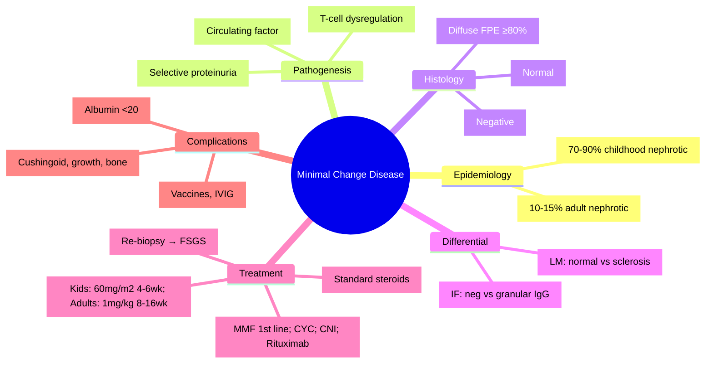

# Minimal Change Disease (MCD)

**Related:** [[Glomerular Diseases — Overview and Classification]], [[Primary Glomerulonephritides — IgA Nephropathy (Berger's Disease)]], [[Primary Glomerulonephritides — Membranous Nephropathy]], [[Primary Glomerulonephritides — FSGS (Focal Segmental Glomerulosclerosis)]], [[Nephrology and Urology MOC]]

> [!important]
> **MCD = commonest cause of nephrotic syndrome in children (70–90%). "Minimal change" on LM; diffuse foot process effacement on EM; negative IF. Highly steroid-responsive (>90% children, ~80% adults). Relapses common; frequent relapsers need steroid-sparing agents.**

---

## Learning Objectives
- Recognise typical presentation (selective proteinuria, nephrotic syndrome)
- Differentiate MCD from FSGS (clinical, histological)
- Apply steroid treatment protocols (induction, taper, relapse management)
- Manage frequent relapsers and steroid-dependent cases
- Recognise complications (infection, thrombosis, steroid toxicity)

---

## Epidemiology & Classification

| Feature | Detail |
|---------|--------|
| **Children** | **Commonest cause of nephrotic syndrome (70–90%)**; peak 2–6 years; M>F |
| **Adults** | ~10–15% of adult nephrotic syndrome; older than children |
| **Primary (Idiopathic)** | ~90%; T-cell dysregulation → permeability factor |
| **Secondary** | ~10%; drugs (NSAIDs, lithium, gold), infections (syphilis, HBV), malignancy (Hodgkin's), allergies, bee stings, vaccines |

---

## Pathogenesis

| Mechanism | Detail |
|-----------|--------|
| **T-cell Dysregulation** | **Circulating permeability factor** (unknown cytokine) → podocyte injury |
| **Key Molecules** | Reduced nephrin, podocin expression; altered glomerular charge barrier |
| **Selectivity** | **Selective proteinuria** (albumin lost, larger proteins retained) — charge/size selectivity preserved |
| **Genetics** | Mostly sporadic; rare familial (NPHS1, NPHS2, WT1 — but these usually present as congenital/SRNS) |

---

## Clinical Presentation

| Feature | Children | Adults |
|---------|----------|--------|
| **Age** | 2–6 years (peak) | Any age |
| **Onset** | Acute (days) | Acute/subacute |
| **Nephrotic Syndrome** | ~90% (heavy proteinuria, oedema, hypoalbuminaemia, hyperlipidaemia) | ~70% |
| **Proteinuria** | **Selective** (albumin selective index <0.1) | Selective/non-selective |
| **Haematuria** | Microscopic ~20% | Microscopic ~30% |
| **Hypertension** | Rare | ~30% |
| **Renal Function** | Normal | Normal/mildly impaired |
| **Extrarenal** | None (unless secondary) | May have secondary cause clues |

---

## Histopathology

| Modality | Findings |
|----------|----------|
| **Light Microscopy** | **Normal / minimal change** (no proliferation, no sclerosis, no crescents) |
| **Immunofluorescence** | **Negative** (no immune deposits); occasional IgM/C3 in hyalinosis (non-specific) |
| **Electron Microscopy** | **Diffuse foot process effacement (FPE)** of podocytes (≥80%); no electron-dense deposits |

> [!key]
> **Triad of MCD**: Normal LM + Negative IF + Diffuse FPE on EM = **diagnostic**.

---

## Differential Diagnosis (MCD vs FSGS)

| Feature | MCD | FSGS |
|---------|-----|------|
| **LM** | Normal | Segmental sclerosis |
| **IF** | Negative | Non-specific (IgM, C3 in scars) |
| **EM** | Diffuse FPE | Diffuse FPE |
| **Proteinuria** | **Selective** | Non-selective |
| **Steroid Response** | >90% (children) | ~40% (primary) |
| **Relapse Rate** | High (50–75%) | Lower |
| **Progression to ESRD** | Very rare | Common |
| **Age** | Children predominant | Adults predominant |

---

## Steroid Treatment Protocols

### Children (ISKDC / KDIGO)

| Phase | Regimen |
|-------|---------|
| **Induction** | **Prednisolone 60 mg/m²/day (max 60mg) × 4–6 weeks** until remission (proteinuria negative × 3 days) |
| **Taper** | **40 mg/m² alternate days × 4–6 weeks** |
| **Stop** | Then stop (total ~12–16 weeks) |
| **Relapse** | **Prednisolone 60 mg/m²/day** until remission × 3 days → 40 mg/m² alternate days × 4 weeks → taper |

### Adults (KDIGO)

| Phase | Regimen |
|-------|---------|
| **Induction** | **Prednisolone 1 mg/kg/day (max 80mg) × 8–16 weeks** until remission |
| **Taper** | Reduce by 10mg every 1–2 weeks over 4–6 months |
| **Total Duration** | ~6 months minimum |

---

## Relapse Classification & Management

| Category | Definition | Management |
|----------|------------|------------|
| **Infrequent Relapser** | <2 relapses in 6mo or <4 in 12mo | Standard steroid course each relapse |
| **Frequent Relapser** | ≥2 relapses in 6mo or ≥4 in 12mo | **Steroid-sparing agent**: **Mycophenolate mofetil (MMF) 1200–1500 mg/m²/day** (1st line); **Levamisole** (2nd line); **Cyclophosphamide** (8–12 weeks); **Tacrolimus/Cyclosporine**; **Rituximab** |
| **Steroid-Dependent** | Relapse within 2 weeks of stopping steroids / during taper | Same as frequent relapser |
| **Steroid-Resistant** | No remission after 4 weeks (children) or 8–16 weeks (adults) of daily steroids | **Re-evaluate diagnosis** (FSGS?); renal biopsy; consider CNI, MMF, rituximab |

---

## Steroid-Sparing Agents (Evidence-Based)

| Agent | Dose | Notes |
|-------|------|-------|
| **MMF** | 600–1000 mg/m² BD (max 3g/day) | **1st line per KDIGO**; good safety; monitor FBC, LFT |
| **Levamisole** | 2.5 mg/kg alternate days | 2nd line; only in children; immunomodulatory; monitor WBC |
| **Cyclophosphamide** | 2–3 mg/kg/day × 8–12 weeks | Alkylator; gonadal toxicity; bladder toxicity; **single course** |
| **CNI (Tac/CsA)** | Tac 0.05–0.1 mg/kg/day; CsA 3–5 mg/kg/day | Nephrotoxicity; **relapse on withdrawal** common; monitor levels |
| **Rituximab** | 375 mg/m² weekly × 4 (or 1g × 2 doses) | B-cell depletion; **sustained remission** in ~60–70%; infection risk |

---

## Complications & Prevention

| Complication | Risk | Prevention / Management |
|--------------|------|------------------------|
| **Infections** (pneumococcal, varicella, TB) | High (steroids, immunosuppression, proteinuria → IgG loss) | **Vaccines**: pneumococcal, Hib, MenACWY, varicella (pre-steroids); **IVIG** if severe/refractory; **Penicillin prophylaxis** if asplenic/hypoglobulinaemia |
| **Thrombosis** (renal vein, DVT, PE) | Hypercoagulable (antithrombin III loss, ↑ fibrinogen) | **Anticoagulation** if albumin <20g/L + risk factors; treat VTE |
| **Steroid Toxicity** | Cushingoid, growth failure, osteoporosis, cataracts, glucose intolerance | Calcium/Vit D, height monitoring, BP/glucose monitoring, DEXA |
| **Acute Kidney Injury** | Hypovolaemia (diuresis), sepsis, nephrotoxins | Avoid over-diuresis; monitor volume |
| **Hyperlipidaemia** | Nephrotic syndrome | Statin if persistent; diet |

---

## High-Yield FCPS/MRCP Points

> [!important]
> - **MCD = commonest childhood nephrotic syndrome (70–90%)**
> - **Triad**: Normal LM + Negative IF + Diffuse FPE on EM
> - **Selective proteinuria** (albumin selective index <0.1)
> - **Steroid response**: >90% children, ~80% adults
> - **Induction**: Children 60 mg/m² × 4–6wk; Adults 1mg/kg × 8–16wk
> - **Relapse**: 50–75% relapse; Frequent relapser = ≥2/6mo or ≥4/12mo
> - **Steroid-sparing**: **MMF 1st line** (KDIGO); Levamisole (children); CNI; Cyclophosphamide (single course); Rituximab
> - **Steroid-resistant = NOT MCD** → re-biopsy (likely FSGS)
> - **Complications**: Infection (vaccines!), Thrombosis (albumin <20), Steroid toxicity
> - **Secondary MCD**: NSAIDs, lithium, Hodgkin's, infections, allergies

---

## Common Confusions / Exam Traps

| Trap | Correction |
|------|------------|
| **MCD = normal EM** | EM = **diffuse foot process effacement** (hallmark) |
| **MCD = always steroid-responsive** | 10–15% adults steroid-resistant → re-biopsy for FSGS |
| **Selective proteinuria = only MCD** | Also early membranous, early diabetic nephropathy |
| **All relapses need CNI** | Infrequent relapsers = standard steroids only |
| **Levamisole for adults** | Levamisole = **children only** (2nd line) |
| **CNI = cure** | CNI = relapse on withdrawal common; not curative |
| **Rituximab = only for refractory** | Now used earlier for frequent relapsers (sustained remission) |
| **MCD → ESRD** | Very rare; progression = likely FSGS misdiagnosis |

---

## Mnemonics

- **MCD Triad**: **N**ormal **L**M, **N**egative **IF**, **D**iffuse **FPE** = **NL-NIF-DF** (or **MIN**imal = **M**inimal LM, **I**mmuno -, **N**ormal EM... no, **EM shows FPE**)
- **MCD Kids**: **M**CD = **M**ost **C**hildhood **N**ephrotic
- **Selective proteinuria**: **S**mall **A**lbumin **L**ost = **SAL**ective
- **Treatment**: **I**nduction 60→40→stop (kids); **R**elapse = **M**MF 1st line
- **Frequent Relapser**: **F**R = **F**our in 12 / **T**wo in 6 = **F4/T2**
- **Complications**: **I**nfection, **T**hrombosis, **S**teroid toxicity = **ITS**

---

## Mind Map

---

## 24-Hour Recall Prompts
1. Commonest childhood nephrotic cause (70–90%)
2. Histology triad: Normal LM, Negative IF, Diffuse FPE on EM
3. Selective proteinuria definition
4. Steroid induction: kids 60mg/m² × 4–6wk; adults 1mg/kg × 8–16wk
5. Frequent relapser definition (≥2/6mo or ≥4/12mo)
6. Steroid-sparing 1st line: MMF (KDIGO)
7. Steroid-resistant = re-biopsy (FSGS)
8. Complications: Infection, Thrombosis, Steroid toxicity

---

## 7-Day / 15-Day / 30-Day Revision Tracker

| Day | Date | Recall (1-5) | Notes |
|-----|------|--------------|-------|
| 1   |      |              |       |
| 7   |      |              |       |
| 15  |      |              |       |
| 30  |      |              |       |

---

## Must Know / Should Know / Nice to Know

| Priority | Content |
|----------|---------|
| **Must Know 🔴** | Triad (LM/IF/EM), selective proteinuria, steroid induction/taper, frequent relapser definition, MMF 1st line, steroid-resistant = FSGS |
| **Should Know 🟡** | Secondary causes, levamisole (children), CNI relapse on withdrawal, cyclophosphamide single course, rituximab role, vaccines |
| **Nice to Know 🟢** | Permeability factor research, genetic associations, APOL1, novel therapies, long-term outcomes |

---

## MCQs (10)

1. **Commonest cause of nephrotic syndrome in children (2–6 years):**
   A. FSGS
   B. Membranous nephropathy
   C. **Minimal Change Disease**
   D. IgA nephropathy
   E. Post-streptococcal GN

2. **Histological triad of MCD:**
   A. Normal LM, Granular IF, Subepithelial deposits
   B. **Normal LM, Negative IF, Diffuse FPE on EM**
   C. Sclerosis LM, IgM IF, FPE EM
   D. Proliferation LM, Full-house IF, Deposits EM
   E. Normal LM, Linear IF, Normal EM

3. **Proteinuria in MCD is characteristically:**
   A. Non-selective
   B. **Selective (albumin selective index <0.1)**
   C. Only tubular proteinuria
   D. Bence Jones proteinuria
   E. Haemoglobinuria

4. **Steroid response rate in childhood MCD:**
   A. 50–60%
   B. 70–80%
   C. **>90%**
   D. 95–100%
   E. <50%

5. **Paediatric steroid induction (ISKDC):**
   A. Pred 1mg/kg × 8 weeks
   B. **Pred 60 mg/m²/day × 4–6 weeks → 40 mg/m² alternate days × 4–6 weeks**
   C. Pulse methylprednisolone × 3 days
   D. Pred 2mg/kg × 12 weeks
   E. CNI first-line

6. **Frequent relapser definition (KDIGO):**
   A. 1 relapse in 6 months
   B. **≥2 relapses in 6 months OR ≥4 in 12 months**
   C. Any relapse
   D. Relapse during taper only
   E. Steroid-dependent only

7. **First-line steroid-sparing agent for frequent relapser (KDIGO):**
   A. Cyclophosphamide
   B. **Mycophenolate mofetil (MMF)**
   C. Levamisole
   D. Tacrolimus
   E. Rituximab

8. **Levamisole use in MCD:**
   A. 1st line for adults
   B. **2nd line for children only**
   C. 1st line for all
   D. Only for steroid-resistant
   E. Prophylaxis for thrombosis

9. **Steroid-resistant MCD (no remission after 4 weeks pred 60mg/m²):**
   A. Continue steroids higher dose
   B. Add CNI
   C. **Re-biopsy (likely FSGS)**
   D. Start rituximab
   E. Transplant referral

10. **Complication prophylaxis in MCD with albumin <20g/L:**
    A. Prophylactic anticoagulation + pneumococcal vaccine
    B. **Prophylactic anticoagulation if additional risk factors + vaccines**
    C. Therapeutic anticoagulation for all
    D. No prophylaxis needed
    E. Only IVIG

---

## SBA Questions (10)

1. **4-year-old boy, acute onset periorbital oedema, proteinuria 50mg/mmol (albumin selective), normal BP, normal Cr. Most likely diagnosis:**
   A. FSGS
   B. **Minimal Change Disease**
   C. Membranous nephropathy
   D. Post-streptococcal GN
   E. IgA nephropathy

2. **Same child, started on prednisolone 60mg/m²/day. Remission achieved at day 10. Next step:**
   A. Stop steroids immediately
   B. **Continue 60mg/m²/day until remission × 3 days, then 40mg/m² alternate days × 4–6 weeks**
   C. Switch to MMF
   D. Taper over 2 weeks
   E. Pulse steroids

3. **Adult MCD, remission achieved after 8 weeks pred 1mg/kg. Taper schedule:**
   A. Stop immediately
   B. **Reduce by 10mg every 1–2 weeks over 4–6 months**
   C. Alternate day dosing immediately
   D. Alternate day 40mg × 4 weeks then stop
   E. Switch to MMF

4. **Childhood MCD, 3 relapses in 6 months on steroids. Best next step:**
   A. Increase steroid dose
   B. **Start MMF 600–1000 mg/m² BD**
   C. Cyclophosphamide 12 weeks
   D. Levamisole 2.5mg/kg alternate days
   E. Rituximab

5. **Child on prednisolone, develops varicella. Management:**
   A. Stop steroids immediately
   B. **IV aciclovir + continue steroids (do not stop abruptly); consider VZIG if recent exposure**
   C. Switch to MMF
   D. Plasma exchange
   E. IVIG only

6. **MCD, albumin 15g/L, history of DVT. Anticoagulation:**
   A. Prophylactic dose
   B. **Therapeutic dose (treatment)**
   C. No anticoagulation
   D. Aspirin only
   E. IVC filter

7. **12-year-old, no remission after 8 weeks pred 60mg/m²/day. Biopsy shows segmental sclerosis. Diagnosis:**
   A. Steroid-resistant MCD
   B. **FSGS**
   C. Membranous nephropathy
   D. IgA nephropathy
   E. Alport syndrome

8. **MCD remission maintenance — levamisole:**
   A. 1st line adult
   B. **2nd line paediatric only**
   C. 1st line all
   D. Only for steroid-resistant
   E. Prophylaxis for infection

9. **Cyclophosphamide in frequent relapser MCD:**
   A. Continuous for 2 years
   B. **Single course 8–12 weeks (2–3mg/kg/day)**
   C. Monthly pulses × 6
   D. Alternate day × 6 months
   E. Not used in children

10. **Rituximab in MCD:**
    A. Only for steroid-resistant
    B. **Sustained remission in 60–70% frequent relapsers/steroid-dependent**
    C. 1st line for all
    D. Only in adults
    E. Replaces vaccines

---

## Flashcards

- Q: Commonest childhood nephrotic cause?
  A: Minimal Change Disease (70–90%)

- Q: MCD histology triad?
  A: Normal LM + Negative IF + Diffuse FPE on EM

- Q: Proteinuria selectivity in MCD?
  A: Selective (albumin selective index <0.1)

- Q: Steroid response childhood MCD?
  A: >90%

- Q: Steroid induction ISKDC (kids)?
  A: Pred 60mg/m²/day × 4–6wk → 40mg/m² alt days × 4–6wk

- Q: Steroid induction adults?
  A: Pred 1mg/kg/day × 8–16wk

- Q: Frequent relapser definition?
  A: ≥2 relapses/6mo OR ≥4/12mo

- Q: Steroid-sparing 1st line (KDIGO)?
  A: MMF

- Q: Levamisole use?
  A: 2nd line, children only

- Q: Cyclophosphamide course?
  A: Single 8–12 week course

- Q: Steroid-resistant MCD →?
  A: Re-biopsy (likely FSGS)

- Q: MCD complications?
  A: Infection, Thrombosis (albumin<20), Steroid toxicity

- Q: Thrombosis prophylaxis?
  A: Albumin <20g/L + risk factors

- Q: Vaccines in MCD?
  A: Pneumococcal, Hib, MenACWY, varicella (pre-steroids if possible)

- Q: Rituximab in MCD?
  A: Sustained remission 60–70% frequent relapsers

---

## Answer Key with Explanations

### MCQs
1. **C** — MCD = commonest childhood nephrotic syndrome (70–90%)
2. **B** — Triad: Normal LM, Negative IF, Diffuse FPE on EM
3. **B** — Selective proteinuria (charge/size barrier relatively preserved)
4. **C** — >90% children respond to steroids
5. **B** — ISKDC protocol: 60mg/m² daily × 4–6wk → 40mg/m² alternate days × 4–6wk
6. **B** — KDIGO: frequent relapser = ≥2/6mo or ≥4/12mo
7. **B** — MMF 1st line per KDIGO for frequent relapsers
8. **B** — Levamisole = 2nd line, children only
9. **C** — Steroid-resistant = NOT MCD; re-biopsy for FSGS
10. **B** — Albumin <20 + risk factors → prophylactic anticoagulation; vaccines for all

### SBAs
1. **B** — Child + selective proteinuria + normal BP/Cr = MCD
2. **B** — ISKDC: continue daily until remission × 3 days, then alternate day taper
3. **B** — Adult taper: reduce 10mg every 1–2 weeks over 4–6 months
4. **B** — Frequent relapser (≥2/6mo) → MMF 1st line
5. **B** — Varicella on steroids: IV aciclovir + continue steroids (avoid abrupt stop) + VZIG if recent exposure
6. **B** — Prior DVT = therapeutic anticoagulation
7. **B** — Steroid-resistant + segmental sclerosis = FSGS
8. **B** — Levamisole = 2nd line paediatric only
9. **B** — Cyclophosphamide = single 8–12 week course
10. **B** — Rituximab: sustained remission 60–70% in frequent relapsers/steroid-dependent

---

## Summary

**Minimal Change Disease** is a **Must Know 🔴** topic.
**Key takeaway:** Commonest childhood nephrotic (70–90%). Triad: **Normal LM + Negative IF + Diffuse FPE on EM**. **Selective proteinuria**. Steroid response >90% kids, ~80% adults. Induction: kids 60mg/m² × 4–6wk; adults 1mg/kg × 8–16wk. Relapse: 50–75%. Frequent relapser (≥2/6mo) → **MMF 1st line** (KDIGO). Steroid-resistant = re-bioopsy (FSGS). Complications: infection (vaccines!), thrombosis (albumin<20), steroid toxicity.
**Exam focus:** Triad, selective proteinuria, steroid protocols, relapse classification, MMF 1st line, steroid-resistant = FSGS, complications.
**Clinical relevance:** High relapse rate requires steroid-sparing strategy; vaccination critical before immunosuppression.