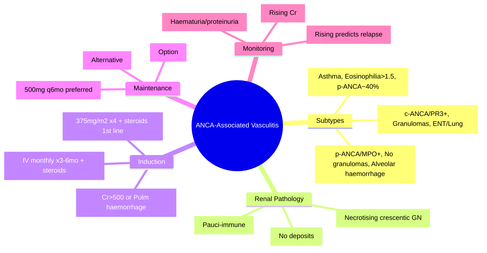

# ANCA-Associated Vasculitis (GPA, MPA, EGPA)

**Related:** [[Glomerular Diseases — Overview and Classification]], [[Secondary Glomerulonephritides — Lupus Nephritis]], [[Secondary Glomerulonephritides — Diabetic Nephropathy]], [[Secondary Glomerulonephritides — Amyloidosis]], [[Nephrology and Urology MOC]]

> [!important]
> **ANCA-Associated Vasculitis (AAV) = pauci-immune crescentic GN. Three subtypes: GPA (c-ANCA/PR3+, granulomas, ENT/lung), MPA (p-ANCA/MPO+, renal/lung), EGPA (asthma, eosinophilia, p-ANCA/MPO+ ~40%). Renal = pauci-immune necrotising crescentic GN. Induction: Rituximab or CYC + steroids; PLEX for severe renal (Cr >500) or pulmonary haemorrhage (PULSE trial).**

---

## Learning Objectives
- Distinguish GPA, MPA, EGPA by clinical features, ANCA pattern, histology
- Recognise pauci-immune crescentic GN on biopsy
- Apply induction (Rituximab vs CYC) and maintenance regimens
- Know PLEX indications (PULSE trial)
- Monitor for relapse (ANCA rise, clinical features)

---

## Classification & ANCA Patterns

| Disease | ANCA Pattern | Target Antigen | Key Clinical Features |
|---------|--------------|----------------|----------------------|
| **GPA** (Granulomatosis with Polyangiitis, Wegener's) | **c-ANCA** (cytoplasmic) | **PR3** (proteinase 3) | **Granulomatous inflammation**: ENT (sinusitis, saddle nose, subglottic stenosis), lung (nodules, cavities), renal (pauci-immune GN) |
| **MPA** (Microscopic Polyangiitis) | **p-ANCA** (perinuclear) | **MPO** (myeloperoxidase) | **No granulomas**: renal (pauci-immune GN), lung (alveolar haemorrhage), skin (purpura), nerves (mononeuritis multiplex) |
| **EGPA** (Eosinophilic Granulomatosis with Polyangiitis, Churg-Strauss) | **p-ANCA** ~40% (MPO+) | MPO | **Asthma**, **eosinophilia** (>1.5×10⁹/L), granulomas, neuropathy, cardiac, skin; renal less common/severe |

---

## Renal Pathology (All AAV)

| Modality | Findings |
|----------|----------|
| **Light Microscopy** | **Necrotising crescentic GN**: fibrinoid necrosis, cellular crescents (often >50% = RPGN) |
| **Immunofluorescence** | **Pauci-immune**: scant/no immunoglobulins, no complement (distinguishes from immune complex GN) |
| **Electron Microscopy** | No electron-dense deposits; fibrin in capillary loops; podocyte foot process effacement |

> [!key]
> **Pauci-immune necrotising crescentic GN = hallmark of AAV renal involvement.** No IF deposits = "pauci-immune".

---

## Clinical Presentation by Subtype

| Feature | GPA | MPA | EGPA |
|---------|-----|-----|------|
| **Renal** | Pauci-immune GN (common) | Pauci-immune GN (very common) | Less common, milder |
| **Lung** | Nodules, cavities, haemorrhage | **Alveolar haemorrhage** (common) | Infiltrates, less haemorrhage |
| **ENT** | **Sinusitis, saddle nose, subglottic stenosis** | Rare | Sinusitis, nasal polyps |
| **Nerves** | Mononeuritis multiplex | Mononeuritis multiplex | Mononeuritis multiplex |
| **Skin** | Purpura, ulcers | Purpura | Purpura, nodules |
| **Heart** | Rare | Rare | **Cardiomyopathy, pericarditis** |
| **Eosinophilia** | Rare | Rare | **>1.5×10⁹/L (defining)** |
| **Asthma** | No | No | **Yes (defining, often severe)** |

---

## Diagnostic Criteria (ACR/EULAR 2017)

| Disease | Key Criteria |
|---------|--------------|
| **GPA** | PR3-ANCA + granulomatous inflammation (biopsy or imaging) + ENT/lung involvement |
| **MPA** | MPO-ANCA + pauci-immune GN + no granulomas + no asthma/eosinophilia |
| **EGPA** | Asthma + eosinophilia >1.5×10⁹/L + granulomatous inflammation + neuropathy + p-ANCA/MPO+ (~40%) |

---

## Induction Therapy (Severe Disease)

| Regimen | Dose | Indication |
|---------|------|------------|
| **Rituximab (Preferred)** | **375 mg/m² weekly × 4** (or 1g × 2 doses 2wks apart) + **pulse methylprednisolone 500–1000mg × 3d → oral pred 1mg/kg** | **RAVE/ RITUXVAS trials**: non-inferior to CYC; **1st line per KDIGO/EULAR** for new-onset/relapsing; preferred in young (fertility), PR3+ |
| **Cyclophosphamide (CYC)** | **IV CYC 0.5–1g/m² monthly × 3–6mo** (or oral 2mg/kg/day) + steroids | **Classic regimen**; preferred if severe alveolar haemorrhage, renal Cr >500 (with PLEX), or rituximab contraindicated |
| **Plasma Exchange (PLEX)** | **7 exchanges over 14 days** (1.5 plasma volumes) + steroids + CYC/rituximab | **PULSE trial**: **Severe renal (Cr >500 μmol/L)** or **pulmonary haemorrhage** |

> [!key]
> **PULSE trial**: PLEX reduced ESRD risk in severe renal AAV (Cr >500) but increased infections. **Indicated: Cr >500 or pulmonary haemorrhage.**

---

## Maintenance Therapy

| Agent | Dose | Duration |
|-------|------|----------|
| **Rituximab** | **500 mg every 6 months** (or 1g × 2 doses 6mo apart) | **MAINRITSAN trials**: superior to AZA for relapse prevention; **preferred maintenance** |
| **Azathioprine** | 1.5–2 mg/kg/day | Alternative if rituximab unavailable/contraindicated |
| **Mycophenolate mofetil** | 1–2 g/day | Option (esp. if AZA intolerant) |
| **Methotrexate** | 15–25 mg/week | Non-severe disease (no renal/pulmonary involvement) |
| **Prednisolone** | Taper to ≤5–7.5 mg/day by 6mo | Lowest effective dose |

---

## Monitoring & Relapse

| Parameter | Frequency | Significance |
|-----------|-----------|--------------|
| **ANCA titre** | q3–6mo | Rising titre **predicts relapse** (~60–70% PPV); but relapse can occur without rise |
| **Urinalysis** | q1–3mo | New haematuria/proteinuria = renal flare |
| **eGFR** | q1–3mo | Rising Cr = flare |
| **FBC, LFT, renal** | q1–3mo | Drug toxicity (rituximab: IgG, infections; AZA: myelosuppression) |
| **Chest imaging** | If respiratory symptoms | Lung flare |

---

## Relapse Management

| Scenario | Management |
|----------|------------|
| **Mild (non-renal)** | Increase steroids ± add methotrexate/AZA |
| **Severe (renal/pulmonary)** | **Re-induction**: Rituximab (or CYC) + steroids ± PLEX (if Cr >500 or pulmonary haemorrhage) |
| **ANCA rise without clinical flare** | **Monitor closely**; do NOT treat based on ANCA alone |

---

## High-Yield FCPS/MRCP Points

> [!important]
> - **AAV = pauci-immune crescentic GN** (no IF deposits)
> - **GPA = c-ANCA/PR3+** + granulomas + ENT/lung + renal
> - **MPA = p-ANCA/MPO+** + no granulomas + renal/lung haemorrhage
> - **EGPA = asthma + eosinophilia >1.5×10⁹/L + p-ANCA/MPO+ (~40%)**
> - **Induction**: **Rituximab 1st line** (RAVE trial); CYC alternative
> - **PLEX**: Cr >500 or pulmonary haemorrhage (PULSE trial)
> - **Maintenance**: **Rituximab 500mg q6mo** (MAINRITSAN) preferred
> - **Relapse**: rising ANCA predicts but not 100%; treat clinical flare only
> - **Fertility**: Rituximab preferred in young; CYC = gonadal toxicity
> - **Granulomas**: GPA (yes), EGPA (yes), MPA (no)

---

## Common Confusions / Exam Traps

| Trap | Correction |
|------|------------|
| **All AAV = c-ANCA** | GPA = c-ANCA/PR3; MPA/EGPA = p-ANCA/MPO |
| **EGPA = always ANCA+** | Only ~40% ANCA+ (p-ANCA/MPO); ANCA- EGPA = more cardiac/neuro, less renal |
| **Pauci-immune = no immune deposits** | Scant IgM/C3 may be trapped; **no significant immune complexes** |
| **PLEX for all severe AAV** | Only Cr >500 or pulmonary haemorrhage (PULSE) |
| **Rituximab = only for relapse** | **1st line INDUCTION** for new-onset (RAVE) |
| **CYC = always IV monthly** | Euro-Lupus low-dose (500mg × 6 fortnightly) also used |
| **ANCA rise = always treat** | **Treat clinical flare only**; ANCA rise alone = monitor |
| **EGPA renal = severe** | EGPA renal involvement = less common, milder than GPA/MPA |
| **Maintenance = 1 year** | **Minimum 2 years**; often 5+ years for PR3+ GPA (high relapse) |

---

## Mnemonics

- **ANCA patterns**: **c-ANCA = PR3 = GPA**; **p-ANCA = MPO = MPA/EGPA** = **cPR3-GPA, pMPO-MPA/EGPA**
- **GPA**: **G**ranulomas, **P**R3, **A**NCA = **GPA**
- **MPA**: **M**PO, **P**auci-immune, **A**lveolar haemorrhage = **MPA**
- **EGPA**: **E**osinophilia, **G**ranulomas, **P**olyangiitis, **A**sthma = **EGPA**
- **PULSE**: **P**lasma exchange for **U**raemia/Severe renal (Cr>500) + **L**ung haemorrhage = **PULSE**
- **Induction**: **R**ituximab **F**irst (RAVE) = **RF**
- **Maintenance**: **R**ituximab **Q**6mo = **RQ**

---

## Mind Map

---

## 24-Hour Recall Prompts
1. Three AAV subtypes and their ANCA patterns (GPA=c-ANCA/PR3, MPA=p-ANCA/MPO, EGPA=p-ANCA/MPO~40%)
2. GPA triad: granulomas, ENT, renal
3. MPA: alveolar haemorrhage, renal
4. EGPA: asthma, eosinophilia >1.5, ANCA 40%
5. Renal biopsy: pauci-immune necrotising crescentic GN
6. Induction: Rituximab 1st line (RAVE); CYC alternative
7. PLEX: Cr >500 or pulmonary haemorrhage (PULSE)
8. Maintenance: Rituximab 500mg q6mo (MAINRITSAN)
9. Relapse: treat clinical flare only, not ANCA rise alone

---

## 7-Day / 15-Day / 30-Day Revision Tracker

| Day | Date | Recall (1-5) | Notes |
|-----|------|--------------|-------|
| 1   |      |              |       |
| 7   |      |              |       |
| 15  |      |              |       |
| 30  |      |              |       |

---

## Must Know / Should Know / Nice to Know

| Priority | Content |
|----------|---------|
| **Must Know 🔴** | Three subtypes + ANCA patterns, pauci-immune crescentic GN, induction (Rituximab 1st line), PLEX indications, maintenance (Rituximab q6mo), relapse management |
| **Should Know 🟡** | EGPA ANCA-negative variant, PULSE trial details, RAVE/RITUXVAS/MAINRITSAN trials, fertility considerations, drug monitoring |
| **Nice to Know 🟢** | Avacopan (C5aR inhibitor), novel biomarkers, long-term outcomes, pregnancy in AAV, vaccines |

---

## MCQs (10)

1. **Pauci-immune crescentic GN is characteristic of:**
   A. Lupus nephritis Class IV
   B. **ANCA-associated vasculitis**
   C. Post-streptococcal GN
   D. IgA nephropathy
   E. Anti-GBM disease

2. **GPA (Granulomatosis with Polyangiitis) ANCA pattern:**
   A. p-ANCA / MPO
   B. **c-ANCA / PR3**
   C. c-ANCA / MPO
   D. p-ANCA / PR3
   E. ANCA negative

3. **EGPA (Churg-Strauss) defining features:**
   A. c-ANCA + granulomas
   B. **Asthma + eosinophilia >1.5×10⁹/L**
   C. Alveolar haemorrhage + renal
   D. p-ANCA + no asthma
   E. Sinusitis + renal only

4. **Renal biopsy in AAV shows immunofluorescence:**
   A. Granular capillary wall IgG
   B. Linear GBM IgG
   C. **Pauci-immune (scant/no immunoglobulins)**
   D. Full-house (IgG, IgM, IgA, C3, C1q)
   E. Mesangial IgA

5. **First-line induction for severe ANCA-associated vasculitis (RAVE trial):**
   A. Cyclophosphamide + steroids
   B. **Rituximab + steroids**
   C. Plasma exchange + steroids
   D. Methotrexate + steroids
   E. Mycophenolate + steroids

6. **PULSE trial — plasma exchange indicated for:**
   A. All AAV with Cr >200
   B. **Cr >500 μmol/L OR pulmonary haemorrhage**
   C. Any alveolar haemorrhage
   D. ANCA titre >1:640
   E. EGPA only

7. **Preferred maintenance therapy per MAINRITSAN trials:**
   A. Azathioprine
   B. Mycophenolate mofetil
   C. **Rituximab 500mg every 6 months**
   D. Methotrexate
   E. Low-dose cyclophosphamide

8. **EGPA ANCA positivity rate:**
   A. >90%
   B. 70–80%
   C. **~40% (p-ANCA/MPO)**
   D. <10%
   E. 100%

9. **GPA vs MPA — key distinguishing feature:**
   A. ANCA pattern only
   B. **Granulomatous inflammation (GPA) vs absent (MPA)**
   C. Renal involvement (GPA) vs absent (MPA)
   D. Lung involvement (GPA) vs absent (MPA)
   E. Age of onset

10. **ANCA titre rising without clinical symptoms:**
    A. Start rituximab immediately
    B. Increase steroids
    C. **Monitor closely; do NOT treat based on ANCA alone**
    D. Plasma exchange
    E. Repeat biopsy

---

## SBA Questions (10)

1. **25-year-old man, haemoptysis, haematuria, Cr 200, c-ANCA positive (PR3+), sinusitis. Biopsy: necrotising crescentic GN, pauci-immune. Diagnosis:**
   A. MPA
   B. **GPA**
   C. EGPA
   D. Anti-GBM disease
   E. Lupus nephritis

2. **60-year-old woman, rapidly progressive GN (Cr 600), pulmonary haemorrhage, p-ANCA positive (MPO+). No asthma, no granulomas. Induction:**
   A. Rituximab alone
   B. **CYC + steroids + Plasma Exchange (PULSE: Cr>500 + pulm haemorrhage)**
   C. Rituximab + steroids (no PLEX)
   D. Methotrexate + steroids
   E. Supportive only

3. **35-year-old woman, asthma since childhood, eosinophilia 3×10⁹/L, mononeuritis multiplex, p-ANCA negative. Renal: mild proteinuria, no active sediment. Diagnosis:**
   A. GPA
   B. MPA
   C. **EGPA (ANCA-negative variant)**
   D. Hypereosinophilic syndrome
   E. Allergic bronchopulmonary aspergillosis

4. **GPA patient completed rituximab induction, in remission. Maintenance:**
   A. Azathioprine 2mg/kg/day
   B. **Rituximab 500mg every 6 months**
   C. Mycophenolate 2g/day
   D. Methotrexate 20mg/week
   E. Stop immunosuppression

5. **MPA patient on maintenance rituximab 6-monthly. Presents with rising MPO-ANCA titre (1:80 → 1:640) but normal Cr, no haematuria, no symptoms. Management:**
   A. Increase rituximab frequency
   B. Pulse steroids
   C. **Monitor closely; do NOT treat based on ANCA alone**
   D. Re-induction with CYC
   E. Plasma exchange

6. **25-year-old woman with GPA desires future fertility. Induction choice:**
   A. CYC IV monthly (gonadal toxicity high)
   B. **Rituximab (preferred — less gonadal toxicity)**
   C. Methotrexate (teratogenic)
   D. CYC oral daily
   E. Plasma exchange only

7. **Anti-GBM disease vs AAV — distinguishing feature on IF:**
   A. Both pauci-immune
   B. **Anti-GBM: linear GBM IgG; AAV: pauci-immune**
   C. Anti-GBM: granular IgG; AAV: linear
   D. Both: full-house
   E. No difference

8. **EGPA cardiac involvement:**
   A. Rare, <5%
   B. **Common: cardiomyopathy, pericarditis, heart failure**
   C. Only pericarditis
   D. Only arrhythmias
   E. Not seen

9. **PULSE trial result for severe renal AAV (Cr >500):**
   A. PLEX increased mortality
   B. **PLEX reduced ESRD risk but increased serious infections**
   C. PLEX no benefit
   D. PLEX replaced CYC
   E. PLEX only for pulmonary haemorrhage

10. **Relapse rate in PR3+ GPA vs MPO+ MPA:**
    A. PR3+ lower relapse
    B. **PR3+ higher relapse rate**
    C. Equal relapse rates
    D. PR3+ never relapses
    E. MPO+ never relapses

---

## Flashcards

- Q: AAV renal biopsy IF?
  A: Pauci-immune (scant/no immunoglobulins)

- Q: GPA ANCA?
  A: c-ANCA / PR3

- Q: MPA ANCA?
  A: p-ANCA / MPO

- Q: EGPA ANCA?
  A: p-ANCA / MPO ~40%

- Q: GPA triad?
  A: Granulomas, ENT, Renal

- Q: MPA hallmark?
  A: Alveolar haemorrhage + pauci-immune GN

- Q: EGPA defining?
  A: Asthma + eosinophilia >1.5×10⁹/L

- Q: Induction 1st line?
  A: Rituximab + steroids (RAVE trial)

- Q: CYC induction?
  A: IV 0.5–1g/m² monthly × 3–6mo + steroids

- Q: PLEX indication (PULSE)?
  A: Cr >500 or pulmonary haemorrhage

- Q: Maintenance preferred?
  A: Rituximab 500mg q6mo (MAINRITSAN)

- Q: ANCA rise alone?
  A: Monitor; do NOT treat

- Q: EGPA ANCA negative?
  A: ~60% ANCA-; more cardiac/neuro, less renal

- Q: GPA vs MPA granulomas?
  A: GPA = yes; MPA = no

- Q: Fertility preservation?
  A: Rituximab preferred over CYC

---

## Answer Key with Explanations

### MCQs
1. **B** — Pauci-immune crescentic GN = hallmark of AAV
2. **B** — GPA = c-ANCA/PR3+
3. **B** — EGPA = asthma + eosinophilia >1.5×10⁹/L (defining)
4. **C** — Pauci-immune = scant/no immunoglobulins
5. **B** — RAVE/RITUXVAS: Rituximab non-inferior to CYC, 1st line
6. **B** — PULSE: Cr >500 OR pulmonary haemorrhage
7. **C** — MAINRITSAN: Rituximab 500mg q6mo superior to AZA
8. **C** — EGPA ANCA+ ~40% (p-ANCA/MPO)
9. **B** — GPA = granulomas; MPA = no granulomas
10. **C** — Treat clinical flare only; ANCA rise alone = monitor

### SBAs
1. **B** — c-ANCA/PR3 + sinusitis + pauci-immune GN = GPA
2. **B** — Cr 600 + pulmonary haemorrhage = PLEX indicated (PULSE) + CYC/rituximab + steroids
3. **C** — Asthma + eosinophilia + ANCA-negative = EGPA (ANCA-negative variant)
4. **B** — MAINRITSAN: Rituximab 500mg q6mo preferred maintenance
5. **C** — ANCA rise without clinical flare = monitor only
6. **B** — Rituximab preferred for fertility preservation (less gonadal toxicity)
7. **B** — Anti-GBM = linear GBM IgG; AAV = pauci-immune
8. **B** — EGPA cardiac: cardiomyopathy, pericarditis common
9. **B** — PULSE: PLEX reduced ESRD but increased infections
10. **B** — PR3+ GPA has higher relapse rate than MPO+ MPA

---

## Summary

**ANCA-Associated Vasculitis** is a **Must Know 🔴** topic.
**Key takeaway:** Three subtypes: **GPA (c-ANCA/PR3+, granulomas, ENT/lung)**, **MPA (p-ANCA/MPO+, alveolar haemorrhage, no granulomas)**, **EGPA (asthma, eosinophilia >1.5, p-ANCA~40%)**. Renal = **pauci-immune necrotising crescentic GN**. **Induction: Rituximab 1st line** (RAVE); CYC alternative. **PLEX for Cr >500 or pulmonary haemorrhage** (PULSE). **Maintenance: Rituximab 500mg q6mo** (MAINRITSAN). Relapse = treat clinical flare only; ANCA rise alone = monitor.
**Exam focus:** Subtype differentiation, ANCA patterns, pauci-immune GN, induction regimens, PLEX indications, maintenance, EGPA ANCA-negative variant, fertility.
**Clinical relevance:** Rituximab transformed management; early PLEX in severe renal saves kidneys; long maintenance prevents relapse.