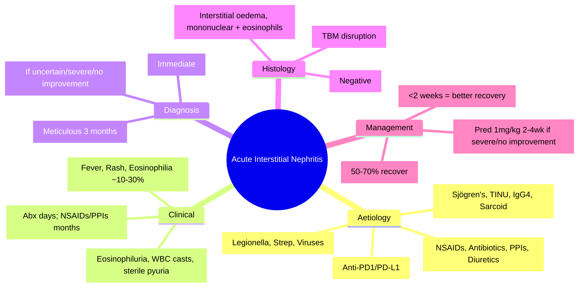

# Tubulointerstitial Diseases — Acute Interstitial Nephritis (AIN)

<callout icon="🩺" color="red_bg">
**Topic:** Tubulointerstitial Diseases — Acute Interstitial Nephritis (AIN) — Nephrology & Urology
**Style:** Sea Knowledge study infographic
**Audience:** FCPS / MRCP exam prep
</callout>

**Related:** [[Tubulointerstitial Diseases — Chronic Interstitial Nephritis]], [[Tubulointerstitial Diseases — Drug-Induced Tubulointerstitial Injury]], [[Acute Kidney Injury (AKI)]], [[Nephrology and Urology MOC]]

> [!important]
> **AIN = acute interstitial inflammation + oedema. Drug-induced (70%): NSAIDs, antibiotics (β-lactams, quinolones), PPIs, diuretics. Infections (legionella, strep), autoimmune (Sjögren's, TINU), idiopathic. Classic triad: fever, rash, eosinophilia (only ~10–30%). Diagnosis: biopsy (interstitial oedema, mononuclear infiltrate, eosinophils). Treatment: stop offending drug ± steroids (1mg/kg if severe).**

---

## 1. Learning Objectives
- Recognise clinical presentations (drug-induced, infectious, autoimmune)
- Identify classic triad and its limitations
- Apply diagnostic approach (urine eosinophils, biopsy indications)
- Manage with drug withdrawal and steroid therapy
- Differentiate from ATN, GN, other AKI causes

---

## 2. Aetiology

| Category | Examples | Notes |
|----------|----------|-------|
| **Drugs (70%)** | **NSAIDs** (commonest), **Antibiotics** (β-lactams, quinolones, sulfonamides, rifampicin), **PPIs** (omeprazole, lansoprazole), Diuretics (thiazides, furosemide), Allopurinol, ICIs (immune checkpoint inhibitors) | **Latency**: NSAIDs/PPIs weeks–months; antibiotics/allopurinol days–weeks |
| **Infections** | Legionella, Streptococcus, Mycobacteria, Viruses (Hantavirus, CMV, EBV, HIV), Leptospira | Often part of systemic illness |
| **Autoimmune/Systemic** | **Sjögren's syndrome**, **TINU** (Tubulointerstitial Nephritis + Uveitis), Sarcoidosis, IgG4-related disease, SLE, ANCA vasculitis | TINU = young women, uveitis precedes/follows renal |
| **Idiopathic** | ~10–15% | Diagnosis of exclusion |

---

## 3. Clinical Presentation

| Feature | Drug-Induced | NSAID-Induced | Infectious/Autoimmune |
|---------|--------------|---------------|----------------------|
| **Onset** | Days–weeks (antibiotics); weeks–months (NSAIDs/PPIs) | Insidious (weeks–months) | Acute/subacute |
| **Fever** | ~30–50% | Rare | Common |
| **Rash** | ~15–30% (maculopapular) | Rare | Variable |
| **Eosinophilia** | ~10–30% (peripheral) | Rare | Variable |
| **Eosinophiluria** | ~50–80% (Hansel's stain) | ~30% | Variable |
| **Urine Output** | Non-oliguric AKI common | Non-oliguric | Variable |
| **Extrarenal** | Arthralgia, myalgia | Nephrotic syndrome (minimal change overlap) | Uveitis (TINU), sicca (Sjögren's) |

> [!key]
> **Classic triad (fever, rash, eosinophilia) = ONLY ~10–30% of cases.** Do not exclude AIN if triad absent.

---

## 4. Urine Findings

| Finding | Significance |
|---------|--------------|
| **Eosinophiluria** (Hansel's stain) | **Sensitivity ~50–80%, Specificity ~70–80%**; also in atheroembolic, pyelo, GN, obstruction |
| **WBC casts** | Interstitial inflammation (AIN, pyelonephritis) |
| **Sterile pyuria** | Common |
| **Proteinuria** | Usually subnephrotic (<1g); NSAIDs can cause nephrotic range (MCD overlap) |
| **Haematuria** | Microscopic common |
| **Tubular proteinuria** | Low molecular weight proteins (β2-microglobulin, NAG) |

---

## 5. Diagnostic Approach

| Step | Action |
|------|--------|
| **1. Drug History** | **Meticulous**: all drugs (prescribed, OTC, herbal) in past 3 months; focus on NSAIDs, antibiotics, PPIs, diuretics |
| **2. Stop Suspected Drug** | **Immediate withdrawal** — single most important intervention |
| **3. Urine Tests** | Microscopy (WBC casts, eosinophils), eosinophiluria (Hansel's) |
| **4. Blood Tests** | Eosinophilia, CRP, IgE, complement (usually normal), ANCA, ANA, SPEP |
| **5. Imaging** | US: normal/large kidneys, loss of corticomedullary differentiation |
| **6. Renal Biopsy** | **Gold standard** if: diagnosis uncertain, no response to drug withdrawal in 5–7 days, severe AKI (Cr >300), need for steroids |

---

## 6. Histopathology (Biopsy)

| Modality | Findings |
|----------|----------|
| **Light Microscopy** | **Interstitial oedema**, **mononuclear infiltrate** (lymphocytes, plasma cells, macrophages), **eosinophils** (prominent in drug-induced); tubulitis; **no glomerular involvement** |
| **Immunofluorescence** | Usually negative; occasional IgM/C3 in tubular basement membrane (non-specific) |
| **Electron Microscopy** | Tubular basement membrane disruption; no deposits |

---

## 7. Differential Diagnosis

| Condition | Distinguishing Feature |
|-----------|----------------------|
| **ATN** | Muddy brown casts, FeNa >2%, no eosinophilia/rash/fever, no WBC casts |
| **Acute GN** | Haematuria, RBC casts, proteinuria, hypertension, low complement |
| **Pyelonephritis** | Fever, flank pain, bacteriuria, WBC casts, positive culture |
| **Atheroembolic Disease** | Eosinophilia, eosinophiluria, livedo reticularis, post-vascular procedure, hypertension |
| **Obstructive Uropathy** | Hydronephrosis on US, anuria/fluctuating output |
| **NSAID-induced MCD** | Nephrotic syndrome, selective proteinuria, minimal change on biopsy |

---

## 8. Management

| Step | Action |
|------|--------|
| **1. Stop Offending Drug** | **Immediate** — most important step; ~50–70% recover with withdrawal alone |
| **2. Supportive** | Fluids, avoid nephrotoxins, monitor electrolytes, manage complications |
| **3. Steroids (if indicated)** | **Indications**: Severe AKI (Cr >300), no improvement after 5–7 days drug withdrawal, significant extrarenal features |
| **Steroid Regimen** | **Prednisolone 1 mg/kg/day (max 60–80mg) × 2–4 weeks** → taper over 4–8 weeks; total 6–12 weeks |
| **4. Monitor** | Serial Cr, eGFR; if no improvement by 2 weeks → re-evaluate (biopsy if not done) |

> [!key]
> **Early steroid initiation (within 1–2 weeks) → better renal recovery.** Delay >2–4 weeks = worse outcome.

---

## 9. Prognosis & Outcomes

| Factor | Better Prognosis | Worse Prognosis |
|--------|------------------|-----------------|
| **Timing of steroid** | <1–2 weeks | >4 weeks |
| **Drug type** | Antibiotics, PPIs | NSAIDs (often incomplete recovery) |
| **Baseline CKD** | None | Pre-existing CKD |
| **Severity** | Non-oliguric, Cr <300 | Oliguric, Cr >400 |
| **Interstitial fibrosis on biopsy** | Minimal | Severe (T score equivalent) |

> [!key]
> **NSAID-AIN: often incomplete recovery, higher risk of chronic interstitial nephritis.**

---

## 10. Special Syndromes

| Syndrome | Features |
|----------|----------|
| **TINU (Tubulointerstitial Nephritis + Uveitis)** | Young women; bilateral uveitis ± renal; steroids for both |
| **Sjögren's Syndrome** | Sicca + renal (AIN, RTA type 1, nephrolithiasis); ANA+, anti-Ro/La+ |
| **IgG4-Related Disease** | IgG4+ plasma cells on biopsy, storiform fibrosis, obliterative phlebitis; multi-organ |
| **Checkpoint Inhibitor Nephritis** | ICI (anti-PD1/PD-L1/CTLA4); AIN histology; high steroids; hold ICI |

---

## 11. High-Yield FCPS/MRCP Points

> [!important]
> - **AIN = drug-induced (70%)**: NSAIDs (commonest), antibiotics, PPIs, diuretics
> - **Classic triad (fever, rash, eosinophilia) = only 10–30%** — do not rely on it
> - **Eosinophiluria (Hansel's)**: sensitivity 50–80%, not specific
> - **WBC casts** = interstitial inflammation
> - **Biopsy**: interstitial oedema + mononuclear infiltrate + eosinophils
> - **Step 1: Stop drug** — 50–70% recover with withdrawal alone
> - **Steroids**: Pred 1mg/kg × 2–4wk → taper 4–8wk if severe/no improvement in 5–7d
> - **Early steroids (<2 weeks) = better recovery**
> - **NSAID-AIN**: often nephrotic overlap (MCD), incomplete recovery
> - **TINU**: young women, uveitis + AIN
> - **Checkpoint inhibitor nephritis**: AIN histology, hold ICI, high-dose steroids

---

## 12. Common Confusions / Exam Traps

| Trap | Correction |
|------|------------|
| **No triad = not AIN** | Triad only 10–30%; most have NONE |
| **Eosinophiluria = specific for AIN** | Also in atheroembolic, pyelo, GN, obstruction |
| **NSAID-AIN = same as other drug AIN** | NSAID-AIN: insidious, often nephrotic (MCD overlap), higher chronicity |
| **All AIN need steroids** | Mild/improving with drug withdrawal → no steroids |
| **Steroids can be delayed** | Early (<2 weeks) = better recovery; delay = worse |
| **Biopsy always needed** | Not if clear drug history + improvement with withdrawal |
| **Checkpoint inhibitor = ATN** | Usually AIN histology; needs steroids |
| **AIN = always reversible** | Can progress to chronic interstitial nephritis/CKD |

---

## 13. Mnemonics

- **AIN Drugs**: **N**SAIDs, **A**ntibiotics, **P**PIs, **D**iuretics = **NAPD**
- **Triad**: **F**ever, **R**ash, **E**osinophilia = **FRE** (only 10–30%)
- **Diagnosis**: **S**top drug, **E**osinophiluria, **W**BC casts, **B**iopsy = **SEWB**
- **Steroids**: **E**arly (<2wk) = **B**etter = **EB**
- **NSAID-AIN**: **N**ephrotic, **I**nsidious, **C**hronic = **NIC**
- **TINU**: **T**ubulointerstitial **N**ephritis + **U**veitis = young women
- **Sjögren's**: **S**icca + **A**IN + **R**TA + **S**tones = **SARS**

---

## 14. Mind Map

---

## 15. 24-Hour Recall Prompts
1. Commonest cause AIN: NSAIDs
2. Classic triad (fever, rash, eosinophilia) only 10–30%
3. Drug latency: antibiotics days–weeks; NSAIDs/PPIs weeks–months
4. Urine: eosinophiluria (Hansel's), WBC casts, sterile pyuria
5. Step 1: STOP OFFENDING DRUG (50–70% recover)
6. Steroids: pred 1mg/kg × 2–4wk if severe/no improvement 5–7d
7. Early steroids (<2 weeks) = better recovery
8. NSAID-AIN: insidious, nephrotic overlap, higher chronicity
9. TINU: young women, uveitis + AIN
10. Checkpoint inhibitor nephritis: AIN histology, hold ICI, steroids

---

## 16. 7-Day / 15-Day / 30-Day Revision Tracker

| Day | Date | Recall (1-5) | Notes |
|-----|------|--------------|-------|
| 1   |      |              |       |
| 7   |      |              |       |
| 15  |      |              |       |
| 30  |      |              |       |

---

## 17. Must Know / Should Know / Nice to Know

| Priority | Content |
|----------|---------|
| **Must Know 🔴** | Drug causes (NSAIDs, antibiotics, PPIs), triad limitations, eosinophiluria/WBC casts, stop drug first, steroid indications/regimen, early steroid timing, NSAID-AIN features |
| **Should Know 🟡** | TINU, Sjögren's, IgG4-RD, checkpoint inhibitor nephritis, biopsy indications, prognosis factors |
| **Nice to Know 🟢** | Novel biomarkers, genetic susceptibility, long-term outcomes, pregnancy |

---

## 18. MCQs (10)

1. **Commonest cause of drug-induced AIN:**
   A. Antibiotics
   B. **NSAIDs**
   C. PPIs
   D. Diuretics
   E. Allopurinol

2. **Classic triad of AIN (fever, rash, eosinophilia) is present in:**
   A. >80% of cases
   B. 50–60% of cases
   C. **~10–30% of cases**
   D. <5% of cases
   E. Only NSAID-induced AIN

3. **Urine finding suggestive of AIN:**
   A. Muddy brown granular casts
   B. **WBC casts**
   C. RBC casts
   D. Hyaline casts
   E. Fatty casts

4. **Eosinophiluria (Hansel's stain) sensitivity for AIN:**
   A. 90–95%
   B. **~50–80%**
   C. 30–40%
   D. <20%
   E. 100%

5. **First and most important step in management of suspected drug-induced AIN:**
   A. Start steroids immediately
   B. **Stop the offending drug**
   C. Renal biopsy
   D. Plasma exchange
   E. Dialysis

6. **Steroid regimen for AIN (if indicated):**
   A. Pulse methylprednisolone 1g × 3 days
   B. **Prednisolone 1 mg/kg/day × 2–4 weeks → taper 4–8 weeks**
   C. Prednisolone 0.5 mg/kg/day × 12 weeks
   D. Pulse cyclophosphamide + steroids
   E. Rituximab

7. **NSAID-induced AIN — characteristic features:**
   A. Acute onset, fever, rash, eosinophilia
   B. **Insidious onset (weeks–months), often nephrotic range proteinuria (MCD overlap)**
   C. Prominent eosinophilia >90%
   D. Rapid recovery with drug withdrawal
   E. Never requires steroids

8. **TINU syndrome — demographics and features:**
   A. Elderly men, unilateral uveitis
   B. **Young women, bilateral uveitis + AIN**
   C. Children, no uveitis
   D. Middle-aged, only renal
   E. Associated with NSAIDs

9. **Checkpoint inhibitor (anti-PD-1/PD-L1) nephritis — typical histology:**
   A. ATN
   B. **AIN (interstitial oedema, mononuclear infiltrate, eosinophils)**
   C. Glomerulonephritis
   D. Thrombotic microangiopathy
   E. Minimal change disease

10. **Prognosis factor for WORSE outcome in AIN:**
    A. Antibiotic cause, early steroids
    B. **NSAID cause, delayed steroids >4 weeks, pre-existing CKD, interstitial fibrosis on biopsy**
    C. Young age, no comorbidities
    D. Eosinophilia >20%
    E. Non-oliguric presentation

---

## 19. SBA Questions (10)

1. **65-year-old man, recent omeprazole for dyspepsia (3 months), presents with AKI (Cr 280, baseline 90), sterile pyuria, eosinophiluria+. No fever, no rash. Best next step:**
   A. Start prednisolone 1mg/kg
   B. **Stop omeprazole, monitor Cr (50–70% recover with withdrawal)**
   C. Renal biopsy immediately
   D. Pulse methylprednisolone
   E. Continue omeprazole, add antihistamine

2. **40-year-old woman, recent ciprofloxacin for UTI (10 days), AKI (Cr 350), fever 38.5°C, maculopapular rash, eosinophilia 0.8×10⁹/L. Urine: WBC casts+, eosinophiluria+. Cr not improving after 7 days off antibiotic. Management:**
   A. Continue observation
   B. **Prednisolone 1mg/kg/day × 2–4 weeks → taper**
   C. Pulse cyclophosphamide
   D. Plasma exchange
   E. Dialysis only

3. **70-year-old woman, chronic NSAID use for osteoarthritis, presents with nephrotic syndrome (proteinuria 5g/day, albumin 20g/L) + AKI (Cr 200). Urine: selective proteinuria. Biopsy: AIN + minimal change features. Diagnosis:**
   A. Primary MCD
   B. **NSAID-induced AIN with MCD overlap**
   C. Membranous nephropathy
   D. Amyloidosis
   D. Diabetic nephropathy

4. **25-year-old woman, bilateral uveitis 2 months ago, now AKI, sterile pyuria, WBC casts. Biopsy: interstitial nephritis. Diagnosis:**
   A. Sjögren's syndrome
   B. **TINU syndrome**
   C. IgG4-related disease
   D. Sarcoidosis
   E. Drug-induced AIN

5. **55-year-old man on pembrolizumab (anti-PD-1) for melanoma, develops AKI (Cr 300). Biopsy: interstitial oedema, lymphocytic infiltrate, eosinophils. Management:**
   A. Continue pembrolizumab, start ACEi
   B. **Hold pembrolizumab, start prednisolone 1mg/kg**
   C. Pulse cyclophosphamide
   D. Plasma exchange
   E. Continue pembrolizumab, monitor

6. **AIN — eosinophiluria is also seen in:**
   A. Only AIN
   B. **Atheroembolic disease, pyelonephritis, GN, obstruction**
   C. Only pyelonephritis
   D. Only GN
   E. Only obstruction

7. **AIN — WBC casts indicate:**
   A. Glomerular inflammation
   B. **Tubulointerstitial inflammation**
   C. Tubular necrosis
   D. Obstruction
   E. Normal variant

8. **NSAID-AIN vs antibiotic-AIN — key difference:**
   A. NSAID = more eosinophilia
   B. **NSAID = insidious, nephrotic overlap, higher chronicity; antibiotic = acute, classic triad more common**
   C. NSAID = never needs steroids
   D. Antibiotic = always needs steroids
   E. No difference

9. **26-year-old woman, Sjögren's syndrome, AKI, urine pH 6.5 (inappropriately high for acidosis), hypokalaemia, nephrolithiasis. Renal manifestation:**
   A. AIN
   B. **Distal RTA (Type 1) + AIN + nephrolithiasis**
   C. Proximal RTA
   D. Fanconi syndrome
   E. Minimal change disease

10. **Best indicator of renal recovery in AIN:**
    A. Resolution of fever
    B. **Early steroid initiation (<2 weeks from onset)**
    C. Eosinophiluria resolution
    D. Rash resolution
    E. Drug withdrawal alone

---

## 20. Flashcards

- Q: Commonest drug causing AIN?
  A: NSAIDs

- Q: AIN classic triad prevalence?
  A: Only 10–30%

- Q: Drug latency antibiotics vs NSAIDs/PPIs?
  A: Abx days–weeks; NSAIDs/PPIs weeks–months

- Q: AIN urine findings?
  A: Eosinophiluria (Hansel's), WBC casts, sterile pyuria, subnephrotic proteinuria

- Q: Step 1 management AIN?
  A: STOP offending drug

- Q: Steroid indication AIN?
  A: Severe AKI (Cr>300), no improvement 5–7d off drug, significant extrarenal

- Q: Steroid regimen AIN?
  A: Pred 1mg/kg/day × 2–4wk → taper 4–8wk

- Q: Early steroids timing?
  A: <2 weeks = better recovery

- Q: NSAID-AIN features?
  A: Insidious, nephrotic overlap (MCD), higher chronicity

- Q: TINU?
  A: Young women, uveitis + AIN

- Q: Sjögren's renal?
  A: AIN, distal RTA type 1, nephrolithiasis

- Q: Checkpoint inhibitor nephritis?
  A: AIN histology; hold ICI + steroids

- Q: Eosinophiluria also in?
  A: Atheroembolic, pyelo, GN, obstruction

- Q: WBC casts = ?
  A: Tubulointerstitial inflammation

---

## 21. Answer Key with Explanations

### MCQs
1. **B** — NSAIDs = commonest drug causing AIN
2. **C** — Classic triad only in ~10–30% of cases
3. **B** — WBC casts = tubulointerstitial inflammation (AIN, pyelonephritis)
4. **B** — Eosinophiluria sensitivity ~50–80%
5. **B** — Stop offending drug = most important step; 50–70% recover
6. **B** — Pred 1mg/kg × 2–4wk → taper 4–8wk
7. **B** — NSAID-AIN: insidious, nephrotic overlap (MCD), higher chronicity
8. **B** — TINU = young women, bilateral uveitis + AIN
9. **B** — Checkpoint inhibitor nephritis = AIN histology
10. **B** — NSAID cause, delayed steroids >4wk, pre-existing CKD, fibrosis = worse

### SBAs
1. **B** — PPI-AIN, no severe features, improving likely → stop drug, monitor (50–70% recover)
2. **B** — Severe AKI (Cr 350), triad present, no improvement 7d off drug → steroids
3. **B** — Chronic NSAID + nephrotic + AIN biopsy = NSAID-AIN with MCD overlap
4. **B** — Uveitis + AIN = TINU (young women)
5. **B** — ICI nephritis = hold ICI + pred 1mg/kg
6. **B** — Eosinophiluria also in atheroembolic, pyelo, GN, obstruction
7. **B** — WBC casts = tubulointerstitial inflammation
8. **B** — NSAID = insidious, nephrotic, chronic; antibiotic = acute, triad more common
9. **B** — Sjögren's = AIN + distal RTA type 1 + nephrolithiasis
10. **B** — Early steroid initiation (<2 weeks) = best predictor of recovery

---

## 22. Summary

**Acute Interstitial Nephritis (AIN)** is a **Must Know 🔴** topic.
**Key takeaway:** 70% drug-induced (NSAIDs commonest, then antibiotics, PPIs, diuretics). **Classic triad (fever, rash, eosinophilia) only 10–30%**. Urine: eosinophiluria, WBC casts, sterile pyuria. **Step 1: STOP DRUG** — 50–70% recover. Steroids (pred 1mg/kg × 2–4wk → taper) if severe/no improvement 5–7d. **Early steroids (<2wk) = better recovery**. NSAID-AIN: insidious, nephrotic overlap, higher chronicity. TINU = young women + uveitis. Checkpoint inhibitor nephritis = AIN histology. Sjögren's = AIN + distal RTA + stones.
**Exam focus:** Drug causes, triad limitations, eosinophiluria/WBC casts, stop drug first, steroid indications/regimen/timing, NSAID-AIN features, TINU, checkpoint inhibitor nephritis.
**Clinical relevance:** Early recognition and drug withdrawal prevents irreversible fibrosis; steroids time-sensitive.