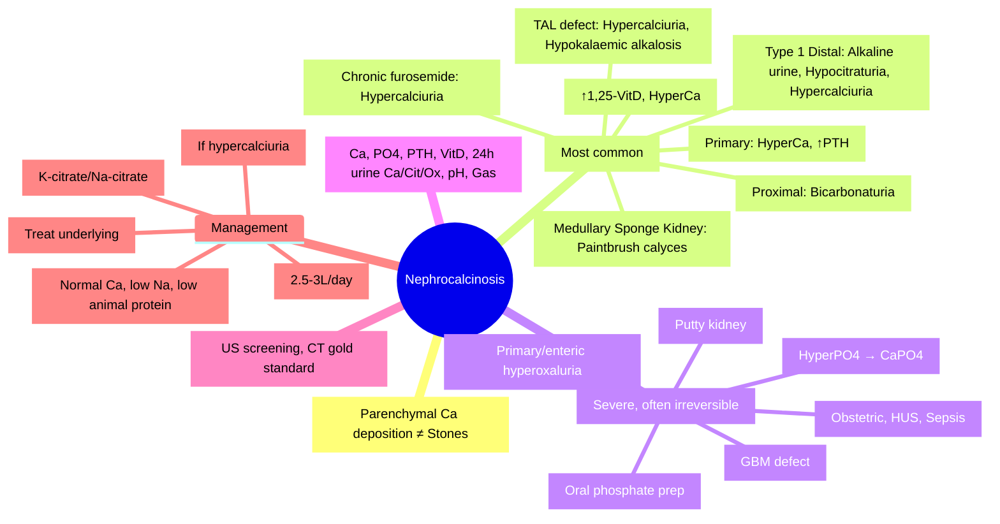

# Nephrocalcinosis

<callout icon="🩺" color="red_bg">
**Topic:** Nephrocalcinosis — Nephrology & Urology
**Style:** Sea Knowledge study infographic
**Audience:** FCPS / MRCP exam prep
</callout>

**Related:** [[Bartter and Gitelman Syndromes (plus Liddle)]], [[Renal Tubular Acidosis (RTA Types 1, 2, 4)]], [[Polycystic Kidney Disease (ADPKD, ARPKD)]], [[Chronic Kidney Disease (CKD)]], [[Urolithiasis (Renal Stones)]], [[Nephrology and Urology MOC]]

> [!important]
> **Nephrocalcinosis = generalised calcium deposition in renal parenchyma (cortex ± medulla). Distinct from nephrolithiasis (discrete stones). Causes: hypercalciuria, hypercalcaemia, hypocitraturia, alkaline urine, renal tubular defects. Medullary = most common (distal RTA, Bartter, loop diuretics, medullary sponge kidney). Cortical = severe (cortical necrosis, acute phosphate nephropathy, tumour lysis, Alport). Can cause CKD.**

---

## 1. Learning Objectives
- Differentiate nephrocalcinosis vs nephrolithiasis
- Classify by distribution (medullary vs cortical) and aetiology
- Identify underlying causes (RTA Type 1, Bartter, hyperparathyroidism, medullary sponge kidney, etc.)
- Diagnose via imaging (US, CT) and metabolic workup
- Manage underlying cause + prevent progression
- Apply to FCPS/MRCP radiology and metabolic vignettes

---

## 2. Definition & Distinction

| Feature | **Nephrocalcinosis** | **Nephrolithiasis** |
|---------|---------------------|---------------------|
| **Definition** | Diffuse calcium deposition **in renal parenchyma** | Discrete **stones in collecting system** (calyces, pelvis, ureter) |
| **Imaging** | US/CT: **echogenic foci in parenchyma** | US/CT: **stones in lumen** with acoustic shadowing |
| **Pathology** | Tubular basement membrane / interstitium | Urinary supersaturation → crystal aggregation |
| **Renal function** | Often impaired (CKD) | Preserved until obstruction/infection |
| **Association** | Can coexist with stones | May occur without parenchymal calcification |

---

## 3. Classification by Distribution

### 1. Medullary Nephrocalcinosis (Most Common)
| Cause | Mechanism | Key Features |
|-------|-----------|--------------|
| **Distal RTA (Type 1)** | Alkaline urine + hypocitraturia + hypercalciuria | **Classic** — bilateral, symmetric |
| **Bartter Syndrome** | Hypercalciuria (TAL Ca²⁺ wasting) + hypocitraturia | Children, nephrocalcinosis + hypokalaemic alkalosis |
| **Primary Hyperparathyroidism** | Hypercalcaemia → hypercalciuria | ↑ PTH, ↑ Ca²⁺, ↓ PO₄ |
| **Medullary Sponge Kidney** | Dilated collecting ducts → stasis → Ca²⁺ precipitation | **Asymptomatic** or stones/UTI; "paintbrush" calyces on IVU |
| **Loop Diuretics (chronic)** | ↓ TAL Ca²⁺ reabsorption → hypercalciuria | Reversible if stopped early |
| **Sarcoidosis / Vit D excess** | Hypercalcaemia → hypercalciuria | ↑ 1,25-Vit D (granulomas) |
| **Renal Tubular Acidosis Type 2 (Proximal)** | Bicarbonaturia → alkaline urine + hypocitraturia | Less common than Type 1 |
| **Hypocitraturia syndromes** | ↓ Citrate (inhibitor of Ca crystallisation) | Idiopathic, RTA, K⁺ depletion |

---

### 2. Cortical Nephrocalcinosis (Rarer, More Severe)
| Cause | Mechanism | Key Features |
|-------|-----------|--------------|
| **Cortical Necrosis** | Ischaemia → calcification of dead tubules | Obstetric (abruption, sepsis), HUS, snake bite |
| **Acute Phosphate Nephropathy** | Oral Na⁺ phosphate bowel prep → Ca-PO₄ precipitation | Elderly, CKD, volume depletion |
| **Tumour Lysis Syndrome** | Hyperphosphataemia → Ca-PO₄ precipitation | Post-chemo, high tumour burden |
| **Alport Syndrome** | GBM abnormality → cortical calcification | Haematuria, hearing loss, lenticonus |
| **Chronic Glomerulonephritis** | End-stage scarring → dystrophic calcification | Small kidneys, advanced CKD |
| **Renal TB** | Caseous necrosis → calcification | "Putty kidney" |
| **Oxalosis** | Primary/enteric hyperoxaluria → CaOx deposition | ESRD, systemic oxalosis |

---

## 4. Diagnostic Workup

### Imaging
| Modality | Finding |
|----------|---------|
| **Ultrasound** | **Medullary: multiple echogenic foci in pyramids** (no shadowing); Cortical: echogenic cortex |
| **Non-contrast CT** | **Gold standard** — detects calcifications <1mm; distinguishes medullary vs cortical |
| **IVU / CTU** | "Paintbrush" calyces (medullary sponge kidney) |
| **Plain X-ray (KUB)** | Less sensitive; may show nephrocalcinosis as faint opacities over renal outline |

### Metabolic Workup (Essential)
| Test | Purpose |
|------|---------|
| **Serum Ca²⁺, PO₄, Mg²⁺, Albumin** | Corrected Ca²⁺, hyper/hypocalcaemia, hyperphosphataemia |
| **PTH** | Primary hyperparathyroidism (↑ Ca, ↑ PTH) vs sarcoid (↑ Ca, ↓ PTH) |
| **1,25-Vit D** | Sarcoidosis, lymphoma (↑), Vit D toxicity |
| **Urine 24h Ca²⁺, Citrate, Oxalate, PO₄, Creatinine** | Hypercalciuria, hypocitraturia, hyperoxaluria, hyperphosphaturia |
| **Urinalysis (pH)** | Alkaline → RTA Type 1; Acidic → other |
| **Blood gas** | Metabolic acidosis (RTA) vs alkalosis (Bartter/Gitelman) |
| **Serum electrolytes (K⁺, HCO₃⁻)** | Hypokalaemia (RTA1, Bartter, Gitelman) |
| **Thyroid function** | Hyperthyroidism → hypercalciuria |
| **ACE level** | Sarcoidosis |

---

## 5. Aetiology-Specific Clues

| Cause | Age | Key Clues |
|-------|-----|-----------|
| **Distal RTA** | Child/Young adult | NAGMA, hypokalaemia, urine pH >5.5, nephrocalcinosis |
| **Bartter** | Infant/Child | Polyhydramnios, FTT, hypokalaemic alkalosis, nephrocalcinosis |
| **Hyperparathyroidism** | Adult | "Stones, bones, groans, moans" + nephrocalcinosis |
| **Medullary Sponge Kidney** | Young adult | Recurrent stones/UTI, asymptomatic screening, "paintbrush" calyces |
| **Sarcoidosis** | Young adult | ↑ 1,25-Vit D, hypercalcaemia, hilar lymphadenopathy |
| **Loop diuretics** | Elderly/CHF | Chronic high-dose furosemide |
| **Cortical necrosis** | Peripartum / Sepsis | Anuria, history of massive haemorrhage/shock |
| **Phosphate nephropathy** | Elderly | Recent oral phosphate bowel prep |

---

## 6. Management

### General Principles
| Principle | Approach |
|-----------|----------|
| **Treat underlying cause** | Essential — stops progression |
| **Hydration** | 2.5–3 L/day urine output |
| **Dietary** | Normal Ca²⁺ intake (↓ oxalate absorption), low Na⁺, low animal protein |
| **Citrate supplementation** | K-citrate/Na-citrate (↑ urinary citrate → inhibits crystallisation) |
| **Thiazides** | If hypercalciuria persists (↑ proximal Ca²⁺ reabsorption) — avoid in RTA1 |
| **Avoid** | Excess Vit D, Ca²⁺ supplements (unless hypocalcaemic), high oxalate foods |

### Cause-Specific
| Cause | Specific Management |
|-------|---------------------|
| **RTA Type 1** | Alkali (NaHCO₃/Na-citrate) — **corrects acidosis → ↑ citrate → ↓ Ca²⁺ crystallisation** |
| **Bartter** | Indomethacin + K⁺ + K⁺-sparing |
| **Hyperparathyroidism** | Parathyroidectomy (if indicated) |
| **Medullary Sponge Kidney** | Stone prevention (hydration, citrate), treat UTI |
| **Sarcoidosis** | Steroids, low Ca²⁺/Vit D diet |
| **Loop diuretics** | Reduce dose, switch to thiazide if possible |
| **Cortical necrosis** | Supportive; may need dialysis; often irreversible |
| **Oxalosis** | Pyridoxine (Type 1), dialysis, combined liver-kidney transplant |

---

## 7. Prognosis
| Scenario | Outcome |
|----------|---------|
| **Early RTA/Bartter treated** | Nephrocalcinosis **reversible** (especially if caught early) |
| **Long-standing untreated** | **Irreversible** → interstitial fibrosis → CKD |
| **Cortical nephrocalcinosis** | Usually **irreversible**, progressive CKD |
| **Medullary sponge kidney** | Benign course; recurrent stones main issue |
| **Hyperparathyroidism post-op** | Often improves/regresses |

---

## 8. High-Yield FCPS/MRCP Points

> [!important]
> - **Nephrocalcinosis** = parenchymal calcification (vs stones in lumen).
> - **Medullary** = most common: RTA1, Bartter, hyperparathyroidism, medullary sponge kidney, loop diuretics.
> - **Cortical** = severe: cortical necrosis, phosphate nephropathy, tumour lysis, oxalosis, Alport, TB.
> - **RTA Type 1** = classic medullary nephrocalcinosis (alkaline urine + hypocitraturia + hypercalciuria).
> - **Bartter** = infantile nephrocalcinosis + hypokalaemic alkalosis.
> - **Medullary sponge kidney** = "paintbrush" calyces, recurrent stones/UTI.
> - **Imaging**: US (screening), **CT = gold standard** (detects <1mm).
> - **Workup**: Ca²⁺, PO₄, PTH, 1,25-Vit D, 24h urine Ca/citrate/oxalate, urinary pH, blood gas.
> - **Treatment**: Treat cause + hydration + citrate + thiazide (if hypercalciuria).
> - **RTA1 alkali** reverses nephrocalcinosis by ↑ citrate.

---

## 9. Common Confusions / Exam Traps

| Trap | Correction |
|------|------------|
| **Nephrocalcinosis = kidney stones** | **Nephrocalcinosis = parenchymal**; Stones = collecting system |
| **All nephrocalcinosis = irreversible** | **Early RTA/Bartter treated = reversible** |
| **Citrate causes stones** | **Citrate INHIBITS** Ca²⁺ crystallisation (chelate Ca²⁺) |
| **Low Ca²⁺ diet prevents nephrocalcinosis** | **Normal Ca²⁺ diet** (binds oxalate in gut); low Ca²⁺ → ↑ oxalate absorption |
| **Loop diuretics = hypocalciuria** | **Loop diuretics = HYPERcalciuria** (blocks TAL Ca²⁺ reabsorption) |
| **Thiazides = hypercalciuria** | **Thiazides = HYPOcalciuria** (↑ proximal Ca²⁺ reabsorption) |
| **Medullary sponge kidney = medullary nephrocalcinosis always** | MSK = dilated ducts → stones/stasis; nephrocalcinosis not always present |
| **Cortical nephrocalcinosis = same as medullary** | **Cortical = worse prognosis**, different causes (necrosis, phosphate, oxalosis) |
| **Paintbrush calyces = RTA** | **Paintbrush = Medullary Sponge Kidney** |
| **Nephrocalcinosis only in adults** | **Children**: RTA, Bartter, hyperoxaluria, Alport |

---

## 10. Mnemonics
- **Medullary causes**: **R**TA1, **B**artter, **H**yperparathyroidism, **M**edullary sponge kidney, **L**oop diuretics, **S**arcoid, **P**roximal RTA = **RBHLMSP**
- **Cortical causes**: **C**ortical necrosis, **P**hosphate nephropathy, **T**umour lysis, **O**xalosis, **A**lport, **T**B = **CPT OAT**
- **RTA1 nephrocalcinosis**: **A**lkaline urine + **H**ypocitraturia + **H**ypercalciuria = **AHH**
- **Bartter vs Gitelman Ca**: **B**artter = **B**ig Ca²⁺ (nephrocalcinosis); **G**itelman = **G**ood Ca²⁺ (hypocalciuria)
- **Citrate**: **C**itrate = **C**helates **C**alcium = **C**rystallisation **I**nhibitor

---

## 11. Mind Map

---

## 12. 24-Hour Recall Prompts
1. Nephrocalcinosis vs nephrolithiasis
2. Medullary causes (RTA1, Bartter, Hyperpara, MSK, Loop diuretics)
3. Cortical causes (Cortical necrosis, Phosphate nephropathy, Oxalosis, Alport)
4. RTA1 mechanism (alkaline urine + hypocitraturia + hypercalciuria)
5. Imaging: US vs CT
6. Metabolic workup (Ca, PTH, Vit D, 24h urine, pH)
7. Citrate inhibits crystallisation
8. Thiazide = hypocalciuric; Loop = hypercalciuric
9. Paintbrush calyces = MSK
10. RTA1 alkali reverses nephrocalcinosis

---

## 13. 7-Day / 15-Day / 30-Day Revision Tracker
| Day | Date | Recall (1-5) | Notes |
|-----|------|--------------|-------|
| 1   |      |              |       |
| 7   |      |              |       |
| 15  |      |              |       |
| 30  |      |              |       |

---

## 14. Must Know / Should Know / Nice to Know
| Priority | Content |
|----------|---------|
| **Must Know 🔴** | Medullary vs cortical, RTA1/Bartter/Hyperpara/MSK as medullary causes, cortical necrosis/phosphate nephropathy/oxalosis as cortical, CT gold standard, metabolic workup, citrate/thiazide Rx |
| **Should Know 🟡** | Reversibility in early RTA/Bartter, medullary sponge kidney features, phosphate nephropathy risk factors, oxalosis management, Alport cortical calcification |
| **Nice to Know 🟢** | Quantitative CT scoring, novel inhibitors (phytate, magnesium), genetic hypercalciurias, nephrocalcinosis in transplant |

---

## 15. MCQs (10)
1. **Nephrocalcinosis vs Nephrolithiasis — key distinction:**
   A. Nephrocalcinosis = stones in ureter
   B. **Nephrocalcinosis = parenchymal calcification; Nephrolithiasis = collecting system stones**
   C. Both are the same
   D. Nephrocalcinosis = only cortical
   E. Nephrolithiasis = parenchymal

2. **Most common cause of medullary nephrocalcinosis in children:**
   A. Hyperparathyroidism
   B. **Distal RTA (Type 1) / Bartter Syndrome**
   C. Medullary sponge kidney
   D. Loop diuretics
   E. Sarcoidosis

3. **RTA Type 1 causes nephrocalcinosis via all EXCEPT:**
   A. Alkaline urine
   B. Hypocitraturia
   C. Hypercalciuria
   D. **Hyperphosphaturia**
   E. Impaired NH₄⁺ excretion

4. **"Paintbrush" calyces on IVU are characteristic of:**
   A. Distal RTA
   B. **Medullary Sponge Kidney**
   C. Bartter Syndrome
   D. Hyperparathyroidism
   E. Cortical necrosis

5. **Loop diuretics cause nephrocalcinosis by:**
   A. Increasing citrate excretion
   B. **Decreasing TAL Ca²⁺ reabsorption → hypercalciuria**
   C. Causing metabolic alkalosis
   D. Increasing urinary pH
   D. Decreasing oxalate excretion

6. **Cortical nephrocalcinosis causes include all EXCEPT:**
   A. Cortical necrosis
   B. Acute phosphate nephropathy
   C. Tumour lysis syndrome
   D. **Medullary sponge kidney**
   E. Oxalosis (primary/enteric)

7. **Medullary sponge kidney — classic imaging:**
   A. Nephrocalcinosis in cortex
   B. **Dilated collecting ducts → "paintbrush" calyces**
   C. Staghorn calculi
   D. Small kidneys
   E. Hydronephrosis

8. **Thiazide diuretics in nephrocalcinosis — indication:**
   A. All types routinely
   B. **Hypercalciuria (↑ proximal Ca²⁺ reabsorption)**
   C. Hypocalciuria
   D. Cortical nephrocalcinosis only
   E. Contraindicated always

9. **Reversibility of nephrocalcinosis — best chance:**
   A. Cortical necrosis
   B. **Early distal RTA / Bartter with alkali/indomethacin treatment**
   C. Long-standing hyperparathyroidism
   D. Phosphate nephropathy
   E. Oxalosis with ESRD

10. **Metabolic workup for nephrocalcinosis — essential tests:**
    A. Only serum creatinine
    B. **Ca²⁺, PO₄, PTH, 1,25-Vit D, 24h urine Ca/Citrate/Oxalate, urinary pH, blood gas**
    C. Only urinary pH
    D. Only PTH
    E. Only 24h urine calcium

---

## 16. SBA Questions (10)
1. **6-year-old boy, failure to thrive, polyuria, hypokalaemia, metabolic alkalosis, renal US shows medullary nephrocalcinosis. Genetic test pending. Most likely diagnosis:**
   A. Distal RTA
   B. **Bartter Syndrome**
   C. Gitelman Syndrome
   D. Medullary Sponge Kidney
   E. Primary Hyperparathyroidism

2. **45-year-old woman, recurrent calcium phosphate stones, medullary nephrocalcinosis on CT. Urine pH 7.2, hypokalaemia, bicarbonate 16 (normal anion gap). Serum Ca normal, PTH normal. Diagnosis:**
   A. Primary hyperparathyroidism
   B. **Distal RTA (Type 1)**
   C. Bartter Syndrome
   D. Medullary Sponge Kidney
   E. Renal tubular acidosis Type 2

3. **30-year-old man, asymptomatic, incidentally found medullary nephrocalcinosis. IVU: "paintbrush" calyces. Recurrent UTIs. Best preventive strategy:**
   A. Parathyroidectomy
   B. **Hydration 2.5–3L/day + potassium citrate**
   C. Indomethacin
   D. Thiazide diuretic
   E. Allopurinol

4. **70-year-old woman, recent oral sodium phosphate bowel prep for colonoscopy. Now oliguric, AKI. CT: diffuse cortical nephrocalcinosis. Most likely diagnosis:**
   A. Cortical necrosis
   B. **Acute phosphate nephropathy**
   C. Tumour lysis syndrome
   D. Oxalosis
   E. Chronic glomerulonephritis

5. **Distal RTA with nephrocalcinosis — specific treatment that reverses calcification:**
   A. Hydrochlorothiazide
   B. **Alkali therapy (NaHCO₃/Na-citrate) — corrects acidosis → ↑ citrate → inhibits Ca²⁺ crystallisation**
   C. Allopurinol
   D. Low calcium diet
   E. Magnesium supplements

6. **Bartter syndrome vs Gitelman syndrome — nephrocalcinosis:**
    A. **Bartter: YES; Gitelman: NO (hypocalciuria)**
    B. Both yes
    C. Both no
    D. Gitelman: YES; Bartter: NO
    E. Only with loop diuretics

7. **Cortical nephrocalcinosis in a 25-year-old man with haematuria, hearing loss, lenticonus. Genetic condition:**
   A. ADPKD
   B. **Alport Syndrome (COL4A5)**
   C. ADTKD
   D. Fabry Disease
   E. Thin Basement Membrane Disease

8. **Nephrocalcinosis workup — hypocitraturia found. Best treatment to increase citrate:**
    A. Thiazide
    B. **Potassium citrate / Sodium citrate**
    C. Allopurinol
    D. High animal protein diet
    E. Loop diuretic

9. **Primary hyperparathyroidism with nephrocalcinosis — definitive treatment:**
    A. Cinacalcet
    B. **Parathyroidectomy (if criteria met)**
    C. Bisphosphonates
    C. Hydration only
    E. Alkali therapy

10. **Acute phosphate nephropathy — risk factors:**
    A. Young age, normal renal function
    B. **Elderly, CKD, volume depletion, ACEi/ARB, high phosphate dose**
    C. Pregnancy
    D. Hyperthyroidism
    E. Bartter syndrome

---

## 17. Flashcards
- Q: Nephrocalcinosis vs stones?
  A: Parenchymal vs collecting system
- Q: Medullary nephrocalcinosis causes?
  A: RTA1, Bartter, Hyperpara, MSK, Loop diuretics, Sarcoid
- Q: Cortical nephrocalcinosis causes?
  A: Cortical necrosis, Phosphate nephropathy, Tumour lysis, Oxalosis, Alport, TB
- Q: RTA1 mechanism?
  A: Alkaline urine + hypocitraturia + hypercalciuria
- Q: Bartter Ca urine?
  A: High (hypercalciuria) → nephrocalcinosis
- Q: Gitelman Ca urine?
  A: Low (hypocalciuria) → NO nephrocalcinosis
- Q: MSK imaging?
  A: Paintbrush calyces
- Q: Citrate role?
  A: Inhibits Ca crystallisation (chelate Ca)
- Q: Thiazide effect on Ca?
  A: Hypocalciuric (↑ proximal reabsorption)
- Q: Loop diuretic effect on Ca?
  A: Hypercalciuric (blocks TAL reabsorption)
- Q: Phosphate nephropathy risk?
  A: Elderly, CKD, volume depletion, oral phosphate prep
- Q: Paintbrush calyces = ?
  A: Medullary Sponge Kidney
- Q: Acute phosphate nephropathy?
  A: Cortical calcification post oral phosphate bowel prep
- Q: RTA1 alkali reverses?
  A: Yes — ↑ citrate → inhibits crystallisation

---

## 18. Answer Key with Explanations

### MCQs
1. **B** — Nephrocalcinosis = diffuse parenchymal Ca deposition; Nephrolithiasis = discrete stones in calyces/pelvis/ureter.
2. **B** — Children: Distal RTA (Type 1) and Bartter Syndrome are the classic medullary nephrocalcinosis causes.
3. **D** — RTA1: alkaline urine, hypocitraturia, hypercalciuria cause nephrocalcinosis. Hyperphosphaturia not a mechanism.
4. **B** — "Paintbrush" calyces = dilated collecting ducts in Medullary Sponge Kidney (contrast pooling in cystic ducts).
5. **B** — Loop diuretics block NKCC2 in TAL → ↓ Ca²⁺ reabsorption → hypercalciuria → medullary nephrocalcinosis.
6. **D** — MSK is a medullary cause (dilated ducts), not cortical. Cortical causes: necrosis, phosphate, tumour lysis, oxalosis, Alport, TB.
7. **B** — MSK: dilated collecting ducts → contrast fills cystic ducts → "paintbrush" appearance on IVU/CTU.
8. **B** — Thiazides ↑ proximal Ca²⁺ reabsorption → ↓ urinary Ca²⁺ (hypocalciuria) → used for hypercalciuric nephrocalcinosis.
9. **B** — Early RTA1 (alkali) and Bartter (indomethacin) can reverse medullary nephrocalcinosis before fibrosis.
10. **B** — Complete workup: serum Ca/PO₄/PTH/1,25-VitD, 24h urine Ca/Cit/Ox, urinary pH, blood gas.

### SBAs
1. **B** — Child + FTT + hypokalaemic alkalosis + medullary nephrocalcinosis = Bartter (TAL defect).
2. **B** — Adult + medullary nephrocalcinosis + alkaline urine + NAGMA + normal Ca/PTH = Distal RTA Type 1.
3. **B** — MSK asymptomatic with stones/UTI: hydration + citrate prevents new stones.
4. **B** — Elderly + recent oral phosphate prep + AKI + cortical nephrocalcinosis = Acute phosphate nephropathy.
5. **B** — Alkali corrects acidosis → ↑ urinary citrate (citrate reabsorption ↑ in alkalosis) → citrate chelates Ca²⁺ → inhibits crystallisation.
6. **A** — Bartter: hypercalciuria → nephrocalcinosis; Gitelman: hypocalciuria → no nephrocalcinosis.
7. **B** — Young male + haematuria + hearing loss + lenticonus + cortical nephrocalcinosis = Alport (COL4A5 X-linked).
8. **B** — Citrate supplementation (K-citrate/Na-citrate) directly increases urinary citrate → inhibits Ca²⁺ crystallisation.
9. **B** — Symptomatic primary hyperparathyroidism with nephrocalcinosis → parathyroidectomy per guidelines.
10. **B** — Risk factors: elderly, CKD, volume depletion, ACEi/ARB, high phosphate dose/slow clearance.

---

## 19. Summary
**Nephrocalcinosis** is a **Must Know 🔴** metabolic/renal topic.  
**Definition**: Diffuse Ca²⁺ deposition in renal **parenchyma** (vs stones in collecting system).  
**Medullary (common)**: **RTA1** (alkaline urine + hypocitraturia + hypercalciuria), **Bartter**, Hyperparathyroidism, **Medullary Sponge Kidney** (paintbrush calyces), Loop diuretics, Sarcoidosis.  
**Cortical (severe)**: Cortical necrosis, Acute phosphate nephropathy, Tumour lysis, Oxalosis, Alport, TB.  
**Imaging**: US (screening), **CT (gold standard)**.  
**Workup**: Ca²⁺, PO₄, PTH, 1,25-VitD, 24h urine Ca/Citrate/Oxalate, urinary pH, blood gas.  
**Management**: Treat cause + hydration (2.5–3L) + **citrate** (inhibits crystallisation) + thiazide if hypercalciuria. **RTA1 alkali reverses** via ↑ citrate.  
**Key discriminators**: Bartter = nephrocalcinosis YES; Gitelman = nephrocalcinosis NO (hypocalciuria). MSK = paintbrush calyces. Phosphate nephropathy = elderly + oral phosphate prep. Cortical necrosis = obstetric/HUS.  
**Exam focus**: Medullary vs cortical, RTA1 mechanism, Bartter vs Gitelman Ca²⁺, MSK imaging, citrate/thiazide roles, reversibility.