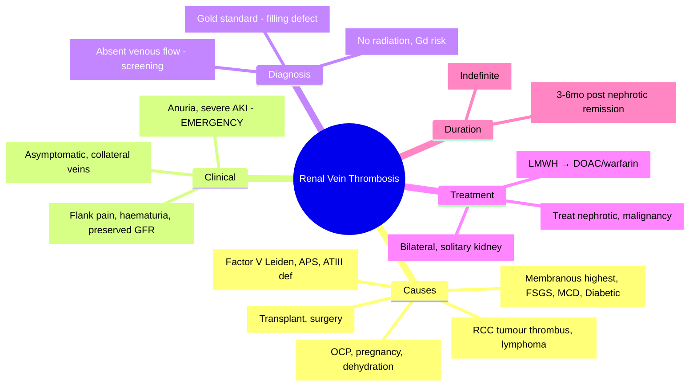

# Vascular Diseases of the Kidney — Renal Vein Thrombosis

<callout icon="🩺" color="red_bg">
**Topic:** Vascular Diseases of the Kidney — Renal Vein Thrombosis — Nephrology & Urology
**Style:** Sea Knowledge study infographic
**Audience:** FCPS / MRCP exam prep
</callout>

**Related:** [[Vascular Diseases of the Kidney — Renal Artery Stenosis]], [[Vascular Diseases of the Kidney — Thrombotic Microangiopathies (TMA, HUS, TTP)]], [[Vascular Diseases of the Kidney — Atheroembolic Disease]], [[Acute Kidney Injury (AKI)]], [[Nephrotic Syndrome]], [[Nephrology and Urology MOC]]

> [!important]
> **RVT = thrombosis of renal vein → renal venous congestion → AKI, flank pain, haematuria. Commonest cause: nephrotic syndrome (membranous > others) — hypercoagulable state (↑ fibrinogen, ↓ antithrombin III, ↑ factor V/VIII). Diagnosis: CT venography (gold standard) or MRI/MRV. Treatment: anticoagulation (therapeutic LMWH/warfarin/DOAC); thrombolysis/thrombectomy if bilateral/solitary kidney/severe; treat underlying nephrotic syndrome.**

---

## 1. Learning Objectives
- Recognise clinical presentations (acute vs chronic, unilateral vs bilateral)
- Identify nephrotic syndrome as major risk factor (especially membranous)
- Apply diagnostic imaging (CT venography, MRV, US Doppler)
- Manage with anticoagulation and treat underlying cause
- Differentiate from renal artery thrombosis, renal infarction, other AKI causes

---

## 2. Aetiology & Risk Factors

| Category | Examples | Mechanism |
|----------|----------|-----------|
| **Nephrotic Syndrome** | **Membranous nephropathy (highest risk)**, FSGS, Minimal change, Diabetic nephropathy, Amyloidosis | **Hypercoagulable**: ↓ antithrombin III (urinary loss), ↑ fibrinogen, ↑ factors V/VIII, ↑ platelets, haemoconcentration |
| **Malignancy** | Renal cell carcinoma (tumour thrombus), lymphoma, metastases | Direct invasion, compression, hypercoagulability |
| **Trauma/Surgery** | Renal transplant, nephrectomy, abdominal surgery | Vascular injury, stasis |
| **Hypercoagulable States** | Factor V Leiden, prothrombin mutation, antiphospholipid syndrome, protein C/S deficiency, ATIII deficiency | Genetic/acquired thrombophilia |
| **Others** | Oral contraceptives, pregnancy, dehydration, sepsis, vasculitis, Behçet's | Multiple mechanisms |
| **Idiopathic** | ~10–15% | No identifiable cause |

> [!key]
> **Nephrotic syndrome = commonest cause (especially membranous). Bilateral RVT = medical emergency (AKI, anuria).**

---

## 3. Clinical Presentation

| Type | Features |
|------|----------|
| **Acute Unilateral** | **Flank pain** (sudden, severe), **haematuria** (macroscopic/microscopic), **AKI** (if pre-existing CKD or contralateral disease), fever, nausea; may be asymptomatic |
| **Acute Bilateral / Solitary Kidney** | **Severe AKI / anuria**, flank pain (bilateral), haematuria, hypertension — **medical emergency** |
| **Chronic** | Often asymptomatic; incidental on imaging; may present with CKD, proteinuria, collateral veins |
| **Nephrotic Syndrome Context** | Worsening oedema, sudden drop in albumin, rising Cr, flank pain |

---

## 4. Diagnosis

### Imaging (Gold Standard)

| Modality | Sensitivity/Specificity | Role |
|----------|------------------------|------|
| **CT Venography** | **>95% / >95%** | **Gold standard**; shows filling defect, venous dilatation, collateral veins |
| **MR Venography** | >90% / >90% | No radiation; gadolinium risk if eGFR <30; good for pregnancy |
| **US Doppler** | 70–85% / 90–95% | **Bedside screening**; absent venous flow, enlarged kidney, loss of respiratory variation |
| **Contrast Venography** | Historical | Invasive; rarely needed |

### US Doppler Findings
| Finding | Significance |
|---------|--------------|
| **Absent venous flow** | **Specific for RVT** |
| **Loss of respiratory phasicity** | Abnormal |
| **Enlarged kidney** | Oedema/congestion |
| **Collateral veins** | Chronic RVT |
| **Intrarenal arterial flow** | ↑ Resistive index (RI >0.70) |

### Laboratory
| Test | Finding |
|------|---------|
| **Urinalysis** | Haematuria (+++), proteinuria (nephrotic range if underlying) |
| **Coagulation** | D-dimer ↑ (non-specific); screen for thrombophilia if indicated |
| **Renal Function** | AKI (if bilateral/solitary or pre-existing CKD) |
| **Thrombophilia Screen** | Factor V Leiden, prothrombin G20210A, protein C/S, ATIII, antiphospholipid antibodies (if unprovoked or recurrent) |

---

## 5. Management

### Anticoagulation (Mainstay)

| Phase | Agent | Duration |
|-------|-------|----------|
| **Acute** | **Therapeutic LMWH** (enoxaparin 1mg/kg BD) **or** UFH infusion | Until transition |
| **Long-term** | **Warfarin** (INR 2–3) **or** **DOAC** (apixaban/rivaroxaban) | **Provoked (nephrotic): 3–6 months after nephrotic remission** |
| | | **Unprovoked/Thrombophilia/Malignancy: indefinite** |
| | | **Transplant RVT: 3–6 months** |

> [!key]
> **DOACs preferred over warfarin if eGFR permits (apixaban/rivaroxaban OK down to CrCl 15–30). Warfarin if eGFR <15 or antiphospholipid syndrome.**

### Interventional (Selected Cases)
| Indication | Procedure |
|------------|-----------|
| **Bilateral RVT** | **Catheter-directed thrombolysis** (tPA) ± **mechanical thrombectomy** |
| **Solitary kidney RVT** | Thrombolysis/thrombectomy |
| **Severe AKI not improving with anticoagulation** | Consider thrombolysis |
| **Failed anticoagulation (extension)** | Thrombectomy |

### Treat Underlying Cause
| Cause | Action |
|-------|--------|
| **Nephrotic Syndrome** | **Treat primary GN** (immunosuppression for membranous, etc.); ACEi/ARB + SGLT2i; diuretics for oedema |
| **Malignancy** | Treat cancer; tumour thrombus → nephrectomy |
| **Transplant** | Optimise immunosuppression; anticoagulate; stent if anastomotic stenosis |
| **Thrombophilia** | Long-term anticoagulation; family screening |

---

## 6. Prognosis

| Scenario | Outcome |
|----------|---------|
| **Unilateral, acute** | Good with anticoagulation; renal function usually recovers |
| **Bilateral / Solitary kidney** | Guarded; depends on time to revascularisation; may progress to ESRD |
| **Chronic** | Collateral formation; may be asymptomatic; risk of pulmonary embolism |
| **Nephrotic-associated** | Recurs if nephrotic relapse; long-term anticoagulation if persistent nephrotic |
| **PE Risk** | ~20–30% have concurrent PE; screen if symptomatic |

---

## 7. Differential Diagnosis

| Condition | Distinguishing Feature |
|-----------|----------------------|
| **Renal Artery Thrombosis** | Acute anuria, no haematuria (usually), absent arterial flow on US |
| **Renal Infarction** | Flank pain, haematuria, wedge-shaped defect on CT (arterial) |
| **Acute Pyelonephritis** | Fever, bacteriuria, WBC casts, no venous thrombosis on imaging |
| **Renal Colic (Stone)** | Colicky pain, no AKI (unless obstruction), CT shows stone |
| **Renal Vein Compression** | Nutcracker syndrome (left renal vein between SMA/aorta); intermittent haematuria |

---

## 8. High-Yield FCPS/MRCP Points

> [!important]
> - **RVT = renal vein thrombosis → flank pain, haematuria, AKI**
> - **Commonest cause: Nephrotic syndrome (especially Membranous > FSGS > MCD > Diabetic)**
> - **Hypercoagulable in nephrotic**: ↓ ATIII, ↑ fibrinogen, ↑ factors V/VIII
> - **Bilateral RVT / Solitary kidney = medical emergency (anuria, severe AKI)**
> - **Diagnosis: CT venography (gold standard); US Doppler screening (absent venous flow)**
> - **Treatment: Therapeutic anticoagulation (LMWH → warfarin/DOAC)**
> - **Thrombolysis/thrombectomy: bilateral, solitary kidney, failed anticoagulation**
> - **Treat underlying nephrotic syndrome (immunosuppression for membranous)**
> - **Duration: provoked (nephrotic) = 3–6mo post-remission; unprovoked/thrombophilia = indefinite**
> - **PE risk: screen if symptomatic (~20–30% concurrent PE)**

---

## 9. Common Confusions / Exam Traps

| Trap | Correction |
|------|------------|
| **RVT = always symptomatic** | Chronic RVT often asymptomatic (incidental) |
| **Unilateral RVT = severe AKI** | Usually preserved renal function (contralateral compensates) |
| **All RVT need thrombolysis** | Only bilateral/solitary kidney/failed anticoagulation |
| **Warfarin only option** | **DOACs preferred** if eGFR permits (apixaban/rivaroxaban) |
| **Nephrotic = only risk factor** | Also malignancy, transplant, thrombophilia, trauma, OCP |
| **Membranous = only nephrotic cause** | All nephrotic syndromes increase risk (membranous highest) |
| **RVT = renal artery thrombosis** | RVT = venous (haematuria, flank pain); RAT = arterial (anuria, no haematuria) |
| **Anticoagulation contraindicated in nephrotic** | **Indicated**; nephrotic = hypercoagulable |
| **Chronic RVT = no treatment** | Anticoagulate to prevent extension/PE |

---

## 10. Mnemonics

- **RVT Causes**: **N**ephrotic (Membranous), **M**alignancy, **T**rauma, **H**ypercoagulable, **I**diopathic = **NMTHI**
- **Nephrotic Hypercoagulable**: **L**ow **A**TIII, **H**igh **F**ibrinogen, **H**igh **F**actors V/VIII = **LAH-HF**
- **Presentation**: **F**lank pain, **H**aematuria, **A**KI = **FHA**
- **Diagnosis**: **C**T **V**enography = **CV** (gold standard); **U**S **D**oppler = **UD** (screening)
- **Treatment**: **A**nticoagulation **F**irst = **AF** (LMWH → DOAC/warfarin)
- **Emergency**: **B**ilateral / **S**olitary kidney = **BS** (thrombolysis/thrombectomy)
- **Duration**: **P**rovoked = **3–6mo** post-remission; **U**nprovoked = **Indefinite** = **P3U∞**

---

## 11. Mind Map

---

## 12. 24-Hour Recall Prompts
1. Commonest cause RVT: Nephrotic syndrome (membranous highest)
2. Nephrotic hypercoagulable: low ATIII, high fibrinogen, high factors V/VIII
3. Presentation: flank pain + haematuria + AKI (bilateral = emergency)
4. Diagnosis: CT venography gold standard; US Doppler screening (absent venous flow)
5. Treatment: therapeutic anticoagulation (LMWH → DOAC/warfarin)
6. Thrombolysis/thrombectomy: bilateral RVT, solitary kidney, failed anticoagulation
7. Duration: provoked (nephrotic) 3–6mo post-remission; unprovoked/thrombophilia indefinite
8. PE risk ~20–30%; treat underlying cause

---

## 13. 7-Day / 15-Day / 30-Day Revision Tracker

| Day | Date | Recall (1-5) | Notes |
|-----|------|--------------|-------|
| 1   |      |              |       |
| 7   |      |              |       |
| 15  |      |              |       |
| 30  |      |              |       |

---

## 14. Must Know / Should Know / Nice to Know

| Priority | Content |
|----------|---------|
| **Must Know 🔴** | Nephrotic cause (membranous), clinical triad (flank pain, haematuria, AKI), CT venography, anticoagulation first-line, bilateral/solitary = emergency thrombolysis, duration rules |
| **Should Know 🟡** | Thrombophilia screen, DOAC vs warfarin criteria, transplant RVT, chronic RVT collaterals, PE risk |
| **Nice to Know 🟢** | Nutcracker syndrome, renal artery thrombosis differentiation, novel anticoagulants, cost-effectiveness |

---

## 15. MCQs (10)

1. **Commonest cause of renal vein thrombosis:**
   A. Malignancy
   B. Trauma
   C. **Nephrotic syndrome (especially membranous)**
   D. Thrombophilia
   E. Oral contraceptives

2. **Nephrotic syndrome causes hypercoagulability by:**
   A. ↑ Antithrombin III, ↓ fibrinogen
   B. **↓ Antithrombin III (urinary loss), ↑ fibrinogen, ↑ factors V/VIII**
   C. ↑ Protein C, ↑ Protein S
   D. ↓ Platelets, ↓ factors
   E. No change in coagulation

3. **Acute bilateral renal vein thrombosis presents with:**
   A. Asymptomatic
   B. **Anuria, severe AKI, flank pain — medical emergency**
   C. Only haematuria
   D. Only hypertension
   E. Chronic CKD only

4. **Gold standard diagnostic test for RVT:**
   A. US Doppler
   B. **CT venography**
   C. MR venography
   D. Renal biopsy
   E. D-dimer

5. **US Doppler finding specific for RVT:**
   A. Increased resistive index
   B. **Absent venous flow**
   C. Enlarged kidney
   D. Cortical thinning
   E. Hydronephrosis

6. **First-line treatment for acute RVT:**
   A. Thrombolysis
   B. **Therapeutic LMWH (enoxaparin 1mg/kg BD)**
   C. Warfarin alone
   D. Aspirin
   E. Observation

7. **Indication for catheter-directed thrombolysis in RVT:**
   A. All unilateral RVT
   B. **Bilateral RVT, solitary kidney RVT, failed anticoagulation**
   C. Chronic RVT only
   D. Only if D-dimer >10,000
   E. Never indicated

8. **Anticoagulation duration for nephrotic-associated RVT (provoked):**
   A. 6 weeks
   B. **3–6 months after nephrotic remission**
   C. 1 year
   D. Indefinite
   E. Only while nephrotic

9. **Renal vein thrombosis vs Renal artery thrombosis — key difference:**
   A. Both cause anuria
   B. **RVT: haematuria + flank pain; RAT: anuria, no haematuria**
   C. Both cause haematuria
   D. RVT: no pain; RAT: severe pain
   E. No difference

10. **Concurrent PE risk in RVT:**
    A. <5%
    B. **~20–30%**
    C. 50–60%
    D. >80%
    E. No risk

---

## 16. SBA Questions (10)

1. **45-year-old man, membranous nephropathy (proteinuria 8g/day, albumin 18g/L), sudden left flank pain, macroscopic haematuria, Cr 140 (baseline 100). CT venography: left renal vein filling defect. Management:**
   A. Aspirin only
   B. **Therapeutic enoxaparin 1mg/kg BD → transition to DOAC/warfarin; treat membranous**
   C. Thrombolysis immediately
   D. Nephrectomy
   D. Observation only

2. **Nephrotic syndrome patient develops anuria, bilateral flank pain, Cr 450. US Doppler: absent venous flow bilaterally. Immediate management:**
   A. Warfarin loading
   B. **LMWH + urgent catheter-directed thrombolysis/thrombectomy**
   C. Dialysis only
   D. Bilateral nephrectomy
   E. Plasma exchange

3. **30-year-old woman, Factor V Leiden, unprovoked RVT (no nephrotic, no malignancy). Anticoagulation duration:**
   A. 3 months
   B. **Indefinite (unprovoked + thrombophilia)**
   C. 6 months
   D. 1 year
   E. Until D-dimer normal

4. **Renal transplant patient, day 7 post-op, sudden graft dysfunction, flank pain. US: absent venous flow in graft. Cause:**
   A. Acute rejection
   B. **Renal vein thrombosis (anastomotic)**
   C. Ureteric obstruction
   D. ATN
   E. CNI toxicity

5. **Membranous nephropathy patient on therapeutic anticoagulation for RVT, achieves remission (proteinuria <0.5g, albumin normal). When to stop anticoagulation?**
   A. Immediately
   B. **3–6 months after sustained remission**
   C. 1 month after remission
   D. Never (lifelong)
   E. Only if D-dimer normal

6. **DOAC (apixaban/rivaroxaban) use in RVT — renal function limit:**
   A. eGFR >60 only
   B. **CrCl >15–30 (apixaban 15, rivaroxaban 30)**
   C. eGFR >90 only
   D. No limit
   E. Only if on dialysis

7. **Chronic RVT — typical presentation:**
   A. Acute flank pain, haematuria
   B. **Asymptomatic, incidental, collateral veins on imaging**
   C. Severe AKI
   D. Nephrotic syndrome
   E. Fever, sepsis

8. **Nephrotic hypercoagulable state — which is NOT a feature:**
   A. Low antithrombin III
   B. High fibrinogen
   C. High factors V and VIII
   D. **High protein C**
   E. Platelet hyperaggregability

9. **RVT in nephrotic syndrome — which glomerular disease carries HIGHEST risk?**
   A. Minimal change disease
   B. FSGS
   C. **Membranous nephropathy**
   D. IgA nephropathy
   E. Diabetic nephropathy

10. **Left renal vein compression between SMA and aorta — syndrome:**
    A. Renal vein thrombosis
    B. **Nutcracker syndrome**
    C. SMA syndrome
    D. May-Thurner syndrome
    E. Renal artery stenosis

---

## 17. Flashcards

- Q: Commonest cause RVT?
  A: Nephrotic syndrome (membranous highest)

- Q: Nephrotic hypercoagulable?
  A: Low ATIII, high fibrinogen, high factors V/VIII

- Q: Acute unilateral RVT presentation?
  A: Flank pain + haematuria, usually preserved GFR

- Q: Acute bilateral RVT?
  A: Anuria, severe AKI = MEDICAL EMERGENCY

- Q: Gold standard diagnosis?
  A: CT venography

- Q: US Doppler screening?
  A: Absent venous flow

- Q: First-line treatment?
  A: Therapeutic LMWH → DOAC/warfarin

- Q: Thrombolysis indication?
  A: Bilateral, solitary kidney, failed anticoagulation

- Q: Duration provoked (nephrotic)?
  A: 3–6 months after remission

- Q: Duration unprovoked/thrombophilia?
  A: Indefinite

- Q: DOAC renal limits?
  A: Apixaban CrCl >15; Rivaroxaban CrCl >30

- Q: PE risk in RVT?
  A: ~20–30%

- Q: RVT vs RAT?
  A: RVT = haematuria + flank pain; RAT = anuria, no haematuria

- Q: Nutcracker syndrome?
  A: Left renal vein compression between SMA and aorta

- Q: Transplant RVT?
  A: Anastomotic thrombosis; early post-op

---

## 18. Answer Key with Explanations

### MCQs
1. **C** — Nephrotic syndrome (membranous highest risk) = commonest cause
2. **B** — ↓ ATIII (urinary loss), ↑ fibrinogen, ↑ factors V/VIII
3. **B** — Bilateral RVT = anuria, severe AKI = emergency
4. **B** — CT venography = gold standard
5. **B** — Absent venous flow = specific for RVT
6. **B** — LMWH first-line; transition to DOAC/warfarin
7. **B** — Bilateral, solitary kidney, failed anticoagulation
8. **B** — Provoked: 3–6 months post-remission
9. **B** — RVT = venous (haematuria, flank pain); RAT = arterial (anuria)
10. **B** — ~20–30% concurrent PE

### SBAs
1. **B** — Membranous + RVT: anticoagulate + treat membranous (rituximab)
2. **B** — Bilateral RVT = emergency thrombolysis/thrombectomy
3. **B** — Unprovoked + thrombophilia = indefinite anticoagulation
4. **B** — Transplant RVT = anastomotic thrombosis (early post-op)
5. **B** — Provoked: 3–6mo post-sustained remission
6. **B** — Apixaban CrCl >15; Rivaroxaban CrCl >30
7. **B** — Chronic RVT = asymptomatic, collateral veins
8. **D** — Protein C is LOW in nephrotic (urinary loss), not high
9. **C** — Membranous = highest RVT risk among glomerular diseases
10. **B** — Left renal vein between SMA/aorta = Nutcracker syndrome

---

## 19. Summary

**Renal Vein Thrombosis** is a **Must Know 🔴** topic.
**Key takeaway:** Commonest cause = **nephrotic syndrome (membranous highest)**. Hypercoagulable: ↓ATIII, ↑fibrinogen, ↑factors V/VIII. **Presentation**: flank pain + haematuria ± AKI; **bilateral/solitary kidney = anuria, severe AKI = emergency**. **Diagnosis**: CT venography (gold); US Doppler screening (absent venous flow). **Treatment**: **Therapeutic anticoagulation (LMWH → DOAC/warfarin)**. Thrombolysis/thrombectomy for bilateral/solitary/failed anticoagulation. **Duration**: provoked (nephrotic) = 3–6mo post-remission; unprovoked/thrombophilia = indefinite. Treat underlying cause. PE risk ~20–30%.
**Exam focus:** Nephrotic cause, hypercoagulable mechanism, clinical presentation, CT venography, anticoagulation, thrombolysis indications, duration rules, PE risk, membranous highest risk, nutcracker syndrome.
**Clinical relevance:** High index of suspicion in nephrotic patients with flank pain; early anticoagulation preserves renal function.