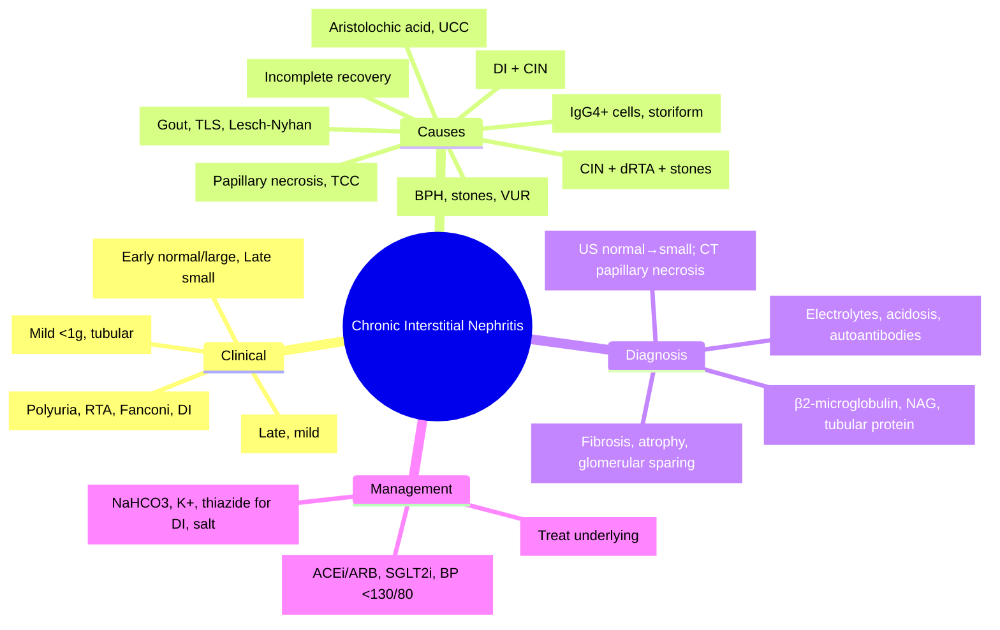

# Chronic Interstitial Nephritis (CIN)

**Related:** [[Tubulointerstitial Diseases — Acute Interstitial Nephritis (AIN)]], [[Tubulointerstitial Diseases — Drug-Induced Tubulointerstitial Injury]], [[Chronic Kidney Disease (CKD)]], [[Nephrology and Urology MOC]]

> [!important]
> **Chronic Interstitial Nephritis = chronic interstitial inflammation + fibrosis + tubular atrophy. Final common pathway of many insults. Causes: chronic obstruction, reflux nephropathy, analgesic nephropathy, heavy metals, lithium, urate nephropathy, Balkan endemic nephropathy, Sjögren's, IgG4-RD, post-AIN. Clinic: insidious CKD, tubular dysfunction (polyuria, Na/K/H+ wasting), mild proteinuria (<1g), normal/large kidneys early → small late. Diagnosis: biopsy (fibrosis, atrophy, mononuclear infiltrate). Management: treat cause, slow progression (ACEi/ARB, SGLT2i).**

---

## Learning Objectives
- Identify aetiologies of chronic interstitial nephritis
- Recognise clinical features (tubular dysfunction predominant)
- Differentiate from glomerular CKD
- Apply diagnostic approach (urine, imaging, biopsy indications)
- Manage with cause-specific therapy and CKD progression slowing

---

## Aetiology

| Category | Examples | Mechanism |
|----------|----------|-----------|
| **Obstructive/Reflux** | **Chronic obstruction** (BPH, stones, strictures), **Vesicoureteric reflux (VUR)** — reflux nephropathy | Back-pressure → ischaemia, fibrosis; recurrent infection |
| **Drugs/Toxins** | **Analgesic nephropathy** (phenacetin + NSAIDs), **Lithium** (chronic), Heavy metals (lead, cadmium, aristolochic acid), Aristolochic acid (Chinese herbs) | Direct tubular toxicity, oxidative stress, fibrosis |
| **Metabolic** | **Urate nephropathy** (gout, tumour lysis, Lesch-Nyhan), Oxalosis (primary/enteropathic) | Crystal deposition → inflammation, fibrosis |
| **Infectious** | Chronic pyelonephritis (recurrent UTI, reflux), TB, Schistosomiasis | Chronic inflammation → scarring |
| **Autoimmune/Systemic** | **Sjögren's syndrome**, **IgG4-related disease**, Sarcoidosis, SLE, TINU (chronic phase) | Immune-mediated interstitial damage |
| **Genetic/Congenital** | **ADPKD** (interstitial fibrosis component), Medullary cystic disease, Nephronophthisis | Cystic expansion → compression, fibrosis |
| **Endemic/Environmental** | **Balkan endemic nephropathy** (aristolochic acid), Mesoamerican nephropathy (heat stress, agrochemicals) | Chronic toxin exposure |
| **Post-Acute** | **Post-AIN** (incomplete recovery), Post-ischaemic (ATN) | Failed resolution → fibrosis |

---

## Clinical Features

| Feature | Chronic Interstitial Nephritis | Glomerular CKD (Comparison) |
|---------|--------------------------------|----------------------------|
| **Onset** | Insidious, gradual | Insidious or subacute |
| **Proteinuria** | **Mild (<1g/day)**, tubular pattern (LMW proteins) | **Heavy (>1g, often nephrotic)**, glomerular pattern |
| **Haematuria** | Absent/minimal | Common (RBC casts in GN) |
| **Hypertension** | Late, mild-moderate | Early, often severe |
| **Tubular Dysfunction** | **PROMINENT**: polyuria, nocturia, Na wasting, K wasting, **RTA (distal/proximal), Fanconi syndrome** | Less prominent |
| **Kidney Size** | **Normal/Large early** (infiltration); **Small late** (fibrosis) | Small (except early diabetic, amyloid, HIV) |
| **Extrarenal** | Depends on cause (gout, arthritis, sicca, neuropathy) | Systemic (SLE, vasculitis) |

---

## Tubular Dysfunction Patterns

| Syndrome | Defect | Causes |
|----------|--------|--------|
| **Distal RTA (Type 1)** | H+ secretion defect → metabolic acidosis, hypokalaemia, nephrocalcinosis, stones | Sjögren's, SLE, amphotericin, obstructive uropathy, hereditary |
| **Proximal RTA (Type 2)** | HCO3- reabsorption defect → metabolic acidosis, hypokalaemia, Fanconi features | Cystinosis, Wilson's, heavy metals, myeloma, ifosfamide, tenofovir |
| **Fanconi Syndrome** | Generalised proximal tubular dysfunction: glycosuria, aminoaciduria, phosphaturia, bicarbonaturia, uricosuria | Cystinosis, Wilson's, heavy metals, myeloma, tenofovir, outdated tetracycline |
| **Nephrogenic DI** | ADH resistance → polyuria, polydipsia | Lithium, hypercalcaemia, hypokalaemia, obstructive uropathy, hereditary |
| **Salt Wasting** | Impaired Na+ reabsorption → volume depletion, hypotension | Obstructive uropathy, AIN, post-ATN |

---

## Diagnosis

### Urine
| Finding | Significance |
|---------|--------------|
| **Proteinuria** | <1g/day; **tubular pattern** (β2-microglobulin, NAG, α1-microglobulin) |
| **Tubular Proteinuria** | ↑ LMW proteins (β2-microglobulin >10,000 μg/L = tubular) |
| **Urine pH** | Inappropriately high in distal RTA (>5.5 despite acidosis) |
| **Electrolytes** | FeNa >1% (salt wasting), FeK >10% (K wasting), FePO4 >20% (Fanconi) |

### Blood
| Test | Purpose |
|------|---------|
| **Electrolytes** | Hypokalaemia (RTA, DI, salt wasting), metabolic acidosis |
| **Urate** | Hyperuricaemia (urate nephropathy, gout) |
| **Ca/PO4** | Hypercalcaemia (sarcoid, myeloma), hypophosphataemia (Fanconi) |
| **Autoantibodies** | ANA, anti-Ro/La (Sjögren's), ANCA, IgG4 |
| **Heavy Metals** | Blood lead, urine cadmium/arsenic (if suspected) |
| **Lithium Level** | If on lithium |

### Imaging
| Modality | Findings |
|----------|----------|
| **US** | **Early: normal/large kidneys** (infiltration); **Late: small, echogenic, cortical thinning** |
| **CT/MRI** | Obstruction, stones, cysts, reflux (VCUG/MRU) |
| **DMSA Scan** | Cortical scars (reflux nephropathy) |

### Biopsy (Indications)
| Indication | Detail |
|------------|--------|
| **Cause uncertain** | Differentiate from glomerular disease |
| **Suspected specific treatable cause** | Sjögren's, IgG4-RD, sarcoidosis, drug toxicity |
| **Rapid progression** | Exclude GN, vasculitis |
| **Pre-transplant** | Assess chronicity |

### Histopathology
| Modality | Findings |
|----------|----------|
| **Light Microscopy** | **Interstitial fibrosis**, **tubular atrophy** (thyroidization), **mononuclear infiltrate** (lymphocytes, plasma cells); **glomeruli relatively spared** (global sclerosis only late) |
| **Immunofluorescence** | Usually negative; IgG4+ plasma cells if IgG4-RD |
| **Electron Microscopy** | Tubular basement membrane thickening; no deposits |

---

## Key Aetiologies — Detail

### 1. Analgesic Nephropathy
| Feature | Detail |
|---------|--------|
| **Cause** | Chronic phenacetin + NSAID/aspirin use (years); phenacetin banned but NSAIDs alone can cause |
| **Pathology** | Renal papillary necrosis + chronic interstitial fibrosis |
| **Clinical** | CKD, flank pain, haematuria, UTI, transitional cell carcinoma risk ↑ |
| **Imaging** | **Papillary necrosis** (CT/IVU: "ring sign", sloughed papillae) |

### 2. Lithium Nephropathy
| Feature | Detail |
|---------|--------|
| **Cause** | Chronic lithium therapy (years); dose/duration dependent |
| **Renal Effects** | **Nephrogenic DI** (polyuria, polydipsia) — **commonest**; Chronic interstitial nephritis → CKD |
| **Histology** | Interstitial fibrosis, tubular atrophy, microcysts in collecting ducts |
| **Management** | Stop/rotate lithium if possible; monitor Li level, eGFR, urine osmolality |

### 3. Urate Nephropathy
| Feature | Detail |
|---------|--------|
| **Cause** | Chronic hyperuricaemia (gout), tumour lysis, Lesch-Nyhan |
| **Acute** | Uric acid crystal obstruction (tumour lysis) |
| **Chronic** | Urate crystal deposition in interstitium → fibrosis |
| **Clinical** | Gout, uric acid stones, CKD |
| **Urinalysis** | Urate crystals, tubular proteinuria |

### 4. Sjögren's Syndrome
| Feature | Detail |
|---------|--------|
| **Renal** | **CIN + Distal RTA (Type 1) + Nephrolithiasis**; rarely AIN, GN |
| **Autoantibodies** | **Anti-Ro/SSA+, Anti-La/SSB+** |
| **Biopsy** | Interstitial lymphocytic infiltrate (CD4+), IgG4+ plasma cells possible |

### 5. IgG4-Related Disease
| Feature | Detail |
|---------|--------|
| **Renal** | Tubulointerstitial nephritis (plasma cell-rich), mass lesions (pseudotumour) |
| **Histology** | **IgG4+ plasma cells >10/HPF**, **IgG4/IgG ratio >40%**, storiform fibrosis, obliterative phlebitis |
| **Serum** | **IgG4 >135 mg/dL** |
| **Treatment** | Steroids ± rituximab |

### 6. Balkan Endemic Nephropathy
| Feature | Detail |
|---------|--------|
| **Cause** | **Aristolochic acid** (contaminated flour from Aristolochia clematitis) |
| **Region** | Danube basin (Bulgaria, Romania, Serbia, Croatia, Bosnia) |
| **Clinical** | Insidious CKD, **urothelial carcinoma (upper tract) ↑↑** |
| **Pathology** | Interstitial fibrosis, tubular atrophy, mild glomerular changes |

---

## Management

### 1. Treat Underlying Cause
| Cause | Action |
|-------|--------|
| **Obstruction/Reflux** | Relieve obstruction, surgical correction of VUR |
| **Drugs/Toxins** | Stop offending agent (analgesics, lithium, heavy metals) |
| **Urate** | Allopurinol/febuxostat (target urate <360 μmol/L), hydration |
| **Infection** | Treat UTI, prophylaxis if recurrent |
| **Autoimmune** | Steroids ± immunosuppressants (Sjögren's, IgG4-RD, sarcoid) |
| **Lithium** | Reduce dose/switch if possible; monitor closely |

### 2. Slow CKD Progression (Standard CKD Care)
| Intervention | Target |
|--------------|--------|
| **ACEi/ARB** | Proteinuria reduction, BP <130/80 |
| **SGLT2i** | Dapagliflozin/empagliflozin (eGFR ≥20) — progression slowing |
| **BP Control** | <130/80 |
| **Diet** | Low salt (<2g Na), moderate protein (0.8g/kg), avoid nephrotoxins |
| **Metabolic** | Correct acidosis (NaHCO3 if HCO3 <22), manage hyperuricaemia |

### 3. Tubular Dysfunction Management
| Dysfunction | Treatment |
|-------------|-----------|
| **Distal RTA** | NaHCO3 1–2 mmol/kg/day; K+ replacement; thiazide if nephrocalcinosis |
| **Proximal RTA/Fanconi** | NaHCO3 (higher doses), K+, PO4, vitamin D, fluid/electrolyte replacement |
| **Nephrogenic DI** | Thiazide/amiloride (paradoxical ↓ polyuria), low salt/protein diet, NSAIDs (cautious) |
| **Salt Wasting** | Salt supplementation, fludrocortisone if severe |

---

## High-Yield FCPS/MRCP Points

> [!important]
> - **CIN = chronic interstitial fibrosis + tubular atrophy + mononuclear infiltrate**
> - **Proteinuria MILD (<1g), tubular pattern; BP late/mild; tubular dysfunction PROMINENT**
> - **Kidneys: normal/large early → small late** (vs glomerular: small early)
> - **Key causes**: Obstruction/reflux, analgesic nephropathy, lithium, urate, Sjögren's, IgG4-RD, Balkan endemic, post-AIN
> - **Analgesic nephropathy**: papillary necrosis + CKD + TCC risk
> - **Lithium**: nephrogenic DI (commonest) + CIN
> - **Sjögren's**: CIN + **distal RTA + stones** + anti-Ro/La+
> - **IgG4-RD**: IgG4+ plasma cells >10/HPF, storiform fibrosis, obliterative phlebitis, serum IgG4↑
> - **Balkan endemic**: aristolochic acid + upper tract urothelial carcinoma
> - **Biopsy**: interstitial fibrosis, tubular atrophy, glomerular sparing
> - **Management**: treat cause + ACEi/ARB + SGLT2i + BP control + tubular dysfunction Rx

---

## Common Confusions / Exam Traps

| Trap | Correction |
|------|------------|
| **CIN = heavy proteinuria** | Proteinuria MILD (<1g), tubular pattern |
| **CIN = small kidneys always** | Early = normal/large (infiltration); late = small |
| **Lithium = only CIN** | **Nephrogenic DI = commonest renal effect** |
| **Sjögren's = only sicca** | Renal: CIN + **distal RTA + stones** (classic triad) |
| **IgG4-RD = only pancreatic** | Renal: TIN, mass lesions; need IgG4+ cells on biopsy |
| **Analgesic nephropathy = only phenacetin** | **NSAIDs alone** can cause (phenacetin banned) |
| **Balkan endemic = only CKD** | **Upper tract urothelial carcinoma risk ↑↑** |
| **Urate nephropathy = only gout** | Also tumour lysis, Lesch-Nyhan |
| **Distal RTA = only Sjögren's** | Also SLE, amphotericin, obstruction, hereditary |

---

## Mnemonics

- **CIN Features**: **P**roteinuria <1g, **B**P late, **T**ubular dysfunction, **K**idneys normal→small = **PB TK**
- **CIN Causes**: **O**bstruction, **A**nalgesics, **L**ithium, **U**rate, **S**jögren's, **I**gG4, **B**alkan, **P**ost-AIN = **OALUSBP**
- **Lithium**: **L**ithium = **L**ots of **P**olyuria (DI) + **C**IN = **LPC**
- **Sjögren's Renal**: **C**IN + **D**istal **R**TA + **S**tones = **CDRS**
- **IgG4-RD Biopsy**: **I**gG4+ >10/HPF, **S**toriform, **O**bliterative phlebitis = **ISO**
- **Analgesic**: **P**apillary **N**ecrosis + **T**CC risk = **PNT**
- **Balkan**: **A**ristolochic **A**cid + **U**rothelial **C**arcinoma = **AAUC**

---

## Mind Map

---

## 24-Hour Recall Prompts
1. CIN hallmarks: mild proteinuria, tubular dysfunction, normal/large kidneys early
2. Key causes: obstruction, analgesics, lithium, urate, Sjögren's, IgG4-RD, Balkan, post-AIN
3. Analgesic nephropathy: papillary necrosis + TCC risk
4. Lithium: nephrogenic DI (commonest) + CIN
5. Sjögren's renal: CIN + distal RTA + stones + anti-Ro/La
6. IgG4-RD renal: IgG4+ cells >10/HPF, storiform fibrosis, serum IgG4↑
7. Balkan endemic: aristolochic acid + urothelial carcinoma
8. Biopsy: interstitial fibrosis, tubular atrophy, glomerular sparing
9. Management: treat cause + ACEi/ARB + SGLT2i + tubular Rx

---

## 7-Day / 15-Day / 30-Day Revision Tracker

| Day | Date | Recall (1-5) | Notes |
|-----|------|--------------|-------|
| 1   |      |              |       |
| 7   |      |              |       |
| 15  |      |              |       |
| 30  |      |              |       |

---

## Must Know / Should Know / Nice to Know

| Priority | Content |
|----------|---------|
| **Must Know 🔴** | CIN features (mild protein, tubular dysfunction, kidney size), key causes (obstruction, analgesics, lithium, Sjögren's, IgG4-RD), lithium DI, Sjögren's RTA+stones, analgesic papillary necrosis, biopsy findings |
| **Should Know 🟡** | Urate nephropathy, Balkan endemic, post-AIN, specific tubular Rx (NaHCO3, thiazide), heavy metals, sarcoidosis |
| **Nice to Know 🟢** | Genetic tubulointerstitial diseases (nephronophthisis, medullary cystic), Mesoamerican nephropathy, novel biomarkers |

---

## MCQs (10)

1. **Proteinuria in chronic interstitial nephritis is characteristically:**
   A. Nephrotic range (>3.5g/day)
   B. **Mild (<1g/day), tubular pattern**
   C. Heavy with RBC casts
   D. Absent
   E. Only Bence Jones protein

2. **Kidney size in early chronic interstitial nephritis:**
   A. Small
   B. **Normal or large**
   C. Only large
   D. Only small
   E. Cystic only

3. **Commonest renal manifestation of chronic lithium therapy:**
   A. Acute interstitial nephritis
   B. **Nephrogenic diabetes insipidus (polyuria, polydipsia)**
   C. Glomerulonephritis
   D. Nephrotic syndrome
   E. Renal calculi

4. **Sjögren's syndrome renal triad:**
   A. CIN + proximal RTA + nephrolithiasis
   B. **CIN + distal RTA (Type 1) + nephrolithiasis**
   C. CIN + Fanconi syndrome + nephrolithiasis
   D. AIN + distal RTA + nephrolithiasis
   E. GN + proximal RTA + stones

5. **Analgesic nephropathy — characteristic imaging finding:**
   A. Hydronephrosis
   B. **Renal papillary necrosis (ring sign, sloughed papillae)**
   C. Renal cysts
   D. Cortical thinning only
   E. Normal imaging

6. **IgG4-related kidney disease — biopsy hallmark:**
   A. Granular IgG deposits
   B. **IgG4+ plasma cells >10/HPF, storiform fibrosis, obliterative phlebitis**
   C. Linear GBM IgG
   D. Mesangial IgA deposits
   E. Subepithelial deposits

7. **Balkan endemic nephropathy — aetiology and association:**
   A. Lead toxicity + bladder cancer
   B. **Aristolochic acid + upper tract urothelial carcinoma**
   C. Cadmium + lung cancer
   D. Phenacetin + renal cell carcinoma
   E. Aristolochic acid only

8. **Distal RTA (Type 1) — typical biochemical findings:**
   A. Metabolic alkalosis, hyperkalaemia
   B. **Metabolic acidosis, hypokalaemia, urine pH >5.5, nephrocalcinosis**
   C. Respiratory acidosis, hypokalaemia
   D. Metabolic acidosis, hyperkalaemia
   E. Normal acid-base

9. **Fanconi syndrome — generalised proximal tubular dysfunction includes:**
   A. Glycosuria only
   B. **Glycosuria, aminoaciduria, phosphaturia, bicarbonaturia, uricosuria**
   C. Only phosphaturia
   D. Only aminoaciduria
   E. Only bicarbonaturia

10. **Management of nephrogenic DI (e.g., lithium-induced):**
    A. High-dose desmopressin
    B. **Thiazide/amiloride (paradoxical ↓ polyuria), low salt/protein diet**
    C. Loop diuretics
    D. Fluid restriction
    E. NSAIDs only

---

## SBA Questions (10)

1. **55-year-old man, long-term lithium for bipolar, polyuria 5L/day, polydipsia, urine osmolality 150 mOsm/kg (serum 295), Cr 140 (baseline 95). Diagnosis:**
   A. Central DI
   B. **Nephrogenic DI (lithium) + CIN**
   C. Psychogenic polydipsia
   D. Osmotic diuresis
   E. Hypercalcaemia

2. **60-year-old woman, Sjögren's syndrome, metabolic acidosis (HCO3 16), hypokalaemia (K 2.8), urine pH 6.8, recurrent renal calculi. Urine: no glucose, normal phosphate. Renal manifestation:**
   A. Proximal RTA
   B. **Distal RTA (Type 1)**
   C. Fanconi syndrome
   D. Type 4 RTA
   E. Normal variant

3. **50-year-old man, chronic back pain, daily NSAIDs × 10 years, flank pain, haematuria, CKD. CT: sloughed renal papillae. Risk:**
   A. Renal cell carcinoma
   B. **Transitional cell carcinoma (upper tract)**
   C. Bladder cancer only
   D. Wilms tumour
   E. No increased risk

4. **70-year-old man, gout 20 years, CKD, hyperuricaemia. Urine: tubular proteinuria (β2-microglobulin high), no glomerular proteinuria. Allopurinol started. Target urate:**
   A. <600 μmol/L
   B. **<360 μmol/L**
   C. <480 μmol/L
   D. <240 μmol/L
   E. <180 μmol/L

5. **40-year-old woman, IgG4-related disease, renal mass on imaging, biopsy: dense lymphoplasmacytic infiltrate, IgG4+ cells 15/HPF, storiform fibrosis. Serum IgG4 450 mg/dL. Treatment:**
   A. Rituximab alone
   B. **Prednisolone 0.5–1mg/kg × 4–8 weeks → taper; ± rituximab**
   C. Cyclophosphamide
   D. Plasma exchange
   E. Observation only

6. **Chronic interstitial nephritis vs Glomerular CKD — key distinguishing urinary feature:**
   A. Proteinuria >3g in CIN
   B. **Proteinuria <1g, tubular pattern in CIN; heavy glomerular pattern in GN**
   C. Haematuria only in CIN
   D. RBC casts in CIN
   E. No difference

7. **Kidney size in early CIN:**
   A. Small
   B. **Normal or large**
   C. Cystic
   D. Only small
   E. Normal only

8. **65-year-old from Balkans, CKD, asymptomatic. Urinalysis: mild proteinuria, tubular pattern. Imaging: small kidneys. History: home-ground flour. Risk:**
   A. Renal cell carcinoma
   B. **Upper tract urothelial carcinoma**
   C. Bladder cancer only
   D. No increased risk
   E. Lymphoma

9. **Proximal RTA (Type 2) vs Distal RTA (Type 1) — Fanconi features present in:**
   A. Distal RTA only
   B. **Proximal RTA (Type 2)**
   C. Both equally
   D. Neither
   E. Type 4 RTA

10. **Post-AIN chronic interstitial nephritis — risk factor:**
    A. Early steroid use
    B. **Delayed/no steroid use, severe interstitial fibrosis on initial biopsy**
    C. Young age
    D. Antibiotic cause only
    E. No fever at presentation

---

## Flashcards

- Q: CIN proteinuria?
  A: Mild (<1g/day), tubular pattern (β2-microglobulin, NAG)

- Q: CIN kidney size early vs late?
  A: Early normal/large (infiltration); Late small (fibrosis)

- Q: CIN vs Glomerular CKD proteinuria?
  A: CIN = mild tubular; GN = heavy glomerular

- Q: Lithium commonest renal effect?
  A: Nephrogenic DI (polyuria, polydipsia)

- Q: Lithium histology?
  A: Interstitial fibrosis, tubular atrophy, collecting duct microcysts

- Q: Sjögren's renal triad?
  A: CIN + distal RTA (Type 1) + nephrolithiasis

- Q: Sjögren's antibodies?
  A: Anti-Ro/SSA+, Anti-La/SSB+

- Q: Analgesic nephropathy imaging?
  A: Papillary necrosis (ring sign, sloughed papillae)

- Q: Analgesic nephropathy cancer risk?
  A: Upper tract transitional cell carcinoma

- Q: IgG4-RD kidney biopsy?
  A: IgG4+ plasma cells >10/HPF, storiform fibrosis, obliterative phlebitis

- Q: IgG4-RD serum?
  A: IgG4 >135 mg/dL

- Q: IgG4-RD treatment?
  A: Steroids ± rituximab

- Q: Balkan endemic nephropathy cause?
  A: Aristolochic acid (contaminated flour)

- Q: Balkan endemic cancer?
  A: Urothelial carcinoma (upper tract)

- Q: Distal RTA biochem?
  A: Metabolic acidosis, hypokalaemia, urine pH >5.5, nephrocalcinosis

- Q: Proximal RTA = Fanconi?
  A: Generalised proximal dysfunction: glycosuria, aminoaciduria, phosphaturia, bicarbonaturia, uricosuria

- Q: Nephrogenic DI Rx?
  A: Thiazide/amiloride (paradoxical ↓ polyuria), low salt/protein, NSAIDs cautious

---

## Answer Key with Explanations

### MCQs
1. **B** — CIN proteinuria = mild (<1g), tubular pattern
2. **B** — Early CIN: normal/large kidneys (infiltration)
3. **B** — Lithium: nephrogenic DI = commonest renal effect
4. **B** — Sjögren's: CIN + distal RTA + stones
5. **B** — Analgesic nephropathy: papillary necrosis on imaging
6. **B** — IgG4-RD: IgG4+ >10/HPF, storiform fibrosis, obliterative phlebitis
7. **B** — Balkan: aristolochic acid + upper tract urothelial carcinoma
8. **B** — Distal RTA: acidosis, hypokalaemia, urine pH >5.5, nephrocalcinosis
9. **B** — Fanconi = generalised proximal dysfunction (all listed)
10. **B** — Nephrogenic DI: thiazide/amiloride paradoxical antidiuresis

### SBAs
1. **B** — Lithium + polyuria + low urine osmolality + rising Cr = nephrogenic DI + CIN
2. **B** — Sjögren's + acidosis + hypokalaemia + high urine pH + stones + no Fanconi = distal RTA
3. **B** — Analgesic nephropathy = upper tract TCC risk
4. **B** — Allopurinol target urate <360 μmol/L (6 mg/dL)
5. **B** — IgG4-RD: steroids 1st line ± rituximab
6. **B** — CIN = mild tubular proteinuria; GN = heavy glomerular proteinuria
7. **B** — Early CIN: normal/large kidneys
8. **B** — Balkan (aristolochic acid) = upper tract urothelial carcinoma
9. **B** — Fanconi features = proximal RTA (Type 2)
10. **B** — Post-AIN CIN: delayed/no steroids, severe fibrosis = risk factors

---

## Summary

**Chronic Interstitial Nephritis** is a **Must Know 🔴** topic.
**Key takeaway:** Chronic interstitial fibrosis + tubular atrophy. **Mild proteinuria (<1g), tubular dysfunction prominent (polyuria, RTA, Fanconi, DI), kidneys normal/large early → small late.** Causes: obstruction/reflux, **analgesics (papillary necrosis, TCC risk)**, **lithium (DI + CIN)**, urate, **Sjögren's (CIN + distal RTA + stones)**, **IgG4-RD (IgG4+ cells, storiform fibrosis)**, Balkan (aristolochic acid + UCC), post-AIN. Biopsy: fibrosis, atrophy, glomerular sparing. Management: treat cause + ACEi/ARB + SGLT2i + BP <130/80 + tubular dysfunction Rx (NaHCO3 for RTA, thiazide for DI).
**Exam focus:** CIN vs glomerular CKD, lithium DI, Sjögren's triad, analgesic papillary necrosis/TCC, IgG4-RD biopsy, Balkan aristolochic acid/UCC, distal vs proximal RTA, Fanconi, nephrogenic DI management.
**Clinical relevance:** Early recognition of tubular dysfunction prevents complications (stones, acidosis, dehydration); cause-specific treatment slows progression.