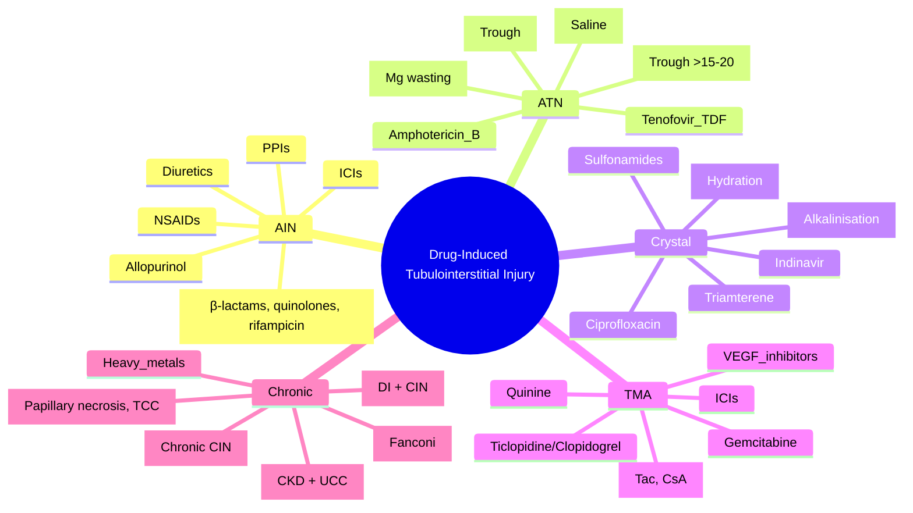

# Drug-Induced Tubulointerstitial Injury

**Related:** [[Tubulointerstitial Diseases — Acute Interstitial Nephritis (AIN)]], [[Tubulointerstitial Diseases — Chronic Interstitial Nephritis]], [[Acute Kidney Injury (AKI)]], [[Chronic Kidney Disease (CKD)]], [[Nephrology and Urology MOC]]

> [!important]
> **Drugs cause both ACUTE (AIN, ATN, crystal nephropathy) and CHRONIC (analgesic nephropathy, lithium, cisplatin, tenofovir, aristolochic acid) tubulointerstitial injury. Key: recognise drug-specific patterns, monitor renal function, stop nephrotoxins early. Common culprits: NSAIDs, antibiotics, PPIs, diuretics, lithium, calcineurin inhibitors, chemotherapy, antivirals, contrast, urate-lowering.**

---

## Learning Objectives
- Classify drug-induced tubular/interstitial injury by mechanism (AIN, ATN, crystal, chronic)
- Recognise drug-specific clinical and histological patterns
- Apply monitoring strategies for high-risk drugs
- Manage with drug withdrawal, dose adjustment, supportive care
- Differentiate from other AKI/CKD causes

---

## Classification by Mechanism

| Mechanism | Drugs | Key Features |
|-----------|-------|--------------|
| **Acute Interstitial Nephritis (AIN)** | NSAIDs, **Antibiotics** (β-lactams, quinolones, sulfonamides, rifampicin), **PPIs**, Diuretics, Allopurinol, ICIs | Fever, rash, eosinophilia (10–30%), eosinophiluria, WBC casts |
| **Acute Tubular Necrosis (ATN)** | **Aminoglycosides**, **Amphotericin B**, **Cisplatin**, Contrast, Vancomycin (high trough), Foscarnet, Tenofovir (TDF) | ATN pattern: FeNa >2%, muddy brown casts |
| **Crystal Nephropathy** | **Aciclovir**, Indinavir, **Sulfonamides**, Methotrexate, Triamterene, Ciprofloxacin | Crystals in urine/sediment; obstructive physiology |
| **Thrombotic Microangiopathy (TMA)** | **Calcineurin inhibitors** (CsA, Tac), **Quinine**, Ticlopidine/Clopidogrel, Gemcitabine, VEGF inhibitors, ICIs | MAHA, thrombocytopenia, AKI |
| **Chronic Interstitial Nephritis** | **Analgesics** (NSAIDs, phenacetin), **Lithium**, **Cisplatin**, **Tenofovir (TDF)**, **Aristolochic acid**, Heavy metals | Progressive CKD, tubular dysfunction |

---

## Drug-Specific Profiles

### 1. NSAIDs
| Injury | Mechanism | Features |
|--------|-----------|----------|
| **Pre-renal AKI** | ↓ PG synthesis → afferent arteriolar constriction | Reversible; high risk: elderly, HF, CKD, cirrhosis, diuretics, ACEi/ARB |
| **AIN** | Hypersensitivity | Fever, rash, eosinophilia (rare with NSAIDs); nephrotic overlap (MCD) |
| **Chronic Interstitial Nephritis** | Chronic ischaemia + direct toxicity | **Analgesic nephropathy**: papillary necrosis, CKD, TCC risk |
| **Electrolytes** | Hyperkalaemia (↓ renin, ↓ aldosterone), hyponatraemia | |

### 2. Antibiotics
| Drug | Injury | Monitoring |
|------|--------|------------|
| **Aminoglycosides** (gentamicin, amikacin) | **ATN** (proximal tubular necrosis), vestibular/ auditory toxicity | **Trough levels**; avoid concurrent nephrotoxins; limit course |
| **Vancomycin** | **ATN** (high trough >15–20), **AIN** (rare) | **Trough 10–15** (standard); 15–20 (severe); AUC-guided |
| | **Red Man Syndrome** | Infusion-related (histamine) |
| **β-Lactams** (penicillins, cephalosporins) | **AIN** (commonest antibiotic cause) | Watch for fever, rash, eosinophilia |
| **Quinolones** (ciprofloxacin, levofloxacin) | **AIN**, **Crystal nephropathy** (ciprofloxacin) | Hydration; monitor Cr |
| **Rifampicin** | **AIN**, ATN (high dose), haemolysis (G6PD) | Hepatotoxicity also |
| **Trimethoprim** | **Creatinine rise** (inhibits tubular secretion) — **not true AKI** | ↑ Cr 10–20% without GFR change; reversible |

### 3. Proton Pump Inhibitors (PPIs)
| Injury | Features |
|--------|----------|
| **AIN** | **Increasingly recognised**; latency weeks–months; often no triad; elderly; can be severe |
| **CKD association** | Observational link; ?confounding |
| **Management** | Stop PPI → recovery; steroids if severe |

### 4. Diuretics
| Injury | Features |
|--------|----------|
| **AIN** | Thiazides, furosemide; hypersensitivity |
| **Pre-renal AKI** | Volume depletion (over-diuresis) |
| **Electrolytes** | Hypokalaemia, hyponatraemia (thiazides), metabolic alkalosis |

### 5. Calcineurin Inhibitors (CNI) — Tacrolimus, Ciclosporin
| Injury | Mechanism | Features |
|--------|-----------|----------|
| **Acute Vasoconstriction** | Afferent arteriolar constriction (↓ PG, ↑ endothelin) | Reversible; ↑ trough → ↓ GFR; functional |
| **Chronic Nephrotoxicity** | Arteriolar hyalinosis (afferent > efferent), striped interstitial fibrosis | **Irreversible**; "CNI nephrotoxicity" |
| **TMA** | Endothelial injury | MAHA, thrombocytopenia, AKI |
| **Monitoring** | **Trough levels**; protocol biopsies (transplant) |
| **Management** | Dose reduction, switch to mTOR inhibitor/belatacept, minimise CNI |

### 6. Chemotherapy
| Drug | Injury | Features |
|------|--------|----------|
| **Cisplatin** | **ATN** (proximal > distal), **Chronic CIN**, Mg wasting, ototoxicity, neuropathy | Hydration, Mg replacement, amifostine; cumulative dose toxic |
| **Carboplatin** | Less nephrotoxic than cisplatin | |
| **Ifosfamide** | **Proximal tubular dysfunction (Fanconi syndrome)**, haemorrhagic cystitis | Mesna for cystitis |
| **Methotrexate** (high-dose) | **Crystal nephropathy** (MTX + 7-OH-MTX precipitation) | **High-dose**: leucovorin rescue, alkalinisation, hydration |
| **Gemcitabine** | **TMA** (renal-limited or systemic) | Stop drug; plasma exchange if severe |
| **VEGF Inhibitors** (bevacizumab, tyrosine kinase inhibitors) | **Proteinuria** (mainly), TMA, hypertension | Monitor UPCR, BP; hold if nephrotic/UPCR >3g |
| **Immune Checkpoint Inhibitors** | **AIN** (predominant), rarely GN | Hold ICI; steroids 1mg/kg; re-challenge controversial |

### 7. Antivirals
| Drug | Injury | Prevention |
|------|--------|------------|
| **Tenofovir DF (TDF)** | **Proximal tubular dysfunction (Fanconi)**, ATN, chronic CIN | **TAF (tenofovir alafenamide)** lower renal toxicity; monitor eGFR, Fanconi markers |
| **Aciclovir** (IV high-dose) | **Crystal nephropathy** (acicolovir crystals in tubules) | **Hydration**, slow infusion, dose adjust for CrCl |
| **Indinavir** (PI) | **Crystal nephropathy** (indinavir crystals) | Hydration |
| **Foscarnet** | **ATN**, electrolyte wasting (Mg, Ca, K, PO4) | Electrolyte monitoring/replacement |
| **Cidofovir** | **Proximal tubular toxicity** | Probenecid, hydration |

### 8. Contrast Media
| Injury | Mechanism | Prevention |
|--------|-----------|------------|
| **Contrast-Induced AKI (CI-AKI)** | Renal vasoconstriction + direct tubular toxicity + oxidative stress | **IV 0.9% saline 1 mL/kg/h 12h pre/post**; limit volume; NAC controversial; stop nephrotoxins |
| **Risk Factors** | CKD, DM, HF, age >70, volume depletion, nephrotoxins, high osmolar contrast | |

### 9. Urate-Lowering
| Drug | Injury | Notes |
|------|--------|-------|
| **Allopurinol** | **AIN** (hypersensitivity syndrome: fever, rash, eosinophilia, hepatitis, AKI) | **HLA-B*58:01** screening (Asians); stop immediately if rash |
| **Febuxostat** | Less hypersensitivity; CV risk (CARES trial) | Preferred if HLA-B*58:01+ |
| **Probenecid** | Crystal nephropathy (rare) | |

### 10. Other Notable Nephrotoxins
| Drug | Injury |
|------|--------|
| **Lithium** | Nephrogenic DI, chronic CIN |
| **Amphotericin B** | ATN (distal tubular), distal RTA (Type 1), K/Mg wasting |
| **Cyclophosphamide** | Haemorrhagic cystitis (bladder), SIADH |
| **Mesna** | Prevents cyclophosphamide/ifosfamide cystitis |
| **Gold salts** | Membranous nephropathy, AIN |
| **Penicillamine** | Membranous nephropathy, AIN |
| **Chinese Herbs (Aristolochia)** | **Aristolochic acid nephropathy**: rapid CKD, urothelial carcinoma |

---

## Monitoring Strategies

| Drug | Monitoring |
|------|------------|
| **Aminoglycosides** | Trough levels (pre-dose); audiometry if prolonged |
| **Vancomycin** | Trough levels (or AUC); Cr q2–3d |
| **Cisplatin** | Cr, Mg, K, electrolytes pre-cycle; GFR (measured) for dosing |
| **CNI (Tac/CsA)** | Trough levels q1–2wk; protocol biopsies (transplant) |
| **Lithium** | Li level q3mo; eGFR, TSH, Ca q6mo; urine osmolality |
| **TDF** | eGFR q3–6mo; UPCR; Fanconi markers (glucose, PO4, bicarbonate) if eGFR ↓ |
| **ICIs** | Cr, urinalysis q3–6wk (or pre-cycle) |
| **Contrast** | Cr at 48–72h post-exposure |

---

## Prevention Principles

| Principle | Application |
|-----------|-------------|
| **Avoid/Minimise** | Use non-nephrotoxic alternatives (e.g., TAF vs TDF, carboplatin vs cisplatin) |
| **Dose Adjust** | Renal dosing for all renally cleared drugs |
| **Hydration** | IV fluids for cisplatin, contrast, aciclovir, high-dose MTX |
| **Stop Nephrotoxins** | ACEi/ARB, NSAIDs, diuretics peri-procedure/contrast |
| **Monitor** | Regular Cr/eGFR for chronic nephrotoxins (CNI, lithium, TDF) |
| **Drug Holidays** | Consider for chronic nephrotoxins if feasible |

---

## Diagnostic Approach for Suspected Drug Injury

| Step | Action |
|------|--------|
| **1. Drug History** | **All drugs** (prescribed, OTC, herbal, supplements) in past 3 months |
| **2. Temporal Relationship** | Drug started before AKI/CKD; latency consistent (AIN: days–months; ATN: days) |
| **3. Exclude Alternatives** | Pre-renal, obstruction, GN, vasculitis, sepsis |
| **4. Urine/Blood** | FeNa, microscopy (casts, eosinophils), eosinophiluria, drug levels |
| **5. Biopsy** | If diagnosis uncertain, no improvement with withdrawal, severe AKI |
| **6. Rechallenge** | **NEVER** rechallenge if AIN/hypersensitivity (anaphylaxis risk) |

---

## High-Yield FCPS/MRCP Points

> [!important]
> - **NSAIDs**: pre-renal AKI, AIN (nephrotic overlap), chronic analgesic nephropathy (papillary necrosis, TCC)
> - **Aminoglycosides**: ATN (trough monitoring); **Vancomycin**: ATN if trough >15–20
> - **β-Lactams/Quinolones/Rifampicin/PPIs**: AIN (commonest antibiotic/ drug causes)
> - **Trimethoprim**: ↑ Cr (tubular secretion block) — **NOT true AKI**
> - **CNI (Tac/CsA)**: acute vasoconstriction (reversible), **chronic striped fibrosis (irreversible)**, TMA
> - **Cisplatin**: ATN + chronic CIN + Mg wasting
> - **Ifosfamide**: Fanconi syndrome + haemorrhagic cystitis (mesna)
> - **Gemcitabine/VEGF inhibitors/ICIs**: TMA
> - **TDF**: Fanconi syndrome, chronic CIN → switch to TAF
> - **Aciclovir/Indinavir**: Crystal nephropathy (hydration prevents)
> - **Contrast**: IV saline 1 mL/kg/h 12h pre/post; NAC controversial
> - **Allopurinol**: AIN + hypersensitivity syndrome (HLA-B*58:01 screening in Asians)
> - **Lithium**: Nephrogenic DI + chronic CIN
> - **Amphotericin B**: ATN + distal RTA + K/Mg wasting
> - **Aristolochic acid (Chinese herbs)**: rapid CKD + urothelial carcinoma

---

## Common Confusions / Exam Traps

| Trap | Correction |
|------|------------|
| **Trimethoprim = AKI** | ↑ Cr from tubular secretion inhibition; **no GFR change**; reversible |
| **Vancomycin nephrotoxicity = only trough** | AUC-guided better; also duration, concurrent nephrotoxins |
| **CNI acute = chronic** | Acute = functional vasoconstriction (reversible); Chronic = structural (irreversible) |
| **Allopurinol rash = continue with antihistamine** | **STOP IMMEDIATELY** — DRESS/SJS/TEN risk; HLA-B*58:01 screen Asians |
| **TDF = only HIV drug nephrotoxic** | Also adefovir, cidofovir, foscarnet; **TAF safer** |
| **Contrast prophylaxis = NAC** | **IV saline = evidence-based**; NAC weak/conflicting |
| **ACEi/ARB always stop for contrast** | Hold 24–48h if high-risk (CKD, DM, HF); not mandatory for all |
| **Cisplatin Mg wasting = only during** | Can persist **years** after completion |
| **ICI nephritis = ATN** | **Predominant histology = AIN** (interstitial oedema, lymphocytes, eosinophils) |
| **Chinese herbs = safe** | **Aristolochic acid** = rapid CKD + urothelial carcinoma |

---

## Mnemonics

- **AIN Drugs**: **N**SAIDs, **A**ntibiotics (β-lactams, quinolones), **P**PIs, **D**iuretics = **NAPD**
- **ATN Drugs**: **A**minoglycosides, **A**mphotericin, **C**isplatin, **C**ontrast, **V**anco (high), **T**enofovir (TDF) = **AACC VT**
- **Crystal Drugs**: **A**ciclovir, **I**ndinavir, **S**ulfonamides, **M**ethotrexate, **T**riamterene, **C**ipro = **AISMTC**
- **TMA Drugs**: **C**alcineurin inhibitors, **Q**uinine, **T**iclopidine/Clopidogrel, **G**emcitabine, **V**EGF inhibitors, **I**CIs = **CQTGVI**
- **CNI**: **A**cute = **V**asoconstriction (reversible); **C**hronic = **S**triped **F**ibrosis (irreversible)
- **Cisplatin**: **C**isplatin = **A**TN + **C**IN + **M**g wasting
- **Ifosfamide**: **I**fosfamide = **F**anconi + **C**ystitis (mesna)
- **TDF vs TAF**: **T**DF = **T**oxic **F**anconi; **T**AF = **T**enofovir **A**lafenamide (safer)
- **Allopurinol**: **A**llopurinol = **A**IN + **H**ypersensitivity (**H**LA-B*58:01)
- **Contrast**: **S**aline **1** mL/kg/h **1**2h **P**re/**P**ost = **S11PP**

---

## Mind Map

---

## 24-Hour Recall Prompts
1. AIN drugs: NSAIDs, antibiotics (β-lactams, quinolones), PPIs, diuretics, allopurinol, ICIs
2. ATN drugs: aminoglycosides, amphotericin, cisplatin, contrast, vancomycin (high trough), TDF
3. Crystal drugs: aciclovir, indinavir, sulfonamides, methotrexate, triamterene
4. TMA drugs: CNI, quinine, ticlopidine/clopidogrel, gemcitabine, VEGF inhibitors, ICIs
5. Chronic: analgesics (papillary necrosis, TCC), lithium (DI+CIN), cisplatin, TDF (Fanconi), aristolochic acid
6. Trimethoprim: ↑ Cr (secretion block) — NOT AKI
7. CNI: acute vasoconstriction (reversible) vs chronic striped fibrosis (irreversible)
8. Cisplatin: ATN + chronic CIN + Mg wasting
9. Ifosfamide: Fanconi + haemorrhagic cystitis (mesna)
10. TDF → Fanconi + CIN; switch to TAF
11. Aciclovir/Indinavir: crystal nephropathy — hydration
12. Contrast: IV saline 1 mL/kg/h 12h pre/post
13. Allopurinol: AIN + hypersensitivity; HLA-B*58:01 screen Asians
14. Lithium: nephrogenic DI + CIN
15. Amphotericin B: ATN + distal RTA + K/Mg wasting
16. Aristolochic acid: rapid CKD + urothelial carcinoma

---

## 7-Day / 15-Day / 30-Day Revision Tracker

| Day | Date | Recall (1-5) | Notes |
|-----|------|--------------|-------|
| 1   |      |              |       |
| 7   |      |              |       |
| 15  |      |              |       |
| 30  |      |              |       |

---

## Must Know / Should Know / Nice to Know

| Priority | Content |
|----------|---------|
| **Must Know 🔴** | Drug categories (AIN, ATN, crystal, TMA, chronic), key drugs per category, trimethoprim artefact, CNI acute vs chronic, cisplatin Mg wasting, TDF→TAF, contrast prophylaxis, allopurinol HLA, lithium DI, aristolochic acid |
| **Should Know 🟡** | Vancomycin AUC monitoring, ifosfamide Fanconi+mesna, gemcitabine/VEGF TMA, amphotericin RTA, checkpoint inhibitor AIN, Chinese herbs |
| **Nice to Know 🟢** | Novel nephrotoxins, pharmacogenomics, biomarker-guided monitoring, drug combinations |

---

## MCQs (10)

1. **Trimethoprim causes creatinine rise by:**
   A. Glomerular toxicity
   B. **Inhibiting tubular secretion of creatinine**
   C. Interstitial nephritis
   D. Tubular necrosis
   E. Volume depletion

2. **Cisplatin nephrotoxicity includes:**
   A. Only acute ATN
   B. **ATN + chronic interstitial nephritis + magnesium wasting**
   C. Only chronic interstitial nephritis
   D. Only magnesium wasting
   E. Nephrotic syndrome

3. **Tenofovir disoproxil fumarate (TDF) characteristic toxicity:**
   A. Distal RTA
   B. **Proximal tubular dysfunction (Fanconi syndrome)**
   C. Glomerulonephritis
   D. Crystal nephropathy
   E. Thrombotic microangiopathy

4. **Calcineurin inhibitor (tacrolimus/ciclosporin) CHRONIC nephrotoxicity histology:**
   A. Acute tubular necrosis
   B. **Striped interstitial fibrosis + arteriolar hyalinosis (afferent > efferent)**
   C. Crescentic GN
   D. Membranous nephropathy
   E. Minimal change disease

5. **Allopurinol hypersensitivity syndrome — screening in Asians:**
   A. HLA-B*27
   B. **HLA-B*58:01**
   C. HLA-DR2
   D. HLA-DQ2
   E. No screening needed

6. **Contrast-induced AKI prevention — evidence-based:**
   A. N-acetylcysteine alone
   B. **IV 0.9% saline 1 mL/kg/h × 12h pre and post**
   C. Sodium bicarbonate alone
   D. NAC + bicarbonate
   E. Dopamine infusion

7. **Lithium chronic renal effects:**
   A. Only acute interstitial nephritis
   B. **Nephrogenic diabetes insipidus + chronic interstitial nephritis**
   C. Only nephrotic syndrome
   D. Only glomerular disease
   E. No chronic effects

8. **Ifosfamide toxicity — specific tubular dysfunction:**
   A. Distal RTA
   B. **Proximal tubular dysfunction (Fanconi syndrome)**
   C. Nephrogenic DI
   D. Salt wasting only
   E. No tubular dysfunction

9. **Aristolochic acid (Chinese herbs) nephropathy:**
   A. Acute reversible AKI only
   B. **Rapidly progressive CKD + upper tract urothelial carcinoma**
   C. Nephrotic syndrome only
   D. Only Fanconi syndrome
   E. No malignancy risk

10. **Immune checkpoint inhibitor (anti-PD-1/PD-L1) nephritis — histology:**
    A. ATN
    B. **AIN (interstitial oedema, lymphocytic infiltrate, eosinophils)**
    C. Crescentic GN
    D. Membranous nephropathy
    E. Thrombotic microangiopathy

---

## SBA Questions (10)

1. **70-year-old man on TMP-SMX for PCP prophylaxis, Cr rises from 100 to 140 over 3 days, no change in urine output, no casts. Best action:**
   A. Stop TMP-SMX, start alternative
   B. **Continue TMP-SMX; Cr rise = tubular secretion block (not true AKI)**
   C. Renal biopsy
   C. Pulse steroids
   E. Dialysis

2. **55-year-old on cisplatin for lung cancer, cycle 3, Cr rising, Mg 0.4, K 3.0. Urine: muddy brown casts. Management:**
   A. Stop cisplatin permanently
   B. **Hydration, Mg/K replacement, consider dose reduction/delay; monitor cumulative dose**
   C. Switch to carboplatin only
   D. Plasma exchange
   E. Dialysis

3. **40-year-old on TDF for HIV, eGFR decline 90→55 over 1 year, urine glucose+ (normoglycaemic), phosphaturia, bicarbonaturia. Best action:**
   A. Increase TDF dose
   B. **Switch to TAF (tenofovir alafenamide)**
   C. Add SGLT2i
   D. Start bicarbonate only
   E. Renal biopsy

4. **Renal transplant patient on tacrolimus, Cr rising from 120 to 200 over 6 months, trough levels therapeutic. Biopsy: striped interstitial fibrosis, arteriolar hyalinosis. Diagnosis:**
   A. Acute CNI toxicity
   B. **Chronic CNI nephrotoxicity**
   C. Acute rejection
   D. Chronic rejection
   E. BK nephropathy

5. **Same patient, acute Cr rise 120→180 over 2 days after tacrolimus dose increase. Biopsy: isometric vacuolisation of proximal tubules, no fibrosis. Diagnosis:**
   A. Chronic CNI nephrotoxicity
   B. **Acute CNI vasoconstriction (reversible)**
   C. Acute rejection
   D. ATN
   E. Obstruction

6. **30-year-old on pembrolizumab for melanoma, Cr 100→250 over 2 weeks, sterile pyuria, eosinophiluria. Biopsy: interstitial oedema, lymphocytic infiltrate, eosinophils. Management:**
   A. Continue pembrolizumab, add ACEi
   B. **Hold pembrolizumab, prednisolone 1mg/kg**
   C. Pulse cyclophosphamide
   D. Plasma exchange
   E. Dialysis only

10. **65-year-old, IV aciclovir for herpes encephalitis, Cr rising. Urine: needle-shaped crystals. Prevention was:**
    A. Alkalinisation only
    B. **Hydration + slow infusion + dose adjust for CrCl**
    C. NAC
    D. Allopurinol
    E. Loop diuretics

7. **35-year-old woman, recent Chinese herbal medicine for weight loss, rapidly progressive CKD (Cr 80→400 in 3 months), normal US kidneys. Risk:**
    A. Renal cell carcinoma
    B. **Upper tract urothelial carcinoma**
    C. Bladder cancer only
    D. No malignancy risk
    E. Lymphoma

8. **Amphotericin B — characteristic renal tubular defect:**
    A. Proximal RTA (Fanconi)
    B. **Distal RTA (Type 1) + K/Mg wasting**
    C. Nephrogenic DI
    D. Salt wasting only
    E. No tubular defect

9. **Vancomycin nephrotoxicity risk factors:**
    A. Low trough levels
    B. **High trough (>15–20), prolonged course, concurrent nephrotoxins (aminoglycosides, CNI, contrast)**
    C. Only in elderly
    D. Only with oral vancomycin
    E. No risk factors

---

## Flashcards

- Q: Trimethoprim Cr rise mechanism?
  A: Inhibits tubular creatinine secretion (NOT true AKI)

- Q: AIN drugs?
  A: NSAIDs, antibiotics (β-lactams, quinolones, rifampicin), PPIs, diuretics, allopurinol, ICIs

- Q: ATN drugs?
  A: Aminoglycosides, amphotericin, cisplatin, contrast, vancomycin (high trough), TDF

- Q: Crystal nephropathy drugs?
  A: Aciclovir, indinavir, sulfonamides, methotrexate, triamterene, ciprofloxacin

- Q: TMA drugs?
  A: CNI, quinine, ticlopidine/clopidogrel, gemcitabine, VEGF inhibitors, ICIs

- Q: Chronic interstitial drugs?
  A: Analgesics (papillary necrosis), lithium (DI+CIN), cisplatin, TDF (Fanconi), aristolochic acid

- Q: CNI acute vs chronic?
  A: Acute = vasoconstriction (reversible); Chronic = striped fibrosis + arteriolar hyalinosis (irreversible)

- Q: Cisplatin toxicity?
  A: ATN + chronic CIN + Mg wasting (+ ototoxicity, neuropathy)

- Q: Ifosfamide?
  A: Fanconi syndrome + haemorrhagic cystitis (mesna prevents)

- Q: TDF vs TAF?
  A: TDF = Fanconi + CIN; TAF = safer (lower renal toxicity)

- Q: Aciclovir crystal prevention?
  A: Hydration + slow infusion + dose adjust for CrCl

- Q: Contrast prophylaxis?
  A: IV saline 1 mL/kg/h 12h pre/post (evidence-based)

- Q: Allopurinol hypersensitivity?
  A: Fever, rash, eosinophilia, hepatitis, AKI; HLA-B*58:01 screen Asians; STOP immediately

- Q: Lithium renal?
  A: Nephrogenic DI (commonest) + chronic CIN

- Q: Amphotericin B tubular?
  A: Distal RTA (Type 1) + K/Mg wasting

- Q: ICI nephritis histology?
  A: AIN (interstitial oedema, lymphocytic infiltrate, eosinophils)

- Q: Aristolochic acid?
  A: Rapid CKD + upper tract urothelial carcinoma

- Q: Vancomycin nephrotoxicity?
  A: High trough (>15–20), prolonged, concurrent nephrotoxins

---

## Answer Key with Explanations

### MCQs
1. **B** — Trimethoprim blocks tubular creatinine secretion → ↑ serum Cr without GFR change
2. **B** — Cisplatin = ATN + chronic CIN + Mg wasting (persistent)
3. **B** — TDF = proximal tubular dysfunction (Fanconi: glycosuria, phosphaturia, bicarbonaturia)
4. **B** — Chronic CNI = striped interstitial fibrosis + arteriolar hyalinosis (afferent > efferent)
5. **B** — HLA-B*58:01 screening for allopurinol hypersensitivity in Asians
6. **B** — IV saline 1 mL/kg/h 12h pre/post = only evidence-based contrast prophylaxis
7. **B** — Lithium = nephrogenic DI + chronic CIN
8. **B** — Ifosfamide = Fanconi syndrome (proximal tubular dysfunction)
9. **B** — Aristolochic acid = rapidly progressive CKD + upper tract urothelial carcinoma
10. **B** — ICI nephritis = AIN histology

### SBAs
1. **B** — TMP-SMX: Cr rise = secretion block; continue if no true AKI signs
2. **B** — Cisplatin: hydration, Mg/K replacement, dose adjust; cumulative dose limit
3. **B** — TDF Fanconi → switch to TAF (lower renal toxicity)
4. **B** — Striped fibrosis + arteriolar hyalinosis = chronic CNI nephrotoxicity
5. **B** — Acute CNI: isometric vacuolisation, reversible with dose reduction
6. **B** — ICI nephritis: hold ICI + pred 1mg/kg
7. **B** — Aciclovir crystals: hydration + slow infusion + dose adjust
8. **B** — Chinese herbs (aristolochic acid) = upper tract urothelial carcinoma
9. **B** — Amphotericin B = distal RTA + K/Mg wasting
10. **B** — Vancomycin: high trough, prolonged, concurrent nephrotoxins

---

## Summary

**Drug-Induced Tubulointerstitial Injury** is a **Must Know 🔴** topic.
**Key takeaway:** Drugs cause injury by multiple mechanisms. **AIN**: NSAIDs, antibiotics (β-lactams, quinolones), PPIs, diuretics, allopurinol, ICIs. **ATN**: aminoglycosides, amphotericin, cisplatin, contrast, vancomycin (high trough), TDF. **Crystal**: aciclovir, indinavir, sulfonamides, methotrexate. **TMA**: CNI, quinine, gemcitabine, VEGF inhibitors, ICIs. **Chronic**: analgesics (papillary necrosis, TCC), lithium (DI+CIN), cisplatin, TDF (Fanconi), aristolochic acid (CKD+UCC). **Trimethoprim**: ↑ Cr artefact (secretion block). **CNI**: acute vasoconstriction (reversible) vs chronic striped fibrosis (irreversible). **Cisplatin**: ATN + CIN + Mg wasting. **TDF→TAF** for Fanconi. **Contrast**: IV saline prophylaxis. **Allopurinol**: HLA-B*58:01 screen, STOP if rash. **Lithium**: DI + CIN. **Amphotericin**: distal RTA + K/Mg wasting. **ICI**: AIN histology. **Aristolochic acid**: CKD + urothelial carcinoma.
**Exam focus:** Drug categories, trimethoprim artefact, CNI acute vs chronic, cisplatin Mg wasting, TDF Fanconi, contrast prophylaxis, allopurinol HLA, lithium DI, amphotericin RTA, ICI AIN, aristolochic acid malignancy.
**Clinical relevance:** Drug history essential in every AKI/CKD; early withdrawal prevents irreversible damage; monitoring strategies reduce nephrotoxicity.