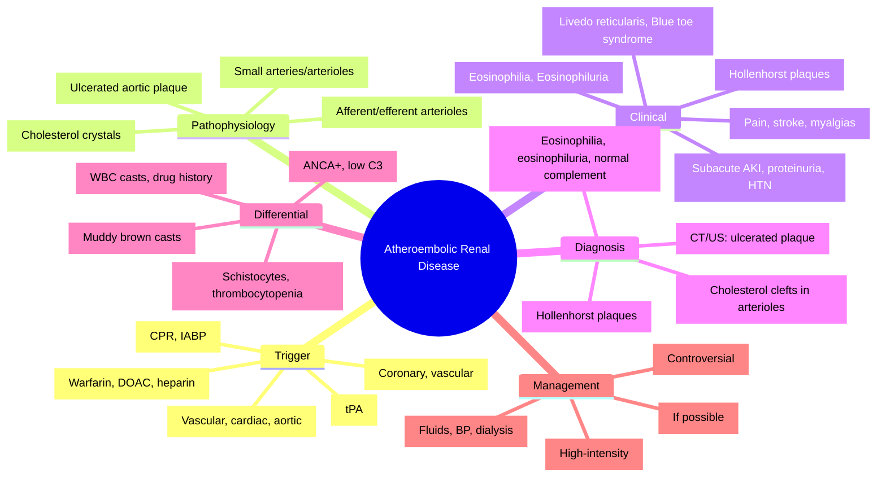

# Atheroembolic Renal Disease (AERD) / Cholesterol Embolism

**Related:** [[Vascular Diseases of the Kidney — Renal Artery Stenosis]], [[Vascular Diseases of the Kidney — Thrombotic Microangiopathies (TMA, HUS, TTP)]], [[Vascular Diseases of the Kidney — Renal Vein Thrombosis]], [[Acute Kidney Injury (AKI)]], [[Nephrology and Urology MOC]]

> [!important]
> **AERD = cholesterol crystal embolisation from ulcerated aortic plaque → distal organ ischaemia. Trigger: vascular procedures (angiography, surgery), anticoagulation/thrombolysis, trauma. Clinical: AKI (subacute), livedo reticularis, digital ischaemia (blue toe syndrome), eosinophilia, eosinophiluria, hypertension, retinal emboli (Hollenhorst plaques). Diagnosis: clinical + biopsy (cholesterol clefts in arterioles). Treatment: supportive, stop anticoagulation, statins, avoid further vascular trauma.**

---

## Learning Objectives
- Recognise clinical presentation post-vascular procedure/anticoagulation
- Identify characteristic features (livedo reticularis, blue toes, eosinophilia, eosinophiluria)
- Differentiate from vasculitis, TMA, ATN, RAS
- Apply diagnostic approach (biopsy = cholesterol clefts)
- Manage supportively and prevent recurrence

---

## Aetiology & Triggers

| Trigger | Timing | Risk Factors |
|---------|--------|--------------|
| **Vascular Procedures** | **Days–weeks** post-procedure | Coronary angiography, cardiac catheterisation, vascular surgery, aortic balloon pump, TAVR, stenting |
| **Anticoagulation/Thrombolysis** | Days–weeks after initiation | Warfarin, heparins, DOACs, thrombolytics (tPA, streptokinase) |
| **Trauma** | Acute | Aortic manipulation, CPR, intra-aortic balloon pump |
| **Spontaneous** | Variable | Severe aortic atherosclerosis, aortic aneurysm |

> [!key]
> **AERD = "Blue toe syndrome" + livedo reticularis + eosinophilia + AKI post-vascular procedure/anticoagulation.**

---

## Pathophysiology

| Step | Mechanism |
|------|-----------|
| **Source** | Ulcerated atherosclerotic plaque in **aorta** (abdominal > thoracic) or large arteries |
| **Embolisation** | Cholesterol crystals (from plaque lipid core) dislodged by trauma/anticoagulation |
| **Destination** | **Small arteries/arterioles** (renal, cutaneous, GI, CNS, retinal, muscle) |
| **Injury** | **Endothelial damage** + **inflammatory response** (complement, cytokines) → thrombosis, fibrosis |
| **Renal** | Afferent/efferent arterioles, interlobular arteries → cortical ischaemia → AKI/CKD |

---

## Clinical Features

| System | Features |
|--------|----------|
| **Renal** | **Subacute AKI** (weeks); proteinuria (subnephrotic); haematuria; hypertension (new/worsening) |
| **Cutaneous** | **Livedo reticularis** (pathognomonic), **blue toe syndrome** (digital ischaemia, cyanosis), gangrene, purpura, ulceration |
| **Haematological** | **Eosinophilia** (>0.5×10⁹/L in 60–80%), **eosinophiluria** (Hansel's stain), anaemia, thrombocytopenia |
| **GI** | Abdominal pain, GI bleeding, pancreatitis, ischaemic colitis |
| **CNS** | Stroke, TIA, encephalopathy, spinal cord infarct |
| **Retinal** | **Hollenhorst plaques** (cholesterol emboli at arteriolar bifurcations) |
| **Musculoskeletal** | Myalgias, muscle infarction, elevated CK |
| **Constitutional** | Fever, weight loss, fatigue |

---

## Diagnostic Approach

### Laboratory
| Test | Finding |
|------|---------|
| **Eosinophilia** | >0.5×10⁹/L (60–80%) — **key clue** |
| **Eosinophiluria** | Hansel's stain positive (also in AIN, obstruction, GN) |
| **Inflammatory Markers** | ↑ ESR, ↑ CRP |
| **Complement** | **Normal** (C3, C4) — distinguishes from vasculitis |
| **ANCA** | Negative |
| **Cryoglobulins** | Negative |
| **Lipids** | Often hyperlipidaemia |
| **Renal Function** | Subacute rise in Cr (weeks) |

### Urine
| Finding | Significance |
|---------|--------------|
| **Proteinuria** | Subnephrotic (<1–2g/day) |
| **Haematuria** | Microscopic |
| **Eosinophiluria** | Hansel's stain (sensitivity ~50%) |
| **Urinary Sediment** | Few cells, no casts (vs AIN: WBC casts) |

### Imaging
| Modality | Findings |
|----------|----------|
| **US Kidneys** | Normal/large early; cortical thinning late |
| **Aortic Imaging (CT/MR/US)** | **Aortic atherosclerosis**, ulcerated plaque, aneurysm |
| **Retinal Exam** | **Hollenhorst plaques** (bright cholesterol emboli at arteriolar bifurcations) |

### Biopsy (Gold Standard)
| Modality | Findings |
|----------|----------|
| **Light Microscopy** | **Cholesterol clefts** (biconvex, needle-shaped empty spaces) in **arterioles/small arteries**; intimal hyperplasia, thrombosis, interstitial fibrosis |
| **Polarised Light** | **Birefringent cholesterol crystals** |
| **Immunofluorescence** | Negative |
| **Electron Microscopy** | Crystalline structures in vessel walls |

> [!key]
> **Cholesterol clefts in arterioles = pathognomonic for AERD.**
> **Biopsy often not needed if clinical picture classic + eosinophilia + livedo + post-procedure.**

---

## Differential Diagnosis

| Condition | Distinguishing Feature |
|-----------|----------------------|
| **Vasculitis (ANCA, PAN)** | ANCA+, low complement, systemic features, no cholesterol clefts |
| **TMA (TTP/HUS)** | Schistocytes, thrombocytopenia, ADAMTS13 (TTP), no cholesterol clefts |
| **AIN** | WBC casts, eosinophiluria, drug history, fever/rash, biopsy: interstitial infiltrate |
| **ATN** | Muddy brown casts, FeNa >2%, no eosinophilia/livedo |
| **RAS** | Flash pulmonary oedema, bruits, duplex US criteria, no eosinophilia/livedo |
| **Obstructive Uropathy** | Hydronephrosis, no eosinophilia/livedo |

---

## Management

| Intervention | Details |
|--------------|---------|
| **1. Stop Trigger** | **Discontinue anticoagulation/thrombolysis** if possible; avoid further vascular procedures |
| **2. Supportive** | Fluids, BP control, dialysis if AKI severe |
| **3. Statins** | **High-intensity statin** (atorvastatin 40–80mg) — stabilises plaques, reduces events |
| **4. Antiplatelet** | Aspirin 75mg (if not contraindicated) |
| **5. Corticosteroids** | **Controversial**; may help inflammatory component (pred 0.5–1mg/kg) but no RCT evidence |
| **6. Renal Replacement** | Dialysis if AKI severe (AEIOU) |
| **7. Secondary Prevention** | Statin, BP control, smoking cessation, diabetes control, avoid vascular trauma |

> [!key]
> **No specific disease-modifying therapy. Statins = mainstay. Avoid anticoagulation if possible.**

---

## Prognosis

| Factor | Better | Worse |
|--------|--------|-------|
| **Renal Recovery** | Partial (often incomplete); some progress to CKD/ESRD | Severe initial AKI, need for dialysis |
| **Mortality** | ~20–30% at 1 year (CV events) | Multi-organ involvement, delayed diagnosis |
| **Recurrence** | Low if anticoagulation stopped, statins continued | Continued anticoagulation, repeat vascular procedures |

---

## High-Yield FCPS/MRCP Points

> [!important]
> - **AERD = cholesterol embolisation from aortic plaque** → post-vascular procedure/anticoagulation
> - **Classic triad**: **Livedo reticularis + blue toe syndrome + eosinophilia** (post-procedure)
> - **AKI**: subacute (weeks), not immediate like contrast nephropathy
> - **Eosinophilia** (60–80%), **eosinophiluria** (Hansel's)
> - **Retinal**: **Hollenhorst plaques** (cholesterol emboli at arteriolar bifurcations)
> - **Biopsy**: **Cholesterol clefts** in arterioles (pathognomonic)
> - **Complement**: **Normal** (vs vasculitis)
> - **Treatment**: **Supportive, stop anticoagulation, high-intensity statin**
> - **Steroids**: Controversial, no RCT evidence
> - **Differential**: Vasculitis (ANCA+, low C3), TMA (schistocytes), AIN (WBC casts), ATN (muddy brown casts)

---

## Common Confusions / Exam Traps

| Trap | Correction |
|------|------------|
| **AERD = immediate AKI post-angiography** | **Subacute (days–weeks)**; contrast nephropathy = 48–72h |
| **AERD = only renal** | **Multi-organ**: skin (livedo, blue toes), GI, CNS, retinal, muscle |
| **Eosinophilia = always present** | Only 60–80%; absence doesn't exclude |
| **Biopsy always needed** | Clinical diagnosis often sufficient (classic triad + post-procedure) |
| **Steroids = standard treatment** | **Controversial, no RCT evidence**; statins = evidence-based |
| **Anticoagulation = continue** | **Stop if possible** (triggers further embolisation) |
| **Complement low in AERD** | **Normal complement** (distinguishes from vasculitis) |
| **AERD = only after angiography** | Also after vascular surgery, anticoagulation, thrombolysis, trauma, spontaneous |
| **Blue toes = only AERD** | Also vasculitis, Raynaud's, cryoglobulinaemia, TMA, popliteal entrapment |

---

## Mnemonics

- **AERD Triggers**: **A**ngiography, **A**nticoagulation, **A**ortic surgery, **A**ortic balloon = **4 A's**
- **Classic Triad**: **L**ivedo, **B**lue toes, **E**osinophilia = **LBE**
- **Biopsy**: **C**holesterol **C**lefts in **A**rterioles = **CCA**
- **Retinal**: **H**ollenhorst **P**laques = **HP** (cholesterol emboli)
- **Timing**: **S**ubacute (weeks) not **I**mmediate = **SI**
- **Treatment**: **S**top anticoagulation, **S**tatin (high-intensity), **S**upportive = **SSS**
- **Complement**: **C**omplement **N**ormal = **CN** (vs vasculitis)
- **Differential**: **V**asculitis (ANCA+), **T**MA (schistocytes), **A**IN (WBC casts) = **VTA**

---

## Mind Map

---

## 24-Hour Recall Prompts
1. AERD triggers: angiography, anticoagulation, vascular surgery, thrombolysis
2. Classic triad: livedo reticularis + blue toe syndrome + eosinophilia
3. AKI timing: subacute (days–weeks post-trigger)
4. Eosinophilia 60–80%; eosinophiluria (Hansel's)
5. Retinal: Hollenhorst plaques (cholesterol emboli)
6. Biopsy: cholesterol clefts in arterioles (pathognomonic)
7. Complement: NORMAL (vs vasculitis)
8. Treatment: stop anticoagulation, high-intensity statin, supportive
9. Steroids: controversial, no RCT
10. Differential: vasculitis (ANCA+), TMA (schistocytes), AIN (WBC casts)

---

## 7-Day / 15-Day / 30-Day Revision Tracker

| Day | Date | Recall (1-5) | Notes |
|-----|------|--------------|-------|
| 1   |      |              |       |
| 7   |      |              |       |
| 15  |      |              |       |
| 30  |      |              |       |

---

## Must Know / Should Know / Nice to Know

| Priority | Content |
|----------|---------|
| **Must Know 🔴** | Triggers, classic triad (livedo, blue toes, eosinophilia), subacute AKI, eosinophilia/eosinophiluria, Hollenhorst plaques, cholesterol clefts biopsy, normal complement, statins, stop anticoagulation |
| **Should Know 🟡** | Differential (vasculitis, TMA, AIN, ATN), timing vs contrast nephropathy, prognosis, steroid controversy, retinal exam findings, aortic imaging |
| **Nice to Know 🟢** | Genetic factors, novel biomarkers, cost-effectiveness of statins, long-term outcomes, pregnancy |

---

## MCQs (10)

1. **Atheroembolic renal disease typically occurs:**
   A. Immediately (hours) after angiography
   B. **Days to weeks after vascular procedure/anticoagulation**
   C. Only after cardiac surgery
   D. Only with thrombolysis
   D. Only in diabetics

2. **Classic cutaneous triad of AERD:**
   A. Purpura, ulcers, necrosis
   B. **Livedo reticularis, blue toe syndrome, eosinophilia**
   C. Raynaud's, digital ulcers, gangrene
   D. Vasculitic rash, nodules, livedo
   E. Petechiae, ecchymoses, livedo

3. **Renal biopsy hallmark of AERD:**
   A. Fibrinoid necrosis
   B. **Cholesterol clefts in arterioles**
   C. Crescents
   D. Immune complex deposits
   E. Tubular atrophy only

4. **Complement levels in AERD:**
   A. Low C3, low C4
   B. Low C3, normal C4
   C. **Normal C3, normal C4**
   D. Low C4 only
   E. Elevated

5. **Retinal finding in AERD:**
   A. Cotton wool spots
   B. Flame haemorrhages
   C. **Hollenhorst plaques (cholesterol emboli at arteriolar bifurcations)**
   D. Papilloedema
   E. Retinal vein occlusion

6. **Eosinophilia in AERD — prevalence:**
   A. >95%
   B. **60–80%**
   C. 30–40%
   D. <10%
   E. Never present

6. **Timing distinction: AERD vs Contrast Nephropathy:**
   A. Both immediate
   B. **AERD: subacute (days–weeks); Contrast: 48–72 hours**
   C. AERD: 24h; Contrast: 1 week
   D. Both 48–72h
   E. AERD: immediate; Contrast: subacute

7. **AERD management — evidence-based:**
   A. High-dose steroids
   B. **Stop anticoagulation + high-intensity statin**
   C. Plasma exchange
   D. Cyclophosphamide
   E. Rituximab

8. **AERD vs Vasculitis — key lab difference:**
   A. Eosinophilia only in AERD
   B. **Complement NORMAL in AERD; LOW in vasculitis**
   C. ANCA positive in AERD
   D. Cryoglobulins only in vasculitis
   E. No difference

9. **Hollenhorst plaques are:**
   A. Retinal cotton wool spots
   B. **Cholesterol emboli at retinal arteriolar bifurcations**
   C. Retinal haemorrhages
   D. Optic disc drusen
   E. Retinal artery macroaneurysms

10. **Blue toe syndrome — differential includes:**
    A. Only AERD
    B. **Vasculitis, Raynaud's, cryoglobulinaemia, TMA, popliteal entrapment**
    C. Only Raynaud's
    D. Only TMA
    E. Only vasculitis

---

## SBA Questions (10)

1. **68-year-old man, coronary angiography 3 weeks ago, now AKI (Cr 120→280), livedo reticularis on legs, blue discoloration of 2 toes, eosinophilia 1.2×10⁹/L. Complement normal. Most likely diagnosis:**
   A. Contrast nephropathy
   B. **Atheroembolic renal disease**
   C. ANCA vasculitis
   D. Acute interstitial nephritis
   E. Acute tubular necrosis

2. **Same patient — renal biopsy performed. Pathognomonic finding:**
   A. Fibrinoid necrosis of arterioles
   B. **Cholesterol clefts (biconvex empty spaces) in arterioles**
   C. Cellular crescents
   D. Granular IgG deposits
   E. Amyloid deposits

3. **AERD — which medication has evidence for improving outcomes?**
   A. Prednisolone 1mg/kg
   B. **Atorvastatin 80mg (high-intensity statin)**
   C. Cyclophosphamide
   D. Rituximab
   E. Plasma exchange

4. **Anticoagulation in AERD — management:**
   A. Continue therapeutic anticoagulation
   B. **Stop if possible (triggers further embolisation)**
   C. Switch to DOAC
   D. Reduce dose by 50%
   E. No change needed

5. **70-year-old post-cardiac catheterisation, acute AKI at 48h, no livedo, no eosinophilia, FeNa >2%, muddy brown casts. Diagnosis:**
   A. Atheroembolic disease
   B. **Contrast-induced AKI**
   C. Acute interstitial nephritis
   D. Atherosclerotic RAS
   E. Obstructive uropathy

6. **Retinal examination in AERD shows bright, refractile lesions at arteriolar bifurcations. These are:**
   A. Cotton wool spots
   B. **Hollenhorst plaques**
   C. Roth spots
   D. Flame haemorrhages
   E. Dot-blot haemorrhages

7. **AERD — complement levels:**
   A. Low C3, low C4
   B. Low C3, normal C4
   C. **Normal C3, normal C4**
   D. Normal C3, low C4
   E. Low C4 only

8. **Eosinophiluria in AERD — also seen in:**
   A. Only AERD
   B. **AIN, obstructive uropathy, GN, TMA**
   C. Only AIN
   D. Only TMA
   E. Only obstruction

9. **Post-vascular procedure AKI — subacute onset (2–4 weeks), multi-organ (skin, GI, CNS), eosinophilia. Most likely:**
   A. Contrast nephropathy
   B. **Atheroembolic renal disease**
   C. ATN
   D. AIN
   E. RAS

10. **AERD prophylaxis — best evidence:**
    A. Pre-procedure steroids
    B. **Statin therapy (high-intensity)**
    C. Hydration only
    D. NAC
    E. Avoid all angiography

---

## Flashcards

- Q: AERD triggers?
  A: Angiography, anticoagulation, vascular surgery, thrombolysis, trauma

- Q: AERD classic triad?
  A: Livedo reticularis + blue toe syndrome + eosinophilia

- Q: AERD AKI timing?
  A: Subacute (days–weeks post-trigger)

- Q: AERD eosinophilia?
  A: 60–80% (>0.5×10⁹/L)

- Q: AERD eosinophiluria?
  A: Hansel's stain positive

- Q: AERD retinal?
  A: Hollenhorst plaques (cholesterol emboli at arteriolar bifurcations)

- Q: AERD biopsy?
  A: Cholesterol clefts in arterioles (pathognomonic)

- Q: AERD complement?
  A: NORMAL (vs vasculitis)

- Q: AERD treatment?
  A: Stop anticoagulation, high-intensity statin, supportive

- Q: AERD steroids?
  A: Controversial, no RCT evidence

- Q: AERD vs contrast nephropathy timing?
  A: AERD subacute (weeks); contrast 48–72h

- Q: Hollenhorst plaques?
  A: Cholesterol emboli at retinal arteriolar bifurcations

- Q: Blue toe syndrome differential?
  A: AERD, vasculitis, Raynaud's, cryoglobulinaemia, TMA, popliteal entrapment

- Q: AERD eosinophiluria also in?
  A: AIN, obstruction, GN, TMA

---

## Answer Key with Explanations

### MCQs
1. **B** — AERD = subacute (days–weeks) post-trigger
2. **B** — Classic triad: livedo reticularis + blue toe syndrome + eosinophilia
3. **B** — Cholesterol clefts in arterioles = pathognomonic
4. **C** — Complement NORMAL in AERD
5. **C** — Hollenhorst plaques = cholesterol emboli at retinal arteriolar bifurcations
6. **B** — Eosinophilia 60–80%
7. **B** — AERD subacute (weeks) vs contrast 48–72h
8. **B** — Stop anticoagulation + statin = evidence-based
9. **B** — Complement normal in AERD; low in vasculitis
10. **B** — Hollenhorst plaques = cholesterol emboli at arteriolar bifurcations

### SBAs
1. **B** — Post-angiography 3 weeks + livedo + blue toes + eosinophilia + normal complement = AERD
2. **B** — Cholesterol clefts in arterioles = pathognomonic
3. **B** — High-intensity statin = evidence-based
4. **B** — Stop anticoagulation if possible (triggers further embolisation)
5. **B** — 48h AKI + FeNa >2% + muddy brown casts = contrast nephropathy
6. **B** — Hollenhorst plaques = cholesterol emboli at retinal arteriolar bifurcations
7. **C** — Complement normal in AERD
8. **B** — Eosinophiluria also in AIN, obstruction, GN, TMA
9. **B** — Subacute multi-organ + eosinophilia = AERD
10. **B** — Statin therapy = evidence for prophylaxis/treatment

---

## Summary

**Atheroembolic Renal Disease** is a **Must Know 🔴** topic.
**Key takeaway:** Cholesterol crystal embolisation from ulcerated aortic plaque. **Triggers**: angiography, anticoagulation, vascular surgery, thrombolysis. **Classic triad**: **livedo reticularis + blue toe syndrome + eosinophilia** (post-procedure). **AKI**: subacute (days–weeks). **Eosinophilia 60–80%**, eosinophiluria (Hansel's). **Retinal**: Hollenhorst plaques. **Biopsy**: cholesterol clefts in arterioles (pathognomonic). **Complement NORMAL**. **Treatment**: **stop anticoagulation, high-intensity statin, supportive**. Steroids controversial. **Differential**: vasculitis (ANCA+, low C3), TMA (schistocytes), AIN (WBC casts), ATN (muddy brown casts).
**Exam focus:** Triggers, classic triad, subacute AKI vs contrast, eosinophilia/eosinophiluria, Hollenhorst plaques, cholesterol clefts, normal complement, statins, stop anticoagulation, differential diagnosis.
**Clinical relevance:** High mortality from CV events; statins improve outcomes; avoid unnecessary anticoagulation/vascular procedures in severe aortic atheroma.