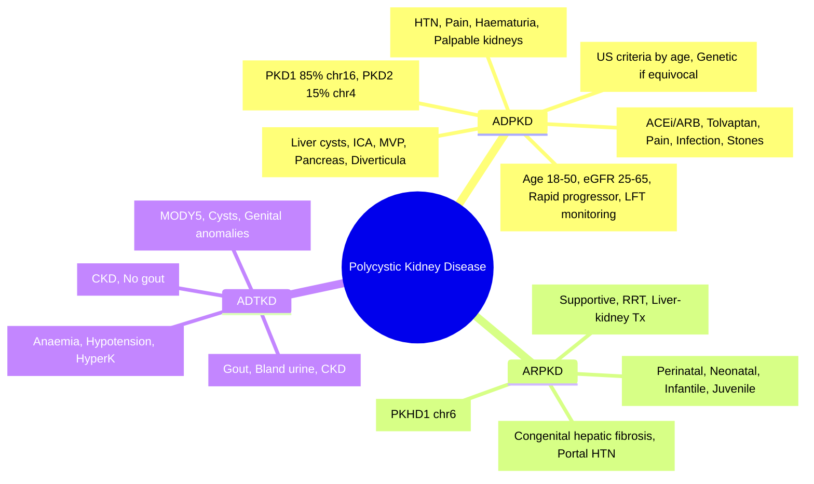

# Polycystic Kidney Disease (ADPKD, ARPKD)

**Related:** [[Chronic Kidney Disease (CKD)]], [[Kidney Transplantation (Indications, Workup, Immunosuppression, Complications)]], [[Functional Anatomy and Physiology of the Kidney and Urinary Tract]], [[Hypertension]], [[Vascular Diseases of the Kidney — Renal Artery Stenosis]], [[Nephrology and Urology MOC]]

> [!important]
> **ADPKD = most common inherited kidney disease (1:800–1:1000). PKD1 (85%, chr16) > PKD2 (15%, chr4). Cysts from tubular epithelial cells → progressive enlargement, hypertension, ESRD by 50–60yr. ARPKD = rare (1:20,000), PKHD1 (chr6), presents in infancy/childhood with renal cysts + congenital hepatic fibrosis.**

---

## Learning Objectives
- Differentiate ADPKD vs ARPKD (genetics, presentation, prognosis)
- Apply diagnostic criteria (Pei/Ravine ultrasound criteria)
- Manage hypertension, pain, complications in ADPKD
- Apply tolvaptan indication criteria
- Screen for intracranial aneurysms, hepatic cysts
- Apply to FCPS/MRCP clinical vignettes

---

## Autosomal Dominant Polycystic Kidney Disease (ADPKD)

### Genetics
| Gene | Locus | Protein | Frequency | Phenotype |
|------|-------|---------|-----------|-----------|
| **PKD1** | 16p13.3 | Polycystin-1 | **85%** | More severe, earlier ESRD (~55yr) |
| **PKD2** | 4q21–23 | Polycystin-2 | **15%** | Milder, later ESRD (~75yr) |
| **GANAB** | 11q12.3 | Glucosidase IIα | Rare | Atypical, milder |
| **DNAJB11** | 3q27.3 | ER co-chaperone | Rare | Atypical |

> **Polycystin-1/2 complex** → primary cilia mechanosensation → regulates tubular diameter, planar cell polarity. Loss → ↑ cAMP, ↑ mTOR, ↑ CFTR-mediated Cl⁻ secretion → cystogenesis.

---

### Clinical Presentation
| Feature | Typical |
|---------|---------|
| **Age at presentation** | 30–50 years (PKD1 earlier) |
| **Hypertension** | **60–70%** (often first sign, <35yr) |
| **Flank/abdominal pain** | Cyst haemorrhage, infection, stone |
| **Haematuria** | Microscopic > macroscopic (cyst rupture) |
| **Palpable kidneys** | Ballotable, enlarged |
| **ESRD** | Mean age: PKD1 55yr, PKD2 75yr |

---

### Extrarenal Manifestations
| System | Manifestation | Prevalence |
|--------|---------------|------------|
| **Liver** | **Hepatic cysts** (most common) | 80% by age 60 |
| **Brain** | **Intracranial aneurysms** (Berry, Circle of Willis) | 8–12% (screen if FHx) |
| **Heart** | Mitral valve prolapse, aortic regurgitation | 25% |
| **Pancreas** | Pancreatic cysts | 10% |
| **Colon** | Diverticulosis | ↑ risk |
| **Abdominal wall** | Hernias (inguinal, incisional) | ↑ risk |
| **Seminal vesicles** | Cysts (male infertility) | Rare |

> **Screen for ICA**: MRA/CTA if FHx of ICA/SAH, high-risk occupation, pre-major surgery. Repeat q5–10yr if negative.

---

### Diagnostic Criteria (Ultrasound – Pei/Ravine)
| Age (years) | PKD1 Criteria (at risk) | PKD2 Criteria (at risk) |
|-------------|-------------------------|-------------------------|
| **15–39** | **≥3 cysts (unilateral/bilateral)** | ≥2 cysts |
| **40–59** | **≥2 cysts each kidney** | ≥2 cysts each kidney |
| **≥60** | **≥4 cysts each kidney** | ≥4 cysts each kidney |

> **Exclusion criteria** (if not meeting above): <2 cysts total age <30, <4 cysts total age 30–59. **Genetic testing**: if imaging equivocal, young potential donor, atypical presentation.

---

### CKD Progression Predictors
| Predictor | High Risk |
|-----------|-----------|
| **PKD1 truncating mutation** | Yes |
| **Large kidney volume (TKV >1.5L)** | Yes |
| **Early hypertension (<35yr)** | Yes |
| **Male sex** | Yes |
| **Gross haematuria episodes** | Yes |
| **PROPKD score** | Combines mutation, sex, HTN, TKV |

---

### Management

#### Hypertension (Target <130/80)
| Agent | Role |
|-------|------|
| **ACEi/ARB** | **First-line** (renoprotective, ↓ proteinuria) |
| **CCB** | Add-on (amlodipine) |
| **Thiazide** | If eGFR >30 |
| **SGLT2i** | CKD benefit (DAPA-CKD, EMPA-KIDNEY) |
| **Avoid** | Direct renin inhibitors (ALTITUDE harm) |

#### Tolvaptan (V2 receptor antagonist)
| Criteria (TEMPO 3:4, REPRISE) | Details |
|-------------------------------|---------|
| **Age** | 18–50 years |
| **eGFR** | **≥25–65 mL/min** (CKD G2–G3) |
| **TKV** | Rapid progression (CLASS 1C/1D by Mayo imaging) |
| **Dose** | 45/15mg → 90/30mg → 120/40mg (split dose, q12h) |
| **Monitoring** | LFTs q1mo × 3mo, then q3mo (hepatotoxicity risk) |
| **Contraindication** | Liver disease, anuria, CYP3A4 strong inhibitors |

> **Tolvaptan slows TKV growth & eGFR decline** (~1 mL/min/yr benefit). NICE: only if rapid progression (PROPKD high risk or Mayo Class 1C/1D).

#### Pain Management
| Cause | Treatment |
|-------|-----------|
| **Chronic dull** | Simple analgesia (paracetamol ± tramadol), avoid NSAIDs |
| **Acute severe** | Cyst haemorrhage/infection → bed rest, opioids short-term |
| **Refractory** | Cyst aspiration + sclerotherapy (ethanol), surgical unroofing |

#### Complication-Specific
| Complication | Management |
|--------------|------------|
| **Cyst infection** | Lipophilic antibiotics (ciprofloxacin, TMP-SMX, metronidazole) 4–6 weeks |
| **Cyst haemorrhage** | Conservative (bed rest, analgesia); embolisation if massive |
| **Nephrolithiasis** (20%) | ↑ citrate, ↑ fluids; uric acid stones common (alkalinisation) |
| **Malignancy (RCC)** | Slightly ↑ risk; surveillance US if complex cysts (Bosniak III/IV) |

---

## Autosomal Recessive Polycystic Kidney Disease (ARPKD)

### Genetics
- **PKHD1** (chr6p12) → **Fibrocystin (polyductin)** — ciliary protein
- **Autosomal recessive** — 25% recurrence risk
- Carrier frequency ~1:70

### Phenotypes
| Type | Age | Renal | Hepatic |
|------|-----|-------|---------|
| **Perinatal** | Birth | Severe (Potter sequence, oligohydramnios) | Congenital hepatic fibrosis |
| **Neonatal** | <1mo | Enlarged echogenic kidneys, AKI | Portal hypertension later |
| **Infantile** | 1mo–1yr | CKD, hypertension | CHF, portal hypertension |
| **Juvenile** | >1yr | CKD variable | **Predominant hepatic** (variceal bleeding) |

### Diagnosis
- **Antenatal US**: Bilaterally enlarged echogenic kidneys, oligohydramnios
- **Postnatal**: US (loss of corticomedullary differentiation, microcysts), LFTs (cholestasis), genetic testing

### Management
- **Respiratory support** (perinatal)
- **Hypertension**: ACEi/ARB
- **Renal replacement** (often by age 10–20)
- **Portal hypertension**: Endoscopic variceal ligation, TIPS, liver transplant
- **Combined liver-kidney transplant** if both organ failure

---

## Other Cystic/Inherited Disorders

### ADTKD (Autosomal Dominant Tubulointerstitial Kidney Disease)
| Gene | Protein | Features |
|------|---------|----------|
| **UMOD** (ADTKD-UMOD) | Uromodulin (Tamm-Horsfall) | **Gout** (young), CKD, bland urine sediment |
| **MUC1** (ADTKD-MUC1) | Mucin-1 | CKD, no gout, indistinguishable from UMOD |
| **REN** (ADTKD-REN) | Renin | **Anaemia in childhood**, hypotension, hyperkalaemia |
| **HNF1B** (ADTKD-HNF1B) | Transcription factor | **MODY5**, renal cysts, genital tract malformations, hyperglycaemia |

> **ADTKD**: Bland urine (no protein/haematuria), gout (UMOD), CKD progression. Genetic testing confirms.

### Medullary Cystic Kidney Disease (MCKD) = ADTKD (old term)

---

## High-Yield FCPS/MRCP Points

> [!important]
> - **ADPKD**: PKD1 (85%, severe) vs PKD2 (15%, mild). Ultrasound criteria by age.
> - **Hypertension** = earliest manifestation (RAAS activation from cyst compression).
> - **Screen for ICA**: FHx of SAH/ICA, high-risk job, pre-major surgery.
> - **Tolvaptan**: Age 18–50, eGFR 25–65, rapid progression (Mayo Class 1C/1D). Monitor LFTs.
> - **Avoid NSAIDs** (↓ renal perfusion, ↑ cyst growth).
> - **Cyst infection**: Lipophilic abx (cipro, TMP-SMX) 4–6 weeks.
> - **ARPKD**: PKHD1, perinatal/neonatal presentation, CHF + renal cysts.
> - **ADTKD-UMOD**: Young-onset gout + CKD + bland urine.
> - **ADTKD-HNF1B**: MODY5 + renal cysts + genital anomalies.

---

## Common Confusions / Exam Traps

| Trap | Correction |
|------|------------|
| **ADPKD = only renal** | Extrarenal: liver cysts, ICA, MVP, pancreatic cysts, diverticulosis |
| **All ADPKD need tolvaptan** | Only **rapid progressors** (eGFR 25–65, age 18–50, Mayo 1C/1D) |
| **ARPKD = only kidneys** | **Congenital hepatic fibrosis** is obligate extrarenal feature |
| **ICA screening = all ADPKD** | Only if FHx SAH/ICA, high-risk job, pre-surgery; repeat q5–10yr |
| **NSAIDs safe in ADPKD** | **Avoid** — accelerate cyst growth, ↓ GFR |
| **Cyst infection = any antibiotic** | Need **lipophilic** (cipro, TMP-SMX, metronidazole) for cyst penetration |
| **ADTKD = ADPKD** | ADTKD = bland urine, gout (UMOD), no massive cysts; ADPKD = massive cysts |
| **PKD1 vs PKD2 severity** | PKD1 = ESRD ~55yr; PKD2 = ESRD ~75yr |
| **Tolvaptan monitoring** | LFTs q1mo × 3mo, then q3mo (hepatotoxicity) |

---

## Mnemonics
- **ADPKD genes**: **P**KD1 = **P**rimary (85%, severe); **P**KD2 = **P**lastic (15%, milder)
- **ADPKD extrarenal**: **L**iver cysts, **I**CA, **M**VP, **P**ancreatic cysts, **D**iverticula, **H**ernias = **LIMPDH**
- **ARPKD**: **P**KHD1 = **P**erinatal, **K**idney + **H**epatic (fibrosis), **D**uctal plate malformation
- **Tolvaptan criteria**: **AGE 18–50**, **GFR 25–65**, **RAPID progression** = **AGFRAPID**
- **ADTKD-UMOD**: **U**romodulin = **U**ric acid (gout) + **M**ODY-like CKD

---

## Mind Map

---

## 24-Hour Recall Prompts
1. PKD1 vs PKD2 (frequency, severity, ESRD age)
2. Ultrasound diagnostic criteria by age group
3. Tolvaptan indication criteria (age, eGFR, progression)
4. ICA screening indications
5. ADPKD extrarenal manifestations
6. Cyst infection antibiotic choice (lipophilic)
7. ARPKD gene + obligate hepatic feature
8. ADTKD subtypes (UMOD, MUC1, REN, HNF1B)

---

## 7-Day / 15-Day / 30-Day Revision Tracker
| Day | Date | Recall (1-5) | Notes |
|-----|------|--------------|-------|
| 1   |      |              |       |
| 7   |      |              |       |
| 15  |      |              |       |
| 30  |      |              |       |

---

## Must Know / Should Know / Nice to Know
| Priority | Content |
|----------|---------|
| **Must Know 🔴** | ADPKD genetics/criteria, hypertension management, ICA screening, tolvaptan criteria, cyst infection abx, ARPKD basics |
| **Should Know 🟡** | ADTKD subtypes, pain management, stone risk, malignancy surveillance, PROPKD score |
| **Nice to Know 🟢** | GANAB/DNAJB11, novel biomarkers (copeptin), tolvaptan combo trials, gene therapy |

---

## MCQs (10)
1. **Most common gene mutation in ADPKD:**
   A. PKD2
   B. **PKD1**
   C. PKHD1
   D. UMOD
   E. HNF1B

2. **Ultrasound diagnostic criteria for ADPKD (PKD1) age 25:**
   A. ≥2 cysts total
   B. **≥3 cysts (unilateral or bilateral)**
   C. ≥2 cysts each kidney
   D. ≥4 cysts each kidney
   E. ≥5 cysts total

3. **First-line antihypertensive in ADPKD:**
   A. Beta-blocker
   B. **ACE inhibitor / ARB**
   C. Calcium channel blocker
   D. Thiazide diuretic
   E. Alpha-blocker

4. **Tolvaptan is indicated in ADPKD when:**
   A. Age >60, eGFR >60
   B. **Age 18–50, eGFR 25–65, rapid progression**
   C. Any age, any eGFR
   D. Only if on dialysis
   E. Only for pain control

5. **Intracranial aneurysm screening in ADPKD is recommended if:**
   A. All patients at diagnosis
   B. **Family history of SAH/ICA, high-risk occupation, pre-major surgery**
   C. Only if headache
   D. Only if PKD1 mutation
   E. Never indicated

6. **Antibiotic of choice for ADPKD cyst infection:**
   A. IV Ceftriaxone
   B. **Ciprofloxacin (lipophilic, good cyst penetration)**
   C. IV Gentamicin
   D. Oral Amoxicillin
   E. IV Vancomycin

7. **ARPKD gene:**
   A. PKD1
   B. PKD2
   C. **PKHD1**
   D. UMOD
   E. HNF1B

8. **Obligate extrarenal feature of ARPKD:**
   A. Intracranial aneurysms
   B. **Congenital hepatic fibrosis**
   C. Pancreatic cysts
   D. Mitral valve prolapse
   E. Diverticulosis

9. **ADTKD-UMOD hallmark triad:**
   A. Hypertension, proteinuria, haematuria
   B. **Young-onset gout, CKD, bland urine sediment**
   C. Nephrotic syndrome, HTN, cysts
   D. Diarrhoea, electrolyte loss, alkalosis
   E. Rickets, aminoaciduria, polyuria

10. **Drug to AVOID in ADPKD:**
    A. ACE inhibitor
    B. ARB
    C. **NSAIDs**
    D. Tolvaptan
    E. Paracetamol

---

## SBA Questions (10)
1. **30-year-old man, FHx ADPKD (father ESRD 55). Ultrasound: 4 cysts right, 3 left. PKD1 mutation confirmed. BP 145/92. Best initial antihypertensive:**
   A. Amlodipine
   B. **Ramipril (ACEi)**
   C. Indapamide
   D. Bisoprolol
   E. Doxazosin

2. **28-year-old woman, ADPKD (PKD2), eGFR 58, TKV 1.2L (Mayo Class 1B). Father ESRD 72. Wants tolvaptan. Eligible?**
   A. Yes, all ADPKD qualify
   B. **No — not rapid progressor (Mayo 1B, not 1C/1D)**
   C. Yes if PKD1
   D. Only if eGFR <30
   E. Only if symptomatic

3. **35-year-old man, ADPKD, sudden severe flank pain, macroscopic haematuria. Hb dropped 20g/L. CT: large bleeding cyst. Management:**
   A. Emergency nephrectomy
   B. **Bed rest, analgesia, transfusion if needed, monitor**
   C. Cyst embolisation immediately
   D. High-dose steroids
   E. Start tolvaptan

4. **40-year-old woman, ADPKD, fever, flank pain, CRP 180. Urine culture negative. Blood culture negative. CT: thick-walled cyst with debris. Best antibiotic:**
   A. IV Ceftriaxone
   B. **Oral Ciprofloxacin 500mg BD × 4–6 weeks**
   C. IV Gentamicin
   D. IV Vancomycin + Meropenem
   E. Trimethoprim 200mg OD

5. **25-year-old man, known ADPKD, applies for pilot license. Needs ICA screening?**
   A. No, not indicated
   B. **Yes — high-risk occupation**
   C. Only if FHx of SAH
   D. Only if PKD1
   E. Only if hypertensive

6. **Newborn, bilateral enlarged echogenic kidneys, oligohydramnios, pulmonary hypoplasia. Parents consanguineous. Gene:**
   A. PKD1
   B. **PKHD1**
   C. UMOD
   D. HNF1B
   E. NPHP1

7. **12-year-old boy, CKD, gout since age 10, bland urine sediment. Father similar. Genetic testing most likely:**
   A. PKD1
   B. **UMOD (ADTKD-UMOD)**
   C. PKHD1
   D. HNF1B
   E. MUC1

8. **30-year-old woman, ADPKD (PKD1), eGFR 45, wants pregnancy. Counselling:**
   A. Contraindicated — high risk
   B. **Possible with close BP monitoring, avoid ACEi/ARB in pregnancy**
   C. Only if eGFR >60
   D. Needs pre-pregnancy nephrectomy
   E. Tolvaptan safe in pregnancy

9. **45-year-old man, ADPKD, complex left renal cyst (Bosniak III). Management:**
   A. Surveillance US 6-monthly
   B. **Contrast CT/MRI → partial nephrectomy if enhancing**
   C. Radical nephrectomy
   D. Cyst aspiration + sclerotherapy
   E. Start mTOR inhibitor

10. **Tolvaptan monitoring — hepatotoxicity risk. Required LFT schedule:**
    A. Baseline only
    B. **q1mo × 3mo, then q3mo**
    C. q6mo
    D. q1yr
    E. Only if symptomatic

---

## Flashcards
- Q: ADPKD most common gene?
  A: PKD1 (85%, chr16)
- Q: ADPKD PKD1 mean ESRD age?
  A: ~55 years
- Q: ADPKD PKD2 mean ESRD age?
  A: ~75 years
- Q: US criteria ADPKD age 20 (at risk)?
  A: ≥3 cysts unilateral/bilateral
- Q: US criteria ADPKD age 45?
  A: ≥2 cysts each kidney
- Q: First-line HTN in ADPKD?
  A: ACEi/ARB
- Q: Tolvaptan criteria?
  A: Age 18–50, eGFR 25–65, rapid progressor (Mayo 1C/1D)
- Q: Tolvaptan LFT monitoring?
  A: q1mo × 3mo, then q3mo
- Q: ICA screen in ADPKD?
  A: FHx SAH/ICA, high-risk job, pre-major surgery
- Q: Cyst infection abx?
  A: Lipophilic — ciprofloxacin, TMP-SMX 4–6 weeks
- Q: ARPKD gene?
  A: PKHD1 (chr6)
- Q: ARPKD obligate hepatic feature?
  A: Congenital hepatic fibrosis
- Q: ADTKD-UMOD triad?
  A: Young gout + CKD + bland urine
- Q: ADTKD-HNF1B association?
  A: MODY5 + renal cysts + genital anomalies
- Q: Drug to avoid in ADPKD?
  A: NSAIDs

---

## Answer Key with Explanations

### MCQs
1. **B** — PKD1 (16p13.3) = 85% of ADPKD, more severe
2. **B** — Age 15–39: ≥3 cysts (unilateral/bilateral) for PKD1
3. **B** — ACEi/ARB first-line (renoprotective, ↓ intraglomerular pressure)
4. **B** — NICE/FDA: age 18–50, eGFR 25–65, rapid progression (Mayo 1C/1D)
5. **B** — KDIGO: FHx SAH/ICA, high-risk occupation, pre-surgery. Not universal.
6. **B** — Lipophilic antibiotics penetrate cysts: ciprofloxacin, TMP-SMX, metronidazole
7. **C** — PKHD1 (chr6p12) encodes fibrocystin
8. **B** — Congenital hepatic fibrosis (ductal plate malformation) is obligate
9. **B** — ADTKD-UMOD: UMOD mutation → uromodulin defect → gout, CKD, bland urine
10. **C** — NSAIDs inhibit prostaglandins → ↓ renal perfusion, ↑ cyst growth

### SBAs
1. **B** — ACEi/ARB first-line for ADPKD hypertension (renoprotective)
2. **B** — Mayo Class 1B = not rapid progressor; tolvaptan requires 1C/1D
3. **B** — Cyst haemorrhage: conservative (bed rest, analgesia, transfusion)
4. **B** — Cyst infection: ciprofloxacin 500mg BD × 4–6 weeks (lipophilic)
5. **B** — High-risk occupation (pilot) = ICA screening indicated
6. **B** — ARPKD = PKHD1, perinatal presentation, CHF
7. **B** — ADTKD-UMOD: young gout + CKD + bland urine, autosomal dominant
8. **B** — Pregnancy possible with BP control; ACEi/ARB teratogenic (stop pre-conception)
9. **B** — Bosniak III = surgical excision (partial nephrectomy preferred)
10. **B** — FDA REMS: LFTs q1mo × 3mo, then q3mo; stop if ALT >3x ULN

---

## Summary
**Polycystic Kidney Disease** is a **Must Know 🔴** topic.  
**ADPKD**: PKD1 (85%, severe) vs PKD2 (15%, mild). US criteria by age. Hypertension first manifestation → ACEi/ARB. Screen ICA if FHx SAH/high-risk job. Tolvaptan for rapid progressors (age 18–50, eGFR 25–65, Mayo 1C/1D). Avoid NSAIDs. Cyst infection → lipophilic abx.  
**ARPKD**: PKHD1, perinatal/neonatal, obligate congenital hepatic fibrosis.  
**ADTKD**: UMOD (gout), MUC1, REN (anaemia), HNF1B (MODY5). Bland urine, no massive cysts.  
**Exam focus**: Diagnostic criteria, HTN management, tolvaptan eligibility, ICA screening, cyst infection abx, ARPKD vs ADPKD differentiation.