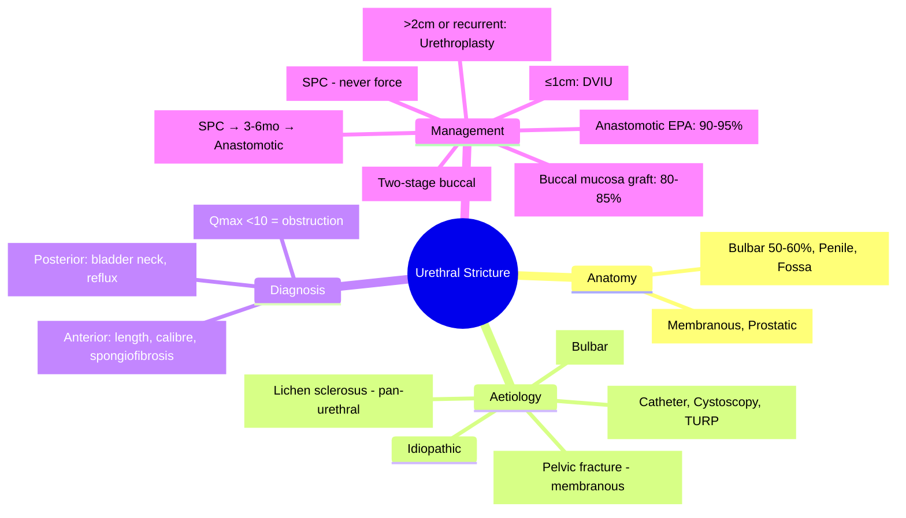

# Urethral Stricture Disease

<callout icon="🩺" color="red_bg">
**Topic:** Urethral Stricture Disease — Nephrology & Urology
**Style:** Sea Knowledge study infographic
**Audience:** FCPS / MRCP exam prep
</callout>

**Related:** [[Urinary Tract Obstruction]], [[Urinary Tract Infection (UTI, Pyelonephritis, Prostatitis, Catheter-Associated)]], [[Neurogenic Bladder]], [[Male Reproductive Tract Disorders (BPH, Prostate Cancer, Testicular Cancer)]], [[Nephrology and Urology MOC]]

> [!important]
> **Urethral stricture = fibrotic narrowing of urethral lumen. Anterior (bulbar/penile) > Posterior (membranous/prostatic). Aetiology: traumatic (iatrogenic, straddle), inflammatory (Lichen sclerosus/BXO, STI), idiopathic. Presentation: obstructive voiding symptoms, recurrent UTI, retention. Gold standard diagnosis: retrograde urethrogram (RGU) + VCUG. Management: dilation/urethrotomy (short bulbar), urethroplasty (definitive for long/recurrent).**

---

## 1. Learning Objectives
- Classify strictures by location (anterior vs posterior) and aetiology
- Recognise clinical presentation (obstructive symptoms, UTI, retention)
- Apply diagnostic imaging (RGU + VCUG = gold standard)
- Differentiate management by stricture length, location, recurrence
- Apply urethroplasty principles (anastomotic vs substitution)
- Apply to FCPS/MRCP urology vignettes

---

## 2. Anatomy & Classification

### Urethral Segments
| Segment | Location | Length | Stricture Frequency |
|---------|----------|--------|---------------------|
| **Anterior Urethra** | | | **80–90%** |
| ‑ Fossa navicularis | Glans penis | ~2cm | 10% |
| ‑ Penile (pendulous) | Penile shaft | Variable | 15% |
| ‑ **Bulbar** | Perineum (bulbospongiosus) | **~3–4cm** | **50–60% (most common)** |
| **Posterior Urethra** | | | **10–20%** |
| ‑ Membranous | Urogenital diaphragm | ~1–2cm | 10% |
| ‑ Prostatic | Through prostate | ~3–4cm | 5% |

---

## 3. Aetiology

| Category | Causes | Typical Location |
|----------|--------|------------------|
| **Traumatic (Iatrogenic)** | **Catheterisation, cystoscopy, TURP, hypospadias repair** | Bulbar, membranous |
| **Traumatic (External)** | **Straddle injury** (fall on crossbar), pelvic fracture (posterior) | Bulbar (straddle), Membranous/prostatic (pelvic fracture) |
| **Inflammatory** | **Lichen sclerosus / BXO** (Balinitis Xerotica Obliterans), Gonorrhoea, Chlamydia, TB, Schistosomiasis | Meatus (BXO), Bulbar/penile (STI) |
| **Idiopathic** | No identifiable cause | Any |
| **Radiation** | Pelvic radiotherapy (prostate, rectal, cervical) | Posterior (prostatic/membranous) |

> **Lichen sclerosus (BXO)** = white, atrophic, fibrotic meatal/preputial skin → **meatal stenosis → pan-urethral stricture**.

---

## 4. Clinical Presentation
| Symptom | Mechanism |
|---------|-----------|
| **Weak stream** | Narrowed lumen → ↑ resistance |
| **Straining to void** | Compensatory detrusor effort |
| **Intermittency / Splitting** | Turbulent flow |
| **Post-void dribbling** | Urine trapped distal to stricture |
| **Recurrent UTI** | Stasis, incomplete emptying |
| **Acute urinary retention** | Complete occlusion / decompensation |
| **Haematuria** | Trauma, instrumentation |
| **Urethral discharge** | STI-related (gonorrhoea) |
| **Perineal pain** | Bulbar stricture, abscess |

---

## 5. Diagnostic Workup

### Essential Imaging (Gold Standard)
| Study | Views | Information |
|-------|-------|-------------|
| **Retrograde Urethrogram (RGU)** | AP, oblique | **Stricture length, calibre, location, number, spongiofibrosis** |
| **Voiding Cystourethrogram (VCUG)** | AP, lateral | **Posterior urethra, bladder neck, reflux, emptying** |

> **RGU + VCUG together** = complete anterior + posterior urethral assessment.

### Adjunctive
| Test | Role |
|------|------|
| **Uroflowmetry** | Objective flow rate (Qmax <10 mL/s suggests obstruction) |
| **Post-void residual (US)** | Quantifies retention |
| **Urethroscopy** | Direct visualisation (calibre, mucosa, false passages) |
| **MRI (Pelvic)** | Complex posterior strictures, pelvic fracture urethral distraction defects |
| **Urethral ultrasound** | Spongiofibrosis depth (pre-op planning) |

---

## 6. Management Algorithm

### 1. Acute Retention
| Step | Action |
|------|--------|
| 1 | **Suprapubic catheter (SPC)** — safest, avoids false passages |
| 2 | **Urethral catheter** — only if easy passage; gentle, coudé tip |
| 3 | **Definitive planning** — RGU/VCUG once stable |

> **Never force catheter** through stricture — creates false passages, worsens fibrosis.

---

### 2. Stricture Characteristics → Treatment

| Stricture Type | Length | Location | First-Line | Definitive |
|----------------|--------|----------|------------|------------|
| **Short (≤1cm)** | ≤1cm | **Bulbar** | **Direct Vision Internal Urethrotomy (DVIU)** | Urethroplasty if recurrence |
| **Short (≤1cm)** | ≤1cm | Penile | DVIU (higher recurrence) | Urethroplasty |
| **Short (≤1cm)** | ≤1cm | Membranous | **Endoscopic dilation/incision** | Anastomotic urethroplasty |
| **Long (>2cm)** | >2cm | Any | **Urethroplasty** (not DVIU) | **Urethroplasty** |
| **Recurrent (post-DVIU)** | Any | Any | **Urethroplasty** | — |
| **Pan-urethral / Lichen sclerosus** | Long | Entire urethra | **Urethroplasty (buccal mucosa graft)** | — |
| **Pelvic fracture urethral distraction defect (PFUDD)** | >2cm | Membranous/prostatic | **Suprapubic cystostomy → Delayed anastomotic urethroplasty (3–6mo)** | — |

---

## 7. Urethroplasty Techniques

| Technique | Indication | Principle | Success Rate |
|-----------|------------|-----------|--------------|
| **Anastomotic (Excision + Primary Anastomosis - EPA)** | **Short (≤2cm) bulbar/membranous** | Excise stricture, spatulate ends, tension-free anastomosis | **90–95%** |
| **Augmented Anastomotic** | 2–3cm bulbar | Partial excision + dorsal/ventral graft | 85–90% |
| **Substitution (Graft)** | **Long (>2cm) or pan-urethral** | Incise stricture, lay graft (patch/onlay/ tubularised) | **80–85%** |
| **Two-Stage (Johanson)** | Complex, failed prior, severe spongiofibrosis, BXO | Stage 1: Urethrostomy + graft inlay; Stage 2: Tubularisation | 70–80% |

### Graft Sources
| Graft | Advantages | Disadvantages |
|-------|------------|---------------|
| **Buccal Mucosa** | **Gold standard** — thick, vascular, hairless, easy harvest | Oral morbidity (numbness, tightening) |
| **Lingual Mucosa** | Similar to buccal | Tongue morbidity |
| **Penile Skin (Flap)** | Local, reliable vascularity | Hair-bearing, contracture risk |
| **Bladder Mucosa** | No external donor site |requires laparotomy, mucus |

> **Buccal mucosa** = preferred for substitution urethroplasty.

---

## 8. Post-Operative Care
| Aspect | Protocol |
|--------|----------|
| **Catheter** | SPC + urethral stent (14–21 days for anastomotic; 3–4 weeks for graft) |
| **VCUG** | Before catheter removal (confirm no leak/stricture) |
| **Follow-up** | Uroflowmetry q3mo × 1yr, then annually |
| **Stricture recurrence** | Peak 3–12 months; DVIU if short, repeat urethroplasty if long |

---

## 9. Special Scenarios

### Pelvic Fracture Urethral Distraction Defect (PFUDD)
| Aspect | Detail |
|--------|--------|
| **Mechanism** | Type III pelvic fracture → membranous urethra distraction (prostate displaced cephalad) |
| **Acute** | **Suprapubic cystostomy ONLY** — do NOT attempt early realignment (↑ stricture rate) |
| **Definitive** | **Delayed anastomotic urethroplasty** at **3–6 months** (wait for fibrosis to mature) |
| **Approach** | Perineal ± abdominal (if prostate high) |
| **Success** | 85–90% |

### Lichen Sclerosus / BXO
| Aspect | Detail |
|--------|--------|
| **Pathology** | White, sclerotic, atrophic skin (meatus, prepuce, glans) → pan-urethral fibrosis |
| **Risk** | **Squamous cell carcinoma** (SCC) — monitor |
| **Meatal stenosis** | Meatotomy ± buccal graft |
| **Pan-urethral** | **Two-stage buccal mucosa urethroplasty** (Johanson) |
| **Circumcision** | Part of treatment (removes diseased prepuce) |

---

## 10. High-Yield FCPS/MRCP Points

> [!important]
> - **Stricture location**: **Bulbar (50–60%)** > Penile > Membranous > Prostatic.
> - **Aetiology**: Iatrogenic (catheter/cystoscopy) > Straddle > BXO > Idiopathic.
> - **Diagnosis**: **RGU + VCUG** = gold standard.
> - **Acute retention**: **Suprapubic catheter** (never force urethral).
> - **Short bulbar (≤1cm)**: DVIU first-line; longer/recurrent → **Urethroplasty**.
> - **Anastomotic (EPA)** = gold standard for short bulbar/membranous (90–95% success).
> - **Substitution (Buccal graft)** = for long (>2cm) or pan-urethral.
> - **PFUDD**: SPC acutely → **delayed anastomotic urethroplasty at 3–6mo**.
> - **BXO (Lichen sclerosus)**: Meatal stenosis → pan-urethral → **two-stage buccal urethroplasty**; SCC risk.
> - **Success rates**: EPA 90–95%, Graft 80–85%, Two-stage 70–80%.

---

## 11. Common Confusions / Exam Traps

| Trap | Correction |
|------|------------|
| **Urethral catheter for acute retention** | **SPC preferred** — forcing catheter causes false passages |
| **DVIU for all strictures** | **Only short (≤1cm) bulbar**; long/recurrent/penile → urethroplasty |
| **Penile strictures = same as bulbar** | Penile = higher DVIU recurrence; **graft urethroplasty preferred** |
| **PFUDD = immediate realignment** | **NO — SPC only**; definitive at 3–6mo |
| **Buccal graft = only option** | Also lingual, penile skin flap, bladder mucosa |
| **BXO = just meatal stenosis** | **Pan-urethral**; needs two-stage urethroplasty |
| **Urethroplasty = no recurrence** | Recurrence 10–20% (graft), 5–10% (EPA); surveillance needed |
| **Anastomotic for all** | Only short (≤2cm); long = graft/two-stage |
| **VCUG not needed if RGU done** | **Both needed** — RGU = anterior; VCUG = posterior + bladder |

---

## 12. Mnemonics
- **Stricture sites**: **B**ulbar **P**enile **M**embranous **P**rostatic = **BPMP**
- **Aetiology**: **I**atrogenic **S**traddle **B**XO **I**diopathic = **ISBI**
- **RGU + VCUG** = **Complete urethral picture**
- **Short bulbar** = **DVIU**; **Long** = **Urethroplasty**
- **PFUDD**: **S**PC → **W**ait 3–6mo → **A**nastomotic
- **BXO**: **W**hite **S**clerotic **M**eatus = **WSM**

---

## 13. Mind Map

---

## 14. 24-Hour Recall Prompts
1. Stricture location frequency (Bulbar > Penile > Membranous)
2. Aetiology (Iatrogenic, Straddle, BXO, PFUDD)
3. Gold standard diagnosis (RGU + VCUG)
4. Acute retention management (SPC)
5. Short bulbar ≤1cm = DVIU; >2cm or recurrent = Urethroplasty
6. EPA (anastomotic) for short bulbar/membranous
7. Buccal mucosa graft for long/pan-urethral
8. PFUDD: SPC → 3-6mo → Anastomotic
9. BXO: two-stage buccal urethroplasty
10. Success rates: EPA 95%, Graft 85%, Two-stage 75%

---

## 15. 7-Day / 15-Day / 30-Day Revision Tracker
| Day | Date | Recall (1-5) | Notes |
|-----|------|--------------|-------|
| 1   |      |              |       |
| 7   |      |              |       |
| 15  |      |              |       |
| 30  |      |              |       |

---

## 16. Must Know / Should Know / Nice to Know
| Priority | Content |
|----------|---------|
| **Must Know 🔴** | Bulbar most common, RGU+VCUG, SPC for retention, DVIU vs urethroplasty criteria, EPA for short, graft for long, PFUDD delayed repair, BXO two-stage |
| **Should Know 🟡** | Urethroplasty techniques (EPA, augmented, substitution, two-stage), buccal vs lingual vs penile skin, post-op surveillance, recurrence rates |
| **Nice to Know 🟢** | Tissue-engineered urethra, cell-seeded scaffolds, dorsal vs ventral onlay technique comparison, quality of life outcomes, cost-effectiveness |

---

## 17. MCQs (10)
1. **Most common site of urethral stricture:**
   A. Prostatic
   B. Membranous
   C. Penile
   D. **Bulbar**
   E. Fossa navicularis

2. **Gold standard imaging for urethral stricture:**
   A. Ultrasound
   B. **Retrograde Urethrogram (RGU) + Voiding Cystourethrogram (VCUG)**
   C. CT urogram
   D. MRI
   E. Uroflowmetry

3. **Acute urinary retention from stricture — best initial drainage:**
   A. Urethral catheter (coude tip)
   B. **Suprapubic catheter (SPC)**
   C. Intermittent catheterisation
   D. Urethral dilation
   E. Internal urethrotomy

4. **Short (≤1cm) bulbar stricture — first-line treatment:**
   A. Anastomotic urethroplasty
   B. Buccal mucosa graft
   C. **Direct Vision Internal Urethrotomy (DVIU)**
   D. Dilation
   E. Two-stage urethroplasty

5. **Anastomotic urethroplasty (EPA) — ideal indication:**
   A. Pan-urethral stricture
   B. **Short (≤2cm) bulbar or membranous**
   C. Penile stricture >2cm
   D. Lichen sclerosus
   E. Post-radiation stricture

6. **Pelvic fracture urethral distraction defect (PFUDD) — acute management:**
   A. Primary endoscopic realignment
   B. Urethral catheter
   C. **Suprapubic cystostomy**
   D. Immediate anastomotic urethroplasty
   D. DVIU

7. **PFUDD — timing of definitive repair:**
   A. Immediately
   B. 2 weeks
   C. **3–6 months (delayed)**
   D. 1 year
   E. Never (permanent SPC)

8. **Definitive treatment for long (>2cm) or recurrent bulbar stricture:**
   A. Repeat DVIU
   B. **Urethroplasty (buccal mucosa graft)**
   C. Permanent stent
   C. Dilation
   E. SPC only

9. **Lichen sclerosus (BXO) urethral stricture — preferred definitive repair:**
   A. Single-stage anastomotic
   B. DVIU
   C. **Two-stage buccal mucosa urethroplasty (Johanson)**
   D. Penile skin flap
   E. Perineal urethrostomy

10. **Success rate of anastomotic urethroplasty (EPA) for short bulbar stricture:**
    A. 50–60%
    B. 70–75%
    C. 80–85%
    D. **90–95%**
    E. 100%

---

## 18. SBA Questions (10)
1. **30-year-old man, straddle injury, unable to void. Urethrogram: 2cm bulbar stricture. Best definitive management:**
   A. DVIU
   B. **Anastomotic urethroplasty (EPA)**
   C. Buccal graft urethroplasty
   D. Urethral dilation
   E. Stent

2. **45-year-old man, TURP 2 years ago, now weak stream. RGU: 1.5cm bulbar stricture. Management:**
   A. **DVIU (short bulbar)**
   B. Anastomotic urethroplasty
   C. Buccal graft
   D. Dilation
   E. Stent

3. **25-year-old man, pelvic fracture (Type III), urethral disruption. Acute: SPC placed. When to plan definitive repair?**
   A. 2 weeks
   B. 6 weeks
   C. **3–6 months**
   D. 1 year
   E. Only if symptomatic

4. **35-year-old man, BXO (lichen sclerosus), pan-urethral stricture, meatal stenosis. Best surgical approach:**
   A. Single-stage buccal graft
   B. **Two-stage buccal mucosa urethroplasty (Johanson)**
   C. Penile skin flap (Orandi)
   D. DVIU
   E. Perineal urethrostomy only

5. **Recurrent bulbar stricture after 2 DVIUs, now 3cm. Best option:**
   A. Third DVIU
   B. **Buccal mucosa graft urethroplasty**
   C. Permanent urethral stent
   D. Dilation
   E. SPC only

6. **PFUDD patient, 4 months post-injury, ready for repair. Urethral gap 3cm on imaging. Surgical approach:**
   A. Perineal anastomotic only
   B. **Perineal ± abdominal (if prostate high) anastomotic urethroplasty**
   C. Buccal graft
   D. Two-stage
   E. Endoscopic realignment

7. **Penile stricture 2cm, no prior surgery. Best definitive treatment:**
   A. DVIU
   B. **Buccal mucosa graft urethroplasty (penile = higher DVIU recurrence)**
   C. Anastomotic urethroplasty
   D. Penoscrotal flap
   E. Two-stage

8. **Post-urethroplasty surveillance — stricture recurrence peak:**
   A. 1 month
   B. **3–12 months**
   C. 2 years
   D. 5 years
   E. 10 years

9. **Buccal mucosa graft — harvest complication:**
   A. Severe bleeding
   B. **Temporary oral numbness, tightness, salivary duct injury**
   C. Airway compromise
   D. Facial nerve palsy
   E. Mandibular fracture

10. **Anastomotic urethroplasty — maximum stricture length for tension-free repair:**
    A. 1cm
    B. **2cm**
    C. 3cm
    D. 4cm
    E. 5cm

---

## 19. Flashcards
- Q: Most common stricture site?
  A: Bulbar (50-60%)
- Q: Gold standard imaging?
  A: RGU + VCUG
- Q: Acute retention drainage?
  A: SPC (suprapubic catheter)
- Q: Short bulbar ≤1cm = ?
  A: DVIU
- Q: Short bulbar/membranous ≤2cm = ?
  A: EPA (anastomotic urethroplasty)
- Q: Long >2cm or recurrent = ?
  A: Buccal mucosa graft urethroplasty
- Q: PFUDD acute?
  A: SPC only
- Q: PFUDD definitive timing?
  A: 3-6 months delayed
- Q: BXO stricture = ?
  A: Two-stage buccal urethroplasty
- Q: EPA success rate?
  A: 90-95%
- Q: Graft success rate?
  A: 80-85%
- Q: Post-op recurrence peak?
  A: 3-12 months
- Q: Buccal graft complications?
  A: Oral numbness, tightness, salivary duct injury
- Q: Penile stricture DVIU recurrence?
  A: High (graft preferred)

---

## 20. Answer Key with Explanations

### MCQs
1. **D** — Bulbar urethra (50–60%) is the most common stricture site.
2. **B** — RGU (anterior) + VCUG (posterior) = complete urethral evaluation gold standard.
3. **B** — Forcing urethral catheter through stricture creates false passages; SPC is safest.
4. **C** — Short (≤1cm) bulbar stricture: DVIU first-line (success 50–60% at 1yr).
5. **B** — EPA (excision + primary anastomosis) for short (≤2cm) bulbar/membranous strictures.
6. **C** — PFUDD acute: SPC only. Early realignment increases stricture rate.
7. **C** — PFUDD definitive: delayed anastomotic urethroplasty at 3–6 months (fibrosis matured).
8. **B** — Long (>2cm) or recurrent: substitution urethroplasty with buccal mucosa graft.
9. **C** — BXO/lichen sclerosus: pan-urethral fibrosis → two-stage buccal (Johanson).
10. **D** — EPA success 90–95% for short bulbar strictures.

### SBAs
1. **B** — Straddle injury, 2cm bulbar gap = EPA (anastomotic) ideal (short, bulbar).
2. **A** — Post-TURP 1.5cm bulbar = DVIU appropriate (short, <2cm, first recurrence).
3. **C** — PFUDD definitive at 3–6 months (fibrosis matured, prostate descended).
4. **B** — BXO pan-urethral = two-stage buccal (Johanson) standard.
5. **B** — Recurrent after 2 DVIUs, 3cm = graft urethroplasty (buccal mucosa).
6. **B** — PFUDD 3cm gap: perineal approach ± abdominal if prostate high; anastomotic.
7. **B** — Penile strictures have high DVIU recurrence; graft urethroplasty preferred.
8. **B** — Stricture recurrence peaks at 3–12 months post-urethroplasty.
9. **B** — Buccal harvest: temporary oral numbness, tightness, salivary duct injury risk.
10. **B** — EPA maximum tension-free length ~2cm (bulbar mobilisation limited).

---

## 21. Summary
**Urethral Stricture Disease** is a **Must Know 🔴** urology topic.  
**Epidemiology**: **Bulbar (50–60%)** most common; aetiology: iatrogenic > straddle > BXO > idiopathic.  
**Diagnosis**: **RGU + VCUG** = gold standard; uroflowmetry for functional assessment.  
**Acute Management**: **Suprapubic catheter (SPC)** — never force urethral catheter.  
**Definitive Treatment by Stricture**:  
- **Short (≤1cm) bulbar** → **DVIU** (first-line)  
- **Short (≤2cm) bulbar/membranous** → **Anastomotic Urethroplasty (EPA)** — 90–95% success  
- **Long (>2cm) / Recurrent / Penile** → **Buccal Mucosa Graft Urethroplasty** — 80–85% success  
- **Pan-urethral / BXO (Lichen sclerosus)** → **Two-Stage Buccal (Johanson)**  
- **PFUDD** → **SPC acutely → Delayed Anastomotic Urethroplasty at 3–6mo**  
**Post-op**: VCUG before catheter removal; surveillance uroflowmetry q3mo (recurrence peaks 3–12mo).  
**Exam focus**: Bulbar most common, RGU+VCUG, SPC for retention, DVIU vs EPA vs Graft criteria, PFUDD delayed repair, BXO two-stage, success rates.