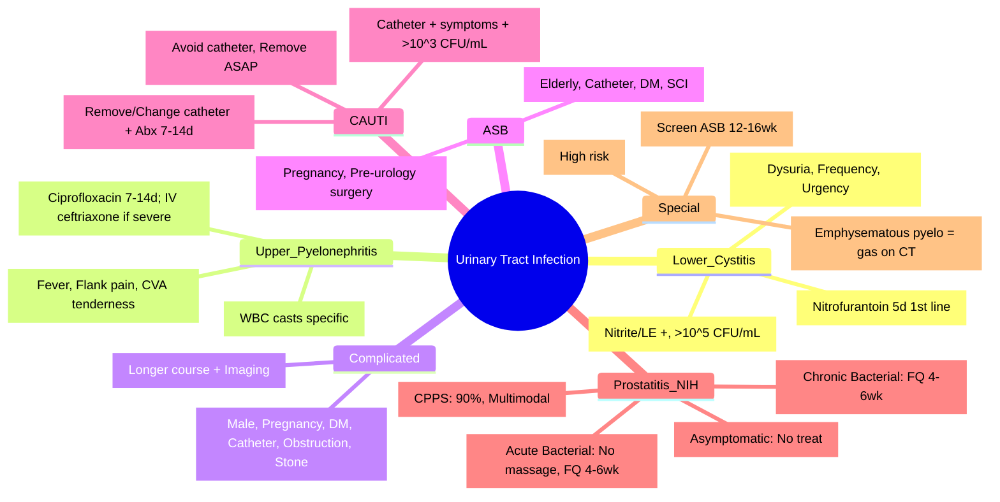

# Urinary Tract Infection (UTI, Pyelonephritis, Prostatitis, Catheter-Associated)

<callout icon="🩺" color="red_bg">
**Topic:** Urinary Tract Infection (UTI, Pyelonephritis, Prostatitis, Catheter-Associated) — Nephrology & Urology
**Style:** Sea Knowledge study infographic
**Audience:** FCPS / MRCP exam prep
</callout>

**Related:** [[Investigation of Renal and Urinary Tract Disease]], [[Acute Kidney Injury (AKI)]], [[Urinary Tract Obstruction]], [[Urolithiasis (Renal Stones)]], [[Male Reproductive Tract Disorders (BPH, Prostate Cancer, Testicular Cancer)]], [[Nephrology and Urology MOC]]

> [!important]
> **UTI = significant bacteriuria (>10⁵ CFU/mL) + symptoms. Lower UTI (cystitis): dysuria, frequency, urgency. Upper UTI (pyelonephritis): fever, flank pain, CVA tenderness, systemic signs. Complicated UTI = structural abnormality, catheter, male, pregnancy, DM, immunocompromised. Prostatitis: NIH I-IV. CAUTI: most common HAI.**

---

## 1. Learning Objectives
- Classify UTI by syndrome (lower/upper/complicated) and patient group
- Diagnose and manage cystitis, pyelonephritis, prostatitis, CAUTI
- Apply antibiotic stewardship principles
- Manage recurrent UTIs and special populations
- Apply to FCPS/MRCP clinical scenarios

---

## 2. Lower UTI (Cystitis)

### Definition & Diagnosis
| Criteria | Detail |
|----------|--------|
| **Clinical** | Dysuria, frequency, urgency, suprapubic pain, no fever |
| **Urine Dipstick** | Nitrite +, Leucocyte esterase + (sensitivity ~75%, specificity ~85%) |
| **Microscopy** | >10 WBC/HPF (or >10⁶/L) |
| **Culture** | **>10⁵ CFU/mL** single organism (gold standard); in symptomatic women >10³ CFU/mL acceptable |

### Aetiology
| Organism | % |
|----------|---|
| **E. coli** | 75–90% |
| **S. saprophyticus** | 5–15% (young women) |
| **Klebsiella, Proteus, Enterococcus** | 5–10% |

### Treatment (Uncomplicated Cystitis)
| Agent | Dose/Duration |
|-------|---------------|
| **Nitrofurantoin** | 100mg BD × 5 days (1st line) |
| **Trimethoprim** | 200mg BD × 3 days |
| **Fosfomycin** | 3g single dose |
| **Pivmecillinam** | 400mg TDS × 3 days |

> [!key]
> **Avoid fluoroquinolones 1st line** (resistance, side effects). **Nitrofurantoin contraindicated if eGFR <30.**

---

## 3. Upper UTI (Acute Pyelonephritis)

### Definition & Diagnosis
| Criteria | Detail |
|----------|--------|
| **Clinical** | **Fever (≥38°C), flank pain, CVA tenderness**, nausea/vomiting, ± cystitis symptoms |
| **Systemic** | Tachycardia, hypotension (sepsis), rigors |
| **Urine** | Pyuria, bacteriuria, WBC casts (specific) |
| **Blood** | ↑ CRP, ↑ WCC, ↑ neutrophils; Blood cultures if septic |
| **Imaging** | US/CT if no improvement 48–72h, or complicated (stones, obstruction, abscess) |

### Aetiology
| Organism | % |
|----------|---|
| **E. coli** | 80% |
| **Klebsiella, Proteus, Enterobacter** | 10–15% |
| **Enterococcus** | 5% |

### Treatment
| Severity | Regimen |
|----------|---------|
| **Mild-Moderate (Oral)** | **Ciprofloxacin 500mg BD × 7–14 days** OR **Co-amoxiclav 625mg TDS × 7–14 days** OR **Trimethoprim 200mg BD × 14 days** |
| **Severe (IV)** | **Ceftriaxone 2g OD** OR **Cefuroxime 1.5g TDS** OR **Piperacillin-tazobactam 4.5g QDS** ± **Gentamicin** (if resistant) |
| **Duration** | **7–14 days** (14 days if male, complicated, bacteraemia) |
| **Switch** | IV → oral at 48h if improving |

> [!key]
> **WBC casts = specific for pyelonephritis.** **Treat empirically, adjust by culture.** **Image if no improvement 48–72h.**

---

## 4. Complicated UTI

| Definition | Examples |
|------------|----------|
| **Structural/Functional Abnormality** | Stones, obstruction, reflux, neurogenic bladder, stent, transplant |
| **Host Factors** | **Male**, pregnancy, diabetes, immunocompromised, elderly, catheter |
| **Recurrent** | ≥3/year or ≥2/6 months |

### Management
- **Longer course** (14 days)
- **Image** (US/CT) to exclude obstruction/abscess/stone
- **Treat underlying cause** (remove stone, relieve obstruction, change catheter)

---

## 5. Recurrent UTI (≥3/year or ≥2/6 months)

| Approach | Detail |
|----------|--------|
| **Confirm** | Culture each episode; exclude reinfection vs relapse |
| **Non-antibiotic** | Hydration, voiding post-coitus, vaginal oestrogen (post-menopausal), cranberry (weak evidence), D-mannose, probiotics |
| **Prophylaxis** | **Nitrofurantoin 50mg nocte** OR **Trimethoprim 100mg nocte** × 6 months; **post-coital single dose** if coitus-related |
| **Refer** | If structural abnormality suspected |

---

## 6. Asymptomatic Bacteriuria (ASB)

| Population | Treat? |
|------------|--------|
| **Pregnant women** | **YES** (screen at 12–16 weeks; treat → ↓ pyelonephritis, preterm birth) |
| **Pre-urological surgery** | **YES** (if mucosal bleeding expected) |
| **Renal transplant** | **Controversial** (some treat early post-Tx) |
| **All others** | **NO** (elderly, catheter, diabetes, spinal cord injury) — **does not improve outcomes, ↑ resistance** |

---

## 7. Catheter-Associated UTI (CAUTI)

| Criteria | Detail |
|----------|--------|
| **Definition** | Patient with catheter + symptoms (fever, flank pain, suprapubic pain, delirium) + >10³ CFU/mL |
| **Commonest HAI** | ~20–30% of HAI; duration of catheterisation = main risk factor |
| **Organisms** | E. coli, Klebsiella, Proteus, Enterococcus, Pseudomonas, Candida, **multi-drug resistant** |
| **Biofilm** | Catheter surface = biofilm → resistant to antibiotics |

### Management
| Step | Action |
|------|--------|
| **1. Remove/Change Catheter** | **Essential** — remove if possible; change if ongoing need |
| **2. Culture** | Urine from **new catheter** (not bag) |
| **3. Antibiotics** | 7 days (if catheter removed); 10–14 days (if catheter remains); cover Pseudomonas/Enterococcus if healthcare-associated |
| **4. Prevention** | **Avoid unnecessary catheterisation; remove ASAP; closed system; aseptic insertion; maintain unobstructed flow** |

---

## 8. Prostatitis (NIH Classification)

| Category | Name | Features | Treatment |
|----------|------|----------|-----------|
| **I** | **Acute Bacterial** | Fever, chills, perineal pain, dysuria, **tender prostate** (DO NOT massage — bacteraemia risk), ↑ PSA | **IV/PO fluoroquinolone (ciprofloxacin 500mg BD) or TMP-SMX × 4–6 weeks** |
| **II** | **Chronic Bacterial** | Recurrent UTIs, same organism, perineal pain, ± LUTS; expressed prostatic secretions (EPS) culture + | **Fluoroquinolone × 4–6 weeks** (penetrates prostate); alpha-blocker for LUTS |
| **III** | **Chronic Pelvic Pain Syndrome (CPPS)** | **90–95% of prostatitis**; pelvic pain ≥3mo, no infection; EPS negative; UPOINT classification | **Multimodal**: alpha-blocker, anti-inflammatory, physiotherapy, neuromodulators (amitriptyline, gabapentin), stress management |
| **IV** | **Asymptomatic Inflammatory** | Incidental (WBC in semen/EPS, ↑ PSA); no symptoms | **No treatment** |

> [!key]
> **Acute prostatitis: DO NOT massage prostate (sepsis risk).** **Chronic bacterial: fluoroquinolone 4–6 weeks (prostate penetration).** **CPPS = commonest, multimodal.**

---

## 9. Special Populations

| Population | Key Points |
|------------|------------|
| **Pregnancy** | Screen ASB at 12–16wk; treat cystitis (nitrofurantoin safe 2nd/3rd trimester, avoid 1st); pyelonephritis = IV cephalosporin/gentamicin (avoid fluoroquinolone, TMP-SMX) |
| **Diabetes** | Higher risk, atypical presentation, emphysematous pyelonephritis (gas in renal parenchyma — CT diagnosis, emergency nephrectomy) |
| **Renal Transplant** | High risk (immunosuppression, stent, reflux); treat ASB early post-Tx; flavours |
| **Spinal Cord Injury** | Neurogenic bladder, catheter, atypical presentation (autonomic dysreflexia); treat symptomatic only |

---

## 10. Antibiotic Stewardship

| Principle | Application |
|-----------|-------------|
| **Empiric → Targeted** | Narrow spectrum once culture known |
| **Duration** | Shortest effective (3d cystitis, 7d pyelonephritis if uncomplicated) |
| **Avoid Fluoroquinolones 1st Line** | Reserve for resistant/complicated |
| **Local Resistance** | Follow local antibiogram |

---

## 11. High-Yield FCPS/MRCP Points

> [!important]
> - **Cystitis: dysuria, frequency, urgency, no fever; Nitrofurantoin 5d 1st line**
> - **Pyelonephritis: fever + flank pain + CVA tenderness; WBC casts specific; Ciprofloxacin 7–14d**
> - **Complicated UTI: male, pregnancy, DM, catheter, obstruction, stone → longer course + imaging**
> - **ASB: treat ONLY in pregnancy + pre-urological surgery**
> - **CAUTI: remove/change catheter essential; 7–14d antibiotics; prevention = avoid catheter**
> - **Prostatitis NIH: I=acute bacterial (no massage), II=chronic bacterial (fluoroquinolone 4–6wk), III=CPPS (90%, multimodal), IV=asymptomatic (no treat)**
> - **Pregnancy: screen ASB 12–16wk; nitrofurantoin safe 2nd/3rd tri; avoid fluoroquinolone/TMP-SMX**
> - **Diabetes: emphysematous pyelonephritis = gas on CT = emergency nephrectomy**
> - **Recurrent UTI: prophylaxis nitrofurantoin 50mg nocte × 6mo or post-coital**

---

## 12. Common Confusions / Exam Traps

| Trap | Correction |
|------|------------|
| **All UTI need 7–14 days** | Uncomplicated cystitis = 3–5 days |
| **Fluoroquinolone 1st line for cystitis** | **Avoid** (resistance, tendinitis, aortopathy); nitrofurantoin 1st line |
| **ASB treat in elderly/catheter/diabetes** | **NO** — only pregnancy + pre-urological surgery |
| **Prostate massage in acute prostatitis** | **CONTRAINDICATED** (bacteraemia/sepsis) |
| **CPPS = bacterial** | **CPPS = non-bacterial (90–95%)**; no antibiotics |
| **CAUTI = treat without removing catheter** | **Must remove/change catheter** |
| **Nitrofurantoin in CKD** | **Contraindicated eGFR <30** (pulmonary toxicity, neuropathy) |
| **All prostatitis = antibiotics** | Only I & II; III = multimodal, IV = no treat |
| **Pyelonephritis = always admit** | Mild-moderate = oral outpatient; severe = IV admission |
| **Recurrent UTI = always prophylaxis** | Non-antibiotic measures first (vaginal oestrogen, D-mannose, post-coital voiding) |

---

## 13. Mnemonics

- **UTI Types**: **L**ower (cystitis), **U**pper (pyelo), **C**omplicated, **C**AUTI, **A**SB, **P**rostatitis = **LUC-CAP**
- **Cystitis 1st Line**: **N**itro**F**urantoin **5**d = **NF5**
- **Pyelonephritis**: **F**ever, **F**lank pain, **C**VA tenderness = **FFC**
- **WBC Casts**: **W**BC casts = **P**yelonephritis = **WP**
- **ASB Treat**: **P**regnancy, **P**re-op (urology) = **PP**
- **CAUTI**: **R**emove catheter, **C**ulture, **A**bx = **RCA**
- **Prostatitis NIH**: **I**=Acute, **II**=Chronic Bacterial, **III**=CPPS (commonest), **IV**=Asymptomatic = **1234**
- **Acute Prostatitis**: **N**o **M**assage = **NM** (sepsis)
- **Chronic Bacterial**: **F**luoroquinolone **4–6 weeks** = **F46**
- **Emphysematous Pyelo**: **G**as on **CT** = **GC** (emergency nephrectomy)

---

## 14. Mind Map

---

## 15. 24-Hour Recall Prompts
1. Cystitis: dysuria/frequency/urgency; nitrofurantoin 5d 1st line
2. Pyelonephritis: fever + flank pain + CVA tenderness; WBC casts specific
3. Complicated UTI: male, pregnancy, DM, catheter, obstruction
4. ASB treat: ONLY pregnancy + pre-urology surgery
5. CAUTI: remove/change catheter essential; 7–14d antibiotics
6. Prostatitis NIH I: acute bacterial, NO massage, FQ 4–6wk
7. Prostatitis NIH III: CPPS (90%), multimodal, no antibiotics
8. Pregnancy: screen ASB 12–16wk; nitrofurantoin safe 2nd/3rd tri
9. Diabetes: emphysematous pyelonephritis = gas on CT = emergency
10. Recurrent UTI: non-antibiotic first; prophylaxis nitrofurantoin 50mg nocte

---

## 16. 7-Day / 15-Day / 30-Day Revision Tracker

| Day | Date | Recall (1-5) | Notes |
|-----|------|--------------|-------|
| 1   |      |              |       |
| 7   |      |              |       |
| 15  |      |              |       |
| 30  |      |              |       |

---

## 17. Must Know / Should Know / Nice to Know

| Priority | Content |
|----------|---------|
| **Must Know 🔴** | Cystitis/pyelonephritis diagnosis & treatment, complicated UTI definition, ASB treatment indications, CAUTI catheter removal, prostatitis NIH classification, pregnancy UTI, emphysematous pyelonephritis |
| **Should Know 🟡** | Recurrent UTI management (non-antibiotic, prophylaxis), special populations (transplant, SCI), antibiotic stewardship, local resistance patterns |
| **Nice to Know 🟢** | Novel prevention (vaccines, probiotics), microbiome, cost-effectiveness, long-term outcomes, emerging resistance |

---

## 18. MCQs (10)

1. **First-line treatment for uncomplicated cystitis in women:**
   A. Ciprofloxacin 3 days
   B. **Nitrofurantoin 100mg BD × 5 days**
   C. Trimethoprim 200mg BD × 3 days
   D. Fosfomycin 3g single dose
   E. Amoxicillin 500mg TDS × 7 days

2. **Specific urinary finding for pyelonephritis:**
   A. Nitrite positive
   B. Leucocyte esterase positive
   C. **WBC casts**
   D. Haematuria
   E. Proteinuria

3. **Asymptomatic bacteriuria — treatment indicated in:**
   A. Elderly nursing home residents
   B. Diabetic patients
   C. Long-term catheter patients
   D. **Pregnant women (screen 12–16 weeks)**
   E. Spinal cord injury patients

4. **CAUTI — essential first step:**
   A. Start broad-spectrum antibiotics
   B. **Remove or change catheter**
   C. Bladder irrigation
   C. Increase catheter size
   E. Suprapubic catheter

5. **Acute bacterial prostatitis (NIH I) — contraindicated:**
   A. Fluoroquinolone
   B. **Prostate massage**
   C. Alpha-blocker
   D. NSAIDs
   E. Hospital admission

6. **Chronic pelvic pain syndrome (NIH III) — proportion of prostatitis:**
   A. 10–15%
   B. 30–40%
   C. **90–95%**
   D. 50–60%
   E. <5%

7. **Pregnancy UTI — antibiotic safe in 2nd/3rd trimester:**
   A. Ciprofloxacin
   B. Trimethoprim
   C. **Nitrofurantoin (avoid 1st trimester, near term)**
   D. Doxycycline
   E. Fosfomycin

8. **Emphysematous pyelonephritis — diagnosis:**
   A. US shows gas
   B. **CT shows gas in renal parenchyma**
   C. Plain X-ray shows gas
   D. MRI shows gas
   E. Urine culture shows gas-producing organisms

9. **Recurrent UTI definition:**
   A. ≥2 episodes/year
   B. **≥3 episodes/year OR ≥2/6 months**
   C. ≥1 episode/month
   D. ≥4 episodes/year
   E. Any recurrence

10. **Nitrofurantoin contraindicated if:**
    A. eGFR <60
    B. **eGFR <30**
    C. eGFR <45
    D. eGFR <15
    E. No renal contraindication

---

## 19. SBA Questions (10)

1. **25-year-old woman, dysuria, frequency, urgency 2 days, afebrile, no flank pain. Dipstick: nitrite+, LE+. Best treatment:**
   A. Ciprofloxacin 500mg BD × 3 days
   B. **Nitrofurantoin 100mg BD × 5 days**
   C. Trimethoprim 200mg BD × 3 days
   D. Fosfomycin 3g single dose
   E. Amoxicillin 500mg TDS × 7 days

2. **65-year-old man, fever 39°C, left flank pain, CVA tenderness, nausea. Urine: WBC casts+, >10^5 E. coli. Severity: mild-moderate. Treatment:**
   A. Nitrofurantoin 5 days
   B. **Ciprofloxacin 500mg BD × 7–14 days**
   C. Trimethoprim 200mg BD × 3 days
   D. IV ceftriaxone × 14 days
   E. Fosfomycin single dose

3. **70-year-old woman with long-term catheter, fever, delirium. Urine from catheter bag: >10^5 Klebsiella. Management:**
   A. Antibiotics only
   B. **Change catheter + send urine from NEW catheter + antibiotics 7–14 days**
   C. Remove catheter permanently
   D. Bladder irrigation with antiseptic
   D. Increase fluid intake only

4. **30-year-old pregnant woman at 14 weeks, routine screen: >10^5 Group B Strep, asymptomatic. Management:**
   A. No treatment
   B. **Treat with appropriate antibiotics (penicillin/amoxicillin)**
   C. Treat only if symptomatic
   D. Intrapartum antibiotics only
   E. Re-screen at 28 weeks

5. **40-year-old man, perineal pain 4 months, negative cultures, tender prostate on DRE. NIH category:**
   A. I
   B. II
   C. **III (CPPS)**
   D. IV
   E. Not prostatitis

6. **Diabetic patient, fever, flank pain, crepitus on flank palpation. CT: gas in renal parenchyma. Diagnosis:**
   A. Complicated pyelonephritis
   B. **Emphysematous pyelonephritis**
   C. Renal abscess
   D. Perinephric abscess
   E. Xanthogranulomatous pyelonephritis

7. **CAUTI prevention — most effective measure:**
   A. Antibiotic prophylaxis
   B. **Avoid unnecessary catheterisation; remove ASAP**
   C. Silver-coated catheters
   D. Bladder irrigation
   E. Cranberry juice

8. **Chronic bacterial prostatitis (NIH II) — antibiotic choice & duration:**
   A. Nitrofurantoin 5 days
   B. **Fluoroquinolone (ciprofloxacin) 4–6 weeks**
   C. Trimethoprim 14 days
   D. Doxycycline 6 weeks
   E. Amoxicillin 4 weeks

9. **Asymptomatic bacteriuria in 80-year-old nursing home resident with catheter. Management:**
   A. Treat with nitrofurantoin
   B. **No treatment (except pregnancy/pre-urology surgery)**
   C. Treat with ciprofloxacin
   D. Change catheter and treat
   E. Remove catheter and treat

10. **Post-coital recurrent UTI prophylaxis:**
    A. Nitrofurantoin 100mg daily
    B. **Single dose nitrofurantoin/trimethoprim post-coitus**
    C. Daily cranberry
    D. Vaginal oestrogen only
    E. No prophylaxis needed

---

## 20. Flashcards

- Q: Cystitis 1st line?
  A: Nitrofurantoin 100mg BD × 5d

- Q: Pyelonephritis specific sign?
  A: WBC casts

- Q: Pyelonephritis oral Tx?
  A: Ciprofloxacin 500mg BD × 7–14d

- Q: ASB treat?
  A: Pregnancy (screen 12–16wk) + pre-urology surgery

- Q: CAUTI 1st step?
  A: Remove/change catheter

- Q: Acute prostatitis NIH I?
  A: NO massage, FQ 4–6wk

- Q: Chronic bacterial prostatitis NIH II?
  A: FQ 4–6wk

- Q: CPPS NIH III?
  A: 90–95%, multimodal, no antibiotics

- Q: Pregnancy UTI safe?
  A: Nitrofurantoin 2nd/3rd trimester

- Q: Emphysematous pyelo?
  A: Gas on CT = emergency nephrectomy

- Q: Recurrent UTI def?
  A: ≥3/year or ≥2/6mo

- Q: Recurrent UTI prophylaxis?
  A: Nitrofurantoin 50mg nocte or post-coital single dose

- Q: Nitrofurantoin contraindicated?
  A: eGFR <30

- Q: Fluoroquinolone 1st line cystitis?
  A: NO (avoid)

- Q: Prostate massage acute prostatitis?
  A: CONTRAINDICATED (sepsis risk)

---

## 21. Answer Key with Explanations

### MCQs
1. **B** — Nitrofurantoin 5d = 1st line uncomplicated cystitis
2. **C** — WBC casts = specific for pyelonephritis
3. **D** — ASB treat only in pregnancy + pre-urology surgery
4. **B** — CAUTI: remove/change catheter essential
5. **B** — Acute prostatitis: prostate massage contraindicated
6. **C** — CPPS = 90–95% of prostatitis
7. **C** — Nitrofurantoin safe 2nd/3rd trimester
8. **B** — Emphysematous pyelo = gas on CT
9. **B** — Recurrent UTI = ≥3/year or ≥2/6mo
10. **B** — Nitrofurantoin contraindicated eGFR <30

### SBAs
1. **B** — Uncomplicated cystitis = nitrofurantoin 5d
2. **B** — Mild-moderate pyelo = ciprofloxacin 7–14d
3. **B** — CAUTI = change catheter + culture new + abx 7–14d
4. **B** — Pregnancy ASB = treat (penicillin/amoxicillin for GBS)
5. **C** — Chronic pelvic pain ≥3mo + negative cultures = CPPS (NIH III)
6. **B** — Gas in renal parenchyma on CT = emphysematous pyelonephritis
7. **B** — CAUTI prevention = avoid catheter, remove ASAP
8. **B** — Chronic bacterial prostatitis = FQ 4–6 weeks (prostate penetration)
9. **B** — ASB in elderly/catheter = NO treatment
10. **B** — Post-coital prophylaxis = single dose post-coitus

---

## 22. Summary

**Urinary Tract Infection** is a **Must Know 🔴** topic.
**Key takeaway:** **Cystitis**: dysuria/frequency/urgency, no fever; **nitrofurantoin 5d 1st line**. **Pyelonephritis**: fever + flank pain + CVA tenderness; **WBC casts specific**; ciprofloxacin 7–14d. **Complicated UTI**: male, pregnancy, DM, catheter, obstruction → longer course + imaging. **ASB**: treat ONLY pregnancy (screen 12–16wk) + pre-urology surgery. **CAUTI**: **remove/change catheter essential**; 7–14d antibiotics; prevention = avoid catheter. **Prostatitis NIH**: I=acute bacterial (NO massage, FQ 4–6wk), II=chronic bacterial (FQ 4–6wk), III=CPPS (90%, multimodal), IV=asymptomatic (no treat). **Pregnancy**: screen ASB; nitrofurantoin safe 2nd/3rd tri. **Diabetes**: emphysematous pyelo = gas on CT = emergency. **Recurrent UTI**: non-antibiotic first; prophylaxis nitrofurantoin 50mg nocte/post-coital.
**Exam focus:** Cystitis vs pyelonephritis, nitrofurantoin vs fluoroquinolone, ASB indications, CAUTI catheter removal, prostatitis classification, pregnancy UTI, emphysematous pyelo, recurrent UTI prophylaxis.
**Clinical relevance:** Antibiotic stewardship critical; nitrofurantoin 1st line preserves fluoroquinolones; CAUTI prevention reduces HAI burden.