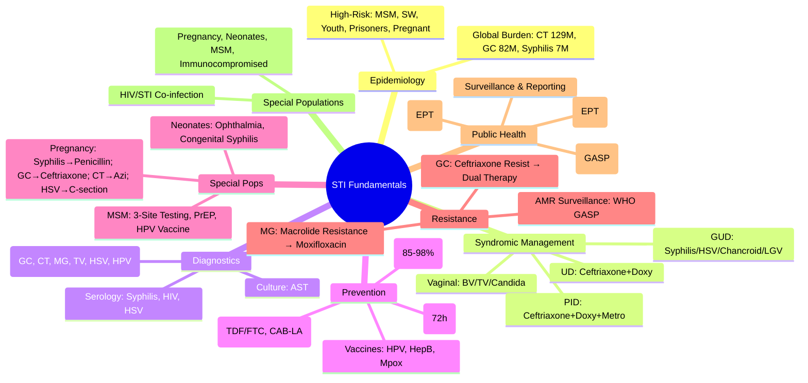

**Parent Topic:** [STI MOC](../Sexually%20Transmitted%20Infections%20MOC.md) → [STI Hierarchy](../Davidson%20Chapter%2013%20-%20STI%20Hierarchy.md)  
**Status:** `full-fcps-mrcp-note`  
**Priority:** ⭐⭐⭐ HIGHEST (FCPS/MRCP — Core knowledge, epidemiology, diagnosis, prevention)  
**Source:** Davidson 24th Ed Ch 13; WHO STI Guidelines; CDC/BASHH; FCPS/MRCP Syllabus

---

## 1. 🎯 Learning Objectives
- [ ] Understand **global & regional STI epidemiology** and **high-risk populations**
- [ ] Apply **syndromic management** (WHO algorithms for urethral/vaginal discharge, GUD, PID)
- [ ] Perform **sexual history taking** and **physical examination** for STIs
- [ ] Select appropriate **diagnostic tests** (NAAT, culture, serology, microscopy, POC)
- [ ] Implement **prevention strategies** (condoms, vaccination, PrEP, PEP, partner notification)
- [ ] Manage **special populations** (pregnancy, neonates, immunocompromised, MSM)
- [ ] Answer viva: "STI epidemiology" and "Syndromic management flow" and "Partner notification"

---

## 2. 🧠 Core Concept: STI Public Health Framework

```mermaid
flowchart TD
    A[STI Control] --> B[Prevention]
    B --> B1[Condoms]
    B --> B2[Vaccination (HPV, HepB, Mpox)]
    B --> B3[PrEP/PEP for HIV]
    B --> B4[Education/Behaviour Change]
    A --> C[Case Detection]
    C --> C1[Syndromic Management]
    C --> C2[Screening (High-Risk)]
    C --> C3[Diagnostic Tests (NAAT, Culture, Serology)]
    A --> D[Treatment & Cure]
    D --> D1[Antimicrobials (Guidelines)]
    D --> D2[Resistance Management]
    D --> D3[Test of Cure]
    A --> E[Partner Notification]
    E --> E1[EPT / Provider Referral]
    E --> E2[Contact Tracing]
    A --> F[Surveillance & AMR Monitoring]
```

---

## 1️⃣ STI Epidemiology & Public Health Impact

### Global Burden (WHO 2023 Estimates)
| STI | Annual New Cases (Global) | Key Populations |
|-----|---------------------------|-----------------|
| **Chlamydia (CT)** | **129 Million** | Adolescents, Young Adults (15-24y) |
| **Gonorrhoea (GC)** | **82 Million** | MSM, Young Adults, Sex Workers |
| **Syphilis** | **7.1 Million** | MSM, Pregnant Women, Prisoners |
| **Trichomoniasis** | **156 Million** | Women (Symptomatic), Men (Asymptomatic) |
| **HSV-2** | **491 Million** (HSV-2 Seroprevalence) | General Population, HSV-1 Rising Genital |
| **HPV** | **290 Million Women** (Cervical HPV) | Women (Cervical Cancer Risk) |
| **HSV-2** | 491M (13% aged 15-49) | Women > Men, HSV-1 Increasing Genital |
| **HPV** | 290M Women (Cervical HPV) | Cervical Cancer (340k Deaths/yr) |
| **Hepatitis B** | 296M Chronic (Global) | Vertical Transmission, IDU, Sexual |
| **Hepatitis C** | 58M Chronic | IDU, Unsafe Medical, Sexual |
| **HIV** | 39M PLHIV (1.3M New 2022) | Key Pops (MSM, SW, PWID, Transgender) |

### High-Risk Populations (Targeted Screening)
| Population | Key Risks | Recommended Screening |
|------------|-----------|----------------------|
| **MSM** | HIV, Syphilis, GC, CT, LGV, HPV, Mpox | **Annual**: HIV, Syphilis, GC/CT (Urethral/Pharyngeal/Rectal) |
| **Sex Workers** | All STIs, HIV, Violence | **Quarterly**: HIV, Syphilis, GC/CT; **Bi-annual**: HBV/HCV |
| **Adolescents/Young Adults (15-24y)** | High STI Incidence, Asymptomatic | **Annual**: GC/CT (Urine/Swab); HPV Vaccine |
| **Pregnant Women** | Vertical Transmission Risk | **Booking**: HIV, Syphilis, HBV, HCV, (GC/CT if Risk) |
| **Prisoners** | High Prevalence (HCV, HIV, STIs) | **Entry Screening**: HIV, Syphilis, HBV, HCV, STIs |
| **Transgender/Non-Binary** | High HIV/STI Burden, Barriers to Care | Gender-Affirming Care + STI Screening |
| **People Who Inject Drugs (PWID)** | HIV, HBV, HCV, STIs | **Annual**: HIV, HBV, HCV, STIs; Harm Reduction |

---

## 2️⃣ Clinical Assessment — Sexual History & Examination

### Sexual History (CD4 — Comprehensive)
| Domain | Key Questions |
|--------|---------------|
| **P**artners | Number, Gender(s), New/Concurrent, Anonymous, Overseas, Sex Work |
| **P**ractices | Vaginal, Anal, Oral, Sex Toys, Fisting, Group Sex, Chemsex |
| **P**rotection | Condom Use (Consistent/Correct), PrEP, PEP, Vaccination |
| **P**ast STIs | Previous STIs, HIV, Partner Notification, Treatment History |

> **Tips**: Non-judgmental, Open-ended, Normalize, Confidentiality, Use Patient's Language

### Physical Examination
| Site | Key Findings |
|------|--------------|
| **Genital** | Ulcers (Painful vs Painless), Warts, Discharge, Erythema, Oedema |
| **Inguinal** | Lymphadenopathy (Inguinal, Femoral), Buboes (Suppurative/Non-suppurative) |
| **Pharyngeal** | Exudate, Erythema, Ulcers, Tonsillar Exudate |
| **Rectal** | Discharge, Ulcers, Warts, Proctitis Signs (Mucus, Blood, Tenesmus) |
| **Oral** | Ulcers, Vesicles, Exudate, Pharyngitis |
| **Skin** | Rash (Syphilitic, HIV, Drug Eruption), Molluscum, Molluscum Contagiosum |

---

## 3️⃣ Syndromic Management (WHO Flowcharts)

### Approach: "Treat for the Syndrome, Investigate for the Cause"

| Syndrome | Key Pathogens | First-Line Empiric Treatment | Key Investigations |
|--------|---------------|------------------------------|-------------------|
| **Urethral Discharge (Male)** | **GC, CT**, MG, TV, HSV | **Ceftriaxone 500mg IM Stat + Doxycycline 100mg BD × 7d** | NAAT GC/CT, Gram Stain (GC: Gram -ve Diplococci) |
| **Vaginal Discharge (Female)** | **BV, TV, Candida**, GC, CT | **BV**: Metronidazole 400mg BD × 7d; **TV**: Metronidazole 2g Stat; **Candida**: Fluconazole 150mg Stat; **GC/CT**: Ceftriaxone + Doxy (as Male) | Wet Mount (Whiff, Clue Cells, Trichomonads), NAAT GC/CT, pH, Whiff Test |
| **Genital Ulcer Disease (GUD)** | **Syphilis, HSV, Chancroid, LGV, Donovanosis** | **Syphilis**: Benzathine Penicillin G 2.4MU IM; **HSV**: Acyclovir 400mg TDS × 7-10d; **Chancroid**: Azithro 1g Stat / Ceftriaxone 250mg IM | Dark Field (Syphilis), HSV PCR, Chancroid Culture, Syphilis Serology |
| **Pelvic Inflammatory Disease (PID)** | **GC, CT, Anaerobes, M. genitalium** | **Ceftriaxone 500mg IM + Doxy 100mg BD × 14d + Metro 400mg BD × 14d** | Transvaginal US, NAAT GC/CT/MG, CRP, Laparoscopy (Severe) |
| **Epididymo-orchitis** | **GC, CT, Enteric (Older Men)** | **Ceftriaxone 500mg IM + Doxy 100mg BD × 10-14d** (Enteric: Ciprofloxacin/Ofloxacin) | NAAT GC/CT, Urine Culture, Scrotal US |
| **Genital Ulcer Disease (GUD)** | **Syphilis, HSV, Chancroid, LGV, Donovanosis** | Empiric: Benzathine Penicillin G 2.4MU IM + Acyclovir 400mg TDS × 7d + Azithro 1g Stat | Syphilis Serology, HSV PCR, Chancroid Culture, HIV Test |
| **Proctitis / Proctocolitis** | **GC, CT, LGV, HSV, Syphilis, Mpox, Shigella** | **Ceftriaxone 500mg IM + Doxy 100mg BD × 7-14d + Acyclovir 400mg TDS × 7-10d** | NAAT GC/CT/LGV/HSV/Syphilis, Anoscopy, Sigmoidoscopy |

> **Key**: **Always treat for GC + CT empirically** unless clear alternative diagnosis. **Test of Cure** for GC (2w), CT (4w), M. genitalium (4w).

---

## 3️⃣ Diagnostic Tests — Selection & Interpretation

| Test | Target | Sensitivity/Specificity | Turnaround | Best Use |
|------|--------|-------------------------|------------|----------|
| **NAAT (PCR/TMA/SDA)** | GC, CT, MG, TV, HSV, HPV | **High Sens (>95%) & Spec (>98%)** | 1-24h | **First-Line** (Urine, Swab, Rectal/Pharyngeal) |
| **Culture** | GC, TV, Candida, Herpes | **Gold Standard** (Viability, AST) | 24-72h | **AST Required**, Treatment Failure, Legal |
| **Serology** | Syphilis, HIV, HBV, HCV, HSV | **Screening, Staging, Past Infection** | Hours-Days | **Screening, Staging, Past Exposure** |
| **Microscopy** | GC (Gram Stain), TV (Wet Mount), Candida, BV (Whiff, Clue Cells) | Rapid, Low Cost | Immediate | **Bedside**, Resource-Limited |
| **POC Tests** | Syphilis (DPP), HIV, HCV, Syphilis Dual | Rapid (<30min) | Minutes | **Field/Outreach**, Immediate Treatment |
| **Microscopy (Gram Stain)** | GC (Gram -ve Diplococci), Candida (Hyphae), BV (Clue Cells) | Rapid, Cheap | Immediate | Urethral Smear, Vaginal Wet Mount |
| **Culture** | GC, TV, Candida, HSV | **Gold Standard** (Viability, AST) | 24-72h | **AST Required**, Treatment Failure, Legal |
| **POC NAAT** | GC, CT, TV, HIV, Syphilis | Near-Patient, Rapid | 20-90min | **Clinic/Outreach**, Immediate Treatment |

> **Key**: **NAAT = First-Line** for GC, CT, MG, TV, HSV, HPV. **Culture** for AST, Viability, Legal. **Serology** for Syphilis, HIV, HSV (Past/Current).

---

## 4️⃣ Prevention Strategies

### Condom Promotion
| Type | Effectiveness (Typical Use) | Key Points |
|------|----------------------------|------------|
| **Male Latex Condom** | **85-98%** (STI/HIV Prevention) | **Correct Use**: Before Contact, Pinch Tip, Unroll, Hold Base on Withdrawal |
| **Female Condom** | 79-95% | Female-Controlled, Can Insert Hours Before |
| **Dental Dam** | Oral Sex Barrier | Latex/Polyurethane Sheet |
| **PrEP (HIV)** | **TDF/FTC Daily** (99% Effective), **Cabotegravir LA** (Bimonthly IM) | High-Risk: MSM, Serodiscordant, Sex Workers |
| **PEP (HIV)** | **TDF/FTC + DTG/RAL** — **Start ≤72h**, Continue 28 Days | Initiate ASAP Post-Exposure |
| **HPV Vaccine** | **9vHPV** (6,11,16,18,31,33,45,52,58) — **2-Dose (<15y), 3-Dose (≥15y)** | Cervical/Anal/Oropharyngeal Cancer Prevention |
| **Hepatitis B Vaccine** | **3-Dose** (0, 1, 6 Months) — **All Infants, High-Risk Adults** | Prevent HBV Sexual Transmission |
| **Mpox Vaccine** | **MVA-BN (JYNNEOS/IMVANEX)** — 2 Doses (4w Apart), High-Risk Groups | Mpox Prevention |

---

## 5️⃣ Partner Notification & Expedited Partner Therapy (EPT)

### Partner Notification (PN)
| Strategy | Description |
|--------|-------------|
| **Patient Referral** | Index Patient Informs Partners (Preferred for Trust) |
| **Provider Referral** | Health Staff Notifies Partners (Confidential) |
| **Contract Referral** | Patient Agrees to Notify Within Timeframe, Else Provider Does |

### Expedited Partner Therapy (EPT)
| Aspect | Detail |
|--------|--------|
| **Definition** | Treating Partner(s) **Without Clinical Assessment** (Prescription/Medication Given to Index Patient) |
| **Indications** | **GC, CT, Trichomonas** (Where Legal/Allowed) |
| **Agents** | **GC**: Ceftriaxone 500mg IM + Azithro 1g PO; **CT**: Doxycycline 100mg BD × 7d; **TV**: Metronidazole 2g Stat |
| **Legal/Barriers** | Varies by Jurisdiction; Liability, Allergy, Compliance, Resistance |
| **Effectiveness** | ↓ Reinfection Rates, ↑ Partner Treatment Coverage |

---

## 6️⃣ Special Populations

### Pregnancy & STIs
| STI | Risk to Mother/Fetus | Management |
|-----|----------------------|------------|
| **Syphilis** | **Congenital Syphilis** (Stillbirth, Hydrops, SN, Bone Deformities) | **Penicillin G** (Only Effective), Desensitise if Allergic |
| **Gonorrhoea** | Ophthalmia Neonatorum, PID, Preterm Labour | Ceftriaxone 500mg IM + Azithro 1g (Safe in Pregnancy) |
| **Chlamydia** | Neonatal Pneumonia, Conjunctivitis, Preterm Labour | **Azithromycin 1g Stat** (Safe), Avoid Doxycycline |
| **Gonorrhoea** | Ophthalmia Neonatorum, PID, Preterm | Ceftriaxone 500mg IM + Azithro 1g |
| **HSV** | **Neonatal Herpes** (Disseminated, CNS, SEM) | **Cesarean if Active Lesions at Labour**; Acyclovir Suppressive (36w+) |
| **HIV** | **Vertical Transmission** (MTCT <1% on ART) | **ART (TDF/FTC/DTG)**, Avoid Breastfeeding (Resource-Dependent), C-Section if VL>1000 |
| **Hepatitis B** | **Vertical Transmission 90% (HBeAg+)** | **HBIG + Hep B Vaccine (Birth Dose)** |
| **HCV** | Vertical Transmission ~5% | **No PEP**, Monitor Infant, Breastfeeding Safe if No Cracked Nipples |

### Neonates & Children
| Condition | Presentation | Management |
|---------|--------------|------------|
| **Ophthalmia Neonatorum** | **GC** (Day 2-5, Purulent), **CT** (Day 5-14, Mild), **HSV** (Day 7-14, Vesicles) | **GC**: Ceftriaxone 50mg/kg IM; **CT**: Azithro 20mg/kg/d × 14d; **HSV**: Acyclovir IV 20mg/kg q8h × 14-21d |
| **Congenital Syphilis** | Snuffles, Rash, Osteochondritis, Hepatosplenomegaly, Neurosyphilis | **Penicillin G IV 50,000U/kg/dose q12h × 10d** OR Procaine Penicillin 50,000U/kg IM Daily × 10d |
| **Sexual Abuse (STI in Child)** | GC, CT, Syphilis, HIV, HSV | **Mandatory Reporting**, Multidisciplinary (Paeds, Forensic, Social Work) |

### MSM (Men Who Have Sex with Men)
| Risk | Screening Recommendation |
|------|--------------------------|
| **HIV** | Annual (or 3-6m if High Risk), PrEP Discussion |
| **Syphilis** | **Annual** (or 3-6m If High Risk), RPR/VDRL + TPPA |
| **Gonorrhoea/Chlamydia** | **3-Site Testing** (Urethral, Pharyngeal, Rectal) — **Annual** (3-6m If High Risk) |
| **LGV** | Test if Proctitis/Proctocolitis, Rectal Swab (LGV NAAT) |
| **HPV** | Vaccination (9vHPV) up to Age 26 (Catch-Up to 26), Anal Cancer Screening (High-Risk) |
| **Mpox** | Vaccination (MVA-BN), Risk Reduction (Partner Reduction, Condoms) |
| **Hepatitis A/B/C** | Vaccinate (Hep A/B), Screen Hep C, DAA if HCV+ |

---

## 6️⃣ Antimicrobial Resistance (AMR) in STIs

### Gonorrhoea Resistance — Global Threat
| Antimicrobial | Resistance Status | Current Recommendation |
|---------------|-------------------|------------------------|
| **Ciprofloxacin** | **High Resistance** (>50% Global) | **Do Not Use** Empirically |
| **Azithromycin** | Rising Resistance | **Adjunct Only** (Not Monotherapy) |
| **Ceftriaxone** | **Emerging Resistance** (MIC Creep, Ceftriaxone-R) | **Dual Therapy**: Ceftriaxone 500mg IM + Azithromycin 1g PO |
| **Cefixime** | Declining Susceptibility | **Not Preferred** for Pharyngeal Gonorrhoea |
| **Cefixime + Azithro** | Alternative if Ceftriaxone Unavailable | Ceftriaxone Preferred |
| **Gentamicin + Azithro** | Alternative for Ceftriaxone Allergy | 240mg IM + 2g Azithro |

### AMR Surveillance (WHO GASP)
| Component | Action |
|---------|--------|
| **Sentinel Surveillance** | Sentinel Sites, Representative Sampling |
| **AMR Testing** | Culture + AST (Ceftriaxone, Ciprofloxacin, Azithro, Cefixime) |
| **Molecular** | gyrA/parC (Ciprofloxacin), penA (Ceftriaxone), mtrR (Azithro), penB (Penicillin) |
| **Data Sharing** | WHO GASP, National AMR Surveillance |

### Other STI AMR
| Organism | Resistance Concern | Management |
|----------|-------------------|------------|
| **M. genitalium** | **Macrolide (Azithro) Resistance >50%**, Fluoroquinolone Resistance Rising | **Resistance-Guided Therapy** (Moxifloxacin 400mg/d × 7-14d if Macrolide-R) |
| **Syphilis** | **No Penicillin Resistance** (Rare), Macrolide Resistance (Azithro) | Penicillin Remains 1st Line |
| **HSV** | Acyclovir Resistance (Rare, Immunocompromised) | Foscarnet, Cidofovir |
| **HIV** | **Transmitted Drug Resistance (TDR)** ~10% | **Baseline Resistance Testing** Before ART |

---

## 3. ⚡ FCPS/MRCP High-Yield Summary

| Topic | Key Points |
|-------|------------|
| **Epidemiology** | CT 129M, GC 82M, Syphilis 7.1M, TV 156M, HSV-2 491M, HPV 290M women, HIV 39M |
| **High-Risk Groups** | MSM, Sex Workers, Youth 15-24, Prisoners, PWID, Transgender, Pregnant Women |
| **Syndromic Management** | **Urethral Discharge**: Ceftriaxone 500mg IM + Doxy 100mg BD × 7d; **Vaginal Discharge**: BV/TV/Candida → Metronidazole/Clotrimazole; **GUD**: Syphilis/HSV/Chancroid; **PID**: Ceftriaxone + Doxy + Metro |
| **Diagnostics** | **NAAT = 1st Line** (GC, CT, MG, TV, HSV, HPV); Culture for AST; Serology (Syphilis, HIV, HSV) |
| **Prevention** | Condoms (85-98%), Vaccines (HPV 9v, HepB, Mpox), PrEP (TDF/FTC, CAB-LA), PEP (72h), Vaccines (HPV 9v, Hep B, Mpox) |
| **Partner Notification** | Patient/Provider/Contract Referral; **EPT** for GC/CT/TV (Where Legal) |
| **Special Pops** | Pregnancy (Syphilis→Penicillin, GC→Ceftriaxone, CT→Azi, HSV→C-section if Active); Neonates (Ophthalmia, Congenital Syphilis); MSM (3-Site Testing, PrEP, HPV Vaccine) |
| **AMR** | GC Ceftriaxone Resistance Rising (Dual Therapy: Ceftriaxone + Azithro); MG Macrolide Resistance → Moxifloxacin |
| **Syphilis Staging** | Primary (Chancre), Secondary (Rash), Latent (Early/Late), Tertiary (Gumma, CV, Neuro), Congenital |

---

## 4. 🎤 Viva Questions (Expected Answers)

| # | Question | Expected Answer |
|---|----------|-----------------|
| 1 | STI Syndromic management — urethral discharge in male? | **Ceftriaxone 500mg IM Stat + Doxycycline 100mg BD × 7d** (Covers GC + CT); NAAT GC/CT; Partner Notification |
| 2 | Vaginal discharge syndrome — approach? | Differentiate: **BV** (Clue Cells, pH>4.5, Whiff+) → Metronidazole; **TV** (Motile Trichomonads, pH>4.5) → Metronidazole 2g Stat; **Candida** (Hyphae, pH<4.5) → Fluconazole 150mg; **GC/CT** → Treat as Male |
| 3 | Genital Ulcer Disease (GUD) — differential & management? | **Syphilis** (Painless, Indurated Chancre, +RPR/TPPA) → Benzathine Penicillin G 2.4MU IM; **HSV** (Painful Vesicles/Ulcers, Recurrent) → Acyclovir 400mg TDS × 7-10d; **Chancroid** (Painful, Suppurative Bubo) → Azithro 1g Stat or Ceftriaxone 250mg IM; **LGV** → Doxy 100mg BD × 21d |
| 4 | Syphilis staging & treatment? | Primary/Secondary/Early Latent: Benzathine Penicillin G 2.4MU IM Single; Late Latent/Tertiary: 2.4MU Weekly × 3; Neurosyphilis: Penicillin G IV 18-24MU/d × 14d; Congenital: Penicillin G IV 50,000U/kg q12h × 10d |
| 5 | Gonorrhoea AMR — current treatment? | **Ceftriaxone 500mg IM + Azithromycin 1g PO** (Dual Therapy); Pharyngeal: Ceftriaxone 1g IM; Ceftriaxone-R: Gentamicin 240mg IM + Azithro 2g |
| 6 | Chlamydia — diagnosis & treatment? | **NAAT** (Urine/Swab) 1st Line; **Doxycycline 100mg BD × 7d** (1st Line); **Azithromycin 1g Stat** (Alternative, Pregnancy) |
| 7 | Syphilis in pregnancy — management? | **Penicillin G Benzathine** (Only Effective); Stage-Based Dosing; **Desensitise if Allergic**; Congenital Prevention (Treat ≥30d Before Delivery) |
| 8 | Partner notification — methods & EPT? | **Patient Referral** (Preferred), **Provider Referral**, **Contract Referral**; **EPT Legal for GC/CT/TV** (Where Permitted) — Deliver Meds to Partner via Index Patient |
| 9 | Syphilis in pregnancy — management? | **Penicillin G Benzathine Only Effective**; Stage-Based Dosing; **Desensitise if Allergic**; Treat ≥30d Before Delivery to Prevent Congenital Syphilis |
| 10 | Mpox — Clades, transmission, vaccine? | **Clade I (Congo, Severe), Clade Ib (Global 2022), Clade II (Endemic West Africa)**; Sexual Networks (MSM); **Vaccine: MVA-BN (2 Doses 4w Apart); Tecovirimat (Treatment)** |

---

## 5. 🧩 Confusions & Mnemonics

| Confusion | Clarification |
|-----------|---------------|
| **"Syphilis is just a genital disease"** | **NO.** Systemic: Skin, Mucosal, CV, Neurological, Ocular, Congenital |
| **"Gonorrhoea = Just Urethritis"** | **NO.** Pharyngeal, Rectal, DGI (Arthritis, Dermatitis, Tenosynovitis), PID, Ophthalmia Neonatorum |
| **"Chlamydia = Always Symptomatic"** | **NO.** **70-80% Women Asymptomatic**, 50% Men Asymptomatic → Screening Essential |
| **"Syphilis = Just Penicillin"** | **YES for all stages**, but **Dose/Route/Duration Varies by Stage**; Neurosyphilis = IV Penicillin G |
| **"HPV Vaccine = Only for Girls"** | **NO.** **Both Genders**; Prevents Cervical, Anal, Oropharyngeal, Penile Cancers + Genital Warts |
| **"HPV Vaccine = Only for Virgins"** | **NO.** Benefit Even If Sexually Active (Protects Against Types Not Yet Acquired) |
| **"HSV = Only Genital"** | **NO.** HSV-1 = Oral (Cold Sores) + Increasing Genital; HSV-2 = Predominantly Genital |
| **"Syphilis = Cured After Penicillin"** | **NO.** **Jarisch-Herxheimer Reaction** (Fever, Chills, Rash) in 50% Secondary; **Follow-Up Serology Essential** (RPR Titer Decline) |
| **"HIV = Only STI for PrEP"** | **NO.** **PrEP for HIV Only**; **Doxy-PEP** (Doxy 200mg Post-Sex) Emerging for Bacterial STIs (GC/CT/Syphilis) |
| **"Partner Notification = Provider Duty Only"** | **NO.** **Patient Referral** (Preferred, Empowers Patient), **EPT** (Legal Where Permitted), **Contract Referral** |

> **Mnemonic: STI FUNDAMENTALS MASTER**  
> **S**yndromic Management: **UD (M): Ceftriaxone + Doxy; Vaginal: BV/TV/Candida; GUD: Syphilis/HSV/Chancroid; PID: Ceftriaxone+Doxy+Metro; Epididymitis: Ceftriaxone+Doxy**  
> **T**ransmission: **Sexual (Genital/Oral/Anal), Vertical (Mother→Child), Blood/Tissue (HIV, HCV, HBV)**  
> **I**ncidence: **Chlamydia (129M), Gonorrhoea (82M), Syphilis (7M), Trichomonas (156M), HSV-2 (491M), HPV (290M Women)**  
> **F**undamentals: **History (CD4), Exam (Genital/Inguinal/Pharyngeal/Rectal), Syndromic Mgmt (WHO)**  
> **U**niversal Precautions: **Condoms (85-98%), PrEP (TDF/FTC/Cabotegravir), PEP (72h), Vaccines (HPV, HepB, Mpox)**  
> **N**otifiable: **Syphilis, Gonorrhoea, Chlamydia, HIV, Hepatitis, Chancroid, LGV** (Reportable)  
> **D**iagnostics: **NAAT 1st Line (GC, CT, MG, TV, HSV, HPV); Culture (AST); Serology (Syphilis, HIV, HSV)**  
> **A**ntimicrobial Resistance: **GC Ceftriaxone Resistance Rising (Dual Therapy); MG Macrolide Resistance (Moxifloxacin)**  
> **D**ifferential: **UD (GC/CT/MG/TV), Vaginal (BV/TV/Candida), GUD (Syphilis/HSV/Chancroid/LGV), PID (GC/CT/MG/An)**  
> **A**ntibiotics: **GC (Ceftriaxone+Azi), CT (Doxy/Azithro), Syphilis (Penicillin G), HSV (Acyclovir), TV (Metro), PID (Ceftriaxone+Doxy+Metro)**  
> **M**onitoring: **Test of Cure (GC 2w, CT 4w, MG 4w), Partner Notification (EPT if Legal), Re-screen (3-6m High Risk)**  
> **E**pidemiology: **High Risk (MSM, SW, Youth, Prisoners, Trans, PWID, Pregnant)**  
> **N**eonatal: **Ophthalmia (GC/CT/HSV), Congenital Syphilis (Penicillin G IV), HSV Neonatal (Acyclovir IV)**  
> **T**reatment of Partners: **EPT (GC/CT/TV Legal), Partner Notification (Patient/Provider/Contract)**  
> **A**MR: **GC Ceftriaxone Resistance (Dual Therapy), MG Macrolide Resist (Moxifloxacin)**  
> **A**cquired Immunodeficiency: **HIV (ART, PrEP/PEP), HBV/HCV Co-infection**  
> **L**GV: **L1/L2/L3 Serovars, Proctitis, Buboes** → **Doxy 100mg BD × 21d**  
> **S**yphilis Staging: **Primary (Chancre) → Secondary (Rash) → Latent (Early/Late) → Tertiary (Gumma/CV/Neuro)**  
> **P**artner Notification: **Patient/Provider/Contract Referral** → **EPT (GC/CT/TV)**  
> **S**creening: **High Risk (MSM, SW, Youth, Prisoners, Trans, PWID, Pregnant)** — **Annual/Quarterly**  

---

## 6. 🗺️ Mind Map



---

## 7. 📅 Spaced Repetition Tracker

| Review | Date | Score (0–5) | Notes |
|--------|------|-------------|-------|
| Day 1 | | | |
| Day 3 | | | |
| Day 7 | | | |
| Day 14 | | | |
| Day 30 | | | |
| Day 90 | | | |

---

## 8. 📝 Self-Test Scorecard

| Section | Max | Score | % |
|---------|-----|-------|---|
| Epidemiology & High-Risk Groups | 3 | | |
| Syndromic Management Algorithms | 4 | | |
| Diagnostic Tests (NAAT, Culture, Serology) | 3 | | |
| Prevention (Condoms, Vaccines, PrEP/PEP) | 3 | | |
| Partner Notification & EPT | 2 | | |
| Special Populations (Pregnancy, Neonates, MSM) | 3 | | |
| AMR in STIs | 3 | | |
| Special Populations | 2 | | |
| **Total** | **20** | | |

---

## 9. 💬 Exam Answer Modes

| Format | Prompt | Key Points |
|--------|--------|------------|
| **Long Essay** | "Describe the approach to a patient with urethral discharge." | Syndromic Management (Ceftriaxone + Doxy), NAAT GC/CT, Partner Notification (EPT), Follow-Up (Test of Cure), Prevention (Condoms, Vaccines) |
| **Short Note** | "Syndromic management of vaginal discharge." | Differential (BV, TV, Candida, GC/CT), Wet Mount (Clue Cells, Trichomonads, Hyphae), pH, Whiff Test, Treatment per Etiology |
| **Viva** | "Patient with genital ulcer. Differential diagnosis and management?" | Syphilis (Painless Chancre, RPR/TPPA, Penicillin G), HSV (Painful Vesicles, Acyclovir), Chancroid (Painful, Suppurative Buboes, Azithro), LGV (Doxy 21d) |
| **Ward Round** | "Pregnant woman at 28 weeks with positive syphilis serology (RPR 1:64, TPPA+). Management?" | **Penicillin G Benzathine 2.4MU IM Weekly × 2 Doses** (Late Latent in Pregnancy), **Desensitise if Allergy**, Monitor RPR Titers, **Congenital Syphilis Prevention** (Treat ≥30d Before Delivery) |
| **Last-Night** | "Epi: CT 129M, GC 82M, Syphilis 7M, TV 156M, HSV-2 491M, HPV 290M. Syndromic: UD=Ceftriaxone+Doxy, Vag=BV/TV/Candida, GUD=Syphilis/HSV/Chancroid, PID=Ceftriaxone+Doxy+Metro. Diag: NAAT 1st line. Prevention: Condom, Vaccines (HPV 9v, HepB, Mpox), PrEP/PEP. Partner Notify: EPT for GC/CT/TV. AMR: GC Ceftriaxone resist, MG Macrolide resist. Syphilis stages: 1°/2°/Latent/Tertiary, Penicillin staging. Pregnancy: Penicillin only." | Compressed. |

---

## 10. 📌 Summary
- **Epidemiology**: CT (129M), GC (82M), Syphilis (7M), TV (156M), HSV-2 (491M), HPV (290M women)
- **High-Risk**: MSM, Sex Workers, Youth (15-24), Prisoners, Pregnant, MSM → **Annual/Quarterly Screening**
- **Syndromic Management**: **Urethral Discharge**: Ceftriaxone 500mg IM + Doxy 100mg BD×7d; **Vaginal Discharge**: BV/TV/Candida → Metronidazole/Fluconazole; **GUD**: Syphilis/HSV/Chancroid/LGV; **PID**: Ceftriaxone + Doxy + Metro
- **Diagnostics**: **NAAT 1st Line** (GC, CT, MG, TV, HSV, HPV); **Culture** for AST; **Serology** (Syphilis, HIV, HSV)
- **Prevention**: **Condoms (85-98%)**, **Vaccines** (HPV 9v, Hep B, Mpox), **PrEP** (TDF/FTC, Cabotegravir LA), **PEP** (72h)
- **Partner Notification**: **EPT** (GC, CT, TV — Where Legal); **Cascade Testing**
- **Special Pops**: Pregnancy (Syphilis→Penicillin, GC→Ceftriaxone, CT→Azi, HSV→C-section), Neonates (Ophthalmia, Congenital Syphilis), MSM (3-Site Testing, PrEP, HPV Vaccine)
- **AMR**: **GC Ceftriaxone Resistance Rising** → Dual Therapy; **MG Macrolide Resistance** → Moxifloxacin; **WHO GASP Surveillance**
- **Syphilis**: Staging (1°/2°/Latent/Tertiary), **Penicillin G Only Effective**, Congenital Prevention
- **HIV/STI Integration**: PrEP (TDF/FTC/Cabotegravir LA), PEP (72h), TasP (U=U)

---

## 11. ❓ MCQs (10)

1. **First-line empirical treatment for male urethral discharge syndrome?**  
   A. Azithromycin 1g Stat  B. **Ceftriaxone 500mg IM + Doxycycline 100mg BD × 7d**  C. Ciprofloxacin 500mg BD  D. Metronidazole 400mg BD  
   *Answer: B. Covers GC + CT (Dual Therapy).*

2. **Vaginal discharge — clue cells + positive whiff test + pH >4.5. Diagnosis?**  
   A. Candidiasis  B. Trichomoniasis  C. **Bacterial Vaginosis**  D. Gonorrhoea  
   *Answer: C. BV: Clue Cells, pH >4.5, Positive Whiff Test, Fishy Odour.*

3. **Genital ulcer — painless, indurated, clean base, non-tender inguinal lymphadenopathy. Most likely?**  
   A. Chancroid  B. **Primary Syphilis**  C. HSV  D. LGV  
   *Answer: B. Painless, Indurated Chancre + Non-Tender Lymphadenopathy = Primary Syphilis.*

4. **Most specific autoantibody for syphilis?**  
   A. RPR  B. VDRL  C. **TPPA / FTA-ABS (Treponemal)**  D. Anti-CCP  
   *Answer: C. Treponemal Tests (TPPA, FTA-ABS) — 100% Specific for Treponema pallidum.*

5. **Gonorrhoea antimicrobial resistance — current dual therapy?**  
   A. Ceftriaxone 500mg IM + Azithromycin 1g PO  B. Ciprofloxacin 500mg BD  C. Ceftriaxone 500mg IM Alone  D. Azithromycin 1g PO Alone  
   *Answer: A. **Ceftriaxone 500mg IM + Azithromycin 1g PO** (Dual Therapy to Suppress Resistance).*

6. **Chlamydia treatment in pregnancy?**  
   A. Doxycycline  B. **Azithromycin 1g Single Dose**  C. Erythromycin  D. Ofloxacin  
   *Answer: B. Azithromycin 1g Stat (Safe in Pregnancy). Doxycycline Contraindicated.*

6. **Syphilis in pregnancy — management?**  
   A. Ceftriaxone  B. **Penicillin G Benzathine (Stage-Based Dosing)**  C. Azithromycin  D. Doxycycline  
   *Answer: B. Penicillin G Benzathine Only Effective; Stage-Based Dosing; Desensitise if Allergic.*

8. **Gonorrhoea antimicrobial resistance — emerging threat?**  
   A. Penicillin Resistance  B. **Ceftriaxone Resistance (MIC Creep)**  C. Tetracycline Resistance  D. Azithromycin Resistance Only  
   *Answer: B. Ceftriaxone Resistance Emerging (MIC Creep) → Dual Therapy, Alternative (Gentamicin + Azithro).*

9. **HPV Vaccine — schedule for 14-year-old?**  
   A. Single Dose  B. **2 Doses (0, 6 Months)**  C. 3 Doses (0, 1, 6 Months)  D. Not Indicated  
   *Answer: B. **2 Doses (0, 6 Months)** for Age <15 Years.*

10. **Partner notification — most effective method?**  
    A. Provider Referral  B. **Patient Referral (Preferred — Empowers Patient)**  C. Contract Referral  D. No Notification  
    *Answer: B. Patient Referral Preferred (Empowers Patient); EPT for GC/CT/TV Where Legal.*

---

## 12. 📋 SBAs (10)

1. **25M with urethral discharge, Gram stain: Gram-negative intracellular diplococci. Treatment?**  
   A. Azithromycin 1g  B. **Ceftriaxone 500mg IM + Doxycycline 100mg BD × 7d**  C. Ciprofloxacin 500mg BD  D. Metronidazole 400mg BD  
   *Answer: B. Gram-Negative Intracellular Diplococci = Gonorrhoea → Dual Therapy.*

2. **25F with vaginal discharge, clue cells+, pH 5.0, positive whiff test. Treatment?**  
   A. Fluconazole 150mg  B. **Metronidazole 400mg BD × 7d**  C. Ceftriaxone IM  D. Azithromycin 1g  
   *Answer: B. Bacterial Vaginosis → Metronidazole 400mg BD × 7d (or 2g Stat).*

3. **Pregnant woman at 28 weeks with primary syphilis (RPR 1:64, TPPA+). Management?**  
   A. Ceftriaxone  B. **Benzathine Penicillin G 2.4MU IM Single Dose**  C. Azithromycin  D. Doxycycline  
   *Answer: B. Penicillin G Benzathine 2.4MU IM Single Dose (Stage-Appropriate).*

4. **Man with painful genital ulcer, suppurative inguinal bubo. Diagnosis?**  
   A. Syphilis  B. **Chancroid**  C. LGV  D. Herpes  
   *Answer: B. Painful Ulcer + Suppurative Bubo = Chancroid (H. ducreyi).*

5. **MSM, asymptomatic, requests STI screening. Tests?**  
   A. HIV Only  B. HIV + Syphilis Only  C. **3-Site NAAT (Urethral, Pharyngeal, Rectal) for GC/CT + HIV + Syphilis**  D. HIV Only  
   *Answer: C. 3-Site Testing (Urethral, Pharyngeal, Rectal) for GC/CT + HIV + Syphilis per Guidelines.*

---

## 13. 🔑 Answer Keys
| MCQs | SBAs |
|------|------|
| 1-B, 2-C, 3-C, 4-B, 5-C, 6-B, 7-B, 8-B, 9-B, 10-C | 1-B, 2-B, 3-B, 4-B, 5-C |

---

## 14. 🔗 Cross-Links
- [[2.1 Chlamydia.md]] — Genital, LGV, Extra-genital, Neonatal
- [[2.2 Gonorrhoea.md]] — AMR, Pharyngeal/Rectal, DGI
- [[2.3 Syphilis.md]] — Staging, Serology, Neurosyphilis, Congenital
- [[2.4-2.6 Other Bacterial STIs.md]] — Chancroid, MG, Other
- [[3.2 HSV.md]] — Genital Herpes, Neonatal, Suppressive Therapy
- [[3.3 HPV.md]] — Vaccination, Screening, Cancer Prevention
- [[3.4 Hepatitis B & C.md]] — Sexual Transmission, Vaccination, DAA
- [[3.5 Mpox.md]] — Clades, Transmission, Vaccination, Tecovirimat
- [[4.1-4.3 Parasitic & Fungal STIs.md]] — Trichomonas, Pubic Lice/Scabies, Candidiasis
- [[5.1-5.8 Syndromic Management.md]] — Urethral/Vaginal/GUD/PID/Epididymitis/Proctitis/Neonatal
- [[6. HIV-AIDS Cross-Reference.md]] — Chapter 12 Cross-Reference
- [[7.1-7.4 Public Health & Control.md]] — Surveillance, Partner Notification, AMR, Emerging STIs

---

**Last Updated:** 2026-06-15  
**Next Action:** Build `2.1 Chlamydia.md`, `2.2 Gonorrhoea.md`, `2.3 Syphilis.md` (Priority 1)