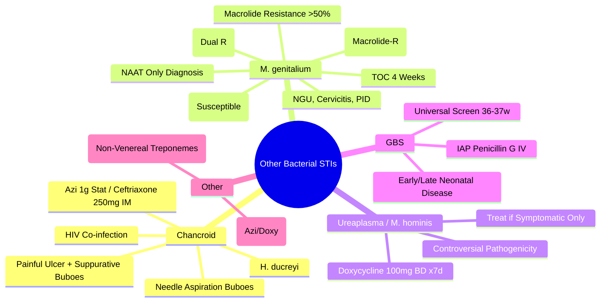

**Parent Topic:** [STI MOC](../Sexually%20Transmitted%20Infections%20MOC.md) → [STI Hierarchy](../Davidson%20Chapter%2013%20-%20STI%20Hierarchy.md)  
**Status:** `full-fcps-mrcp-note`  
**Priority:** ⭐⭐ HIGH (FCPS/MRCP — Differential for GUD, Urethritis, Growing AMR Threat)  
**Source:** Davidson 24th Ed Ch 13; WHO/BASHH/CDC Guidelines; FCPS/MRCP Syllabus

---

## 1. 🎯 Learning Objectives
- [ ] Diagnose **Chancroid** (H. ducreyi) — Painful Genital Ulcer, Suppurative Buboes
- [ ] Diagnose **Mycoplasma genitalium** — Urethritis/Cervicitis, Rising Macrolide/Fluoroquinolone Resistance
- [ ] Diagnose **Other Bacterial STIs** — M. hominis, U. urealyticum, Group B Strep
- [ ] Apply **evidence-based treatment** considering AMR patterns
- [ ] Implement **diagnostic algorithms** (NAAT, Culture, PCR)
- [ ] Answer viva: "Chancroid vs Syphilis vs HSV" and "M. genitalium resistance" and "Urethritis differential"

---

## 2. 🧠 Core Concept: Other Bacterial STIs Framework

```mermaid
flowchart TD
    A[Other Bacterial STIs] --> B[Chancroid<br/>Haemophilus ducreyi]
    A --> C[Mycoplasma genitalium<br/>Urethritis/Cervicitis/PID]
    A --> D[Other Mycoplasmas<br/>M. hominis, U. urealyticum]
    A --> E[Group B Strep<br/>Perinatal, Rare Sexual]
    B --> B1[Painful Ulcer + Suppurative Buboes]
    C --> C1[Nongonococcal Urethritis (NGU)<br/>Macrolide/Fluoroquinolone Resistance]
    D --> D1[Controversial Pathogenicity<br/>BV, PID Association]
```

---

## 3. 📋 1️⃣ Chancroid (Haemophilus ducreyi)

### Epidemiology & Transmission
| Aspect | Detail |
|--------|--------|
| **Global Distribution** | **Endemic**: Sub-Saharan Africa, Caribbean, SE Asia, Latin America; **Sporadic Outbreaks** Elsewhere |
| **Transmission** | Sexual (Genital Ulcarative Disease Enhances HIV Transmission) |
| **Risk Factors** | Uncircumcised Men, Multiple Partners, Commercial Sex, Poor Hygiene |
| **Co-infection** | **Syphilis, HSV, HIV** Common (Genital Ulcer Disease Synergy) |

### Clinical Presentation

| Feature | Chancroid |
|---------|-----------|
| **Incubation** | **3-7 Days** (Range 1-14 Days) |
| **Primary Lesion** | **Painful Papule → Pustule → Ulcer** (Within 24-48h) |
| **Ulcer Characteristics** | **Painful**, **Soft**, **Undermined Edges**, **Ragged**, **Purulent Base**, **Bleeds Easily**, **Autoinoculation** (Kissing Ulcers) |
| **Number** | **Multiple** (Common), "Kissing Ulcers" (Opposing Surfaces) |
| **Lymphadenopathy** | **Suppurative Buboes** (Unilateral, Fluctuant, Tender, Matoatting, "Sterile" if Aspirated Early), **>50% Anterior**, Rupture → Sinus Formation |
| **Systemic Symptoms** | Rare (Fever, Malaise if Extensive) |
| **HIV Interaction** | **Co-infection Rates High**; Ulcer Enhances HIV Acquisition/Transmission |

### Differential Diagnosis (Genital Ulcer Disease)
| Feature | Chancroid | Primary Syphilis | HSV (Genital) | LGV |
|---------|-----------|------------------|---------------|-----|
| **Pain** | **Painful** | Painless | **Painful** | Painless (Primary) |
| **Ulcer Base** | Purulent, Ragged | Clean, Indurated | Vesicular → Erosive | Painless (Primary) |
| **Edges** | Undermined | Indurated | Irregular | Clean |
| **Lymphadenopathy** | **Suppurative Buboes** (Fluctuant, Tender) | Non-Tender, Rubbery | Tender, Non-Suppurative | **Suppurative Buboes** (Groin) |
| **Number of Ulcers** | Multiple | Single (Usually) | Multiple (Grouped) | Single (Primary) |
| **Gram Stain** | **Gram-Neg Coccobacilli** (School of Fish) | None (Dark Field +ve) | Tzanck +ve (Multinucleated Giant Cells) | None |
| **NAAT/PCR** | H. ducreyi PCR | T. pallidum PCR | HSV PCR | C. trachomatis LGV PCR |

### Diagnosis
| Test | Utility |
|------|---------|
| **Clinical** | Painful Ulcer + Suppurative Buboes = High Suspicion (PPV 60-80% in Endemic Areas) |
| **Gram Stain** | **Gram-Negative Coccobacilli in "Schools of Fish"** (Suggestive, Not Definitive) |
| **Culture** | **Definitive** (Requires Special Media — Chocolate Agar + CO2, Haemophilus Medium); Sensitivity ~60-80% |
| **PCR/NAAT** | **Gold Standard** (H. ducreyi Specific PCR); Not Widely Available |
| **Serology** | Not Available |

### Treatment (WHO/BASHH/CDC)
| Population | Regimen | Alternative |
|------------|---------|-------------|
| **Adults** | **Azithromycin 1g Stat (Single Dose)** | **Ceftriaxone 250mg IM Stat** |
| **HIV Positive** | **Azithromycin 1g Stat** (Preferred) | **Ceftriaxone 250mg IM Stat** |
| **Pregnancy** | **Azithromycin 1g Stat** (Safe) | **Ceftriaxone 250mg IM Stat** (Safe) |
| **Bubo Aspiration** | **Needle Aspiration** (Repeated if Needed) — **Incision & Drainage Avoided** (Sinuses/Scarring) | |

> **Key**: **Azithromycin 1g Stat = 1st Line (Oral, Single Dose, Covers Syphilis/CT Co-infection)**; **Ceftriaxone 250mg IM = Alternative**

### Partner Management
| Action | Detail |
|--------|--------|
| **Lookback Period** | **30 Days** Prior to Symptom Onset |
| **Partner Notification** | All Sexual Partners in Last 30 Days — Treat Empirically |
| **EPT** | **Azithromycin 1g Stat** (Legal Where Permitted) |

---

## 4. 📋 2️⃣ Mycoplasma genitalium

### Epidemiology & Significance
| Aspect | Detail |
|--------|--------|
| **Prevalence** | **1-3% General Population**, Higher in STI Clinic Attendees, Young Adults |
| **Transmission** | Sexual (Vaginal, Anal, Oral) |
| **Clinical Significance** | **Major Cause of Nongonococcal Urethritis (NGU)** (15-25% NGU), Cervicitis, PID |
| **AMR Threat** | **Macrolide Resistance >50% Global**, **Fluoroquinolone Resistance Rising** (Dual Resistance Emerging) |

### Clinical Presentation
| Sex | Presentation |
|-----|--------------|
| **Male** | **Urethritis** (Dysuria, Mucopurulent Discharge), **Asymptomatic** (Common), Balanoposthitis |
| **Female** | **Cervicitis** (Mucopurulent Discharge, Friability, ICB), **Asymptomatic** (High Rate), **PID** (Lower Abdominal Pain, Adnexal Tenderness, Cervical Motion Tenderness) |
| **Rectal/Pharyngeal** | Often Asymptomatic; Proctitis (Rectal Pain, Discharge) Possible |

### Diagnosis
| Test | Utility |
|------|---------|
| **NAAT (PCR/TMA)** | **Gold Standard** — **Only Reliable Method** (Culture Difficult, Slow, Insensitive) |
| **Specimens** | **Urine (First-Catch)**, Urethral/Vaginal/Cervical/Rectal Swabs |
| **Resistance Testing** | **Macrolide (23S rRNA A2058/2059)** + **Fluoroquinolone (parC/gyrA)** — **Mandatory if Available** |
| **Culture** | Not Routine (Fastidious, Weeks) |

### Treatment — Resistance-Guided Therapy

#### Macrolide-Susceptible
| Population | Regimen |
|------------|---------|
| **All** | **Azithromycin 500mg Day 1, then 250mg Daily × 4 Days (Total 5 Days)** — **Extended Course Superior to Single Dose** |

#### Macrolide-Resistant (Tested or High Prevalence >10%)
| Population | Regimen |
|------------|---------|
| **All** | **Moxifloxacin 400mg OD × 7-14 Days** (Preferred) |
| **Moxifloxacin Unavailable/Allergic** | **Doxycycline 100mg BD × 7 Days → Moxifloxacin 400mg OD × 7 Days** (Sequential) |
| **Pregnancy** | **Azithromycin 1g Stat + Moxifloxacin Contraindicated** — **Specialist Advice** (Consider Pristinamycin if Available) |

#### Dual Resistance (Macrolide + Fluoroquinolone)
| Population | Regimen |
|------------|---------|
| **All** | **Pristinamycin 1g QID × 10-14 Days** (If Available) — **Specialist Referral** |

### Test of Cure (TOC)
| Timing | Test |
|--------|------|
| **4 Weeks Post-Treatment** | **NAAT** (Avoid <3 Weeks — Residual DNA) |

> **Critical**: **Always Test for Resistance if Available**; **Moxifloxacin for Macrolide-R**; **TOC Mandatory at 4 Weeks**

### Partner Management
| Action | Detail |
|--------|--------|
| **Lookback Period** | **60 Days** Prior to Symptom Onset/Diagnosis |
| **Partner Notification** | All Sexual Partners in Last 60 Days — Test & Treat |
| **EPT** | **Not Standard** (Requires Resistance Testing First) |

---

## 5. 📋 3️⃣ Other Mycoplasmas & Ureaplasmas

| Organism | Clinical Association | Diagnosis | Treatment |
|----------|---------------------|-----------|-----------|
| **Mycoplasma hominis** | **BV (Co-factor)**, PID, Postpartum Fever, Neonatal Sepsis | Culture, PCR | Doxycycline 100mg BD × 7d, Clindamycin |
| **Ureaplasma urealyticum/parvum** | **NSU (Debated)**, UTI, Prostatitis, Neonatal Pneumonia/Chronic Lung Disease | Culture, PCR | Doxycycline 100mg BD × 7d, Azithromycin 1g |

> **Note**: **Pathogenicity Controversial** — Often Commensal; Treat Only if Symptomatic & Other Causes Excluded

---

## 6. 📋 4️⃣ Group B Streptococcus (GBS) — Perinatal/STI Context

| Aspect | Detail |
|--------|--------|
| **Transmission** | Vertical (Mother→Infant at Delivery), Rare Sexual (Balinitis, Urethritis) |
| **Neonatal Disease** | **Early-Onset (0-6 Days)**: Sepsis, Pneumonia, Meningitis; **Late-Onset (7-89 Days)**: Meningitis |
| **Maternal Screening** | **Universal at 36-37 Weeks** (Rectovaginal Swab Culture/PCR) |
| **Intrapartum Prophylaxis** | **Penicillin G IV 5MU Loading → 2.5MU q4h** (Until Delivery) — **Penicillin Allergy: Cefazolin/Clindamycin/Vancomycin** |
| **STI Context** | Rarely Primary STI; **Balanitis/Urethritis in Men** (Sexual Transmission Possible) |

---

## 7. 📋 5️⃣ Other Rare Bacterial STIs

| Organism | Disease | Notes |
|----------|---------|-------|
| **Streptococcus pyogenes (Group A Strep)** | Pharyngitis (Oral Sex), Balanitis, Impetigo | Penicillin |
| **Fusobacterium necrophorum** | Lemierre's Syndrome (Post-Pharyngitis) | Metronidazole + Penicillin |
| **Treponema pallidum pertenue (Yaws)** | Tropical Ulcerative Disease (Non-Venereal) | Azithromycin 30mg/kg (Single Dose) |
| **Treponema pallidum endemicum (Bejel)** | Endemic Syphilis (Non-Venereal) | Benzathine Penicillin G |
| **Calymmatobacterium granulomatis (Donovanosis/Granuloma Inguinale)** | Painless Progressive Ulcers, Beefy Red Granulation | Azithromycin 1g Weekly × 3-4 Weeks / Doxycycline 100mg BD × 3 Weeks |

---

## 8. ⚡ FCPS/MRCP High-Yield Summary

| Topic | Key Points |
|-------|------------|
| **Chancroid** | **Painful Ulcer + Suppurative Buboes**; **H. ducreyi**; **Azithromycin 1g Stat** (1st Line); **Ceftriaxone 250mg IM** Alternative; **HIV Co-infection Common** |
| **M. genitalium** | **NGU/Cervicitis/PID**; **NAAT Only Diagnosis**; **Macrolide Resistance >50%**; **Moxifloxacin for Macrolide-R**; **TOC 4 Weeks Mandatory** |
| **M. genitalium AMR** | **Macrolide Resistance >50%** (23S rRNA Mutations); **Fluoroquinolone Resistance Rising** (parC/gyrA); **Dual Resistance Emerging** → Pristinamycin |
| **M. hominis / Ureaplasma** | **Controversial Pathogenicity**; Treat Only if Symptomatic & Other Causes Excluded; **Doxycycline 100mg BD × 7d** |
| **Chancroid Differential** | **Painful Ulcer + Suppurative Buboes** vs Syphilis (Painless), HSV (Vesicular), LGV (Painless Primary) |
| **M. genitalium Diagnosis** | **NAAT Only** (Culture Not Routine); **Resistance Testing Mandatory (Macrolide + Fluoroquinolone)** |
| **M. genitalium Treatment** | **Susceptible: Azithromycin 500mg Day 1 + 250mg × 4d (5 Days)**; **Macrolide-R: Moxifloxacin 400mg OD × 7-14d** |
| **TOC** | **M. genitalium: 4 Weeks (NAAT)**; Avoid <3 Weeks |
| **GBS** | **Universal Screen 36-37w**; **IAP Penicillin G IV**; **Early/Late Onset Neonatal Disease** |

---

## 9. 🎤 Viva Questions (Expected Answers)

| # | Question | Expected Answer |
|---|----------|-----------------|
| 1 | Chancroid — typical clinical features? | **Painful Genital Ulcer** (Soft, Undermined Edges, Purulent Base) + **Suppurative Inguinal Buboes** (Unilateral, Fluctuant, Tender) |
| 2 | Chancroid vs Syphilis vs HSV — key differentiating features? | **Chancroid: Painful Ulcer + Suppurative Buboes**; **Syphilis: Painless Indurated Chancre, Non-Tender Lymphadenopathy**; **HSV: Painful Grouped Vesicles → Ulcers, Tender Lymphadenopathy** |
| 3 | Chancroid treatment? | **Azithromycin 1g Single Dose** (1st Line); **Ceftriaxone 250mg IM Stat** (Alternative) |
| 4 | M. genitalium — role in urethritis? | **Major Cause of NGU (15-25%)**, Cervicitis, PID; **NAAT Only Diagnosis**; **Macrolide Resistance >50%** |
| 5 | M. genitalium macrolide resistance — treatment? | **Moxifloxacin 400mg OD × 7-14 Days** (Preferred for Macrolide-R); **TOC at 4 Weeks Mandatory** |
| 6 | M. genitalium dual resistance (Macrolide + Fluoroquinolone) — treatment? | **Pristinamycin 1g QID × 10-14 Days** (If Available); **Specialist Referral** |
| 7 | M. genitalium test of cure — timing? | **4 Weeks Post-Treatment** (NAAT); Avoid <3 Weeks (Residual DNA False Positive) |
| 8 | Ureaplasma/M. hominis — clinical significance? | **Controversial Pathogenicity** (Often Commensal); Treat Only if Symptomatic & Other Causes Excluded; **Doxycycline 100mg BD × 7d** |
| 9 | Chancroid bubo management? | **Needle Aspiration** (Repeated if Needed); **Incision & Drainage Avoided** (Sinus/Scarring Risk) |
| 10 | M. genitalium in pregnancy — treatment? | **Azithromycin 1g Stat** (Safe); **Moxifloxacin Contraindicated**; **Specialist Advice for Macrolide-R** |

---

## 10. 🧩 Confusions & Mnemonics

| Confusion | Clarification |
|-----------|---------------|
| **"Chancroid = Syphilis"** | **NO.** **Chancroid = Painful Ulcer + Suppurative Buboes**; **Syphilis = Painless Indurated Chancre + Non-Tender Lymphadenopathy** |
| **"Chancroid = HSV"** | **NO.** **HSV = Grouped Vesicles → Painful Ulcers, Tender Lymphadenopathy, Recurrent**; **Chancroid = Single/Phase, No Recurrence** |
| **"M. genitalium = Just Another Ureaplasma"** | **NO.** **Distinct Pathogen**; **Proven NGU Cause**; **High AMR (Macrolide >50%, Fluoroquinolone Rising)**; **NAAT Diagnosis**; **Specific Treatment Algorithms** |
| **"Azithromycin 1g = Cure for M. genitalium"** | **NO.** **Single Dose Inferior**; **Extended Course (500mg Day 1 + 250mg × 4d) Superior**; **If Macrolide-R: Moxifloxacin** |
| **"M. genitalium Culture = Gold Standard"** | **NO.** **NAAT = Gold Standard**; Culture Difficult, Slow, Insensitive; **Resistance Testing by PCR (23S rRNA, parC/gyrA)** |
| **"Ureaplasma = Always Treat"** | **NO.** **Controversial Pathogenicity** (Often Commensal); **Treat Only if Symptomatic & Other Causes Excluded** |
| **"Chancroid = Only in Tropics"** | **NO.** **Endemic in Africa/SE Asia/Caribbean**; **Sporadic Outbreaks Globally**; **HIV Co-infection Drives Spread** |
| **"M. genitalium TOC = 2 Weeks Like GC"** | **NO.** **M. genitalium TOC = 4 Weeks (NAAT)**; Avoid <3 Weeks (Residual DNA) |
| **"Chancroid Bubo = Incision & Drainage"** | **NO.** **Needle Aspiration Preferred**; **Incision & Drainage Avoided** (High Sinus/Scarring Risk) |

> **Mnemonic: CHANCROID & MG MASTER**  
> **C**hancroid: **Painful Ulcer + Suppurative Buboes** → **Azi 1g Stat / Ceftriaxone 250mg IM**  
> **H**IV Link: **Chancroid Ulcers = HIV Gateway** (↑ Acquisition/Transmission)  
> **A**zithromycin: **1g Stat (Chancroid 1st Line)**; **500mg+250mg×4d (MG Susceptible)**  
> **N**eisseria? **No — H. ducreyi** (Gram-Neg Coccobacilli, "Schools of Fish")  
> **C**ulture: **Special Media (Chocolate Agar + CO2, Haemophilus Medium)**  
> **R**esistance: **Chancroid Rare; MG Macrolide >50%, FQ Rising, Dual R Emerging**  
> **O**ral Sex: **Chancroid Rare Oral; MG Pharyngeal Possible**  
> **I**n Pregnancy: **Chancroid → Azi 1g Safe**; **MG → Azi 1g Safe; Moxifloxacin NO**  
> **D**iagnosis: **Chancroid Clinical + PCR; MG = NAAT ONLY (Resistance Testing Mandatory)**  
> **M**G (M. genitalium): **NGU/Cervicitis/PID**; **NAAT ONLY**; **A2058/2059 = Macrolide R**  
> **G**enital Ulcer DDx: **Chancroid (Painful+Buboes) vs Syphilis (Painless) vs HSV (Vesicular) vs LGV (Painless Primary)**  
> **E**xtended Course: **MG Azi 500mg Day 1 + 250mg×4d (5 Days) > Single Dose**  
> **N**ucleic Acid: **MG NAAT Only (Culture Not Routine)**  
> **I**n Pregnancy: **MG → Azi 1g Safe; Moxi NO**; **Chancroid → Azi/Ceftriaxone Safe**  
> **A**MR: **MG Macrolide >50% (23S rRNA A2058/2059), FQ Rising (parC/gyrA), Dual R → Pristinamycin**  
> **T**est of Cure: **MG = 4 Weeks (NAAT); Avoid <3 Weeks**  

---

## 11. 🗺️ Mind Map



---

## 12. 📅 Spaced Repetition Tracker

| Review | Date | Score (0–5) | Notes |
|--------|------|-------------|-------|
| Day 1 | | | |
| Day 3 | | | |
| Day 7 | | | |
| Day 14 | | | |
| Day 30 | | | |
| Day 90 | | | |

---

## 13. 📝 Self-Test Scorecard

| Section | Max | Score | % |
|---------|-----|-------|---|
| Chancroid (Clinical, DDx, Treatment) | 4 | | |
| M. genitalium (Diagnosis, AMR, Treatment) | 4 | | |
| M. genitalium Resistance & TOC | 3 | | |
| Other Mycoplasmas/Ureaplasmas | 2 | | |
| GBS & Other Rare | 2 | | |
| Differential Diagnosis (GUD) | 3 | | |
| **Total** | **20** | | |

---

## 14. 💬 Exam Answer Modes

| Format | Prompt | Key Points |
|--------|--------|------------|
| **Long Essay** | "Describe the clinical features, diagnosis, and management of chancroid and Mycoplasma genitalium." | **Chancroid**: Painful Ulcer + Suppurative Buboes, Azi 1g/Ceftriaxone 250mg IM; **MG**: NAAT Only, Macrolide R >50%, Azi 5d (Susceptible), Moxi 7-14d (R), TOC 4w |
| **Short Note** | "M. genitalium — antimicrobial resistance and treatment." | **Macrolide Resistance >50% (23S rRNA A2058/2059)**, **FQ Resistance Rising (parC/gyrA)**, **Susceptible: Azi 500mg Day 1 + 250mg×4d**; **Macrolide-R: Moxi 400mg OD × 7-14d**; **Dual R: Pristinamycin**; **TOC 4 Weeks NAAT** |
| **Viva** | "Patient with painful genital ulcer and fluctuant inguinal lymphadenopathy. Diagnosis and management?" | **Chancroid (H. ducreyi)** — **Azithromycin 1g Stat** (1st Line) or **Ceftriaxone 250mg IM**; **Needle Aspiration of Bubo**; **HIV/STI Screen**; **Partner Notification (30 Days)** |
| **Ward Round** | "MSM with persistent urethritis despite doxycycline. NAAT positive for M. genitalium. Macrolide resistance detected. Management?" | **Moxifloxacin 400mg OD × 7-14 Days** (Macrolide-R Regimen); **Test of Cure at 4 Weeks (NAAT)**; **Partner Notification (60 Days)**; **HIV/Syphilis Screen** |
| **Last-Night** | "Chancroid: Painful Ulcer + Suppurative Buboes → Azi 1g/Ceftriaxone 250mg IM. MG: NAAT Only, Macrolide R >50% (A2058/2059), FQ Rising. Susceptible: Azi 500+250×4d (5d); Macrolide-R: Moxi 400mg OD×7-14d; Dual R: Pristinamycin. TOC: 4w NAAT. GUD DDx: Chancroid(Painful+Buboes) vs Syphilis(Painless) vs HSV(Vesicular) vs LGV(Painless Primary)." | Compressed. |

---

## 15. 📌 Summary
- **Chancroid (H. ducreyi)**: **Painful Ulcer + Suppurative Buboes** — **Azithromycin 1g Stat** (1st Line) / **Ceftriaxone 250mg IM**; Needle Aspiration of Buboes; HIV Co-infection Common
- **Mycoplasma genitalium**: **Major NGU Cause**; **NAAT Only Diagnosis**; **Macrolide Resistance >50%** (23S rRNA A2058/2059); **FQ Resistance Rising** (parC/gyrA)
- **M. genitalium Treatment**: **Susceptible** — Azithromycin 500mg Day 1 + 250mg × 4d (5 Days); **Macrolide-R** — **Moxifloxacin 400mg OD × 7-14d**; **Dual R** — Pristinamycin; **TOC 4 Weeks NAAT**
- **Differential GUD**: **Chancroid (Painful + Buboes)** vs **Syphilis (Painless, Indurated)** vs **HSV (Vesicular, Grouped)** vs **LGV (Painless Primary, then Buboes/Proctitis)**
- **Other Mycoplasmas**: M. hominis, Ureaplasma — **Controversial Pathogenicity**; Treat if Symptomatic Only; Doxycycline 100mg BD × 7d
- **GBS**: Universal Screen 36-37w; IAP Penicillin G IV; Neonatal Early/Late Onset Disease

---

## 16. ❓ MCQs (10)

1. **Chancroid — classic clinical presentation?**  
   A. Painless indurated ulcer  B. **Painful ulcer with suppurative buboes**  C. Painless ulcer with bilateral non-tender lymphadenopathy  D. Vesicular lesions  
   *Answer: B. Painful ulcer + Suppurative buboes.*

2. **Chancroid — first-line treatment?**  
   A. Doxycycline 100mg BD × 7d  B. **Azithromycin 1g Single Dose**  C. Benzathine Penicillin G 2.4MU IM  D. Acyclovir 400mg TDS  
   *Answer: B. Azithromycin 1g Single Dose (1st Line); Ceftriaxone 250mg IM Alternative.*

3. **Mycoplasma genitalium — primary diagnostic method?**  
   A. Culture  B. **NAAT (PCR/TMA)**  C. Serology  D. Gram Stain  
   *Answer: B. NAAT (PCR/TMA) — Gold Standard; Culture Not Routine.*

4. **M. genitalium macrolide resistance — mechanism?**  
   A. Efflux Pump  B. **23S rRNA Mutation (A2058/2059)**  C. Beta-Lactamase  D. Penicillin-Binding Protein Change  
   *Answer: B. 23S rRNA Mutation (A2058/2059) — Macrolide Resistance.*

5. **M. genitalium macrolide-resistant — preferred treatment?**  
   A. Extended Azithromycin  B. **Moxifloxacin 400mg OD × 7-14 Days**  C. Doxycycline 100mg BD × 7d  D. Ceftriaxone 500mg IM  
   *Answer: B. Moxifloxacin 400mg OD × 7-14 Days (Preferred for Macrolide-R).*

6. **M. genitalium test of cure — when?**  
   A. 1 Week  B. 2 Weeks  C. **4 Weeks**  D. 8 Weeks  
   *Answer: C. 4 Weeks Post-Treatment (NAAT); Avoid <3 Weeks (Residual DNA).*

7. **Chancroid bubo management?**  
   A. Incision & Drainage  B. **Needle Aspiration (Repeated if Needed)**  C. Antibiotics Only  D. Surgical Excision  
   *Answer: B. Needle Aspiration (Repeated if Needed); Incision & Drainage Avoided (Sinuses/Scarring).*

8. **Genital ulcer differential — painful ulcer with suppurative buboes?**  
   A. Syphilis  B. **Chancroid**  C. HSV  D. LGV  
   *Answer: B. Chancroid = Painful Ulcer + Suppurative Buboes.*

9. **M. genitalium in pregnancy — treatment?**  
   A. Moxifloxacin  B. **Azithromycin 1g Single Dose**  C. Doxycycline  D. Pristinamycin  
   *Answer: B. Azithromycin 1g Stat (Safe); Moxifloxacin Contraindicated.*

10. **Donovanosis (Granuloma Inguinale) — treatment?**  
    A. Ceftriaxone  B. **Azithromycin 1g Weekly × 3-4 Weeks / Doxycycline 100mg BD × 3 Weeks**  C. Penicillin  D. Acyclovir  
    *Answer: B. Azithromycin 1g Weekly × 3-4 Weeks or Doxycycline 100mg BD × 3 Weeks.*

---

## 17. 📋 SBAs (10)

1. **Man with 3-day painful genital ulcer, undermined edges, purulent base, fluctuant inguinal lymphadenopathy. Diagnosis?**  
   A. Primary Syphilis  B. **Chancroid**  C. HSV  D. LGV  
   *Answer: B. Chancroid (Painful Ulcer + Suppurative Buboes).*

2. **M. genitalium urethritis, macrolide resistance confirmed. Treatment?**  
   A. Azithromycin 1g  B. **Moxifloxacin 400mg OD × 7-14 Days**  C. Doxycycline 100mg BD × 7d  D. Ceftriaxone 500mg IM  
   *Answer: B. Moxifloxacin 400mg OD × 7-14 Days (Macrolide-R Regimen).*

3. **Chancroid bubo — management?**  
   A. Incision & Drainage  B. **Needle Aspiration (Repeated)**  C. Antibiotics Only  D. Surgical Excision  
   *Answer: B. Needle Aspiration (Repeated if Needed).*

4. **M. genitalium in pregnancy — treatment?**  
   A. Moxifloxacin 400mg OD  B. **Azithromycin 1g Single Dose**  C. Doxycycline 100mg BD  D. Pristinamycin  
   *Answer: B. Azithromycin 1g Stat (Safe); Moxifloxacin Contraindicated.*

5. **Ulcerative genital lesion — painful, multiple, suppurative buboes. Most likely?**  
   A. Syphilis  B. **Chancroid**  C. HSV  D. Donovanosis  
   *Answer: B. Chancroid (Painful Ulcer + Suppurative Buboes).*

---

## 18. 🔑 Answer Keys
| MCQs | SBAs |
|------|------|
| 1-B, 2-B, 3-B, 4-B, 5-B, 6-B, 7-B, 8-B, 9-B, 10-B | 1-B, 2-B, 3-B, 4-B, 5-B |

---

## 19. 🔗 Cross-Links
- [[2.1 Chlamydia.md]] — Differential (Urethritis, PID), Co-infection
- [[2.2 Gonorrhoea.md]] — Differential (Urethritis), Co-infection
- [[2.3 Syphilis.md]] — Differential (GUD), AMR Context
- [[3.2 HSV.md]] — Differential (GUD), Recurrent
- [[5.1-5.8 Syndromic Management.md]] — GUD Algorithm, Urethral Discharge Algorithm
- [[HIV/AIDS Cross-Reference]] — Chancroid/HIV Synergy, MG in HIV
- [[9. ELSI]] — Partner Notification Ethics, AMR Ethics

---

**Last Updated:** 2026-06-15  
**Next:** Build `3.2 HSV.md`, `3.3 HPV.md`, `3.4 Hepatitis B & C.md`, `3.5 Mpox.md`, `3.6 Other Viral STIs.md`