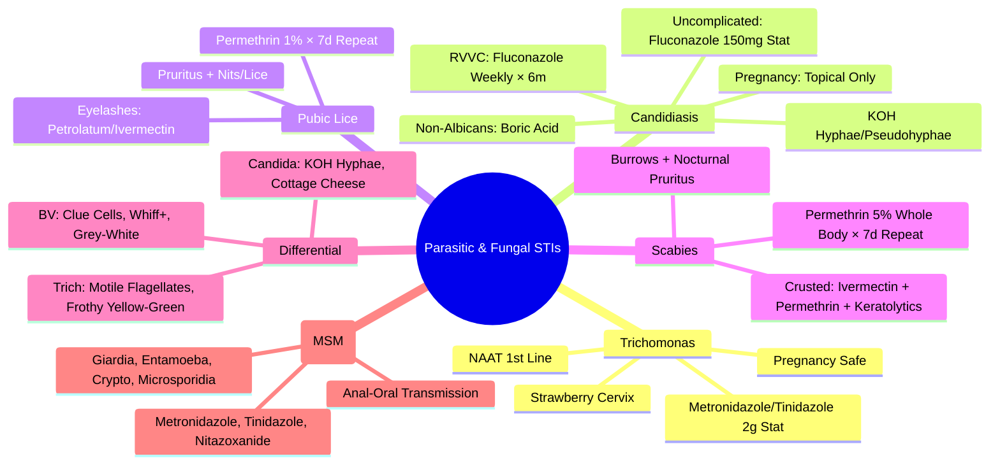

**Parent Topic:** [STI MOC](../Sexually%20Transmitted%20Infections%20MOC.md) → [STI Hierarchy](../Davidson%20Chapter%2013%20-%20STI%20Hierarchy.md)  
**Status:** `full-fcps-mrcp-note`  
**Priority:** ⭐⭐ HIGH (FCPS/MRCP — Trichomonas, Candida, Pubic Lice, Scabies, Emerging Parasites)  
**Source:** Davidson 24th Ed Ch 13; WHO/CDC; FCPS/MRCP Syllabus

---

## 1. 🎯 Learning Objectives
- [ ] Diagnose **Trichomonas vaginalis** (Vaginitis, Urethritis) and apply treatment (Metronidazole/Tinidazole)
- [ ] Diagnose **Candidiasis** (Vulvovaginal, Balanitis) and apply treatment (Azoles)
- [ ] Diagnose **Pubic Lice (Pthirus pubis)** and **Scabies (Sarcoptes scabiei)** and apply treatment
- [ ] Recognise **Emerging Parasitic STIs** (Giardiasis, Amebiasis, Strongyloidiasis - rare sexual transmission)
- [ ] Apply **pregnancy-specific treatment** for parasitic/fungal STIs
- [ ] Apply **partner notification and treatment** strategies
- [ ] Answer viva: "Trichomonas vs BV vs Candida" and "Scabies vs Lice" and "Candidiasis in Pregnancy"

---

## 2. 🧠 Core Concept: Parasitic & Fungal STIs Framework

```mermaid
flowchart TD
    A[Parasitic & Fungal STIs] --> B[Protozoal]
    B --> B1[Trichomonas vaginalis<br/>(Vaginitis, Urethritis, PID)]
    B --> B2[Giardia lamblia<br/>(Rare Sexual)]
    B --> B3[Entamoeba histolytica<br/>(Rare Sexual)]
    A --> C[Fungal]
    C --> C1[Candida albicans<br/>(Vulvovaginitis, Balanitis)]
    C --> C2[Non-Albicans Candida<br/>(Glabrata, Krusei, Tropicalis)]
    A --> D[Ectoparasites]
    D --> D1[Pubic Lice (Pthirus pubis)]
    D --> D2[Scabies (Sarcoptes scabiei)]
    A --> E[Emerging Parasitic]
    E --> E1[Strongyloides stercoralis<br/>(Rare Sexual)]
    E --> E2[Cryptosporidium<br/>(MSM, Immunocompromised)]
```

---

## 1️⃣ Trichomonas vaginalis

### Epidemiology & Transmission
| Aspect | Detail |
|--------|--------|
| **Global Prevalence** | **~156 Million** New Cases/Year (Most Common Curable STI) |
| **Transmission** | **Sexual** (Vaginal, Penile, Rectal); **Vertical** (Rare); **Fomites** (Rare, Moist Towels) |
| **Asymptomatic Rate** | **50% Women, 70-80% Men** |
| **Risk Factors** | Multiple Partners, Unprotected Sex, Concurrent STIs, HIV |
| **HIV Interaction** | **↑ HIV Acquisition/Transmission** (Genital Inflammation) |

### Clinical Presentation

| Sex | Symptomatic | Features |
|-----|-------------|----------|
| **Female** | **50%** | **Vaginitis**: Frothy Yellow-Green Discharge, Vulvar Erythema/Edema, **Strawberry Cervix** (Punctate Hemorrhages), Dysuria, Dyspareunia, Pruritus |
| **Male** | **20-30%** | **Urethritis**: Mild Dysuria, Scanty Discharge, **Often Asymptomatic Carrier** |
| **Both** | | **PID** (Female), **Prostatitis/Epididymitis** (Male), **Adverse Pregnancy Outcomes** (Preterm, LBW) |

### Diagnosis

| Test | Sensitivity | Specificity | Sample | Best Use |
|------|-------------|-------------|--------|----------|
| **NAAT (PCR/TMA)** | **95-98%** | **>99%** | Vaginal Swab, Urine, Urethral Swab | **Gold Standard** (1st Line) |
| **Culture (Diamond's Medium)** | 70-80% | **100%** | Vaginal Swab, Urine | **Viability, AST** (If Needed) |
| **Microscopy (Wet Mount)** | 50-70% | **High** | Vaginal Swab (Saline) | **Bedside** (Motile Trichomonads) |
| **Rapid Antigen Test** | 80-90% | 95% | Vaginal Swab | **POC** (If NAAT Unavailable) |

> **Key**: **NAAT = 1st Line**; **Wet Mount = Bedside (Motile Pear-Shaped Flagellates)**; **Strawberry Cervix = Pathognomonic (Colposcopy)**

### Treatment

| Population | 1st Line | Alternative | Pregnancy |
|------------|----------|-------------|-----------|
| **All** | **Metronidazole 2g Single Dose** | **Tinidazole 2g Single Dose** | **Metronidazole 2g Single Dose** (Safe) |
| **Metronidazole Allergy** | **Tinidazole 2g Single Dose** | **Metronidazole Desensitisation** | **Tinidazole 2g Single Dose** (Safe) |
| **Treatment Failure** | **Metronidazole 500mg BD × 7 Days** | **Tinidazole 2g Daily × 5 Days** | **Metronidazole 500mg BD × 7 Days** |

> **Key**: **Single Dose Metronidazole/Tinidazole = 1st Line**; **Partner Treatment Mandatory**; **Avoid Alcohol × 48h Post-Metronidazole**

### Partner Management
| Action | Detail |
|--------|--------|
| **Partner Treatment** | **All Sexual Partners Last 60 Days** — Treat Empirically (Same Regimen) |
| **EPT** | **Legal Where Permitted** — Metronidazole 2g / Tinidazole 2g |
| **Abstinence** | **Until Both Partners Treated + 7 Days** |

---

## 2️⃣ Candidiasis (Vulvovaginal & Balanitis)

### Epidemiology
| Aspect | Detail |
|--------|--------|
| **Prevalence** | **75% Women** Experience ≥1 Lifetime Episode; **Recurrent VVC (RVVC) = ≥4 Episodes/Year (5-8%)** |
| **Causative Species** | **C. albicans (85-90%)**, **Non-Albicans (C. glabrata, C. krusei, C. tropicalis, C. parapsilosis) = 10-15%** |
| **Transmission** | **Not Classic STI** (Commensal Overgrowth); **Sexual Transmission Possible** (Partner Balanitis) |
| **Risk Factors** | **Antibiotics, Diabetes, Pregnancy, OCP, Immunosuppression, HIV, Tight Clothing, Douching** |

### Clinical Presentation

| Type | Features |
|------|----------|
| **Vulvovaginal Candidiasis (VVC)** | **Pruritus (Hallmark), Burning, Dyspareunia, Dysuria**, **Thick White "Cottage Cheese" Discharge**, Vulvar Erythema/Edema, Satellite Lesions |
| **Balanitis (Male)** | **Erythema, Pruritus, Burning, White Plaques on Glans/Prepuce**, Dyspareunia |
| **Recurrent VVC (RVVC)** | **≥4 Episodes/Year**, Often **Non-Albicans** (C. glabrata), Requires Maintenance Suppression |

### Diagnosis

| Test | Utility |
|------|---------|
| **Microscopy (KOH Wet Mount)** | **Hyphae/Pseudohyphae + Budding Yeast** (Sensitivity 70-90%) |
| **Gram Stain** | **Gram-Positive Yeast + Pseudohyphae** |
| **Culture (Sabouraud)** | **Species Identification + Antifungal Susceptibility** (Essential for RVVC, Non-Albicans, Treatment Failure) |
| **NAAT (PCR)** | **Species ID + Resistance Markers** (Emerging, Not Routine) |

> **Key**: **KOH Wet Mount = Bedside 1st Line**; **Culture = RVVC, Non-Albicans, Treatment Failure**

### Treatment

| Scenario | 1st Line | Alternative | Notes |
|----------|----------|-------------|-------|
| **Uncomplicated VVC** | **Fluconazole 150mg Single Dose (Oral)** | **Topical Azole (Clotrimazole 500mg Pessary, Miconazole 200mg Pessary × 3 Days)** | **Oral Preferred** (Convenience) |
| **RVVC (≥4/Year)** | **Fluconazole 150mg Weekly × 6 Months** (Maintenance) | **Induction: Fluconazole 150mg q72h × 3 Doses → Weekly × 6m** | **Species ID + Susceptibility Essential** |
| **Non-Albicans (C. glabrata)** | **Boric Acid 600mg Pessary HS × 14 Days** OR **Flucytosine + Amphotericin B Vaginal** | **Flucytosine 1g + Amphotericin B 100mg Pessary HS × 14 Days** | **Azole Resistance Common** |
| **C. krusei** | **Boric Acid 600mg Pessary HS × 14 Days** | **Flucytosine + Amphotericin B** | **Inherently Fluconazole Resistant** |
| **Balanitis** | **Topical Clotrimazole 1% Cream BD × 7-14 Days** | **Fluconazole 150mg Single Dose** | **Treat Partner if Symptomatic** |
| **Pregnancy** | **Topical Azole (Clotrimazole 500mg Pessary × 7 Days)** | **Miconazole 200mg Pessary × 7 Days** | **Avoid Oral Fluconazole (Teratogenic Risk, esp. 1st Trimester)** |

> **Key**: **Fluconazole 150mg Single Dose = 1st Line Uncomplicated VVC**; **Pregnancy = Topical Only**; **RVVC = Maintenance Fluconazole Weekly × 6m**

---

## 3️⃣ Pubic Lice (Pthirus pubis)

### Epidemiology & Transmission
| Aspect | Detail |
|--------|--------|
| **Transmission** | **Sexual (Close Body Contact)**; **Fomites (Bedding, Towels, Clothing)** |
| **Incubation** | **1-2 Weeks** (Egg → Nymph → Adult) |
| **At-Risk** | **Sexually Active Adults, Crowded Living Conditions** |

### Clinical Presentation
| Feature | Detail |
|---------|--------|
| **Pruritus** | **Intense (Nocturnal), Allergic Reaction to Louse Saliva** |
| **Signs** | **Live Lice (Grey-Brown, Crab-Shaped, 1-2mm)**, **Nits (White, Oval, Cemented to Hair Base)** |
| **Distribution** | **Pubic Hair (Primary), Axillary, Chest, Eyelashes (Phthiriasis Palpebrarum), Perianal** |
| **Signs** | **Blue-Grey Macules (Maculae Ceruleae)** — Bite Reactions |

### Diagnosis
| Method | Detail |
|--------|--------|
| **Visual Inspection** | **Live Lice / Nits on Pubic Hair** (Magnifying Glass/Dermoscopy) |
| **Dermoscopy** | **Live Lice, Nits, "Crab" Morphology** |
| **Microscopy** | **Louse/Nit Identification** (If Uncertain) |

### Treatment

| Population | 1st Line | Alternative |
|------------|----------|-------------|
| **Adults/Adolescents** | **Permethrin 1% Cream Rinse / Lotion** (Apply to Affected Area, Leave 10min, Rinse; Repeat in 7 Days) | **Malathion 0.5% Lotion** (Leave 8-12h, Repeat 7 Days) |
| **Eyelashes (Phthiriasis Palpebrarum)** | **Petrolatum/Jelly BD × 10 Days** OR **Ivermectin 200mcg/kg Single Dose** | **Physical Removal (Forceps), Cryotherapy** |
| **Pregnancy** | **Permethrin 1% (Safe)** | **Malathion (Safe)** |
| **Children** | **Permethrin 1% (Safe >2 Months)** | **Malathion (Safe >6 Months)** |

> **Key**: **Permethrin 1% = 1st Line**; **Repeat in 7 Days (Kill Newly Hatched Nymphs)**; **Treat Contacts**; **Wash Bedding/Clothing at 60°C**

---

## 4️⃣ Scabies (Sarcoptes scabiei var. hominis)

### Epidemiology & Transmission
| Aspect | Detail |
|--------|--------|
| **Transmission** | **Prolonged Skin-to-Skin Contact** (Sexual, Household, Institutional); **Fomites (Rare, Crusted Scabies)** |
| **Incubation** | **2-6 Weeks** (First Infestation); **1-4 Days** (Re-infestation) |
| **At-Risk** | **Crowded Conditions, Institutions, Immunocompromised (Crusted Scabies)** |

### Clinical Presentation

| Type | Features |
|------|----------|
| **Classic Scabies** | **Intense Nocturnal Pruritus**, **Burrows (Serpiginous, Grey-White, Finger Webs, Wrists, Elbows, Axillae, Waist, Genitalia, Buttocks)**, **Papules/Pustules**, **Secondary Impetigo** |
| **Crusted (Norwegian) Scabies** | **Hyperkeratotic Crusts** (Thick, Grey-White), **Millions of Mites**, **Minimal Pruritus**, **Immunocompromised/Elderly/Institutionalised**, **Highly Infectious (Fomite Transmission)** |

### Diagnosis
| Method | Detail |
|--------|--------|
| **Clinical** | **Burrows + Nocturnal Pruritus + Contact History** |
| **Dermoscopy** | **"Delta Wing" / "Jet Plane" Sign** (Mite at End of Burrow) |
| **Microscopy (Skin Scraping)** | **Mite, Eggs, Scybala (Faecal Pellets)** — **Gold Standard** |
| **Burrow Ink Test** | **Ink Highlights Burrow** |

### Treatment

| Population | 1st Line | Alternative |
|------------|----------|-------------|
| **Classic Scabies** | **Permethrin 5% Cream** (Whole Body Neck-Down, 8-14h, Repeat 7 Days) | **Ivermectin 200mcg/kg Single Dose** (Repeat 7-14 Days) |
| **Crusted Scabies** | **Ivermectin 200mcg/kg Day 1, 2, 8, 9, 15** + **Permethrin 5% Daily × 7 Days** | **Ivermectin + Keratolytics (Salicylic Acid 5-10%)** |
| **Pregnancy** | **Permethrin 5% (Safe)** | **Benzyl Benzoate 25% (Safe)** |
| **Children** | **Permethrin 5% (Safe >2 Months)** | **Ivermectin (If >15kg, Off-Label)** |

> **Key**: **Permethrin 5% = 1st Line (Whole Body, Repeat 7 Days)**; **Ivermectin = Alternative (Convenient, Oral)**; **Crusted = Ivermectin + Permethrin + Keratolytics**; **Treat All Contacts Simultaneously**

---

## 5️⃣ Emerging Parasitic STIs (Rare Sexual Transmission)

| Parasite | Sexual Transmission | Clinical Syndrome | Diagnosis | Treatment |
|----------|---------------------|-------------------|-----------|-----------|
| **Giardia lamblia** | **Anal-Oral (MSM)** | Diarrhoea, Bloating, Steatorrhoea, Weight Loss | Stool Antigen/PCR, Duodenal Aspirate | **Metronidazole 500mg BD × 5-7 Days** / Tinidazole 2g Stat |
| **Entamoeba histolytica** | **Anal-Oral (MSM)** | Dysentery (Bloody Diarrhoea), Liver Abscess | Stool Antigen/PCR, Serology | **Metronidazole 750mg TDS × 7-10 Days** + Luminal Agent (Paromomycin) |
| **Cryptosporidium** | **Anal-Oral (MSM, HIV)** | Watery Diarrhoea (Prolonged in HIV) | Stool Antigen/PCR, Modified Acid-Fast Stain | **Nitazoxanide 500mg BD × 3 Days** (Immunocompetent); **ART + Nitazoxanide** (HIV) |
| **Strongyloides stercoralis** | **Rare (Skin Penetration, Autoinfection)** | Larva Currens, Eosinophilia, Hyperinfection (Immunosuppressed) | Stool Larvae (Baermann), Serology, PCR | **Ivermectin 200mcg/kg Day 1, 2 (Repeat 2 Weeks)** |
| **Microsporidia (Enterocytozoon)** | **MSM, HIV** | Chronic Diarrhoea, Wasting | Stool PCR, Duodenal Biopsy | **Albendazole 400mg BD × 2-4 Weeks** |

---

## 6️⃣ Pregnancy-Specific Treatment Summary

| STI | Pregnancy-Safe Treatment | Avoid |
|-----|-------------------------|-------|
| **Trichomonas** | **Metronidazole 2g Stat** / Tinidazole 2g Stat | — |
| **Candidiasis (VVC)** | **Topical Azoles (Clotrimazole 500mg Pessary × 7d, Miconazole 200mg × 7d)** | **Oral Fluconazole** (Teratogenic Risk) |
| **Balanitis** | **Topical Clotrimazole 1% Cream BD × 7-14d** | Oral Fluconazole |
| **Pubic Lice** | **Permethrin 1% Lotion** (Repeat 7d) | — |
| **Scabies** | **Permethrin 5% Cream** (Whole Body, Repeat 7d) | Ivermectin (Caution) |
| **Trichomonas (Alternative)** | **Tinidazole 2g Stat** | — |

---

## 3. ⚡ FCPS/MRCP High-Yield Summary

| STI | Key Points |
|-----|------------|
| **Trichomonas** | **NAAT = Gold Standard**; **Strawberry Cervix**; **Metronidazole 2g Stat / Tinidazole 2g Stat**; **Partner Treatment**; **Pregnancy Safe** |
| **Candidiasis** | **KOH Wet Mount = Hyphae/Pseudohyphae**; **Fluconazole 150mg Stat (Uncomplicated)**; **RVVC = Fluconazole 150mg Weekly × 6m**; **Non-Albicans (Glabrata) → Boric Acid 600mg Pessary × 14d**; **Pregnancy = Topical Only** |
| **Pubic Lice** | **Pruritus + Live Lice/Nits on Pubic Hair**; **Permethrin 1% Repeat 7d**; **Eyelashes = Petrolatum/Ivermectin** |
| **Scabies** | **Nocturnal Pruritus + Burrows (Finger Webs, Wrist, Genitalia)**; **Permethrin 5% Whole Body Repeat 7d**; **Crusted = Ivermectin + Permethrin + Keratolytics** |
| **Trichomonas vs BV vs Candida** | **Trich: Frothy Yellow-Green, pH>4.5, Motile Trichomonads**; **BV: Thin Grey-White, pH>4.5, Clue Cells, Whiff+**; **Candida: Thick White "Cottage Cheese", pH<4.5, Hyphae on KOH** |
| **Emerging Parasites (MSM)** | **Giardia, Entamoeba, Cryptosporidium, Microsporidia** — **Anal-Oral Transmission** |

---

## 4. 🎤 Viva Questions (Expected Answers)

| # | Question | Expected Answer |
|---|----------|-----------------|
| 1 | Trichomonas vaginalis — diagnosis and treatment? | **NAAT (Gold Standard)**; **Wet Mount (Motile Trichomonads)**; **Strawberry Cervix**; **Metronidazole 2g Stat / Tinidazole 2g Stat**; **Partner Treatment** |
| 2 | Trichomonas vs BV vs Candida — how to differentiate? | **Trich: Frothy Yellow-Green, pH>4.5, Motile Trichomonads**; **BV: Thin Grey-White, pH>4.5, Clue Cells, Whiff+**; **Candida: Thick White "Cottage Cheese", pH<4.5, KOH Hyphae** |
| 3 | Candidiasis — uncomplicated vs recurrent vs non-albicans treatment? | **Uncomplicated: Fluconazole 150mg Stat**; **RVVC: Fluconazole 150mg Weekly × 6m**; **Non-Albicans (Glabrata): Boric Acid 600mg Pessary × 14d**; **Pregnancy: Topical Azoles Only** |
| 4 | Pubic lice vs scabies — key differences? | **Lice: Pubic Hair, Live Lice/Nits Visible, Permethrin 1%**; **Scabies: Burrows (Finger Webs/Wrist/Genital), Nocturnal Pruritus, Permethrin 5% Whole Body** |
| 5. Scabies — crusted vs classic management? | **Classic: Permethrin 5% Whole Body × 7d Repeat**; **Crusted: Ivermectin 200mcg/kg Days 1,2,8,9,15 + Permethrin Daily × 7d + Keratolytics** |
| 6. Trichomonas in pregnancy — safe treatment? | **Metronidazole 2g Single Dose** (Safe All Trimesters) / **Tinidazole 2g Single Dose** (Safe) |
| 7. BV vs Candidiasis vs Trichomonas — wet mount findings? | **BV: Clue Cells; Candida: Hyphae/Pseudohyphae on KOH; Trichomonas: Motile Pear-Shaped Flagellates** |
| 8. Pubic lice eyelash involvement — treatment? | **Petrolatum/Jelly BD × 10 Days** or **Ivermectin 200mcg/kg Single Dose** |
| 9. Scabies treatment failure — next step? | **Reassess Compliance, Re-treat (Permethrin + Ivermectin), Treat All Contacts, Environmental Decontamination** |
| 10. Cryptosporidium in HIV — treatment? | **ART Optimisation + Nitazoxanide 500mg BD × 3-7 Days** (Immunocompetent: Nitazoxanide 500mg BD × 3 Days) |

---

## 5. 🧩 Confusions & Mnemonics

| Confusion | Clarification |
|-----------|---------------|
| **"Trichomonas = BV"** | **NO.** **Trich = Motile Flagellates, Frothy Yellow-Green, Strawberry Cervix**; **BV = Clue Cells, Thin Grey-White, Whiff+, pH>4.5** |
| **"Candida = Always Fluconazole"** | **NO.** **Pregnancy = Topical Only**; **Non-Albicans (Glabrata/Krusei) = Azole Resistant → Boric Acid/Flucytosine** |
| **"Scabies = Only Hands"** | **NO.** **Burrows: Finger Webs, Wrists, Elbows, Axillae, Waist, Genitalia, Buttocks** |
| **"Pubic Lice = Scabies"** | **NO.** **Lice = Visible Lice/Nits on Pubic Hair; Scabies = Burrows, Mites Not Visible to Naked Eye** |
| **"Trichomonas = Only Women"** | **NO.** **Men = Asymptomatic Carriers (70-80%), Urethritis (20-30%)** |
| **"Fluconazole Safe in Pregnancy"** | **NO.** **Teratogenic Risk (High Dose/1st Trimester)**; **Topical Azoles Only in Pregnancy** |
| **"Permethrin = Once Only for Scabies"** | **NO.** **Must Repeat in 7 Days (Kill Newly Hatched Nymphs from Eggs)** |
| **"Crusted Scabies = Just More Mites"** | **NO.** **Hyperkeratotic Crusts, Millions of Mites, Immunocompromised, Highly Infectious (Fomites), Needs Ivermectin + Permethrin + Keratolytics** |
| **"Ivermectin = 1st Line for Scabies"** | **NO.** **Permethrin 5% = 1st Line (Topical, Safe Pregnancy/Children)**; **Ivermectin = Alternative (Oral, Convenient)** |
| **"All Parasites = STIs"** | **NO.** **Giardia, Entamoeba, Crypto = Rare Sexual (Anal-Oral, MSM); Primarily Faecal-Oral/Waterborne** |

> **Mnemonic: PARASITIC & FUNGAL STIs MASTER**  
> **P**arasitic: **Trichomonas (NAAT, Metronidazole 2g), Giardia/Entamoeba/Crypto (MSM, Anal-Oral)**  
> **A**lternatives: **Tinidazole (Trich), Boric Acid (C. glabrata), Ivermectin (Scabies/Lice)**  
> **R**ecurrent Candida: **Fluconazole Weekly × 6m (RVVC); Non-Albicans → Boric Acid 600mg Pessary × 14d**  
> **A**ntifungal Pregnancy: **Topical Only (Clotrimazole 500mg Pessary × 7d); No Fluconazole**  
> **S**cabies: **Burrows (Finger Webs, Wrist, Genital), Permethrin 5% Whole Body × 7d Repeat**  
> **I**vermectin: **Scabies Alternative (Oral), Crusted = Ivermectin + Permethrin + Keratolytics**  
> **T**richomonas: **NAAT 1st Line; Metronidazole 2g Stat / Tinidazole 2g Stat; Strawberry Cervix**  
> **I**nspect Lice: **Pubic Hair, Nits, Pruritus → Permethrin 1% × 7d Repeat**  
> **C**andidiasis: **KOH Hyphae/Pseudohyphae; Fluconazole 150mg Stat; RVVC = Weekly × 6m**  
> **P**ubic Lice: **Pruritus + Nits/Lice on Pubic Hair → Permethrin 1% × 7d Repeat**  
> **F**ungal STI: **Candida (C. albicans 90%); Non-Albicans = Azole Resistant**  
> **U**rethritis Trich: **Men Asymptomatic 70-80%; Partner Treatment Mandatory**  
> **N**on-Albicans Candida: **C. glabrata (Boric Acid), C. krusei (Inherently Fluconazole Resistant)**  
> **G**iardia/Entamoeba/Crypto: **MSM, Anal-Oral, Rare Sexual; Metronidazole/Tinidazole/Nitazoxanide**  
> **A**lcohol + Metronidazole: **Avoid × 48h Post-Dose (Disulfiram-like Reaction)**  
> **L**ice Eyelashes: **Petrolatum × 10d or Ivermectin 200mcg/kg**  

---

## 6. 🗺️ Mind Map



---

## 7. 📅 Spaced Repetition Tracker

| Review | Date | Score (0–5) | Notes |
|--------|------|-------------|-------|
| Day 1 | | | |
| Day 3 | | | |
| Day 7 | | | |
| Day 14 | | | |
| Day 30 | | | |
| Day 90 | | | |

---

## 8. 📝 Self-Test Scorecard

| Section | Max | Score | % |
|---------|-----|-------|---|
| Trichomonas (Diagnosis, Treatment, Pregnancy) | 3 | | |
| Candidiasis (Uncomplicated, RVVC, Non-Albicans, Pregnancy) | 4 | | |
| Pubic Lice & Scabies (Diagnosis, Treatment, Crusted) | 4 | | |
| Differential Diagnosis (Trich vs BV vs Candida) | 3 | | |
| Emerging Parasitic STIs (MSM) | 2 | | |
| Pregnancy-Specific Treatment | 3 | | |
| **Total** | **20** | | |

---

## 9. 💬 Exam Answer Modes

| Format | Prompt | Key Points |
|--------|--------|------------|
| **Long Essay** | "Describe the diagnosis and management of Trichomonas vaginalis, Candidiasis, and Scabies including pregnancy considerations." | Trich: NAAT, Metronidazole 2g/Tinidazole 2g, Partner Tx; Candida: KOH, Fluconazole 150mg, RVVC Weekly×6m, Non-Albicans Boric Acid, Pregnancy Topical; Scabies: Burrows, Permethrin 5%×7d repeat, Crusted Ivermectin+Permethrin |
| **Short Note** | "Trichomonas vaginalis in pregnancy — diagnosis and treatment." | **NAAT 1st Line**; **Metronidazole 2g Single Dose** (Safe All Trimesters) / **Tinidazole 2g**; **Partner Treatment**; **Avoid Alcohol × 48h** |
| **Viva** | "Woman with vaginal discharge. How to differentiate Trichomonas, BV, and Candida on wet mount?" | **Trich: Motile Pear-Shaped Flagellates**; **BV: Clue Cells, No Motility**; **Candida: KOH = Hyphae/Pseudohyphae, Buds**; **pH: Trich/BV >4.5, Candida <4.5** |
| **Ward Round** | "HIV+ patient with chronic diarrhoea. Stool positive for Cryptosporidium. Management?" | **ART Optimisation (Immune Reconstitution Key)** + **Nitazoxanide 500mg BD × 3-7 Days**; **Hydration, Electrolytes, Nutritional Support** |
| **Last-Night** | "Trich: NAAT, Metro 2g/Tini 2g, Strawberry Cervix, Preg Safe. Candida: KOH Hyphae, Fluconazole 150mg, RVVC Weekly×6m, Non-Albicans Boric Acid, Preg=Topical. Lice: Permethrin 1%×7d repeat. Scabies: Burrows, Permethrin 5% whole body ×7d repeat. Crusted: Ivermectin+Permethrin+Keratolytics. Diff: Trich(Motile/Strawberry), BV(Clue/Whiff), Candida(KOH Hyphae). Preg: Metro/Tini Safe, Fluconazole NO, Permethrin Safe." | Compressed. |

---

## 10. 📌 Summary
- **Trichomonas**: **NAAT = 1st Line**; **Metronidazole 2g / Tinidazole 2g Stat**; **Strawberry Cervix**; **Pregnancy Safe**; **Partner Treatment Mandatory**
- **Candidiasis**: **KOH Wet Mount = Hyphae/Pseudohyphae**; **Uncomplicated: Fluconazole 150mg Stat**; **RVVC: Fluconazole 150mg Weekly × 6 Months**; **Non-Albicans (Glabrata) = Boric Acid 600mg Pessary × 14 Days**; **Pregnancy = Topical Azoles Only**
- **Pubic Lice**: **Pruritus + Live Lice/Nits on Pubic Hair**; **Permethrin 1% Lotion × 7 Days Repeat**; **Eyelashes = Petrolatum/Ivermectin**
- **Scabies**: **Nocturnal Pruritus + Burrows (Finger Webs, Wrist, Genitalia)**; **Permethrin 5% Whole Body × 7 Days Repeat**; **Crusted = Ivermectin + Permethrin + Keratolytics**
- **Differential Vaginitis**: **Trich = Motile Flagellates, Frothy Yellow-Green, Strawberry Cervix**; **BV = Clue Cells, Thin Grey-White, Whiff+, pH>4.5**; **Candida = Thick White "Cottage Cheese", KOH Hyphae, pH<4.5**
- **Pregnancy**: **Trich/Malathion/Permethrin = Safe**; **Fluconazole = Avoid**; **Topical Azoles for Candida**
- **Emerging Parasites (MSM)**: **Giardia, Entamoeba, Cryptosporidium, Microsporidia** — **Anal-Oral Transmission**

---

## 11. ❓ MCQs (10)

1. **Trichomonas vaginalis — gold standard diagnostic test?**  
   A. Wet Mount  B. **NAAT (PCR/TMA)**  C. Culture  D. Rapid Antigen  
   *Answer: B. NAAT (PCR/TMA) — Gold Standard (Sensitivity 95-98%).*

2. **Candidiasis in pregnancy — safe treatment?**  
   A. Fluconazole 150mg  B. **Clotrimazole 500mg Pessary × 7 Days**  C. Terbinafine  D. Griseofulvin  
   *Answer: B. Topical Azoles Only (Clotrimazole 500mg Pessary × 7d); Oral Fluconazole Contraindicated.*

3. **Scabies — first-line treatment?**  
   A. Ivermectin 200mcg/kg  B. **Permethrin 5% Cream (Whole Body, Repeat 7 Days)**  C. Lindane  D. Crotamiton  
   *Answer: B. Permethrin 5% Cream (Whole Body, Neck-Down, 8-14h, Repeat 7 Days).*

4. **Trichomonas vs BV vs Candida — wet mount finding for Candida?**  
   A. Motile Flagellates  B. Clue Cells  C. **Hyphae/Pseudohyphae on KOH**  D. Thin Grey-White Discharge  
   *Answer: C. Hyphae/Pseudohyphae on KOH Preparation.*

5. **Recurrent VVC (≥4/year) — maintenance suppression?**  
   A. Fluconazole 150mg Monthly  B. **Fluconazole 150mg Weekly × 6 Months**  C. Topical Azole Weekly  D. Boric Acid Weekly  
   *Answer: B. Fluconazole 150mg Weekly × 6 Months (Induction: 3 Doses q72h).*

6. **C. glabrata vulvovaginitis — treatment?**  
   A. Fluconazole 150mg  B. **Boric Acid 600mg Pessary HS × 14 Days**  C. Terbinafine  D. Nystatin  
   *Answer: B. Boric Acid 600mg Pessary HS × 14 Days (Azole Resistance Common).*

7. **Pubic lice — eyelash involvement treatment?**  
   A. Permethrin 1% to Eyelashes  B. **Petrolatum/Jelly BD × 10 Days OR Ivermectin 200mcg/kg**  C. Oral Fluconazole  D. Malathion to Eyelashes  
   *Answer: B. Petrolatum/Jelly BD × 10 Days OR Ivermectin 200mcg/kg Single Dose.*

8. **Crusted scabies — management?**  
   A. Permethrin 5% Once  B. **Ivermectin 200mcg/kg Days 1,2,8,9,15 + Permethrin 5% Daily × 7 Days + Keratolytics**  C. Ivermectin Once  D. Benzyl Benzoate Only  
   *Answer: B. Ivermectin 200mcg/kg Days 1,2,8,9,15 + Permethrin 5% Daily × 7 Days + Keratolytics (Salicylic Acid).*

9. **BV vs Candidiasis — pH difference?**  
   A. BV <4.5, Candida >4.5  B. **BV >4.5, Candida <4.5**  C. Both >4.5  D. Both <4.5  
   *Answer: B. BV pH >4.5 (Alkaline), Candida pH <4.5 (Acidic).*

10. **Scabies treatment failure — next step?**  
    A. Increase Permethrin Dose  B. **Reassess Compliance, Re-treat (Permethrin + Ivermectin), Treat All Contacts, Environmental Decontamination**  C. Switch to Lindane  D. No Further Treatment  
    *Answer: B. Reassess Compliance, Re-treat (Permethrin + Ivermectin), Treat All Contacts Simultaneously, Environmental Decontamination.*

---

## 12. 📋 SBAs (10)

1. **Woman with frothy yellow-green discharge, strawberry cervix. NAAT positive. Treatment?**  
   A. Fluconazole 150mg  B. **Metronidazole 2g Single Dose**  C. Clotrimazole 500mg  D. Azithromycin 1g  
   *Answer: B. Metronidazole 2g Single Dose (or Tinidazole 2g).*

2. **Woman with thick white "cottage cheese" discharge, pruritus, KOH prep shows hyphae. 5th episode this year. Management?**  
   A. Fluconazole 150mg Single Dose  B. **Fluconazole 150mg Weekly × 6 Months (After Induction)**  C. Boric Acid  C. Clotrimazole Pessary  
   *Answer: B. RVVC (≥4/Year) → Induction (Fluconazole 150mg q72h × 3) → Weekly × 6 Months.*

3. **Man with intense nocturnal pruritus, burrows in finger webs and wrists. Diagnosis?**  
   A. Pubic Lice  B. **Scabies**  C. Contact Dermatitis  D. Eczema  
   *Answer: B. Scabies (Nocturnal Pruritus + Burrows in Finger Webs/Wrists).*

4. **Pregnant woman at 20 weeks with vulvovaginal candidiasis. Treatment?**  
   A. Fluconazole 150mg  B. **Clotrimazole 500mg Pessary × 7 Days**  C. Terbinafine  D. No Treatment  
   *Answer: B. Topical Azole Only (Clotrimazole 500mg Pessary × 7 Days); Fluconazole Contraindicated.*

5. **Woman with recurrent scabies despite two permethrin courses. Next step?**  
   A. Increase Permethrin Concentration  B. **Add Ivermectin 200mcg/kg (Repeat 7-14 Days) + Re-treat All Contacts + Environmental Decontamination**  C. Switch to Lindane  D. Oral Antihistamines Only  
   *Answer: B. Add Ivermectin + Re-treat Contacts + Environmental Decontamination.*

---

## 13. 🔑 Answer Keys
| MCQs | SBAs |
|------|------|
| 1-B, 2-C, 3-B, 4-C, 5-B, 6-B, 7-B, 8-B, 9-B, 10-B | 1-B, 2-B, 3-B, 4-B, 5-B |

---

## 14. 🔗 Cross-Links
- [[2.1 Chlamydia.md]] — Co-infection, Urethritis/Vaginitis Differential
- [[2.2 Gonorrhoea.md]] — Co-infection
- [[2.3 Syphilis.md]] — Differential (GUD), Co-infection
- [[2.4-2.6 Other Bacterial STIs.md]] — Differential (GUD), Co-infection
- [[3.2 HSV.md]] — Differential (Genital Ulcers), Co-infection
- [[3.3 HPV.md]] — Co-infection
- [[3.4 Hepatitis B & C.md]] — Co-infection
- [[3.5 Mpox.md]] — Differential (Genital Lesions), Co-infection
- [[3.6 Other Viral STIs.md]] — Co-infection
- [[5.1-5.8 Syndromic Management.md]] — Vaginal Discharge, GUD, PID Algorithms
- [[HIV/AIDS Cross-Reference]] — Candidiasis/Cryptosporidium/Microsporidia in HIV
- [[9. ELSI]] — Stigma, Partner Notification Ethics, Treatment Access

---

**Last Updated:** 2026-06-15  
**Next:** Build `5.1-5.8 Syndromic Management.md`