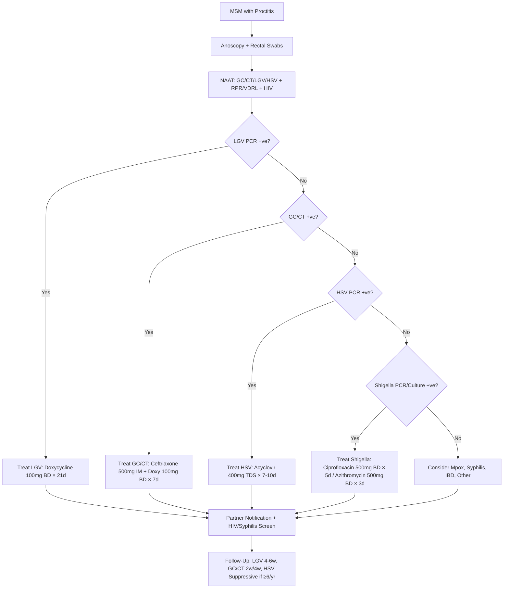

**Parent Topic:** [STI MOC](../Sexually%20Transmitted%20Infections%20MOC.md) → [STI Hierarchy](../Davidson%20Chapter%2013%20-%20STI%20Hierarchy.md)  
**Status:** `full-fcps-mrcp-note`  
**Priority:** ⭐⭐⭐ HIGHEST (FCPS/MRCP — WHO Syndromic Management, Clinical Algorithms, Resource-Limited Settings)  
**Source:** Davidson 24th Ed Ch 13; WHO Guidelines (2021); CDC/BASHH; FCPS/MRCP Syllabus

---

## 1. 🎯 Learning Objectives
- [ ] Apply **WHO Syndromic Management** algorithms for all major STI syndromes
- [ ] Manage **Urethral Discharge Syndrome** (Male & Female differentials)
- [ ] Manage **Vaginal Discharge Syndrome** (BV, Candida, Trichomonas, GC/CT)
- [ ] Manage **Genital Ulcer Disease (GUD)** (Syphilis, HSV, Chancroid, LGV, Donovanosis)
- [ ] Manage **Pelvic Inflammatory Disease (PID)** (Diagnosis, Treatment, Complications)
- [ ] Manage **Epididymo-orchitis** (GC/CT, Enteric, TB, Mumps)
- [ ] Manage **Anorectal STIs / Proctitis** (GC/CT, LGV, HSV, Syphilis, Mpox, Shigella)
- [ ] Manage **Oropharyngeal STIs** (GC/CT, HSV, Syphilis, HPV, Mpox)
- [ ] Manage **Neonatal STIs** (Ophthalmia Neonatorum, Pneumonia, Congenital Syphilis)
- [ ] Apply **Partner Notification, Test of Cure, Follow-Up** protocols
- [ ] Answer viva: "Urethral Discharge Algorithm" and "PID Diagnosis" and "GUD Differential" and "Neonatal Ophthalmia"

---

## 2. 🧠 Core Concept: Syndromic Management Framework

```mermaid
flowchart TD
    A[Syndromic Management] --> B[Patient Presents with Syndrome]
    B --> C[Clinical Assessment]
    C --> C1[History (Sexual, Symptoms, Partners)]
    C --> C2[Examination (Genital, Inguinal, Systemic)]
    C --> C3[Point-of-Care Tests (NAAT, Microscopy, Serology)]
    B --> D[Empiric Treatment Covers Most Likely Pathogens]
    D --> E[Partner Notification & Treatment]
    D --> F[Follow-Up & Test of Cure]
    D --> G[Prevention Counselling (Condoms, Vaccination, PrEP)]
    A --> H[Syndromes]
    H --> H1[Urethral Discharge (M/F)]
    H --> H2[Vaginal Discharge]
    H --> H3[Genital Ulcer Disease (GUD)]
    H --> H4[Pelvic Inflammatory Disease (PID)]
    H --> H5[Epididymo-orchitis]
    H --> H6[Anorectal STIs/Proctitis]
    H --> H7[Oropharyngeal STIs]
    H --> H8[Neonatal STIs]
```

---

## 5.1 Urethral Discharge Syndrome (Male)

### Clinical Assessment
| Component | Key Elements |
|-----------|--------------|
| **History** | Dysuria, Urethral Discharge (Purulent/Mucopurulent), Urinary Frequency, Sexual History (New/Multiple Partners, Condom Use, MSM), Previous STIs |
| **Examination** | **Urethral Discharge** (Milk Urethra if Not Spontaneous), Meatal Erythema/Edema, Inguinal Lymphadenopathy, Testicular/Scrotal Exam (Epididymitis), Rectal/Pharyngeal Exam if MSM |

### Differential Diagnosis
| Pathogen | Clinical Clues |
|----------|----------------|
| **Neisseria gonorrhoeae** | **Profuse Purulent Discharge**, Acute Onset (<5 Days), Gram-Neg Intracellular Diplococci on Smear |
| **Chlamydia trachomatis** | **Mucopurulent/Mucoid Discharge**, Subacute (1-3 Weeks), Often Asymptomatic |
| **Mycoplasma genitalium** | **Mucopurulent Discharge**, Persistent/Recurrent NGU, Macrolide Resistance |
| **Trichomonas vaginalis** | **Mild Dysuria**, Scanty Discharge, Motile Flagellates on Microscopy |
| **Ureaplasma/Mycoplasma spp.** | Controversial Pathogenicity, Often Asymptomatic |
| **Non-Infectious** | Chemical Urethritis, Trauma, Foreign Body, Behçet's, Reactive Arthritis |

### WHO Syndromic Algorithm — Male Urethral Discharge
```mermaid
flowchart TD
    A[Male with Urethral Discharge] --> B[Microscopy (Urethral Smear) — Gram Stain]
    B --> C{Gram-Neg Intracellular Diplococci?}
    C -->|Yes| D[Treat for GC + CT<br/>Ceftriaxone 500mg IM + Doxycycline 100mg BD × 7d]
    C -->|No| E[NAAT for GC/CT (If Available)]
    E --> F{NAAT Result}
    F -->|GC/CT +ve| D
    F -->|GC/CT -ve| G[Consider MG/TV/UU<br/>Doxycycline 100mg BD × 7d<br/>(+/- Metronidazole 2g if TV Suspected)]
    D & G --> H[Partner Notification + Treatment]
    H --> I[Test of Cure: GC 2w, CT 4w, MG 4w]
    H --> J[Counselling: Condoms, HIV/STI Screen, Vaccination]
```

### Treatment Regimens (Empiric)
| Scenario | Regimen |
|----------|---------|
| **Gram-Neg Diplococci +ve (Presumptive GC)** | **Ceftriaxone 500mg IM Stat + Doxycycline 100mg BD × 7 Days** |
| **NAAT GC/CT +ve** | **Ceftriaxone 500mg IM Stat + Doxycycline 100mg BD × 7 Days** |
| **NGU (GC/CT Negative)** | **Doxycycline 100mg BD × 7 Days** (Covers CT, MG, UU) |
| **Persistent/Recurrent NGU** | **Test for MG (NAAT) → If +ve: Moxifloxacin 400mg OD × 7-14d**; **Add Metronidazole 2g Stat if TV Suspected** |
| **MSM** | **3-Site Testing (Urethral, Pharyngeal, Rectal)**; **Treat All Positive Sites** |

---

## 5.2 Vaginal Discharge Syndrome (Female)

### Clinical Assessment
| Component | Key Elements |
|-----------|--------------|
| **History** | Vaginal Discharge (Colour, Consistency, Odour), Vulval Pruritus/Burning, Dysuria, Dyspareunia, Intermenstrual/Post-Coital Bleeding, Contraception, Sexual History, Pregnancy Status |
| **Examination** | **Vulval Inspection** (Erythema, Oedema, Lesions), **Speculum Exam** (Cervix: Ectopy, Friability, Discharge, Strawberry Cervix), **Bimanual Exam** (Adnexal Tenderness, Cervical Motion Tenderness — PID Screen) |
| **POC Tests** | **pH Paper**, **Whiff Test (KOH)**, **Wet Mount (Saline/KOH)**, **NAAT (GC/CT/TV/MG)**, **Rapid Syphilis/HIV** |

### Differential Diagnosis
| Syndrome | Key Features | pH | Microscopy | Treatment |
|----------|--------------|-----|------------|-----------|
| **Bacterial Vaginosis (BV)** | Thin Grey-White Homogeneous Discharge, **Fishy Odour (Amine)**, No/Vague Inflammation | **>4.5** | **Clue Cells**, Few WBCs | **Metronidazole 400mg BD × 7d** / Tinidazole 2g Stat |
| **Vulvovaginal Candidiasis (VVC)** | **Thick White "Cottage Cheese"**, **Pruritus**, Vulvar Erythema/Oedema, Satellite Lesions | **<4.5** | **KOH: Hyphae/Pseudohyphae/Buds** | **Fluconazole 150mg Stat** / Topical Azole |
| **Trichomoniasis** | **Frothy Yellow-Green**, **Strawberry Cervix**, Vulval Erythema, Pruritus | **>4.5** | **Wet Mount: Motile Trichomonads (Pear-Shaped)** | **Metronidazole 2g Stat** / Tinidazole 2g Stat |
| **Gonorrhoea/Chlamydia** | Mucopurulent Cervicitis, Ectopy, Friability, ICB/IM Bleeding | **Normal/↑** | **NAAT GC/CT** | **Ceftriaxone 500mg IM + Doxycycline 100mg BD × 7d** |
| **Mixed/Co-infection** | Features of Multiple | Variable | Multiple Positive | Treat All Identified |

### WHO Syndromic Algorithm — Female Vaginal Discharge
```mermaid
flowchart TD
    A[Female with Vaginal Discharge] --> B[Speculum Exam + pH + Whiff + Wet Mount (Saline/KOH)]
    B --> C{Microscopy Result}
    C -->|Clue Cells + Whiff+| D[Treat for BV<br/>Metronidazole 400mg BD × 7d / Tinidazole 2g]
    C -->|KOH: Hyphae/Pseudohyphae| E[Treat for Candida<br/>Fluconazole 150mg Stat / Topical Azole]
    C -->|Motile Trichomonads| F[Treat for Trichomonas<br/>Metronidazole 2g Stat / Tinidazole 2g]
    C -->|Mucopurulent Cervicitis / ICB/IM Bleeding| G[NAAT GC/CT<br/>If +ve: Ceftriaxone 500mg IM + Doxy 100mg BD × 7d]
    C -->|None of Above / Mixed| H[Treat Empirically for Most Likely<br/>(BV + Candida Common) OR Refer]
    D & E & F & G & H --> I[Partner Notification (If STI)]
    I --> J[Follow-Up / Test of Cure (GC 2w, CT 4w, TV 4w)]
    I --> K[Counselling: Condoms, Contraception, HPV Vaccine, HIV Screen]
```

### Treatment Summary (Vaginal Discharge)

| Syndrome | 1st Line | Alternative | Pregnancy |
|----------|----------|-------------|-----------|
| **BV** | **Metronidazole 400mg BD × 7d** | **Tinidazole 2g Stat** / **Metronidazole 0.75% Gel × 5d** | **Metronidazole 400mg BD × 7d** (Safe) |
| **Candida (Uncomplicated)** | **Fluconazole 150mg Stat** | **Clotrimazole 500mg Pessary × 1d / Miconazole 200mg × 3-7d** | **Topical Azole Only** (Clotrimazole 500mg × 7d) |
| **Trichomonas** | **Metronidazole 2g Stat** | **Tinidazole 2g Stat** | **Metronidazole 2g Stat** (Safe) |
| **GC/CT Cervicitis** | **Ceftriaxone 500mg IM + Doxy 100mg BD × 7d** | **Azithromycin 1g Stat (If Doxy Contraindicated)** | **Ceftriaxone 500mg IM + Azithromycin 1g Stat** |

---

## 5.3 Genital Ulcer Disease (GUD) Syndrome

### Clinical Assessment
| Component | Key Elements |
|-----------|--------------|
| **History** | Ulcer Onset/Duration, Pain (Painless vs Painful), Number of Ulcers, Systemic Symptoms (Fever, Lymphadenopathy), Sexual History, HIV Status |
| **Examination** | **Ulcer(s): Number, Size, Edge (Indurated/Undermined), Base (Clean/Purulent), Pain (Palpation), Induration**, **Lymphadenopathy (Regional: Inguinal/Femoral, Characteristics: Tender/Non-Tender, Suppurative/Non-Suppurative, Matted)**, **Other Sites (Oral, Anal, Perianal)** |
| **POC Tests** | **RPR/VDRL + TPPA (Syphilis)**, **HSV PCR (Lesion Swab)**, **H. ducreyi PCR (Chancroid)**, **LGV PCR (C. trachomatis L1-3)**, **Dark Field Microscopy (Syphilis)** |

### Differential Diagnosis
| Pathogen | Ulcer Characteristics | Lymphadenopathy | Key Features |
|----------|----------------------|-----------------|--------------|
| **Treponema pallidum (Syphilis)** | **Single, Painless, Clean Base, Indurated, Sharply Demarcated** | **Non-Tender, Rubbery, Bilateral/Regional** | **Chancre (Primary)**, Serology (RPR/VDRL + TPPA) |
| **Herpes Simplex (HSV-1/2)** | **Multiple, Painful, Vesicles → Shallow Ulcers, Irregular Edges** | **Tender, Bilateral** | **Vesicles → Ulcers**, Recurrent, PCR +ve |
| **Haemophilus ducreyi (Chancroid)** | **Painful, Soft, Undermined Edges, Ragged, Purulent Base, Bleeds Easily** | **Suppurative Buboes (Unilateral, Fluctuant, Tender, Mire)** | **Multiple Ulcers**, **H. ducreyi PCR** |
| **LGV (C. trachomatis L1-3)** | **Painless (Primary) → Proctitis/Buboes (Secondary)** | **Suppurative Buboes (Groin/Femoral)**, Fistulae | **MSM, Proctocolitis**, **LGV PCR (L1-3)** |
| **Donovanosis (Klebsiella granulomatis)** | **Progressive, Painless, Beefy Red, Granulomatous, Bleeds on Touch** | **Inguinal Lymphadenopathy (Rare)** | **Endemic Areas**, **K. granulomatis PCR** |

### WHO Syndromic Algorithm — GUD
```mermaid
flowchart TD
    A[Patient with Genital Ulcer] --> B[Clinical Assessment: Pain, Number, Edges, Base, Lymphadenopathy]
    B --> C{Ulcer Painless, Indurated, Clean Base + Non-Tender Lymphadenopathy?}
    C -->|Yes| D[Syphilis Likely<br/>RPR/VDRL + TPPA<br/>Benzathine Penicillin G 2.4MU IM Single Dose]
    C -->|No| E{Ulcer Painful, Vesicles → Ulcers, Tender Lymphadenopathy?}
    E -->|Yes| F[HSV Likely<br/>HSV PCR (Lesion Swab)<br/>Acyclovir 400mg TDS × 7-10d]
    E -->|No| G{Ulcer Painful, Soft, Undermined Edges, Purulent + Suppurative Buboes?}
    G -->|Yes| H[Chancroid Likely<br/>H. ducreyi PCR<br/>Azithromycin 1g Stat / Ceftriaxone 250mg IM]
    G -->|No| I{LGV Suspected (MSM, Proctitis, Buboes)?}
    I -->|Yes| J[LGV PCR (L1-3)<br/>Doxycycline 100mg BD × 21d]
    I -->|No| K[Consider Donovanosis/Other<br/>Refer/Specialist]
    D & F & H & J & K --> L[RPR/VDRL + TPPA for ALL GUD]
    L --> M[Partner Notification + HIV Test]
    M --> N[Follow-Up: Syphilis RPR 3/6/12m; HSV Suppressive if ≥6/yr]
```

### Treatment Summary (GUD)

| Syndrome | Treatment | Notes |
|----------|-----------|-------|
| **Syphilis (Primary/Secondary/Early Latent)** | **Benzathine Penicillin G 2.4MU IM Single Dose** | **Late Latent/Tertiary: ×3 Weekly Doses** |
| **HSV (Primary/Recurrent)** | **Acyclovir 400mg TDS × 7-10d (Primary) / ×5d (Recurrent)** | **Suppressive if ≥6/yr: Valacyclovir 500mg OD** |
| **Chancroid** | **Azithromycin 1g Stat** / **Ceftriaxone 250mg IM** | **Bubo Needle Aspiration** |
| **LGV** | **Doxycycline 100mg BD × 21 Days** | **Erythromycin if Pregnant** |
| **Donovanosis** | **Azithromycin 1g Weekly × 3-4 Weeks** / **Doxycycline 100mg BD × 3 Weeks** | **Endemic Areas** |

---

## 5.4 Pelvic Inflammatory Disease (PID) Syndrome

### Diagnostic Criteria (CDC/WHO)
| Criteria | Minimum Required |
|----------|------------------|
| **Major** | **Lower Abdominal Tenderness**, **Adnexal Tenderness**, **Cervical Motion Tenderness** (All 3 = High Specificity) |
| **Minor/Supportive** | Fever >38.3°C, Abnormal Vaginal/Cervical Discharge, **Leukocytosis**, **Elevated CRP/ESR**, **Microscopy: WBCs on Wet Mount**, **Positive NAAT GC/CT**, **Fever**, **Temperature >38°C** |

> **Diagnosis**: **Empiric Treatment** if **All Major Criteria Present** + **No Alternative Diagnosis**; **Low Threshold** in Young Sexually Active Women

### Clinical Assessment
| Component | Key Elements |
|-----------|--------------|
| **History** | Lower Abdominal Pain (Bilateral), Abnormal Vaginal Discharge, Fever, Dyspareunia, Abnormal Bleeding, Recent Sexual Exposure, IUD Insertion, Previous PID/STI |
| **Examination** | **Cervical Motion Tenderness**, **Adnexal Tenderness**, **Uterine Tenderness**, **Cervicitis** (Mucopurulent Discharge, Ectopy, Friability), **Adnexal Mass** (TOA), **Fever**, **Rebound Tenderness** (Peritonitis) |
| **Investigations** | **NAAT GC/CT (Urine/Swab)**, **RPR/VDRL**, **HSV/HIV**, **CBC, CRP, ESR**, **Urinalysis**, **Pregnancy Test (β-hCG)**, **Transvaginal US** (TOA, Hydrosalpinx, Free Fluid) |

### WHO Syndromic Algorithm — PID
```mermaid
flowchart TD
    A[Woman with Lower Abdominal Pain] --> B{Pelvic Exam: CMT + Adnexal Tenderness + CMT?}
    B -->|Yes (All 3)| C[Empiric PID Treatment]
    B -->|Partial/Uncertain| D[Additional Criteria: Fever, Discharge, Leukocytosis, CRP↑, GC/CT+]
    D --> E{≥1 Additional Criterion?}
    E -->|Yes| C
    E -->|No| F[Consider Alternative (Appendicitis, Ectopic, Endometriosis, UTI, IBS)]
    C --> G[Empiric Treatment:<br/>Ceftriaxone 500mg IM Stat<br/>+ Doxycycline 100mg BD × 14d<br/>+ Metronidazole 400mg BD × 14d<br/>(+/- Azithromycin 1g if MG Suspected)]
    G --> H{Severe / TOA / Pregnancy / Failed Outpatient?}
    H -->|Yes| I[Admit IV:<br/>Ceftriaxone 2g IV q24h<br/>+ Doxycycline 100mg IV/PO BD<br/>+ Metronidazole 500mg IV q8h<br/>(+/- Clindamycin if TOA)]
    H -->|No| J[Outpatient + Follow-Up 72h]
    C & I & J --> K[Partner Notification + Treatment]
    K --> L[Test of Cure: GC 2w, CT 4w; Follow-Up 7d, 30d]
    L --> M[Contraception Counselling, IUD Removal if Present, HIV/Syphilis Screen]
```

### Treatment Regimens

| Setting | Regimen |
|---------|---------|
| **Outpatient (Mild-Moderate)** | **Ceftriaxone 500mg IM Stat + Doxycycline 100mg BD × 14d + Metronidazole 400mg BD × 14d** |
| **Inpatient (Severe/TOA/Pregnancy/Failed OP)** | **Ceftriaxone 2g IV q24h + Doxycycline 100mg IV/PO BD + Metronidazole 500mg IV q8h** (+ Clindamycin 900mg IV q8h if TOA Suspected) |
| **IUD In Situ** | **Remove IUD If Possible** (After 1-2 Days Antibiotics) |
| **TOA (Tubo-Ovarian Abscess)** | **IV Antibiotics (As Above) + Image-Guided Drainage** (If >5cm or Failed 48-72h Medical) |

### Complications & Sequelae
| Complication | Incidence | Impact |
|--------------|-----------|--------|
| **Infertility (Tubal Factor)** | **10-15% per Episode** | **Cumulative (3 Episodes → 50-75%)** |
| **Ectopic Pregnancy** | **6-10x Increased Risk** | **Life-Threatening** |
| **Chronic Pelvic Pain** | **18-30%** | **Quality of Life Impact** |
| **TOA** | **5-10%** | **Sepsis Risk, May Need Drainage/Surgery** |
| **Fitz-Hugh-Curtis Syndrome** | **4-14%** | **Perihepatitis, RUQ Pain, Violin String Adhesions** |

---

## 5.5 Epididymo-orchitis Syndrome

### Clinical Assessment
| Component | Key Elements |
|-----------|--------------|
| **History** | Acute Scrotal Pain (Unilateral), Swelling, Dysuria, Urethral Discharge, Fever, Sexual History, Trauma, Mumps Exposure, TB Risk |
| **Examination** | **Tender, Swollen Epididymis/Testis**, **Erythema/Oedema Scrotum**, **Prehn's Sign** (Relief on Elevation), **Cremasteric Reflex Absent**, **Urethral Discharge**, **Inguinal Lymphadenopathy** |
| **Investigations** | **NAAT GC/CT (Urine/Urethral Swab)**, **Urine Culture**, **Scrotal Doppler US** (Rule Out Torsion), **RPR/VDRL**, **HIV**, **TB Screen (If Chronic/Atypical)** |

### Differential Diagnosis
| Aetiology | Age Group | Key Features |
|-----------|-----------|--------------|
| **GC/CT (STI)** | **<35 Years** | Urethral Discharge, Acute Onset, Sexually Active |
| **Enteric Organisms (E. coli, Pseudomonas)** | **>35 Years / Urinary Abnormalities / Catheter** | No Urethral Discharge, Urinary Symptoms, Recurrent UTI |
| **Mumps** | **Post-Pubertal Males** | Parotitis Precedes Orchitis (4-8 Days), Bilateral (20-30%) |
| **TB** | **Endemic Areas / Immunocompromised** | Chronic, Painless, Constitutional Symptoms, Positive Mantoux/IGRA |
| **Behçet's** | **Young Adults** | Oral/Genital Ulcers, Uveitis, Pathergy |
| **Torsion (Surgical Emergency)** | **Adolescents** | **Sudden Severe Pain**, **High-Riding Testis**, **Absent Cremasteric Reflex**, **Urgent US** |

### Treatment

| Aetiology | Regimen |
|-----------|---------|
| **GC/CT (STI)** | **Ceftriaxone 500mg IM Stat + Doxycycline 100mg BD × 10-14 Days** |
| **Enteric (E. coli, Pseudomonas)** | **Ciprofloxacin 500mg BD × 10-14d** / **Ofloxacin 200mg BD × 10-14d** |
| **Mumps** | **Supportive** (Analgesia, Scrotal Support, Ice Packs) |
| **TB** | **Standard Anti-TB Regimen (6 Months)** |
| **Supportive (All)** | **Scrotal Elevation, Ice Packs (Intermittent), NSAIDs/Opioids, Scrotal Support** |

---

## 5.6 Anorectal STIs / Proctitis Syndrome

### Clinical Assessment
| Component | Key Elements |
|-----------|--------------|
| **History** | Anal/Rectal Pain, Discharge, Bleeding, Tenesmus, Diarrhoea/Constipation, Sexual History (MSM, Receptive Anal), HIV Status |
| **Examination** | **Perianal Inspection** (Lesions, Warts, Ulcers, Fissures, Tags), **Digital Rectal Exam** (Tenderness, Mass, Blood), **Anoscopy/Proctoscopy** (Mucosal Erythema, Ulcers, Discharge, Ulcers, Masses) |
| **Investigations** | **NAAT GC/CT/LGV/HSV (Rectal Swab)**, **RPR/VDRL**, **HIV**, **Shigella Culture/PCR**, **Mpox PCR** |

### Differential Diagnosis (MSM Focus)
| Pathogen | Clinical Features |
|----------|-------------------|
| **GC/CT** | Mucopurulent Discharge, Mild Proctitis |
| **LGV (C. trachomatis L1-3)** | **Proctocolitis (Rectal Pain, Bloody Mucus, Tenesmus, Constipation), Suppurative Inguinal Buboes** |
| **HSV** | **Vesicles → Ulcers**, Painful, Recurrent |
| **Syphilis** | **Painless Ulcer (Primary), Mucous Patches (Secondary)** |
| **Mpox** | **Genital/Perianal Lesions, Proctitis, Lymphadenopathy** |
| **Shigella** | **Dysentery (Bloody Diarrhoea, Fever, Tenesmus)** |

### WHO Syndromic Algorithm — Proctitis (MSM)


### Treatment Summary (Proctitis)

| Pathogen | Treatment |
|----------|-----------|
| **LGV** | **Doxycycline 100mg BD × 21 Days** |
| **GC/CT** | **Ceftriaxone 500mg IM Stat + Doxycycline 100mg BD × 7 Days** |
| **HSV** | **Acyclovir 400mg TDS × 7-10 Days** (Suppressive if Recurrent) |
| **Syphilis** | **Stage-Appropriate Penicillin** |
| **Mpox** | **Supportive / Tecovirimat if Severe** |
| **Shigella** | **Ciprofloxacin 500mg BD × 5d / Azithromycin 500mg BD × 3d** |

---

## 5.7 Oropharyngeal STIs Syndrome

### Clinical Assessment
| Component | Key Elements |
|-----------|--------------|
| **History** | Sore Throat, Dysphagia, Odynophagia, Cervical Lymphadenopathy, Oral Lesions, Sexual History (Oral Sex, MSM), HIV Status |
| **Examination** | **Oropharyngeal Exam** (Tonsillar Exudate, Ulcers, Vesicles, Erythema, Lymphadenopathy), **Genital Exam** (Concurrent STI Screen) |
| **Investigations** | **NAAT GC/CT (Pharyngeal Swab)**, **HSV PCR (Lesion Swab)**, **RPR/VDRL**, **HIV**, **Mpox PCR (If Lesions)** |

### Differential & Treatment

| Pathogen | Features | Treatment |
|----------|----------|-----------|
| **GC (Pharyngeal Gonorrhoea)** | Often Asymptomatic; Sore Throat, Exudate | **Ceftriaxone 1g IM Stat + Azithromycin 1g Stat**; **TOC Mandatory at 2 Weeks** |
| **CT (Pharyngeal Chlamydia)** | Rare Symptomatic | **Doxycycline 100mg BD × 7 Days** / **Azithromycin 1g Stat** |
| **HSV** | Vesicles → Ulcers, Painful | **Acyclovir 400mg TDS × 7-10d** |
| **Syphilis** | Mucous Patches, Snail-Track Ulcers | **Stage-Appropriate Penicillin** |
| **Mpox** | Oral/Perioral Lesions | **Supportive / Tecovirimat if Severe** |
| **HPV** | Oral Warts (Rare), Oropharyngeal Cancer | **Surveillance / Vaccination** |

> **Key**: **Pharyngeal GC → Higher Ceftriaxone Dose (1g IM) + Mandatory TOC at 2 Weeks**

---

## 5.8 Neonatal STIs Syndrome

### Clinical Assessment
| Component | Key Elements |
|-----------|-------------|
| **History** | Maternal STI Status (Syphilis, GV, CT, HSV, HBV, HCV, HIV), Delivery Mode, Gestational Age, Birth Weight, Breastfeeding |
| **Examination** | **Conjunctiva** (Discharge, Redness, Swelling), **Skin** (Rash, Vesicles, Ulcers, Pustules), **Oral Mucosa** (White Patches, Ulcers), **Genitalia** (Discharge, Lesions), **Neurological** (Tone, Reflexes, Seizures), **Respiratory** (Distress, Pneumonia), **Growth Parameters** |

### Neonatal STI Syndromes

| Syndrome | Key Features | Aetiology | Urgent Action |
|----------|--------------|-----------|---------------|
| **Ophthalmia Neonatorum** | **Conjunctival Injection, Swelling, Discharge (Purulent/Mucopurulent)** | **GC (Day 2-5, Hyperacute)**, **CT (Day 5-14, Mucopurulent)**, **HSV (Day 7-14, Vesicles)**, **Chemical (Day 1, Mild)** | **Urgent Eye Swabs (GC/CT/HSV PCR, Gram Stain, Culture)** → **Empiric Ceftriaxone 50mg/kg IM/IV Single Dose** (Pending Results) |
| **Neonatal HSV** | **SEM (Skin/Eye/Mouth), CNS (Encephalitis), DIS (Disseminated)** | **HSV-1/2** (Vertical Transmission) | **IV Acyclovir 20mg/kg IV q8h** (14d SEM, 21d CNS/DIS + 6mo Oral Suppression) |
| **Neonatal Pneumonia (CT)** | **Staccato Cough, Tachypnoea, Hypoxaemia, 3-16 Weeks** | **Chlamydia trachomatis** | **Azithromycin 20mg/kg OD × 10-14 Days** |
| **Congenital Syphilis** | **Snuffles, Rash, Hepatosplenomegaly, Osteochondritis, Pseudoparalysis** | **Treponema pallidum** | **Penicillin G IV 50,000 U/kg q12h × 7d → q8h × 3d (10 Days Total)** |
| **Neonatal Gonorrhoea (Scalp Abscess)** | **Fluctuant Scalp Swelling (Fetal Scalp Electrode/Forceps)** | **Neisseria gonorrhoeae** | **I&D + Ceftriaxone 50mg/kg IM/IV × 7 Days** |

### Neonatal Ophthalmia — Empiric Algorithm
```mermaid
flowchart TD
    A[Neonate with Conjunctivitis] --> B[Urgent Swabs: Gram Stain, GC/CT/HSV PCR, Culture]
    B --> C{Early/Severe (Day 2-5, Hyperacute)?}
    C -->|Yes| D[Empiric Ceftriaxone 50mg/kg IM/IV Single Dose + Topical Erythromycin]
    C -->|No| E{Mucopurulent (Day 5-14)?}
    E -->|Yes| F[Empiric Ceftriaxone 50mg/kg IM/IV Single Dose + Azithromycin 20mg/kg OD × 3d (If CT Suspected)]
    E -->|No| G[Consider HSV (Vesicles), Chemical (Day 1), Other]
    D & F & G --> H[Definitive Treatment Based on PCR/Culture Results]
    H --> I[Parental STI Screen + Partner Notification]
```

### Partner Notification — Neonatal STIs
| Scenario | Action |
|----------|--------|
| **Neonatal GC/CT/HSV/Syphilis** | **Maternal + Partner(s) Screening & Treatment** |
| **Maternal STI Identified** | **Full STI Screen (HIV, Syphilis, HBV, HCV, GC, CT, HSV, Trichomonas)** |
| **Partner(s)** | **Treat as Per Maternal Infection** |

---

## 3. ⚡ FCPS/MRCP High-Yield Summary

| Syndrome | Key Algorithm Points |
|----------|----------------------|
| **Urethral Discharge (M)** | **Gram-Neg Diplococci → GC+CT (Ceftriaxone 500mg IM + Doxy 7d)**; **NAAT GC/CT+ve → Same**; **GC/CT-ve → Doxy 7d (NGU)** |
| **Vaginal Discharge** | **BV: Clue Cells/Whiff+ → Metro/Tini**; **Candida: KOH Hyphae → Fluconazole/Topical**; **Trich: Motile Trichomonas → Metro/Tini 2g**; **Cervicitis: GC/CT NAAT → Ceftriaxone + Doxy** |
| **GUD** | **Painless+Indurated+Non-Tender LAD = Syphilis (BPC 2.4MU IM)**; **Painful+Vesicles = HSV (Acyclovir)**; **Painful+Undermined+Suppurative Buboes = Chancroid (Azi 1g/Ceftriaxone)**; **LGV: Doxy 21d** |
| **PID** | **CMT + Adnexal Tenderness + Uterine Tenderness = Empiric Tx** → **Ceftriaxone 500mg IM + Doxy 14d + Metro 14d** |
| **Epididymo-orchitis** | **<35y: GC/CT (Ceftriaxone + Doxy 10-14d)**; **>35y/Urinary Abnormalities: Enteric (Cipro/Ofloxacin 10-14d)** |
| **Proctitis (MSM)** | **LGV (Doxy 21d) > GC/CT (Ceftriaxone+Doxy) > HSV (Acyclovir) > Shigella (Cipro/Azi)** |
| **Neonatal Ophthalmia** | **Day 2-5 Hyperacute = GC (Ceftriaxone 50mg/kg IM)**; **Day 5-14 = CT (Azi 20mg/kg OD × 3d)**; **HSV = IV Aci 20mg/kg q8h** |
| **Partner Notification** | **All STI Syndromes: Treat Partners (Last 60d GC/CT/Trich, 3-12m Syphilis, 60d HSV/HPV)** |
| **Test of Cure** | **GC: 2 Weeks; CT/TV/MG: 4 Weeks; LGV: 4-6 Weeks; Syphilis: RPR 3/6/12m** |

---

## 4. 🎤 Viva Questions (Expected Answers)

| # | Question | Expected Answer |
|---|----------|-----------------|
| 1 | Male urethral discharge — WHO syndromic algorithm? | **Gram Stain → Gram-Neg Diplococci → Ceftriaxone 500mg IM + Doxy 7d**; **GC/CT NAAT+ve → Same**; **GC/CT-ve → Doxy 7d (NGU)** |
| 2 | Female vaginal discharge — syndromic approach? | **Speculum + pH + Whiff + Wet Mount**; **Clue Cells/Whiff+ = BV (Metro/Tini)**; **KOH Hyphae = Candida (Fluconazole/Topical)**; **Motile Trichomonads = Trich (Metro/Tini 2g)**; **Cervicitis = GC/CT NAAT → Ceftriaxone + Doxy** |
| 3 | Genital ulcer — differential diagnosis and management? | **Painless+Indurated+Non-Tender LAD = Syphilis (BPC Single Dose)**; **Painful+Vesicles = HSV (Acyclovir)**; **Painful+Undermined+Suppurative Buboes = Chancroid (Azi/Ceftriaxone)**; **LGV = Proctitis/Buboes (Doxy 21d)** |
| 4 | PID — diagnostic criteria and empirical treatment? | **CMT + Adnexal Tenderness + Uterine Tenderness = Empiric Tx**; **Ceftriaxone 500mg IM + Doxy 14d + Metro 14d**; **Severe/TOA/Preg = IV Ceftriaxone 2g + Doxy IV + Metro IV** |
| 5. Epididymo-orchitis — aetiology by age and treatment? | **<35y: GC/CT → Ceftriaxone + Doxy 10-14d**; **>35y/Urinary Abnormalities: Enteric (Cipro/Ofloxacin 10-14d)**; **Mumps: Supportive; TB: Anti-TB** |
| 6. Proctitis in MSM — syndromic algorithm? | **Anoscopy + Rectal Swabs (GC/CT/LGV/HSV/Shigella PCR + RPR + HIV)**; **LGV PCR+ → Doxy 21d**; **GC/CT+ → Ceftriaxone+Doxy**; **HSV+ → Acyclovir**; **Shigella → Cipro/Azi** |
| 7. Neonatal ophthalmia — aetiology by age and treatment? | **Day 2-5 Hyperacute = GC (Ceftriaxone 50mg/kg IM)**; **Day 5-14 = CT (Azi 20mg/kg OD × 3d)**; **HSV = IV Aci 20mg/kg q8h × 14-21d** |
| 8. Partner notification — lookback periods? | **GC/CT/Trich: 60 Days**; **Syphilis: 1° 3m, 2° 6m, Early Latent 1y, Late Latent Long-Term Partners**; **HSV/HPV: 60 Days** |
| 9. Test of Cure intervals? | **GC: 2 Weeks; CT/TV/MG: 4 Weeks; LGV: 4-6 Weeks; Syphilis: RPR 3/6/12 Months** |
| 10. Neonatal HSV — classification and IV acyclovir duration? | **SEM: 14 Days; CNS: 21 Days + 6 Months Oral Suppression; DIS: 21 Days**; **IV Acyclovir 20mg/kg q8h** |

---

## 5. 🧩 Confusions & Mnemonics

| Confusion | Clarification |
|-----------|---------------|
| **"All Urethral Discharge = GC"** | **NO.** **NGU (CT, MG, TV) Common**; **Gram Stain/NAAT Differentiates** |
| **"All Vaginal Discharge = Candida"** | **NO.** **BV Most Common; Trichomonas Common; Co-infections Frequent** |
| **"PID = Only STI"** | **NO.** **Endogenous Flora (Anaerobes, GBS) Also Cause**; **Empiric Covers Polymicrobial** |
| **"All GUD = Syphilis"** | **NO.** **HSV Most Common in Many Settings; Chancroid, LGV, Donovanosis Also** |
| **"Epididymitis = Always STI in Young Men"** | **NO.** **Enteric Organisms in Older Men/Urinary Abnormalities** |
| **"Proctitis = Only LGV in MSM"** | **NO.** **GC/CT Most Common; HSV, Syphilis, Shigella, Mpox Also** |
| **"Neonatal Ophthalmia = Only GC"** | **NO.** **CT (Day 5-14), HSV (Day 7-14), Chemical (Day 1)** |
| **"PID = Always Needs Admission"** | **NO.** **Mild-Moderate = Outpatient (Ceftriaxone IM + Doxy + Metro)** |
| **"All Scrotal Pain = Torsion"** | **NO.** **Epididymitis Common; Torsion = Surgical Emergency (Absent Cremasteric, High-Riding)** |
| **"All Neonatal Eye Discharge = GC"** | **NO.** **CT (Day 5-14), HSV (Day 7-14), Chemical (Day 1)** |

> **Mnemonic: SYNDROMIC MASTER ALGORITHMS**  
> **S**yndromic: **Treat Syndrome Empirically (Cover Most Likely Pathogens), Confirm Later**  
> **Y** (Why Syndromic?): **Resource-Limited, Rapid, Covers Co-Infections, Public Health Impact**  
> **N**ext Step: **Partner Notification (Lookback: GC/CT/Trich 60d, Syphilis 3m-1y+, HSV/HPV 60d)**  
> **D**ischarge Male: **Gram Stain → GC+CT (Ceftriaxone+Doxy); NAAT; NGU=Doxy**  
> **R**eproductive Female: **BV (Clue/Whiff=Metro), Candida (KOH=Fluc), Trich (Motile=Metro), Cervicitis (GC/CT=Ceph+Doxy)**  
> **O**rganism GUD: **Syphilis (Painless+Indurated=BPC), HSV (Painful+Vesicles=Aci), Chancroid (Painful+Bubo=Azi), LGV (Proctitis=Doxy21d)**  
> **M**ID: **CMT+Adnexal+CMT = PID → Ceftriaxone+Doxy+Metro**  
> **I**n Epididymitis: **<35y=GC/CT (Ceph+Doxy); >35y=Enteric (Cipro)**  
> **C**ondition Proctitis MSM: **LGV (Doxy21d) > GC/CT (Ceph+Doxy) > HSV (Aci) > Shigella (Cipro)**  
> **N**eonatal Eye: **Day 2-5 GC (Ceph 50mg/kg); Day 5-14 CT (Azi); HSV (IV Aci)**  
> **I**nfant HSV: **SEM 14d, CNS 21d+6mo Oral, DIS 21d** (IV Aci 20mg/kg q8h)  
> **C**ondition PID: **CMT+Adnexal+CMT = Empiric Tx**  
> **A**ll STIs: **Partner Notify (GC/CT/Trich 60d; Syphilis 3m-1y+; HSV/HPV 60d)**  
> **T**est of Cure: **GC 2w, CT/TV/MG 4w, LGV 4-6w, Syphilis RPR 3/6/12m**  
> **S**tage Syphilis: **1°=Chancre (BPC Single); 2°=Rash (BPC Single); Early Latent (BPC Single); Late Latent/Tertiary (BPC ×3w); Neuro (Pen G IV 10-14d); Congenital (Pen G IV 10d)**  

---

## 6. 🗺️ Mind Map

```mermaid
mindmap
  root((Syndromic Management))
    Urethral Discharge (M)
      Gram Stain → GC+CT → Ceph+Doxy
      NAAT → GC/CT → Ceph+Doxy
      NGU → Doxy
    Vaginal Discharge (F)
      BV: Clue/Whiff → Metro
      Candida: KOH Hyphae → Fluconazole
      Trich: Motile → Metro/Tini
      Cervicitis: GC/CT NAAT → Ceph+Doxy
    Genital Ulcer Disease
      Syphilis: Painless/Indurated → BPC
      HSV: Painful/Vesicles → Aci
      Chancroid: Painful/Bubo → Azi
      LGV: Proctitis → Doxy 21d
    PID
      CMT+Adnexal+CMT → Ceph+Doxy+Metro
      Severe: IV Ceph 2g + Doxy IV + Metro IV
    Epididymitis
      <35y: GC/CT → Ceph+Doxy
      >35y: Enteric → Cipro
    Proctitis (MSM)
      LGV: Doxy 21d
      GC/CT: Ceph+Doxy
      HSV: Aci
      Shigella: Cipro
    Neonatal
      Eye: Day 2-5 GC (Ceph 50mg/kg); Day 5-14 CT (Azi); HSV (IV Aci)
      HSV: SEM 14d, CNS 21d+6mo Oral
      Congenital Syphilis: Pen G IV 10d
    Partner Notification
      GC/CT/Trich: 60d
      Syphilis: 3m-1y+
      HSV/HPV: 60d
    Test of Cure
      GC: 2w; CT/TV/MG: 4w; LGV: 4-6w; Syphilis: 3/6/12m
```

---

## 7. 📅 Spaced Repetition Tracker

| Review | Date | Score (0–5) | Notes |
|--------|------|-------------|-------|
| Day 1 | | | |
| Day 3 | | | |
| Day 7 | | | |
| Day 14 | | | |
| Day 30 | | | |
| Day 90 | | | |

---

## 8. 📝 Self-Test Scorecard

| Section | Max | Score | % |
|---------|-----|-------|---|
| Urethral Discharge (M) | 3 | | |
| Vaginal Discharge (F) | 3 | | |
| Genital Ulcer Disease | 3 | | |
| PID | 3 | | |
| Epididymo-orchitis | 2 | | |
| Proctitis (MSM) | 2 | | |
| Neonatal STIs | 3 | | |
| Partner Notification & TOC | 2 | | |
| **Total** | **20** | | |

---

## 9. 💬 Exam Answer Modes

| Format | Prompt | Key Points |
|--------|--------|------------|
| **Long Essay** | "Describe the WHO syndromic management of male urethral discharge, female vaginal discharge, and genital ulcer disease." | **Urethral (M): Gram Stain → GC+CT (Ceph+Doxy); NAAT; NGU=Doxy**; **Vaginal (F): BV (Clue/Whiff=Metro), Candida (KOH=Fluconazole), Trich (Motile=Metro), Cervicitis=GC/CT NAAT**; **GUD: Syphilis (Painless/Indurated=BPC), HSV (Painful/Vesicles=Aci), Chancroid (Painful+Bubo=Azi), LGV (Doxy21d)** |
| **Short Note** | "WHO syndromic management of PID." | **Diagnosis: CMT + Adnexal Tenderness + Uterine Tenderness = Empiric Tx**; **Outpatient: Ceftriaxone 500mg IM + Doxy 14d + Metro 14d**; **Inpatient: IV Ceftriaxone 2g + Doxy IV + Metro IV (+ Clindamycin if TOA)** |
| **Viva** | "Young man with urethral discharge. Gram stain shows intracellular Gram-negative diplococci. Management?" | **Presumptive GC → Ceftriaxone 500mg IM + Doxycycline 100mg BD × 7d**; **NAAT GC/CT + Culture**; **Partner Notification (60d)**; **TOC at 2 Weeks (NAAT)** |
| **Ward Round** | "25F with lower abdominal pain, cervical motion tenderness, adnexal tenderness, mucopurulent discharge. Management?" | **PID (Mild-Moderate) → Ceftriaxone 500mg IM + Doxy 100mg BD × 14d + Metronidazole 400mg BD × 14d**; **Partner Notification (60d)**; **TOC GC 2w, CT 4w**; **Remove IUD if Present** |
| **Last-Night** | "Urethral M: Gram Stain GC+CT → Ceph+Doxy; NGU=Doxy. Vaginal F: BV=Metro/Tini, Candida=Fluconazole, Trich=Metro/Tini, Cervicitis=Ceph+Doxy. GUD: Syph=Painless/BPC, HSV=Painful/Aci, Chancroid=Painful+Bubo/Azi, LGV=Doxy21d. PID: CMT+Adnexal+CMT → Ceph+Doxy+Metro. Epididymitis <35y=Ceph+Doxy, >35y=Cipro. Proctitis MSM: LGV>Doxy21d, GC/CT=Ceph+Doxy, HSV=Aci. Neonatal Eye: Day2-5=GC(Ceph50mg/kg), Day5-14=CT(Azi), HSV=IV Aci. Partner Notify: GC/CT/Trich 60d, Syphilis 3m-1y+, HSV 60d. TOC: GC 2w, CT/TV/MG 4w, Syphilis RPR 3/6/12m." | Compressed. |

---

## 10. 📌 Summary
- **Urethral Discharge (M)**: **Gram Stain → GC+CT (Ceftriaxone 500mg IM + Doxy 7d)**; **NAAT GC/CT+ve → Same**; **GC/CT-ve → Doxy 7d (NGU)**
- **Vaginal Discharge (F)**: **BV: Clue Cells/Whiff+ → Metro/Tini**; **Candida: KOH Hyphae → Fluconazole 150mg/Topical**; **Trichomonas: Motile Flagellates → Metro/Tini 2g**; **Cervicitis: GC/CT NAAT+ve → Ceftriaxone + Doxy**
- **GUD**: **Syphilis (Painless, Indurated, Non-Tender LAD) → BPC 2.4MU IM**; **HSV (Painful Vesicles) → Acyclovir**; **Chancroid (Painful, Undermined, Suppurative Buboes) → Azithromycin 1g/Ceftriaxone**; **LGV (Proctitis/Buboes) → Doxycycline 21d**
- **PID**: **CMT + Adnexal + Uterine Tenderness = Empiric Tx** → **Ceftriaxone 500mg IM + Doxy 14d + Metro 14d**
- **Epididymo-orchitis**: **<35y: GC/CT → Ceftriaxone + Doxy 10-14d**; **>35y/Urinary Abnormalities: Enteric → Ciprofloxacin/Ofloxacin 10-14d**
- **Proctitis (MSM)**: **LGV (Doxy 21d) > GC/CT (Ceftriaxone+Doxy) > HSV (Acyclovir) > Shigella (Cipro/Azi)**
- **Neonatal Ophthalmia**: **Day 2-5 = GC (Ceftriaxone 50mg/kg IM)**; **Day 5-14 = CT (Azithromycin 20mg/kg OD × 3d)**; **HSV = IV Acyclovir 20mg/kg q8h**
- **Partner Notification**: **GC/CT/Trich: 60 Days**; **Syphilis: 1° 3m, 2° 6m, Early Latent 1y, Late Latent Long-Term**; **HSV/HPV: 60 Days**
- **Test of Cure**: **GC: 2 Weeks**; **CT/TV/MG: 4 Weeks**; **LGV: 4-6 Weeks**; **Syphilis: RPR 3/6/12 Months**

---

## 11. ❓ MCQs (10)

1. **Male urethral discharge — Gram stain shows intracellular Gram-negative diplococci. Empiric treatment?**  
   A. Doxycycline 100mg BD × 7d  B. **Ceftriaxone 500mg IM + Doxycycline 100mg BD × 7d**  C. Azithromycin 1g Stat  D. Ciprofloxacin 500mg BD  
   *Answer: B. Dual therapy for presumptive GC + CT.*

2. **Vaginal discharge — clue cells present, positive whiff test. Diagnosis and treatment?**  
   A. Candidiasis, Fluconazole  C. **Bacterial Vaginosis, Metronidazole 400mg BD × 7d**  C. Trichomoniasis, Metronidazole 2g  D. Gonorrhoea, Ceftriaxone  
   *Answer: B. BV = Clue Cells + Whiff Test + pH>4.5 → Metronidazole/Tinidazole.*

3. **Genital ulcer — painful, undermined edges, purulent base, suppurative inguinal buboes. Diagnosis?**  
   A. Primary Syphilis  B. HSV  C. **Chancroid**  D. LGV  
   *Answer: C. Chancroid = Painful, Soft/Undermined Ulcers, Suppurative Buboes.*

4. **Pelvic Inflammatory Disease — minimum diagnostic criteria?**  
   A. Lower Abdominal Pain Only  B. **Cervical Motion Tenderness + Adnexal Tenderness + Uterine Tenderness**  C. Fever + Discharge  D. Positive NAAT for GC/CT  
   *Answer: B. All Three Major Criteria (CMT + Adnexal + Uterine Tenderness) = Empiric PID Treatment.*

5. **Pharyngeal gonorrhoea in MSM — treatment and follow-up?**  
   A. Ceftriaxone 500mg IM + TOC 4w  B. **Ceftriaxone 1g IM + Azithromycin 1g + TOC at 2 Weeks (Mandatory)**  C. Doxycycline 7d  D. Azithromycin 1g Only  
   *Answer: B. Pharyngeal GC = Higher Ceftriaxone Dose (1g IM) + Mandatory TOC at 2 Weeks.*

6. **Epididymo-orchitis in 40-year-old man with urinary symptoms. Likely aetiology & treatment?**  
   A. GC/CT, Ceftriaxone + Doxy  B. **Enteric Organisms, Ciprofloxacin 500mg BD × 10-14d**  C. Mumps, Supportive  D. TB, Anti-TB  
   *Answer: B. >35y with Urinary Symptoms → Enteric Organisms (E. coli) → Ciprofloxacin/Ofloxacin 10-14d.*

7. **MSM with proctitis, rectal pain, bloody mucus, tenesmus. LGV PCR positive. Treatment?**  
   A. Ceftriaxone + Doxy 7d  B. **Doxycycline 100mg BD × 21 Days**  C. Acyclovir 400mg TDS × 7d  D. Azithromycin 1g  
   *Answer: B. LGV Confirmed → Doxycycline 100mg BD × 21 Days.*

8. **Neonatal ophthalmia at Day 3, hyperacute, copious purulent discharge. Most likely aetiology?**  
   A. Chlamydia  B. **Gonorrhoea**  C. HSV  D. Chemical  
   *Answer: B. Gonorrhoea = Day 2-5, Hyperacute, Copious Purulent.*

9. **Test of Cure for genital Chlamydia — recommended interval?**  
   A. 1 Week  B. 2 Weeks  C. **4 Weeks**  D. 8 Weeks  
   *Answer: C. 4 Weeks Post-Treatment (NAAT); Avoid <3 Weeks (Residual DNA).*

9. **Partner notification for early latent syphilis — lookback period?**  
   A. 3 Months  B. 6 Months  C. **1 Year**  D. 2 Years  
   *Answer: C. Early Latent Syphilis (<1 Year) → Lookback 1 Year.*

10. **Neonatal HSV — CNS disease treatment duration?**  
    A. 14 Days  B. **21 Days IV Acyclovir + 6 Months Oral Suppression**  C. 10 Days  D. 7 Days  
    *Answer: B. CNS HSV: IV Acyclovir 20mg/kg q8h × 21 Days + Oral Suppression × 6 Months.*

---

## 12. 📋 SBAs (10)

1. **Man with urethral discharge. Gram stain: intracellular Gram-negative diplococci. Empiric treatment?**  
   A. Doxycycline Only  B. **Ceftriaxone 500mg IM + Doxycycline 100mg BD × 7d**  C. Azithromycin 1g  D. Ciprofloxacin 500mg BD  
   *Answer: B. Dual Therapy for Presumptive GC + CT.*

2. **Woman with vaginal discharge, clue cells+, positive whiff test, pH 5.0. Treatment?**  
   A. Fluconazole 150mg  B. **Metronidazole 400mg BD × 7d**  C. Ceftriaxone IM  D. Azithromycin 1g  
   *Answer: B. BV → Metronidazole 400mg BD × 7d (or Tinidazole 2g Stat).*

3. **MSM with proctitis, LGV PCR positive. Treatment?**  
   A. Ceftriaxone + Doxy 7d  B. **Doxycycline 100mg BD × 21 Days**  C. Azithromycin 1g  D. Acyclovir  
   *Answer: B. LGV → Doxycycline 100mg BD × 21 Days.*

4. **PID — outpatient empirical regimen?**  
   A. Ceftriaxone 500mg IM Alone  B. **Ceftriaxone 500mg IM + Doxycycline 100mg BD × 14d + Metronidazole 400mg BD × 14d**  C. Doxycycline + Metronidazole  D. Azithromycin + Metronidazole  
   *Answer: B. Ceftriaxone 500mg IM + Doxy 14d + Metro 14d (Standard Outpatient Regimen).*

5. **Neonate with mucopurulent conjunctivitis at Day 10. Most likely aetiology?**  
   A. Gonorrhoea  B. **Chlamydia trachomatis**  C. HSV  D. Chemical  
   *Answer: B. Chlamydia = Day 5-14 Onset, Mucopurulent Discharge.*

---

## 13. 🔑 Answer Keys
| MCQs | SBAs |
|------|------|
| 1-B, 2-C, 3-C, 4-B, 5-B, 6-B, 7-B, 8-B, 9-B, 10-B | 1-B, 2-B, 3-B, 4-B, 5-B |

---

## 14. 🔗 Cross-Links
- [[2.1 Chlamydia.md]] — Urethral Discharge, Vaginal Discharge, PID, Epididymitis, Proctitis, Neonatal
- [[2.2 Gonorrhoea.md]] — Urethral Discharge, Vaginal Discharge, PID, Epididymitis, Proctitis, Neonatal, Pharyngeal
- [[2.3 Syphilis.md]] — GUD, PID, Neonatal, Congenital
- [[2.4-2.6 Other Bacterial STIs.md]] — GUD (Chancroid), Vaginal Discharge (Trichomonas), PID
- [[3.2 HSV.md]] — GUD, Proctitis, Neonatal, PID
- [[3.3 HPV.md]] — Cervical Screening, Vaginal Discharge (Warts)
- [[3.4 Hepatitis B & C.md]] — Vertical Transmission, Neonatal
- [[3.5 Mpox.md]] — GUD, Proctitis, Pharyngeal
- [[3.6 Other Viral STIs.md]] — Neonatal (CMV, Zika, EBV)
- [[4.1-4.4 Parasitic & Fungal STIs.md]] — Vaginal Discharge (Candida, Trichomonas), GUD (Donovanosis)
- [[6. HIV-AIDS Cross-Reference.md]] — STIs in HIV, Immunosuppression
- [[7.1-7.4 Public Health & Control.md]] — Partner Notification, Surveillance, Vaccination, PEP
- [[Population & Newborn Screening]] — Antenatal Screening, Neonatal STI Screening

---

**Last Updated:** 2026-06-15  
**Next:** Build `6. HIV-AIDS Cross-Reference.md` and `7.1-7.4 Public Health & Control.md`