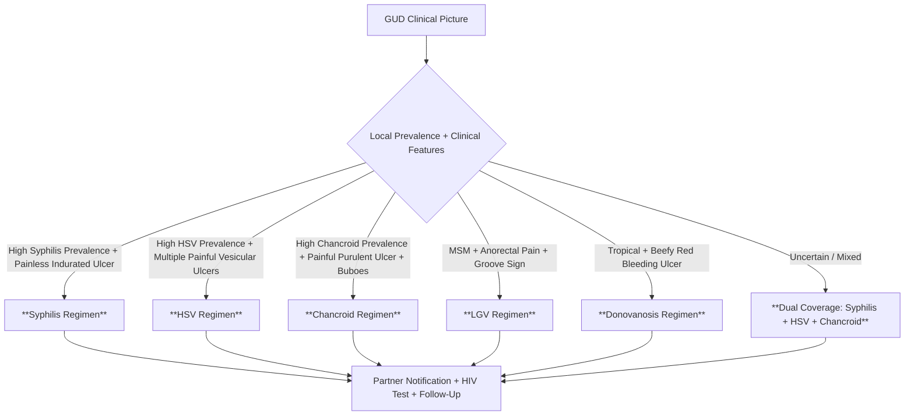

**Parent Topic:** [STI MOC](../Sexually%20Transmitted%20Infections%20MOC.md) → [STI Hierarchy](../Davidson%20Chapter%2013%20-%20STI%20Hierarchy.md)  
**Status:** `full-fcps-mrcp-note`  
**Priority:** ⭐⭐⭐ HIGHEST (FCPS/MRCP — Core Syndromic Management, Differential Diagnosis, WHO Algorithms)  
**Source:** Davidson 24th Ed Ch 13; WHO Guidelines 2021; BASHH/ECDC/CDC; FCPS/MRCP Syllabus

---

## 1. 🎯 Learning Objectives
- [ ] Apply **WHO Syndromic Management** algorithm for Genital Ulcer Disease (GUD)
- [ ] Differentiate **Common Causes**: Syphilis, HSV, Chancroid, LGV, Donovanosis
- [ ] Recognise **Dual Pathology** (Up to 10-20% have >1 cause)
- [ ] Apply **Empirical Treatment Regimens** by Suspected Aetiology
- [ ] Implement **Partner Notification, Test of Cure, Follow-Up** Protocols
- [ ] Answer viva: "GUD differential" and "Syphilis vs HSV vs Chancroid" and "Empirical GUD treatment" and "HIV testing in GUD"

---

## 2. 🧠 Core Concept: GUD Syndromic Management Framework

```mermaid
flowchart TD
    A[Patient Presents with Genital Ulcer] --> B[Clinical Assessment]
    B --> B1[History: Sexual, Onset, Pain, Systemic Sx, HIV Risk]
    B --> B2[Exam: Ulcer Number/Size/Pain/Base/Edges, Inguinal Nodes (Tender/Suppurative)]
    B --> B3[Testing: Syphilis Serology (RPR/VDRL + TPPA), HSV NAAT/PCR, HIV Test, Swab for GC/CT]
    B3 --> C{Syndromic Algorithm}
    C -->|Ulcer + Painful + Suppurative Nodes| D[Chancroid Likely]
    C -->|Ulcer + Painless + Non-Tender Nodes| E[Syphilis Likely]
    C -->|Ulcer + Painful + Tender Nodes| F[HSV Likely]
    C -->|Ulcer + Painless + Groove Sign| G[LGV Likely]
    C -->|Ulcer + Beefy Red + Bleeding| H[Donovanosis Likely]
    D & E & F & G & H --> I[Empirical Treatment for Most Likely + Cover Dual]
    I --> J[Partner Notification + HIV Test + Follow-Up]
```

> **Golden Rule**: **ALWAYS Test for HIV and Syphilis in ANY GUD** — Dual pathology common (10-20%)

---

## 1️⃣ Aetiology & Clinical Differentiation

| Feature | **Syphilis (Primary)** | **HSV (Genital Herpes)** | **Chancroid** | **LGV** | **Donovanosis** |
|---------|------------------------|--------------------------|---------------|---------|-----------------|
| **Organism** | *Treponema pallidum* | *HSV-1 / HSV-2* | *Haemophilus ducreyi* | *C. trachomatis L1-L3* | *Klebsiella granulomatis* |
| **Ulcer** | **Single, Painless**, Clean base, **Indurated (Hard)** edges | **Multiple, Painful**, Vesicles → Shallow ulcers, **Erythematous base** | **Single/Multiple, Painful**, **Purulent base**, Ragged undermined edges, **Bleeds easily** | **Small Painless** Papule/Ulcer (Often missed) | **Beefy Red, Granulomatous**, **Bleeds on Touch**, Rolled edges |
| **Pain** | **Painless** | **Painful** (Burning, Tingling) | **Painful** | **Painless** (Primary) | **Painless** (Usually) |
| **Nodes** | **Non-tender**, Firm, Rubbery, Bilateral | **Tender**, Bilateral, **Inguinal** | **Suppurative Buboes** (Tender, Fluctuant, Unilateral) | **Groove Sign** (Inguinal + Femoral, Separated by Inguinal Ligament) | **Minimal/Moderate**, Non-suppurative |
| **Systemic** | Rare (Secondary = Fever, Rash) | **Primary: Fever, Myalgia, Malaise** | Fever, Malaise (If Buboes) | **Secondary: Fever, Malaise, Arthralgia** | Rare |
| **Incubation** | 3 Weeks - 90 Days (Avg 21d) | 2-12 Days (Avg 4d) | 3-7 Days (Avg 5d) | 3-12 Days (Primary) | 1-12 Weeks (Avg 3-4w) |
| **Dual Pathology** | Common with HSV | Common with Syphilis | Rare | Can Co-exist with Syphilis | Rare |

---

## 2️⃣ WHO Syndromic Management Algorithm (GUD)

### Step 1: Clinical Assessment
| Component | Action |
|-----------|--------|
| **History** | Sexual partners (New/Regular), Condom use, Onset duration, Pain, Systemic symptoms, Prior STIs, HIV Risk |
| **Examination** | **Genital**: Ulcer(s) — Number, Size, Pain, Base (Clean/Purulent/Granulomatous), Edges (Indurated/Undermined/Rolled); **Inguinal Nodes** — Size, Tenderness, Fluctuation, Laterality, Groove Sign; **Extra-genital**: Oral, Anal, Skin |
| **Testing (Send Before Tx)** | **Syphilis Serology (RPR/VDRL + TPPA/FTA-ABS)** — **MANDATORY**; **HIV Test (Opt-out)** — **MANDATORY**; **HSV NAAT/PCR** (Swab base of ulcer); **GC/CT NAAT** (Urethral/Cervical/Rectal/Pharyngeal); **Chancroid/Dono Culture** (If Available) |

### Step 2: Empirical Treatment (Based on Local Epidemiology & Clinical Picture)



### Empirical Regimens (WHO 2021 / BASHH)

| Clinical Suspicion | Regimen | Duration | Covers |
|--------------------|---------|----------|--------|
| **Syphilis Likely** | **Benzathine Penicillin G 2.4MU IM Stat** | Single Dose | Syphilis (All Stages) |
| **HSV Likely** | **Acyclovir 400mg PO TDS** or **Valacyclovir 1g PO BD** | **7-10 Days** (Primary: 10d; Recurrent: 5d) | HSV |
| **Chancroid Likely** | **Azithromycin 1g PO Stat** or **Ceftriaxone 250mg IM Stat** | Single Dose | Chancroid |
| **LGV Likely (MSM/Anorectal)** | **Doxycycline 100mg PO BD** | **21 Days** | LGV |
| **Donovanosis Likely** | **Azithromycin 1g PO Weekly** or **Doxycycline 100mg BD** | **3 Weeks** (Until Healed) | Donovanosis |
| **Uncertain / High Dual-Pathology Risk** | **Benzathine Penicillin G 2.4MU IM + Acyclovir 400mg TDS × 10d + Azithromycin 1g Stat** | Combined | **Syphilis + HSV + Chancroid** |

> **WHO Recommends**: **Treat for ALL Common Causes in Settings with High Dual Pathology** OR **Treat for Most Likely + Follow-Up**

### Step 3: Follow-Up & Partner Management
| Action | Timing |
|--------|--------|
| **Clinical Review** | **7 Days** (Assess Healing, Adverse Effects) |
| **Syphilis Serology Repeat** | **3, 6, 12 Months** (If Initially Negative or Treated) |
| **Test of Cure (HSV)** | Not Routine (Clinical Healing Sufficient) |
| **Partner Notification** | **All Partners within Lookback** (Syphilis: Stage-Dependent; HSV: 60d; Chancroid: 60d; LGV: 60d) |
| **HIV Re-test** | **3 Months** (Window Period) if Initial Negative |

---

## 3️⃣ Detailed Cause-Specific Management

### Syphilis (Primary) — See 2.3 Syphilis.md for Full Details
- **Diagnosis**: **Dark Ground Microscopy (If Available) + Serology (RPR/VDRL + TPPA)**
- **Treatment**: **Benzathine Penicillin G 2.4MU IM Stat** (Penicillin Allergy → Doxycycline 100mg BD × 14d or Ceftriaxone 1g IM/IV OD × 10-14d + Desensitisation)
- **Follow-Up**: **Serology at 3, 6, 12 Months**; **Jarisch-Herxheimer Warning**
- **HIV Co-infection**: **CSF if Neuro Signs / Late Latent / Treatment Failure**

### HSV (Genital Herpes) — See 3.2 HSV.md for Full Details
- **Diagnosis**: **NAAT/PCR from Ulcer Base (Gold Standard)**; Tzanck (Obsolete); Serology (Type-Specific IgG)
- **Treatment**: **Acyclovir 400mg TDS × 10d (Primary)** or **Valacyclovir 1g BD × 10d**; **Suppressive: Acyclovir 400mg BD / Valacyclovir 500mg OD if ≥6 Recurrences/Year**
- **Pregnancy**: **Suppressive Acyclovir from 36w**; **C-Section if Active Lesions at Labour**
- **Neonatal**: **Acyclovir 20mg/kg IV 8hrly × 14-21d** (SEM/CNS/Disseminated)

### Chancroid
| Aspect | Details |
|--------|---------|
| **Organism** | *Haemophilus ducreyi* — Fastidious, Requires Chocolate Agar + CO2 |
| **Diagnosis** | **Clinical + Exclusion**; Culture Difficult; PCR (Research); **Exclude Syphilis (Dark Ground/Serology), HSV (NAAT)** |
| **Treatment** | **Azithromycin 1g PO Stat (1st Line)**; **Ceftriaxone 250mg IM Stat**; **Alt: Ciprofloxacin 500mg BD × 3d (If Susceptible)**; **Erythromycin 500mg QDS × 7d (Pregnant)** |
| **Buboes** | **Incision & Drainage / Needle Aspiration** (Repeat if Needed) + Systemic Antibiotics |
| **HIV Association** | **High Co-infection Rate** → Mandatory HIV Test + Repeat at 3mo |

### LGV — See 2.1 Chlamydia.md (LGV Section)
- **Diagnosis**: **Chlamydia NAAT + LGV PCR/Genotyping (L1/L2/L3) / Serology (MIF IgG >1:64)**
- **Treatment**: **Doxycycline 100mg PO BD × 21 DAYS** (NOT 7d); **Azithro 1g Weekly × 3 if Pregnant**
- **Buboes**: **Aspiration (Not Incision — Fistula Risk)** + Antibiotics

### Donovanosis (Granuloma Inguinale)
| Aspect | Details |
|--------|---------|
| **Organism** | *Klebsiella granulomatis* (Calymmatobacterium) — Intracellular "Donovan Bodies" |
| **Epidemiology** | **Tropical/Subtropical** (Papua New Guinea, South Africa, India, Caribbean, Indigenous Australia) |
| **Clinical** | **Progressive Beefy-Red Granulomatous Ulcer**, **Bleeds on Touch**, **Rolled Edges**, **Minimal Pain**, **Inguinal Nodes Non-Suppurative** |
| **Diagnosis** | **Donovan Bodies on Smear/Biopsy** (Intracellular Capsulated Bacilli in Macrophages — Wright/Giemsa); PCR (Confirmatory) |
| **Treatment** | **Azithromycin 1g PO Weekly** or **Doxycycline 100mg BD** — **Minimum 3 Weeks / Until Complete Healing** |
| **Differential** | Syphilis (Granulomatous Tertiary), Malignancy, TB, Amoebiasis, Carcinoma |

---

## 4️⃣ HIV & GUD — Critical Interactions

| Interaction | Impact |
|-------------|--------|
| **GUD ↑ HIV Acquisition** | Ulcer = Portal of Entry; **Syphilis/Chancroid/HSV/LGV Increase HIV Transmission 3-10x** |
| **HIV ↑ GUD Severity** | **Larger, Deeper, More Painful, Slower Healing**; **Atypical Presentations (Necrotic, Extensive)** |
| **HIV ↑ GUD Recurrence** | **HSV: More Frequent/Severe Recurrences**; **Syphilis: Rapid Progression, Neurosyphilis Risk** |
| **IRIS (Immune Reconstitution)** | **Starting ART → Paradoxical Worsening of GUD (Syphilis, HSV, LGV)** — Usually 2-8 Weeks |
| **Diagnostic Impact** | **Serology Can Be Delayed/Atypical in HIV**; **NAAT/PCR Preferred** |
| **Treatment Impact** | **Standard Regimens Work**, But **Longer Duration May Be Needed**; **Monitor for Failure/IRIS** |

> **Rule**: **All GUD Patients → HIV Test (Opt-out); HIV+ → Full STI Screen + Enhanced Follow-Up**

---

## 5️⃣ Pregnancy & GUD

| STI | Risk in Pregnancy | Management |
|-----|------------------|------------|
| **Syphilis** | **Congenital Syphilis (Stillbirth, Neonatal Death, Deformity)** — **MANDATORY SCREENING AT BOOKING + 3RD TRIMESTER + DELIVERY** | **Benzathine Penicillin G 2.4MU IM (Stage-Appropriate)**; **Desensitisation if Allergy**; **Partner PN Mandatory** |
| **HSV** | **Neonatal Herpes (Disseminated/CNS/SEM)** — **C-Section if Active Lesions at Labour** | **Suppressive Acyclovir 400mg TDS from 36w**; **Primary 3rd Trimester = Highest Risk**; **Neonatal Acyclovir if Exposed** |
| **Chancroid** | **Preterm Labour, Neonatal Infection** | **Azithromycin 1g Stat (Safe); Erythromycin if Azithro Unavailable** |
| **LGV** | **Rare in Pregnancy** | **Azithromycin 1g Weekly × 3 (Doxy Contraindicated)** |
| **Donovanosis** | **Rare** | **Azithromycin 1g Weekly × 3 Weeks** |

---

## 3. ⚡ FCPS/MRCP High-Yield Summary

| Topic | Key Points |
|-------|------------|
| **GUD Definition** | **Genital Ulceration (Single/Multiple) on Genitalia/Perineum/Anal Region**; **Painful or Painless**; **± Inguinal Lymphadenopathy** |
| **WHO Algorithm** | **Assess → Test (Syphilis Serology + HIV MANDATORY) → Empirical Tx for Likely Causes → PN → Follow-Up** |
| **Dual Pathology** | **10-20% Have >1 Cause** → **Treat for Multiple / Broad Coverage if Uncertain** |
| **Key Differentials** | **Syphilis: Painless, Indurated, Clean Base, Non-Tender Nodes**; **HSV: Painful, Multiple Vesicular, Tender Nodes**; **Chancroid: Painful, Purulent, Suppurative Buboes**; **LGV: Painless Primary, Groove Sign**; **Donovanosis: Beefy Red, Bleeding, Granulomatous** |
| **Empirical Tx** | **Syph: Benzathine Pen G 2.4MU IM**; **HSV: Azi 400mg TDS/Vala 1g BD × 7-10d**; **Chancroid: Azi 1g Stat/Ceftriaxone 250mg IM**; **LGV: Doxy BD × 21d**; **Donovanosis: Azi 1g Weekly × 3w** |
| **HIV/Syphilis Testing** | **MANDATORY IN ALL GUD** — **Dual Pathology 10-20%, HIV ↑ Acquisition/Transmission** |
| **Partner Notification** | **Lookback: Syph Stage-Dep, HSV 60d, Chancroid 60d, LGV 60d** |
| **Pregnancy** | **Syph: Mandatory Screen + Benzathine Pen G**; **HSV: Suppressive from 36w, C-Section if Active** |
| **Viva** | "GUD Differential", "Empirical GUD Tx", "Syphilis vs HSV vs Chancroid", "HIV & GUD Interaction" |

---

## 4. 🎤 Viva Questions (Expected Answers)

| # | Question | Expected Answer |
|---|----------|-----------------|
| 1 | What is Genital Ulcer Disease Syndrome (GUD) and what are the common causes? | **GUD = Genital Ulceration (Single/Multiple) on Genitalia/Perineum/Anal Region ± Inguinal Nodes**; **Top 5: Syphilis (Primary), HSV-1/2, Chancroid (H. ducreyi), LGV (C. trachomatis L1-L3), Donovanosis (K. granulomatis)**; **Dual Pathology 10-20%** |
| 2 | Differentiate Syphilis, HSV, and Chancroid clinically. | **Syphilis: Single Painless Indurated Ulcer (Clean Base), Non-Tender Firm Bilateral Nodes**; **HSV: Multiple Painful Vesicular→Shallow Ulcers (Erythematous Base), Tender Bilateral Nodes, Systemic Sx (Primary)**; **Chancroid: Painful Purulent Ulcer (Ragged Undermined Edges, Bleeds), Suppurative Fluctuant Unilateral Buboes** |
| 3 | What is the WHO syndromic management algorithm for GUD? | **1) Clinical Assessment (History, Exam, Testing: Syph Serology+HIV Mandatory, HSV NAAT, GC/CT NAAT)**; **2) Empirical Treatment Based on Local Epidemiology & Clinical Picture (Syph: Benzathine Pen G 2.4MU IM; HSV: Acyclovir 400mg TDS×10d; Chancroid: Azi 1g Stat; LGV: Doxy BD×21d; Donovanosis: Azi 1g Weekly×3w)**; **3) Dual Coverage if Uncertain (Pen G + Acyclovir + Azi)**; **4) PN + HIV Test + Follow-Up** |
| 4 | Why is HIV testing mandatory in all GUD patients? | **GUD Ulcers = Portal for HIV Entry (↑ Acquisition 3-10x); Dual STI/HIV Common; HIV Alters GUD Presentation (Atypical, Severe, Slow Healing); IRIS Risk on ART; Public Health Synergy** |
| 5 | Empirical treatment for GUD in a high-prevalence setting with uncertain diagnosis? | **Benzathine Penicillin G 2.4MU IM (Syphilis) + Acyclovir 400mg TDS × 10d (HSV) + Azithromycin 1g Stat (Chancroid)** — **Covers Top 3 Causes** |
| 6 | LGV in MSM — clinical clues and treatment? | **Anorectal Pain, Bloody Mucopurulent Discharge, Tenesmus, Fever, Groove Sign (Inguinal+Femoral Nodes), L2b Serovar**; **Dx: CT NAAT + LGV PCR/Genotyping**; **Tx: Doxycycline 100mg BD × 21 DAYS (Not 7d!); Azithro 1g Weekly×3 if Pregnant** |
| 7 | Donovanosis — epidemiology, diagnosis, treatment? | **Tropical/Subtropical (PNG, S. Africa, India, Caribbean, Indigenous Aus)**; **Beefy-Red Granulomatous Ulcer, Bleeds on Touch, Rolled Edges, Minimal Pain**; **Dx: Donovan Bodies on Smear/Biopsy (Intracellular in Macrophages)**; **Tx: Azithromycin 1g Weekly × 3 Weeks (Until Healed) or Doxy BD** |
| 8 | HSV in pregnancy — management to prevent neonatal herpes? | **Suppressive Acyclovir 400mg TDS from 36 Weeks**; **C-Section if Active Genital Lesions/Prodrome at Labour**; **Primary Infection 3rd Trimester = Highest Neonatal Risk (50% Transmission)**; **Neonatal Acyclovir IV if Exposed/Exposed+Lesions** |
| 9 | Chancroid — treatment and bubo management? | **Azithromycin 1g PO Stat (1st) or Ceftriaxone 250mg IM Stat**; **Erythromycin 500mg QDS×7d (Pregnant)**; **Buboes: Needle Aspiration/Incision & Drainage (Repeat if Needed) + Systemic Abx**; **HIV Co-test Mandatory** |
| 10 | Partner notification lookback for GUD causes? | **Syphilis: Stage-Dependent (1°3m+Sx, 2°6m+Sx, EarlyLat1y, LateLat LT)**; **HSV: 60 Days**; **Chancroid: 60 Days**; **LGV: 60 Days**; **Donovanosis: 60 Days** |

---

## 5. 🧩 Confusions & Mnemonics

| Confusion | Clarification |
|-----------|---------------|
| **"GUD = Just Syphilis + HSV"** | **NO.** **5 Main Causes: Syph, HSV, Chancroid, LGV, Donovanosis**; **Dual Pathology 10-20%** |
| **"Painless = Syphilis, Painful = HSV"** | **OVERSIMPLIFIED.** **Syphilis = Painless (Usually)**; **HSV = Painful (Usually)**; **Chancroid = Painful**; **LGV Primary = Painless**; **Donovanosis = Painless (Usually)**; **Atypical Presentations Common in HIV** |
| **"Suppurative Buboes = Chancroid Only"** | **NO.** **Chancroid = Suppurative (Fluctuant, Tender)**; **LGV = Groove Sign (Inguinal+Femoral, Non-Suppurative Usually)**; **HSV = Tender Non-Suppurative**; **Syphilis = Non-Tender Firm** |
| **"LGV = Just Genital Chlamydia"** | **NO.** **Invasive Serovars L1/L2/L3**; **Systemic Disease, Groove Sign, Anorectal in MSM**; **Treatment 21d Doxy (Not 7d!)** |
| **"Donovanosis = Rare, Ignore"** | **Endemic in Tropical Regions**; **Must Consider in Travel/Indigenous Pops**; **Beefy Red Bleeding Ulcer = Donovanosis Until Proven Otherwise** |
| **"HIV Test = Optional in STI Clinic"** | **MANDATORY (Opt-Out) for ALL STI Diagnoses Including GUD**; **Synergy/IRIS/Atypical Presentation** |
| **"Empirical Tx = Single Drug"** | **WHO Recommends Dual/Triple Coverage if Uncertain (High Dual Pathology)**; **Pen G + Acyclovir + Azi Covers Top 3** |
| **"LGV Buboes = Incise & Drain"** | **NO.** **Aspiration Only (Incision → Fistula Formation)**; **Chancroid Buboes = Incision/Aspiration OK** |
| **"Syphilis TOC = Clinical Only"** | **NO.** **Serological TOC Mandatory (RPR/VDRL Titer Decline 4-Fold at 6-12mo)**; **Clinical Healing ≠ Cure** |
| **"HSV TOC = NAAT After Treatment"** | **NO.** **Clinical Healing Sufficient**; **NAAT Not for TOC (Viral Shedding Intermittent)**; **Suppressive Tx Indicated if ≥6 Recurrences/Year** |

> **Mnemonic: GUD MASTER CLASS**  
> **G**UD = **Genital Ulcer Disease** — Ulcer(s) on Genitalia/Perineum/Anal ± Inguinal Nodes  
> **U**lcers: **5 Main Causes** — **Syph, HSV, Chancroid, LGV, Donovanosis** (Dual Pathology 10-20%!)  
> **D**ifferential: **Syph (Painless Indurated Clean Base Non-Tender Nodes)** vs **HSV (Painful Vesicular Tender Nodes)** vs **Chancroid (Painful Purulent Suppurative Buboes)** vs **LGV (Painless Primary → Groove Sign)** vs **Donovanosis (Beefy Red Bleeding Granulomatous)**  
> **M**andatory Tests: **Syphilis Serology (RPR/VDRL+TPPA) + HIV Test (Opt-Out) IN EVERY GUD**  
> **A**lgorithm WHO: **Assess → Test → Empirical Tx (Top 3: Pen G + Acyclovir + Azi) → PN → Follow-Up**  
> **S**yphilis: **Benzathine Pen G 2.4MU IM (Stage-Appropriate); Serology TOC 3/6/12mo; JHR Warning**  
> **T**reatment HSV: **Aciclovir 400mg TDS×10d (1°); Suppressive if ≥6/yr; Pregnancy: Suppress 36w+ C-Section if Active**  
> **E**mpirical Chancroid: **Azi 1g Stat / Ceftriaxone 250mg IM; Buboes Aspirate/Incise; HIV Co-infection High**  
> **R** LGV: **Invades Lymphatics (L1-L3); MSM Anorectal Predominant; Groove Sign; Doxy BD×21d (NOT 7d!)**  
> **C** Donovanosis: **Tropical; K. granulomatis; Donovan Bodies (Intracellular); Beefy Red Bleeding; Azi Weekly×3w**  
> **L** HIV Interaction: **GUD ↑ HIV Acquisition 3-10x; HIV ↑ GUD Severity/Atypical/Slow; IRIS on ART (2-8wk); Enhanced PN**  
> **A** Pregnancy: **Syph Mandatory Screen+Pen G; HSV Suppress 36w+ C-Section; Chancroid Azi; LGV Azi Weekly×3**  
> **S** PN Lookback: **Syph Stage-Dep; HSV/Chancroid/LGV/Donovanosis 60 Days**  
> **S** Follow-Up: **Syph Serology 3/6/12mo; Clinical Review 7d; HIV Re-test 3mo if Initial Neg**  

---

## 6. 🗺️ Mind Map

```mermaid
mindmap
  root((Genital Ulcer Disease))
    Definition
      Ulcer(s) on Genitalia/Perineum/Anal
      Painful or Painless
      ± Inguinal Lymphadenopathy
    Causes (Top 5)
      Syphilis: Painless, Indurated, Clean Base, Non-Tender Nodes
      HSV: Multiple Painful Vesicular, Tender Nodes, Systemic 1°
      Chancroid: Painful Purulent, Suppurative Buboes
      LGV: Painless Primary → Groove Sign, Anorectal MSM
      Donovanosis: Beefy Red Bleeding Granulomatous
    Dual Pathology
      10-20% >1 Cause
      Treat Broad if Uncertain
    WHO Algorithm
      Clinical Assessment (Hx, Exam)
      Testing: Syph Serology + HIV (MANDATORY)
      HSV NAAT, GC/CT NAAT
      Empirical Tx by Epidemiology/Clinical
      PN + Follow-Up
    Empirical Treatment
      Syph: Benzathine Pen G 2.4MU IM
      HSV: Azi 400mg TDS/Vala 1g BD × 7-10d
      Chancroid: Azi 1g Stat / Ceftriaxone 250mg IM
      LGV: Doxy BD × 21d
      Donovanosis: Azi 1g Weekly × 3w
      Uncertain: Pen G + Acyclovir + Azi
    HIV Interaction
      GUD ↑ HIV Acquisition 3-10x
      HIV ↑ GUD Severity/Atypical
      IRIS on ART (2-8wk)
      Enhanced PN
    Pregnancy
      Syph: Screen+Pen G Mandatory
      HSV: Suppress 36w, C-Section if Active
      Chancroid/LGV/Don: Azi Safe
    PN Lookback
      Syph: Stage-Dep
      Others: 60d
```

---

## 7. 📅 Spaced Repetition Tracker

| Review | Date | Score (0–5) | Notes |
|--------|------|-------------|-------|
| Day 1 | | | |
| Day 3 | | | |
| Day 7 | | | |
| Day 14 | | | |
| Day 30 | | | |
| Day 90 | | | |

---

## 8. 📝 Self-Test Scorecard

| Section | Max | Score | % |
|---------|-----|-------|---|
| Aetiology & Differential (5 Causes) | 5 | | |
| WHO Algorithm Steps | 3 | | |
| Empirical Treatment Regimens | 4 | | |
| HIV/GUD Interaction | 2 | | |
| Pregnancy Management | 2 | | |
| Partner Notification Lookback | 2 | | |
| Viva Readiness | 2 | | |
| **Total** | **20** | | |

---

## 9. 💬 Exam Answer Modes

| Format | Prompt | Key Points |
|--------|--------|------------|
| **Long Essay** | "Describe the aetiology, clinical differentiation, and syndromic management of Genital Ulcer Disease (GUD)." | **Definition: Ulcer(s) on Genitalia/Perineum/Anal ± Nodes**; **5 Causes: Syph, HSV, Chancroid, LGV, Donovanosis**; **Dual Pathology 10-20%**; **Clinical Diff: Syph (Painless Indurated Clean Base, Non-Tender Nodes), HSV (Painful Multiple Vesicular, Tender Nodes), Chancroid (Painful Purulent, Suppurative Buboes), LGV (Painless Primary → Groove Sign), Donovanosis (Beefy Red Bleeding Granulomatous)**; **WHO Algorithm: Assess → Test (Syph Serology+HIV Mandatory, HSV NAAT, GC/CT) → Empirical Tx (Syph: Benzathine Pen G 2.4MU IM; HSV: Acyclovir 400mg TDS×10d; Chancroid: Azi 1g Stat; LGV: Doxy BD×21d; Donovanosis: Azi 1g Weekly×3w) → Dual Coverage if Uncertain (Pen G + Acyclovir + Azi) → PN + Follow-Up**; **HIV Mandatory Test (↑ Acquisition 3-10x, Altered Presentation, IRIS)**; **Pregnancy: Syph Screen+Pen G, HSV Suppress 36w+C-Section, Azi Safe for Others**; **PN Lookback: Syph Stage-Dep, Others 60d**; **Follow-Up: Syph Serology 3/6/12mo, Clinical 7d, HIV Re-test 3mo** |
| **Short Note** | "WHO syndromic management of GUD — empirical treatment regimens." | **Algorithm: Assess → Test (Syph Serology+HIV Mandatory, HSV NAAT, GC/CT) → Treat**; **Empirical Regimens by Suspicion: Syph: Benzathine Pen G 2.4MU IM Stat; HSV: Acyclovir 400mg TDS × 10d (Primary); Chancroid: Azithromycin 1g Stat / Ceftriaxone 250mg IM Stat; LGV: Doxycycline 100mg BD × 21 DAYS; Donovanosis: Azithromycin 1g Weekly × 3 Weeks**; **Uncertain/High Dual Pathology: Benzathine Pen G 2.4MU IM + Acyclovir 400mg TDS × 10d + Azithromycin 1g Stat (Covers Top 3)** |
| **Viva** | "How do you differentiate Syphilis, HSV, and Chancroid clinically?" | **Syphilis: Single, Painless, Clean-Based, Indurated (Hard) Edges, Non-Tender Firm Bilateral Inguinal Nodes, Incubation 21d Avg**; **HSV: Multiple, Painful (Burning), Vesicular→Shallow Ulcers, Erythematous Base, Tender Bilateral Nodes, Primary: Systemic (Fever/Myalgia), Incubation 4d Avg**; **Chancroid: Single/Multiple, Painful, Purulent Base, Ragged Undermined Edges (Bleeds Easily), Suppurative Fluctuant Unilateral Buboes, Incubation 5d Avg** |
| **Ward Round** | "MSM with painful perianal ulcer, bloody discharge, tenesmus, fever, inguinal+femoral lymphadenopathy. Management?" | **Anorectal LGV (L2b) — Dx: CT NAAT + LGV PCR/Genotyping**; **Clinical: Groove Sign (Inguinal+Femoral Nodes), Systemic Sx, MSM Context**; **Tx: Doxycycline 100mg BD × 21 DAYS (Not 7d!)**; **PN: 60-Day Lookback, EPT Not for LGV**; **Co-test: HIV, Syphilis, GC, HSV, HCV**; **Follow-Up: Clinical 2w, TOC NAAT 3-4w** |
| **Last-Night** | "GUD: 5 Causes (Syph, HSV, Chancroid, LGV, Donovanosis), Dual 10-20%. Diff: Syph Painless Indurated Clean Non-Tender Nodes; HSV Painful Multiple Vesicular Tender Nodes; Chancroid Painful Purulent Suppurative Buboes; LGV Painless→Groove Sign; Donovanosis Beefy Red Bleeding. WHO Algo: Assess→Test(Syph Serol+HIV MAND, HSV NAAT)→Empirical Tx(Syph Pen G 2.4MU IM, HSV Acy 400mg TDS×10d, Chancr Azi 1g, LGV Doxy BD×21d, Dono Azi 1g Wkly×3w)→Uncertain=Pen G+Acy+Azi→PN+FU. HIV Mand Test. Preg: Syph Scr+Pen G, HSV Suppr 36w+C-Sect. PN Lookback: Syph Stage-Dep, Others 60d. FU: Syph Serol 3/6/12mo." | Compressed. |

---

## 10. 📌 Summary
- **GUD** = **Genital Ulcer(s) ± Inguinal Nodes**; **5 Main Causes: Syphilis, HSV, Chancroid, LGV, Donovanosis**; **Dual Pathology 10-20%**
- **WHO Algorithm**: **Assess → Test (Syphilis Serology + HIV MANDATORY, HSV NAAT, GC/CT) → Empirical Treatment → Partner Notification → Follow-Up**
- **Clinical Differentiation**: **Syphilis = Painless Indurated Clean Base Non-Tender Nodes**; **HSV = Painful Multiple Vesicular Tender Nodes**; **Chancroid = Painful Purulent Suppurative Buboes**; **LGV = Painless Primary → Groove Sign (Inguinal+Femoral)**; **Donovanosis = Beefy Red Bleeding Granulomatous**
- **Empirical Treatment**: **Syphilis: Benzathine Penicillin G 2.4MU IM**; **HSV: Acyclovir 400mg TDS × 10d (Primary)**; **Chancroid: Azithromycin 1g Stat / Ceftriaxone 250mg IM**; **LGV: Doxycycline 100mg BD × 21 DAYS**; **Donovanosis: Azithromycin 1g Weekly × 3 Weeks**; **Uncertain: Pen G + Acyclovir + Azi**
- **Mandatory Testing**: **Syphilis Serology + HIV (Opt-Out) IN EVERY GUD**
- **HIV Interaction**: **GUD ↑ HIV Acquisition 3-10x**; **HIV ↑ GUD Severity/Atypical/Slow Healing**; **IRIS on ART (2-8 Weeks)**; **Enhanced PN**
- **Pregnancy**: **Syphilis = Mandatory Screen + Benzathine Pen G**; **HSV = Suppressive Acyclovir from 36w + C-Section if Active**; **Chancroid/LGV/Donovanosis = Azithromycin Safe**
- **Partner Notification**: **Syphilis Stage-Dependent (1°3m/2°6m/EarlyLat1y/LateLat LT)**; **Others = 60 Days**
- **Follow-Up**: **Syphilis Serology 3/6/12 Months**; **Clinical Review 7 Days**; **HIV Re-test 3 Months if Initial Negative**

---

## 11. ❓ MCQs (10)

1. **Most common cause of genital ulcer disease worldwide?**  
   A. Syphilis  B. **HSV (Herpes Simplex Virus)**  C. Chancroid  D. LGV  
   *Answer: B. HSV is the most common cause of GUD globally; Syphilis and Chancroid vary by region.*

2. **Primary syphilis chancre — classic clinical features?**  
   A. Multiple, Painful, Vesicular  B. **Single, Painless, Indurated, Clean Base**  C. Painful, Purulent, Ragged Edges  D. Beefy Red, Bleeding  
   *Answer: B. Single, Painless, Indurated (Hard), Clean-Based Ulcer with Non-Tender Firm Nodes.*

3. **Chancroid — typical inguinal lymphadenopathy?**  
   A. Non-Tender, Firm, Bilateral  B. Tender, Non-Suppurative, Bilateral  C. **Suppurative, Fluctuant, Unilateral Buboes**  D. Groove Sign  
   *Answer: C. Suppurative Buboes (Fluctuant, Tender, Unilateral) — Classic for Chancroid.*

4. **LGV in MSM — most common clinical presentation?**  
   A. Painless Genital Ulcer  B. **Anorectal Proctitis (Pain, Bloody Discharge, Tenesmus, Fever)**  C. Suppurative Buboes  D. Pharyngitis  
   *Answer: B. Anorectal LGV (L2b) = Proctitis with Rectal Pain, Bloody Mucopurulent Discharge, Tenesmus, Fever, Groove Sign.*

5. **WHO recommended empirical treatment for GUD when diagnosis uncertain in high-prevalence setting?**  
   A. Acyclovir Alone  B. **Benzathine Penicillin G + Acyclovir + Azithromycin**  C. Ceftriaxone Alone  D. Doxycycline Alone  
   *Answer: B. Covers Top 3 Causes (Syphilis + HSV + Chancroid) — Pen G 2.4MU IM + Acyclovir 400mg TDS×10d + Azi 1g Stat.*

6. **Mandatory test in ALL GUD patients?**  
   A. HSV NAAT  B. **Syphilis Serology + HIV Test (Opt-Out)**  C. GC/CT NAAT  D. Dark Ground Microscopy  
   *Answer: B. Syphilis Serology (RPR/VDRL + TPPA) + HIV Test (Opt-Out) — Mandatory for Every GUD.*

7. **LGV treatment duration with doxycycline?**  
   A. 7 Days  B. 14 Days  C. **21 Days (3 Weeks)**  D. 28 Days  
   *Answer: C. LGV Requires 21 Days Doxycycline (Not 7d for Genital CT).*

8. **Donovanosis — classic ulcer appearance?**  
   A. Painless, Indurated, Clean Base  B. Multiple, Painful, Vesicular  C. **Beefy Red, Granulomatous, Bleeds on Touch**  D. Purulent, Ragged Edges  
   *Answer: C. Beefy-Red Granulomatous Ulcer That Bleeds on Touch with Rolled Edges.*

8. **HSV in pregnancy — management to prevent neonatal herpes?**  
   A. No Intervention  B. **Suppressive Acyclovir from 36 Weeks + C-Section if Active Lesions at Labour**  C. Acyclovir Only if Primary  D. Cesarean for All HSV+  
   *Answer: B. Suppressive Acyclovir 400mg TDS from 36w; C-Section if Active Genital Lesions/Prodrome at Labour.*

9. **Partner notification lookback for Primary Syphilis?**  
   A. 60 Days  B. **3 Months + Duration of Symptoms**  C. 6 Months  D. 1 Year  
   *Answer: B. Primary Syphilis: 3 Months + Duration of Symptoms (Chancre Incubation 3w-90d).*

---

## 12. 📋 SBAs (5)

1. **30-year-old MSM presents with 5-day history of painful perianal ulcer, bloody mucopurulent discharge, tenesmus, fever. Exam: Tender inguinal AND femoral lymphadenopathy (Groove sign). Chlamydia NAAT positive. Best management?**  
   A. Azithromycin 1g Stat  B. **Doxycycline 100mg BD × 21 Days**  C. Ceftriaxone 500mg IM + Doxy 7d  D. Acyclovir 400mg TDS × 10d  
   *Answer: B. Anorectal LGV (L2b) — Doxycycline 100mg BD × 21 Days (Not 7d).*

2. **25-year-old woman, 32 weeks pregnant, presents with painful multiple vulval vesicles/ulcers, tender inguinal nodes. First episode. HSV PCR positive. Management?**  
   A. Acyclovir 400mg TDS × 10d Only  B. **Acyclovir 400mg TDS × 10d + Suppressive Acyclovir 400mg TDS from 36 Weeks + Plan C-Section if Active Lesions at Labour**  C. Cesarean Section Now  D. No Treatment Until Delivery  
   *Answer: B. Primary HSV in Pregnancy → Episodic Tx (10d) + Suppressive from 36w + C-Section if Active Lesions at Labour (Neonatal Herpes Risk 50% for Primary 3rd Trimester).*

---

## 13. 🔑 Answer Keys
| MCQs | SBAs |
|------|------|
| 1-B, 2-B, 3-C, 4-B, 5-B, 6-B, 7-C, 8-C, 9-B, 10-B | 1-B, 2-B |

---

## 14. 🔗 Cross-Links
- [[2.3 Syphilis.md]] — Syphilis GUD Management
- [[3.2 HSV.md]] — HSV GUD Management
- [[2.1 Chlamydia.md]] — LGV (Chlamydia L1-L3)
- [[2.4-2.6 Other Bacterial STIs.md]] — Chancroid
- [[5.1-5.8 Syndromic Management.md]] — WHO Algorithm
- [[6. HIV-AIDS Cross-Reference.md]] — HIV & GUD Interaction
- [[Contact Tracing and Partner Notification.md]] — PN Protocols

---

**Last Updated:** 2026-06-15  
**Version:** Full FCPS/MRCP Template Upgrade