**Parent Topic:** [STI MOC](../Sexually%20Transmitted%20Infections%20MOC.md) → [STI Hierarchy](../Davidson%20Chapter%2013%20-%20STI%20Hierarchy.md)  
**Status:** `full-fcps-mrcp-note`  
**Priority:** ⭐⭐⭐ HIGHEST (FCPS/MRCP — 2022 Global Outbreak, Sexual Transmission, Vaccination, Tecovirimat)  
**Source:** Davidson 24th Ed Ch 13 (Updated); WHO/CDC/ECDC/UKHSA Guidelines 2022-2024; FCPS/MRCP Syllabus

---

## 1. 🎯 Learning Objectives
- [ ] Describe **Mpox Virology** (Orthopoxvirus, Clades I/II) and **Transmission Dynamics** (2022 Clade IIb Sexual Network Spread)
- [ ] Recognise **Clinical Features** (Incubation, Prodrome, Rash Evolution, Anogenital Predilection 2022)
- [ ] Apply **Case Definitions** (Suspected, Probable, Confirmed) and **Diagnostic Algorithm** (PCR, Sequencing)
- [ ] Apply **Clinical Severity Grading** (Mild, Moderate, Severe) and **Management** (Supportive, Tecovirimat, Vaccinia Immune Globulin)
- [ ] Implement **Infection Prevention & Control** (Isolation, PPE, Contact Tracing, Vaccination)
- [ ] Apply **Vaccination Strategies** (Pre-Exposure PrEP, Post-Exposure PEP, Priority Groups)
- [ ] Manage **Special Populations** (HIV, Pregnancy, Children, Immunocompromised)
- [ ] Answer viva: "Mpox 2022 Outbreak Features" and "Tecovirimat Indications" and "Vaccination PEP/PrEP" and "Infection Control"

---

## 2. 🧠 Core Concept: Mpox Virology & 2022 Outbreak

```mermaid
flowchart TD
    A[Mpox Virus (MPXV)] --> B[Orthopoxvirus (Poxviridae)]
    B --> C[dsDNA Virus, Large, Brick-Shaped]
    C --> D[Two Genetic Clades]
    D --> D1[**Clade I (Congo Basin)**<br/>Historically Central Africa<br/>Higher Severity/CFR (1-10%)<br/>More Respiratory Transmission]
    D --> D2[**Clade II (West Africa)**<br/>Historically West Africa<br/>Lower Severity/CFR (<1-3%)]
    D2 --> D2a[**Clade IIa** — Endemic West Africa]
    D2 --> D2b[**Clade IIb (B.1 Lineage)** — **2022 Global Outbreak**<br/>**Predominantly Sexual Transmission (MSM Networks)**<br/>**Anogenital Lesion Predilection**<br/>**Lower CFR (~0.1-0.3%)**]
```

> **Key Shift 2022**: **Clade IIb Spread via Sexual Networks (MSM)** → **Anogenital/Oral Lesions Predominant** → **Different Clinical Picture from Endemic Clade I/IIa**

---

## 1️⃣ Transmission

| Route | Details |
|-------|---------|
| **Close Physical Contact** | **Skin-to-Skin (Lesions, Scabs), Mucosal Contact** — **Primary 2022 Route (Sexual)** |
| **Respiratory Droplets** | **Prolonged Face-to-Face** (Historically Significant Clade I; Less in 2022 Outbreak) |
| **Fomites** | **Contaminated Linens, Towels, Clothing, Sex Toys, Surfaces** |
| **Vertical/Perinatal** | **Placental Transfer, Peripartum Contact, Breastfeeding** |
| **Animal Contact** | **Rodents, Primates (Endemic Areas)** — **Not Significant 2022 Outbreak** |

### 2022 Outbreak Risk Factors
- **MSM (Men Who Have Sex with Men) — ~95-98% Cases**
- **Multiple Sexual Partners / Anonymous Sex / Sex-on-Premises Venues**
- **HIV+ (Advanced) / Immunocompromised — ↑ Severity**
- **Concurrent STIs (GC, CT, Syphilis, HSV, HIV) — Common Co-infections**

---

## 2️⃣ Clinical Features

### Typical Timeline

```mermaid
gantt
    title Mpox Clinical Course (Typical)
    dateFormat  X
    axisFormat  %d
    section Incubation
    Asymptomatic       :a1, 0, 21
    section Prodrome (1-5 Days)
    Fever, Lymphadenopathy, Myalgia, Headache :a2, 5, 5
    section Rash Evolution (2-4 Weeks)
    Macules → Papules  :a3, 7, 3
    Vesicles → Pustules :a4, 10, 5
    Crusts → Scabs      :a5, 15, 7
    Scabs Fall Off      :a6, 22, 3
    section Infectious Period
    From Prodrome to All Scabs Fallen :inf, 5, 25
```



| Phase | Duration | Features |
|-------|----------|----------|
| **Incubation** | **5-21 Days** (Median 7-10d) | Asymptomatic |
| **Prodrome** | **1-5 Days** | **Fever, Lymphadenopathy (Generalised — Key vs VZV/Smallpox), Myalgia, Headache, Fatigue, Pharyngitis** |
| **Rash Onset** | **1-3 Days After Prodrome** | **Centrifugal (Face→Extremities) Historically**; **2022: Anogenital/Perianal/Oral Predominant (Inoculation Site)** |
| **Rash Evolution** | **2-4 Weeks** | **Macules → Papules → Vesicles → Pustules (Umbilicated) → Crusts → Scabs** |
| **Infectious Period** | **From Prodrome Until ALL Scabs Fallen + Fresh Skin** | **~3-4 Weeks Total** |

### 2022 Outbreak Clinical Phenotype (Clade IIb)
| Feature | Difference from Classic Description |
|---------|--------------------------------------|
| **Lesion Distribution** | **Anogenital (~50-70%), Perianal, Oral/Perioral, Face** — **Often Few/Solitary Lesions** |
| **Prodrome** | **Often Mild or Absent** (Afebrile Cases Common) |
| **Lymphadenopathy** | **Inguinal/Femoral Predominant (Drainage Site)** |
| **Rectal Symptoms** | **Proctitis: Pain, Bleeding, Discharge, Tenesmus (Common in MSM)** |
| **Co-infections** | **High STI Co-infection Rate (GC, CT, Syphilis, HIV, HSV)** |
| **Severity** | **Generally Mild (Self-Limited); Severe in Advanced HIV/Immunocompromised** |

### Complications
| Complication | Population | Management |
|--------------|------------|------------|
| **Secondary Bacterial Infection** | All | Antibiotics (Cover Staph/Strep) |
| **Proctitis / Urethritis** | Anogenital Lesions | Supportive, Stool Softeners, Topical Anaesthetics |
| **Pharyngitis / Epiglottitis** | Oral Lesions | Airway Monitoring, Steroids if Severe |
| **Encephalitis** | Rare (<1%) | Supportive, Tecovirimat (CNS Penetration Limited) |
| **Corneal Infection / Vision Loss** | Ocular Involvement | Ophthalmology Urgent, Topical Antivirals (Trifluridine) |
| **Sepsis / Multi-Organ Failure** | Advanced HIV/Immunocompromised | ICU, Tecovirimat, VIGIV |
| **Scarring / Strictures** | Genital/Anal | Long-Term Follow-Up |

---

## 3️⃣ Case Definitions & Diagnosis

### WHO/CDC Case Definitions (2022 Outbreak)

| Category | Criteria |
|----------|----------|
| **Suspected** | **Acute Unexplained Rash** + **≥1 Epidemiological Link (Contact, Travel, MSM Network)** OR **Prodrome + Rash** |
| **Probable** | **Suspected + Orthopoxvirus Positive (PCR) OR Electron Microscopy (Poxvirus Particles)** OR **Epidemiological Link + Compatible Clinically** |
| **Confirmed** | **MPXV DNA Detected by PCR (Specific) OR Viral Isolation / Sequencing** |

### Diagnostic Algorithm

```mermaid
flowchart TD
    A[Clinical Suspicion<br/>(Rash ± Prodrome ± Epi Link)] --> B[**Specimen Collection**]
    B --> B1[**Lesion Swab (Vigorous)** — Roof/Fluid from Vesicle/Pustule<br/>**Dry Swab Preferred (Viral Transport Media OK)**<br/>**Multiple Lesions/Sites Swabbed**]
    B --> B2[**Blood (EDTA)** — PCR (If Disseminated/Severe), Serology (IgM/IgG)]
    B --> B3[**Throat/NAS/Oral Swab** — If Oropharyngeal Lesions]
    B --> B4[**Rectal Swab** — If Proctitis]
    B1 & B2 & B3 & B4 --> C[**Real-Time PCR (Orthopoxvirus Generic + MPXV Specific)**]
    C --> D{Result}
    D -->|MPXV Positive| E[**Confirmed Case** → Isolate, Notify, Contact Trace]
    D -->|Orthopoxvirus Positive, MPXV Negative| F[**Probable — Sequence/Confirm**]
    D -->|Negative| G[**Consider Alternatives (VZV, HSV, Syphilis, Molluscum, Drug Eruption)**]
    G --> H[**Repeat Testing if High Suspicion**]
```

### Differential Diagnosis
| Condition | Distinguishing Features |
|-----------|------------------------|
| **Varicella (Chickenpox)** | **Centripetal (Trunk→Extremities), Crops at Different Stages, No Lymphadenopathy, Vesicles on Erythematous Base (Dew Drop)** |
| **HSV (Genital/Oral)** | **Painful Grouped Vesicles on Erythematous Base, Recurrent, Tzanck/PCR Positive, No Prodromal Lymphadenopathy** |
| **Syphilis (Secondary)** | **Copper-Coloured Maculopapular Rash (Palms/Soles), Condylomata Lata, Mucous Patches, RPR/TPPA Positive** |
| **Molluscum Contagiosum** | **Firm, Domed, Umbilicated Papules (2-5mm), No Systemic Symptoms, No Lymphadenopathy** |
| **Drug Eruption** | **Morbilliform/Exanthematous, Drug History, Eosinophilia, No Lesion Evolution Through Stages** |
| **Disseminated VZV (Immunocompromised)** | **Vesicles at Different Stages, Visceral Involvement, PCR Positive** |

---

## 4️⃣ Clinical Management

### Severity Grading (WHO/UKHSA)

| Grade | Criteria | Management |
|-------|----------|------------|
| **Mild** | **<25 Lesions, No Mucosal/Genital Complications, No Systemic Illness** | **Home Isolation, Supportive Care, Symptomatic Treatment** |
| **Moderate** | **25-100 Lesions, Mucosal Involvement (Oral/Genital/Rectal), Mild Systemic Symptoms** | **Home/Hospital Isolation, Supportive, Consider Tecovirimat if Risk Factors** |
| **Severe** | **>100 Lesions, Sepsis, Encephalitis, Airway Compromise, Ocular Involvement, Immunocompromised (Low CD4)** | **Hospital/ICU, Tecovirimat IV/PO, VIGIV Consideration, Multidisciplinary** |

### Supportive Care (All Cases)
| Symptom | Management |
|---------|------------|
| **Pain (Lesions, Proctitis, Pharyngitis)** | **Analgesia Ladder (Paracetamol → NSAIDs → Opioids); Topical Lidocaine/Gel; Stool Softeners (Proctitis); Oral Analgesic Rinses (Pharyngitis)** |
| **Pruritus** | **Oral Antihistamines, Topical Calamine/Emollients, Short-Course Oral Steroids if Severe** |
| **Secondary Bacterial Infection** | **Oral/IV Antibiotics (Flucloxacillin/Cefalexin ± Metronidazole if Anaerobic)** |
| **Dehydration** | **Oral/IV Fluids** |
| **Ocular Involvement** | **Urgent Ophthalmology, Lubricants, Trifluridine Drops, Avoid Steroids** |
| **Psychosocial** | **Stigma Reduction, Mental Health Support, Isolation Support (Food, Income)** |

### Antiviral Treatment

| Agent | Indication | Dose | Duration | Notes |
|-------|------------|------|----------|-------|
| **Tecovirimat (TPOXX)** | **Severe Disease; High Risk for Severe (Advanced HIV CD4<200, Immunocompromised, Pregnancy, Children <8, Atopic Dermatitis, Complications: Encephalitis, Sepsis, Ocular)** | **PO: 600mg (3×200mg caps) BD × 14d (Weight-Based if <40kg)**<br/>**IV: 200mg BD × 14d (If Unable Oral)** | **14 Days** | **1st Line Antiviral**; **VP37 Inhibitor (Blocks Viral Egress)**; **Well Tolerated (HA, Nausea)**; **IV: Renal Adjust CrCl<30** |
| **Cidofovir** | **Refractory/Resistant (Rare)** | **5mg/kg IV Weekly × 2, Then Biweekly** | Variable | **Nephrotoxic (Probenecid + Hydration Required)**; **Off-Label** |
| **Brincidofovir** | **Alternative (Oral Prodrug of Cidofovir)** | **200mg Weekly × 2 (Loading), Then 100mg Weekly** | Variable | **GI Toxicity (Diarrhoea); Hepatotoxicity; Off-Label** |
| **Vaccinia Immune Globulin IV (VIGIV)** | **Severe/Complicated (Immunocompromised, Encephalitis, Ocular) — Adjunct** | **6,000-10,000 U/kg IV Single Dose** | Single/Repeat | **Limited Supply; Contraindicated if IgA Deficiency (Anaphylaxis Risk)** |

> **Tecovirimat Access**: **Expanded Access Protocols (CDC/EAV/UKHSA); Not Licensed for Mpox in All Jurisdictions (FDA: Smallpox Only; EMA: Mpox Approved 2022)**

### Isolation & Infection Prevention (IPAC)

| Setting | Precautions |
|---------|-------------|
| **Home Isolation** | **Separate Room, Dedicated Bathroom if Possible; No Visitors; Wear Mask if Shared Spaces; Cover Lesions (Long Sleeves, Bandages); No Sharing Linens/Towels/Utensils; Separate Laundry (Hot Wash 60°C+); Disinfect High-Touch Surfaces (Bleach 0.1% / EPA-Registered); Waste: Double Bag, Regular Trash (If No Municipal Guidance)** |
| **Healthcare** | **Contact + Droplet Precautions (Gown, Gloves, Eye Protection, FFP2/N95); Airborne Precautions (Negative Pressure) for Aerosol-Generating Procedures; Dedicated Equipment; Limit Staff; Waste: Category B Infectious** |
| **Duration** | **Until ALL Scabs Fallen + Fresh Intact Skin Formed (Typically 2-4 Weeks)** |

---

## 5️⃣ Vaccination

### Vaccines Available

| Vaccine | Type | Doses | Indication | Key Features |
|---------|------|-------|------------|--------------|
| **MVA-BN (JYNNEOS / IMVANEX / IMVAMUNE)** | **3rd Gen, Replication-Deficient Modified Vaccinia Ankara** | **2 Doses (0, 28 Days)** | **PrEP & PEP** | **Safe in HIV/Immunocompromised (Non-Replicating); Licensed for Mpox (FDA/EMA/UK); Intradermal (1/5 Dose) = Dose-Sparing (EUA/Off-Label)** |
| **ACAM2000 (2nd Gen, Replication-Competent Vaccinia)** | **Live Replication-Competent** | **1 Dose (Percutaneous Scarification)** | **PrEP (Military/Lab)** | **Contraindicated: HIV, Immunocompromised, Pregnancy, Atopic Dermatitis, Cardiac Risk**; **Risk of Myopericarditis, Autoinoculation, Transmission** |
| **LC16m8 (3rd Gen, Attenuated)** | **Live Attenuated** | **1 Dose** | **Japan/Asia** | **Similar Safety to MVA-BN** |

### Vaccination Strategies (2022 Outbreak Response)

| Strategy | Target Population | Timing |
|----------|-------------------|--------|
| **Post-Exposure Prophylaxis (PEP)** | **High-Risk Contacts (Sexual, Household, Healthcare Unprotected)** | **Ideally ≤4 Days Post-Exposure (Up to 14 Days May Modify Disease)** |
| **Expanded PEP (PEP++)** | **MSM/High-Risk Groups with Presumptive Exposure (Venue/Event Attendance)** | **Broad Offer Regardless of Identified Contact** |
| **Pre-Exposure Prophylaxis (PrEP)** | **High-Risk MSM (Multiple Partners, PrEP Users, STI Clinic Attendees, Sex Workers, Lab Workers)** | **Before Exposure; 2 Doses 28 Days Apart** |
| **Occupational** | **Lab Workers (Orthopoxvirus), Healthcare (High-Risk Procedures), Response Teams** | **PrEP** |

### MVA-BN Dosing (Standard vs Dose-Sparing)

| Route | Dose | Schedule | Efficacy/Notes |
|-------|------|----------|----------------|
| **Subcutaneous (Standard)** | **0.5 mL** | **0, 28 Days** | **Licensed; Full Dose** |
| **Intradermal (Dose-Sparing)** | **0.1 mL (1/5 Dose)** | **0, 28 Days** | **EUA/Off-Label (FDA/EMA/UK); Non-Inferior Immunogenicity; 5x More Doses** |
| **Single Dose (Outbreak)** | **0.5 mL SC / 0.1 mL ID** | **Single** | **Used for Rapid PEP/PrEP; 2nd Dose Later if Supply Allows** |

---

## 6️⃣ Special Populations

### HIV / Immunocompromised
| Aspect | Management |
|--------|------------|
| **Severity** | **Advanced HIV (CD4<200) = ↑ Severe Disease, Disseminated, Atypical, Prolonged, Mortality** |
| **Diagnosis** | **Test All Mpox Suspects for HIV (Opt-Out)** |
| **Treatment** | **Tecovirimat 1st Line (Earlier Threshold); VIGIV if Severe/Refractory; ART Optimisation Critical** |
| **Vaccination** | **MVA-BN Safe (Non-Replicating); ACAM2000 Contraindicated; 2 Doses (May Have Lower Immunogenicity if CD4<200)** |
| **Drug Interactions** | **Tecovirimat: CYP3A4 Substrate (Minor); Check ART Interactions (DRV/COBI, EFV, ETV, NVP, RPV → ↓ Tecovirimat Levels)** |

### Pregnancy
| Aspect | Management |
|--------|------------|
| **Severity** | **↑ Severe Disease (Historical Data); Vertical Transmission Documented (Miscarriage, Stillbirth, Neonatal Mpox)** |
| **Treatment** | **Tecovirimat — Animal Data Safe; Human Pregnancy Data Limited but Used in Outbreaks (Benefit > Risk); VIGIV if Severe** |
| **Vaccination** | **MVA-BN — Animal Data Safe; Human Data Limited; Offer if High Risk (PEP/PrEP) — Benefit > Risk**; **ACAM2000 Contraindicated** |
| **Delivery** | **C-Section if Active Genital Lesions (Prevent Neonatal Contact); Breastfeeding: Avoid if Active Lesions on Breast; Express & Discard** |

### Children
| Aspect | Management |
|--------|------------|
| **Severity** | **<8 Years = ↑ Severe (Historical Clade I); 2022 Clade IIb Generally Mild** |
| **Treatment** | **Tecovirimat Weight-Based (PO Capsules Can Be Opened/Mixed); VIGIV if Severe** |
| **Vaccination** | **MVA-BN Licensed ≥18y (Some ≥12y); Off-Label <18y in Outbreaks; ACAM2000 Contraindicated <12m/Atopic** |

---

## 7️⃣ Contact Tracing & Public Health

| Action | Details |
|--------|---------|
| **Contact Definition** | **Close Contact: Face-to-Face >3h, Direct Physical Contact (Sexual, Lesion Touch), Fomite Sharing (Linens, Towels), Healthcare Without PPE** |
| **Risk Stratification** | **High: Sexual Partner, Household, Unprotected Healthcare; Medium: Social/Workplace Close Contact; Low: Casual** |
| **Management** | **High/Medium: PEP (MVA-BN) ≤4 Days (Up to 14); Symptom Monitoring 21 Days; Isolate if Symptoms** |
| **Notification** | **Urgent Notifiable Disease (WHO IHR, National Law)** |
| **Cluster/Outbreak** | **≥2 Cases Linked → Enhanced Surveillance, Venue Notification, Vaccination Campaigns** |

---

## 3. ⚡ FCPS/MRCP High-Yield Summary

| Topic | Key Points |
|-------|------------|
| **Virology** | **Orthopoxvirus, dsDNA; Clade I (Congo Basin, Severe), Clade IIb (2022 Global, Sexual MSM, Milder)** |
| **Transmission** | **Close Contact (Skin/Mucosal/Fomite/Residential); 2022: Sexual Networks (MSM) Predominant** |
| **Clinical** | **Incubation 5-21d; Prodrome: Fever, Lymphadenopathy (Key), Myalgia; Rash: Macule→Papule→Vesicle→Pustule(Umbilicated)→Crust→Scab** |
| **2022 Phenotype** | **Anogenital/Oral Lesions Predominant; Often Few/Solitary; Mild/Absent Prodrome; Rectal Proctitis Common; High STI Co-infection** |
| **Diagnosis** | **PCR from Lesion Swab (Gold Standard); Case Def: Suspected/Probable/Confirmed** |
| **Differential** | **VZV (Centripetal, Crops, No Lymphadenopathy), HSV (Grouped Vesicles, Recurrent), Syphilis (Palms/Soles, RPR+), Molluscum (Firm Domed Papules)** |
| **Management** | **Mild: Supportive/Isolate; Moderate/Severe/High Risk: Tecovirimat 600mg BD PO×14d (IV if Needed); VIGIV Adjunct Severe** |
| **Isolation** | **Until All Scabs Fallen + Fresh Skin (2-4w); Contact+Droplet Precautions (Airborne for AGP)** |
| **Vaccination** | **MVA-BN (JYNNEOS) — 3rd Gen, Non-Replicating, Safe HIV; 2 Doses 0,28d (SC/ID); PEP ≤4d (Up to 14d); PrEP High-Risk MSM** |
| **Special Pops** | **HIV: Test All; Tecovirimat Early; MVA-BN Safe; ART Optimise; DRUG INTERACTIONS (CYP3A4)**; **Preg/Breastfeed: Tecovirimat/MVA-BN Benefit>Risk; C-Section if Genital Lesions**; **Children: Tecovirimat Weight-Based** |
| **Viva** | "2022 Mpox Outbreak Features", "Tecovirimat Indications", "MVA-BN Vaccination PEP/PrEP", "Infection Control", "HIV & Mpox" |

---

## 4. 🎤 Viva Questions (Expected Answers)

| # | Question | Expected Answer |
|---|----------|-----------------|
| 1 | Describe the 2022 Mpox Outbreak — Clade, Transmission, Clinical Phenotype. | **Clade IIb (B.1 Lineage); Predominantly Sexual Transmission in MSM Networks; Anogenital/Perianal/Oral Lesion Predilection; Often Few/Solitary Lesions; Mild/Absent Prodrome; Rectal Proctitis Common; High STI Co-infection (GC, CT, Syphilis, HIV); Lower CFR (~0.1-0.3%)** |
| 2 | Mpox vs Varicella (Chickenpox) — Key Clinical Differences. | **Mpox: Centrifugal (Face→Extremities) / 2022 Anogenital Predominant; Lesions Same Stage; Lymphadenopathy (Generalised/Inguinal); Prodrome 1-5d; Pustules Umbilicated**; **VZV: Centripetal (Trunk→Extremities); Crops at Different Stages (Macule→Vesicle→Crust Simultaneously); No Lymphadenopathy; Vesicles on Erythematous Base (Dew Drop); No Prodrome** |
| 3 | Diagnostic Specimen of Choice for Mpox. | **Vigorous Swab of Lesion Roof/Fluid (Vesicle/Pustule) — Dry Swab Preferred or VTM; Multiple Lesions/Sites; PCR for Orthopoxvirus + MPXV Specific; Blood/Throat/Rectal if Disseminated/Proctitis/Oral** |
| 4 | Tecovirimat — Indications, Dose, Mechanism, Duration. | **Indications: Severe Disease; High Risk for Severe (Advanced HIV CD4<200, Immunocompromised, Pregnancy, Children <8, Atopic Dermatitis, Complications: Encephalitis, Sepsis, Ocular)**; **Dose: PO 600mg (3×200mg) BD × 14d (Weight-Based <40kg); IV 200mg BD × 14d if Unable Oral**؛ **Mechanism: VP37 Inhibitor (Blocks Viral Egress)**؛ **Duration: 14 Days** |
| 5 | MVA-BN (JYNNEOS) Vaccine — Type, Doses, Target Groups, PEP Window. | **3rd Gen, Replication-Deficient Modified Vaccinia Ankara; Non-Replicating = Safe in HIV/Immunocompromised**; **Standard: 2 Doses 0.5mL SC 0, 28 Days; Dose-Sparing: 0.1mL ID 0, 28 Days (EUA/Off-Label)**؛ **Target: High-Risk MSM (PrEP), Contacts (PEP), Lab/Healthcare Workers, Sex Workers**؛ **PEP Window: Ideally ≤4 Days Post-Exposure (Up to 14 Days May Modify Disease)** |
| 6 | Infection Control Precautions for Hospitalised Mpox. | **Contact + Droplet Precautions (Gown, Gloves, Eye Protection, FFP2/N95); Airborne Precautions (Negative Pressure) for Aerosol-Generating Procedures; Dedicated Equipment; Limit Staff; Waste: Category B Infectious; Duration: Until All Scabs Fallen + Fresh Skin** |
| 7 | Mpox in Advanced HIV (CD4<200) — Clinical Features & Management. | **Severe/Disseminated/Atypical/Prolonged; High Mortality**; **Test All Mpox for HIV**; **Tecovirimat Early (Low Threshold); VIGIV if Severe/Refractory; ART Optimisation Urgent**; **Drug Interactions: Tecovirimat CYP3A4 Substrate — Avoid with Strong Inducers (EFV, ETV, NVP, RPV), Caution with Boosters (DRV/COBI)** |
| 8 | Mpox in Pregnancy — Management & Delivery. | **↑ Severe Risk; Vertical Transmission (Miscarriage, Stillbirth, Neonatal Mpox)**؛ **Tecovirimat if Indicated (Benefit>Risk; Animal Safe)**؛ **MVA-BN PEP/PrEP if High Risk (Benefit>Risk)**؛ **C-Section if Active Genital Lesions; Breastfeeding: Avoid if Breast Lesions (Express/Discard)** |
| 9 | Contact Tracing Risk Stratification for Mpox. | **High Risk: Sexual Partners, Household Contacts, Unprotected Healthcare Workers — PEP (MVA-BN) ≤4d (Up to 14d) + 21-Day Monitoring**؛ **Medium: Social/Workplace Close Contact — Monitoring + PEP Consider**؛ **Low: Casual Contact — Monitoring Only** |
| 10 | Differential: Mpox vs Syphilis (Secondary) vs HSV vs Molluscum. | **Mpox: Umbilicated Pustules, Lymphadenopathy, Prodrome, Evolution Through Stages**؛ **Syphilis: Copper-Coloured Maculopapular (Palms/Soles), Condylomata Lata, RPR/TPPA+**؛ **HSV: Painful Grouped Vesicles on Erythematous Base, Recurrent, Tzanck/PCR+, No Prodromal Nodes**؛ **Molluscum: Firm Domed Umbilicated Papules (2-5mm), No Systemic, No Nodes** |

---

## 5. 🧩 Confusions & Mnemonics

| Confusion | Clarification |
|-----------|---------------|
| **"Mpox = Monkey Disease Only"** | **NO.** **2022 Outbreak: Human-to-Human Sexual Transmission (MSM); Monkeys = Incidental Hosts; Rodents = Likely Reservoir** |
| **"Mpox = Always Severe"** | **NO.** **Clade IIb (2022) Generally Mild/Self-Limited; Severe in Advanced HIV/Immunocompromised/Children <8** |
| **"Lymphadenopathy = Not Specific"** | **KEY DIFFERENTIATOR.** **Generalised/Inguinal Lymphadenopathy = CLASSIC MPOX (vs VZV, HSV, Syphilis, Molluscum — No Significant Nodes)** |
| **"Tecovirimat = Licensed for Mpox Everywhere"** | **VARIES.** **FDA: Licensed for Smallpox Only (Expanded Access for Mpox); EMA/UK: Licensed for Mpox 2022; Check Local Regulatory Status** |
| **"MVA-BN = Live Vaccine = Unsafe in HIV"** | **FALSE.** **MVA-BN = Replication-DEFICIENT (Non-Replicating) = SAFE in HIV/Immunocompromised**; **ACAM2000 = Live Replication-Competent = CONTRAINDICATED** |
| **"PEP Window = 4 Days Only"** | **IDEAL ≤4 DAYS**; **UP TO 14 DAYS POST-EXPOSURE MAY STILL MODIFY DISEASE/SEVERITY** |
| **"Mpox = Only MSM Get It"** | **MSM = 95-98% 2022 OUTBREAK**; **CAN AFFECT ANYONE (Household, Healthcare, Children, Women) — Transmission = Close Contact** |
| **"All Scabs Fallen = No Longer Infectious"** | **YES.** **Infectious FROM PRODROME UNTIL ALL SCABS FALLEN + FRESH INTACT SKIN (Typically 2-4 Weeks)** |
| **"Intradermal MVA-BN = Lower Efficacy"** | **NON-INFERIOR IMMUNOGENICITY (Clinical Trials); DOSE-SPARING (1/5 DOSE) ALLOWS 5X MORE VACCINEES** |
| **"Tecovirimat + ART = No Interactions"** | **TECOVIRIMAT = CYP3A4 SUBSTRATE**; **STRONG INDUCERS (EFV, ETV, NVP, RPV) ↓ LEVELS**; **BOOSTERS (DRV/COBI) ↑ LEVELS; CHECK INTERACTIONS** |

> **Mnemonic: MPOX MASTER SHIELD**  
> **M**PXV: **Orthopoxvirus, dsDNA, Clade I (Severe) / Clade IIb (2022 Global, Sexual MSM, Mild)**  
> **P**rodrome: **Fever, Lymphadenopathy (KEY vs VZV/HSV), Myalgia, Headache; 1-5d**  
> **O**utbreak 2022: **MSM Sexual Networks; Anogenital/Oral Lesions Predominant; Few/Solitary; Rectal Proctitis; High STI Co-inf**  
> **X** Transmission: **Close Contact (Skin/Mucosal/Fomite/Respiratory Prolonged); Sexual Dominant 2022**  
> **M**ild/Moderate/Severe: **<25 Lesions Supportive; 25-100 Mucosal/Moderate Tecovirimat; >100/Complications/Immunocomp Severe Tecovirimat+VIGIV**  
> **A**ntivirals: **Tecovirimat 1st Line (VP37 Inhibitor, 600mg BD PO×14d); Cidofovir/Brincidofovir 2nd Line; VIGIV Adjunct Severe**  
> **S**pecimen: **Lesion Swab (Vigorous, Dry) → PCR (Orthopox+MPXV Specific) = Gold Standard**  
> **T** Differentials: **VZV (Centripetal, Crops, No Nodes); HSV (Grouped Vesicles, Recurrent); Syphilis (Palms/Soles, RPR+); Molluscum (Firm Domed Papules)**  
> **E** Isolation: **Until ALL Scabs Fallen + Fresh Skin (2-4w); Contact+Droplet (Airborne AGP); Home: Separate Room/Bath, Cover Lesions, Laundry 60°C**  
> **R** Vaccine: **MVA-BN (JYNNEOS) = 3rd Gen Non-Replicating SAFE HIV; 2 Doses 0,28d (SC 0.5mL / ID 0.1mL Dose-Sparing)**  
> **P** PEP: **High-Risk Contacts ≤4d (Up to 14d); PrEP: High-Risk MSM/Lab/HCW**  
> **S** HIV: **Test All; Advanced CD4<200 = Severe; Tecovirimat Early; VIGIV; ART Optimise; CYP3A4 Interactions**  
> **H** Pregnancy: **↑ Severe, Vertical Tx; Tecovirimat/MVA-BN Benefit>Risk; C-Section if Genital Lesions; Breast Lesions→No Breastfeed**  
> **I** Children: **<8y ↑ Severe (Historic); Tecovirimat Weight-Based; MVA-BN Off-Label**  
> **E**pidemic: **Notifiable; Contact Trace (High/Med/Low); Cluster→Venue Notify/Vax Campaign**  
> **L** Clade I vs IIb: **I = Congo, Severe, Respiratory; IIb = 2022 Global, Sexual MSM, Anogenital, Mild**  
> **D**rug Interactions: **Tecovirimat CYP3A4 Sub — Avoid Strong Inducers (EFV/ETV/NVP/RPV); Caution Boosters (DRV/COBI)**  

---

## 6. 🗺️ Mind Map

```mermaid
mindmap
  root((Mpox))
    Virology
      Orthopoxvirus, dsDNA
      Clade I (Congo Basin, Severe)
      Clade IIb (2022 Global, Sexual MSM, Mild)
    Transmission
      Close Contact (Skin/Mucosal/Fomite)
      Sexual Networks (MSM 2022)
      Respiratory (Prolonged)
      Vertical/Perinatal
    Clinical
      Incubation 5-21d
      Prodrome: Fever, Lymphadenopathy (KEY), Myalgia
      Rash: Macule→Papule→Vesicle→Pustule(Umbilicated)→Crust→Scab
      2022: Anogenital/Oral Predominant, Few/Solitary, Rectal Proctitis
    Diagnosis
      Lesion Swab (Dry) → PCR (Orthopox+MPXV)
      Case Def: Suspected/Probable/Confirmed
    Differentials
      VZV: Centripetal, Crops, No Nodes
      HSV: Grouped Vesicles, Recurrent
      Syphilis: Palms/Soles, RPR+
      Molluscum: Firm Domed Papules
    Management
      Mild: Supportive, Isolation
      Moderate/High Risk: Tecovirimat 600mg BD PO×14d
      Severe: Tecovirimat IV + VIGIV
      Isolation: All Scabs Fallen + Fresh Skin
    Vaccination
      MVA-BN (JYNNEOS): 3rd Gen, Non-Replicating, Safe HIV
      2 Doses 0,28d (SC 0.5mL / ID 0.1mL)
      PEP ≤4d (Up to 14d), PrEP High-Risk MSM
    Special Pops
      HIV: Test All, Tecovirimat Early, MVA-BN Safe, CYP3A4 Interactions
      Pregnancy: ↑ Severe, Vertical, C-Section if Genital Lesions
      Children: <8y ↑ Severe, Tecovirimat Weight-Based
    Public Health
      Notifiable, Contact Trace (High/Med/Low), Cluster Investigation
```

---

## 7. 📅 Spaced Repetition Tracker

| Review | Date | Score (0–5) | Notes |
|--------|------|-------------|-------|
| Day 1 | | | |
| Day 3 | | | |
| Day 7 | | | |
| Day 14 | | | |
| Day 30 | | | |
| Day 90 | | | |

---

## 8. 📝 Self-Test Scorecard

| Section | Max | Score | % |
|---------|-----|-------|---|
| Virology & Clades | 2 | | |
| 2022 Outbreak Features | 3 | | |
| Clinical Presentation & Differential | 4 | | |
| Diagnosis & Case Definitions | 3 | | |
| Management (Supportive, Tecovirimat, VIGIV) | 3 | | |
| Infection Control & Isolation | 2 | | |
| Vaccination (MVA-BN, PEP/PrEP) | 3 | | |
| Special Populations (HIV, Pregnancy, Children) | 3 | | |
| **Total** | **20** | | |

---

## 9. 💬 Exam Answer Modes

| Format | Prompt | Key Points |
|--------|--------|------------|
| **Long Essay** | "Describe the virology, clinical features, diagnosis, management, and prevention of Mpox with reference to the 2022 global outbreak." | **Virology: Orthopoxvirus, dsDNA; Clade I (Congo, Severe) vs Clade IIb (2022 Global, Sexual MSM, Mild)**; **2022 Outbreak: Sexual Transmission MSM Networks; Anogenital/Oral Lesion Predilection; Few/Solitary Lesions; Mild/Absent Prodrome; Rectal Proctitis Common; High STI Co-infection; Low CFR**; **Clinical: Incubation 5-21d; Prodrome: Fever, Lymphadenopathy (Key vs VZV/HSV), Myalgia; Rash Evolution: Macule→Papule→Vesicle→Pustule(Umbilicated)→Crust→Scab; Infectious: Prodrome→All Scabs Fallen**; **Diagnosis: Lesion Swab (Dry) PCR (Orthopox+MPXV Specific) = Gold Standard; Case Def: Suspected/Probable/Confirmed**; **Differentials: VZV (Centripetal, Crops, No Nodes), HSV (Grouped Vesicles, Recurrent), Syphilis (Palms/Soles, RPR+), Molluscum (Firm Domed Papules)**; **Management: Mild Supportive/Isolate; Moderate/High Risk/Severe: Tecovirimat 600mg BD PO×14d (IV if Needed); VIGIV Adjunct Severe/Immunocomp**; **Isolation: Contact+Droplet (Airborne AGP); Until All Scabs Fallen+Fresh Skin (2-4w)**; **Vaccination: MVA-BN (JYNNEOS) 3rd Gen Non-Replicating Safe HIV; 2 Doses 0,28d (SC 0.5mL / ID 0.1mL Dose-Sparing); PEP ≤4d (Up to 14d); PrEP High-Risk MSM**; **Special: HIV Test All; Advanced CD4<200 Severe→Tecovirimat Early+VIGIV+ART Optimise; CYP3A4 Interactions**; **Pregnancy: ↑ Severe/Vertical; Tecovirimat/MVA-BN Benefit>Risk; C-Section if Genital Lesions** |
| **Short Note** | "Tecovirimat for Mpox — Indications, Dose, Mechanism, Duration." | **Indications: Severe Disease; High Risk for Severe (Advanced HIV CD4<200, Immunocompromised, Pregnancy, Children <8, Atopic Dermatitis, Complications: Encephalitis, Sepsis, Ocular)**; **Dose: PO 600mg (3×200mg Caps) BD × 14 Days (Weight-Based if <40kg); IV 200mg BD × 14 Days (If Unable Oral; Renal Adjust CrCl<30)**; **Mechanism: VP37 Inhibitor (Blocks Viral Egress from Infected Cells)**; **Duration: 14 Days**; **Safety: Generally Well Tolerated (Headache, Nausea); CYP3A4 Substrate (Check Interactions with ART: Avoid Strong Inducers EFV/ETV/NVP/RPV)** |
| **Viva** | "How does the 2022 Mpox clinical phenotype differ from classic endemic Mpox?" | **Classic Endemic (Clade I/IIa): Centrifugal Rash (Face→Extremities), Prominent Prodrome (Fever, Lymphadenopathy), More Lesions, Higher Severity/CFR**; **2022 Outbreak (Clade IIb): Anogenital/Perianal/Oral Lesion Predilection (Inoculation Site), Often Few/Solitary Lesions, Mild/Absent Prodrome (Afebrile Common), Rectal Proctitis Common (Pain, Bleeding, Tenesmus), High STI Co-infection (GC, CT, Syphilis, HIV), Lower CFR (~0.1-0.3%), Predominantly MSM Sexual Networks** |
| **Ward Round** | "HIV+ Man (CD4 150) with Mpox — 50 Lesions, Oral Ulcers, Rectal Pain. Management?" | **Severity: Moderate-Severe (High Risk due to CD4<200)**؛ **Start Tecovirimat 600mg BD PO × 14 Days Immediately (Low Threshold)**؛ **Assess Drug Interactions: Avoid if on Strong CYP3A4 Inducers (EFV, ETV, NVP, RPV); Caution with Boosters (DRV/COBI)**؛ **Supportive: Analgesia (Opioids if Needed), Topical Anaesthetics (Oral/Rectal), Stool Softeners, Hydration**؛ **Monitor for Secondary Infection, Progression (Sepsis, Encephalitis) → Escalate to IV Tecovirimat + VIGIV if Severe**؛ **ART Optimisation Urgent (If Not on ART or Failing); Adherence Counselling**؛ **Isolation: Contact+Droplet Precautions Until All Scabs Fallen**؛ **Contact Trace: Sexual/Household/Healthcare Contacts → PEP (MVA-BN) ≤4d** |
| **Last-Night** | "Mpox: Orthopox, Clade I Severe, Clade IIb 2022 Global Sexual MSM Mild. 2022: Anogenital/Oral Lesions, Few/Solitary, Mild Prodrome, Rectal Proctitis, High STI Co-inf. Incub 5-21d. Prodrome: Fever, Lymphadenopathy (Key), Myalgia. Rash: Macule→Papule→Vesicle→Pustule(Umbilicated)→Crust→Scab. Dx: Lesion Swab Dry→PCR Orthopox+MPXV. Diff: VZV Centripetal Crops No Nodes; HSV Grouped Vesicles Recurrent; Syphilis Palms/Soles RPR+; Molluscum Firm Domed. Mgmt: Mild Supportive; Mod/High Risk/Severe Tecovirimat 600mg BD PO×14d (VP37 Inhib); Severe IV+VIGIV. Isolation: Contact+Droplet (Airborne AGP) Until All Scabs Fallen. Vaccine: MVA-BN (JYNNEOS) 3rd Gen Non-Replicating Safe HIV; 2 Doses 0,28d SC/ID; PEP ≤4d(Up To 14d); PrEP High-Risk MSM. HIV: Test All, CD4<200 Severe→Tecov Early+VIGIV+ART Optim; CYP3A4 Interacts. Preg: ↑Severe/Vertical; Tecov/MVA-BN Benefit>Risk; C-Sect if Genital Lesions." | Compressed. |

---

## 10. 📌 Summary
- **Virology**: **Orthopoxvirus, dsDNA**; **Clade I (Congo Basin, Severe, CFR 1-10%)**; **Clade IIb (2022 Global Outbreak, Sexual MSM Networks, Milder, CFR ~0.1-0.3%)**
- **Transmission**: **Close Contact (Skin/Mucosal/Fomite/Residential); 2022: Sexual Networks Predominant (MSM)**
- **Clinical**: **Incubation 5-21 Days; Prodrome: Fever, Lymphadenopathy (Generalised/Inguinal — KEY vs VZV/HSV), Myalgia, 1-5 Days; Rash Evolution: Macules → Papules → Vesicles → Pustules (Umbilicated) → Crusts → Scabs Over 2-4 Weeks; Infectious: Prodrome Until ALL Scabs Fallen + Fresh Skin**
- **2022 Phenotype**: **Anogenital/Perianal/Oral Lesion Predilection; Often Few/Solitary; Mild/Absent Prodrome; Rectal Proctitis Common; High STI Co-infections (GC, CT, Syphilis, HIV)**
- **Diagnosis**: **Lesion Swab (Vigorous, Dry Preferred) → PCR (Orthopoxvirus Generic + MPXV Specific) = Gold Standard**; **Case Definitions: Suspected / Probable / Confirmed**
- **Differentials**: **VZV (Centripetal, Crops, No Lymphadenopathy); HSV (Grouped Vesicles, Recurrent); Syphilis (Palms/Soles, Copper-Coloured, RPR+); Molluscum (Firm Domed Umbilicated Papules, No Systemic)**
- **Management**: **Mild: Supportive + Isolation; Moderate/High Risk/Severe: Tecovirimat 600mg BD PO × 14 Days (IV if Unable Oral; VP37 Inhibitor); VIGIV Adjunct for Severe/Complicated/Immunocompromised**
- **Infection Control**: **Contact + Droplet Precautions (Gown, Gloves, Eye Protection, FFP2/N95); Airborne (Negative Pressure) for AGPs; Isolation Until All Scabs Fallen + Fresh Skin (2-4 Weeks)**
- **Vaccination**: **MVA-BN (JYNNEOS/IMVANEX) = 3rd Gen, Replication-Deficient, SAFE in HIV/Immunocompromised; 2 Doses 0, 28 Days (SC 0.5mL Standard / ID 0.1mL Dose-Sparing EUA); PEP: High-Risk Contacts ≤4 Days (Up to 14 Days); PrEP: High-Risk MSM, Lab/HCW, Sex Workers**
- **Special Populations**: **HIV: Test All; Advanced (CD4<200) = Severe → Tecovirimat Early, VIGIV, ART Optimisation; CYP3A4 Interactions (Avoid Strong Inducers); Pregnancy: ↑ Severe/Vertical → Tecovirimat/MVA-BN Benefit>Risk, C-Section if Genital Lesions; Children <8y: ↑ Severe → Tecovirimat Weight-Based**

---

## 11. ❓ MCQs (10)

1. **Mpox Virus Classification and 2022 Outbreak Clade?**  
   A. Parapoxvirus, Clade I  B. **Orthopoxvirus, Clade IIb**  C. Orthopoxvirus, Clade I  D. Parapoxvirus, Clade IIa  
   *Answer: B. Mpox = Orthopoxvirus; 2022 Global Outbreak = Clade IIb (B.1 Lineage).*

2. **Key Clinical Feature Distinguishing Mpox from Varicella (Chickenpox)?**  
   A. Centripetal Rash  B. Crops at Different Stages  C. **Lymphadenopathy (Generalised/Inguinal)**  D. Vesicles on Erythematous Base  
   *Answer: C. Lymphadenopathy is Classic for Mpox; Absent in VZV.*

3. **2022 Mpox Outbreak — Predominant Transmission Route and Population?**  
   A. Respiratory, General Population  B. **Sexual Contact, MSM Networks**  C. Animal Contact, Rural Africa  D. Healthcare, Nosocomial  
   *Answer: B. 2022 Clade IIb Spread Predominantly via Sexual Networks in MSM.*

4. **Diagnostic Specimen of Choice for Mpox Confirmation?**  
   A. Blood PCR  B. **Lesion Swab (Vigorous, Dry) PCR**  C. Urine PCR  D. Throat Swab PCR  
   *Answer: B. Vigorous Swab of Lesion Roof/Fluid (Vesicle/Pustule) → PCR for MPXV DNA = Gold Standard.*

5. **Tecovirimat — Mechanism of Action?**  
   A. DNA Polymerase Inhibitor  B. **VP37 Inhibitor (Blocks Viral Egress)**  C. Neuraminidase Inhibitor  D. Protease Inhibitor  
   *Answer: B. Tecovirimat Targets VP37 Protein → Blocks Viral Egress from Infected Cells.*

6. **Tecovirimat Indication — Which Patient Qualifies for Treatment?**  
   A. Mild, 10 Lesions, Immunocompetent  B. **Advanced HIV (CD4 100), 30 Lesions, Oral Ulcers**  C. Asymptomatic Contact  D. Past Infection, IgG Positive  
   *Answer: B. High Risk for Severe (Advanced HIV CD4<200) = Tecovirimat Indicated.*

7. **MVA-BN (JYNNEOS) Vaccine — Key Safety Feature?**  
   A. Live Replication-Competent  B. **Replication-Deficient (Non-Replicating) = Safe in HIV/Immunocompromised**  C. Single Dose Only  D. Contraindicated in Pregnancy  
   *Answer: B. MVA-BN = Modified Vaccinia Ankara, Replication-Deficient = Safe in HIV/Immunocompromised (Unlike ACAM2000).*

8. **Post-Exposure Prophylaxis (PEP) Window for MVA-BN?**  
   A. ≤24 Hours Only  B. **Ideally ≤4 Days (Up to 14 Days May Modify Disease)**  C. ≤7 Days Only  D. ≤21 Days  
   *Answer: B. Ideally Within 4 Days Post-Exposure; Up to 14 Days May Still Modify Disease Severity.*

8. **Infection Control — Duration of Isolation for Confirmed Mpox?**  
   A. 7 Days from Rash Onset  B. 14 Days from Rash Onset  C. **Until All Scabs Fallen + Fresh Intact Skin Formed**  D. 21 Days Fixed  
   *Answer: C. Infectious from Prodrome Until ALL Scabs Fallen + Fresh Skin (Typically 2-4 Weeks).*

9. **Mpox in Pregnancy — Delivery Recommendation if Active Genital Lesions?**  
   A. Vaginal Delivery Encouraged  B. **Cesarean Section**  C. Induction at 37 Weeks  D. No Specific Recommendation  
   *Answer: B. C-Section if Active Genital Lesions to Prevent Neonatal Contact Transmission.*

---

## 12. 📋 SBAs (5)

1. **35-year-old MSM, HIV+ (CD4 180, on DTG/3TC), presents with 10-day history of fever, inguinal lymphadenopathy, 15 perianal umbilicated pustules, rectal pain. PCR confirms Mpox. Best Management?**  
   A. Supportive Care Only  B. **Tecovirimat 600mg BD PO × 14 Days (Check DTG Interaction — None Significant)**  C. Cidofovir IV  D. MVA-BN Vaccine Now  
   *Answer: B. Advanced HIV (CD4<200) = High Risk → Tecovirimat Indicated Early; DTG (Integrase Inhibitor) = No Significant CYP3A4 Interaction with Tecovirimat.*

2. **Healthcare Worker, Needlestick from Mpox Patient (Vesicle Fluid). Unvaccinated. PEP Management?**  
   A. No PEP Needed  B. **MVA-BN 0.5mL SC (or 0.1mL ID) Within 4 Days (Up to 14 Days) + 21-Day Monitoring**  C. ACAM2000  D. Tecovirimat 14 Days  
   *Answer: B. High-Risk Occupational Exposure → MVA-BN PEP Ideally ≤4 Days (Up to 14 Days) + Symptom Monitoring 21 Days.*

---

## 13. 🔑 Answer Keys
| MCQs | SBAs |
|------|------|
| 1-B, 2-C, 3-B, 4-B, 5-B, 6-B, 7-B, 8-B, 9-C, 10-B | 1-B, 2-B |

---

## 14. 🔗 Cross-Links
- [[3.5 Mpox.md]] — Main Detailed Mpox Note (New Format)
- [[4.1-4.4 Parasitic & Fungal STIs.md]] — Other Viral/Parasitic STIs
- [[5.1-5.8 Syndromic Management.md]] — GUD / Urethritis Algorithms
- [[6. HIV-AIDS Cross-Reference.md]] — Mpox in HIV
- [[Contact Tracing and Partner Notification.md]] — PN (21-Day Lookback)
- [[Sexually Transmitted Infections MOC.md]] — Master Index

---

**Last Updated:** 2026-06-15  
**Version:** Full FCPS/MRCP Template Upgrade