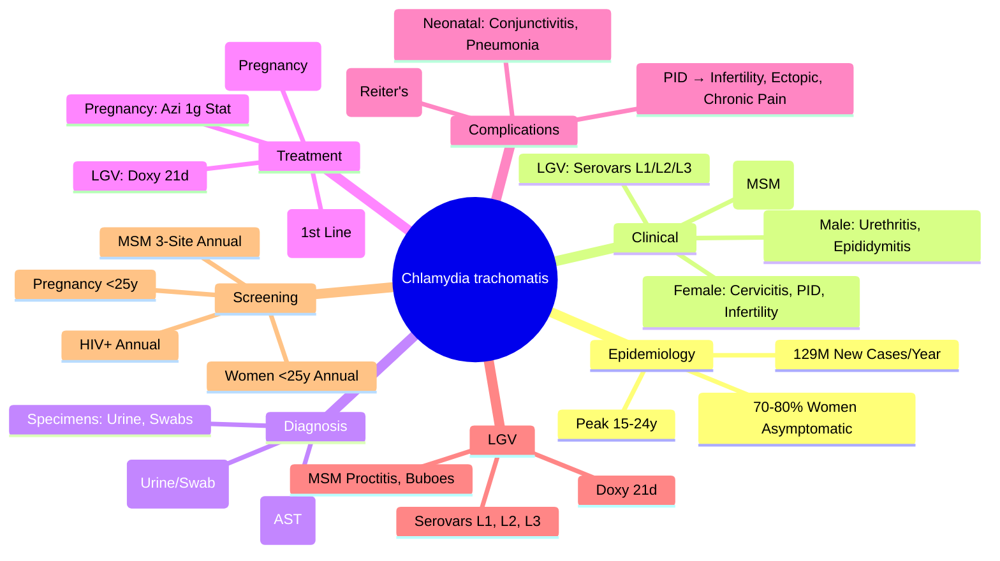

**Parent Topic:** [STI MOC](../Sexually%20Transmitted%20Infections%20MOC.md) → [STI Hierarchy](../Davidson%20Chapter%2013%20-%20STI%20Hierarchy.md)  
**Status:** `full-fcps-mrcp-note`  
**Priority:** ⭐⭐⭐ HIGHEST (FCPS/MRCP — Most Common Bacterial STI, LGV, Neonatal, Screening)  
**Source:** Davidson 24th Ed Ch 13; WHO/BASHH/CDC Guidelines; FCPS/MRCP Syllabus; NICE CG110

---

## 1. 🎯 Learning Objectives
- [ ] Recognise **Chlamydia trachomatis** clinical manifestations (Genital, LGV, Extra-genital, Neonatal)
- [ ] Apply **diagnostic algorithms** (NAAT, Culture, POC) and interpret results
- [ ] Apply **evidence-based treatment** (Doxycycline, Azithromycin, Amoxicillin in Pregnancy)
- [ ] Manage **LGV** (L1/L2/L3 Serovars) and **Extra-genital** infections (Pharyngeal, Rectal, Conjunctival)
- [ ] Manage **Neonatal** Chlamydia (Ophthalmia Neonatorum, Pneumonia)
- [ ] Implement **Screening, Partner Notification, Test of Cure** strategies
- [ ] Answer viva: "Chlamydia screening in pregnancy" and "LGV vs Classic Chlamydia" and "Test of Cure timing"

---

## 2. 🧠 Core Concept: Chlamydia trachomatis Biology

```mermaid
flowchart TD
    A[Chlamydia trachomatis] --> B[Obligate Intracellular Bacterium]
    B --> C[Developmental Cycle]
    C --> C1[Elementary Body (EB) — Infectious, Metabolically Inert]
    C --> C2[Reticulate Body (RB) — Replicative, Metabolically Active]
    C1 --> C2[Entry → Endosome → RB]
    C2 --> C1[Replication → EB Release → Cell Lysis]
    B --> D[Serovars]
    D --> D1[A-K] → Genital Infections (D-K)
    D --> D2[L1, L2, L3] → **LGV** (Invasive)
    D --> D3[A-C] → **Trachoma** (Ocular)
    B --> E[Pathogenesis]
    E --> E1[Invasion → Epithelial Cells → Inflammation]
    E --> E2[Immune Evasion → Persistence, Reinfection]
    E --> E3[Scarring → Fibrosis → Sequelae (PID, Ectopic, Infertility)]
```

---

## 1️⃣ Chlamydia trachomatis — Genital Infection

### Epidemiology
| Parameter | Detail |
|---------|--------|
| **Global Incidence** | **~129 Million** New Cases/Year (WHO 2023) |
| **Prevalence** | **3.8%** (Women 15-49), **2.7%** (Men 15-49) |
| **Age Peak** | **15-24 Years** (Highest Incidence) |
| **Asymptomatic Rate** | **70-80% Women**, **50% Men** — **Silent Epidemic** |
| **Transmission** | Sexual (Vaginal, Anal, Oral), Vertical (Mother→Child) |
| **Co-infection** | **10-40%** with Gonorrhoea; **HIV** Co-infection ↑ Risk |

### Clinical Presentation

| Sex | Symptomatic | Asymptomatic | Key Features |
|-----|-------------|--------------|--------------|
| **Male** | **Urethritis** (50%) | 50% | Dysuria, Urethral Discharge (Mucopurulent), Meatal Erythema, **Epididymo-orchitis** (Complication) |
| **Female** | **Cervicitis** (30%) | **70-80%** | Cervicitis (Mucopurulent Discharge, Ectopy, Friability), **PID** (↑ Risk), Dyspareunia, Intermenstrual Bleeding |
| **Rectal** | Proctitis (MSM) | Often Asymptomatic | Mucus Discharge, Tenesmus, Rectal Pain |
| **Pharyngeal** | Rarely Symptomatic | Most Asymptomatic | Usually Asymptomatic Carriage |

> **Key**: **70-80% Women Asymptomatic** → **Screening Essential** (Opportunistic & Targeted)

---

## 2️⃣ Lymphogranuloma Venereum (LGV)

| Feature | Detail |
|---------|--------|
| **Serovars** | **L1, L2, L3** (Invasive, Invade Lymphatics) |
| **Epidemiology** | **MSM Outbreaks** (Europe, NA), Endemic in Africa, SE Asia, S. America |
| **Transmission** | Sexual (Anal > Vaginal), **MSM Outbreaks** (Proctitis) |

### Clinical Stages

| Stage | Features | Duration |
|-------|----------|----------|
| **Primary** | **Painless Papule/Ulcer** (Genital/Rectal), Transient, Often Missed | Days-Weeks |
| **Secondary** | **Suppurative Inguinal/Femoral Buboes** (Matted, Fluctuant), **Proctocolitis** (Rectal Pain, Tenesmus, Bloody Mucus, Constipation), Fever, Constitutional | Weeks-Months |
| **Tertiary** | **Chronic** — Strictures, Fistulas, **Rectal Strictures**, **Elephantiasis** (Genital), **Frozen Pelvis** (Frozen Pelvis Syndrome) | Years |

### Diagnosis
| Test | Utility |
|------|---------|
| **NAAT (CT + LGV Specific)** | **1st Line** — Differentiates LGV (L1/L2/L3) from Non-LGV CT |
| **Serology** | Complement Fixation (CF) — Historical, Low Sensitivity |
| **Culture** | Rarely Available, Specialised Labs |

### Treatment (LGV)
| Regimen | Dose & Duration |
|---------|-----------------|
| **Doxycycline** | **100mg BD × 21 Days** (Longer than Genital CT) |
| **Alternative** | Erythromycin 500mg QID × 21d (Pregnancy) |
| **Partner Management** | **All Partners Last 60 Days** — Screen, Treat, Counselling |

---

## 3️⃣ Extra-Genital Infections

### Pharyngeal Chlamydia
| Feature | Detail |
|---------|--------|
| **Prevalence** | High in MSM (Pharyngeal CT ~3-5%), Low in Heterosexual |
| **Symptoms** | Usually Asymptomatic, Sore Throat (Rare) |
| **Testing** | NAAT (Pharyngeal Swab) — **Not Routine Unless Risk** |
| **Treatment** | **Same as Genital** (Doxycycline/Azithromycin) |

### Rectal Chlamydia (Including LGV)
| Feature | Detail |
|---------|--------|
| **Risk Groups** | **MSM** (Receptive Anal), Women (Anal Sex) |
| **Symptoms** | Proctitis (Pain, Mucus, Blood, Tenesmus), **LGV: Proctocolitis, Buboes** |
| **Testing** | NAAT (Rectal Swab) — **LGV-Specific PCR** if Proctitis |
| **Treatment** | **LGV: Doxy 100mg BD × 21d**; **Non-LGV: Standard CT Regimen** |

### Conjunctival Chlamydia
| Feature | Detail |
|---------|--------|
| **Transmission** | Autoinoculation (Genital→Eye), Direct Contact |
| **Clinical** | **Follicular Conjunctivitis**, Mucopurulent Discharge, Preauricular Lymphadenopathy |
| **Diagnosis** | NAAT (Conjunctival Swab), Giemsa (Inclusion Bodies) |
| **Treatment** | **Systemic** (Doxy/Azithro) + **Topical** (Tetracycline/Erythromycin Ointment) |

---

## 4️⃣ Neonatal Chlamydia

### Ophthalmia Neonatorum
| Feature | Detail |
|---------|--------|
| **Onset** | **Day 5-14** Post-Partum (Incubation 5-14 Days) |
| **Clinical** | **Mucopurulent Conjunctivitis**, Eyelid Oedema, Conjunctival Injection |
| **Complications** | Corneal Scarring, Blindness (If Untreated) |
| **Diagnosis** | **NAAT (Conjunctival Swab)**, Giemsa (Inclusion Bodies) |
| **Treatment** | **Systemic**: Azithromycin 20mg/kg/dose OD × 3d (Oral) OR Erythromycin 50mg/kg/d ÷4 × 14d <br> **Topical**: Erythromycin/Tetracycline Ointment QID × 14d |

### Neonatal Pneumonia
| Feature | Detail |
|---------|--------|
| **Onset** | **3-16 Weeks** Post-Partum |
| **Clinical** | **Staccato Cough**, Tachypnoea, Wheeze, Hypoxaemia, **No Fever**, CXR: Bilateral Diffuse Infiltrates, Hyperinflation |
| **Diagnosis** | **NAAT (Nasopharyngeal Swab)**, CXR (Bilateral Diffuse Infiltrates, Hyperinflation) |
| **Treatment** | **Azithromycin 20mg/kg/dose OD × 10-14 Days** (Preferred), Erythromycin Alternative |

---

## 4️⃣ Diagnosis — Algorithms & Interpretation

### Diagnostic Algorithm
```mermaid
flowchart TD
    A[Suspected Chlamydia] --> B{Symptomatic?}
    B -->|Yes| C[NAAT (Urine/Swab)<br/>1st Line]
    B -->|No (Screening)| C
    C --> D{NAAT Result}
    D -->|Positive| E[Treat + Partner Notify<br/>Test of Cure (GC: 2w, CT: 4w)]
    D -->|Negative| F[Consider Other Causes<br/>MG, TV, HSV, Urethral Syndrome]
    E --> G[Test of Cure (CT: 4 Weeks)<br/>If Pregnant: Repeat at 36w]
```

### Diagnostic Test Comparison

| Test | Sensitivity | Specificity | TAT | Sample | Best For |
|------|-------------|-------------|-----|--------|----------|
| **NAAT (PCR/TMA/SDA)** | **>95%** | **>98%** | 1-24h | Urine, Swab (Endocervical, Vaginal, Urethral, Rectal, Pharyngeal) | **1st Line** (All Sites) |
| **Culture** | 70-80% | **100%** | 48-72h | Swab | **AST**, Legal, Treatment Failure |
| **POC NAAT** | 90-95% | 97-99% | 20-90min | Swab/Urine | **Rapid/Outreach** |
| **Rapid Antigen** | 70-80% | 95-98% | 10-30min | Swab | **Not Recommended** (Low Sensitivity) |
| **Serology** | Low | Low | Days | Serum | **Not for Acute Diagnosis** (Past Infection) |

### Specimen Collection
| Site | Specimen | Transport |
|------|----------|-----------|
| **Male Urethral** | **First-Catch Urine** (20-30mL, Hold ≥1h) OR Urethral Swab | NAAT Transport Medium |
| **Female Endocervical** | Endocervical Swab (Remove Mucus First) | NAAT Transport Medium |
| **Female Vaginal** | Self-Collected Vaginal Swab (Validated) | NAAT Transport Medium |
| **Rectal** | Rectal Swab (Insert 2-3cm) | NAAT Transport Medium |
| **Pharyngeal** | Pharyngeal Swab | NAAT Transport Medium |
| **Conjunctival** | Conjunctival Swab | NAAT Transport Medium |

> **Key**: **Urine = Non-Invasive, Good for Screening**; **Swab = Better for Symptomatic, Extra-Genital Sites**

---

## 4️⃣ Treatment — Evidence-Based Regimens

### Uncomplicated Genital Chlamydia

| Population | 1st Line | Alternative | Duration |
|------------|----------|-------------|----------|
| **Adults/Adolescents (≥12y)** | **Doxycycline 100mg BD × 7 Days** | **Azithromycin 1g Stat** (Single Dose) | 7 Days / Single Dose |
| **Pregnancy** | **Azithromycin 1g Stat** (Safe) | Amoxicillin 500mg TDS × 7d | Single Dose / 7 Days |
| **Breastfeeding** | **Azithromycin 1g Stat** (Compatible) | Erythromycin 500mg QID × 7-14d | Single Dose |
| **Allergy (Tetracycline/Macrolide)** | **Levofloxacin 500mg OD × 7d** | Moxifloxacin 400mg OD × 7d | 7 Days |

> **Key**: **Doxycycline 1st Line** (Higher Cure Rate, Rectal Efficacy); **Azithro 1g Stat** = Convenience, Pregnancy Safe

### Rectal Chlamydia (Non-LGV)
| Population | Regimen |
|------------|---------|
| **All** | **Doxycycline 100mg BD × 7 Days** (Preferred — Better Rectal Cure) |

### Lymphogranuloma Venereum (LGV)
| Regimen | Duration |
|---------|----------|
| **Doxycycline 100mg BD × 21 Days** | **21 Days** (Longer than Genital CT) |
| **Alternative** | Erythromycin 500mg QID × 21d (Pregnancy) |

### Neonatal Chlamydia
| Condition | Regimen |
|-----------|---------|
| **Ophthalmia Neonatorum** | **Azithromycin 20mg/kg/dose OD × 3 Days** (Oral) + **Topical Erythromycin/Tetracycline Ointment QID × 14d** |
| **Pneumonia** | **Azithromycin 20mg/kg/dose OD × 10-14 Days** (Preferred) |

---

## 5️⃣ Partner Notification & Test of Cure

### Partner Notification
| Template | Action |
|----------|--------|
| **Index Patient** | Notify All Partners **Last 60 Days** (or Last Partner if >60 Days) |
| **Methods** | 1. **Patient Referral** (Preferred) 2. **Provider Referral** 3. **Contract Referral** (Time-Limited) |
| **EPT (Expedited Partner Therapy)** | **Legal Where Permitted**: Provide Medication to Index Patient for Partner(s) — **CT**: Doxy 100mg BD × 7d; **GC**: Ceftriaxone 500mg IM + Azithro 1g |

### Test of Cure (TOC)
| Infection | Timing | Test |
|-----------|--------|------|
| **Gonorrhoea** | **2 Weeks** Post-Treatment | NAAT (or Culture + AST) |
| **Chlamydia** | **4 Weeks** Post-Treatment | NAAT (Avoid <3w — False +) |
| **LGV** | **4-6 Weeks** | NAAT |
| **M. genitalium** | **4 Weeks** | NAAT (Resistance Testing) |
| **Pregnancy** | **3rd Trimester (36w)** | Repeat NAAT (Ensure Cure Pre-Delivery) |

> **Key**: **No TOC <3 Weeks** (Residual DNA → False Positive NAAT)

---

## 5️⃣ Screening & Public Health

### Screening Recommendations (UK/NICE/CDC)
| Population | Recommendation |
|----------|----------------|
| **Sexually Active Women <25y** | **Annual CT/GC Screen** (Opportunistic, Self-Sample) |
| **Pregnant Women** | **Booking**: CT/GC (If <25y or Risk Factors) |
| **MSM** | **3-Site Testing** (Urethral, Pharyngeal, Rectal) **Annual** (3-6m if High Risk) |
| **Pregnant Women <25y** | **Routine CT/GC Screen** at Booking |
| **Termination of Pregnancy** | **Routine CT/GC Screen** |
| **HIV Positive** | **Annual** CT/GC/Syphilis (3-Site if MSM) |

### Partner Notification & EPT
| Strategy | Description |
|--------|-------------|
| **Patient Referral** | Index Patient Informs Partners (Preferred — Empowers Patient) |
| **Provider Referral** | Health Staff Notifies Partners (Confidential) |
| **EPT (Expedited Partner Therapy)** | **Legal Where Permitted**: Index Patient Delivers Medication to Partner(s) — **CT: Doxy 100mg BD × 7d**; **GC**: Ceftriaxone 500mg IM + Azithro 1g; **TV**: Metronidazole 2g Stat |

---

## 6️⃣ Complications & Sequelae

| Complication | Pathophysiology | Long-Term Impact |
|--------------|----------------|------------------|
| **Pelvic Inflammatory Disease (PID)** | Ascending Infection → Endometritis, Salpingitis, Peritonitis | **Infertility** (Tubal Factor), **Ectopic Pregnancy** (↑ 6-10x), Chronic Pelvic Pain |
| **Epididymo-orchitis** | Ascending Urethral Infection | **Infertility** (Obstructive), Chronic Scrotal Pain |
| **Perihepatitis (Fitz-Hugh-Curtis)** | Peri-hepatic Inflammation | RUQ Pain, Violin String Adhesions |
| **Reactive Arthritis (ReA)** | Post-Chlamydial (HLA-B27 Association) | Asymmetric Oligoarthritis, Conjunctivitis, Urethritis (Reiter's Triad) |
| **Infertility** | Tubal Damage (PID), Epididymal Obstruction | **Primary/Secondary Infertility** |
| **Ectopic Pregnancy** | Tubal Damage (PID) | **↑ 6-10x Risk** |
| **Perinatal** | Ophthalmia Neonatorum, Pneumonia | Blindness, Chronic Lung Disease |

---

## 7️⃣ Lymphogranuloma Venereum (LGV) — Detailed

| Aspect | Detail |
|--------|--------|
| **Causative Agent** | **C. trachomatis Serovars L1, L2, L3** (Invasive) |
| **Epidemiology** | **MSM Outbreaks** (Europe, NA), Endemic (Africa, SE Asia, Caribbean) |
| **Transmission** | Anal Sex (MSM), Vaginal Sex (Endemic Areas) |
| **Clinical Stages** | 1°: Painless Ulcer → 2°: **Suppurative Buboes, Proctocolitis** → 3°: Strictures, Fistulas, Elephantiasis |
| **Diagnosis** | **NAAT (LGV-Specific PCR)** — Differentiates L1/L2/L3 from Genital CT |
| **Treatment** | **Doxycycline 100mg BD × 21 Days** (Longer than Genital CT) |
| **Partner Management** | **All Partners Last 60 Days** — Screen, Treat, Counselling |

---

## 3. ⚡ FCPS/MRCP High-Yield Summary

| Topic | Key Points |
|-------|------------|
| **Epidemiology** | **129M New Cases/Year** (Most Common Bacterial STI), **70-80% Women Asymptomatic**, Peak 15-24y |
| **Clinical** | **Urethritis (M)**, **Cervicitis/PID (F)**, **Rectal/Pharyngeal (MSM)**, **LGV** (MSM, Buboes, Proctitis) |
| **Diagnosis** | **NAAT (PCR/TMA/SDA) = 1st Line** (Urine/Swab), >95% Sens/Spec; Culture for AST |
| **Treatment** | **Doxycycline 100mg BD × 7d** (1st Line); **Azithromycin 1g Stat** (Alt, Pregnancy); **LGV: Doxy 21d** |
| **Pregnancy** | **Azithromycin 1g Stat** (Safe); **Avoid Doxycycline** (Teratogenic) |
| **LGV** | **Serovars L1-3**, **Doxy 100mg BD × 21d**, MSM Outbreaks, Proctitis/Buboes |
| **Neonatal** | **Conjunctivitis (Day 5-14)** → Azithro 20mg/kg OD × 3d + Topical; **Pneumonia** (3-16w, Staccato Cough) → Azithro 20mg/kg × 10-14d |
| **Test of Cure** | **CT: 4 Weeks** (NAAT); **Pregnancy**: Repeat at 36w; **LGV: 4-6 Weeks** |
| **Screening** | **Women <25y Annual**, **MSM 3-Site Annual**, **Pregnancy <25y**, **HIV+ Annual** |
| **LGV** | **Serovars L1/L2/L3**, **Doxy 21d**, **MSM Proctitis/Buboes** |
| **Complications** | **PID → Infertility, Ectopic, Chronic Pain**; **Reactive Arthritis** (HLA-B27) |
| **Screening** | **Women <25y Annual**, **MSM 3-Site Annual**, **Pregnancy <25y** |

---

## 4. 🎤 Viva Questions (Expected Answers)

| # | Question | Expected Answer |
|---|----------|-----------------|
| 1 | Chlamydia — most common clinical presentation in women? | **Asymptomatic (70-80%)**; Symptomatic: Cervicitis (Mucopurulent Discharge, Ectopy, Friability), PID |
| 2 | Chlamydia treatment in pregnancy? | **Azithromycin 1g Stat** (Single Dose) — Safe, Effective; **Doxycycline Contraindicated** (Teratogenic) |
| 3 | LGV vs non-LGV Chlamydia — key differences? | **LGV (Serovars L1-L3)**: Invasive, Lymphatic Spread, Buboes, Proctocolitis, Strictures; **Treatment: Doxy 21d** vs 7d for Non-LGV |
| 4 | Test of Cure for Chlamydia — when & how? | **4 Weeks Post-Treatment** (NAAT); **Pregnancy: Repeat at 36w**; Avoid <3w (False +ve Residual DNA) |
| 5 | Neonatal chlamydial pneumonia — presentation & treatment? | **3-16 Weeks**, Staccato Cough, Tachypnoea, CXR Bilateral Diffuse Infiltrates → **Azithromycin 20mg/kg/d OD × 10-14d** |
| 6 | LGV vs non-LGV Chlamydia treatment difference? | **LGV: Doxy 100mg BD × 21 Days**; **Non-LGV Genital: Doxy 7d** |
| 7 | Chlamydia test of cure — timing & method? | **4 Weeks Post-Treatment** (NAAT); Avoid <3w (False +ve); **Pregnancy: Repeat at 36w** |
| 8 | Chlamydia in pregnancy — treatment? | **Azithromycin 1g Stat** (Safe); **Avoid Doxycycline** (Teratogenic); Amoxicillin 500mg TDS × 7d (Alternative) |
| 9 | LGV clinical presentation in MSM? | **Proctocolitis** (Rectal Pain, Mucus/Blood, Tenesmus), **Suppurative Inguinal Buboes**, Strictures/Fistulas (Late) |
| 10 | Chlamydia screening — who & when? | **Women <25y Annual**, **MSM 3-Site Annual (Urethral/Pharyngeal/Rectal)**, **Pregnancy <25y**, **MSM High Risk 3-6 Monthly** |

---

## 5. 🧩 Confusions & Mnemonics

| Confusion | Clarification |
|-----------|---------------|
| **"Chlamydia is rare"** | **NO.** **Most Common Bacterial STI** (129M New Cases/Year Globally) |
| **"Chlamydia always symptomatic"** | **NO.** **70-80% Women Asymptomatic**, 50% Men Asymptomatic — **Screening Essential** |
| **"Doxycycline safe in pregnancy"** | **NO.** **Contraindicated** (Teratogenic — Teeth/Bone); **Azithromycin 1g Stat** is Safe |
| **"AZM 1g = Doxy 7d in Efficacy"** | **NO.** **Doxycycline Superior** (Higher Cure Rate, Better Rectal Efficacy); AZM = Convenience/Pregnancy |
| **"LGV = Just Another Chlamydia"** | **NO.** **Different Serovars (L1-L3)**, Invasive, Lymphatic Spread, **Doxy 21d vs 7d**, Proctitis/Buboes/Strictures |
| **"Test of Cure = Immediately After Treatment"** | **NO.** **Wait 4 Weeks** (Residual DNA → False Positive); Pregnancy: Repeat at 36 Weeks |
| **"LGV = Only in Tropics"** | **NO.** **MSM Outbreaks in Europe/N. America** (L2b Variant), Endemic in Africa/SE Asia |
| **"Rectal Chlamydia = Always LGV"** | **NO.** Most Rectal CT = **Non-LGV** (Genital Serovars D-K); LGV = Specific Proctocolitis/Buboes |
| **"Azithromycin 1g = Inferior to Doxy"** | **For Genital CT: Non-Inferior (Uncomplicated)**; **For Rectal: Doxy Superior**; **Pregnancy: Azithro Only Option** |
| **"Test of Cure at 2 Weeks"** | **NO.** **4 Weeks Minimum** (Residual DNA → False Positive); Pregnancy = 36 Weeks |

> **Mnemonic: CHLAMYDIA MASTER**  
> **C**hlamydia: **Most Common Bacterial STI** (129M/Year Global)  
> **H**igh Prevalence: **15-24y Peak**, **70-80% Women Asymptomatic**  
> **L**GV: **L1/L2/L3 Serovars**, **Doxy 21d**, **MSM Proctitis/Buboes**  
> **A**symptomatic: **70-80% Women**, **50% Men** — **Screening Essential**  
> **M**AT: **Pregnancy** → **Azithromycin 1g Stat** (Safe); **Doxy Contraindicated**  
> **Y** (Why Screen?): **Asymptomatic → PID → Infertility/Ectopic/Infertility**  
> **D**x: **NAAT 1st Line** (Urine/Swab), >95% Sens/Spec; Culture for AST  
> **I**mmunology: **Obligate Intracellular**, EB→RB Cycle, Immune Evasion  
> **A**ntibiotic: **Doxy 100mg BD × 7d (1st Line)**, **Azi 1g Stat (Pregnancy)**  
> **T**reatment LGV: **Doxy 100mg BD × 21d** (Longer)  
> **N**eonatal: **Ophthalmia (Day 5-14) → Azi 20mg/kg × 3d**; **Pneumonia (3-16wk) → Azi 20mg/kg × 10-14d**  
> **T**est of Cure: **4 Weeks (NAAT)**, **Pregnancy 36w**, **LGV 4-6w**  
> **R**ectal CT: **Doxy 7d** (Better Rectal Cure); **LGV Rectal = 21d Doxy**  
> **R**eproductive Sequelae: **PID → Infertility, Ectopic, Chronic Pain**  
> **A**MR: **Rare**, But **LGV Emerging** (Monitor)  
> **S**creening: **Women <25y Annual; MSM 3-Site Annual; Pregnancy <25y; HIV+ Annual**  
> **T**est of Cure: **4 Weeks (NAAT)**, **Pregnancy 36w**, **LGV 4-6w**  
> **R**isk Factors: **<25y, New Partner, Multiple Partners, Inconsistent Condom**  
> **A**ntibiotic: **Doxy 100mg BD × 7d (1st Line)**, **Azi 1g Stat (Pregnancy)**  

---

## 6. 🗺️ Mind Map



---

## 7. 📅 Spaced Repetition Tracker

| Review | Date | Score (0–5) | Notes |
|--------|------|-------------|-------|
| Day 1 | | | |
| Day 3 | | | |
| Day 7 | | | |
| Day 14 | | | |
| Day 30 | | | |
| Day 90 | | | |

---

## 8. 📝 Self-Test Scorecard

| Section | Max | Score | % |
|---------|-----|-------|---|
| Epidemiology & Clinical Features | 3 | | |
| Diagnosis (NAAT, Specimens, Interpretation) | 3 | | |
| Treatment Regimens (Standard, Pregnancy, LGV, Neonatal) | 4 | | |
| Complications & Sequelae | 2 | | |
| LGV Specifics | 2 | | |
| Screening & Public Health | 2 | | |
| Test of Cure & Partner Notification | 2 | | |
| Special Populations (Pregnancy, Neonatal, MSM) | 3 | | |
| **Total** | **20** | | |

---

## 9. 💬 Exam Answer Modes

| Format | Prompt | Key Points |
|--------|--------|------------|
| **Long Essay** | "Describe the clinical manifestations, diagnosis, and management of genital Chlamydia trachomatis infection." | Epidemiology, Clinical (M/F/Rectal/Pharyngeal/LGV/Neonatal), Diagnosis (NAAT 1st Line), Treatment (Doxy 1st Line, Azi in Pregnancy, LGV 21d), Complications (PID, Infertility, Ectopic, Reactive Arthritis), Neonatal, Screening, Partner Notification, Test of Cure |
| **Short Note** | "Chlamydia in pregnancy — diagnosis and management." | NAAT 1st Line, **Azithromycin 1g Stat** (Safe), Avoid Doxycycline, Test of Cure at 36w, Partner Notification, Neonatal Prophylaxis if Untreated |
| **Viva** | "25-year-old pregnant woman at 12 weeks tests positive for Chlamydia. Management?" | **Azithromycin 1g Stat** (Safe in Pregnancy), **Test of Cure at 36 Weeks**, Partner Notification/Treatment, Counselling, Retest at 36w |
| **Ward Round** | "MSM with rectal pain, mucus discharge. NAAT positive for Chlamydia. LGV PCR negative. Management?" | **Doxycycline 100mg BD × 7 Days** (Non-LGV Rectal CT), Test of Cure at 4 Weeks, Partner Notification, HIV/Syphilis Screen, Condom Counselling |
| **Last-Night** | "CT: 129M/yr, 70-80% F Asympt. NAAT 1st Line. Tx: Doxy 7d (1st), Azi 1g (Preg). LGV: L1-L3, Doxy 21d. Neonate: Ophthalmia (Azi 20mg/kg×3d), Pneumonia (Azi 20mg/kg×10-14d). TOC: 4w (NAAT), Preg=36w. LGV: Doxy 21d. Screen: <25y F Annual, MSM 3-Site Annual. Complications: PID, Infertility, Ectopic, Reactive Arthritis." | Compressed. |

---

## 10. 📌 Summary
- **Chlamydia trachomatis**: Most Common Bacterial STI (129M/Year), **70-80% Women Asymptomatic**, Peak 15-24y
- **Clinical**: Urethritis/Cervicitis/PID, Rectal/Pharyngeal (MSM), **LGV (L1-L3)** — Invasive, Buboes, Proctitis
- **Diagnosis**: **NAAT 1st Line** (Urine/Swab, >95% Sens/Spec), Culture for AST
- **Treatment**: **Doxycycline 100mg BD × 7d (1st Line)**; **Azithromycin 1g Stat** (Pregnancy); **LGV: Doxy 100mg BD × 21d**
- **Pregnancy**: **Azithromycin 1g Stat** (Safe); **Avoid Doxycycline** (Teratogenic)
- **Neonatal**: Ophthalmia (Day 5-14) → **Azithro 20mg/kg OD × 3d + Topical**; Pneumonia (3-16w) → **Azithro 20mg/kg × 10-14d**
- **LGV**: Serovars **L1, L2, L3**; **Doxy 100mg BD × 21d**; MSM Proctitis, Buboes, Strictures
- **Test of Cure**: **4 Weeks (NAAT)**; Pregnancy → 36 Weeks; LGV 4-6 Weeks
- **Screening**: Women <25y Annual, MSM 3-Site Annual, Pregnancy <25y, HIV+ Annual
- **Complications**: PID → Infertility, Ectopic, Chronic Pain; Neonatal Ophthalmia/Pneumonia; Reactive Arthritis

---

## 11. ❓ MCQs (10)

1. **Most common clinical presentation of Chlamydia in women?**  
   A. Pelvic Inflammatory Disease  B. **Asymptomatic (70-80%)**  C. Cervicitis  D. Urethritis  
   *Answer: B. 70-80% of women with Chlamydia are asymptomatic.*

2. **Chlamydia treatment in pregnancy — recommended regimen?**  
   A. Doxycycline 100mg BD × 7 Days  B. **Azithromycin 1g Single Dose**  C. Erythromycin 500mg QID × 14 Days  D. Ofloxacin 400mg BD × 7 Days  
   *Answer: B. Azithromycin 1g Stat — Safe in Pregnancy; Doxycycline Contraindicated.*

3. **Lymphogranuloma Venereum (LGV) — causative serovars?**  
   A. A-K  B. **L1, L2, L3**  C. A, B, Ba  D. D-K  
   *Answer: B. LGV caused by Serovars L1, L2, L3 (Invasive, Lymphotropic).*

4. **LGV treatment duration vs. Non-LGV Chlamydia?**  
   A. Same (7 Days)  B. **21 Days (vs 7 Days for Non-LGV)**  C. 14 Days  D. Single Dose  
   *Answer: B. LGV requires **Doxycycline 100mg BD × 21 Days** (vs 7 Days for Non-LGV).*

5. **Neonatal chlamydial conjunctivitis — presentation & treatment?**  
   A. Day 1-2, Topical Only  B. **Day 5-14, Systemic Azithromycin 20mg/kg OD × 3 Days + Topical**  C. Day 1-3, IV Ceftriaxone  D. Day 3-5, Oral Erythromycin  
   *Answer: B. Onset Day 5-14, Systemic Azithromycin 20mg/kg OD × 3 Days + Topical Erythromycin/Tetracycline Ointment.*

6. **Chlamydia test of cure — recommended timing?**  
   A. 1 Week  B. 2 Weeks  C. **4 Weeks**  D. 8 Weeks  
   *Answer: C. 4 Weeks Post-Treatment (NAAT); Avoid <3 Weeks (False Positive Residual DNA).*

7. **LGV treatment duration vs Non-LGV Chlamydia?**  
   A. 7 Days  B. 10 Days  C. **21 Days**  D. Single Dose  
   *Answer: C. LGV requires Doxycycline 100mg BD × 21 Days (vs 7 Days for Non-LGV).*

8. **Chlamydia screening — UK recommendation for women?**  
   A. Annual for All Women  B. **Annual for Women <25 Years**  C. Every 5 Years  D. Only If Symptomatic  
   *Answer: B. Opportunistic Annual Screening for Sexually Active Women <25 Years (NICE).*

9. **Chlamydia in pregnancy — first-line treatment?**  
   A. Doxycycline 100mg BD × 7 Days  B. **Azithromycin 1g Single Dose**  C. Erythromycin 500mg QID × 14 Days  D. Amoxicillin 500mg TDS × 7 Days  
   *Answer: B. Azithromycin 1g Stat — Safe in Pregnancy; Doxycycline Contraindicated.*

10. **LGV serovars?**  
    A. A-K  B. **L1, L2, L3**  C. D-K  D. A, B, Ba  
    *Answer: B. LGV Caused by Serovars L1, L2, L3 (Invasive, Lymphotropic).*

---

## 12. 📋 SBAs (10)

1. **25-year-old pregnant woman at 12 weeks tests positive for Chlamydia on NAAT. Best treatment?**  
   A. Doxycycline 100mg BD × 7 Days  B. **Azithromycin 1g Stat**  C. Erythromycin 500mg QID × 14 Days  D. Ceftriaxone 500mg IM  
   *Answer: B. Azithromycin 1g Stat — Safe in Pregnancy; Doxycycline Contraindicated.*

2. **MSM with rectal pain, mucus discharge. NAAT positive for Chlamydia, LGV PCR negative. Management?**  
   A. Doxycycline 100mg BD × 21 Days  B. **Doxycycline 100mg BD × 7 Days**  C. Ceftriaxone 500mg IM  D. Azithromycin 1g  
   *Answer: B. Non-LGV Rectal Chlamydia → Doxycycline 100mg BD × 7 Days.*

3. **Neonate with mucopurulent conjunctivitis at Day 10 of life. Mother had untreated Chlamydia. Treatment?**  
   A. Topical Erythromycin Only  B. **Systemic Azithromycin 20mg/kg/dose OD × 3 Days + Topical Erythromycin Ointment**  C. IV Ceftriaxone  D. Oral Doxycycline  
   *Answer: B. Systemic Azithromycin 20mg/kg/dose OD × 3 Days + Topical Erythromycin Ointment QID × 14 Days.*

4. **MSM with painful proctitis, bloody mucus, inguinal buboes. NAAT positive for CT, LGV PCR positive. Treatment?**  
   A. Doxycycline 100mg BD × 7 Days  B. **Doxycycline 100mg BD × 21 Days**  C. Azithromycin 1g Stat  D. Ceftriaxone IM  
   *Answer: B. LGV Confirmed → Doxycycline 100mg BD × 21 Days.*

5. **Chlamydia test of cure — when to repeat NAAT?**  
   A. 1 Week  B. 2 Weeks  C. **4 Weeks**  D. 8 Weeks  
   *Answer: C. 4 Weeks Post-Treatment (NAAT); Avoid <3 Weeks (Residual DNA False Positive).*

---

## 13. 🔑 Answer Keys
| MCQs | SBAs |
|------|------|
| 1-B, 2-B, 3-B, 4-B, 5-B, 6-B, 7-B, 8-B, 9-B, 10-B | 1-B, 2-B, 3-B, 4-B, 5-B |

---

## 14. 🔗 Cross-Links
- [[2.2 Gonorrhoea.md]] — Differential Diagnosis (Urethral Discharge), Co-infection
- [[2.3 Syphilis.md]] — Differential (GUD), Co-infection, Congenital
- [[5.1-5.8 Syndromic Management.md]] — Urethral Discharge, Vaginal Discharge, PID Algorithms
- [[3.2 HSV.md]] — Differential (Genital Ulcer Disease)
- [[5.1-5.8 Syndromic Management.md]] — Urethral Discharge, Vaginal Discharge, PID, Proctitis Algorithms
- [[3.2 HSV.md]] — Differential (Genital Ulcer Disease)
- [[5.1-5.8 Syndromic Management.md]] — Neonatal STIs (Ophthalmia, Pneumonia)
- [[5.5 Genetic Counselling]] — Partner Notification, Cascade Testing, Reproductive Options
- [[9. ELSI]] — Partner Notification Ethics, Confidentiality, EPT Legality

---

**Last Updated:** 2026-06-15  
**Next:** Build `2.2 Gonorrhoea.md` (Priority 1)