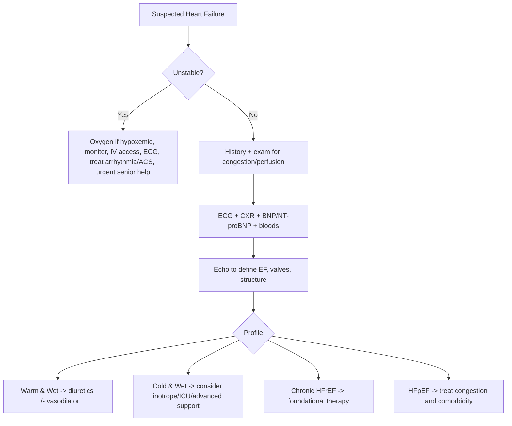
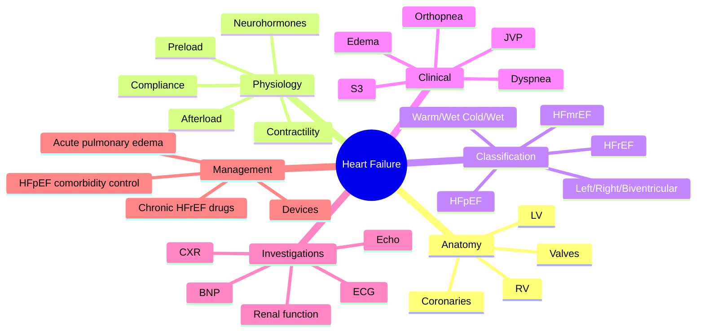
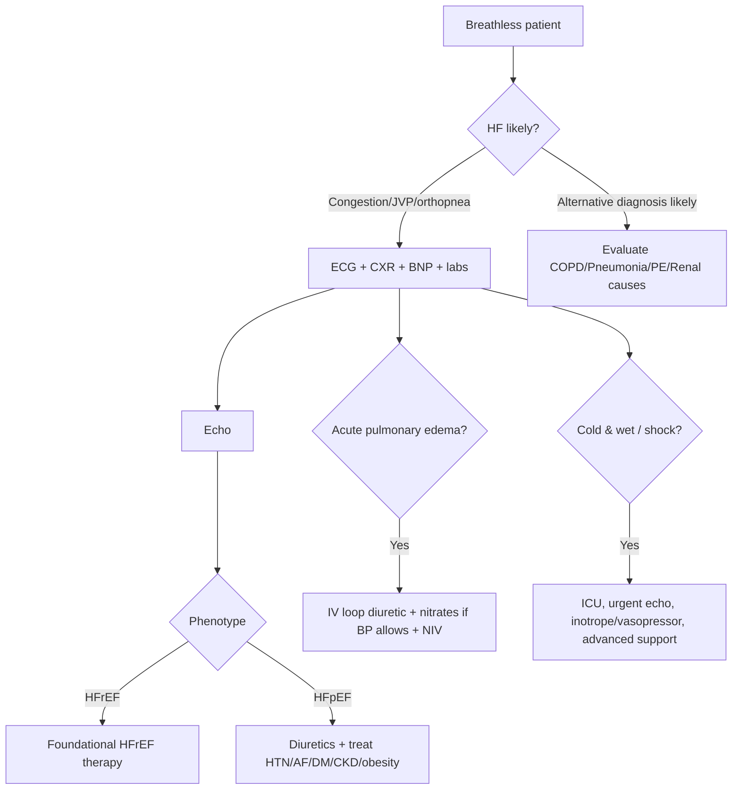

# Heart Failure — Integrated Overview

<callout icon="⭐" color="red_bg">
**Topic:** Heart Failure — Integrated Overview — 16 Cardiology
**Style:** Sea Knowledge comprehensive integrated overview
**Source:** Medicine source preserved with full content
**Audience:** FCPS / MRCP exam prep
**Summary:** Heart failure (HF) is a clinical syndrome of structural/functional cardiac abnormality causing reduced cardiac output and/or elevated filling pressures. This integrated overview synthesizes all atomic HF topics in MedSea into a single high-yield narrative covering definition, classification, clinical features, investigations, acute and chronic management, devices, and special populations.
</callout>

---

<callout icon="⚠️" color="red_bg">
**Heart failure (HF)** is one of the highest-yield long-answer topics in FCPS/MRCP. You should be able to define it, classify it, explain the anatomy and physiology behind pump dysfunction, identify bedside profiles, interpret ECG/CXR/BNP/echo findings, and manage both **acute decompensated heart failure (ADHF)** and **chronic heart failure** safely.
</callout>
Related: [[Acute Coronary Syndrome]], [[Hypertension]], [[Arrhythmias]], [[Valvular Heart Disease]], [[Cardiomyopathy]], [[Shock and Hemodynamic Profiles]], [[ECG Interpretation]]

## Learning Objectives
- Define heart failure and distinguish it from simple fluid overload or isolated LV dysfunction.
- Understand the relevant **cardiac anatomy** and **pump physiology** underlying systolic and diastolic dysfunction.
- Classify HF by side, time course, ejection fraction, hemodynamic profile, and functional limitation.
- Recognize causes, precipitating factors, and mechanisms of decompensation.
- Use a bedside-to-investigation algorithm for diagnosis.
- Interpret key findings from ECG, CXR, BNP/NT-proBNP, echocardiography, ABG, renal function, and troponin.
- Manage **acute pulmonary edema**, **cardiogenic shock**, and chronic HFrEF using evidence-based drug logic.
- Recall major contraindications, drug cautions, and comorbidity modifications.

## Definition
Heart failure is a **clinical syndrome** caused by a structural and/or functional cardiac abnormality resulting in:
- reduced cardiac output **and/or**
- elevated intracardiac filling pressures at rest or during stress,

leading to symptoms such as:
- dyspnea
- fatigue
- ankle swelling

and signs such as:
- raised JVP
- pulmonary crackles
- peripheral edema
- hepatomegaly

> [!exam]
> **HF is a clinical syndrome, not just a low EF.** A patient may have heart failure with preserved EF (HFpEF), and a patient with low EF may be asymptomatic.

## Core Anatomy

### 1. Chambers and pump arrangement
- **Left ventricle (LV):** thick-walled systemic pump; failure causes reduced forward flow and pulmonary venous congestion.
- **Right ventricle (RV):** thin-walled low-pressure pump; failure causes systemic venous congestion.
- **Left atrium (LA):** receives pulmonary venous return; high LA pressure transmits backward to pulmonary veins and capillaries.
- **Right atrium (RA):** reflects systemic venous return and CVP/JVP.

### 2. Valves relevant to HF
- **Mitral valve:** regurgitation increases LA pressure and volume overload.
- **Aortic valve:** stenosis produces pressure overload; regurgitation causes volume overload.
- **Tricuspid valve:** regurgitation commonly accompanies RV failure and pulmonary hypertension.

### 3. Coronary anatomy relevance
- LV dysfunction frequently follows **ischemic heart disease / MI**.
- LAD territory infarction commonly causes major LV systolic impairment.
- RCA infarction may impair RV function.

### 4. Myocardial architecture
- Spiral myocardial fiber arrangement supports twist/untwist mechanics.
- Subendocardium is most vulnerable to ischemia.
- Ventricular remodeling after injury changes chamber geometry from elliptical to more spherical, worsening efficiency and MR.

### 5. Pericardial and septal relations
- Ventricular interdependence matters: severe RV overload can impair LV filling.
- Constrictive pericardial disease and tamponade mimic or worsen HF physiology.

## Core Physiology

### 1. Cardiac output
**CO = Stroke volume × Heart rate**

Stroke volume depends on:
- preload
- afterload
- contractility
- ventricular compliance

### 2. Frank-Starling mechanism
- Increased preload initially improves stroke volume.
- In HF, the ventricle operates on a flattened Starling curve.
- Extra filling pressure produces congestion with little gain in output.

### 3. Preload
- Represents ventricular filling/end-diastolic stretch.
- Clinically inferred from JVP, edema, pulmonary congestion.
- Excess preload contributes to pulmonary edema and systemic edema.

### 4. Afterload
- Resistance against ventricular ejection.
- High systemic vascular resistance, aortic stenosis, and hypertension increase LV afterload.
- Increased afterload reduces stroke volume in a failing ventricle.

### 5. Contractility
- Reduced in HFrEF due to ischemia, dilated cardiomyopathy, myocarditis, toxins, etc.

### 6. Compliance and relaxation
- Essential in HFpEF.
- A stiff ventricle fills poorly despite near-normal EF, causing high filling pressures.

### 7. Neurohormonal response
Initially compensatory, later maladaptive:
- **SNS activation:** tachycardia, vasoconstriction, arrhythmia risk
- **RAAS activation:** sodium and water retention, vasoconstriction, remodeling
- **ADH release:** water retention, hyponatremia
- **Natriuretic peptides:** counter-regulatory but insufficient in advanced HF

### 8. Remodeling
- Myocyte hypertrophy
- apoptosis/fibrosis
- chamber dilatation
- worsening MR/TR
- progressive fall in efficiency

<callout icon="⚠️" color="red_bg">
Modern HFrEF therapy works largely by **blocking maladaptive neurohormonal pathways** and reducing remodeling, not merely by removing edema.
</callout>
## Normal Values / Important Cut-offs

| Parameter | Normal / Important Threshold | Clinical relevance |
|---|---:|---|
| LVEF | ~55–70% | Normal systolic function |
| HFrEF | ≤40% | Reduced EF heart failure |
| HFmrEF | 41–49% | Mildly reduced EF |
| HFpEF | ≥50% with evidence of raised filling pressure/structural disease | Preserved EF HF |
| BNP | <100 pg/mL makes HF less likely in untreated acute setting | Elevated in HF but not specific |
| NT-proBNP | Higher values support HF; rises with age/CKD | Use contextually |
| Cardiothoracic ratio | >50% on PA CXR suggests cardiomegaly | Chronic structural clue |
| JVP | Not normally elevated above sternal angle by >3–4 cm | Reflects RA pressure |
| NYHA Class I–IV | Symptom-based | Functional severity |
| SBP <90 mmHg | Hemodynamic compromise | Shock risk |
| Oliguria | <0.5 mL/kg/h | Poor perfusion / renal hypoperfusion |
| Severe hyponatremia | Low sodium, especially <130 mmol/L | Marker of advanced HF / ADH excess |
| Troponin elevation | May indicate ACS, myocarditis, or demand injury | Search for trigger |

> [!caution]
> BNP/NT-proBNP may be **falsely lower in obesity** and **higher in CKD, AF, elderly age, pulmonary hypertension, and sepsis**.

## Classification

### A. By side involved
- **Left-sided HF:** dyspnea, orthopnea, PND, pulmonary edema
- **Right-sided HF:** edema, hepatomegaly, ascites, raised JVP
- **Biventricular HF:** features of both; very common in advanced disease

### B. By time course
- Acute HF
- Chronic HF
- Acute-on-chronic HF

### C. By ejection fraction
- **HFrEF:** EF ≤40%
- **HFmrEF:** EF 41–49%
- **HFpEF:** EF ≥50% with typical symptoms/signs and objective evidence of diastolic dysfunction/raised filling pressures

### D. By mechanism
- Systolic dysfunction
- Diastolic dysfunction
- High-output HF
- Low-output HF

### E. By congestion/perfusion profile
- **Warm and dry** – compensated
- **Warm and wet** – congested but perfused; common ADHF profile
- **Cold and dry** – hypoperfused without major congestion
- **Cold and wet** – congested and hypoperfused; worst prognosis

### F. By functional class (NYHA)
- **I:** no limitation
- **II:** slight limitation
- **III:** marked limitation
- **IV:** symptoms at rest

### G. By disease stage (conceptual)
- At risk of HF
- Structural heart disease without symptoms
- Symptomatic HF
- Advanced/refractory HF

## Etiology / Causes

### Major causes of HFrEF
- Ischemic heart disease / prior MI
- Longstanding hypertension
- Dilated cardiomyopathy
- Valvular heart disease
- Myocarditis
- Tachycardia-induced cardiomyopathy
- Toxin/drug related: alcohol, anthracyclines, cocaine
- Endocrine/metabolic: thyroid disease, diabetes
- Congenital heart disease

### Major causes of HFpEF
- Hypertension with LV hypertrophy
- Aging and myocardial stiffness
- Diabetes mellitus
- Obesity
- CKD
- Restrictive/infiltrative disease (amyloid etc.)
- Pericardial disease

### Causes of right heart failure
- Left-sided HF
- Pulmonary hypertension
- Cor pulmonale / chronic lung disease
- RV infarction
- Tricuspid/pulmonary valve disease

### High-output HF causes
- Severe anemia
- Thyrotoxicosis
- Beriberi
- AV fistula
- Paget disease (rare)
- Sepsis
- Pregnancy (selected cases)

## Risk Factors
- Hypertension
- Diabetes mellitus
- Dyslipidemia
- Smoking
- Obesity
- CAD family history
- CKD
- Prior cardiotoxic chemotherapy
- Alcohol excess
- Sleep apnea
- Rheumatic/degenerative valvular disease

## Pathophysiology

### 1. Initial cardiac insult
A structural/functional abnormality lowers pump efficiency or impairs filling.

### 2. Reduced output or raised filling pressure
- Low output causes fatigue, weakness, renal hypoperfusion.
- Raised LV filling pressure causes pulmonary venous hypertension and pulmonary edema.
- Raised systemic venous pressure causes edema, congestive hepatopathy, ascites.

### 3. Compensatory responses
- Sympathetic drive maintains BP but increases oxygen demand and arrhythmia risk.
- RAAS conserves salt/water and increases preload/afterload.
- ADH promotes free water retention → dilutional hyponatremia.

### 4. Remodeling and progression
Persistent neurohormonal activation causes:
- chamber dilatation
- fibrosis
- worsening systolic function
- worsening valvular regurgitation
- progressive congestion and end-organ dysfunction

### 5. Organ consequences
- **Lungs:** edema, pleural effusions
- **Kidney:** cardiorenal syndrome, prerenal azotemia, diuretic resistance
- **Liver:** congestive hepatopathy, cardiac cirrhosis
- **Brain:** confusion in low-output states
- **Skeletal muscle:** deconditioning/cachexia in advanced disease

## Clinical Features

### Symptoms
- Exertional dyspnea
- Orthopnea
- Paroxysmal nocturnal dyspnea
- Fatigue
- Reduced exercise tolerance
- Nocturnal cough / wheeze (cardiac asthma)
- Ankle swelling
- Abdominal distension, early satiety (right HF)
- Palpitations
- Weight gain from fluid retention
- In severe low-output states: dizziness, confusion, oliguria

### Signs
- Tachycardia
- Tachypnea
- Elevated JVP
- Bibasal crackles
- Pleural effusion
- Displaced apex beat
- S3 gallop (classic in volume-overloaded systolic dysfunction)
- Murmurs of MR/TR or valvular cause
- Peripheral edema
- Tender hepatomegaly
- Ascites
- Cool peripheries in hypoperfusion
- Narrow pulse pressure in severe low output

### Left vs right failure at bedside

| Feature | Left HF | Right HF |
|---|---|---|
| Dyspnea | Prominent | Less prominent unless combined |
| Orthopnea/PND | Common | Less typical |
| Pulmonary crackles | Common | Not primary |
| Raised JVP | Late/with biventricular involvement | Characteristic |
| Peripheral edema | May occur | Common |
| Hepatomegaly/ascites | Uncommon early | Common |

## Approach / Algorithm

### Bedside approach to suspected HF
1. **Assess urgency immediately**
   - severe breathlessness?
   - hypoxia?
   - hypotension?
   - altered mental status?
   - chest pain/ACS?
   - arrhythmia?
2. **Confirm syndrome of congestion and/or low output**
   - orthopnea, edema, JVP, crackles, cool peripheries
3. **Search for cause**
   - ischemia, hypertension, valvular disease, cardiomyopathy, myocarditis, anemia, thyroid disease
4. **Search for precipitant of decompensation**
   - infection, MI, AF, uncontrolled hypertension, renal failure, anemia, non-adherence, NSAIDs, excess salt/fluid
5. **Do core tests**
   - ECG, CXR, BNP/NT-proBNP, bloods, troponin, ABG if severe, echo
6. **Profile the patient hemodynamically**
   - wet/dry and warm/cold
7. **Treat according to phenotype**
   - acute pulmonary edema vs chronic stable HFrEF vs HFpEF vs cardiogenic shock

## Investigations

### First-line investigations
- **ECG** – ischemia, prior MI, AF, tachyarrhythmia, conduction delay, LVH
- **CXR** – cardiomegaly, pulmonary edema, upper lobe diversion, Kerley B lines, pleural effusion
- **Blood tests**
  - CBC (anemia/infection)
  - U&E, creatinine (cardiorenal syndrome; baseline before ACEi/ARNI/MRA/diuretics)
  - LFT
  - glucose/HbA1c
  - thyroid function
  - CRP if infection suspected
  - iron studies where chronic HF and deficiency suspected
- **BNP / NT-proBNP**
- **Troponin** if ACS or myocardial injury suspected
- **ABG** if severe distress/hypoxia
- **Echocardiography** – most important structural test

### Echocardiographic assessment should look for
- EF
- LV size and geometry
- regional wall motion abnormality
- diastolic dysfunction
- valve lesions
- RV function
- pulmonary pressures
- pericardial effusion

### Second-line / selected investigations
- Coronary angiography / CT coronary evaluation where ischemia likely
- Cardiac MRI for myocarditis, infiltrative disease, viability, cardiomyopathy
- Holter monitoring for arrhythmia cause
- Sleep study if OSA suspected
- Right heart catheterization in complex/advanced cases

## Interpretation Frameworks

### 1. ECG approach in heart failure
Look for:
- sinus tachycardia
- AF/flutter
- Q waves / ischemic changes
- LBBB or broad QRS
- LVH
- ventricular ectopy

> [!exam]
> A **normal ECG makes significant HF less likely**, though not impossible.

### 2. Chest X-ray clues
- cardiomegaly
- upper lobe venous diversion
- hilar haze / bat-wing edema
- Kerley B lines
- pleural effusions

### 3. BNP / NT-proBNP interpretation
- Low level argues against HF in untreated acute dyspnea.
- High level supports HF but is not diagnostic alone.
- Interpret with age, obesity, AF, and CKD in mind.

### 4. Echo interpretation logic
- **Reduced EF** → HFrEF
- **Preserved EF + LA enlargement/LVH/diastolic dysfunction** → HFpEF more likely
- **Regional wall motion abnormality** → ischemic basis
- **Severe MR/AS** → valvular cause
- **RV dysfunction / high PASP** → pulmonary hypertension/right HF contribution

### 5. Hemodynamic profiling

| Profile | Congestion | Perfusion | Typical scenario | Initial logic |
|---|---|---|---|---|
| Warm & dry | No | Adequate | Stable compensated HF | Optimize chronic therapy |
| Warm & wet | Yes | Adequate | Most ADHF | IV loop diuretic ± vasodilator |
| Cold & dry | No | Poor | Overdiuresed / low-output | Gentle fluids if truly dry, otherwise specialist review |
| Cold & wet | Yes | Poor | Cardiogenic shock / severe ADHF | ICU, inotrope/vasopressor/mechanical support consideration |

### 6. ABG in acute pulmonary edema
- hypoxemia common
- respiratory alkalosis early from tachypnea
- rising CO2 and acidosis suggest fatigue and impending failure

## Diagnosis
Diagnosis is based on **clinical syndrome + objective evidence of cardiac dysfunction or elevated filling pressure**.

### Diagnostic pillars
- Symptoms suggestive of HF
- Signs of congestion and/or low output
- Elevated BNP/NT-proBNP (supportive)
- Echo evidence of structural/functional cardiac abnormality
- Response to diuretic/congestion therapy may support diagnosis

### Practical diagnostic statement
A good clinical diagnosis sounds like:
> “Acute decompensated biventricular heart failure, likely ischemic cardiomyopathy, warm and wet profile, NYHA III/IV, with cardiorenal dysfunction.”

## Differential Diagnosis
- COPD/asthma exacerbation
- pneumonia
- pulmonary embolism
- nephrotic syndrome / renal failure with volume overload
- cirrhosis with ascites/edema
- constrictive pericarditis
- tamponade
- severe anemia / high-output state
- obesity/deconditioning causing dyspnea

### Key comparisons

| Feature | HF | COPD/Asthma | Pneumonia | PE |
|---|---|---|---|---|
| Orthopnea/PND | Common | Uncommon | Uncommon | Uncommon |
| Raised JVP | Often | Usually no | No | May be present if RV strain |
| Crackles | Common | Wheeze > crackles | Focal crackles | Often clear chest |
| CXR | Edema/cardiomegaly | Hyperinflation | Consolidation | Often nonspecific |
| BNP | Often raised | Usually not markedly | Variable | Can rise if RV strain |

## Tables / Comparison Charts

### HFrEF vs HFpEF

| Feature | HFrEF | HFpEF |
|---|---|---|
| EF | ≤40% | ≥50% |
| Main problem | Reduced contractility | Impaired relaxation/compliance |
| LV geometry | Often dilated | Often concentric hypertrophy / stiff ventricle |
| Typical history | Prior MI, dilated CM | Elderly, HTN, diabetes, obesity |
| Drug mortality benefit | Strong evidence for foundational HFrEF drugs | Less clear; focus on congestion/comorbidities |

### Acute vs chronic HF

| Feature | Acute | Chronic |
|---|---|---|
| Time course | Hours to days | Months to years |
| Main issue | Congestion/hypoxia/hemodynamic instability | Long-term remodeling and recurrent symptoms |
| Treatment priority | Stabilize, decongest, treat trigger | Disease-modifying therapy + symptom control |

### Common precipitants of decompensation
- ACS/MI
- Arrhythmia, especially AF with rapid ventricular rate
- Infection
- Uncontrolled hypertension
- Excess salt/fluid intake
- Non-adherence to medication
- Renal failure
- Anemia
- Pulmonary embolism
- NSAIDs, steroids, some calcium-channel blockers, negative inotropes in vulnerable patients

## Management

## A. Immediate priorities in acute decompensated HF
- Sit patient upright
- Monitor vitals, oxygen saturation, urine output
- IV access, ECG, blood tests
- Oxygen **only if hypoxemic**
- Non-invasive ventilation (CPAP/BiPAP) if severe pulmonary edema with respiratory distress
- Identify and treat trigger: ACS, arrhythmia, sepsis, hypertensive crisis, PE, valvular catastrophe

### Acute pulmonary edema: practical approach
- IV loop diuretic (e.g. furosemide)
- Nitrates if BP adequate and especially if hypertensive / ischemic
- CPAP/NIV if needed
- Avoid unnecessary fluid boluses
- Morphine is not routine; use cautiously if at all due to respiratory depression/hypotension concerns

### If hypotensive / cardiogenic shock
- ICU/CCU level care
- Urgent bedside echo
- Inotrope/vasopressor as appropriate in monitored setting
- Revascularization if ACS-related
- Consider mechanical support in advanced centers

## B. Chronic HFrEF management: foundational drug pillars

### 1. ARNI / ACE inhibitor / ARB
- Reduces mortality and hospitalization
- ARNI preferred in suitable symptomatic HFrEF patients when feasible
- Check creatinine and potassium before and after initiation/up-titration

### 2. Evidence-based beta-blocker
- Carvedilol, bisoprolol, or metoprolol succinate (depending on local formulary/guideline)
- Start only when relatively euvolemic and stable
- Reduces mortality, arrhythmia risk, remodeling

### 3. Mineralocorticoid receptor antagonist (MRA)
- Spironolactone/eplerenone
- Helpful in symptomatic HFrEF
- Watch for hyperkalemia and renal dysfunction

### 4. SGLT2 inhibitor
- Dapagliflozin/empagliflozin class benefit in HFrEF, even without diabetes
- Watch volume status and eGFR guidance

### 5. Loop diuretics
- Symptom relief for congestion
- Reduce edema and breathlessness
- No major mortality benefit by themselves, but essential for volume control

### Additional selected therapies
- Hydralazine + nitrate when ACEi/ARB/ARNI not tolerated or in specific populations
- Ivabradine in selected sinus rhythm patients with high HR despite beta-blocker
- Digoxin in selected symptomatic HFrEF, especially with AF or recurrent admissions; narrow therapeutic window
- Iron replacement if iron deficiency confirmed
- Anticoagulation only if specific indication (e.g. AF, LV thrombus, VTE)
- Device therapy: ICD/CRT in suitable patients after optimization

## C. HFpEF management
- Control congestion with diuretics
- Aggressively manage hypertension
- Control AF and rate/rhythm issues
- Treat ischemia, obesity, diabetes, CKD, sleep apnea
- Encourage exercise and risk factor control
- Consider SGLT2 inhibitor where indicated

## D. Non-pharmacological management
- Salt moderation (avoid indiscriminate severe restriction unless indicated)
- Fluid restriction in selected severe hyponatremic/congested patients
- Daily weight monitoring
- Vaccination and infection prevention
- Exercise/cardiac rehabilitation when stable
- Smoking and alcohol counseling
- Education on red flags and adherence

## E. Advanced / refractory HF options
- Recurrent admissions despite optimal therapy
- Advanced device support
- Mechanical circulatory support
- Heart transplantation in selected patients
- Palliative care discussions when disease is advanced and refractory

## Drug Interactions / Contraindications / Comorbidity Cautions

### Important cautions
- **NSAIDs:** worsen salt/water retention and renal perfusion; commonly precipitate decompensation.
- **Non-dihydropyridine calcium channel blockers** (verapamil/diltiazem): may worsen systolic HF.
- **ACEi/ARB/ARNI + MRA + CKD:** hyperkalemia/creatinine rise risk.
- **ARNI must not be combined with ACE inhibitor**; washout needed when switching from ACEi.
- **Beta-blockers:** do not start/escalate during florid decompensation or cardiogenic shock.
- **Thiazolidinediones:** may worsen edema/HF.
- **Excess IV fluids:** can precipitate pulmonary edema.
- **Digoxin:** toxicity risk rises with renal impairment, hypokalemia, and interacting drugs.

### Comorbidity cautions
- **CKD:** expect tighter monitoring of creatinine and potassium; avoid reflex withdrawal of life-saving therapy for small creatinine rises without context.
- **COPD/asthma:** cardioselective beta-blockers are often still usable, but severe bronchospasm requires caution.
- **Diabetes:** SGLT2 inhibitors useful but monitor dehydration, ketoacidosis risk in special settings.
- **Pregnancy:** ACEi/ARB/ARNI and MRA are generally contraindicated.
- **Severe aortic stenosis:** vasodilators require caution.

## Procedures / Indications / Contraindications
- Echocardiography: essential to define phenotype/cause
- ECG: rhythm and ischemia assessment
- Coronary angiography: ischemic evaluation when appropriate
- NIV/CPAP: acute pulmonary edema with respiratory distress
- ICD/CRT: selected chronic HFrEF with persistent systolic dysfunction and electrical dyssynchrony despite optimal therapy
- Mechanical support: cardiogenic shock / advanced refractory HF

## Procedure Mini-Sections

### 1. Non-invasive ventilation (CPAP/BiPAP)
- **Indications:** acute pulmonary edema with severe dyspnea/hypoxemia/work of breathing
- **Contraindications:** inability to protect airway, vomiting, severe facial trauma, some hemodynamic extremes
- **Preparation:** monitoring, airway backup, patient cooperation
- **Key principle:** reduces work of breathing and preload/afterload effects
- **Complications:** hypotension, aspiration, intolerance
- **Viva pearl:** early NIV can reduce intubation need in acute cardiogenic pulmonary edema

### 2. Echocardiography
- **Indications:** nearly all new HF; decompensation assessment; valvular/structural definition
- **Contraindications:** no major absolute contraindication for transthoracic echo
- **Preparation:** none special
- **Key principle:** define EF, valves, chamber size, RV, pericardium
- **Complications:** none significant for transthoracic study
- **Viva pearl:** echo is the key test for differentiating HFrEF from HFpEF-related structure/function patterns

### 3. ICD / CRT
- **Indications:** selected chronic HFrEF after optimal medical therapy, depending on EF, QRS, symptoms, and rhythm
- **Contraindications:** limited life expectancy without meaningful functional gain, reversible cardiomyopathy not yet reassessed
- **Preparation:** guideline-based reassessment after optimized therapy
- **Key principle:** ICD prevents sudden death; CRT resynchronizes dyssynchronous ventricles
- **Complications:** infection, lead issues, inappropriate shocks
- **Viva pearl:** do not rush to device therapy before optimizing medical therapy and allowing time for remodeling response

## Complications
- Acute pulmonary edema
- Cardiogenic shock
- Arrhythmias including AF and ventricular arrhythmias
- Sudden cardiac death
- Cardiorenal syndrome
- Congestive hepatopathy / cardiac cirrhosis
- Pleural effusions
- LV thrombus / embolism in selected settings
- Hyponatremia
- Cachexia and frailty in advanced disease

## Red Flags / Emergencies
- Rest dyspnea with hypoxia
- Pink frothy sputum / acute pulmonary edema
- SBP <90 mmHg or rapidly falling BP
- Cold clammy peripheries with oliguria
- Altered mental status
- New chest pain / ACS suspicion
- Sustained ventricular arrhythmia
- Rapid AF causing instability
- Severe acute MR, VSD post-MI, or other mechanical complication

## Prognosis
Prognosis depends on:
- EF and degree of remodeling
- NYHA class
- recurrent admission burden
- renal function
- sodium level
- blood pressure/perfusion
- arrhythmia burden
- response to foundational therapy

Poor prognostic markers include:
- recurrent hospitalization
- low BP
- hyponatremia
- worsening creatinine
- persistent congestion
- cachexia
- high natriuretic peptide levels

## Topic Correlation
- **ACS** can cause new HFrEF or acute decompensation.
- **Hypertension** causes both HFrEF and HFpEF, especially via LVH and diastolic dysfunction.
- **Arrhythmias**, especially AF, are both cause and consequence of HF.
- **Valvular disease** may produce pressure or volume overload leading to HF.
- **CKD** amplifies congestion and limits pharmacologic freedom.
- **Shock** note overlaps in cold/wet cardiogenic profiles.

## Special Situations

### Elderly patients
- More likely HFpEF
- Polypharmacy and orthostatic hypotension matter
- Renal reserve is lower

### Pregnancy
- Think of peripartum cardiomyopathy
- Avoid ACEi/ARB/ARNI/MRA in pregnancy
- Use specialist cardio-obstetric input

### Diabetes mellitus
- CAD and diabetic cardiomyopathy increase risk
- SGLT2 inhibitors are especially relevant

### CKD
- BNP interpretation less specific
- Monitor renal function with diuretics/RAAS blockade
- Distinguish true intolerance from acceptable creatinine change

### Atrial fibrillation
- Can precipitate decompensation by losing atrial kick and causing tachycardia
- Decide rate vs rhythm strategy individually
- Anticoagulate according to stroke risk indications

### High-output HF
- Treat underlying cause, not only edema
- Think anemia, thyrotoxicosis, AV fistula, sepsis

## FCPS/MRCP High-Yield Points
- HF is a **clinical syndrome**; echo defines phenotype.
- Differentiate **HFrEF vs HFpEF** clearly.
- Know the **wet/dry, warm/cold** bedside profiles.
- Acute pulmonary edema: **diuretic + nitrates if BP allows + NIV if severe**.
- Chronic HFrEF core drug set: **ARNI/ACEi/ARB + beta-blocker + MRA + SGLT2 inhibitor**, plus loop diuretic for congestion.
- Search for **precipitants** in every decompensation.
- Beware **NSAIDs**, renal dysfunction, hyperkalemia, hypotension, and pregnancy contraindications.
- S3 suggests volume overload/systolic dysfunction; S4 points toward a stiff ventricle.
- BNP supports diagnosis but is not standalone proof.
- Device therapy is for **selected** patients after optimized medical treatment.

## Common Viva Questions
1. Define heart failure and explain why it is a clinical syndrome.
2. Differentiate HFrEF and HFpEF.
3. What are the causes of acute decompensated heart failure?
4. How will you manage acute pulmonary edema in the emergency room?
5. Explain the warm/wet and cold/wet profiles.
6. What is the role of BNP and NT-proBNP?
7. Which drugs improve mortality in chronic HFrEF?
8. Why do ACE inhibitors and MRAs require renal and potassium monitoring?
9. Mention common precipitants of decompensation.
10. What are the contraindications/cautions of common HF drugs in pregnancy and CKD?

## Common Confusions / Exam Traps
- Confusing **fluid overload from renal disease** with true cardiac HF without assessing cardiac evidence.
- Assuming preserved EF excludes HF.
- Starting/up-titrating beta-blockers during acute pulmonary edema.
- Missing ACS or arrhythmia as the precipitant.
- Treating BNP as diagnostic in isolation.
- Forgetting that diuretics relieve symptoms but do not replace disease-modifying therapy.
- Giving unnecessary large IV fluid boluses to a congested patient.
- Stopping ACEi/ARB/ARNI for every small creatinine rise without context.

## Mnemonics
- **FACES** precipitants of worsening HF:
  - **F**ailure of adherence (drugs/salt/fluid)
  - **A**rrhythmia / ACS
  - **C**risis of BP / CKD worsening
  - **E**mbolism / infection / endocrine trigger
  - **S**epsis / severe anemia / NSAIDs

- **WET / COLD** bedside memory:
  - **Wet** = congestion
  - **Cold** = hypoperfusion

## Mind Map

## Flowchart

## Suggested Visuals / Image Notes
- LV pressure-volume loop with systolic vs diastolic failure changes
- CXR showing cardiomegaly, cephalization, Kerley B lines, bat-wing edema
- Echo schematic showing dilated LV vs concentric LVH
- Bedside congestion/perfusion quadrant diagram
- RAAS/SNS maladaptive neurohormonal pathway chart

## Suggested Video References
- “Heart failure explained: HFrEF vs HFpEF”
- “Acute pulmonary edema emergency management”
- “BNP and echocardiography in heart failure”
- “Cardiogenic shock and hemodynamic profiling”
- “Evidence-based chronic HFrEF pharmacology”

## One-Page Revision Summary
- HF is a **clinical syndrome** caused by cardiac dysfunction leading to low output and/or raised filling pressures.
- Main symptoms: dyspnea, orthopnea, PND, fatigue, edema.
- Main signs: raised JVP, crackles, edema, hepatomegaly, S3, displaced apex.
- Classify by: left/right, acute/chronic, HFrEF/HFmrEF/HFpEF, NYHA, warm/cold and wet/dry.
- HFrEF = reduced contractility; HFpEF = impaired relaxation/compliance.
- Common causes: IHD, HTN, valvular disease, cardiomyopathy, AF, CKD, diabetes.
- Core tests: ECG, CXR, BNP/NT-proBNP, bloods, troponin if needed, **echo**.
- Acute pulmonary edema: upright, oxygen if hypoxemic, **IV loop diuretic**, **nitrates if BP allows**, **NIV if severe**, treat trigger.
- Chronic HFrEF disease-modifying drugs: **ARNI/ACEi/ARB + beta-blocker + MRA + SGLT2 inhibitor**.
- Watch for: NSAIDs, hyperkalemia, renal dysfunction, hypotension, pregnancy contraindications, digoxin toxicity.

## 24-Hour Recall Prompts
- Define heart failure and explain why a low EF alone does not equal HF.
- Draw the path from LV dysfunction to pulmonary edema.
- Compare HFrEF and HFpEF in 5 bullet points.
- Write the bedside warm/wet–cold/wet hemodynamic profiles from memory.
- State the emergency treatment of acute pulmonary edema.
- List the four foundational HFrEF drug pillars.
- Mention 6 precipitants of acute decompensation.
- Explain three reasons why creatinine may worsen in HF.

## 7-Day / 15-Day / 30-Day Revision Tracker
- [ ] Day 1 full read completed
- [ ] 24-hour recall completed
- [ ] Day 7 revision + MCQs completed
- [ ] Day 15 short-note/viva revision completed
- [ ] Day 30 blank-page recall completed

## Must Know / Should Know / Nice to Know

### Must Know
- Definition and classification of HF
- HFrEF vs HFpEF
- Acute pulmonary edema management
- Foundational chronic HFrEF drug therapy
- Precipitants of decompensation
- Wet/dry and warm/cold profiles

### Should Know
- BNP/NT-proBNP interpretation limitations
- Device therapy overview
- Right heart failure and pulmonary hypertension links
- Cardiorenal syndrome and hyponatremia relevance

### Nice to Know
- High-output HF differentials
- Advanced therapies/transplant/mechanical support details
- Nuanced phenotyping with invasive hemodynamics/MRI

## My Weak Points
- [ ] I confuse congestion with hypoperfusion profiles.
- [ ] I need to revise pregnancy and CKD drug cautions.
- [ ] I need faster recall of acute pulmonary edema steps.
- [ ] I should memorize precipitating factors better.

## Self-Test Scorecard
- Understanding: /10
- Recall: /10
- MCQ Performance: /10
- SBA Performance: /10
- Viva Confidence: /10
- Total: /50

<callout icon="💡" color="green_bg">
**Interpretation:** <35 = weak topic, 35–44 = acceptable but insecure, ≥45 = strong exam-ready topic.
</callout>
## Exam Answer Modes

### Long Answer Skeleton
1. Definition
2. Classification
3. Etiology and risk factors
4. Pathophysiology
5. Clinical features
6. Investigations including ECG/CXR/BNP/echo
7. Management of acute and chronic HF
8. Complications and prognosis

### Short Note Skeleton
- Definition
- Causes
- Symptoms and signs
- Investigations
- Acute management
- Chronic HFrEF drug pillars

### Viva One-Liners
- HF is a clinical syndrome due to structural/functional cardiac abnormality.
- Echo is central to phenotyping.
- BNP supports but does not independently diagnose HF.
- Diuretics relieve congestion; neurohormonal blockade changes prognosis in HFrEF.

### Ward-Case Discussion Points
- Describe congestion/perfusion profile.
- Mention trigger for this admission.
- State EF and echo findings.
- Comment on renal function, potassium, sodium.
- Mention current disease-modifying therapy and missing pillars.

### Last-Night-Before-Exam Sheet
- HFrEF ≤40%; HFpEF ≥50% with raised filling pressure evidence.
- Orthopnea + raised JVP + crackles + edema strongly suggest HF.
- Acute pulmonary edema: loop diuretic + nitrates if BP okay + NIV if severe.
- Chronic HFrEF: ARNI/ACEi/ARB + BB + MRA + SGLT2i.
- Avoid NSAIDs and watch renal function/potassium.

## Summary
Heart failure is a common, high-yield cardiology syndrome where the heart fails either as a pump or as a compliant filling chamber. Anatomy explains why left-sided failure causes pulmonary congestion and right-sided failure causes systemic venous congestion. Physiology explains why altered preload, afterload, contractility, and compliance interact with maladaptive SNS/RAAS activation to produce progression. Clinically, exam success depends on recognizing symptoms, signs, hemodynamic profile, cause, and precipitant. Echocardiography defines phenotype, while ECG/CXR/BNP/labs support diagnosis and trigger identification. Acute management prioritizes stabilization and decongestion; chronic HFrEF management requires foundational mortality-reducing therapy plus careful drug-risk balancing.

## MCQs (10)
1. Heart failure is best defined as:
   - A. Any patient with ankle edema
   - B. Low ejection fraction alone
   - C. A clinical syndrome due to structural/functional cardiac abnormality causing low output and/or raised filling pressures
   - D. Cardiomegaly on chest X-ray alone

2. Which of the following most strongly suggests left-sided heart failure?
   - A. Hepatomegaly only
   - B. Orthopnea and bibasal crackles
   - C. Isolated ascites
   - D. Splenomegaly

3. HFrEF is generally defined by an LVEF of:
   - A. <60%
   - B. <50%
   - C. ≤40%
   - D. ≤30% only

4. Which bedside profile has the worst prognosis?
   - A. Warm and dry
   - B. Warm and wet
   - C. Cold and dry
   - D. Cold and wet

5. A major mortality-reducing drug class in chronic HFrEF is:
   - A. Loop diuretics only
   - B. Beta-blockers
   - C. Nitrates alone
   - D. Morphine

6. Which investigation is most important for defining HF phenotype and structural cause?
   - A. Chest X-ray
   - B. Echocardiography
   - C. ESR
   - D. D-dimer

7. A common precipitant of acute decompensated heart failure is:
   - A. Hypothyroidism replacement
   - B. NSAID use
   - C. Routine vaccination
   - D. High-fiber diet

8. Which statement about BNP is correct?
   - A. It is always normal in HFpEF
   - B. It independently confirms the diagnosis without clinical correlation
   - C. It may be elevated in CKD and AF
   - D. Obesity always increases it markedly

9. In acute pulmonary edema with high BP, a useful adjunct to IV diuretics is:
   - A. Large IV fluid bolus
   - B. Nitrate therapy
   - C. Immediate beta-blocker loading
   - D. Digoxin loading in all patients

10. Which drug is generally contraindicated in pregnancy-related HF management?
   - A. Loop diuretic used carefully
   - B. Oxygen if hypoxemic
   - C. ACE inhibitor
   - D. Beta-blocker in selected cases

## SBA Questions (10)
1. A 65-year-old man with prior MI presents with orthopnea, raised JVP, bibasal crackles, and ankle edema. BP is 150/90 mmHg, oxygen saturation 89% on air. The most appropriate immediate management is:
   - A. Large-volume IV fluids
   - B. Sit upright, oxygen if needed, IV loop diuretic, and nitrates if appropriate
   - C. Start verapamil
   - D. Delay treatment until echo is available

2. A 72-year-old hypertensive woman has exertional dyspnea, normal-sized LV cavity, concentric LVH, preserved EF, enlarged LA, and diastolic dysfunction. The best classification is:
   - A. HFrEF
   - B. HFmrEF
   - C. HFpEF
   - D. Cor pulmonale only

3. A patient with chronic HFrEF is stable and euvolemic. Which drug should be part of disease-modifying foundational therapy unless contraindicated?
   - A. Long-term morphine
   - B. Beta-blocker
   - C. IV nitrate infusion forever
   - D. Amiodarone for all

4. A breathless patient has wheeze, but also orthopnea, cardiomegaly, and raised BNP. The best interpretation is:
   - A. Wheeze excludes cardiac disease
   - B. Cardiac asthma/heart failure remains likely
   - C. BNP is irrelevant
   - D. HF never causes cough or wheeze

5. A patient with acute HF is cold, clammy, hypotensive, and oliguric with pulmonary congestion. This profile is:
   - A. Warm and dry
   - B. Warm and wet
   - C. Cold and dry
   - D. Cold and wet

6. A patient admitted with ADHF deteriorated after taking over-the-counter pain medication for knee pain. Which drug is the likely culprit?
   - A. Paracetamol
   - B. NSAID
   - C. Vitamin D
   - D. Folic acid

7. A man with HFrEF on ACE inhibitor develops potassium 6.0 mmol/L and rising creatinine after addition of spironolactone. The best explanation is:
   - A. Expected harmless change
   - B. Dangerous RAAS-related hyperkalemia requiring urgent review
   - C. Lab error must always be assumed
   - D. Due to beta-blocker overdose

8. A patient with HF and AF with rapid ventricular response worsens acutely. The precipitating factor is:
   - A. Stable chronic scar only
   - B. Arrhythmia-induced decompensation
   - C. Iron deficiency alone
   - D. Benign sinus tachycardia

9. Which finding best supports right-sided congestion?
   - A. Raised JVP and hepatomegaly
   - B. Isolated wheeze only
   - C. Clubbing alone
   - D. Hemoptysis alone

10. A patient with chronic HFrEF asks why he still needs multiple tablets even after edema improves with furosemide. The best answer is:
   - A. Diuretics cure remodeling completely
   - B. The other drugs reduce mortality/hospitalization by modifying neurohormonal pathways
   - C. They are only for blood pressure
   - D. They are optional if symptoms settle for one week

## Flashcards
- Q: Define heart failure.
  A: A clinical syndrome due to structural/functional cardiac abnormality causing reduced output and/or raised filling pressures, leading to characteristic symptoms and signs.
- Q: What EF usually defines HFrEF?
  A: LVEF ≤40%.
- Q: What phenotype is common in elderly hypertensive diabetic patients with LVH and preserved EF?
  A: HFpEF.
- Q: What bedside profile is most common in ADHF?
  A: Warm and wet.
- Q: What bedside profile carries worst prognosis?
  A: Cold and wet.
- Q: Name the four foundational drug pillars of chronic HFrEF.
  A: ARNI/ACEi/ARB, evidence-based beta-blocker, MRA, SGLT2 inhibitor.
- Q: What is the most important imaging test in heart failure?
  A: Echocardiography.
- Q: Give 3 classic symptoms of left-sided HF.
  A: Exertional dyspnea, orthopnea, paroxysmal nocturnal dyspnea.
- Q: Name 3 classic signs of systemic venous congestion.
  A: Raised JVP, hepatomegaly, peripheral edema/ascites.
- Q: Why are NSAIDs dangerous in HF?
  A: They promote sodium/water retention and can worsen renal perfusion and decompensation.
- Q: What does S3 suggest?
  A: Volume overload and systolic dysfunction.
- Q: What is a key emergency therapy in acute pulmonary edema with severe respiratory distress?
  A: Non-invasive ventilation plus decongestive therapy.

## Answer Key with Explanations

### MCQ Answers
1. **C** — HF is a clinical syndrome, not just edema, cardiomegaly, or low EF alone.
2. **B** — Orthopnea and crackles are classic for pulmonary congestion from left-sided HF.
3. **C** — HFrEF is typically defined as EF ≤40%.
4. **D** — Cold and wet indicates both congestion and hypoperfusion, often severe ADHF/cardiogenic shock.
5. **B** — Evidence-based beta-blockers reduce mortality in stable chronic HFrEF.
6. **B** — Echo is the key structural/functional test for HF phenotype and cause.
7. **B** — NSAIDs are a classic reversible precipitant.
8. **C** — BNP rises in CKD and AF; it must be interpreted in context.
9. **B** — Nitrates are useful in hypertensive pulmonary edema if blood pressure permits.
10. **C** — ACE inhibitors are generally contraindicated in pregnancy.

### SBA Answers
1. **B** — Immediate stabilization and decongestion come first; do not wait for echo.
2. **C** — Preserved EF with diastolic dysfunction/LVH/LA enlargement fits HFpEF.
3. **B** — Beta-blockers are one of the foundational HFrEF therapies once stable and euvolemic.
4. **B** — HF can cause wheeze (“cardiac asthma”); the rest of the picture strongly supports HF.
5. **D** — Hypotension + oliguria + congestion = cold and wet.
6. **B** — NSAIDs are well known to worsen HF.
7. **B** — Combined RAAS-modifying therapy can cause dangerous hyperkalemia and worsening renal function; urgent reassessment is needed.
8. **B** — AF with rapid ventricular response commonly precipitates HF decompensation.
9. **A** — Raised JVP and hepatomegaly are classic systemic venous congestion signs.
10. **B** — Diuretics improve symptoms, but neurohormonal therapy changes long-term outcomes.

---

*Sea Knowledge · Heart Failure — Integrated Overview · v1.0 · For FCPS / MRCP exam prep*
