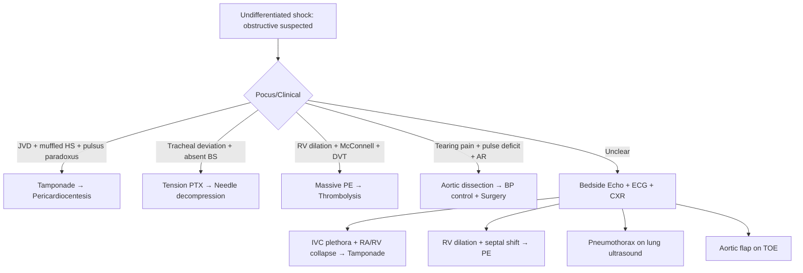

# Obstructive Shock from Cardiac Causes

Related: [[../Cardiology MOC|Cardiology MOC]] · [[../Davidson Chapter 16 - Cardiology Hierarchy|Cardiology Hierarchy]] · [[../Syncope, Shock, and Acute Hemodynamic Emergencies|Syncope, Shock, and Acute Hemodynamic Emergencies]] · [[Shock and cardiovascular emergencies]] · [[../Cardiac tamponade|Cardiac tamponade]] · [[../Pulseless electrical activity from cardiac causes|Pulseless electrical activity from cardiac causes]] · [[../Cardiogenic shock|Cardiogenic shock]] · [[../Acute aortic syndrome|Acute aortic syndrome]] · [[../../Heart Failure and Acute Cardiac Decompensation/Cardiogenic shock|Cardiogenic shock]]

> [!important]
> **Obstructive shock** = shock due to **extracardiac obstruction to cardiac filling or outflow**. FCPS/MRCP high-yield causes: **cardiac tamponade**, **tension pneumothorax**, **massive PE**, **acute aortic dissection with tamponade/obstruction**. Key distinction from cardiogenic shock: **heart is normal but cannot fill or eject due to external compression**. **Beck's triad** (tamponade), **tracheal deviation** (tension PTX), **RV dilation + McConnell's sign** (PE). **Immediate relief of obstruction is lifesaving** — pericardiocentesis, needle decompression, thrombolysis/thrombectomy.

## Learning Objectives
- Define obstructive shock and distinguish from cardiogenic, distributive, hypovolaemic
- Recognise the 4 main cardiac obstructive causes: tamponade, tension PTX, massive PE, aortic dissection complications
- Apply bedside diagnosis: clinical signs, echo, ECG, haemodynamics
- Execute immediate life-saving interventions: pericardiocentesis, needle decompression, thrombolysis
- Integrate with PEA algorithm: obstructive causes of PEA (Hs & Ts)
- Manage haemodynamics: fluid responsiveness, vasopressors as bridge, avoid harmful agents

## Definition & Haemodynamics

**Obstructive shock** = circulatory failure from **mechanical impediment to venous return, ventricular filling, or cardiac output** despite normal myocardial contractility.

| Parameter | Obstructive Shock | Cardiogenic Shock |
|-----------|-------------------|-------------------|
| **Contractility** | Normal | Impaired |
| **Preload** | ↓ (impeded filling) | ↑ (pulmonary congestion) |
| **Afterload** | Variable | ↑ (compensatory) |
| **CVP/JVP** | **↑↑** (except massive PE may have normal) | **↑↑** |
| **PCWP** | Variable (↓ in tamponade/PE, ↑ if LV failure coexists) | **↑↑** |
| **Cardiac Output** | ↓ (mechanical limitation) | ↓ (pump failure) |
| **Key Echo** | RV collapse, IVC plethora, RV dilation, septal shift | LV/RV dysfunction, low EF |

> [!tip]
> **Obstructive shock is a "preload starvation" state** — the heart is empty but healthy. **Fluids are often helpful** (unlike cardiogenic shock), but **relief of obstruction is definitive**.

## Four Main Cardiac Causes

### 1. Cardiac Tamponade

| Feature | Details |
|---------|---------|
| **Pathophysiology** | Pericardial fluid ↑ intrapericardial pressure → equalisation of diastolic pressures → ↓ ventricular filling |
| **Beck's Triad** | **Hypotension, JVD, Muffled heart sounds** (only ~30% complete) |
| **Pulsus Paradoxus** | **SBP drop > 10 mmHg on inspiration** (exaggerated interventricular dependence) |
| **ECG** | Low voltage, electrical alternans (pathognomonic), sinus tachycardia |
| **Echo (Diagnostic)** | **RA/RV diastolic collapse**, IVC plethora (no respiratory variation), septal bounce, swinging heart |
| **Haemodynamics** | **Diastolic equalisation**: RA = RV = PA diastolic = PCWP |
| **Immediate Rx** | **Pericardiocentesis** (echo-guided) — **lifesaving** |

> [!warning]
> **Tamponade is a clinical diagnosis** — do not wait for echo if unstable. **Pulsus paradoxus > 10 mmHg + JVD + hypotension = tamponade until proven otherwise**.

### 2. Tension Pneumothorax

| Feature | Details |
|---------|---------|
| **Pathophysiology** | One-way valve air entry → ↑ intrathoracic pressure → ↓ venous return, mediastinal shift, kinking of great vessels |
| **Clinical** | **Tracheal deviation (away from affected side)**, absent breath sounds, hyperresonance, hypotension, hypoxia, distended neck veins (if superior vena cava compression) |
| **CXR** | **Large pneumothorax, mediastinal shift, flattened diaphragm** — **do not wait for CXR if unstable** |
| **Immediate Rx** | **Needle decompression: 2nd ICS midclavicular line (14–16G)** → **tube thoracostomy** |
| **PEA association** | **T in Hs & Ts** — reversible cause of PEA |

> [!important]
> **Clinical diagnosis only** — if tension PTX suspected in arrest/peri-arrest, **decompress immediately**. No time for imaging.

### 3. Massive Pulmonary Embolism

| Feature | Details |
|---------|---------|
| **Definition** | PE with **sustained hypotension** (SBP < 90 or ↓ > 40 mmHg) or **cardiac arrest** |
| **Pathophysiology** | Acute RV afterload ↑ → RV dilation/failure → septal shift → LV filling ↓ → obstructive shock |
| **Clinical** | Sudden dyspnoea, syncope, hypotension, PEA/arrest; may have DVT signs |
| **ECG** | Sinus tachycardia, **S1Q3T3**, RBBB, TWI V1–V4, RV strain |
| **Echo (Key)** | **RV dilation (RV/LV > 1)**, **McConnel's sign** (apical sparing), septal flattening (D-sign), TR jet for PA pressure |
| **CTPA** | Diagnostic if stable; **do not delay thrombolysis for CTPA if unstable** |
| **Biomarkers** | Troponin ↑ (RV strain), BNP/NT-proBNP ↑ |
| **Immediate Rx** | **Thrombolysis** (alteplase 100 mg over 2h) if no contraindication; **surgical/thrombectomy** if contraindicated |
| **PEA association** | **T in Hs & Ts** |

> [!critical]
> **Massive PE = thrombolysis indication** (Class I). **Do not wait for CTPA if haemodynamically unstable** — echo + clinical = enough.

### 4. Acute Aortic Dissection with Obstruction

| Feature | Details |
|---------|---------|
| **Mechanisms** | Dissection into pericardium → **tamponade**; into coronary ostia → **coronary obstruction (MI)**; into IVC/SVC → **venous obstruction**; aortic rupture → **hypovolaemic shock** |
| **Clinical** | Tearing chest/back pain, pulse deficits, BP differential > 20 mmHg, new AR murmur, neurological deficits |
| **Echo (TOE preferred)** | **Flap in aorta**, pericardial effusion, AR, coronary involvement |
| **Immediate Rx** | **BP control** (labetalol target SBP 100–120), **urgent surgery** (Type A); **tamponade → pericardiocentesis with extreme caution** (may worsen dissection) |

## Diagnostic Approach

## Haemodynamic Management (Bridge to Definitive Rx)

| Intervention | Role | Caveats |
|--------------|------|---------|
| **IV Fluids** | **First-line** — preload augmentation | **Tamponade: cautious** (may ↑ intrapericardial pressure); **PE: cautious** (RV already dilated); **Tension PTX: minimal role** |
| **Vasopressors** | Bridge to definitive Rx | **Noradrenaline** preferred (α + β₁); **avoid pure α** (↑ afterload worsens RV) |
| **Inotropes** | Generally avoided | **Dobutamine** may ↑ contractility but ↓ SVR → hypotension; **avoid in tamponade** |
| **Avoid** | **Nitrates, diuretics, high-dose ACEi/ARB** | ↓ preload → catastrophic in obstructive shock |

> [!warning]
> **Fluids and vasopressors are temporising only**. **Definitive treatment = relieve obstruction**. Do not delay pericardiocentesis/thrombolysis/decompression for haemodynamic optimisation.

## PEA / Cardiac Arrest: Obstructive Causes (Hs & Ts)

| H / T | Cause | Immediate Action |
|-------|-------|------------------|
| **T** | **Tamponade** | **Pericardiocentesis** (US-guided if possible; blind if not) |
| **T** | **Tension pneumothorax** | **Needle decompression** (2nd ICS MCL) → chest tube |
| **T** | **Thrombosis (massive PE)** | **Thrombolysis** (alteplase 50 mg IV bolus in arrest) |
| **T** | **Trauma** | Pericardial tamponade, tension PTX, massive haemothorax |

> [!critical]
> In PEA, **empiric treatment of reversible Hs & Ts** per ALS algorithm. **Tamponade and tension PTX are immediately treatable at bedside**.

## Drug Interactions / Contraindications / Comorbidity Cautions

- **Tamponade**: **Avoid nitrates, diuretics, excessive fluids** → ↓ preload → collapse
- **Massive PE thrombolysis**: **Contraindications** = active bleeding, recent surgery/trauma (< 3 weeks), intracranial pathology, stroke (< 3 months), aortic dissection, pericarditis
- **PE + thrombolysis**: If contraindicated → surgical embolectomy / catheter-directed thrombectomy
- **Aortic dissection**: **Avoid anticoagulation, thrombolysis, antiplatelets**; **β-blocker first** (labetalol/esmolol) then add vasodilator if needed
- **Noradrenaline**: Preferred vasopressor (preserves coronary perfusion); **avoid adrenaline** in tamponade/PE (↑ afterload, arrhythmia risk)

## Procedures / Indications / Contraindications

### Pericardiocentesis
- **Indication**: Tamponade with haemodynamic compromise
- **Approach**: Echo-guided (subxiphoid/apical) — **safest**; blind subxiphoid if no echo
- **Contraindications**: Relative only (coagulopathy, small posterior effusion) — **haemodynamic compromise overrides**
- **Complications**: LV puncture, coronary artery laceration, arrhythmia, pneumothorax
- **Drain**: Leave catheter for continuous drainage; send fluid for analysis

### Needle Decompression (Tension PTX)
- **Site**: **2nd intercostal space, midclavicular line** (14–16G cannula, 4.5–5 cm)
- **Alternative**: 4th/5th ICS midaxillary line (ATLS)
- **Immediate**: **Hiss of air** = success; follow with tube thoracostomy

### Thrombolysis (Massive PE)
- **Agent**: Alteplase 100 mg IV over 2 hours (10 mg bolus + 90 mg infusion)
- **Arrest dose**: 50 mg IV bolus (some protocols: 100 mg)
- **Contraindications**: Absolute — active bleeding, recent intracranial surgery, stroke < 3 months, aortic dissection; Relative — surgery < 3 weeks, trauma, pregnancy, bleeding diathesis

## Complications of Mismanagement
- **Misdiagnosing tamponade as cardiogenic shock** → giving inotropes/diuretics → death
- **Delaying pericardiocentesis** for formal echo/consent in unstable patient
- **Giving thrombolysis in aortic dissection** (mimics PE) → fatal haemorrhage
- **Missing tension PTX** in ventilated patient (high peak pressures, hypotension)
- **Fluids in PE with RV failure** → worsening RV dilation, septal shift, cardiac arrest

## Red Flags / Emergencies
- **PEA with JVD** → think tamponade, tension PTX, massive PE
- **Sudden hypotension + muffled heart sounds post-cath/PCI** → tamponade (perforation)
- **Ventilated patient: sudden hypotension + high peak pressure** → tension PTX
- **Tearing pain + hypotension + unequal pulses** → aortic dissection with tamponade
- **Syncope + RV dilation on echo** → massive PE

## Prognosis
- **Tamponade**: Excellent if drained early; mortality ↑ with delay, malignancy, uraemia
- **Tension PTX**: Excellent if decompressed immediately; fatal if missed
- **Massive PE**: **Mortality 25–50%** even with thrombolysis; better if treated < 2h
- **Dissection with tamponade**: **Type A mortality ~1%/hour** without surgery; pericardiocentesis may be bridge to OR

## Topic Correlation
- [[../Cardiac tamponade|Cardiac tamponade]] — detailed tamponade note
- [[../Pulseless electrical activity from cardiac causes|PEA from cardiac causes]] — obstructive causes in arrest
- [[../Cardiogenic shock|Cardiogenic shock]] — differential
- [[../Acute aortic syndrome|Acute aortic syndrome]] — dissection complications
- [[../../Heart Failure and Acute Cardiac Decompensation/Cardiogenic shock|Cardiogenic shock]] — HF shock

## Special Situations

### Pregnancy
- **Tamponade**: Pericardiocentesis safe; **PE**: Thrombolysis relative contraindication (but if massive PE, benefit > risk); **Dissection**: Surgery urgent

### Post-Cardiac Surgery
- **Tamponade**: Common (clot); **echo-guided pericardiocentesis** or **re-sternotomy** if early (< 7 days) or clotted

### Anticoagulated Patients
- **Tamponade**: Reverse anticoagulation + pericardiocentesis
- **PE on anticoagulation**: Consider catheter thrombectomy (thrombolysis contraindicated)

### COVID-19
- **PE risk markedly increased** (hypercoagulable); low threshold for CTPA/echo

## FCPS/MRCP High-Yield Points
- **Obstructive shock** = mechanical impediment to filling/output; heart normal
- **4 causes**: Tamponade, Tension PTX, Massive PE, Aortic dissection complications
- **Tamponade**: Beck's triad, **pulsus paradoxus > 10**, **echo: RA/RV diastolic collapse, IVC plethora** → **pericardiocentesis**
- **Tension PTX**: **Tracheal deviation, absent breath sounds** → **needle decompression 2nd ICS MCL** (no imaging if unstable)
- **Massive PE**: **Hypotension + RV dilation (McConnell's sign)** → **thrombolysis** (do not wait for CTPA)
- **Aortic dissection + tamponade**: BP control + **surgery**; pericardiocentesis with caution
- **PEA reversible causes**: **T**amponade, **T**ension PTX, **T**hrombosis (PE) — **3 Ts**
- **Fluids helpful** (preload starvation); **avoid nitrates/diuretics/inotropes**

## Common Viva Questions
- Define obstructive shock. How does it differ from cardiogenic shock?
- What are the 4 main cardiac causes of obstructive shock?
- Describe Beck's triad and pulsus paradoxus.
- How do you diagnose tamponade on echo?
- What is the immediate management of tension pneumothorax?
- When do you thrombolyse for PE without CTPA?
- What are the obstructive causes in the Hs & Ts of PEA?
- Why are fluids given in obstructive shock but not cardiogenic shock?

## Common Confusions / Exam Traps
- Confusing tamponade with cardiogenic shock (both have ↑ JVP) — check pulsus paradoxus, echo
- Giving diuretics/nitrates in tamponade (fatal)
- Waiting for CXR in tension PTX (clinical diagnosis)
- Waiting for CTPA in massive PE (echo + clinical = thrombolysis)
- Thrombolysing aortic dissection (mimics PE)
- Doing pericardiocentesis in dissection without surgical team ready (may worsen)
- Forgetting tension PTX in ventilated patient

## Mnemonics
- **Obstructive causes**: **T**amponade, **T**ension PTX, **T**hrombosis (PE), **T**earing (dissection) — **4 Ts**
- **PEA Ts**: **T**amponade, **T**ension PTX, **T**hrombosis (PE), **T**rauma
- **Tamponade echo**: **R**A/**R**V **D**iastolic **C**ollapse, **IVC** plethora — **RRD-CIVC**
- **Massive PE echo**: **RV** dilation, **McConnell's sign**, **Septal flattening** — **RV-MS-SF**
- **Management**: **R**elieve **O**bstruction **P**romptly — **ROP**

## Mind Map
- Obstructive Shock
  - Definition: mechanical impediment, heart normal
  - Haemodynamics: ↓ preload, normal contractility, ↑ JVP
  - 4 Causes
    - Tamponade: Beck's, pulsus paradoxus, echo RV collapse → pericardiocentesis
    - Tension PTX: tracheal deviation, absent BS → needle decompression
    - Massive PE: hypotension, RV dilation, McConnell → thrombolysis
    - Dissection: tearing pain, pulse deficit → BP control + surgery
  - PEA: 3 Ts (Tamponade, Tension PTX, Thrombosis)
  - Fluids: helpful (preload starvation)
  - Avoid: nitrates, diuretics, inotropes

## Suggested Visuals / Image Notes
- Haemodynamic comparison table: obstructive vs cardiogenic vs distributive
- Echo images: RA/RV diastolic collapse, IVC plethora, RV dilation, McConnell's sign
- Algorithm: undifferentiated shock → POCUS → specific diagnosis → intervention
- Needle decompression anatomy (2nd ICS MCL)
- PEA Hs & Ts with obstructive highlighted

## Suggested Video References
- Search for: "obstructive shock tamponade tension pneumothorax PE"
- Search for: "pericardiocentesis technique echo guided"
- Search for: "massive PE thrombolysis indication"
- Search for: "PEA reversible causes Hs Ts"

## One-Page Revision Summary
- **Obstructive shock** = mechanical impediment to filling/output; heart normal
- **4 causes**: Tamponade, Tension PTX, Massive PE, Aortic dissection
- **Tamponade**: Beck's triad, **pulsus paradoxus > 10**, echo **RA/RV diastolic collapse** → **pericardiocentesis**
- **Tension PTX**: **Tracheal deviation**, absent BS → **needle decompression 2nd ICS MCL**
- **Massive PE**: Hypotension, **RV dilation + McConnell's sign** → **thrombolysis** (no CTPA wait)
- **Dissection + tamponade**: BP control + **surgery**
- **PEA**: **3 Ts** = Tamponade, Tension PTX, Thrombosis (PE)
- **Fluids**: helpful; **avoid nitrates/diuretics**
- **Definitive Rx = relieve obstruction**

## 24-Hour Recall Prompts
- Define obstructive shock vs cardiogenic
- List 4 causes
- State tamponade echo findings
- State tension PTX immediate action
- State massive PE thrombolysis indication
- List 3 Ts of PEA

## 7-Day / 15-Day / 30-Day Revision Tracker
- **Day 1**: Read note + MCQs/SBAs
- **Day 7**: Reproduce comparison table; draw 4-cause algorithm
- **Day 15**: Practice 4 shock vignettes (tamponade, PTX, PE, dissection)
- **Day 30**: Rapid revision + PEA Ts + fluid/vasopressor pearls

## Must Know / Should Know / Nice to Know
### Must Know
- 4 causes, key clinical signs, immediate interventions
- Tamponade: pulsus paradoxus, echo signs, pericardiocentesis
- Tension PTX: tracheal deviation, needle decompression
- Massive PE: thrombolysis without CTPA if unstable
- PEA 3 Ts

### Should Know
- Haemodynamic differences table
- Fluid/vasopressor role as bridge
- Dissection + tamponade nuance
- Post-cardiac surgery tamponade

### Nice to Know
- Catheter-directed thrombectomy for PE
- Pericardial window vs pericardiocentesis
- ECMO as bridge in massive PE
- COVID-19 PE risk

## My Weak Points
- [ ] I can list 4 causes and key signs
- [ ] I know tamponade echo criteria (RV collapse, IVC plethora)
- [ ] I state tension PTX decompression site
- [ ] I know massive PE = thrombolysis without CTPA
- [ ] I recall 3 Ts of PEA

## Self-Test Scorecard
- Understanding /10
- Recall /10
- Vignette interpretation /10
- MCQ performance /10
- Viva confidence /10

**Interpretation**
- **<35/50** = weak topic, needs re-study
- **35–44/50** = acceptable but not secure
- **45+/50** = strong exam-ready topic

## Exam Answer Modes

## PasTest Scenario SBAs (Clinical Vignettes)

> **Auto-generated PasTest/Mediscope-style scenario SBAs** grounded in the authored source. Each scenario tests a real clinical fact (triad, specific sign, contraindication, trial, first-line Rx) extracted from the topic. *Source: Ch 16: Cardiology — Cardiac catheterization (right left heart*

**Q1.** Which of the following features is most specific or characteristic of Cardiac catheterization (right left heart?

  - **A.** Cardinal symptoms
  - **B.** A feature common to many acute inflammatory conditions
  - **C.** A non-specific sign that does not localise the diagnosis
  - **D.** An investigation finding rather than a clinical feature

  > **Answer: A** — Cardinal symptoms
  >
  > *Source:* **Cardinal symptoms**: chest pain (typical: central, crushing, radiating to jaw/left arm, exertion-related; atypical more common in women, elderly, diabetics), dyspnoea (exertional, orthopnoea, PND, n

