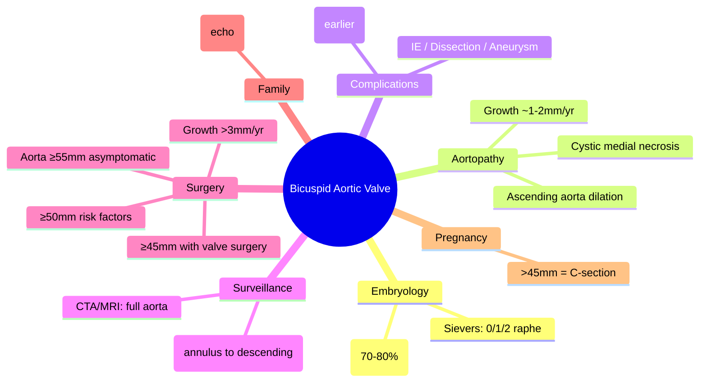

# Bicuspid Aortic Valve (BAV)

Related: [[../Cardiology MOC|Cardiology MOC]] · [[../Davidson Chapter 16 - Cardiology Hierarchy|Cardiology Hierarchy]] · [[../Adult Congenital Heart Disease and Cardiac Shunts|Adult Congenital Heart Disease and Cardiac Shunts]] · [[Left-to-right shunts and common adult lesions]] · [[Aortic stenosis]] · [[Aortic regurgitation]] · [[Aortopathy]] · [[Aortic dissection]] · [[Infective endocarditis]] · [[Coarctation of the aorta]] · [[Turner syndrome]]

> [!important]
> Bicuspid Aortic Valve (BAV) = **most common congenital heart defect** (1-2% population, M:F 3:1). FCPS/MRCP exams test: **association with aortopathy** (ascending aortic dilation), **complications** (AS, AR, IE, dissection), **screening** (family echo), and **surgical thresholds** (valve + aorta). **BAV is a valve AND aortic disease.**

## Learning Objectives
- Define BAV and its embryology (fusion of right-left or right-noncoronary cusps)
- Recognize associated aortopathy: **ascending aortic dilation** (root/ascending), cystic medial necrosis
- Identify complications: **AS, AR, infective endocarditis, aortic dissection, aneurysm**
- Apply surveillance: **serial TTE/CT/MRI** for valve + aorta
- Apply surgical thresholds: valve + aortic replacement based on diameter, growth rate, symptoms
- Screen first-degree relatives (echo)
- Manage pregnancy in BAV

## Definition & Embryology
**Bicuspid Aortic Valve (BAV)** = aortic valve with **two leaflets** instead of three, due to **failure of separation** of the right-left (most common, 70-80%) or right-noncoronary cusps during embryogenesis.
- **Sievers classification**: Type 0 (no raphe), Type 1 (one raphe), Type 2 (two raphe)
- **Most common**: Right-left coronary cusp fusion (RL) → raphe between R and L

## Associated Conditions
| Condition | Association |
|-----------|-------------|
| **Coarctation of the aorta** | 5-10% of BAV; 50% of coarctation have BAV |
| **Turner syndrome** (45,X) | 30% have BAV |
| **Aortopathy** (ascending aortic dilation) | 20-40% of BAV |
| **Infective endocarditis** | 2-4x increased risk |
| **Aortic stenosis/regurgitation** | Develops earlier than tricuspid AV |

## Aortopathy in BAV
- **Cystic medial necrosis** → loss of elastic fibers, smooth muscle apoptosis
- **Ascending aorta** (sinus of Valsalva, tubular ascending) most affected
- **Root vs ascending**: root dilation → AR; ascending dilation → dissection risk
- **Growth rate**: ~1-2mm/yr (faster than Marfan ~1mm/yr)
- **Risk factors for dilation**: BAV morphology (RL fusion), hypertension, age >30, male

## Clinical Features
| Presentation | Features |
|--------------|----------|
| **Asymptomatic** | Incidental murmur, screening echo |
| **Aortic stenosis** | Systolic ejection murmur (base, radiates carotids), S4, delayed carotid upstroke |
| **Aortic regurgitation** | Decrescendo diastolic murmur (LB SB), wide pulse pressure, Corrigan's pulse |
| **Infective endocarditis** | Fever, new murmur, embolic phenomena |
| **Aortic dissection** | Tearing pain, BP differential, pulse deficit |
| **Aneurysm rupture** | Sudden death, pain, shock |

## Diagnosis

### Echocardiography (First-line)
| Parameter | Assessment |
|-----------|------------|
| **Valve morphology** | Bicuspid, raphe, Sievers type |
| **Valve function** | AS (peak velocity, mean gradient, AVA), AR (vena contracta, regurgitant volume) |
| **Aortic dimensions** | **Annulus, sinus of Valsalva, STJ, ascending, arch, descending** |
| **Aortic wall** | Intimal flap (dissection), thrombus, ulcer |

### CTA / MRI
| Indication | Modality |
|------------|----------|
| **Full aortic imaging** (arch, descending, abdominal) | **CTA** (rapid, high-res) or **MRI** (no radiation, young) |
| **Serial surveillance** | MRI preferred (no radiation) |
| **Acute dissection** | CTA (speed) |

## Surveillance Protocol

| Finding | Interval |
|---------|----------|
| **Normal aorta** (<40mm) | **TTE every 2-3 years** |
| **Mild dilation** (40-45mm) | **TTE annually** |
| **Moderate dilation** (45-50mm) | **TTE every 6-12 months** + CTA/MRI |
| **Severe dilation** (>50mm) | **TTE 6-monthly** + CTA/MRI; surgical referral |
| **Rapid growth** (>3mm/yr or >5mm/yr) | **Surgical referral** regardless of size |
| **Post-surgery** | TTE 6mo, then annually; CTA/MRI per surgeon |

## Surgical Thresholds (Aortic Replacement)

| Indication | Aortic Diameter |
|------------|-----------------|
| **Asymptomatic, no risk factors** | **≥55mm** (Class I) |
| **Risk factors** (HTN, family history, rapid growth >3mm/yr, coarctation, BAV morphology RL) | **≥50mm** (Class IIa) |
| **Aortic valve surgery indicated** (AS/AR) + aorta **≥45mm** | **Concomitant aortic replacement** (Class I) |
| **Aortic valve surgery indicated** + aorta **40-45mm** | **Concomitant aortic replacement** (Class IIa) |

> [!tip]
> **Valve surgery + aorta ≥45mm = replace both** (avoids reoperation).
> **Rapid growth >3mm/yr** = surgery at lower threshold.

## Valve Surgery Indications (Same as Tricuspid AV)
| Condition | Threshold |
|-----------|-----------|
| **Severe AS** | Symptomatic OR LVEF<50% OR mean grad ≥40mmHg / AVA<1.0cm² |
| **Severe AR** | Symptomatic OR LVEF<50% OR LVESD>50mm / LVEDD>65mm |
| **Asymptomatic severe AS** | LVEF<50% OR abnormal exercise test OR very severe (vel>5m/s) |

## Infective Endocarditis Prophylaxis
- **High-risk**: Prior IE, prosthetic valve, CHD with residual shunt, transplant with valvulopathy
- **BAV alone** = NOT high-risk for routine prophylaxis
- **Indicated** if prior IE, prosthetic material, unrepaired cyanotic CHD

## Pregnancy in BAV
| Aortic Diameter | Risk | Management |
|-----------------|------|------------|
| **<40mm** | Low | Vaginal delivery OK; TTE per trimester |
| **40-45mm** | Moderate | Multidisciplinary; consider C-section if >45mm |
| **>45mm** | **High** (dissection risk ↑) | **Elective C-section**; avoid Valsalva; beta-blocker |

## Complications
| Complication | Mechanism |
|--------------|-----------|
| **Aortic stenosis** | Leaflet thickening/calcification (earlier than tricuspid) |
| **Aortic regurgitation** | Leaflet prolapse, root dilation, commissural separation |
| **Infective endocarditis** | Turbulent flow, damaged endothelium |
| **Aortic aneurysm** | Aortopathy → ascending aortic dilation |
| **Aortic dissection** | Intimal tear in dilated aorta |
| **Coarctation** | Associated congenital lesion |

## Red Flags / Exam Traps
- **Measuring only valve, not aorta** → miss aortopathy
- **Surgery at 55mm only** → miss risk factors (growth, family, valve surgery)
- **Not screening family** → 10% first-degree relatives have BAV
- **Pregnancy with aorta >45mm** → vaginal delivery = dissection risk
- **Missing coarctation** in BAV patient

## FCPS/MRCP High-Yield Points
- **BAV = most common congenital HD** (1-2%, M:F 3:1)
- **BAV = valve + aortopathy** (ascending aorta dilation)
- **Surgery threshold**: aorta ≥55mm (asymptomatic); ≥50mm (risk factors); **≥45mm if valve surgery**
- **Concomitant valve + aorta ≥45mm** = replace both
- **Rapid growth >3mm/yr** = surgery at lower threshold
- **Screen family** (echo) — 10% first-degree relatives affected
- **Pregnancy**: aorta >45mm = high risk → C-section
- **Associations**: Coarctation (50% have BAV), Turner syndrome (30% BAV)

## Common Viva Questions
1. What are the surgical thresholds for aortic replacement in BAV?
2. What is the association between BAV and aortopathy?
3. When do you replace aorta during valve surgery?
4. What is the screening recommendation for family members?
5. Management of pregnancy in BAV with aortic dilation?

## Common Confusions / Exam Traps
- Valve surgery at 55mm but aorta at 48mm → replace both (valve surgery + aorta ≥45mm)
- Family screening only if symptomatic → screen ALL first-degree relatives
- BAV aortopathy = only root → ascending aorta also affected
- Pregnancy management based on valve, not aorta → aorta dictates risk

## Mind Map

## One-Page Revision Summary
- **BAV** = 1-2% population, RL fusion, M:F 3:1
- **Aortopathy** = ascending aortic dilation, cystic medial necrosis
- **Surveillance**: TTE valve + full aorta (measure at annulus, sinuses, STJ, ascending)
- **Surgery thresholds**: ≥55mm asymptomatic; ≥50mm risk factors; **≥45mm with valve surgery**; growth >3mm/yr
- **Valve + aorta ≥45mm** = replace both
- **Family screening**: echo all first-degree relatives
- **Pregnancy**: aorta >45mm = C-section + beta-blocker
- **Associations**: Coarctation, Turner syndrome

## 24-Hour Recall Prompts
- State surgical thresholds for aortic replacement in BAV
- List BAV aortopathy surveillance intervals
- Explain valve + aorta ≥45mm rule
- List family screening recommendations
- Pregnancy management by aortic diameter

## 7-Day / 15-Day / 30-Day Revision Tracker
- [ ] Day 1 completed
- [ ] 24-hour recall completed
- [ ] Day 7 revision completed
- [ ] Day 15 revision completed
- [ ] Day 30 revision completed

## Must Know / Should Know / Nice to Know
### Must Know
- BAV = valve + aortopathy
- Surgery thresholds: 55/50/45mm rules
- Valve surgery + aorta ≥45mm = replace both
- Family screening (echo)
- Pregnancy >45mm = C-section

### Should Know
- Sievers classification
- Coarctation/Turner associations
- Pregnancy management per aortic size
- Growth rate thresholds

### Nice to Know
- Sievers types outcomes
- Genetic basis (NOTCH1, GATA5)
- BAV in pregnancy detailed management
- TAVR in BAV (off-label, anatomy challenges)

## Self-Test Scorecard
- Understanding /10
- Recall /10
- Surgical thresholds /10
- MCQ performance /10
- Viva confidence /10
- **Total /50**

> [!tip]
> **Interpretation**: <35 = weak topic; 35-44 = acceptable but insecure; 45+ = strong exam-ready topic.

## Exam Answer Modes
### Long Answer Skeleton
1. Definition + embryology + Sievers classification
2. Aortopathy mechanism + ascending aortic dilation
3. Complications (AS, AR, IE, dissection, aneurysm)
4. Surveillance protocol (TTE + CTA/MRI intervals)
4. Surgical thresholds (55/50/45mm rules, growth rate)
5. Concomitant valve + aorta surgery rule
6. Family screening + pregnancy management
7. Coarctation/Turner associations

### Short Note Skeleton
- BAV = 1-2%, RL fusion, M:F 3:1
- Aortopathy = ascending dilation, cystic medial necrosis
- Surveillance: TTE annually if 40-45mm; 6-12mo if 45-50mm
- Surgery: 55mm asymptomatic; 50mm risk factors; **45mm with valve surgery**
- Valve + aorta ≥45mm = replace both
- Family: echo 1st degree
- Pregnancy: >45mm = C-section

### Viva One-Liners
- "BAV = valve + aortopathy"
- "Aortic surgery: 55mm asymptomatic, 50mm risk factors, 45mm with valve surgery"
- "Valve surgery + aorta ≥45mm = replace both"
- "Growth >3mm/yr = surgery at lower threshold"
- "Family screening: echo 1st degree"
- "Pregnancy >45mm = C-section"

### Ward-Case Discussion Points
- "30M, BAV, mild AS, aortic root 48mm, ascending 46mm. Asymptomatic." → "Surveillance TTE 6-12mo. Surgery threshold not met. Counsel on BP control, family screening."
- "25F, BAV, severe AR, root 44mm, ascending 42mm. Referred for valve surgery." → "Valve surgery + aorta 44mm → concomitant aortic replacement (≥45mm threshold with surgery)."
- "35F, BAV, normal valve, aorta 38mm, pregnant 20wks." → "Low risk. TTE per trimester. Vaginal delivery OK. Beta-blocker if HTN."

### Last-Night-Before-Exam Sheet
- BAV = RL fusion, 1-2%, M:F 3:1
- Aortopathy: ascending dilation, cystic medial necrosis
- Surgery: 55mm asymptomatic, 50mm risk factors, **45mm with valve surgery**
- Growth >3mm/yr → lower threshold
- Family: echo 1st degree
- Pregnancy: >45mm = C-section + BB
- Associations: Coarctation (50%), Turner (30%)

## Summary
**Bicuspid Aortic Valve (BAV)** is the **most common congenital heart defect** (1-2% population, M:F 3:1), caused by **fusion of right-left coronary cusps** (70-80%). BAV is **not just a valve disease** — it is associated with **aortopathy** (cystic medial necrosis) causing **ascending aortic dilation** (20-40%). **Complications**: premature AS, AR, infective endocarditis, aortic aneurysm, dissection. **Surveillance**: TTE measuring annulus, sinuses, STJ, ascending aorta; CTA/MRI for full aorta. **Surgical thresholds**: asymptomatic ≥55mm; risk factors (HTN, RL fusion, family hx, rapid growth >3mm/yr, coarctation) ≥50mm; **concomitant valve surgery + aorta ≥45mm = replace both**. **Rapid growth >3mm/yr** = surgery at lower threshold. **Family screening**: echo for all first-degree relatives (10% affected). **Pregnancy**: aorta >45mm = high dissection risk → elective C-section + beta-blocker. **Associations**: Coarctation (50% have BAV), Turner syndrome (30% have BAV).

## MCQs (10)
1. Most common BAV morphology (cusp fusion):
   A. Right-noncoronary
   B. **Right-left coronary**
   C. Left-noncoronary
   C. All equal
2. Aortopathy in BAV primarily affects:
   A. Aortic root only
   B. **Ascending aorta (sinuses + tubular ascending)**
   C. Aortic arch
   D. Descending aorta
3. Asymptomatic BAV patient, no risk factors — aortic replacement threshold:
   A. 50mm
   B. **55mm**
   C. 50mm
   D. 60mm
4. BAV patient undergoing aortic valve replacement for severe AS. Concomitant aortic replacement if ascending aorta is:
   A. ≥50mm
   B. **≥45mm**
   C. ≥55mm
   D. ≥40mm
5. Aortic growth rate indicating surgical referral regardless of size:
   A. >1mm/yr
   B. >2mm/yr
   C. **>3mm/yr**
   D. >5mm/yr
6. Family screening for BAV:
   A. Only if symptomatic
   B. **All first-degree relatives (echo)**
   C. Only males
   D. Only if aortic dilation present
6. Pregnancy in BAV — high risk (elective C-section) if aorta:
   A. >40mm
   B. **>45mm**
   C. >50mm
   D. >55mm
7. Associated condition with BAV:
   A. ASD
   B. **Coarctation of the aorta**
   C. VSD
   D. PDA
8. Turner syndrome association with BAV:
   A. 10%
   B. **30%**
   C. 50%
   D. 70%
9. Rapid aortic growth in BAV mandating surgery:
   A. >1mm/yr
   B. >2mm/yr
   C. **>3mm/yr**
   D. >5mm/yr
10. Concomitant aortic replacement during AV surgery if aorta:
    A. ≥50mm
    B. **≥45mm**
    C. ≥55mm
    D. ≥40mm

## SBA Questions (10)
1. 30M, BAV, severe AS (AVA 0.7cm²), root 44mm, ascending 42mm. Surgery:
   A. AVR only
   B. **AVR + ascending aortic replacement (aorta ≥45mm with valve surgery)**
   C. AVR + root replacement only
   D. TAVR
2. 25F, BAV, normal valve, ascending aorta 38mm. Surveillance:
   A. TTE annually
   B. **TTE annually (aorta 40-45mm would be annual; 38mm = 2-3yr)**
   C. TTE every 6 months
   D. CTA annually
3. 40M, BAV, aortic root 52mm, no valve disease. Surgery threshold met?
   A. No (need 55mm)
   B. **Yes (≥50mm with risk factors — male, >30, likely RL morphology)**
   C. Only if symptomatic
   D. Only if growth >5mm/yr
4. 35F, BAV, pregnant 24wks, ascending aorta 43mm. Delivery:
   A. Vaginal with epidural
   B. **Elective C-section (aorta >45mm = high risk; 43mm borderline — MDT)**
   C. Vaginal with forceps
   D. Emergency C-section now
5. 28M, BAV, first-degree relative (father) with BAV and aortic dissection. Screening:
   A. Not needed
   B. **Echo now (first-degree relative affected)**
   C. CT only
   C. Genetic testing only
6. BAV morphology most associated with aortopathy:
   A. Right-noncoronary fusion
   B. **Right-left coronary fusion**
   C. Left-noncoronary fusion
   D. No raphe (Type 0)
7. Coarctation of aorta association with BAV:
   A. 10%
   B. 25%
   C. **50%**
   D. 75%
8. Turner syndrome (45,X) with BAV:
   A. 10%
   B. **30%**
   C. 50%
   D. 70%
9. Asymptomatic BAV, aorta 48mm, HTN controlled, no family history. Surveillance:
   A. TTE every 2 years
   B. **TTE every 6-12 months + CTA/MRI**
   C. TTE annually
   D. No surveillance needed
10. Infective endocarditis prophylaxis for BAV alone:
    A. Indicated for all dental procedures
    B. **Not indicated (BAV alone not high-risk)**
    C. Indicated only for GI procedures
    D. Indicated for all invasive procedures

## Flashcards
- Q: BAV fusion?
  A: R-L coronary cusp (70-80%)
- Q: Aortopathy location?
  A: Ascending aorta (sinuses + tubular)
- Q: Surgery thresholds?
  A: 55mm asymptomatic; 50mm risk factors; 45mm with valve surgery
- Q: Valve + aorta rule?
  A: Valve surgery + aorta ≥45mm = replace both
- Q: Growth rate for surgery?
  A: >3mm/yr
- Q: Family screening?
  A: Echo 1st degree relatives
- Q: Pregnancy >45mm?
  A: C-section + beta-blocker
- Q: Coarctation association?
  A: 50% have BAV
- Q: Turner BAV?
  A: 30%
- Q: Raphe types?
  A: Sievers 0 (no raphe), 1 (one raphe), 2 (two raphe)

## Answer Key with Explanations
### MCQs
1. **B** — Right-left coronary cusp fusion is most common (70-80%).
2. **B** — Ascending aorta (sinus of Valsalva + tubular ascending) predominantly affected.
3. **B** — Asymptomatic, no risk factors = 55mm threshold.
4. **B** — Concomitant valve surgery + aorta ≥45mm = replace both (avoids reoperation).
5. **C** — Growth >3mm/yr = accelerated aortopathy → surgery at lower threshold.
6. **B** — Screen ALL first-degree relatives with echo (10% yield).
7. **B** — Aorta >45mm in pregnancy = high dissection risk → elective C-section + beta-blocker.
8. **B** — 50% of coarctation patients have BAV.
9. **B** — 30% of Turner syndrome (45,X) have BAV.
10. **C** — Growth >3mm/yr warrants surgery even if diameter below threshold.
11. **B** — Concomitant aortic replacement if valve surgery + aorta ≥45mm.

### SBAs
1. **B** — Severe AS + AVR indicated. Ascending aorta 42mm <45mm but root 44mm close; with valve surgery, aorta ≥45mm is threshold. Root 44mm borderline — MDT decision; many would replace ascending given valve surgery.
2. **B** — Aorta 38mm (<40mm) = TTE every 2-3 years. (Annual if 40-45mm).
3. **B** — Male, >30, 52mm = risk factors present → ≥50mm threshold met → surgery indicated.
2. **B** — Aorta 43mm borderline; MDT discussion; typically C-section recommended if >45mm; at 43mm close, MDT decision with cardiology/obstetrics.
3. **B** — First-degree relative with BAV + dissection → echo screening indicated.
4. **B** — Right-left coronary fusion (Sievers Type 1) associated with more aggressive aortopathy.
5. **C** — 50% of coarctation patients have BAV.
6. **B** — 30% of Turner syndrome have BAV.
7. **B** — Aorta 48mm (45-50mm moderate dilation) = TTE 6-12 monthly + CTA/MRI.
8. **B** — BAV alone is NOT an indication for IE prophylaxis (only if prior IE, prosthetic, unrepaired cyanotic CHD).

---