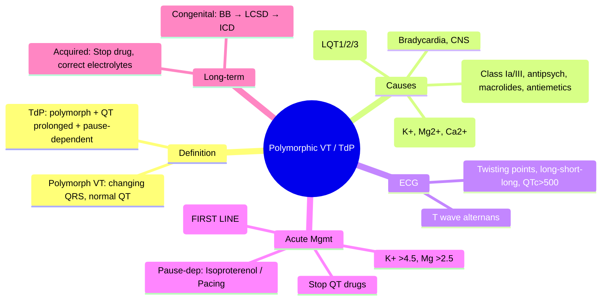

# Polymorphic Ventricular Tachycardia & Torsades de Pointes

Related: [[../Cardiology MOC|Cardiology MOC]] · [[../Davidson Chapter 16 - Cardiology Hierarchy|Cardiology Hierarchy]] · [[../Arrhythmias and Cardiac Conduction Disorders|Arrhythmias and Cardiac Conduction Disorders]] · [[Ventricular arrhythmias and bradyarrhythmias]] · [[Monomorphic ventricular tachycardia]] · [[Ventricular fibrillation and cardiac arrest rhythms]] · [[Long QT syndrome]] · [[Electrolyte Disorders]] · [[Drug-induced QT prolongation]] · [[Syncope]]

> [!important]
> Polymorphic VT = continuously changing QRS morphology. **Torsades de Pointes (TdP)** = polymorphic VT with **prolonged QT** and **pause-dependence** (long-short-long). FCPS/MRCP exams test: **QT prolongation causes**, **immediate Mg2+ for TdP**, **isoproterenol/pacing for pause-dependence**, **avoid QT-prolonging drugs**, and **differentiation from monomorphic VT/VF**.

## Learning Objectives
- Define polymorphic VT and distinguish Torsades de Pointes (prolonged QT, pause-dependent)
- Identify causes: **congenital LQTS**, **acquired** (drugs, electrolytes, bradycardia, CNS)
- Recognize ECG: continuously changing QRS, twisting around baseline, long-short-long initiation
- Apply immediate management: **IV Magnesium 2g** (first-line for TdP), **correct K+/Mg2+**, **isoproterenol/pacing** if pause-dependent
- Differentiate from monomorphic VT and VF
- Determine long-term: ICD (structural HD/congenital), remove offending drugs, genetic testing

## Definition
| Entity | Definition |
|--------|------------|
| **Polymorphic VT** | Wide-complex tachycardia with **continuously changing QRS morphology** (amplitude, axis, duration) — no single stable morphology |
| **Torsades de Pointes (TdP)** | **Specific polymorphic VT** with **prolonged QT** — "twisting of points" around isoelectric baseline, **pause-dependent** (long-short-long R-R sequence) |

## Classification

| Type | QT Interval | Mechanism | Triggers |
|------|-------------|-----------|----------|
| **TdP (Pause-dependent)** | **Prolonged** | Early afterdepolarizations (EADs) from prolonged repolarization | Bradycardia, drugs, hypokalemia, long QT |
| **Polymorphic VT (Normal QT)** | Normal | Re-entry / multiple foci / ischaemia | Acute ischaemia, structural HD, catecholaminergic |

> [!tip]
> **All TdP = polymorphic VT, but NOT all polymorphic VT = TdP.**
> Check QT: prolonged → TdP; normal → polymorphic VT (often ischaemic).

## Causes of QT Prolongation (Acquired)

| Category | Examples |
|----------|----------|
| **Drugs** | **Antiarrhythmics**: Class Ia (quinidine, procainamide, disopyramide), Class III (amiodarone, sotalol, dofetilide, ibutilide); **Antipsychotics**: haloperidol, ziprasidone; **Antidepressants**: TCAs, citalopram; **Antibiotics**: macrolides (azithro, clarithro), fluoroquinolones (moxi); **Antiemetics**: ondansetron; **Antifungals**: azoles |
| **Electrolytes** | **Hypokalemia**, **Hypomagnesemia**, Hypocalcemia |
| **Bradycardia** | AV block, sinus pause, beta-blockers, CCB |
| **CNS** | Subarachnoid hemorrhage, stroke, tumor (CNS → autonomic → QT) |
| **Other** | Hypothermia, hypothyroidism, anorexia, cirrhosis |

## Congenital Long QT Syndrome (LQTS)

| Type | Gene | Ion Current | Trigger | ECG Feature |
|------|------|-------------|---------|-------------|
| **LQT1** | KCNQ1 | IKs ↓ | **Exercise/swimming** | Broad-based T waves |
| **LQT2** | KCNH2 | IKr ↓ | **Auditory/emotion** | Low-amplitude bifid T |
| **LQT3** | SCN5A | INa ↑ (late) | **Sleep/rest** | Late-peaking T |
| **Jervell-Lange-Nielsen** | KCNQ1/KCNE1 | IKs ↓ | Deafness + LQTS | Autosomal recessive |
| **Timothy** | CACNA1C | ICa ↑ | Syndactyly, immune | Rare |

> [!tip]
> **Schwartz Score** for LQTS diagnosis: QTc, TdP, T wave alternans, brady, congenital deafness, family history.

## Clinical Features
- **Syncope** (often exertional/emotional for LQT1/2; rest/sleep for LQT3)
- **Seizure-like activity** (cerebral hypoperfusion during TdP)
- **Sudden cardiac death** (first presentation in 10-15%)
- **Family history** of syncope/SCD
- **Asymptomatic** with QT prolongation on screening

## ECG Features

### Torsades de Pointes
- **Continuously changing QRS** morphology and amplitude
- **"Twisting of points"** — QRS appears to twist around isoelectric baseline
- **180° phase reversal** every 5-20 beats
- **Long-short-long** R-R sequence initiates TdP (pause-dependent)
- **QTc ≥500 ms** (often 550-600 ms) — measured in preceding sinus beats
- **T wave alternans** (beat-to-beat T amplitude fluctuation) often precedes TdP

### Polymorphic VT (Normal QT)
- Changing QRS but **no QT prolongation**
- Often **acute ischaemia** (ACS), severe structural HD, catecholaminergic
- No pause-dependence

## Immediate Management Algorithm

```mermaid
flowchart TD
A[Polymorphic VT / TdP] --> B{Hemodynamically unstable?}
B -->|Yes| C[Immediate defibrillation 200J biphasic]
B -->|No| D[TdP? (Prolonged QT + pause-dependent)]
D -->|Yes| E[IMMEDIATE: IV Magnesium 2g bolus over 2-5min]
D -->|No (Normal QT)| F[Treat as polymorphic VT: Amiodarone, correct ischaemia]
E --> G{Recurrent?}
G -->|Yes| H[Repeat Mg2+ 2g]
H --> I[Correct K+ >4.5, Mg2+ >2.5]
I --> J[If pause-dependent: Isoproterenol 2-10mcg/min OR Transvenous pacing 90-110bpm]
J --> K[Stop ALL QT-prolonging drugs]
K --> L[Continuous monitoring]
```

## Pharmacotherapy

| Drug | Dose | Indication | Notes |
|------|------|------------|-------|
| **Magnesium sulfate** | **2g IV bolus** over 2-5 min (repeat once) | **First-line for ALL TdP** — works even if Mg2+ normal | Stabilizes membrane, suppresses EADs |
| **Potassium** | KCl to **K+ >4.5 mmol/L** | Hypokalemia correction | Critical cofactor |
| **Isoproterenol** | 2-10 mcg/min infusion | **Pause-dependent TdP** (bradycardia-dependent) | ↑ HR → ↓ QT; bridge to pacing |
| **Transvenous pacing** | 90-110 bpm | Pause-dependent TdP; isoproterenol failure | Overdrive suppression of pauses |
| **Amiodarone** | 150mg IV bolus | Polymorphic VT with **normal QT** | Avoid in TdP (prolongs QT) |
| **Lidocaine** | 1.5mg/kg bolus | Polymorphic VT (ischaemic) | Alternative |
| **Beta-blocker** | IV metoprolol/esmolol | **Congenital LQTS** (chronic) | Nadolol/propranolol chronic; acute if catecholaminergic |

> [!warning]
> **AVOID in TdP**: Class Ia/Ic/III antiarrhythmics, QT-prolonging drugs — they worsen QT!
> **Isoproterenol contraindicated** if structural HD with outflow obstruction (HOCM, AS) or coronary disease.

## Long-Term Management

### Congenital LQTS
| Strategy | Indication |
|----------|------------|
| **Beta-blocker** (nadolol/propranolol) | **All** symptomatic; asymptomatic if QTc>500 or high-risk genotype |
| **Left cardiac sympathetic denervation (LCSD)** | Breakthrough events on BB; contraindication to BB |
| **ICD** | **Survived cardiac arrest**; recurrent syncope on BB+LCSD; high-risk (QTc>550, LQT2/3) |
| **Avoid QT drugs** | Lifelong — CredibleMeds list |
| **Genetic testing** | Index case + cascade screening |

### Acquired TdP
| Strategy | Indication |
|----------|------------|
| **Stop offending drug** | Immediate; substitute safe alternative |
| **Correct electrolytes** | K>4.5, Mg>2.5 maintenance |
| **Temporary pacing** | If bradycardia-dependent, drug cannot be stopped acutely |
| **ICD** | If structural HD + TdP; or refractory despite above |

## Special Situations

| Scenario | Management Nuance |
|----------|-------------------|
| **ACUTE MI + TdP** | Primary PCI (ischaemia → QT prolongation); Mg2+; pacing if brady |
| **HOCM / AS + TdP** | **No isoproterenol** (worsens obstruction); pacing preferred |
| **Pregnancy** | Mg2+ safe; BB safe (propranolol/metoprolol); avoid ACEi/ARB |
| **Post-cardiac surgery** | Often drug + electrolyte; correct K+/Mg2+; temporary pacing |

## Complications
- **Degeneration to VF** → SCD
- **Recurrent TdP** → electrical storm
- **Hemodynamic collapse** from rapid rate
- **Anoxic brain injury** if prolonged

## Prognosis
- **Acquired TdP**: Excellent if reversible cause corrected (drug stopped, electrolytes normalized)
- **Congenital LQTS**: 1% annual SCD risk on BB; higher if QTc>550, prior arrest, LQT2/3
- **Polymorphic VT (normal QT)**: Prognosis driven by underlying ischaemia/structural HD

## Red Flags / Exam Traps
- **Giving amiodarone/sotalol/procainamide for TdP** → prolongs QT → worsens TdP!
- **Missing drug-induced QT prolongation** — always review meds (CredibleMeds)
- **Using isoproterenol in HOCM/AS** → worsens outflow obstruction
- **Not correcting K+/Mg2+** — Mg2+ works even if serum Mg normal!
- **Confusing polymorphic VT (normal QT) with TdP** — different management!

## FCPS/MRCP High-Yield Points
- **TdP = polymorphic VT + prolonged QT + pause-dependent**
- **Mg2+ 2g IV = first-line for TdP** (works even if Mg normal)
- **Correct K+ >4.5, Mg >2.5**
- **Pause-dependent → isoproterenol OR pacing** (90-110 bpm)
- **STOP all QT-prolonging drugs** (Class Ia/III, antipsychotics, antibiotics, antiemetics)
- **Congenital LQTS**: BB (nadolol) first-line; ICD if arrest/breakthrough
- **LQT1 = exercise; LQT2 = emotion/startle; LQT3 = sleep**

## Common Viva Questions
1. How do you differentiate TdP from polymorphic VT with normal QT?
2. What is the immediate treatment for TdP?
3. Why is magnesium given even if serum Mg is normal?
4. What is pause-dependence and how do you treat it?
5. Which drugs cause TdP? (Class Ia, III, antipsychotics, macrolides, antiemetics)
6. Management of congenital LQTS?

## Common Confusions / Exam Traps
- Amiodarone for TdP → **contraindicated** (prolongs QT)
- Isoproterenol for TdP in HOCM/AS → **contraindicated** (use pacing)
- Polymorphic VT with normal QT = **not TdP** → treat underlying ischaemia/HD
- Not checking drugs — **always review CredibleMeds list**
- T wave alternans = precursor to TdP, not benign

## Mind Map


## One-Page Revision Summary
- **TdP**: polymorphic VT + **prolonged QT** + **pause-dependent** (long-short-long)
- **Mg2+ 2g IV** = first-line for TdP (works regardless of serum level)
- **K+ >4.5, Mg >2.5** — correct electrolytes
- **Pause-dependent** → isoproterenol infusion OR transvenous pacing 90-110 bpm
- **STOP all QT-prolonging drugs** (Class Ia/Ic/III, antipsychotics, macrolides, antiemetics)
- **Congenital LQTS**: LQT1=exercise, LQT2=emotion, LQT3=sleep; BB (nadolol) first-line
- **AVOID in TdP**: amiodarone, sotalol, procainamide, QT drugs
- **HOCM/AS + TdP**: no isoproterenol → use pacing

## 24-Hour Recall Prompts
- Draw TdP ECG: twisting points, long-short-long
- List 10 drugs causing TdP
- State immediate TdP algorithm
- Explain pause-dependence and treatment
- Compare LQT1/2/3 triggers and ECG

## 7-Day / 15-Day / 30-Day Revision Tracker
- [ ] Day 1 completed
- [ ] 24-hour recall completed
- [ ] Day 7 revision completed
- [ ] Day 15 revision completed
- [ ] Day 30 revision completed

## Must Know / Should Know / Nice to Know
### Must Know
- TdP definition + ECG (twisting, pause-dependent, QTc>500)
- Mg2+ 2g IV first-line (even if Mg normal)
- K+>4.5, Mg>2.5
- Pause-dependent → isoproterenol/pacing
- Stop QT drugs; avoid amiodarone in TdP
- Congenital LQTS: BB first-line

### Should Know
- LQT1/2/3 triggers and ECG
- Schwartz score
- LCSD for refractory LQTS
- T wave alternans significance

### Nice to Know
- Gene-specific therapies (mexiletine LQT3)
- ICD programming for LQTS
- Epinephrine challenge test for LQTS

## Self-Test Scorecard
- Understanding /10
- Recall /10
- ECG recognition /10
- MCQ performance /10
- Viva confidence /10
- **Total /50**

> [!tip]
> **Interpretation**: <35 = weak topic; 35-44 = acceptable but insecure; 45+ = strong exam-ready topic.

## Exam Answer Modes
### Long Answer Skeleton
1. Definition: polymorphic VT vs TdP (QT, pause-dependence)
2. Causes table (drugs, electrolytes, congenital, bradycardia)
3. ECG features: twisting points, long-short-long, QTc>500, T wave alternans
4. Immediate management: Mg2+ 2g → K+/Mg2+ correction → pause-dependent therapy
5. Contraindicated drugs in TdP
6. Congenital LQTS: types, triggers, management (BB → LCSD → ICD)
7. Acquired TdP: stop drug, correct electrolytes

### Short Note Skeleton
- TdP = polymorph VT + prolonged QT + pause-dependent
- Mg2+ 2g IV first (even if normal)
- K+>4.5, Mg>2.5
- Pause-dep: isoproterenol or pacing 90-110
- Stop QT drugs (Class Ia/III, antipsych, macros, antiemetics)
- Congenital: BB → LCSD → ICD
- Avoid amiodarone/sotalol in TdP

### Viva One-Liners
- "TdP = polymorphic VT + long QT + pause-dependent"
- "Mg2+ 2g IV = first-line TdP (even if Mg normal)"
- "Pause-dependent = long-short-long → isoproterenol or pace 90-110"
- "LQT1=exercise, LQT2=emotion, LQT3=sleep"
- "NO amiodarone/sotalol/procainamide in TdP"
- "HOCM/AS + TdP → NO isoproterenol → pacing"

### Ward-Case Discussion Points
- "50F on citalopram + clarithromycin, TdP, QTc 580" → "Stop both. Mg2+ 2g. K+>4.5. Isoproterenol if brady. Switch antidepressants."
- "25M, syncope swimming, QTc 520, family hx SCD" → "LQT1. Nadolol. Genetic testing. Family screening. ICD if breakthrough."
- "70M post-MI, brady 40, TdP, QTc 500" → "Mg2+ 2g. Temporary pacing 90bpm. Stop QT drugs. K+/Mg2+."

### Last-Night-Before-Exam Sheet
- TdP = polymorph + long QT + pause-dependent
- Mg2+ 2g IV first-line
- K+>4.5, Mg>2.5
- Pause-dep → isoproterenol / pace 90-110
- Stop QT drugs
- LQT1=swim, LQT2=emotion, LQT3=sleep
- NO amiodarone in TdP
- NO isoproterenol in HOCM/AS

## Summary
**Polymorphic VT** = wide-complex tachycardia with **continuously changing QRS morphology**. **Torsades de Pointes (TdP)** is the **prolonged-QT, pause-dependent** subtype: "twisting of points" around baseline, **long-short-long** initiation, QTc ≥500 ms. **Immediate management**: **IV Magnesium 2g bolus** (first-line even if Mg normal) → **correct K+ >4.5, Mg >2.5** → **pause-dependent therapy**: isoproterenol infusion (2-10 mcg/min) or **transvenous pacing 90-110 bpm** → **STOP all QT-prolonging drugs** (Class Ia/Ic/III antiarrhythmics, antipsychotics, macrolides/fluoroquinolones, antiemetics). **Congenital LQTS**: LQT1 (exercise/swim), LQT2 (emotion/startle), LQT3 (sleep/rest); **nadolol/propranolol first-line**, LCSD for breakthrough, ICD for arrest. **Red flags**: avoid amiodarone/sotalol/procainamide in TdP; no isoproterenol in HOCM/AS; always review drugs via CredibleMeds.

## MCQs (10)
1. Key ECG feature distinguishing TdP from polymorphic VT with normal QT:
   A. Wide QRS
   B. **Prolonged QT interval**
   C. Irregular rhythm
   D. Rate >200
2. Torsades de Pointes is initiated by:
   A. Short-long-short R-R
   B. **Long-short-long R-R (pause-dependent)**
   C. Regular R-R
   C. Premature atrial contraction
3. First-line treatment for Torsades de Pointes:
   A. Amiodarone 150mg IV
   B. **Magnesium sulfate 2g IV bolus**
   C. Lidocaine 1.5mg/kg
   D. Procainamide 10mg/kg
4. Magnesium in TdP — when is it effective?
   A. Only if Mg <0.7
   B. **Even if serum Mg is normal**
   C. Only with hypokalemia
   D. Only in congenital LQTS
5. Pause-dependent TdP (bradycardia) — next step after Mg2+/K+:
   A. Amiodarone
   B. **Isoproterenol infusion OR transvenous pacing 90-110 bpm**
   C. Beta-blocker
   D. Defibrillation
5. Drug CONTRAINDICATED in TdP:
   A. Magnesium
   B. **Amiodarone (prolongs QT)**
   C. Isoproterenol
   C. Lidocaine
6. Congenital LQT1 — typical trigger:
   A. Sleep
   B. **Exercise / swimming**
   C. Auditory startle
   D. Rest
7. LQT2 — ECG hallmark:
   A. Broad-based T waves
   B. **Low-amplitude bifid/notched T waves**
   C. Late-peaking T waves
   D. Normal T waves
8. First-line chronic therapy for congenital LQTS:
   A. ICD
   B. **Beta-blocker (nadolol/propranolol)**
   C. Mexiletine
   D. Pacemaker
8. Isoproterenol contraindicated in TdP with:
   A. Electrolyte imbalance
   B. **HOCM / severe AS (worsens outflow obstruction)**
   C. Congenital LQTS
   D. Drug-induced TdP
9. CredibleMeds list is for:
   A. VT ablation targets
   B. **Drugs that prolong QT / cause TdP**
   C. ICD programming
   D. Genetic testing labs

## SBA Questions (10)
1. 35F on citalopram/clarithromycin, TdP, QTc 560, HR 50. Mg2+ 2g given. Next:
   A. Amiodarone
   B. **Stop citalopram/clarithromycin, isoproterenol (brady-dependent)**
   C. Defibrillation
   D. ICD
2. 25M, syncope swimming, QTc 510, brother died at 22. Genetic test: KCNQ1 mutation. Best Rx:
   A. ICD
   B. **Nadolol (LQT1 = beta-blocker first-line)**
   C. Mexiletine
   D. Pacemaker
3. 60F, HOCM, TdP, brady 45, QTc 520. Mg2+ given. Next for pause-dependence:
   A. Isoproterenol
   B. **Transvenous pacing 90 bpm (isoproterenol contraindicated in HOCM)**
   C. Atropine
   D. Amiodarone
4. 45M, postoperative, TdP, K+ 3.0, Mg 0.6. Mg2+ 2g given. Priority:
   A. Amiodarone
   B. **K+ replacement to >4.5, Mg to >2.5**
   C. ICD
   D. Pacing
5. 50F, citalopram, TdP, QTc 580. Drug management:
   A. Reduce dose
   B. **Stop citalopram, switch to safe antidepressant (sertraline)**
   C. Add beta-blocker
   C. Continue with monitoring
6. Polymorphic VT with NORMAL QT — most likely cause:
   A. Drug-induced LQTS
   B. **Acute ischaemia / severe structural HD**
   C. Congenital LQTS
   D. Hypokalemia
6. Schwartz score for LQTS includes all EXCEPT:
   A. QTc duration
   B. Torsades de Pointes
   C. T wave alternans
   D. **Ejection fraction**
7. Congenital LQTS — ICD indicated for:
   A. All genotype-positive
   B. **Survived cardiac arrest / recurrent syncope on BB**
   C. QTc >450
   D. Asymptomatic LQT1
8. 10yo with TdP, deafness, QTc 560. Syndrome:
   A. Romano-Ward
   B. **Jervell-Lange-Nielsen (deafness + LQTS)**
   C. Timothy
   D. Andersen-Tawil
9. Polymorphic VT normal QT — acute management:
   A. Magnesium 2g
   B. **Address underlying ischaemia/HD; amiodarone/lidocaine if needed**
   C. Isoproterenol
   D. Pacing
10. T wave alternans in LQTS:
    A. Benign variant
    B. **Precursor to TdP (beat-to-beat T amplitude oscillation)**
    C. Indicates need for ICD
    D. Normal finding

## Flashcards
- Q: TdP = ?
  A: Polymorphic VT + prolonged QT + pause-dependent (long-short-long)
- Q: TdP first-line?
  A: Mg2+ 2g IV (even if normal)
- Q: Pause-dependent treatment?
  A: Isoproterenol OR pacing 90-110 bpm
- Q: Stop in TdP?
  A: ALL QT-prolonging drugs (Class Ia/III, antipsych, macros, antiemetics)
- Q: LQT1 trigger?
  A: Exercise/swimming
- Q: LQT2 trigger?
  A: Emotion/auditory startle
- Q: LQT3 trigger?
  A: Sleep/rest
- Q: Congenital LQTS first-line?
  A: Nadolol/propranolol
- Q: TdP avoid?
  A: Amiodarone, sotalol, procainamide (prolong QT)
- Q: HOCM + TdP pause-dep?
  A: NO isoproterenol → pacing

## Answer Key with Explanations
### MCQs
1. **B** — TdP defined by prolonged QT; polymorphic VT with normal QT is a different entity.
2. **B** — Pause-dependent = long-short-long sequence initiates TdP (R-on-T after long pause).
3. **B** — Mg2+ 2g IV is first-line for TdP; works by suppressing early afterdepolarizations.
4. **B** — Mg2+ effective in TdP regardless of serum level; stabilizes membrane.
5. **B** — Pause-dependent: increase HR to shorten QT → isoproterenol or pacing 90-110.
6. **B** — Amiodarone prolongs QT → worsens TdP; CONtraindicated.
7. **B** — LQT1 (KCNQ1/IKs): exercise/swimming triggers.
8. **B** — LQT2 (KCNH2/IKr): low-amplitude bifid/notched T waves.
9. **B** — Beta-blocker (nadolol/propranolol) first-line for all congenital LQTS.
10. **B** — Isoproterenol increases contractility + HR → worsens LVOT obstruction in HOCM/AS.
11. **B** — CredibleMeds = curated list of QT-prolonging drugs.

### SBAs
1. **B** — Drug-induced + bradycardia: stop drugs, isoproterenol for pause-dependence.
2. **B** — KCNQ1 = LQT1; nadolol first-line; ICD only if breakthrough/arrest.
3. **B** — HOCM: isoproterenol contraindicated (worsens obstruction); pacing safe.
4. **B** — Electrolyte correction is critical cofactor for Mg2+ efficacy in TdP.
5. **B** — Citalopram = known QT prolonger; switch to sertraline (minimal QT effect).
6. **B** — Polymorphic VT with normal QT = typically acute ischaemia or severe structural HD.
7. **D** — Schwartz score: QTc, TdP, T-wave alternans, bradycardia, congenital deafness, family history. EF not included.
8. **B** — ICD for survived arrest or recurrent syncope on optimal BB therapy.
9. **B** — JLN = autosomal recessive LQTS + sensorineural deafness.
10. **B** — Normal QT polymorphic VT = treat underlying cause (ischaemia/HD); amiodarone/lidocaine if needed; Mg2+ not first-line as QT not prolonged.

---

## PasTest Scenario SBAs (Clinical Vignettes)

> **Auto-generated PasTest/Mediscope-style scenario SBAs** grounded in the authored source. Each scenario tests a real clinical fact (triad, specific sign, contraindication, trial, first-line Rx) extracted from the topic. *Source: Ch 16: Cardiology — Torsades de pointes (Mg, pacing, isoproterenol)*

**Q1.** What is the most appropriate first-line therapy for Torsades de pointes (Mg, pacing, isoproterenol)?

  - **A.** Long-term
  - **B.** An advanced/surgical therapy reserved for refractory disease
  - **C.** Symptomatic treatment only, no disease-modifying therapy
  - **D.** Empiric broad-spectrum therapy without specific indication

  > **Answer: A** — Long-term
  >
  > *Source:* **Long-term**: ICD (secondary prevention if survived SCD, sustained VT with haemodynamic compromise; primary prevention if LVEF≤35% + NYHA II-III + GDMT 3m + life expectancy >1y — MADIT-II, SCD-HeFT).

