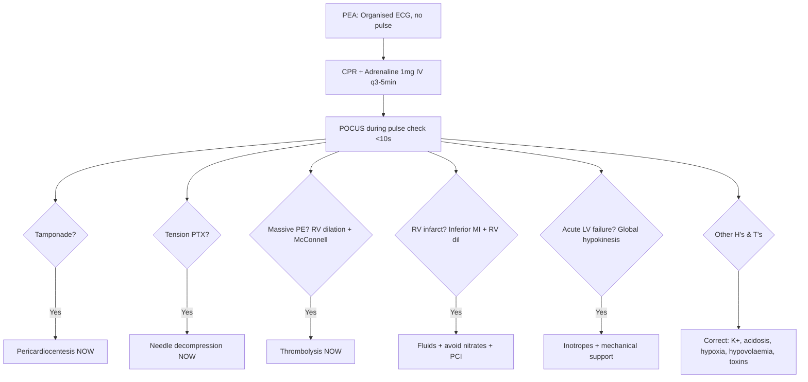

# Pulseless Electrical Activity (PEA) from Cardiac Causes

Related: [[../Cardiology MOC|Cardiology MOC]] · [[../Davidson Chapter 16 - Cardiology Hierarchy|Cardiology Hierarchy]] · [[../Syncope, Shock, and Acute Hemodynamic Emergencies|Syncope, Shock, and Acute Hemodynamic Emergencies]] · [[Shock and cardiovascular emergencies]] · [[../Cardiac tamponade|Cardiac tamponade]] · [[../Obstructive shock from cardiac causes|Obstructive shock from cardiac causes]] · [[../Cardiogenic shock|Cardiogenic shock]] · [[../Acute aortic syndrome|Acute aortic syndrome]] · [[../../Arrhythmias and Cardiac Conduction Disorders/Ventricular fibrillation and cardiac arrest rhythms|VF/Cardiac arrest rhythms]] · [[../../Heart Failure and Acute Cardiac Decompensation/Cardiogenic shock|Cardiogenic shock]]

> [!important]
> **PEA** = organised electrical activity on ECG **without** palpable pulse / measurable BP. **Not a rhythm — a haemodynamic state**. FCPS/MRCP exams test: **reversible causes (Hs & Ts)**, **cardiac-specific PEA** (tamponade, massive PE, RV infarction, acute LV failure), **POCUS in PEA** (IVC, RV, pericardium, contractility), and **management algorithm** (CPR + adrenaline + treat cause). **Survival < 10%**; outcome depends on **reversible cause identification and treatment within minutes**.

## Learning Objectives
- Define PEA and distinguish from asystole, VF/pVT, pseudo-PEA
- Apply **Hs & Ts** reversible causes with focus on **cardiac-specific** causes
- Use **POCUS (FEEL/RUSH protocol)** during CPR to identify aetiology
- Differentiate **true PEA** (no mechanical activity) from **pseudo-PEA** (mechanical activity but no palpable pulse due to shock)
- Execute cardiac-specific interventions: pericardiocentesis, thrombolysis, needle decompression
- Understand prognosis: reversible cause + ROSC = outcome

## Definition & Classification

| Term | Definition |
|------|------------|
| **PEA** | Organised electrical activity (any rhythm except VF/VT/asystole) **without** palpable central pulse / BP |
| **Pseudo-PEA** | **Mechanical cardiac activity present** (on echo) but **no palpable pulse** — profound shock, vasoplegia, severe hypovolaemia |
| **True PEA** | **No mechanical activity** despite electrical activity — electromechanical dissociation (EMD) |
| **Fine VF masquerading as PEA** | Low-amplitude VF on ECG — **check monitor gain, lead**; treat as VF |

> [!critical]
> **Pseudo-PEA has better prognosis** — treat as profound shock (fluids, vasopressors). **True PEA** = electromechanical dissociation = worse. **POCUS distinguishes**.

## Cardiac Causes of PEA (The "Ts" + Cardiac H's)

| Category | Specific Cause | POCUS Finding | Immediate Intervention |
|----------|----------------|---------------|------------------------|
| **Tamponade** | Pericardial effusion (trauma, uraemia, malignancy, post-cardiac surgery, aortic dissection) | **Pericardial effusion + RA/RV diastolic collapse + IVC plethora** | **Pericardiocentesis** (US-guided) |
| **Tension Pneumothorax** | Trauma, COPD, ventilation, procedures | **Absent lung sliding + lung point** (or absent sliding + plethora) | **Needle decompression** (2nd ICS MCL) → chest tube |
| **Thrombosis (Massive PE)** | DVT, hypercoagulable, immobility, cancer | **RV dilation (RV/LV > 1) + McConnell's sign + septal flattening + IVC plethora** | **Thrombolysis** (alteplase 50 mg IV bolus in arrest; 100 mg over 2h if ROSC) |
| **Coronary Thrombosis (Acute MI)** | RV infarction, extensive LV MI, papillary muscle rupture | **RV dilation (RV infarct) OR akinesis LV** | **PCI if ROSC**; inotropes/IV ECPR |
| **RV Infarction** | Inferior MI + proximal RCA | **RV dilation + RV dysfunction + IVC plethora + clear lungs** | **Fluids + avoid nitrates**; PCI |
| **Acute LV Failure** | Massive anterior MI, myocarditis, Takotsubo | **Global LV hypokinesis/akinesis, low EF, dilated LV** | **Inotropes/vasopressors**; mechanical support (Impella, VA-ECMO) |
| **Aortic Dissection (Type A)** | Rupture into pericardium → tamponade; coronary ostial obstruction | **Aortic flap + pericardial effusion ± tamponade** | **BP control + emergency surgery**; **pericardiocentesis with caution** |
| **Electrolyte/Metabolic** | Hyperkalaemia, severe acidosis, hypocalcaemia | Non-specific | **Correct immediately** (Ca²⁺, insulin/glucose, bicarbonate) |

> [!warning]
> **Cardiac causes of PEA are TIME-CRITICAL**. **Tamponade, tension PTX, massive PE = immediately treatable during CPR**.

## Hs & Ts Relevant to Cardiac PEA

| H / T | Cause | Cardiac Relevance |
|-------|-------|-------------------|
| **Hypovolaemia** | Haemorrhage, dehydration | Preload starvation → pseudo-PEA |
| **Hypoxia** | Respiratory failure, PE | ↓ Myocardial contractility, RV failure |
| **Hydrogen ion (acidosis)** | Lactic, respiratory, renal | Myocardial depression |
| **Hyper/hypokalaemia** | Electrolyte disturbance | **HyperK → PEA/asystole**; treat immediately |
| **Hypothermia** | Environmental, drug-induced | Myocardial depression; "not dead until warm and dead" |
| **Tension pneumothorax** | **T** | Needle decompression |
| **Tamponade (cardiac)** | **T** | Pericardiocentesis |
| **Thrombosis (PE, MI)** | **T** | Thrombolysis / PCI |
| **Toxins** | Beta-blockers, CCB, digoxin, opioids, cocaine | Myocardial depression, arrhythmias |

## POCUS in PEA (FEEL / RUSH Protocol) — **During CPR (pulse check < 10 sec)**

| View | What to Look For | PEA Aetiology |
|------|------------------|---------------|
| **Subxiphoid (SX) / Parasternal long (PLAX)** | **Pericardial effusion, RA/RV diastolic collapse** | **Tamponade** |
| | **RV dilation (RV/LV > 1), McConnell's sign, septal flattening** | **Massive PE, RV infarction** |
| | **Global LV hypokinesis, dilated LV** | **Acute LV failure, MI, myocarditis** |
| | **Hyperdynamic LV, small cavity** | **Hypovolaemia, distributive shock** |
| **IVC (SX/IVC view)** | **Plethoric (dilated, < 50% collapse)** | **Tamponade, PE, RV failure** |
| | **Collapsed (> 50% collapse)** | **Hypovolaemia** |
| **Lung (bilateral anterior)** | **Absent lung sliding + lung point** | **Tension pneumothorax** |
| | **B-lines (diffuse)** | **Pulmonary oedema** |
| **Aortic (SX/PLAX)** | **Intimal flap, aortic dilation** | **Dissection** |

> [!tip]
> **Perform POCUS during rhythm/pulse check (< 10 sec)**. Do not delay CPR. **Tamponade & tension PTX = treat immediately on POCUS**.

## PEA Algorithm (Cardiac Focus)

## Distinguishing Pseudo-PEA vs True PEA

| Feature | **Pseudo-PEA** | **True PEA** |
|---------|----------------|--------------|
| **POCUS** | **Micro-contractility** (low EF but walls moving) | **Standstill** (no wall motion) |
| **Aortic valve** | **Opens** (VTI > 0) | **Closed** |
| **ETCO₂** | **> 10–15 mmHg** (some flow) | **< 10 mmHg** (no flow) |
| **Arterial line** | **Waveform present** (low amplitude) | **Flat line** |
| **Prognosis** | Better (profound shock) | Worse (electromechanical dissociation) |
| **Management** | **Fluids, vasopressors, treat shock** | **Treat cause + CPR + consider ECPR** |

> [!critical]
> **Pseudo-PEA is shock with organised ECG**. Treat as **profound shock**: fluids, noradrenaline, inotropes, source control. **ETCO₂ > 10–15 mmHg + aortic valve opening on echo = pseudo-PEA**.

## Cardiac-Specific Interventions in PEA

### 1. Pericardiocentesis (Tamponade)
- **Indication**: POCUS: effusion + RA/RV diastolic collapse + IVC plethora + PEA
- **Technique**: US-guided subxiphoid/apical; 16–18G needle, 5F pigtail; leave drain
- **Yield**: **ROSC in 50–70%** if tamponade cause
- **Complications**: LV puncture, coronary laceration, arrhythmia, pneumothorax

### 2. Needle Decompression (Tension PTX)
- **Indication**: POCUS: absent lung sliding + lung point OR clinical: tracheal deviation, hypotension, unilateral absent breath sounds
- **Site**: **2nd ICS midclavicular line** (14–16G, 4.5–5 cm) or **4th/5th ICS midaxillary** (ATLS)
- **Follow**: Tube thoracostomy

### 3. Thrombolysis (Massive PE)
- **Indication**: POCUS: RV dilation + McConnell's + IVC plethora + PEA **OR** clinical high probability
- **Agent**: **Alteplase 50 mg IV bolus** (arrest dose); **100 mg over 2h** if ROSC
- **Contraindications**: Active bleeding, recent surgery/trauma (< 3w), intracranial pathology, stroke < 3m, aortic dissection
- **Alternative**: Surgical embolectomy / catheter thrombectomy if contraindicated

### 4. RV Infarction Management
- **Recognition**: Inferior MI + hypotension + clear lungs + JVD + **RV dilation on POCUS**
- **Management**: **IV fluids (500–1000 mL)** — preload dependent; **avoid nitrates, diuretics**; **PCI** culprit (RCA)

### 5. Acute LV Failure / Cardiogenic Shock PEA
- **POCUS**: Global LV hypokinesis, dilated LV, low EF
- **Management**: **Noradrenaline + dobutamine/milrinone**; **mechanical support** (Impella, VA-ECMO) if available; **PCI** if MI

## Prognosis & Post-ROSC Care
| Factor | Prognosis |
|--------|-----------|
| **Reversible cause treated < 10 min** | **Best** (survival 20–30%) |
| **Tamponade / Tension PTX / PE treated** | **Moderate** (survival 15–25%) |
| **True PEA (no cause found)** | **Poor** (survival < 5%) |
| **Post-ROSC** | **TTM (32–36°C)**, PCI if STEMI/RV infarct, haemodynamic optimisation, neuroprognostication at 72h |

> [!warning]
> **PEA survival to discharge ~5–10% overall**. **Reversible cause PEA → better outcomes**. **Post-ROSC care critical**.

## Drug Interactions / Contraindications / Comorbidity Cautions

| Drug | PEA Context | Caution |
|------|-------------|---------|
| **Adrenaline 1 mg IV** | Standard ALS | **High-dose not recommended**; consider vasopressin 40U as alternative |
| **Atropine** | Removed from PEA/asystole algorithm (2020) | Not routinely recommended |
| **Calcium chloride** | Hyperkalaemia, Ca channel blocker toxicity | **10% 10 mL IV** (not gluconate) |
| **Sodium bicarbonate** | Severe acidosis (pH < 7.1), TCA overdose, hyperK | **50–100 mEq IV**; avoid routine |
| **Magnesium** | Torsades, hypomagnesemia | **2g IV bolus** |
| **Insulin/dextrose** | Hyperkalaemia | **10U regular insulin + 50 mL D50** |
| **Hydroxocobalamin** | Cyanide toxicity (smoke inhalation) | **5g IV** |
| **Lipid emulsion** | Local anaesthetic toxicity (LAST) | **1.5 mL/kg 20% bolus** |

## Procedures / Indications / Contraindications

### Extracorporeal CPR (ECPR)
- **Indication**: **Witnessed in-hospital cardiac arrest**, reversible cause (PE, tamponade, MI), age < 70, no major comorbidities, CPR < 60 min
- **Contraindication**: Unwitnessed, prolonged downtime, irreversible cause, severe comorbidities
- **Centres**: Specialist ECMO-capable cardiac arrest centres

### Temporary Mechanical Circulatory Support
| Device | Indication | Duration |
|--------|------------|----------|
| **Impella CP/5.0** | Cardiogenic shock, post-PCI, post-ROSC | Days |
| **VA-ECMO** | Refractory cardiogenic shock, massive PE, post-cardiotomy | Days–weeks |
| **IABP** | Cardiogenic shock (less favoured now) | Days |

## Complications of Mismanagement
- **Delaying pericardiocentesis** for formal consent/echo in tamponade PEA → death
- **Missing tension PTX** in ventilated patient (high peak pressures, sudden PEA)
- **Giving thrombolysis in aortic dissection** (mimics PE) → fatal bleeding
- **Fluids in PE with RV failure** → worsening RV dilation, arrest
- **Not doing POCUS** → missed reversible cause
- **Prolonged CPR without cause identification** → futile

## Red Flags — Act Immediately
- **PEA + JVD + muffled HS** → Tamponade → Pericardiocentesis
- **PEA + tracheal deviation** → Tension PTX → Needle decompression
- **PEA + RV dilation + McConnell's** → Massive PE → Thrombolysis
- **PEA + inferior MI + clear lungs + JVD** → RV infarct → Fluids + PCI
- **PEA + tearing pain + pulse deficit** → Dissection → BP control + Surgery (pericardiocentesis with caution)

## Post-ROSC Cardiac Care
1. **12-lead ECG** → STEMI/RV infarct → **immediate PCI**
2. **Echo/POCUS** → LV/RV function, tamponade, PE signs
3. **Coronary angiography** if STEMI or shock with suspected MI
4. **TTM 32–36°C** for ≥ 24h
5. **Haemodynamic optimisation**: MAP > 65, noradrenaline ± dobutamine, consider mechanical support
6. **Neuroprognostication** at 72h (pupillary, SSEP, NSE, EEG, MRI)

## Topic Correlation
- [[../Cardiac tamponade|Cardiac tamponade]] — detailed tamponade
- [[../Obstructive shock from cardiac causes|Obstructive shock from cardiac causes]] — PEA causes
- [[../Cardiogenic shock|Cardiogenic shock]] — RV/LV failure PEA
- [[../Acute aortic syndrome|Acute aortic syndrome]] — dissection PEA
- [[../../Arrhythmias and Cardiac Conduction Disorders/Ventricular fibrillation and cardiac arrest rhythms|VF/Cardiac arrest rhythms]] — ALS algorithm
- [[../../Heart Failure and Acute Cardiac Decompensation/Cardiogenic shock|Cardiogenic shock]] — post-ROSC management

## Special Situations

### Pregnancy
- **Perimortem C-section** at 4–5 min if ROSC not achieved (improves maternal venous return + fetal survival)
- **Left lateral tilt** during CPR (manual uterine displacement)
- **PE more common** (hypercoagulable); thrombolysis if massive PE (risk/benefit)

### Post-Cardiac Surgery
- **Tamponade common** (clot) → re-sternotomy preferred if early (< 7 days) or clot; pericardiocentesis if late
- **Phrenic nerve palsy** → diaphragm dysfunction

### Covid-19
- **PE risk high**; low threshold for thrombolysis in PEA with RV dilation
- **Myocarditis** → acute LV failure PEA

### Trauma
- **Tamponade, tension PTX, massive haemothorax, aortic rupture** — surgical causes
- **Blood transfusion** + surgical control

## FCPS/MRCP High-Yield Points
- **PEA** = organised ECG + no pulse; **not a rhythm but a haemodynamic state**
- **Pseudo-PEA** = mechanical activity on echo, no palpable pulse (profound shock) — **better prognosis**
- **Cardiac PEA causes (Ts)**: **Tamponade, Tension PTX, Thrombosis (PE, MI)**
- **POCUS during CPR (< 10s)** is standard: **Tamponade → pericardiocentesis; Tension PTX → needle decompression; RV dilation + McConnell's → thrombolysis**
- **True PEA** = electromechanical dissociation (standstill on echo) — worse prognosis
- **RV infarct PEA** = fluids + avoid nitrates + PCI
- **ETCO₂**: > 10–15 mmHg suggests pseudo-PEA; < 10 mmHg = true PEA
- **Reversible cause treated < 10 min** → survival 20–30%

## Common Viva Questions
- Define PEA. How does it differ from asystole and pseudo-PEA?
- What are the cardiac causes of PEA? (Ts)
- How do you use POCUS in PEA?
- What is the management of tamponade causing PEA?
- When do you thrombolyse for PE in PEA?
- How do you distinguish pseudo-PEA from true PEA?
- What is the role of ETCO₂ in PEA?
- What is the management of RV infarction presenting as PEA?

## Common Confusions / Exam Traps
- Treating all PEA the same (pseudo-PEA = shock management; true PEA = cause-directed)
- Missing tension PTX in ventilated patient
- Giving thrombolysis in aortic dissection (mimics PE)
- Not doing POCUS during pulse check
- Delaying pericardiocentesis for formal echo
- Using atropine in PEA (removed from algorithm)
- Fluid bolus in tamponade/PE with RV failure (worsens)
- Confusing PEA with fine VF (check gain, leads)

## Mnemonics
- **PEA Cardiac Ts**: **T**amponade, **T**ension PTX, **T**hrombosis (PE/MI) — **3 Ts**
- **Pseudo vs True**: **P**seudo = **P**ulse on echo (motion); **T**rue = **T**otal standstill
- **POCUS checklist**: **P**ericardium, **R**V, **L**V, **I**VC, **L**ungs, **A**orta — **PRLILA**
- **RV infarct**: **I**nferior MI + **C**lear lungs + **J**VD + **H**ypotension + **R**V dilation — **ICJHR**
- **PEA outcome**: **R**eversible cause < **1**0 min = **S**urvival — **R1S**

## Mind Map
- PEA from Cardiac Causes
  - Definition: Organised ECG + no pulse
  - Pseudo-PEA vs True PEA (echo, ETCO₂, prognosis)
  - Cardiac Causes (3 Ts)
    - Tamponade → Pericardiocentesis
    - Tension PTX → Needle decompression
    - Thrombosis: PE → Thrombolysis; MI → PCI
  - RV Infarct: Fluids + avoid nitrates + PCI
  - Acute LV Failure: Inotropes + Mechanical support
  - POCUS in CPR (<10s): Pericardium, RV, LV, IVC, Lungs, Aorta
  - Prognosis: Reversible cause < 10 min = survival
  - Post-ROSC: PCI, TTM, Haemodynamic optimisation, ECPR

## Suggested Visuals / Image Notes
- PEA algorithm with cardiac Ts highlighted
- POCUS views for PEA (subxiphoid, PLAX, IVC, lung, aortic)
- Echo: Tamponade (RV collapse), PE (RV dilation, McConnell), True PEA (standstill)
- ETCO₂ waveform: pseudo-PEA vs true PEA vs ROSC
- PEA outcomes by cause (bar chart)

## Suggested Video References
- Search for: "pulseless electrical activity PEA cardiac tamponade PE POCUS"
- Search for: "pseudo-PEA vs true PEA ultrasound ETCO2"
- Search for: "massive PE thrombolysis cardiac arrest PEA"
- Search for: "RV infarction management fluids avoid nitrates"

## One-Page Revision Summary
- **PEA** = organised ECG + no pulse; **pseudo-PEA** = mechanical activity on echo (shock); **true PEA** = standstill (EMD)
- **Cardiac Ts**: **Tamponade, Tension PTX, Thrombosis (PE/MI)**
- **POCUS in CPR (<10s)**: Pericardium (tamponade), RV (PE, RV infarct), LV (failure), IVC, Lungs (PTX), Aorta (dissection)
- **Tamponade** → Pericardiocentesis **NOW**
- **Tension PTX** → Needle decompression 2nd ICS MCL **NOW**
- **Massive PE** → Thrombolysis (alteplase 50 mg bolus) **NOW**
- **RV infarct** → Fluids + avoid nitrates + PCI
- **Pseudo-PEA** = profound shock → fluids, vasopressors; better prognosis
- **True PEA** = EMD → worse; treat cause + CPR
- **Reversible cause < 10 min** → survival 20–30%

## 24-Hour Recall Prompts
- Define PEA, pseudo-PEA, true PEA
- List cardiac Ts of PEA
- State POCUS checklist for PEA
- Immediate action for tamponade/PTX/PE in PEA
- Differentiate pseudo-PEA vs true PEA

## 7-Day / 15-Day / 30-Day Revision Tracker
- **Day 1**: Read note + MCQs/SBAs
- **Day 7**: Draw PEA algorithm with 3 Ts; practice POCUS views on simulator
- **Day 15**: 4 PEA vignettes (tamponade, PTX, PE, RV infarct, LV failure)
- **Day 30**: Rapid revision + POCUS + reversible cause timing + pseudo-PEA

## Must Know / Should Know / Nice to Know
### Must Know
- PEA definition; pseudo vs true
- 3 Cardiac Ts + immediate interventions
- POCUS in CPR (views, findings)
- RV infarct management (fluids, no nitrates)
- Reversible cause timing = prognosis

### Should Know
- ETCO₂ in pseudo vs true PEA
- ECPR indications
- Post-ROSC care (TTM, PCI, neuro)
- Pregnancy/trauma modifications

### Nice to Know
- Atropine removed from PEA algorithm
- High-dose adrenaline not recommended
- VA-ECMO as bridge in refractory PEA
- Novel biomarkers during CPR

## My Weak Points
- [ ] I list 3 cardiac Ts and immediate interventions
- [ ] I state POCUS views and findings for each
- [ ] I differentiate pseudo vs true PEA on echo
- [ ] I state RV infarct management precisely
- [ ] I recall ETCO₂ thresholds

## Self-Test Scorecard
- Understanding /10
- Recall /10
- Vignette interpretation /10
- MCQ performance /10
- Viva confidence /10

**Interpretation**
- **<35/50** = weak topic, needs re-study
- **35–44/50** = acceptable but not secure
- **45+/50** = strong exam-ready topic

## Exam Answer Modes