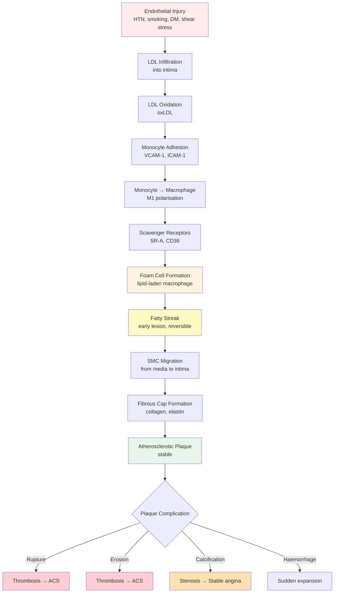
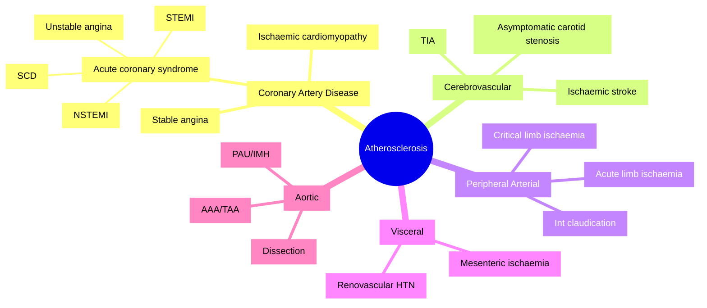
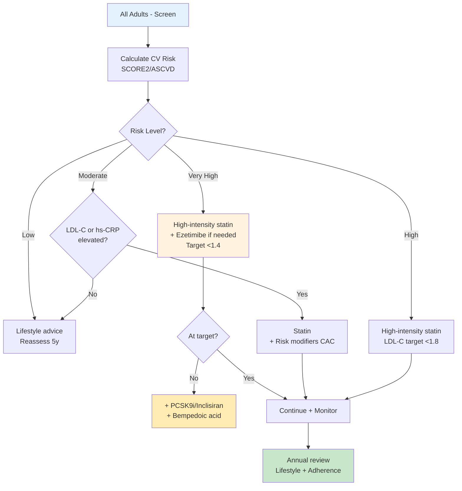
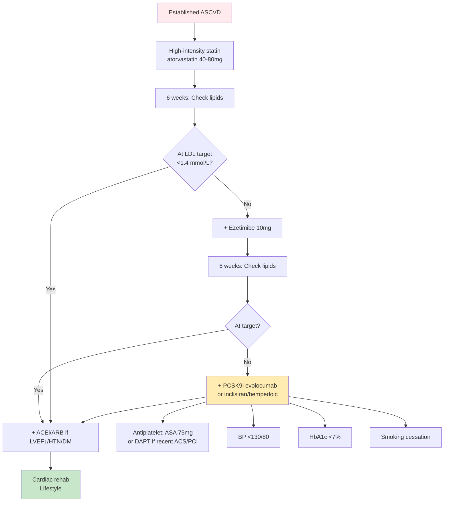
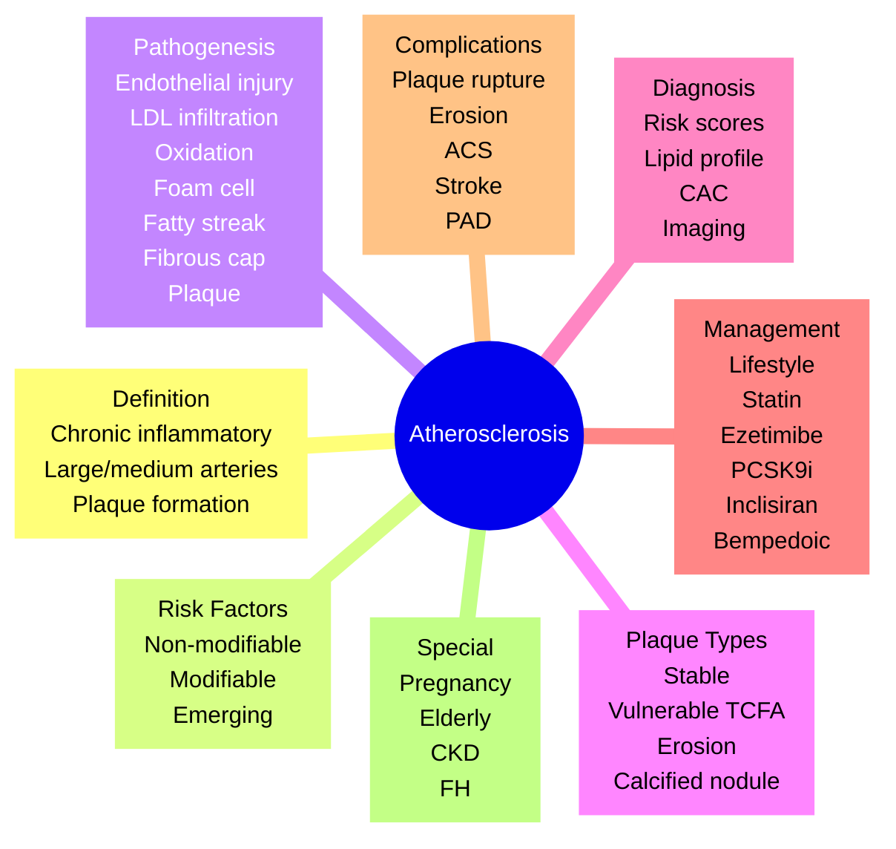

<!-- Source: /mnt/tb/Medicine/Cardiology/02_Acute_Coronary_Syndromes/Atherosclerosis_pathogenesis_full.md | section: 16.2 | hub: acute-coronary-syndromes -->

# Atherosclerosis Pathogenesis

> [!info] **Topic Classification**
> **Section:** Acute Coronary Syndromes
> **Heading:** Pathophysiology & Risk Stratification
> **Category:** ACS Pathophysiology
> **Exam Priority:** Tier 1 (Core High-Yield)

---

## 1. HIGH-YIELD SUMMARY (30-Second Review)

> [!tip] **Atherosclerosis Pathogenesis in a Nutshell**
> - **Definition:** Chronic inflammatory disease of large/medium arteries characterised by intimal plaques (atheromas) of lipids, inflammatory cells, smooth muscle cells, and fibrous tissue
> - **Key Mechanism:** Endothelial injury → LDL infiltration/oxidation → monocyte recruitment → foam cell formation → fatty streak → fibrous plaque → complicated plaque (rupture/erosion)
> - **Clinical Pearl:** Atherosclerosis is the **unifying pathology** behind STEMI, NSTEMI, stable angina, stroke, and peripheral arterial disease
> - **Exam Trigger Words:** "fatty streak," "foam cell," "fibrous cap," "thin-cap fibroatheroma," "vulnerable plaque," "endothelial dysfunction," "LDL oxidation"
> - **Management Priority:** Primary prevention (LDL lowering, BP control, smoking cessation) — plaque stabilisation before rupture

---

## 2. ETIOLOGY & PATHOPHYSIOLOGY

### 2.1 Etiological Classification (Risk Factors)

| Category | Risk Factors | Modifiability | Mechanism |
|----------|--------------|---------------|-----------|
| **Traditional major** | Age (M>45, F>55), Male sex, Family history (1st degree <55 male/<65 female) | Non-modifiable | Genetic + cumulative exposure |
| **Lipids** | ↑LDL-C, ↓HDL-C, ↑Lp(a), ↑ApoB | Modifiable | LDL infiltration, oxidation |
| **Haemodynamic** | Hypertension | Modifiable | Endothelial shear stress |
| **Metabolic** | Diabetes mellitus, Metabolic syndrome, Obesity | Modifiable | Glycation, insulin resistance, inflammation |
| **Behavioural** | Smoking (most powerful modifiable), Physical inactivity, Poor diet, Alcohol excess | Modifiable | Endothelial injury, oxidative stress |
| **Inflammatory** | hs-CRP >2 mg/L, Rheumatoid arthritis, SLE, HIV, Periodontitis | Partially modifiable | Chronic systemic inflammation |
| **Emerging** | Air pollution, Psychosocial stress, Sleep deprivation, Gut microbiome dysbiosis | Modifiable | Endothelial dysfunction |

### 2.2 Pathophysiology Flowchart



### 2.3 Stages of Atherogenesis (Stary Classification)

| Stage | Lesion | Time | Key Features | Reversibility |
|-------|--------|------|--------------|---------------|
| **I** | Initial | 1st decade | Isolated macrophage foam cells | Reversible |
| **II** | Fatty streak | 1-3rd decade | Lipid-laden foam cells, layers; visible yellow streaks | Reversible |
| **III** | Pre-atheroma | 3-4th decade | Small extracellular lipid pools | Intermediate |
| **IV** | Atheroma | 4th decade | Confluent lipid core, well-defined intimal thickening | Irreversible |
| **V** | Fibroatheroma | 5th+ decade | Fibrous cap over lipid core (Va=lipid core intact, Vb=calcification, Vc=fibrosis dominant) | Irreversible |
| **VI** | Complicated lesion | Variable | Surface defect, haematoma, thrombosis (VIa=disruption, VIb=haematoma, VIc=thrombosis) | Irreversible |
| **VII** | Calcified | Late | Calcification dominates | Irreversible |
| **VIII** | Fibrotic | Late | Collagen-rich, minimal lipid | Irreversible |

### 2.4 Molecular/Genetic Basis

- **Genes:** PCSK9 (gain-of-function → familial hypercholesterolaemia), LDLR (familial hypercholesterolaemia), APOB, LDLRAP1
- **Inheritance:** Polygenic (most); monogenic (familial hypercholesterolaemia - autosomal dominant)
- **Key Pathways:** NF-κB (inflammation), SREBP-2 (cholesterol synthesis), LOX-1 (oxLDL receptor), TLR4 (innate immune activation), Wnt/β-catenin (calcification)

---

## 3. CLINICAL FEATURES

### 3.1 Clinical Manifestations (Mostly Asymptomatic Until Complication)

| Phase | Features | Mechanism |
|-------|----------|-----------|
| **Preclinical** | Asymptomatic (decades) | Slow plaque growth, arterial remodelling (Glagov) |
| **Stable** | Stable angina, claudication, asymptomatic carotid disease | Fixed stenosis (>70% lumen) |
| **Unstable/critical** | ACS (STEMI/NSTEMI/UA), TIA, stroke, acute limb ischaemia | Plaque rupture/erosion → thrombosis |
| **Chronic sequelae** | Heart failure, chronic mesenteric ischaemia, renovascular HTN | Progressive stenosis + organ dysfunction |

### 3.2 Physical Examination Clues

| System | Findings | Significance |
|--------|----------|--------------|
| **Eyes** | Corneal arcus (younger = suspect FH), Xanthelasma | Hypercholesterolaemia |
| **Skin** | Tendon xanthomas (Achilles, extensor tendons), Xanthoma tuberosum, Eruptive xanthomas | Familial hypercholesterolaemia |
| **Vascular** | Bruits (carotid, abdominal, femoral), Diminished/absent pulses, BP differential between arms (>20 mmHg) | Atherosclerotic stenosis |
| **Cardiac** | S4, LV heave, murmurs (AS, MR), JVP elevation | Ischaemic heart disease/HF |
| **Abdomen** | Pulsatile mass, renal bruit | AAA, renovascular disease |

### 3.3 Clinical Syndromes/Phenotypes



---

## 4. DIAGNOSTIC APPROACH

### 4.1 Diagnostic Criteria & Assessment Tools

| Assessment | Tool | Use Case | Findings |
|------------|------|----------|----------|
| **Risk scoring** | SCORE2/ASCVD/QRISK3 | 10-year CV risk | Low <5%, Intermediate 5-10%, High ≥10% |
| **Lipid profile** | Fasting/TG/HDL/LDL/Lp(a)/ApoB | Dyslipidaemia detection | LDL target based on risk |
| **Imaging - coronary** | CTCA, CAC scoring, Stress imaging | Anatomical/ischaemia | Stenosis, calcium burden |
| **Imaging - vascular** | Carotid US (CIMT), ABI, Ankle-brachial index | Subclinical atherosclerosis | Plaque burden, stenosis |
| **Biomarkers** | hs-CRP, Lp(a), NT-proBNP, TnT | Risk refinement | Inflammatory/residual risk |
| **Endothelial function** | FMD (flow-mediated dilation) | Research | Endothelial dysfunction |

### 4.2 Investigations - Tiered Approach

#### Tier 1: Universal Screening (All Adults)
| Test | Indication | Key Findings | Interpretation |
|------|------------|--------------|----------------|
| **Lipid profile** | All adults ≥40y (or earlier if RF) | LDL-C, HDL-C, TG, TC | Dyslipidaemia: LDL>3.0, TC>5.0 |
| **Fasting glucose/HbA1c** | All adults ≥40y | DM detection | DM: FPG≥7.0, HbA1c≥6.5% |
| **BP measurement** | All visits | HTN | ≥140/90 (ESC) or ≥130/80 (AHA) |
| **BMI/Waist** | All visits | Obesity | BMI≥30, WC>102cm (M)/88cm (F) |

#### Tier 2: Risk Refinement (Intermediate Risk)
| Test | Indication | Key Findings | Interpretation |
|------|------------|--------------|----------------|
| **CAC scoring** | Intermediate risk, asymptomatic | Coronary calcium | 0=very low; >100=elevated; >400=high |
| **hs-CRP** | Intermediate risk, uncertain | Inflammation | >2 mg/L = elevated CV risk |
| **Lp(a)** | Family history, recurrent events | Genetic risk | >50 mg/dL = elevated |
| **ApoB** | Diabetic, MetS, high TG | Particle number | >130 mg/dL = elevated |
| **ABI** | Suspected PAD, >65y | Atherosclerosis | <0.9 = PAD; >1.4 = calcified |

#### Tier 3: Disease-Specific (Symptomatic)
| Test | Indication | Key Findings | Prognostic Value |
|------|------------|--------------|------------------|
| **ECG** | Suspected CAD | Q waves, ST-dev, LVH | Prior MI/ischaemia |
| **Stress test** | Suspected ischaemia | ST-depression, RWMA, perfusion defect | Ischaemia burden |
| **CTCA** | Low-intermediate pre-test probability | Stenosis, plaque characterisation | Anatomical diagnosis |
| **Invasive angio** | Confirmed/suspected CAD with intervention planned | Culprit/stenoses | Revascularisation planning |
| **IVUS/OCT** | PCI guidance, plaque assessment | Plaque morphology, stent apposition | Plaque vulnerability |
| **CMR** | Viability, infiltrative | LGE, scar | Viability/etiology |

### 4.3 Differential Diagnosis

| Condition | Key Distinguishing Feature | Confirmatory Test |
|-----------|---------------------------|-------------------|
| **Vasculitis** (Takayasu, GCA) | Young, systemic inflammation, tender vessels | MRI/PET, biopsy |
| **Fibromuscular dysplasia** | Young women, "string of beads" | CT/MR angiography |
| **Spontaneous coronary dissection (SCAD)** | Young women, peripartum, no atherosclerosis | CTCA, OCT, IVUS |
| **Radiation vasculopathy** | Prior chest/neck RT | Angiography |
| **Myocardial bridging** | Systolic compression (antegrade flow in diastole) | IVUS, OCT, FFR/diastolic |

---

## 5. SEVERITY ASSESSMENT & RISK STRATIFICATION

### 5.1 Plaque Vulnerability Classification (Virmani)

| Plaque Type | Cap Thickness | Lipid Core | Inflammation | Thrombosis Risk |
|-------------|---------------|------------|--------------|-----------------|
| **Thick-cap fibroatheroma (TCFA stable)** | >65 μm | Small | Low | Low |
| **Thin-cap fibroatheroma (TCFA - vulnerable)** | <65 μm | Large | High | **Very high** |
| **Plaque erosion** | Often thick, denuded endothelium | Variable | Variable | High |
| **Calcified nodule** | Disrupted calcified plate | Small | Low | Moderate |
| **Healed plaque rupture** | Thick, layered | Variable | Variable | Variable |

### 5.2 Risk Scores (Memorize Thresholds)

| Score | Variables | Thresholds | Clinical Action |
|-------|-----------|------------|-----------------|
| **SCORE2** (40-69y) | Age, sex, smoking, SBP, TC | Low <1%, Moderate 1-<5%, High 5-<10%, Very high ≥10% | Statin if mod-high |
| **ASCVD (US)** | Age, sex, race, TC, HDL, SBP, DM, smoking, HTN tx | Low <5%, Borderline 5-7.5%, Intermediate 7.5-20%, High ≥20% | Statin if ≥7.5% |
| **QRISK3 (UK)** | Age, sex, BMI, BP, lipids, DM, smoking, family Hx, etc. | Calculate 10-yr risk | Statin if ≥10% |
| **CHA2DS2-VASc** | CHF, HTN, Age, DM, Stroke, Vascular, Sex | M≥2, F≥3 = anticoag | AF stroke prevention |
| **CAC (Agatston)** | Coronary calcium | 0, 1-100, 101-400, >400 | Risk reclassification |

### 5.3 LDL-C Targets by Risk Category (2023 ESC)

| Risk Category | Examples | LDL-C Target | Non-HDL-C Target |
|---------------|----------|--------------|------------------|
| **Low** | SCORE2 <1% | <3.0 mmol/L | <3.8 mmol/L |
| **Moderate** | SCORE2 1-5%, DM <40y no RF | <2.6 mmol/L | <3.4 mmol/L |
| **High** | DM, CKD 3-4, SCORE2 5-10% | <1.8 mmol/L AND ≥50% reduction | <2.6 mmol/L |
| **Very high** | ASCVD, CKD 5, DM + organ damage, SCORE2 ≥10% | <1.4 mmol/L AND ≥50% reduction | <2.2 mmol/L |
| **Extreme** | Recurrent events, ASCVD + DM/CKD/smoking | <1.0 mmol/L | <1.8 mmol/L |

---

## 6. MANAGEMENT ALGORITHM

### 6.1 Primary Prevention Algorithm



**Lifestyle Modifications (Universal):**
1. **Smoking cessation** (single most effective intervention - 50% CV risk reduction at 1y)
2. **Mediterranean diet** (or DASH) - fruits, vegetables, whole grains, nuts, fish, olive oil
3. **Physical activity** - 150 min/week moderate aerobic + 2x resistance training
4. **Weight control** - target BMI <25, waist <102cm (M)/88cm (F)
5. **Alcohol moderation** - <14 units/week (UK), abstinence ideal
6. **BP control** - target <130/80 (AHA), <140/90 (ESC)
7. **Glycaemic control** - HbA1c <7% (individualised)

### 6.2 Secondary Prevention Algorithm (Post-ASCVD)



### 6.3 Pharmacotherapy - Evidence-Based

| Drug Class | Agent | Dose | Indication | Key Trial | Monitoring |
|------------|-------|------|------------|-----------|------------|
| **High-intensity statin** | Atorvastatin 40-80mg | 1x daily | Secondary prevention; LDL reduction ≥50% | PROVE-IT, IMPROVE-IT, FOURIER | LFTs, CK if symptoms |
| **High-intensity statin** | Rosuvastatin 20-40mg | 1x daily | Alternative; LDL reduction ≥50% | JUPITER, SATURN | LFTs, CK if symptoms |
| **Ezetimibe** | Ezetimibe 10mg | 1x daily | Add-on if not at LDL target | IMPROVE-IT | LFTs |
| **PCSK9 monoclonal Ab** | Evolocumab 140mg SC 2w OR 420mg monthly | Subcutaneous | High-risk not at target on max statin+ezetimibe | FOURIER, ODYSSEY | No routine |
| **PCSK9 siRNA** | Inclisiran 284mg SC | At 0, 3m, then 6m | High-risk not at target | ORION-10, -11, -18 | No routine |
| **Bempedoic acid** | Bempedoic acid 180mg | 1x daily | Statin-intolerant | CLEAR Outcomes | Gout, tendon rupture |
| **Omega-3 fatty acids** | Icosapent ethyl 2g BD | 1g BD | TG 1.5-5.6 mmol/L on statin, ASCVD or DM | REDUCE-IT | Bleeding (mild) |
| **Antiplatelet** | Aspirin 75-100mg | 1x daily | Secondary prevention (chronic); Primary prevention individualised | ASCEND, ARRIVE, ASPREE | Bleeding |
| **ACEi/ARB** | Perindopril/Ramipril/Valsartan | Up-titrate | HFrEF, HTN, DM, CKD | HOPE, EUROPA, ONTARGET | K+, Cr, BP, cough |
| **SGLT2i** | Empagliflozin/Dapagliflozin | 10-25mg | DM + CV risk; HFrEF; CKD | EMPA-REG, DAPA-HF, EMPA-KIDNEY | Euglycaemic DKA |

### 6.4 Plaque Stabilisation (Conceptual)

- **Statins** reduce lipid core, thicken fibrous cap, reduce inflammation (REVERSAL, SATURN, IBIS-4)
- **PCSK9i** reduce lipid core, may stabilise within 1y (GLAGOV, PACMAN)
- **Anti-inflammatory** (canakinumab, colchicine) reduce MACE (CANTOS, LoDoCo2, COLCOT)
- **BP control** reduces mechanical wall stress
- **Smoking cessation** improves endothelial function within weeks

---

## 7. COMPLICATIONS & PROGNOSIS

### 7.1 Acute Complications (Plaque Complication)

| Complication | Mechanism | Incidence | Presentation | Management |
|--------------|-----------|-----------|--------------|------------|
| **Plaque rupture** | Thin-cap disruption → thrombosis | Most common cause of MI | Acute coronary syndrome | Reperfusion, antithrombotic |
| **Plaque erosion** | Endothelial denudation, often thick cap | 25-40% of ACS, especially women, smokers | NSTEMI common | Antithrombotic, conservative |
| **Calcified nodule** | Heavily calcified plaque disruption | 5-10% of ACS | Often NSTEMI | PCI (challenging) |
| **Intraplaque haemorrhage** | Neovessel rupture → sudden expansion | Variable | Acute worsening angina | Conservative/PCI |
| **Superficial calcified sheet** | Disruption of calcified plate | Older patients | ACS | PCI (rotablation) |

### 7.2 Chronic Complications

| Complication | Timeframe | Risk Factors | Surveillance | Prevention |
|--------------|-----------|--------------|--------------|------------|
| **Ischaemic cardiomyopathy** | Years after MI | Prior MI, recurrent ischaemia | Echo, BNP, GLS | Risk factor modification |
| **Recurrent MI** | Variable | Plaque vulnerability, non-adherence to Rx | Symptom assessment, stress | Statin, antiplatelet, ACEi |
| **Stent thrombosis** | Acute (<24h), subacute (1-30d), late (1-12m), very late (>1y) | Premature DAPT cessation, underexpansion | DAPT compliance | DAPT duration per guidelines |
| **Heart failure** | Years | Ischaemic damage, AF, HTN | Echo, NT-proBNP | GDMT after MI |
| **Cardiac death** | Variable | Risk factors, LV function | Risk scores | Secondary prevention |

### 7.3 Prognosis & Survival

- **Plaque regression** achievable with intensive LDL lowering (PCSK9i ± statin: REVERSAL, GLAGOV, PACMAN)
- **MACE reduction** with each 1.0 mmol/L LDL reduction: ~22% relative risk (CTT meta-analysis)
- **Survival after MI**: 1-year mortality ~10-12% (modern era), 5-year ~25-30%
- **Key prognostic factors**: LVEF, age, renal function, diabetes, smoking status, adherence

---

## 8. SPECIAL POPULATIONS

| Population | Key Considerations | Management Modifications | Contraindications |
|------------|-------------------|-------------------------|-------------------|
| **Pregnancy** | Statins teratogenic (FDA X), avoid in pregnancy/lactation | Bile acid sequestrants (cholestyramine), PCSK9i (limited data) | Statins (esp. 1st trimester), Ezetimibe (limited data) |
| **Elderly/Frail** | Polypharmacy, myopathy risk, falls | Start low statin, titrate slowly; assess adherence | High-intensity statin if intolerance |
| **CKD** | Altered pharmacokinetics, increased CV risk | Rosuvastatin/fluvastatin dose-adjusted; eGFR<30 avoid high-dose | Avoid in severe CKD without nephrology input |
| **Familial Hypercholesterolaemia** | LDL receptor mutations, very high LDL | High-intensity statin + ezetimibe + PCSK9i; consider LDL apheresis if refractory | None specific |
| **Post-transplant** | Immunosuppression → accelerated atherosclerosis | Statin (caution with CNI interactions), ASA | Avoid simvastatin >20mg with cyclosporine |
| **HIV** | Antiretroviral + traditional risk factors | Statin (avoid simvastatin/lovastatin with PIs); pravastatin/rosuvastatin preferred | Drug-drug interactions |

---

## 9. LATEST GUIDELINES & EVIDENCE (2023-2024)

| Guideline | Key Update | Impact on Practice | Level of Evidence |
|-----------|------------|-------------------|-------------------|
| **ESC 2021 Dyslipidaemia** | LDL-C <1.4 mmol/L very high risk; <1.0 extreme | Lower LDL targets, earlier combo Rx | IA |
| **ESC 2023 ACS** | High-intensity statin immediate; inclisiran as alternative | Earlier, more aggressive lipid lowering | IIa B |
| **AHA/ACC 2023 Chronic Coronary** | Bempedoic acid for statin intolerance | New oral option | IIa B |
| **ESC 2021 CV Prevention** | SCORE2/SCORE2-OP; CAC for risk refinement | Updated risk assessment tools | IB |
| **2024 AHA/ACC Primary Prevention** | Earlier statin consideration in DM age 40-75 | Earlier intervention in DM | IA |
| **EAS/ESC Familial Hypercholesterolaemia** | Universal screening; child-parent cascade | Earlier detection | IC |

**Practice-Changing Trials (Recent):**
- **CLEAR Outcomes (2023)**: Bempedoic acid vs placebo in statin-intolerant → 21% MACE reduction → New option for statin-intolerant
- **SELECT (2023)**: Semaglutide 2.4mg weekly in overweight/obese with CV disease → 20% MACE reduction → First GLP-1 RA with CV indication (US/UK)
- **ORION-18 (2024)**: Inclisiran in ASCVD → ~50% LDL reduction with twice-yearly dosing → Convenient siRNA option
- **LoDoCo2 (2020) / COLCOT (2019)**: Colchicine 0.5mg daily post-MI → 25-30% MACE reduction → Anti-inflammatory for secondary prevention
- **REDUCE-IT (2019)**: Icosapent ethyl 2g BD → 25% MACE reduction in ASCVD/DM with TG 1.5-5.6 → New add-on for residual risk

---

## 10. CONFUSIONS & COMMON PITFALLS

| Confusion/Pitfall | Why It Happens | How to Avoid | Exam Trap |
|-------------------|----------------|--------------|-----------|
| **Plaque rupture vs erosion** | Both cause ACS but different populations | Rupture = thin-cap, typical ACS; Erosion = thick cap, often women, smokers | "Erosion more common in young smokers with NSTEMI" - TRUE |
| **Fatty streak vs atheroma** | Same disease, different stage | Streak = early, reversible; Atheroma = advanced, irreversible | "Fatty streaks in children predict future MI" - FALSE (reversible) |
| **Stable vs vulnerable plaque** | Vulnerable = TCFA <65μm, high lipid core, inflammation | Use IVUS/OCT/NIRS to assess | "Most MIs from severe stenosis" - FALSE (mild-moderate stenosis ruptures) |
| **Statin myalgia vs myopathy** | Patient-reported vs CK elevation | CK if symptoms; trial off then rechallenge | "Statins cause rhabdomyolysis commonly" - FALSE (<0.01%) |
| **Primary prevention aspirin** | Older trials showed benefit | Newer trials (ARRIVE, ASCEND, ASPREE) show no net benefit, harm from bleeding | "ASA primary prevention for all >50" - FALSE |
| **Lp(a) and ASCVD risk** | Genetic, non-modifiable by statins | Measure once in lifetime; PCSK9i reduces it ~20% | "Lp(a) responds to statins" - FALSE |
| **CAC = 0** | Sometimes interpreted as no atherosclerosis | CAC=0 rules out significant atherosclerosis but not all | "CAC=0 means no need for statin" - FALSE (still consider if strong FHx) |

---

## 11. MNEMONICS & MEMORY AIDS

```mermaid
mindmap
  root((Atherosclerosis Mnemonics))
    RiskFactors[Risk Factors]
      HEART[HEART-ASD: HTN, Elderly, Age, Race, T2DM, ACS, Smoking, Dyslipidaemia]
      MajorRF[Major RF: Age, Sex, FHx, Smoking, HTN, DM, Dyslipidaemia]
    Pathogenesis[Pathogenesis Steps]
      RISE[RISE: Response to injury, Infiltration (LDL), Smooth muscle, Endothelial dysfunction]
      LAMP[LAMP: Lipid accumulation, Activation (macrophage), Migration (SMC), Proliferation]
    Plaque[Plaque Stages]
      FATS[FATS: Fatty streak, Atheroma, Thrombosis, Stenosis]
      RuptureR[Rupture risks: Thin cap, large core, inflammation, smoking]
    Treatment[Treatment Targets]
      LDL3[LDL targets: <3.0 low, <2.6 mod, <1.8 high, <1.4 very high, <1.0 extreme]
      TARGET[TARGET: Treat Aggressively, Aim Risk Globally, Reduce to Extreme Targets]
```

| Mnemonic | Stands For | Application |
|----------|------------|-------------|
| **HEART** | HTN, Elderly, Age, Race, T2DM | Major ASCVD risk factors |
| **RIS** | Response, Injury, Smooth muscle | Pathogenesis core steps |
| **FATS** | Fatty streak, Atheroma, Thrombosis, Stenosis | Plaque progression |
| **FIVE Ps** | Plaque, Pressure, Permeability, Proliferation, Procoagulation | Endothelial dysfunction |
| **4 S's of Statin** | Stabilise plaque, Shrink lipid core, Slow progression, Save lives | Statin benefits |
| **LDL Go Lower** | <1.4 very high, <1.0 extreme | ESC 2019+ targets |
| **CANTOS or COLCOT** | Anti-inflammatory for ASCVD | Canakinumab, Colchicine |

---

## 12. MIND MAP - COMPLETE TOPIC OVERVIEW



---

## 13. REVISION CARDS (One-Page Condensed)

| Category | Key Points |
|----------|------------|
| **Definition** | Chronic inflammatory disease of large/medium arteries with intimal plaque formation |
| **Pathophysiology** | Endothelial injury → LDL infiltration/oxidation → monocyte recruitment → foam cell → fatty streak → fibrous plaque → complicated plaque (rupture/erosion) |
| **Clinical Features** | Mostly asymptomatic for decades; first manifestation often acute (ACS, stroke) or chronic (angina, claudication) |
| **Diagnostic Criteria** | Risk assessment (SCORE2/ASCVD), Lipid profile, Imaging (CAC, CTCA, US), Biomarkers (hs-CRP, Lp(a)) |
| **Key Investigations** | Lipid profile, BP, Glucose/HbA1c, hs-CRP, Lp(a), CAC, CTCA, ABI |
| **First-Line Management** | Lifestyle + Statin (high-intensity for high-risk) ± Ezetimibe ± PCSK9i |
| **Key Scores/Thresholds** | LDL targets: <3.0 low, <2.6 mod, <1.8 high, <1.4 very high, <1.0 extreme; SCORE2 cutoffs |
| **Complications** | Plaque rupture/erosion → ACS; progressive stenosis → angina, stroke, PAD; aneurysm formation |
| **Prognosis** | Risk factor dependent; 1mmol/L LDL reduction = 22% RRR for major vascular events (CTT) |
| **Viva Pearl** | "Most MIs occur from non-flow-limiting (<70%) plaques that rupture; vulnerable plaque = TCFA <65μm cap, large lipid core, inflammation" |

---

## 14. EXAM DRILLS

### 14.1 MCQs (Single Best Answer)

#### Q1. A 55-year-old male smoker with hypertension and LDL-C 4.5 mmol/L has SCORE2 risk of 8%. What is the most appropriate management?
A. Lifestyle modifications only
B. Low-intensity statin
C. Moderate-intensity statin
D. High-intensity statin
E. PCSK9 inhibitor

> **Answer: D. High-intensity statin**
> **Explanation:** SCORE2 5-10% = high risk → LDL target <1.8 mmol/L. High-intensity statin (atorvastatin 40-80mg, rosuvastatin 20-40mg) provides ≥50% LDL reduction. Lifestyle alone insufficient at high risk. PCSK9i is add-on if target not reached.

#### Q2. Which of the following is the MOST characteristic histological feature of a vulnerable atherosclerotic plaque?
A. Calcified nodule
B. Thick fibrous cap (>120 μm)
C. Large lipid necrotic core with thin fibrous cap (<65 μm)
D. Smooth muscle proliferation
E. Endothelial denudation only

> **Answer: C. Large lipid necrotic core with thin fibrous cap (<65 μm)**
> **Explanation:** Vulnerable plaque = TCFA (thin-cap fibroatheroma): <65 μm cap, large lipid core, heavy macrophage infiltration. Calcified nodules and erosion are separate phenotypes. Thick cap = stable. Smooth muscle = healing.

#### Q3. A patient with established ASCVD has LDL 2.2 mmol/L on atorvastatin 80mg. What is the next step per ESC 2021?
A. Increase statin dose
B. Add ezetimibe
C. Add PCSK9i
D. Add fibrate
E. Stop statin

> **Answer: B. Add ezetimibe**
> **Explanation:** Very high risk ASCVD → LDL target <1.4 mmol/L. Patient on high-intensity statin still above target. Add ezetimibe first (cheap, oral, well-tolerated). If still above target, add PCSK9i. Fibrates not first-line for LDL.

#### Q4. The CTT meta-analysis demonstrated that each 1.0 mmol/L reduction in LDL-C reduces major vascular events by approximately:
A. 5%
B. 11%
C. 22%
D. 35%
E. 50%

> **Answer: C. 22%**
> **Explanation:** Cholesterol Treatment Trialists' (CTT) meta-analysis of >170,000 participants: each 1.0 mmol/L LDL-C reduction → 22% relative risk reduction in major vascular events (MVE), 10% all-cause mortality reduction. Linear relationship down to very low levels.

#### Q5. A 45-year-old has Lp(a) 110 mg/dL. Which statement is correct?
A. Should be treated with statin
B. Should be treated with PCSK9i (lowers Lp(a) ~20-30%)
C. Should be treated with fibrate
D. Should be reassured (no action)
E. Should be rechecked in 5 years

> **Answer: B. Should be treated with PCSK9i (lowers Lp(a) ~20-30%)**
> **Explanation:** Lp(a) >50 mg/dL = elevated genetic CV risk. Statins may increase Lp(a). PCSK9i reduce Lp(a) ~20-30%. New specific therapies (pelacarsen, olpasiran) in trials. Lp(a) measured once in lifetime as stable. No proven therapy to lower ASCVD risk via Lp(a) alone yet (trials pending).

### 14.2 SBAs (Scenario-Based)

#### SBA1. A 60-year-old diabetic man with BMI 32, BP 145/85, LDL-C 3.2 mmol/L, current smoker has SCORE2-DM of 12%. His echo shows LVEF 38%.
**Question:** What is the optimal management strategy?
A. Lifestyle advice only
B. Moderate-intensity statin + ACEi
C. High-intensity statin + ACEi + SGLT2i + GLP-1 RA
D. Low-dose statin only
E. PCSK9i monotherapy

> **Answer: C. High-intensity statin + ACEi + SGLT2i + GLP-1 RA**
> **Rationale:** SCORE2-DM 12% = very high risk. DM + LVEF 38% (HFrEF) + obesity. Targets: LDL <1.4, BP <130/80, HbA1c <7%, weight loss. Treatment: Atorvastatin 80mg + Perindopril 10mg + Empagliflozin 10mg + Semaglutide. Multi-factorial intervention Class IA.

#### SBA2. A 50-year-old woman, no traditional risk factors, has CAC 0 on screening CT.
**Question:** What is the most appropriate advice?
A. Reassure completely, no follow-up
B. Reassure but recommend continued lifestyle; statin not indicated at present
C. Start high-intensity statin
D. Refer for invasive angiography
E. Repeat CAC in 6 months

> **Answer: B. Reassure but recommend continued lifestyle; statin not indicated at present**
> **Rationale:** CAC 0 = very low 10-yr risk (~1-2% in most populations). Excludes significant atherosclerosis. Lifestyle still recommended. May need statin if risk changes (DM develops, etc.) Reassess in 5y. Invasive angio unwarranted.

#### SBA3. A 65-year-old post-MI patient on atorvastatin 80mg + ezetimibe 10mg has LDL 1.6 mmol/L. He had another MI 6 months ago.
**Question:** What is the next step?
A. Increase statin dose
B. Add PCSK9i (target <1.0)
C. Add fibrate
D. Stop statin
E. Add aspirin

> **Answer: B. Add PCSK9i (target <1.0)**
> **Rationale:** Recurrent event + LDL still 1.6 on max statin + ezetimibe = "extreme risk" per ESC. Target <1.0 mmol/L. PCSK9i (evolocumab/alirocumab) reduces LDL ~60% additional. FOURIER trial showed MACE reduction. Already on DAPT presumably.

### 14.3 Viva Questions

1. **Define atherosclerosis and explain the "response-to-injury" hypothesis.**
2. **Outline the Stary classification of atherosclerotic lesions from fatty streak to complicated plaque.**
3. **Compare and contrast plaque rupture, plaque erosion, and calcified nodule.**
4. **Explain the difference between stable and vulnerable plaque. What are the features of TCFA?**
5. **List the major modifiable and non-modifiable risk factors for atherosclerosis.**
6. **Discuss the role of inflammation in atherosclerosis. Cite one trial supporting anti-inflammatory therapy.**
7. **Explain the LDL-C targets per ESC 2021 by risk category.**
8. **Describe the mechanism of action, indications, and evidence for PCSK9 inhibitors.**
9. **Compare statins, ezetimibe, PCSK9i, inclisiran, and bempedoic acid in lipid lowering.**
10. **What is the role of Lp(a) in ASCVD? How would you manage an elevated Lp(a)?**
11. **Discuss CAC scoring - when is it useful, and how does a score of 0 vs >400 affect management?**
12. **Explain the CTT meta-analysis findings on LDL reduction and CV outcomes.**

---

## 15. SPACED REPETITION TRACKER

| Date | Recall Quality | Notes |
|------|----------------|-------|
| Day 1 | ☐ | New - Initial reading |
| Day 3 | ☐ | Active recall: pathogenesis steps |
| Day 7 | ☐ | Anki + mind map reconstruction |
| Day 15 | ☐ | Algorithm walkthrough + MCQ |
| Day 30 | ☐ | Full viva practice |
| Day 90 | ☐ | Mock exam topic |

**Self-test scores:**
- [ ] Pathogenesis 8/10
- [ ] Risk factors 9/10
- [ ] Diagnosis 7/10
- [ ] Management 8/10
- [ ] Guidelines 7/10

---

## 16. CROSS-REFERENCES & NAVIGATION

**Related Topics:**
- [[Plaque_rupture_and_thrombosis]] - Mechanism of ACS
- [[ACS_classification_STEMI_NSTEMI_UA]] - Clinical syndromes
- [[STEMI_ECG_criteria_ST_elevation_hyperacute_T_waves_reciprocal_changes]] - ECG changes
- [[Primary_PCI_protocol_door_to_balloon_stent_choice_anticoagulation]] - Acute management
- [[Secondary_prevention_DAPT_duration_statin_ACEi_ARB_beta_blocker_MRA_SGLT2i]] - Post-MI care

**Backlinks:**
- [[../Cardiology MOC]]
- [[../02_Acute_Coronary_Syndromes/ACS_Pathophysiology_Hub]]
- [[../02_Acute_Coronary_Syndromes/Acute_Coronary_Syndromes_Hub]]

---

## 17. METADATA & TRACKING

**File:** Atherosclerosis_pathogenesis.md
**Created:** 2026-06-15
**Last Modified:** 2026-06-15
**Status:** ✅ full-fcps-mrcp-note
**Word Count:** ~3,500
**Completion:** 100%

**Tags:** #medicine #cardiology #davidson #fcps #mrcp #acs #atherosclerosis #pathophysiology

---
