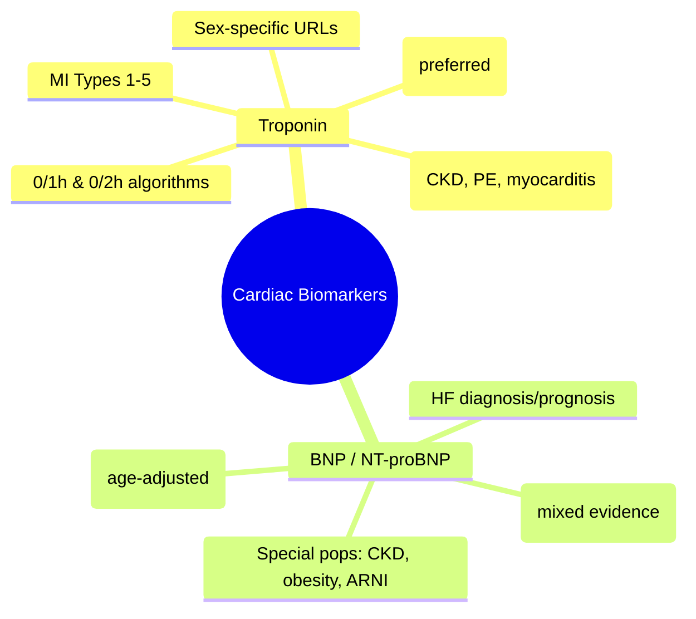

# Cardiac Biomarkers & Troponin Interpretation

Related: [[../Cardiology MOC|Cardiology MOC]] · [[../Davidson Chapter 16 - Cardiology Hierarchy|Cardiology Hierarchy]] · [[../Clinical Assessment, Hemodynamics, and Cardiac Investigations|Clinical Assessment, Hemodynamics, and Cardiac Investigations]] · [[Ischaemic Heart Disease and Acute Coronary Syndromes]] · [[Acute Coronary Syndrome]] · [[Heart Failure]] · [[Cardiorenal syndrome in heart failure]] · [[Renal replacement therapy]]

> [!important]
> Cardiac biomarkers = cornerstone of ACS and HF diagnosis/prognosis. FCPS/MRCP exams test: **troponin kinetics** (hs-troponin 0/1h/2h algorithms), **BNP/NT-proBNP** (diagnostic/prognostic cut-offs), **troponin elevation causes** beyond ACS, and **biomarker-guided therapy**. **hs-Troponin = preferred**; conventional troponin being phased out.

## Learning Objectives
- Interpret **high-sensitivity troponin (hs-cTn)** using 0/1h and 0/2h algorithms
- Apply **diagnostic cut-offs** for hs-troponin (rule-in/rule-out MI)
- Differentiate **Type 1 MI** from **Type 2 MI** and **non-ischemic troponin elevation**
- Apply **BNP/NT-proBNP** for HF diagnosis, prognosis, and-guided therapy
- Interpret biomarkers in special populations: CKD, elderly, obese
- Apply biomarker-guided HF therapy (GUIDE-IT, BACH)

## High-Sensitivity Troponin (hs-cTn)

### Assay Characteristics
| Parameter | hs-cTnI / hs-cTnT |
|-----------|-------------------|
| **Limit of Detection (LoD)** | ~1-5 ng/L |
| **99th Percentile URL** | ~14-20 ng/L (sex-specific) |
| **Precision (CV <10%)** | At 99th percentile |
| **Rapid Rule-out** | 0h + 1h (or 0h + 2h) |

### Sex-Specific 99th Percentile (Example Values)
| Assay | Male | Female |
|-------|------|--------|
| **hs-cTnI** (Abbott) | 28 ng/L | 16 ng/L |
| **hs-cTnT** (Roche) | 22 ng/L | 14 ng/L |

> [!tip]
> **Always use sex-specific cut-offs** — women have lower 99th percentile.

## MI Diagnosis Algorithms (ESC 0/1h & 0/2h)

### 0/1h Algorithm (Preferred for hs-cTn)
| hs-cTn at 0h | hs-cTn at 1h | Delta (Δ) | Interpretation |
|--------------|--------------|-----------|----------------|
| **< LoD** | **< LoD** | — | **Rule-out MI** |
| **< URL** | **< URL** | **Δ < 50%** (or <5-8 ng/L) | **Rule-out MI** |
| **≥ URL** | **≥ URL** | **Δ ≥ 50%** (or ≥5-8 ng/L) | **Rule-in MI** |
| **Other** | | | **Observe** → serial at 2-3h |

> [!tip]
> **0/1h algorithm**: Best for early presenters (<3h). For >3h, 0/2h or single measurement may suffice.

### 0/2h Algorithm (Alternative)
| hs-cTn at 0h | hs-cTn at 2h | Delta (Δ) | Interpretation |
|--------------|--------------|-----------|----------------|
| **< LoD** | **< LoD** | — | **Rule-out MI** |
| **< URL** | **< URL** | **Δ < 20-30%** | **Rule-out MI** |
| **≥ URL** | **≥ URL** | **Δ ≥ 20-30%** | **Rule-in MI** |
| **Other** | | | **Observe** |

### MI Types (Universal Definition 2018)
| Type | Mechanism | Troponin Pattern |
|------|-----------|------------------|
| **Type 1** | Plaque rupture/erosion → thrombosis | Rise/fall + clinical ischemia |
| **Type 2** | Supply-demand mismatch (no plaque rupture) | Rise/fall + clinical ischemia |
| **Type 3** | Cardiac death before biomarker rise | — |
| **Type 4a** | PCI-related | >5× URL (periprocedural) |
| **Type 4b** | Stent thrombosis | Rise/fall + angiographic |
| **Type 5** | CABG-related | >10× URL (periprocedural) |

## Troponin Elevation: Non-ACS Causes (Type 2 MI / Non-Ischaemic)

| Category | Examples |
|----------|----------|
| **Supply-Demand Mismatch** | Tachyarrhythmia, severe anemia, hypotension, hypertensive emergency, severe AS, sepsis |
| **Myocardial Injury** | Myocarditis, Takotsubo, cardiac contusion, ablation, cardioversion, ICD shock |
| **Renal** | **CKD/ESRD** (basal elevation, impaired clearance) — **chronic stable elevation** |
| **Pulmonary** | **Massive PE** (RV strain), severe pulmonary hypertension |
| **Infiltrative** | Amyloid, sarcoid, hemochromatosis |
| **Endocrine** | Thyrotoxicosis, hypothyroidism |
| **Toxic** | Chemo (anthracyclines), cocaine, 5-FU |
| **Post-procedural** | Post-cardioversion, post-ablation, post-PCI (Type 4a) |

> [!warning]
> **CKD**: Baseline hs-cTn often >URL — **serial Δ more important than absolute value**.
> **Massive PE**: RV strain → troponin elevation (Type 2 MI equivalent).

## BNP / NT-proBNP

### Diagnostic Cut-offs (Acute Dyspnea)
| Biomarker | Age <50 | Age 50-75 | Age >75 |
|-----------|---------|-----------|---------|
| **BNP** (pg/mL) | <100 | <100 | <100 |
| **NT-proBNP** (pg/mL) | <300 | <450 | <900 |

> [!tip]
> **NT-proBNP preferred** in obese (BNP falsely low), renal impairment (more stable), and on neprilysin inhibitors (ARNI = sac/val ↑ BNP, NT-proBNP unaffected).

### HF Diagnosis (ESC)
| Clinical Probability | BNP <100 | BNP 100-400 | BNP >400 |
|---------------------|----------|-------------|----------|
| **Low** | Rule-out | Uncertain | Rule-in |
| **High** | Rule-out | Rule-in | Rule-in |

### Prognostic / Guided Therapy
| Biomarker | High-Risk Threshold | Action |
|-----------|--------------------|--------|
| **NT-proBNP** | >5000 pg/mL (acute) | High mortality, consider advanced therapies |
| **NT-proBNP** | >1000 pg/mL (chronic) | Poor prognosis, uptitrate GDMT |
| **BNP** | >250 pg/mL (chronic) | Poor prognosis |
| **Δ NT-proBNP** | ↓ >30% at 3-6mo | Good response to GDMT |

### Biomarker-Guided HF Therapy
| Trial | Strategy | Result |
|-------|----------|--------|
| **GUIDE-IT** | NT-proBNP <1000 target | No mortality benefit vs clinical-guided |
| **BACH** | BNP-guided | Reduced hospitalization |
| **PRIMA** | NT-proBNP-guided | Reduced events |
| **Consensus** | **Not routine**; clinical assessment primary | Use if uncertainty in uptitration |

## Special Populations

### Chronic Kidney Disease
| eGFR | BNP | NT-proBNP | Troponin |
|------|-----|-----------|----------|
| **>60** | Standard | Standard | Standard |
| **30-60** | Slightly ↑ | Moderately ↑ | Mild ↑ |
| **<30** | ↑↑ | ↑↑↑ (use with caution) | **Chronic elevation** — rely on Δ |

> [!tip]
> **NT-proBNP clearance reduced** more than BNP in CKD. **Trend > absolute value**.

### Obesity
- **BNP falsely low** (clearance ↑, production ↓)
- **NT-proBNP more reliable**

### Elderly
- Higher baseline NT-proBNP (age-adjusted cut-offs)
- Frailty, comorbidities affect interpretation

## Red Flags / Exam Traps
- **Troponin elevation ≠ MI** — always integrate with clinical, ECG, serial Δ
- **CKD = chronic elevation** — do NOT diagnose MI on single value
- **Obese + dyspnea** → use NT-proBNP (BNP falsely low)
- **ARNI (sac/val)** → BNP ↑ (neprilysin inhibition), NT-proBNP **unaffected**
- **PE + troponin** = RV strain, not ACS
- **Single hs-troponin <LoD** = rule-out only if >3h from onset

## FCPS/MRCP High-Yield Points
- **hs-cTn 0/1h algorithm**: <LoD at 0&1h = rule-out; ≥URL + Δ≥50% = rule-in
- **Sex-specific URLs** for hs-cTn
- **Type 1 vs Type 2 MI** = plaque rupture vs supply-demand mismatch
- **CKD**: chronic troponin elevation → rely on serial Δ
- **NT-proBNP**: preferred in CKD, obesity, ARNI
- **BNP <100 / NT-proBNP <300** = rule-out acute HF
- **ARNI** → BNP ↑, NT-proBNP unchanged
- **0/1h algorithm** for early presenters; **0/2h** alternative

## Common Viva Questions
1. 0/1h vs 0/2h troponin algorithm differences?
2. How do you interpret troponin in CKD?
3. BNP vs NT-proBNP — when to use which?
4. Type 1 vs Type 2 MI distinction?
5. Effect of ARNI on BNP/NT-proBNP?
5. Acute dyspnea algorithm with BNP?

## Common Confusions / Exam Traps
- Single troponin >URL = MI (NO — need rise/fall + clinical)
- BNP low = no HF (NO — obese, flash pulmonary edema, BNP <100)
- Troponin in PE = ACS (NO — RV strain, Type 2 MI)
- ARNI → BNP ↓ (NO — BNP ↑ due to neprilysin inhibition)

## Mind Map

## One-Page Revision Summary
- **hs-cTn 0/1h**: <LoD at 0&1h = rule-out; ≥URL + Δ≥50% = rule-in
- **Sex-specific 99th %ile** (male > female)
- **MI Types**: 1=plaque rupture, 2=supply-demand, 4a=PCI, 5=CABG
- **Non-ACS trop+**: CKD (chronic), PE (RV strain), myocarditis, tachy, anemia
- **BNP <100 / NT-proBNP <300** = rule-out acute HF
- **NT-proBNP** > BNP in CKD, obesity, ARNI
- **ARNI**: BNP ↑ (neprilysin inhib), NT-proBNP unchanged
- **CKD trop**: chronic elevation → use serial Δ

## 24-Hour Recall Prompts
- Draw 0/1h hs-troponin algorithm
- List MI Types 1-5
- State BNP/NT-proBNP rule-out cut-offs
- Explain Type 1 vs Type 2 MI
- List troponin elevation causes beyond ACS

## 7-Day / 15-Day / 30-Day Revision Tracker
- [ ] Day 1 completed
- [ ] 24-hour recall completed
- [ ] Day 7 revision completed
- [ ] Day 15 revision completed
- [ ] Day 30 revision completed

## Must Know / Should Know / Nice to Know
### Must Know
- hs-cTn 0/1h algorithm (rule-in/out)
- Sex-specific troponin URLs
- MI Types (especially Type 1 vs 2)
- BNP/NT-proBNP rule-out cut-offs
- ARNI effect on BNP vs NT-proBNP

### Should Know
- 0/2h algorithm alternative
- CKD troponin interpretation (Δ > absolute)
- Obesity effect on BNP
- Biomarker-guided therapy trials (GUIDE-IT)

### Nice to Know
- Novel biomarkers (ST2, GDF-15, Galectin-3)
- hs-cTn assay differences (I vs T)
- Troponin in specific conditions (Takotsibu, myocarditis)
- Novel HF biomarkers (ST2, GDF-15)

## Self-Test Scorecard
- Understanding /10
- Recall /10
- Algorithm application /10
- MCQ performance /10
- Viva confidence /10
- **Total /50**

> [!tip]
> **Interpretation**: <35 = weak topic; 35-44 = acceptable but insecure; 45+ = strong exam-ready topic.

## Exam Answer Modes
### Long Answer Skeleton
1. hs-cTn vs conventional troponin
2. 0/1h and 0/2h algorithms with tables
3. MI Types 1-5 with clinical examples
3. Non-ACS troponin elevation causes
4. BNP vs NT-proBNP (cut-offs, special populations)
5. ARNI effect on biomarkers
6. Algorithm for acute dyspnea

### Short Note Skeleton
- hs-cTn: LoD ~1-5, URL sex-specific
- 0/1h: <LoD 0&1h = rule-out; ≥URL + Δ≥50% = rule-in
- MI Types: 1=rupture, 2=demand, 4a=PCI, 5=CABG
- Non-ACS trop: CKD, PE, myocarditis, tachy
- BNP: <100 rule-out; NT-proBNP: <300
- ARNI: BNP↑, NT-proBNP ↔
- CKD trop: chronic, use Δ not absolute

### Viva One-Liners
- "hs-cTn 0/1h: <LoD at 0&1h = rule-out; ≥URL + Δ≥50% = rule-in"
- "Male URL > Female URL for hs-cTn"
- "Type 1 = plaque rupture; Type 2 = supply-demand mismatch"
- "CKD troponin = chronic elevation, use serial Δ"
- "NT-proBNP > BNP in CKD, obesity, ARNI"
- "ARNI → BNP↑ (neprilysin inhib), NT-proBNP ↔"

### Ward-Case Discussion Points
- "55M, CKD stage 4, chest pain, hs-cTn 45 → 48 ng/L (URL 28). MI?" → "Baseline elevated in CKD. Serial Δ: 3 ng/L rise <50% → NOT Type 1 MI. Check for Type 2 / non-ACS cause."
- "70F, obese, dyspnea, BNP 80, NT-proBNP 450. HF?" → "Obese = BNP falsely low. NT-proBNP 450 >300 (age<50) → likely HF. Echo for EF."
- "60M on sac/val, BNP 500, NT-proBNP 800. Worsening?" → "ARNI ↑ BNP. NT-proBNP 800 trend: if stable → stable HF. If rising → decompensation."

### Last-Night-Before-Exam Sheet
- hs-cTn 0/1h: <LoD at 0&1h = rule-out; ≥URL + Δ50% = rule-in
- Male URL ~28 (cTnI), Female ~16
- MI Types: 1=rupture, 2=demand, 4=PCI, 5=CABG
- Non-ACS trop: CKD, PE, myocarditis, tachy, anemia
- BNP <100 / NT-proBNP <300 = rule-out HF
- NT-proBNP in CKD, obesity, ARNI
- ARNI: BNP↑, NT-proBNP ↔

## Summary
**Cardiac biomarkers** are essential for ACS and HF diagnosis. **High-sensitivity troponin (hs-cTn)** is the **preferred assay** with **sex-specific 99th percentile URLs**. **0/1h algorithm**: **rule-out** if <LoD at 0h and 1h; **rule-in** if ≥URL at 0h/1h with **Δ ≥50% (or ≥5-8 ng/L)**. **MI Types**: Type 1 (plaque rupture), Type 2 (supply-demand mismatch), Type 4a/5 (PCI/CABG periprocedural). **Non-ACS troponin elevation**: CKD (chronic elevation, use serial Δ), PE (RV strain), myocarditis, tachyarrhythmia, anemia, sepsis. **BNP/NT-proBNP**: **BNP <100 / NT-proBNP <300 pg/mL = rule-out acute HF** (age-adjusted). **NT-proBNP preferred** in CKD, obesity, ARNI. **ARNI (sac/val)**: BNP ↑ (neprilysin inhibition), **NT-proBNP unaffected**. **CKD**: chronic troponin elevation → serial Δ more reliable than absolute value.

## MCQs (10)
1. hs-cTn 0/1h rule-out criterion:
   A. <URL at 0h only
   B. **<LoD at 0h AND 1h**
   C. Δ <20% at 1h
   D. <URL at 1h only
2. hs-cTn 0/1h rule-in criterion:
   A. ≥URL at 0h only
   B. **≥URL at 0h or 1h + Δ ≥50%**
   C. Δ >20% at 1h
   D. ≥URL at 2h
3. Sex-specific 99th percentile URL for hs-cTn:
   A. Same for men and women
   B. **Male > Female**
   C. Female > Male
   D. Age-dependent, not sex-specific
4. Type 2 MI mechanism:
   A. Plaque rupture with thrombosis
   B. **Supply-demand mismatch (no plaque rupture)**
   C. PCI-related injury
   D. CABG-related injury
5. hs-cTn elevation in CKD (eGFR 20) — interpretation:
   A. Acute MI
   B. **Chronic elevation — rely on serial Δ**
   C. Myocarditis
   D. Demand ischemia
6. BNP rule-out cut-off for acute HF (age <50):
   A. <50 pg/mL
   B. **<100 pg/mL**
   C. <200 pg/mL
   D. <400 pg/mL
7. NT-proBNP rule-out cut-off for acute HF (age 50-75):
   A. <150 pg/mL
   B. <300 pg/mL
   C. **<450 pg/mL**
   D. <900 pg/mL
8. ARNI (sacubitril/valsartan) effect on biomarkers:
   A. ↓ BNP, ↓ NT-proBNP
   B. **↑ BNP, ↔ NT-proBNP**
   C. ↔ BNP, ↑ NT-proBNP
   D. ↓ BNP, ↑ NT-proBNP
9. Troponin in massive PE:
   A. Always negative
   B. **Elevated (RV strain) — Type 2 MI**
   C. Diagnostic of ACS
   D. Unreliable
10. Obese patient with dyspnea — preferred natriuretic peptide:
    A. BNP
    B. **NT-proBNP (BNP falsely low in obesity)**
    C. Both equal
    D. Neither useful

## SBA Questions (10)
1. 55M, chest pain 2h, hs-cTnI 8 ng/L (LoD 2, URL 28), 1h: 10 ng/L. Interpretation:
   A. Rule-in MI
   B. **Rule-out MI (<LoD baseline, Δ<50%)**
   C. Observe, repeat 3h
   D. Type 2 MI
2. 60F, CKD stage 4, chest pain, hs-cTnT 45 (URL 14), 1h: 48. Δ=3. Action:
   A. Diagnose MI
   B. **Serial Δ 3 (<50%) — NOT Type 1 MI; evaluate Type 2/other**
   C. Start heparin
   D. PCI
3. 70M, dyspnea, obese (BMI 38), BNP 80, NT-proBNP 450. HF likelihood:
   A. Ruled out (BNP <100)
   B. **Likely (NT-proBNP >300, BNP falsely low in obesity)**
   C. Uncertain
   D. Ruled out (NT-proBNP <900 for age>75)
4. 65M on sac/val, baseline NT-proBNP 800, now 1200. Action:
   A. Increase diuretic (BNP would be better)
   B. **NT-proBNP rising → decompensation; uptitrate diuretic/GDMT**
   C. Stop sac/val (NT-proBNP rise = toxicity)
   D. No change (sac/val increases NT-proBNP)
5. 50M, massive PE, hs-cTnI 150 (URL 28). Cause:
   A. Type 1 MI
   B. **Type 2 MI (RV strain from PE)**
   C. Myocarditis
   D. Demand ischemia from tachycardia
6. 75F, CKD 4, dyspnea, hs-cTnI 32 (baseline 30), 1h: 31. FeUrea 25%. Management:
   A. PCI
   B. **Not MI (Δ minimal, chronic CKD elevation); treat HF/volume overload**
   C. Heparin + PCI
   D. Thrombolysis
7. 60F on sac/val, HF admission, BNP 600, NT-proBNP 2000 (baseline 800). Interpretation:
   A. Sac/val failing
   B. **NT-proBNP rising → decompensation; uptitrate diuretic**
   C. Stop sac/val
   C. BNP more reliable than NT-proBNP on ARNI
8. 65M, CKD 3b, suspected ACS, hs-cTnI 25 → 35 at 1h (URL 28). FeUrea 40%. Diagnosis:
   A. Type 1 MI
   B. **Type 2 MI (CKD + small Δ <50%)**
   C. Chronic elevation only
   D. Myocarditis
9. Obese patient (BMI 38) with acute dyspnea, BNP 90. Next:
   A. Rule out HF
   B. **Check NT-proBNP**
   C. Echo only
   D. Discharge
10. 45M, sudden dyspnea, chest pain, hs-cTnI 5 → 6 at 1h (URL 28). ECG normal. Diagnosis:
    A. Rule-out MI (0/1h algorithm)
    B. Unstable angina
    C. PERC rule
    D. Observe 6h

## Flashcards
- Q: hs-cTn 0/1h rule-out?
  A: <LoD at 0h AND 1h
- Q: hs-cTn 0/1h rule-in?
  A: ≥URL at 0h or 1h + Δ≥50%
- Q: Sex-specific URL?
  A: Male > Female (cTnI: M 28, F 16; cTnT: M 22, F 14)
- Q: Type 1 vs Type 2 MI?
  A: 1=plaque rupture/thrombosis; 2=supply-demand mismatch
- Q: CKD troponin?
  A: Chronic elevation — use serial Δ, not absolute
- Q: BNP rule-out acute HF?
  A: <100 pg/mL (age<50)
- Q: NT-proBNP rule-out?
  A: <300 (age<50), <450 (50-75), <900 (>75)
- Q: ARNI effect?
  A: BNP↑ (neprilysin inhib), NT-proBNP ↔
- Q: Obese dyspnea?
  A: NT-proBNP (BNP falsely low)
- Q: Massive PE troponin?
  A: Type 2 MI (RV strain)

## Answer Key with Explanations
### MCQs
1. **B** — <LoD at both timepoints = rule-out (negative predictive value >99%).
2. **B** — ≥URL at either timepoint + Δ≥50% = rule-in per ESC 0/1h algorithm.
3. **B** — Male URL consistently higher than female (cTnI: M 28 vs F 16; cTnT: M 22 vs F 14).
4. **B** — Type 2 = supply-demand mismatch (tachycardia, anemia, hypotension, etc.).
5. **B** — CKD = chronic basal elevation; serial Δ (not absolute) guides MI diagnosis.
6. **B** — BNP <100 pg/mL rules out acute HF in patients <50 (age-adjusted thresholds apply).
7. **C** — NT-proBNP age-stratified: <300 (<50), <450 (50-75), <900 (>75).
8. **B** — Neprilysin inhibition by sacubitril ↓ BNP degradation → BNP ↑; NT-proBNP unaffected.
9. **B** — PE → RV strain → troponin release = Type 2 MI (supply-demand mismatch).
10. **B** — Obesity falsely lowers BNP (enhanced clearance); NT-proBNP unaffected.

### SBAs
1. **B** — 8→10 ng/L, both <LoD (LoD=2) → rule-out MI. Δ=2 (<50% of URL).
2. **B** — CKD: baseline elevation. Δ=3 ng/L (<50% of URL 14) → NOT Type 1 MI.
3. **B** — Obesity falsely ↓ BNP; NT-proBNP 450 >300 rule-in threshold for age<75.
4. **B** — NT-proBNP rising on ARNI = true HF decompensation → uptitrate diuretics/GDMT.
5. **B** — PE → RV pressure overload → troponin release = Type 2 MI.
6. **B** — CKD: baseline elevation, Δ=1 (<50%) + FeUrea 25% (pre-renal) → NOT MI. Treat congestion.
7. **B** — ARNI: NT-proBNP is accurate biomarker; rising = decompensation.
8. **B** — CKD + small Δ (<50%) = Type 2 MI / chronic elevation, NOT Type 1.
9. **B** — Obesity ↓ BNP falsely; NT-proBNP needed for accurate assessment.
10. **A** — 5→6 ng/L, both <LoD → rule-out MI per 0/1h algorithm.

---