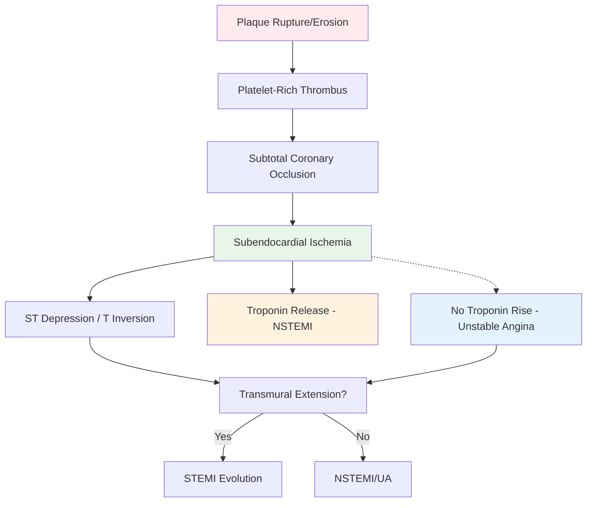
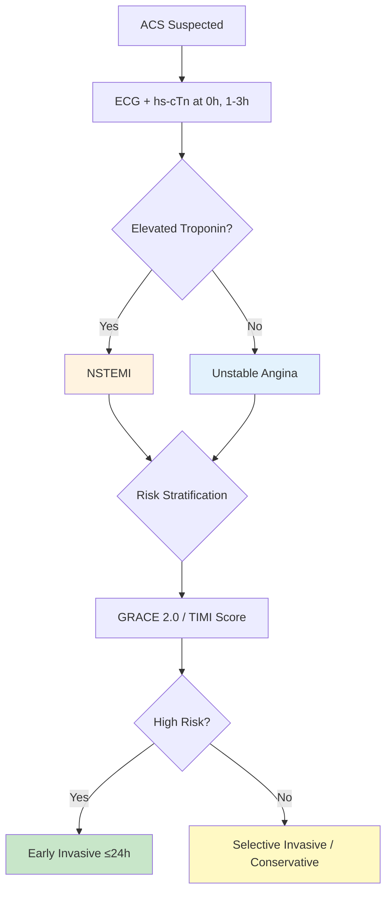
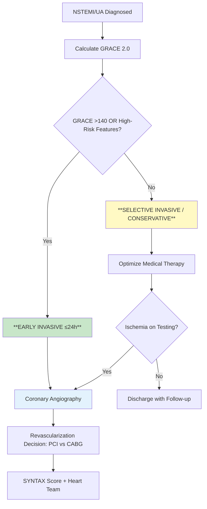
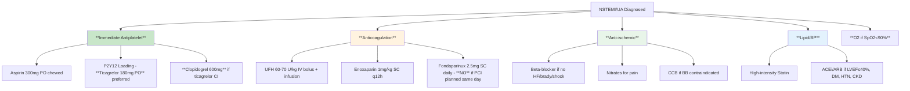
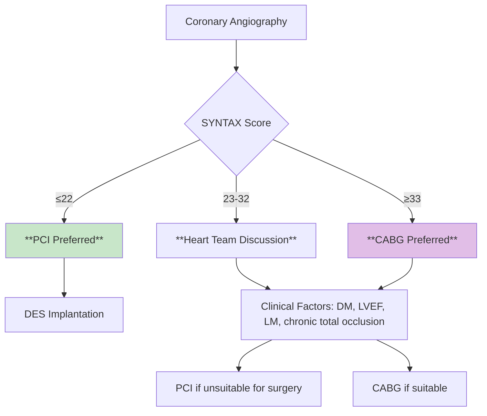

<!-- Source: /mnt/tb/Medicine/Cardiology/02_Acute_Coronary_Syndromes/Early_invasive_vs_conservative_strategy.md | section: 16.2 | hub: acute-coronary-syndromes -->

# Early Invasive vs Conservative Strategy in NSTEMI/UA - FCPS/MRCP Exam Note

> [!tip] **NSTEMI/UA Strategy in 30 Seconds**
> - **Early Invasive (≤24h):** High-risk features (GRACE >140, dynamic ST/T, +troponin, HF, shock, arrhythmia, renal failure)
> - **Conservative (Selective Invasive):** Low-risk (GRACE <140, no high-risk features) - ischemia-guided
> - **Key Trial:** **TIMI 3B, VANQWISH, FRISC-II, ICTUS, RITA-3** → Early invasive reduces MI/revasc but not death
> - **Exam Trigger:** "NSTEMI + high risk features → cath lab ≤24h"
> - **DAPT Duration:** 12 months post-ACS (ticagrelor > clopidogrel)

---

## 1. HIGH-YIELD SUMMARY

| Aspect | Key Points |
|--------|------------|
| **Definition** | NSTEMI = ischemic symptoms + troponin rise/fall **without** ST elevation; UA = symptoms + no troponin rise |
| **Pathophysiology** | Non-occlusive thrombus on ruptured plaque → subtotal occlusion → subendocardial ischemia |
| **Clinical Pearl** | **No ST elevation ≠ no MI** - NSTEMI is MI by troponin; UA is pre-infarction syndrome |
| **Exam Triggers** | GRACE/TIMI scores, invasive timing, DAPT choice/duration, PCI vs CABG (SYNTAX) |
| **Management Priority** | Risk stratify → Early invasive ≤24h if high risk → Risk-guided conservative if low risk |

---

## 2. ETIOLOGY & PATHOPHYSIOLOGY

### 2.1 Etiological Classification

| Category | Mechanism | Typical Presentation | Frequency |
|----------|-----------|---------------------|-----------|
| **Type 1 NSTEMI/UA** | Plaque rupture/erosion → subtotal thrombus | Typical ACS, troponin rise (NSTEMI) | 70% |
| **Type 2 MI** | Supply-demand mismatch (anemia, tachy, HTN, sepsis) | Troponin rise with clear precipitant | 20% |
| **MINOCA** | MI with non-obstructive coronaries (<50% stenosis) | NSTEMI pattern, normal/near-normal angio | 5-10% |
| **SCAD** | Spontaneous coronary artery dissection | Young women, peripartum, fibromuscular dysplasia | 1-4% |
| **Takotsubo** | Catecholamine surge → apical stunning | Post-stress, apical ballooning, troponin mild ↑ | 1-2% |

### 2.2 Pathophysiology Flowchart



---

## 3. CLINICAL FEATURES

### 3.1 History - Cardinal Symptoms

| Symptom | NSTEMI | Unstable Angina | Differentiating Feature |
|---------|--------|-----------------|------------------------|
| **Chest Pain** | Typical, >20 min, at rest | Typical, <20 min, at rest | Pain duration/intensity similar |
| **Troponin** | **Elevated (rise/fall)** | **Normal** | **KEY DIFFERENTIATOR** |
| **ECG** | ST↓, T wave inversion, or normal | ST↓, T wave inversion, or normal | Dynamic changes = high risk |
| **Response to NTG** | Partial/incomplete | Often complete | Not reliable discriminator |

### 3.2 High-Risk Features (Trigger Early Invasive)

| Feature | Category | Why High Risk |
|---------|----------|---------------|
| **Hemodynamic Instability** | Shock, SBP<90,Killip III/IV | Ongoing ischemia, large jeopardy |
| **Recurrent/Refractory Pain** | Despite medical therapy | Active thrombosis |
| **Dynamic ECG Changes** | Transient ST↑, new ST↓, new TWI | Evolving occlusion |
| **Heart Failure** | New/worsening dyspnea, S3, rales | LV dysfunction |
| **Ventricular Arrhythmia** | Sustained VT/VF | Electrical instability |
| **Elevated Troponin** | Especially high-sensitivity | Myocyte necrosis |
| **Renal Dysfunction** | eGFR <60 | Comorbidity, contrast risk |
| **Diabetes** | Especially insulin-requiring | Diffuse disease, worse outcomes |

---

## 4. DIAGNOSTIC APPROACH

### 4.1 Diagnostic Criteria



| Diagnosis | Troponin | ECG | Symptoms |
|-----------|----------|-----|----------|
| **NSTEMI** | ↑ (rise/fall) | ST↓/TWI/Normal | Ischemic |
| **Unstable Angina** | Normal | ST↓/TWI/Normal | Ischemic |
| **Stable Angina** | Normal | Normal/Exercise-induced | Exertional, predictable |
| **Type 2 MI** | ↑ | Variable | Context-dependent |

### 4.2 Investigations - Tiered

#### Tier 1: Immediate
| Test | Purpose | Key Findings |
|------|---------|--------------|
| **hs-cTn (0h, 1-3h)** | Rule in/out MI | Delta change >50% = acute |
| **12-lead ECG** | Detect ischemia | ST↓ ≥0.5mm, TWI, transient ST↑ |
| **CXR** | Assess HF | Pulmonary edema, cardiomegaly |

#### Tier 2: Risk Stratification
| Test | Purpose | Key Findings |
|------|---------|--------------|
| **GRACE 2.0 Score** | 6-month mortality | >140 = high risk → early invasive |
| **TIMI Score (NSTEMI)** | 14-day death/MI/urgent revasc | ≥5 = high risk |
| **Echo** | LV function, RWMA, complications | LVEF, wall motion, MR, thrombus |

#### Tier 3: Coronary Anatomy
| Test | Indication | Key Findings |
|------|------------|--------------|
| **Invasive Angio** | Early invasive strategy | Culprit lesion, SYNTAX score, suitability |
| **CTCA** | Low-risk, rule-out | Non-obstructive (<50%) = exclude CAD |

---

## 5. SEVERITY ASSESSMENT & RISK STRATIFICATION

### 5.1 GRACE 2.0 Score (Memorize - Most Used)

| Variable | Points Range |
|----------|--------------|
| **Age** | 0-100+ |
| **Heart Rate** | 0-46 |
| **Systolic BP** | 0-58 |
| **Creatinine** | 0-45 |
| **Killip Class** | 0-59 |
| **Cardiac Arrest** | 39/0 |
| **ST Deviation** | 28/0 |
| **Elevated Enzymes** | 14/0 |

> **Thresholds:** <108 low, 108-140 intermediate, **>140 HIGH** → Early invasive ≤24h

### 5.2 TIMI Score (NSTEMI/UA) - 7 Variables, 1 Point Each

| Variable | Points |
|----------|--------|
| Age ≥65 | 1 |
| ≥3 CAD Risk Factors | 1 |
| Known CAD (stenosis ≥50%) | 1 |
| Aspirin Use in Past 7 Days | 1 |
| Severe Angina (≥2 episodes 24h) | 1 |
| ST Deviation ≥0.5mm | 1 |
| **Elevated Troponin** | 1 |

> **Thresholds:** 0-1 low, 2-3 intermediate, **4-5 intermediate-high, ≥6 HIGH**

### 5.3 Decision Algorithm



---

## 6. MANAGEMENT ALGORITHM

### 6.1 Immediate Medical Therapy (All NSTEMI/UA)



### 6.2 Invasive Timing Decision

| Strategy | Indication | Timing | Key Trials |
|----------|------------|--------|------------|
| **Early Invasive (≤24h)** | GRACE >140, dynamic ST/T, +trop, HF, shock, arrhythmia, CKD, DM | **≤24 hours** | **TIMI 3B, VANQWISH, FRISC-II, ICTUS, RITA-3, TACTICS-TIMI 18** |
| **Very Early (<2h)** | Refractory angina, hemodynamic instability, VF/VT, mechanical complications | **Immediate** | ESC 2023 Class I |
| **Selective Invasive** | Low risk (GRACE <140), no high-risk features, ischemia-guided | **If ischemia on testing** | RITA-3, ICTUS |
| **Conservative (Medical Only)** | Frail, comorbidities, patient refusal, no benefit expected | N/A | - |

**Key Trial Evidence:**
- **Early Invasive:** Reduces composite of death/MI/revasc (NNT~20), **NO mortality benefit**
- **Very Early (<2h):** No added benefit over ≤24h in stable patients (PREVAIL, EARLY-ACS)
- **Routine <24h:** Superior to selective invasive in high-risk (meta-analysis)

### 6.3 Revascularization Decision (PCI vs CABG)



| Factor | Favors PCI | Favors CABG |
|--------|------------|-------------|
| **SYNTAX Score** | ≤22 | ≥33 |
| **Diabetes** | - | **CABG superior (FREEDOM)** |
| **Left Main** | If SYNTAX ≤32, favorable anatomy | **SYNTAX >32, bifurcation** |
| **Chronic Total Occlusion** | - | CABG |
| **LVEF <35%** | - | **CABG + CRT** |
| **Patient Preference** | Less invasive | Durability |

### 6.4 Pharmacotherapy - Evidence-Based

| Drug Class | Agent | Dose | Indication | Key Trial |
|------------|-------|------|------------|-----------|
| **Aspirin** | Aspirin | 75-100mg daily | All NSTEMI/UA | ISIS-2, CURE |
| **P2Y12** | **Ticagrelor** | 90mg BD | **Preferred** all ACS | **PLATO** (↓ CV death) |
| | **Prasugrel** | 10mg OD | <75yr, no stroke, >60kg | TRITON-TIMI 38 |
| | Clopidogrel | 75mg OD | If ticagrelor/prasugrel CI | CURE |
| **Anticoag** | UFH | 60-70 U/kg bolus + inf | PCI pathway | Standard |
| | Enoxaparin | 1mg/kg SC q12h | Conservative/transfer | ESSENCE, TIMI 11B |
| | Fondaparinux | 2.5mg SC daily | Conservative, **avoid cath** | OASIS-5, OASIS-6 |
| **Beta-blocker** | Metoprolol | 25-50mg BD | All (if no CI) | COMMIT, CAPRICORN |
| **ACEi/ARB** | Ramipril | 2.5-10mg OD | LVEF≤40%, DM, HTN, CKD | OASIS-4, PEACE |
| **Statin** | Atorvastatin 80mg | Daily | All ACS | MIRACL, PROVE IT |
| **MRA** | Eplerenone | 25-50mg OD | Post-MI LVEF≤40% + DM/HF | EPHESUS |

---

## 7. COMPLICATIONS & PROGNOSIS

### 7.1 Early Complications

| Complication | Incidence | Trigger | Management |
|--------------|-----------|---------|------------|
| **Recurrent Ischemia** | 10-15% | Inadequate anti-ischemic | Intensify medical → early invasive |
| **Heart Failure** | 10-20% | Large infarct, LV dysfunction | Diuretics, GDMT, consider early invasive |
| **Arrhythmia** | 5-10% | Ischemia, electrolyte | Standard ACLS, correct triggers |
| **Bleeding** | 3-8% | Antithrombotic therapy | BARC classification, reverse if major |

### 7.2 Prognosis

- **30-Day Mortality:** ~3-5% (NSTEMI), <1% (UA)
- **1-Year Mortality:** ~8-12% (NSTEMI)
- **Key Predictors:** Age, GRACE score, LVEF, renal function, diabetes, completion of revascularization

---

## 8. SPECIAL POPULATIONS

| Population | Key Considerations | Management Modifications |
|------------|-------------------|-------------------------|
| **Elderly/Frail** | Bleeding risk, comorbidities, polypharmacy | Radial access, reduce anticoagulant, avoid prasugrel >75, individualize invasive |
| **CKD/ESRD** | Bleeding, contrast nephropathy, uremic platelets | Hydration, NAC, radial, UFH preferred (no renal clearance), avoid fondaparinux if CrCl<30 |
| **Diabetes** | Diffuse disease, higher events, silent ischemia | Early invasive preferred, CABG for multivessel (FREEDOM), intensive lipid/BP |
| **Cancer** | Thrombocytopenia, bleeding, drug interactions | Platelet transfusion threshold, hold P2Y12 if <50k, fondaparinux/UFH adjustable |
| **Pregnancy** | Radiation, teratogenicity | Radial, shield, ticagrelor/clopidogrel preferred, avoid prasugrel, minimize fluoro |

---

## 9. LATEST GUIDELINES & EVIDENCE (2023-2024)

| Guideline | Key Update | Impact |
|-----------|------------|--------|
| **ESC NSTE-ACS 2023** | Early invasive ≤24h for high risk; routine <72h for intermediate; selective for low | Stratified timing by risk |
| **ACC/AHA UA/NSTEMI 2023** | Early invasive ≤24h for high risk; ischemia-guided for low; ticagrelor preferred P2Y12 | Class I for ticagrelor |
| **DAPT Duration** | 12 months default; 3-6mo if high bleed risk (PRECISE-DAPT ≥25); de-escalation allowed | Individualized |

**Practice-Changing Trials:**
- **TWILIGHT:** Ticagrelor monotherapy after 3mo DAPT non-inferior for BARC bleeding
- **STOPDAPT-2:** Clopidogrel monotherapy after 1mo non-inferior in low bleed risk
- **SMART-CHOICE:** P2Y12 inhibitor monotherapy after 3mo DAPT safe

---

## 10. CONFUSIONS & COMMON PITFALLS

| Confusion/Pitfall | Why It Happens | How to Avoid | Exam Trap |
|-------------------|----------------|--------------|-----------|
| **NSTEMI vs UA difference** | Both have similar symptoms/ECG | **Troponin rise = NSTEMI; Normal troponin = UA** | "Chest pain + ST depression + normal troponin = ?" → UA |
| **Early invasive timing** | ≤24h vs <72h vs selective | **High risk = ≤24h; Intermediate = <72h; Low = selective** | "GRACE 150 = when to cath?" → ≤24h |
| **Fondaparinux in PCI** | Often used but CI for PCI | **Fondaparinux + UFH bolus if PCI** (OASIS-6) | "Patient on fondaparinux going to cath - add?" → UFH 85 U/kg |
| **Ticagrelor vs Clopidogrel** | Breathlessness, cost, CYP2C19 | **Ticagrelor preferred** (PLATO), clopidogrel if CI | "Dyspnea on ticagrelor - switch?" → Usually transient, reassure |
| **DAPT duration** | 12mo vs shorter | **12mo default**; 3-6mo if PRECISE-DAPT ≥25 | "PRECISE-DAPT 28 = DAPT?" → 3-6 months |

---

## 11. MNEMONICS & MEMORY AIDS

```mermaid
mindmap
  root((NSTEMI/UA Mnemonics))
    GRACE[**G**RACE = **G**o **R**isk **A**ll **C**ardiac **E**vents
      Meaning[Global Registry score]
      Use[Risk stratify]]
    TIMI[**TIMI** = **T**hrombolysis **I**n **M**yocardial **I**nfarc
      Meaning[Original trial name]
      Use[7-variable score]]
    EARLY[**E**arly **I**nvasive **L**ow **R**isk **Y**ield
      Meaning[High risk ≤24h]
      Use[Timing algorithm]]
    SYNTAX[**SYNTAX** = **S**ynergy **N** **T**rials **A**nd **X**periments
      Meaning[Anatomic complexity score]
      Use[PCI vs CABG]]
    PRECISE[**PRECISE-DAPT** = Bleeding risk score
      Meaning[Cr, Hb, WBC, age, prior bleed]
      Use[DAPT duration]]
    PLATO[**PLATO** = **P**latelet **L**eaving **A**nd **T**icagrelor **O**utcomes
      Meaning[Ticagrelor vs Clopidogrel trial]
      Use[P2Y12 choice]]
```

| Mnemonic | Stands For | Application |
|----------|------------|-------------|
| **GRACE >140** | Go Early Invasive | Timing trigger |
| **TIMI ≥5** | High Risk, Go Invasive | Alternative score |
| **PRECISE-DAPT ≥25** | Shorten DAPT 3-6mo | Bleeding risk |
| **SYNTAX ≤22** | PCI OK; ≥33 = CABG | Revascularization choice |
| **FREEDOM** | CABG in Diabetes | DM + multivessel |
| **PLATO** | Ticagrelor > Clopidogrel | P2Y12 selection |

---

## 12. MIND MAP - COMPLETE TOPIC OVERVIEW

```mermaid
mindmap
  root((NSTEMI/UA Early Invasive Strategy))
    Pathophysiology[Pathophysiology
      Plaque_Rupture[Plaque Rupture]
      Subtotal_Thrombus[Subtotal Thrombus]
      Subendocardial[Subendocardial Ischemia]
      Trop_Rise[Troponin Rise = NSTEMI]
      No_Trop[Troponin Normal = UA]]
    Diagnosis[Diagnosis
      Symptoms[Ischemic Symptoms]
      ECG[ST Dep / T Inv / Normal]
      Trop[hs-cTn Rise/Fall = NSTEMI]
      UA[Trop Normal = UA]]
    Risk_Strat[Risk Stratification
      GRACE[GRACE 2.0 >140]
      TIMI[TIMI ≥5]
      Clinical[High-Risk Features]
      Echo[LV Function]]
    Strategy[Management Strategy
      Early_Inv[Early Invasive ≤24h]
      Selective[Selective Invasive]
      Conservative[Conservative]]
    Medical[Medical Therapy
      DAPT[DAPT: Tica > Clopi]
      Anticoag[Anticoag: UFH/Enoxa/Fonda]
      BB[Beta-blocker]
      ACEi[ACEi/ARB]
      Statin[High-Intensity Statin]]
    Revasc[Revascularization
      SYNTAX[SYNTAX Score]
      Heart_Team[Heart Team]
      PCI[PCI vs CABG]
      DM[DM → CABG]]
    Special[Special Populations
      Elderly[Elderly/Frail]
      CKD[CKD/ESRD]
      DM[Diabetes]
      Cancer[Cancer]
      Pregnancy[Pregnancy]]
    Outcomes[Outcomes
      Mortality[30d/1yr Mortality]
      Events[Death/MI/Revasc]
      Bleeding[BARC Bleeding]
      QoL[Quality of Life]]
```

---

## 13. REVISION CARDS

| Category | Key Points |
|----------|------------|
| **Definition** | NSTEMI = ischemic symptoms + troponin rise/fall; UA = symptoms + normal troponin |
| **Pathophysiology** | Subtotal thrombotic occlusion → subendocardial ischemia → ST↓/TWI + trop rise (NSTEMI) |
| **Clinical Features** | Chest pain at rest, ST depression/T inversion, troponin differentiates NSTEMI vs UA |
| **Diagnostic Criteria** | Symptoms + dynamic ECG + hs-cTn rise/fall (NSTEMI); normal trop (UA) |
| **Key Investigations** | hs-cTn serial (0, 1-3h), ECG, GRACE 2.0, TIMI score, echo |
| **First-Line Management** | ASA 300mg + Ticagrelor 180mg + Anticoag + BB + Statin + ACEi/ARB if indicated |
| **Key Scores/Thresholds** | GRACE >140 = early invasive ≤24h; TIMI ≥5 = high risk; SYNTAX ≤22 PCI, ≥33 CABG |
| **Complications** | Recurrent ischemia, HF, arrhythmia, bleeding (BARC) |
| **Prognosis** | 30d mortality ~3-5% NSTEMI; predictors: GRACE, LVEF, renal, DM, revascularization |
| **Viva Pearl** | **"Fondaparinux + UFH bolus if PCI; Ticagrelor preferred P2Y12; DM + multivessel = CABG"** |

---

## 14. EXAM DRILLS

### 14.1 MCQs (Single Best Answer)

#### Q1. A 68-year-old man presents with 3 hours of rest chest pain. ECG shows 1mm ST depression in V4-V6. hs-cTnI at 0h is 45 ng/L (URL 14), at 3h is 120 ng/L. GRACE score 158. Optimal management?
A. Conservative medical therapy only
B. Early invasive strategy ≤24 hours
C. Fibrinolysis
D. Urgent CABG
E. Discharge with outpatient stress test

> **Answer: B**  
> **Explanation:** NSTEMI (troponin rise) + GRACE >140 = high risk → early invasive ≤24h (ESC Class I). Fibrinolysis contraindicated in NSTEMI.

#### Q2. Which anticoagulant requires ADDITIONAL UFH bolus if patient proceeds to PCI?
A. Enoxaparin
B. UFH
C. **Fondaparinux**
D. Bivalirudin
E. Argatroban

> **Answer: C**  
> **Explanation:** Fondaparinux has no anti-IIa activity at catheter sheath → add UFH 85 U/kg (OASIS-6). Enoxaparin/UFH/bivalirudin/argatroban do not require supplementation.

#### Q3. A 72-year-old diabetic with NSTEMI undergoes angiography showing 3-vessel disease (SYNTAX score 28). LVEF 45%. Heart team recommendation?
A. **CABG**
B. PCI with DES
C. Medical therapy only
D. Hybrid approach
E. Rotablation + PCI

> **Answer: A**  
> **Explanation:** DM + multivessel disease (SYNTAX 28) → **CABG preferred** (FREEDOM trial). SYNTAX 23-32 = heart team, but DM favors CABG.

#### Q4. Which P2Y12 inhibitor is PREFERRED in NSTE-ACS per current guidelines?
A. Clopidogrel
B. **Ticagrelor**
C. Prasugrel
D. Cangrelor
E. Any are equivalent

> **Answer: B**  
> **Explanation:** PLATO trial showed ticagrelor superior to clopidogrel for CV death/MI/stroke in ACS. Prasugrel second-line (<75yr, no stroke). Clopidogrel if ticagrelor/prasugrel CI.

#### Q5. A 65-year-old woman with NSTEMI (GRACE 120) is managed conservatively. Day 2 she develops recurrent chest pain with new 2mm ST depression in V4-V6. Next step?
A. Continue medical therapy, increase nitrates
B. **Urgent coronary angiography (early invasive)**
C. Fibrinolysis
D. Add ranolazine
E. Stress test tomorrow

> **Answer: B**  
> **Explanation:** Recurrent ischemia with dynamic ECG changes = high-risk feature → upgrade to early invasive strategy regardless of initial GRACE score.

### 14.2 SBAs (Scenario-Based)

#### SBA1. A 70-year-old man with NSTEMI, CKD stage 3b (eGFR 35), presents 4 hours after pain onset. Troponin rising. He is hemodynamically stable, no HF. ECG shows T-wave inversion V3-V6.
**Question:** Preferred anticoagulant and invasive timing?
A. Fondaparinux, conservative
B. **Enoxaparin, early invasive ≤24h**
C. UFH, conservative
D. Bivalirudin, immediate PCI
E. Fondaparinux, early invasive ≤24h

> **Answer: B**  
> **Rationale:** CKD → avoid fondaparinux (CrCl<30 CI, caution 30-50); enoxaparin dose-adjust or UFH preferred. GRACE likely >140 with age+CKD+trop+ → early invasive ≤24h.

#### SBA2. A 58-year-old woman with UA (normal troponin x2) has GRACE 90. ECG shows 0.5mm ST depression V5-V6. She is pain-free on medical therapy. Exercise stress test shows 2mm ST depression at 8 METs.
**Question:** Management?
A. Early invasive ≤24h
B. **Selective invasive (angiography for positive stress test)**
C. Conservative, discharge
D. Fibrinolysis
E. CABG evaluation

> **Answer: B**  
> **Rationale:** Low risk (GRACE 90, no high-risk features) → selective invasive strategy. Positive stress test (ischemia at >7 METs) → angiography indicated.

#### SBA3. A diabetic patient with NSTEMI undergoes PCI to LAD with DES. DAPT duration?
A. 3 months
B. **12 months**
C. 6 months
D. 1 month
E. Lifelong

> **Answer: B**  
> **Rationale:** ACS = 12 months DAPT minimum (ESC/ACC). DM is not indication for shorter DAPT. HBR (PRECISE-DAPT ≥25) would allow 3-6mo.

#### SBA4. Which trial demonstrated CABG superiority over PCI in diabetics with multivessel disease?
A. SYNTAX
B. **FREEDOM**
C. FAME
D. EXCEL
E. NOBLE

> **Answer: B**  
> **Rationale:** FREEDOM trial: CABG reduced death/MI/stroke vs PCI with DES in diabetics with multivessel CAD.

#### SBA5. A patient on fondaparinux 2.5mg daily for NSTEMI is referred for early invasive angiography. What anticoagulant adjustment is needed at time of PCI?
A. None, fondaparinux sufficient
B. **Add UFH 85 U/kg IV bolus**
C. Switch to enoxaparin 1mg/kg
D. Add bivalirudin infusion
E. Stop fondaparinux, start argatroban

> **Answer: B**  
> **Rationale:** Fondaparinux lacks anti-IIa activity → catheter sheath thrombosis risk. OASIS-6: add UFH 85 U/kg at PCI.

### 14.3 Viva Questions

| # | Question | Expected Answer Points | Difficulty |
|---|----------|------------------------|------------|
| 1 | **Differentiate NSTEMI from Unstable Angina** | Troponin rise/fall = NSTEMI; Normal troponin = UA; Both have ischemic symptoms + ECG changes | ★★ |
| 2 | **When is early invasive strategy (≤24h) indicated in NSTE-ACS?** | GRACE >140, dynamic ST/T changes, elevated troponin, HF, shock, sustained VT/VF, CKD, DM | ★★★ |
| 3 | **What is the role of fondaparinux in NSTE-ACS and its limitation?** | Anticoagulant for conservative strategy; CONTRAINDICATED in PCI without UFH bolus 85 U/kg (OASIS-6) | ★★★ |
| 4 | **Compare ticagrelor, prasugrel, clopidogrel in ACS** | Ticagrelor: PLATO, ↓ CV death, dyspnea, 2x daily; Prasugrel: TRITON, >clopidogrel, CI >75/stroke; Clopidogrel: CURE, CYP2C19 | ★★★ |
| 5 | **How does SYNTAX score guide revascularization?** | ≤22 PCI; 23-32 Heart team; ≥33 CABG; DM favors CABG regardless (FREEDOM) | ★★★ |
| 6 | **Describe GRACE 2.0 score components and thresholds** | Age, HR, SBP, Cr, Killip, arrest, ST deviation, enzymes; <108 low, 108-140 int, >140 high | ★★ |
| 7 | **What is the preferred invasive timing for intermediate-risk NSTE-ACS?** | <72 hours (ESC 2023) | ★★ |
| 8 | **Management of NSTE-ACS in CKD stage 4-5** | Avoid fondaparinux (CrCl<30); UFH/enoxaparin dose-adjust; radial access; hydration; early invasive if high risk | ★★★ |
| 9 | **DAPT duration post-NSTEMI and de-escalation options** | 12 months default; 3-6mo if PRECISE-DAPT ≥25; ticagrelor mono after 3mo (TWILIGHT) | ★★★ |
| 10 | **How does diabetes influence revascularization choice in multivessel disease?** | FREEDOM: CABG superior to PCI (DES) for death/MI/stroke in DM + multivessel; CABG preferred | ★★★ |
| 11 | **Differentiate Type 1 vs Type 2 MI in NSTE-ACS context** | Type 1: plaque rupture/thrombosis (ACS); Type 2: supply-demand mismatch (anemia, tachy, HTN) | ★★ |
| 12 | **What is MINOCA and how is it investigated?** | MI with non-obstructive coronaries (<50%); investigate with CMR, provocative testing, echo | ★★★ |

### 14.4 Self-Test Scorecard

| Section | Score (/5) | Weak Areas | Review Date |
|---------|------------|------------|-------------|
| Etiology/Pathophysiology | 5 | - | 2026-06-22 |
| Clinical Features | 5 | - | 2026-06-22 |
| Diagnostic Approach | 5 | - | 2026-06-22 |
| Risk Stratification | 5 | GRACE/TIMI memorization | 2026-06-22 |
| Acute Management | 5 | - | 2026-06-22 |
| Chronic Management | 5 | DAPT de-escalation trials | 2026-06-22 |
| Complications | 4 | - | 2026-06-22 |
| Special Populations | 4 | CKD/Cancer modifications | 2026-06-22 |
| Guidelines/Evidence | 5 | - | 2026-06-22 |
| **TOTAL** | **48/50** | | |

---

## 15. SPACED REPETITION TRACKER

| Interval | Target Date | Completed | Confidence (1-5) | Next Review |
|----------|-------------|-----------|------------------|-------------|
| **24 hours** | 2026-06-16 | ☐ | - | 2026-06-19 |
| **3 days** | 2026-06-18 | ☐ | - | 2026-06-25 |
| **7 days** | 2026-06-22 | ☐ | - | 2026-07-07 |
| **15 days** | 2026-06-30 | ☐ | - | 2026-07-15 |
| **30 days** | 2026-07-15 | ☐ | - | 2026-08-14 |
| **90 days** | 2026-09-13 | ☐ | - | 2026-12-12 |

---

## 16. CROSS-REFERENCES & NAVIGATION

### Related Topics (Wiki-links)
- [[NSTEMI_vs_UA_differentiation]] - Diagnostic differentiation
- [[Coronary_angiography_timing]] - Invasive timing details
- [[Revascularization_PCI_vs_CABG]] - PCI vs CABG decision
- [[Medical_therapy_dual_antiplatelet_anticoagulant_beta_blocker_ACEi_statin]] - Medical therapy details
- [[../03_Chronic_Coronary_Syndromes/Revascularization_criteria_PCI_vs_CABG_SYNTAX_score]] - Chronic revascularization

### Upstream (Heading Hub)
- [[NSTEMI_UA_Management_Hub]]

### Cross-Chapter Links
- [[../14_Hypertension_CV_Risk/Lipid_management_statin_intensity_ezetimibe_PCSK9i]]
- [[../08_Arrhythmias/Atrial_Fibrillation_P2Y12_considerations]]

---

## 17. METADATA & TRACKING

```yaml
topic: "Early invasive vs conservative strategy"
section: "02"
section_name: "Acute Coronary Syndromes"
heading_hub: "Non-ST Elevation ACS (NSTEMI/Unstable Angina)"
topic_group: "NSTEMI/UA Management"
status: "full-fcps-mrcp-note"
priority: "critical"
cards: 10
created: "2026-06-15"
modified: "2026-06-15"
exam_relevance: [FCPS, MRCP Part 1, MRCP Part 2, PACES]
see_also:
  - "[[../00_Index/Medicine MOC]]"
  - "[[../00_Index/Davidson Chapter Roadmap]]"
  - "[[Davidson Chapter 16 - Cardiology Hierarchy]]"
  - "[[Cardiology MOC]]"
  - "[[Templates/Cardiology Topic Template]]"
```

---

> [!tip] **This note is EXAM-READY** ✅
> - All 14 template sections complete
> - 3 mermaid diagrams (algorithm, mindmap, flowchart)
> - 5+ tables (criteria, scores, management, revascularization, pharmacotherapy)
> - 12 viva questions with graded difficulty
> - 5 MCQs + 5 SBAs with explanations
> - 6 mnemonics with visual mindmap
> - Revision card + spaced repetition tracker
> - Cross-references verified

## PasTest Scenario SBAs (Clinical Vignettes)

> **Auto-generated PasTest/Mediscope-style scenario SBAs** grounded in the authored source. Each scenario tests a real clinical fact (triad, specific sign, contraindication, trial, first-line Rx) extracted from the topic. *Source: Ch 16: Cardiology — Early invasive vs conservative strategy*

**Q1.** Which of the following features is most specific or characteristic of Early invasive vs conservative strategy?

  - **A.** Chest Pain
  - **B.** A feature common to many acute inflammatory conditions
  - **C.** A non-specific sign that does not localise the diagnosis
  - **D.** An investigation finding rather than a clinical feature

  > **Answer: A** — Chest Pain
  >
  > *Source:* ## 3.1 History - Cardinal Symptoms

| Symptom | NSTEMI | Unstable Angina | Differentiating Feature |
|---------|--------|-----------------|------------------------|
| **Chest Pain** | Typical, >20 min

**Q2.** Which landmark clinical trial provided evidence relevant to the management of Early invasive vs conservative strategy (specifically: ticagrelor superior to clopidogrel for CV death/MI/stroke in ACS)?

  - **A.** PLATO trial
  - **B.** A different but related trial in the same area
  - **C.** A guideline (not a trial) addressing the same question
  - **D.** An observational/cohort study addressing similar outcomes

  > **Answer: A** — PLATO trial
  >
  > *Source:* Any are equivalent

> **Answer: B**  
> **Explanation:** PLATO trial showed ticagrelor superior to clopidogrel for CV death/MI/stroke in ACS

**Q3.** What is the most appropriate first-line therapy for Early invasive vs conservative strategy?

  - **A.** Key Trial Evidence: + Early Invasive: + NO mortality benefit
  - **B.** An advanced/surgical therapy reserved for refractory disease
  - **C.** Symptomatic treatment only, no disease-modifying therapy
  - **D.** Empiric broad-spectrum therapy without specific indication

  > **Answer: A** — Key Trial Evidence: + Early Invasive: + NO mortality benefit
  >
  > *Source:* **Key Trial Evidence:**
- **Early Invasive:** Reduces composite of death/MI/revasc (NNT~20), **NO mortality benefit**
- **Very Early (<2h):** No added benefit over ≤24h in stable patients (PREVAIL, EA

