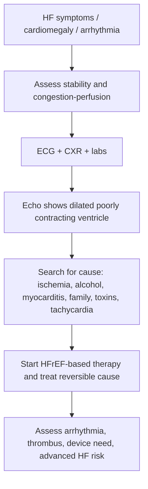

# Dilated cardiomyopathy

Related: [[../Cardiology MOC|Cardiology MOC]] · [[../Davidson Chapter 16 - Cardiology Hierarchy|Cardiology Hierarchy]] · [[../Cardiomyopathies and Myocardial Disease|Cardiomyopathies and Myocardial Disease]] · [[Primary cardiomyopathies]] · [[../../Cardiomyopathy|Cardiomyopathy]] · [[../../Heart Failure|Heart Failure]] · [[../../Shock and Hemodynamic Profiles|Shock and Hemodynamic Profiles]] · [[../Clinical Assessment, Hemodynamics, and Cardiac Investigations/ECG approach|ECG approach]]

> [!important]
> Dilated cardiomyopathy (DCM) is a high-yield FCPS/MRCP cause of HFrEF, arrhythmia, and thromboembolism. The exam core is to recognize a dilated poorly contracting ventricle, think of ischemic vs non-ischemic causes, identify reversible etiologies such as alcohol or myocarditis, and manage as systolic heart failure while watching for sudden death, emboli, and cardiogenic shock.

## Learning Objectives
- Define DCM and distinguish it from other cardiomyopathies.
- Explain structural and physiological consequences of ventricular dilatation.
- Recognize common causes, including familial and reversible contributors.
- Use ECG, CXR, echo, and cause-directed workup logically.
- Manage DCM as a heart-failure/arrhythmia-risk syndrome with complication awareness.

## Definition
Dilated cardiomyopathy is a myocardial disease characterized by dilatation and impaired systolic contraction of one or both ventricles, not explained solely by abnormal loading conditions or coronary artery disease severe enough to account fully for the dysfunction.

## Core Anatomy
- DCM most commonly involves the **left ventricle**, but biventricular involvement may occur.
- Dilated chambers stretch the mitral and tricuspid annuli, leading to functional regurgitation.
- Ventricular geometry becomes spherical, with thinning and impaired contraction.
- Atrial enlargement often accompanies chronic ventricular failure.

## Core Physiology
- Stroke volume falls because the ventricle contracts poorly.
- Neurohormonal activation (SNS, RAAS) attempts to maintain output but worsens remodeling.
- Elevated LV filling pressure leads to pulmonary congestion.
- Right-sided involvement causes systemic venous congestion.
- Low-flow states and intracardiac stasis predispose to mural thrombus and emboli.
- Electrical instability increases risk of AF, VT, and sudden death.

## Normal Values / Important Cut-offs

| Parameter | High-yield value / concept |
|---|---|
| DCM hallmark | Dilated ventricle with reduced systolic function on echo |
| EF | Often reduced, fitting HFrEF physiology |
| Functional MR | Common due to annular dilation |
| Red-flag state | Hypotension, oliguria, cold peripheries, pulmonary edema |
| Complication risk | HF, arrhythmia, thromboembolism, sudden death |

## Classification
### By etiology
- Idiopathic / familial / genetic
- Post-myocarditis / inflammatory
- Toxic (alcohol, chemotherapy, drugs)
- Peripartum-associated
- Tachycardia-mediated
- Infiltrative/metabolic overlap in broader differentials

### By physiology
- Compensated chronic systolic dysfunction
- Decompensated low-output congestive failure

## Etiology / Causes
### Important causes
- Idiopathic/familial genetic DCM
- Prior myocarditis
- Alcohol excess
- Anthracycline and other cardiotoxic drugs
- Peripartum cardiomyopathy
- Persistent tachyarrhythmia
- Endocrine/metabolic causes (thyroid disease, nutritional deficiency where relevant)

### Important exclusion
- Ischemic cardiomyopathy must always be considered and excluded/assessed appropriately.

## Risk Factors
- Family history of cardiomyopathy or sudden death
- Alcohol/drug exposure
- Prior myocarditis / infection history
- Pregnancy/peripartum state in relevant cases
- Persistent uncontrolled tachyarrhythmia
- Cardiotoxic chemotherapy exposure

## Pathophysiology
- Myocardial injury or genetic defect impairs contractile apparatus.
- Ventricles dilate to maintain stroke volume via Frank-Starling compensation.
- Chronic dilation increases wall stress and worsens systolic failure.
- Secondary MR/TR increase volume overload.
- Neurohormonal activation drives progressive remodeling.
- Stasis and fibrosis promote thrombus and arrhythmia.

## Clinical Features
### Symptoms
- Exertional dyspnea
- Orthopnea / PND
- Fatigue
- Palpitations
- Syncope / presyncope
- Ankle swelling / abdominal distension

### Signs
- Displaced diffuse apex beat
- S3 gallop
- Functional MR murmur
- Elevated JVP in advanced disease
- Pulmonary crackles
- Peripheral edema, hepatomegaly in right-sided involvement
- Cool peripheries if low output

## Approach / Algorithm

## Investigations
### Core tests
- ECG
- Chest X-ray
- CBC, renal function, electrolytes, LFTs
- Thyroid function if relevant
- Troponin if acute ischemia/myocarditis concern
- BNP/NT-proBNP to support HF burden

### Defining tests
- **Echocardiography**: dilated ventricle, reduced EF, chamber size, MR/TR, RV function, thrombus possibility
- Coronary assessment where ischemic cause must be excluded
- Cardiac MRI in selected myocarditis/infiltrative/fibrosis questions
- Holter/telemetry for arrhythmias
- Family screening in familial suspicion

## Interpretation Frameworks
### 1) DCM recognition framework
Think DCM when there is:
- cardiomegaly / displaced apex
- HFrEF symptoms
- reduced EF with ventricular dilation on echo
- functional MR

### 2) Cause-search framework
Look for:
- ischemia
- alcohol/toxin exposure
- myocarditis history
- family history
- peripartum timing
- persistent tachyarrhythmia

### 3) Hemodynamic framework
- Wet vs dry
- Warm vs cold
- Shock or advanced HF red flags

### 4) ECG framework
May show:
- sinus tachycardia
- AF
- ventricular ectopy
- bundle branch block
- nonspecific ST-T change
- evidence of prior infarction if ischemic cause

## ECG Interpretation
- ECG in DCM is often abnormal but nonspecific.
- Common findings: sinus tachycardia, AF, ventricular ectopy, LBBB, nonspecific ST-T changes.
- Use [[../Clinical Assessment, Hemodynamics, and Cardiac Investigations/ECG approach|ECG approach]] to integrate rhythm and conduction findings.
- LBBB/wide QRS may have implications for CRT in persistent symptomatic LV dysfunction.

## Diagnosis
DCM is diagnosed when imaging, usually echo, shows ventricular dilatation with systolic dysfunction and the overall clinical workup supports a non-loading, non-valvular, non-fully-ischemic myocardial disease pattern.

## Differential Diagnosis

| Differential | Clues against primary DCM |
|---|---|
| Ischemic cardiomyopathy | Significant CAD / regional wall-motion pattern accounting for dysfunction |
| HCM | Hypertrophied rather than dilated ventricle |
| Restrictive cardiomyopathy | Filling problem without classic dilated systolic ventricle |
| Valvular cardiomyopathy | Severe primary valve lesion explaining dilation |
| High-output failure | Dilated physiology from systemic demand states |

## Tables / Comparison Charts
### DCM vs HCM vs restrictive cardiomyopathy

| Feature | DCM | HCM | Restrictive |
|---|---|---|---|
| Chamber size | Dilated | Often small/normal cavity with thick septum | Often non-dilated/stiff |
| Main dysfunction | Systolic | Diastolic ± outflow obstruction | Diastolic filling restriction |
| EF | Reduced | Often preserved or high | Often preserved early |
| Common presentation | HFrEF | Syncope, murmur, arrhythmia | Congestion with stiff ventricle |

### Major complications of DCM

| Complication | Why it happens |
|---|---|
| Heart failure | Poor systolic pump function |
| AF/VT | Electrical remodeling and fibrosis |
| Thromboembolism | Chamber dilation and stasis |
| Sudden death | Ventricular arrhythmia |
| Cardiogenic shock | Advanced low-output failure |

## Management
### General principles
- Treat as HFrEF physiology.
- Search for and address reversible cause.
- Exclude/assess ischemic disease.
- Monitor arrhythmia and embolic complications.

### HFrEF-style therapy
- Diuretics for congestion
- Four-pillar HFrEF disease-modifying therapy where appropriate:
  - ARNI/ACEi/ARB
  - evidence-based beta-blocker
  - MRA
  - SGLT2 inhibitor

### Cause-directed measures
- Alcohol cessation
- Stop cardiotoxins if possible
- Treat thyroid/metabolic causes
- Control tachyarrhythmia
- Peripartum counseling where relevant

### Device / advanced therapy
- ICD consideration for persistent low EF with arrhythmic risk
- CRT in selected wide-QRS/LBBB symptomatic patients
- Advanced HF/transplant evaluation in refractory disease

## Drug Interactions / Contraindications / Comorbidity Cautions
- **Alcohol/cardiotoxins** worsen DCM and must be actively addressed.
- **Non-dihydropyridine calcium-channel blockers** are generally not favored in systolic failure states.
- **Antiarrhythmics** require caution depending on LV function and proarrhythmic risk.
- **ACEi/ARB/ARNI/MRA**: monitor renal function and potassium.
- **Anticoagulation** may be needed in AF or documented thrombus, not automatically for every DCM patient.

## Procedures / Indications / Contraindications
- **Echo**: essential for diagnosis and follow-up.
- **Cardiac MRI**: selected etiologic refinement.
- **Coronary angiography/assessment**: if ischemic disease needs exclusion.
- **ICD/CRT**: selected persistent systolic dysfunction with arrhythmia/conduction indications.

## Procedure Mini-Sections
### Echocardiography in DCM
- **Indication**: suspected HF/cardiomegaly/arrhythmia cause
- **Principle**: defines dilation, EF, valve consequences, RV function
- **Viva pearl**: DCM is an echo diagnosis plus etiologic reasoning, not just “big heart” on X-ray

### Cardiac MRI
- **Indication**: unclear etiology, myocarditis/fibrosis/infiltrative question
- **Benefit**: tissue characterization beyond echo
- **Viva pearl**: MRI helps move from syndrome-level diagnosis to cause-level diagnosis

## Complications
- Progressive HFrEF
- AF and ventricular arrhythmias
- Sudden cardiac death
- Intracardiac thrombus and embolic stroke/systemic embolism
- Functional MR/TR
- Cardiogenic shock

## Red Flags / Emergencies
- Acute pulmonary edema
- Hypotension with cold peripheries and oliguria
- Syncope or sustained VT
- New AF with decompensation
- Suspected cardiogenic shock
- Large ventricular thrombus or embolic event

## Prognosis
Prognosis depends on cause, EF, arrhythmia burden, reversibility, response to HFrEF therapy, and recurrent admissions. Alcohol cessation or tachycardia control may improve function in some patients, while familial or advanced fibrotic disease may progress despite therapy.

## Topic Correlation
- [[../../Heart Failure|Heart Failure]] for broad syndrome logic
- [[../../Shock and Hemodynamic Profiles|Shock and Hemodynamic Profiles]] for low-output decompensation
- [[../Clinical Assessment, Hemodynamics, and Cardiac Investigations/ECG approach|ECG approach]] for arrhythmia/conduction interpretation
- [[../../Arrhythmias|Arrhythmias]] because DCM commonly presents with AF/VT
- [[../../Valvular Heart Disease|Valvular Heart Disease]] for functional MR from dilation

## Special Situations
- **Familial DCM**: screen relatives when appropriate.
- **Peripartum cardiomyopathy**: pregnancy-specific counseling and follow-up matter.
- **Alcoholic cardiomyopathy**: abstinence can materially change outcome.
- **Tachycardia-mediated dysfunction**: rhythm/rate control may improve EF.
- **Myocarditis-related DCM**: MRI/etiologic assessment may be important.

## FCPS/MRCP High-Yield Points
- DCM = dilated ventricle + reduced systolic function.
- Common presentations: HFrEF, arrhythmia, thromboembolism.
- Always think of reversible causes: alcohol, myocarditis, tachycardia, toxins.
- Echo is the key test; ischemic cause must be considered.
- Manage using HFrEF principles plus cause-specific strategy.

## Common Viva Questions
- Define dilated cardiomyopathy.
- How does DCM differ from ischemic cardiomyopathy?
- What are common causes of DCM?
- Why does DCM cause functional MR?
- What ECG changes may occur?
- What are the major complications?
- Why must ischemic disease be excluded?
- What is the role of echo?
- When is device therapy considered?
- Why may thromboembolism occur in DCM?

## Common Confusions / Exam Traps
- Calling every dilated failing ventricle “idiopathic DCM” without considering ischemia.
- Forgetting alcohol and tachycardia as potentially reversible causes.
- Ignoring thrombus/embolic risk.
- Treating only symptoms without disease-modifying HFrEF therapy.
- Missing familial screening importance in selected cases.

## Mnemonics
- **DCM complications: FAILS** = Failure, Arrhythmia, Intracardiac thrombus, LV dilation, Sudden death.
- **Cause search**: Ischemia, Infection/inflammation, Intoxication, Inherited, Irregular tachycardia.

## Mind Map
- Dilated cardiomyopathy
  - anatomy
    - dilated LV
    - functional MR
  - physiology
    - reduced EF
    - congestion
    - low output
  - causes
    - familial
    - alcohol
    - myocarditis
    - toxins
    - peripartum
    - tachycardia
  - complications
    - HF
    - AF/VT
    - emboli
    - shock
  - treatment
    - HFrEF pillars
    - cause control
    - devices

## Suggested Visuals / Image Notes
- Echo sketch of dilated LV with poor contraction
- DCM vs HCM vs restrictive comparison table
- Functional MR due to annular dilation diagram
- Cause-search flowchart for non-ischemic cardiomyopathy

## Suggested Video References
- Search: “dilated cardiomyopathy MRCP review”
- Search: “DCM causes and echo findings”
- Search: “HFrEF and cardiomyopathy device therapy basics”

## One-Page Revision Summary
- DCM = dilated ventricle with poor systolic contraction.
- Presents with HFrEF symptoms, arrhythmia, syncope, embolic risk.
- Causes: idiopathic/familial, myocarditis, alcohol, toxins, peripartum, tachycardia.
- Exam: displaced apex, S3, functional MR, congestion signs.
- ECG: AF, ectopy, LBBB, nonspecific changes.
- Echo: key diagnostic test.
- Always consider ischemic disease as an alternative or contributor.
- Treat with HFrEF therapy + cause-specific action + device evaluation when indicated.

## 24-Hour Recall Prompts
- Define DCM.
- List 5 important causes.
- State 4 complications of DCM.
- Explain why DCM causes functional MR.
- State the core management framework.

## 7-Day / 15-Day / 30-Day Revision Tracker
- **Day 1**: Read note and answer MCQs/SBAs.
- **Day 7**: Compare DCM with HCM and ischemic cardiomyopathy.
- **Day 15**: Reproduce cause-search and complication list from memory.
- **Day 30**: Solve 3 heart-failure/arrhythmia/embolism case vignettes.

## Must Know / Should Know / Nice to Know
### Must Know
- definition and echo findings
- common causes and reversible triggers
- HFrEF management overlap
- arrhythmia and thromboembolism complications
- need to consider ischemic cause

### Should Know
- MRI and family-screening role
- device therapy logic
- functional MR mechanism

### Nice to Know
- finer genotype details
- advanced transplant pathway nuances

## My Weak Points
- [ ] I remember common reversible causes.
- [ ] I can distinguish DCM from ischemic cardiomyopathy.
- [ ] I remember thromboembolism as a complication.
- [ ] I know why functional MR occurs.
- [ ] I can state device-therapy indications conceptually.

## Self-Test Scorecard
- Understanding /10
- Recall /10
- Cause-identification /10
- MCQ performance /10
- Viva confidence /10

**Interpretation**
- **<35/50** = weak topic
- **35–44/50** = acceptable but insecure
- **45+/50** = strong exam-ready topic

## Exam Answer Modes
### Short note mode
Define DCM, describe causes and systolic-failure physiology, list clinical features and investigations, then discuss HFrEF-style treatment and major complications.

### Viva mode
Say “dilated poorly contracting ventricle, heart failure plus arrhythmia risk, exclude ischemia and search for alcohol, myocarditis, toxins, and familial causes.”

### Ward-case mode
Assess stability and congestion, confirm dilated systolic ventricle on echo, exclude ischemia, treat with HFrEF therapy, and monitor for arrhythmia, thrombus, and device needs.

## Summary
Dilated cardiomyopathy is a syndrome of ventricular dilation and systolic dysfunction that commonly presents with HFrEF, arrhythmia, and thromboembolism risk. The practical exam approach is to confirm the echo pattern, search for ischemic and reversible causes, treat like systolic heart failure, and remain alert to sudden death, embolic events, and cardiogenic shock.

## MCQs
1. Dilated cardiomyopathy is characterized by:
   - A. Small stiff ventricle with preserved systolic function only
   - B. Dilated ventricle with impaired systolic contraction
   - C. Isolated pericardial calcification
   - D. Pure right atrial enlargement only

2. A common reversible contributor to DCM is:
   - A. Alcohol excess
   - B. Myopia
   - C. Appendicitis
   - D. Otitis externa

3. A key investigation for DCM diagnosis is:
   - A. Echocardiography
   - B. Sputum AFB only
   - C. Stool microscopy
   - D. Audiogram

4. Functional mitral regurgitation in DCM occurs because:
   - A. Ventricular/annular dilation distorts valve closure
   - B. All DCM patients have infective endocarditis
   - C. The mitral leaflets calcify first in every case
   - D. The aortic valve ruptures

5. Which is a major complication of DCM?
   - A. Ventricular arrhythmia and sudden death
   - B. Appendiceal abscess
   - C. Glaucoma only
   - D. Peptic ulcer only

6. Which diagnosis should always be considered/excluded in a dilated failing ventricle?
   - A. Ischemic cardiomyopathy
   - B. Migraine aura
   - C. Eczema
   - D. Acute rhinitis

7. ECG in DCM may show:
   - A. AF or bundle branch block
   - B. Always normal findings only
   - C. Only delta waves
   - D. Only giant U waves

8. Treatment principles in DCM overlap strongly with:
   - A. HFrEF management
   - B. COPD bronchodilator therapy alone
   - C. Peptic ulcer eradication therapy
   - D. Meningitis therapy

9. A cause-search clue suggesting familial DCM is:
   - A. Family history of cardiomyopathy or sudden death
   - B. Seasonal allergy only
   - C. Cataract only
   - D. Skin fungal rash

10. Which statement is true?
   - A. DCM never causes thromboembolism
   - B. DCM may cause mural thrombus because of chamber stasis
   - C. DCM always has preserved EF
   - D. DCM excludes heart failure

## SBA Questions
1. A 39-year-old man with progressive dyspnea has a displaced apex, S3, and echo showing dilated LV with reduced EF. Most likely diagnosis:
   - A. Dilated cardiomyopathy
   - B. Hypertrophic cardiomyopathy
   - C. Acute pericarditis
   - D. Pulmonary stenosis
   - E. Mitral stenosis only

2. A patient with DCM has recurrent palpitations and syncope. Which major complication must be considered urgently?
   - A. Ventricular arrhythmia
   - B. Peptic ulcer disease
   - C. Cataract
   - D. Sinusitis
   - E. Appendicitis

3. A 45-year-old with heavy alcohol use has DCM pattern on echo. Best management concept:
   - A. Address alcohol as a potentially reversible cause
   - B. Ignore etiology because all DCM is identical
   - C. Treat only with antibiotics
   - D. Avoid all heart-failure therapy
   - E. No follow-up is needed

4. A patient with DCM develops unilateral weakness. Which complication framework is most relevant?
   - A. Thromboembolism from intracardiac stasis
   - B. Nephrotic syndrome only
   - C. Asthma exacerbation only
   - D. Migraine aura only
   - E. Tension headache only

5. Which test most directly shows chamber dilation, EF, and functional MR in DCM?
   - A. Echocardiography
   - B. Nail scraping
   - C. Colonoscopy
   - D. EEG
   - E. Bronchoscopy

6. A patient with DCM has broad LBBB and persistent symptomatic low EF despite optimal medical therapy. What advanced concept becomes relevant?
   - A. CRT consideration
   - B. Appendectomy
   - C. Antimalarial treatment
   - D. Ear syringing
   - E. Cataract surgery

7. Which diagnosis must be assessed before labeling a patient as non-ischemic DCM?
   - A. Significant ischemic cardiomyopathy/CAD
   - B. Dermatitis only
   - C. Chronic otitis media
   - D. Migraine without aura
   - E. Tinea capitis

8. A patient with DCM and AF needs management. Which principle is true?
   - A. Arrhythmia control and thromboembolic assessment matter greatly
   - B. AF is irrelevant in DCM
   - C. ECG is unnecessary
   - D. Stroke risk is zero
   - E. Echo has no role

9. A postpartum woman develops a new dilated poorly contracting ventricle. Which cause subtype should be considered?
   - A. Peripartum cardiomyopathy
   - B. Rheumatic fever only
   - C. Tetralogy of Fallot
   - D. Aortic coarctation only
   - E. Stable angina

10. Which statement best reflects prognosis in DCM?
   - A. It varies with cause, EF, arrhythmia burden, and reversibility
   - B. All DCM has the same benign outcome
   - C. Reversible causes never improve
   - D. Device therapy is never relevant
   - E. Embolic risk does not exist

## Flashcards
- Q: What is the core echo pattern in DCM?
  A: Dilated ventricle with reduced systolic function.
- Q: Name 4 important causes of DCM.
  A: Familial/genetic, myocarditis, alcohol, toxins; also peripartum, tachycardia.
- Q: What common murmur may appear in DCM?
  A: Functional mitral regurgitation.
- Q: Why is thromboembolism a risk in DCM?
  A: Chamber dilation and low-flow stasis promote thrombus formation.
- Q: What broad HF phenotype does DCM usually resemble?
  A: HFrEF.
- Q: Which test is most important for diagnosis?
  A: Echocardiography.
- Q: Why must ischemic disease be considered?
  A: Because ischemic cardiomyopathy can mimic or contribute to a dilated failing ventricle.
- Q: What ECG abnormalities may occur?
  A: AF, ectopy, bundle branch block, nonspecific ST-T changes.
- Q: What advanced therapy may be needed in selected persistent low-EF cases?
  A: ICD or CRT.
- Q: Name one reversible toxic cause of DCM.
  A: Alcohol excess.

## Answer Key with Explanations
### MCQs
1. **B** — DCM means a dilated ventricle with impaired systolic function.
2. **A** — Alcohol is a classic potentially reversible DCM contributor.
3. **A** — Echo is the central diagnostic test.
4. **A** — Annular/ventricular dilation causes poor mitral leaflet coaptation and functional MR.
5. **A** — Ventricular arrhythmia and sudden death are major DCM risks.
6. **A** — Ischemic cardiomyopathy must always be assessed in a dilated failing ventricle.
7. **A** — AF and bundle branch block are common ECG abnormalities in DCM.
8. **A** — DCM management overlaps strongly with HFrEF therapy.
9. **A** — Family history of cardiomyopathy or sudden death suggests familial disease.
10. **B** — Thrombus can form because of dilation and low-flow stasis.

### SBAs
1. **A** — Dilated LV with reduced EF and classic HF signs strongly indicates DCM.
2. **A** — Syncope and palpitations in DCM raise major concern for ventricular arrhythmia.
3. **A** — Alcohol cessation is essential because it may alter progression and improve function.
4. **A** — Embolic stroke can occur from intracardiac thrombus/stasis in DCM.
5. **A** — Echo is the best test for chamber size, EF, and functional MR.
6. **A** — Wide LBBB with persistent symptomatic low EF raises CRT consideration.
7. **A** — Significant CAD/ischemic cardiomyopathy must be evaluated before labeling non-ischemic DCM.
8. **A** — AF materially affects symptoms, stroke risk, and management in DCM.
9. **A** — Peripartum cardiomyopathy is a classic DCM-like syndrome in the postpartum setting.
10. **A** — Prognosis depends heavily on cause, reversibility, EF, arrhythmia burden, and response to therapy.