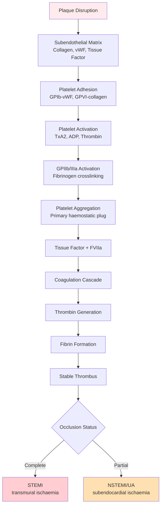
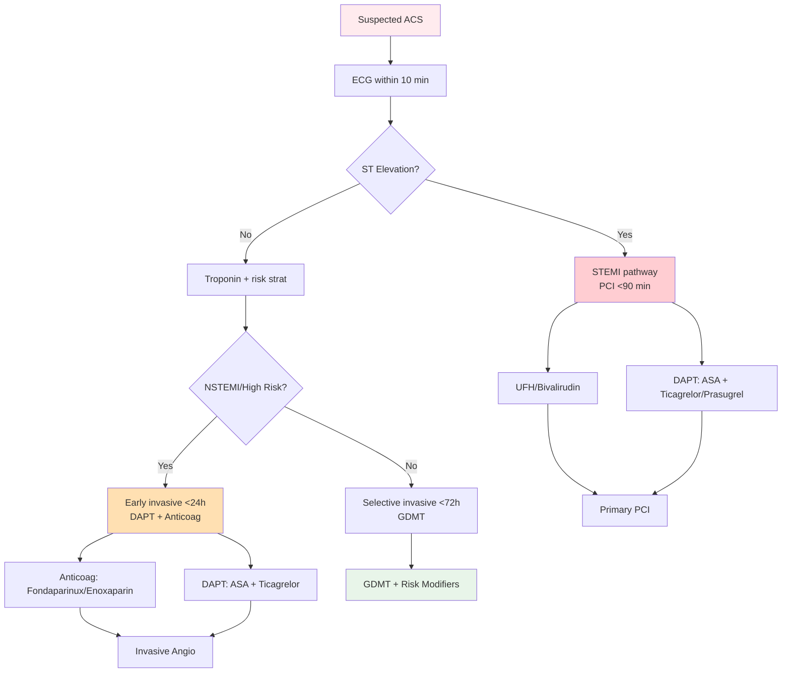
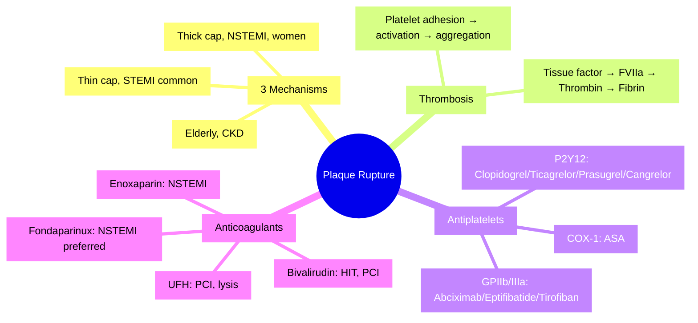
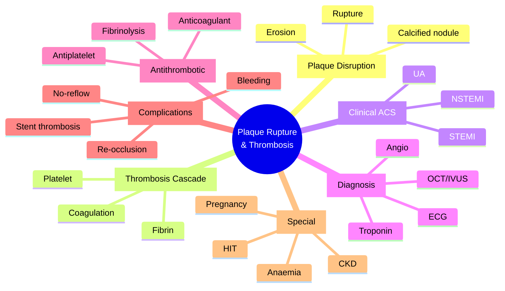

<!-- Source: /mnt/tb/Medicine/Cardiology/02_Acute_Coronary_Syndromes/Plaque_rupture_and_thrombosis_full.md | section: 16.2 | hub: acute-coronary-syndromes -->

# Plaque Rupture and Thrombosis

> [!info] **Topic Classification**
> **Section:** Acute Coronary Syndromes
> **Heading:** Pathophysiology & Risk Stratification
> **Category:** ACS Pathophysiology
> **Exam Priority:** Tier 1 (Core)

---

## 1. HIGH-YIELD SUMMARY (30-Second Review)

> [!tip] **Plaque Rupture and Thrombosis in a Nutshell**
> - **Definition:** Disruption of atherosclerotic plaque (rupture, erosion, or calcified nodule) exposing thrombogenic core → platelet activation → thrombus formation → acute coronary syndrome
> - **Key Mechanism:** TCFA (thin-cap fibroatheroma, <65μm cap) → cap disruption → lipid core exposure → tissue factor → coagulation cascade → platelet aggregation → occlusive/non-occlusive thrombus
> - **Clinical Pearl:** **70% of STEMI** = plaque rupture; **25-30%** = plaque erosion; **5%** = calcified nodule
> - **Exam Trigger Words:** "thin-cap fibroatheroma," "vulnerable plaque," "plaque rupture," "thrombosis," "tissue factor," "von Willebrand factor," "dual antiplatelet"
> - **Management Priority:** Immediate antithrombotic (DAPT + anticoagulant) + urgent reperfusion (PCI/fibrinolysis)

---

## 2. ETIOLOGY & PATHOPHYSIOLOGY

### 2.1 Plaque Disruption Mechanisms

| Type | Cap State | Trigger | Frequency | Typical Presentation |
|------|-----------|---------|-----------|----------------------|
| **Plaque rupture** | Thin (<65μm), inflamed cap | Macrophage-derived MMPs, biomechanical stress | 60-70% ACS (especially STEMI) | STEMI/NSTEMI |
| **Plaque erosion** | Thick cap, denuded endothelium | Endothelial apoptosis, neutrophil extracellular traps | 25-40% NSTEMI (women, smokers, young) | NSTEMI > STEMI |
| **Calcified nodule** | Disrupted calcified plate | Mechanical disruption of calcification | 5-10% (elderly, CKD) | NSTEMI |
| **Intraplaque haemorrhage** | Neovessel rupture | Vasa vasorum rupture | Variable | Acute worsening |

### 2.2 Pathophysiology of Thrombosis

### 2.3 Molecular Mechanisms

- **MMPs (Matrix Metalloproteinases):** MMP-2, MMP-9 from macrophages → collagen degradation → cap thinning
- **Tissue Factor:** Exposed lipid core → binds FVIIa → extrinsic pathway
- **von Willebrand Factor:** Released from endothelial cells/Weibel-Palade bodies → platelet GPIb binding
- **Thromboxane A2:** Released from activated platelets → vasoconstriction + further platelet recruitment
- **ADP:** Released from dense granules → P2Y1/P2Y12 receptor activation
- **NETs (Neutrophil Extracellular Traps):** In erosion → prothrombotic, procoagulant

### 2.4 Vulnerable Plaque Features (TCFA)

| Feature | Stable Plaque | Vulnerable Plaque (TCFA) |
|---------|---------------|--------------------------|
| **Cap thickness** | >120 μm | <65 μm |
| **Lipid core** | Small | Large (>40% plaque area) |
| **Inflammation** | Minimal | Heavy macrophage infiltration |
| **Neovascularisation** | Absent | Present (vasa vasorum) |
| **Spotty calcification** | Absent | Present |
| **Positive remodelling** | Minimal | Present (Glagov) |

---

## 3. CLINICAL FEATURES

### 3.1 Clinical Syndromes by Thrombus Burden

| Thrombus Type | Occlusion | Duration | ECG | Biomarker | Clinical |
|---------------|-----------|----------|-----|-----------|----------|
| **Complete (red thrombus)** | Total | >20 min | Persistent STE | Troponin rise | STEMI |
| **Subtotal (mixed thrombus)** | Partial | >20 min | ST-depression/TWI | Troponin rise | NSTEMI |
| **Microemboli (white)** | Distal shower | Transient | None/TWI | Variable | Unstable angina |
| **Reperfusion (lytic)** | Variable | Transient | Resolution | TWI (Wellens) | Pre-infarction |

### 3.2 Plaque Rupture vs Erosion - Clinical Differences

| Feature | Plaque Rupture | Plaque Erosion |
|---------|----------------|----------------|
| **Demographics** | Older, male, DM, dyslipidaemia | Younger, female, smokers |
| **Presentation** | STEMI > NSTEMI | NSTEMI > STEMI |
| **Plaque burden** | High | Low |
| **Vessel remodelling** | Positive (outward) | Less remodelling |
| **Treatment response** | Antiplatelet + PCI | May respond to antithrombotic alone (no PCI) |
| **Prognosis** | Higher MACE long-term | Better short-term |

### 3.3 Physical Examination

- Often no specific signs
- Signs of ischaemia: S3, S4, new MR murmur (papillary ischaemia), cool peripheries (cardiogenic shock)
- Look for source of thrombosis: AF (embolic MI), LV thrombus, prosthetic valve

---

## 4. DIAGNOSTIC APPROACH

### 4.1 Diagnostic Tools for Plaque Vulnerability

| Modality | Use | Findings | Clinical Application |
|----------|-----|----------|---------------------|
| **OCT (Optical Coherence Tomography)** | Research, PCI guidance | Cap thickness (resolution 10μm), lipid core, thrombus | Gold standard for cap |
| **IVUS (Intravascular Ultrasound)** | PCI guidance, plaque burden | Plaque burden, virtual histology | Pre-PCI sizing |
| **NIRS (Near-Infrared Spectroscopy)** | Lipid core detection | Lipid core burden index (LCBI) | Lipid-rich plaque ID |
| **CTCA** | Non-invasive | Low-attenuation plaque, napkin-ring sign, positive remodelling | Plaque characterisation |
| **Coronary angioscopy** | Research | Plaque colour, thrombus visualisation | Research |

### 4.2 Biomarkers of Plaque Vulnerability

- **hs-CRP:** Inflammation marker, predicts plaque rupture
- **Lp-PLA2:** Lipoprotein-associated phospholipase A2, plaque inflammation
- **MPO (Myeloperoxidase):** Neutrophil activation
- **Pregnancy-associated plasma protein A (PAPP-A):** Metalloproteinase activity
- **sCD40L:** Platelet activation marker
- **P-selectin:** Endothelial/platelet activation

### 4.3 Clinical Presentation

**STEMI (complete occlusion):**
- Persistent STE ≥1mm (≥2mm V2-V3) in ≥2 contiguous leads
- Reciprocal ST depression
- Positive troponin (rises 3-6h, peaks 24-48h)
- Symptoms >20 min at rest

**NSTEMI/UA (partial occlusion/microembolisation):**
- ST depression ≥0.5mm or T-wave inversion
- Troponin positive (NSTEMI) or negative (UA)
- Crescendo pattern, rest pain

### 4.4 Differential Diagnosis

| Condition | Key Differentiator | Test |
|-----------|---------------------|------|
| **Coronary vasospasm (Prinzmetal)** | Transient STE, normal angio, hyperventilation/cocaine trigger | Provocation testing |
| **Takotsubo** | Apical ballooning, no culprit, post-stress | Echo, angio, CMR |
| **SCAD** | Young women, peripartum, intramural haematoma | OCT, IVUS |
| **Aortic dissection** | Wide mediastinum, asymmetric pulses | CT aortogram |
| **Myocarditis** | Recent viral, diffuse ST changes, no culprit | CMR, troponin pattern |

---

## 5. SEVERITY & THROMBUS BURDEN

### 5.1 Thrombus Grading (TIMI Thrombus Grade)

| Grade | Description |
|-------|-------------|
| **0** | No thrombus |
| **1** | Possible thrombus (reduced contrast density, haziness) |
| **2** | Definite thrombus, smallest dimension ≤½ vessel diameter |
| **3** | Definite thrombus, >½ but <2 vessel diameters |
| **4** | Definite thrombus, ≥2 vessel diameters |
| **5** | Total occlusion |

### 5.2 Risk Stratification

- **GRACE Score:** In-hospital and 6-month mortality
- **TIMI Risk Score (UA/NSTEMI):** 14-day composite endpoint
- **TIMI Risk Score (STEMI):** 30-day mortality
- **PREDICT (Mayo):** Recurrent ischaemia risk
- **DAPT score:** Ischaemic vs bleeding tradeoff

### 5.3 Biomarker Patterns by Pathology

| Biomarker | Plaque Rupture | Plaque Erosion | Note |
|-----------|----------------|----------------|------|
| **hs-CRP** | Higher | Lower | Inflammation |
| **Trop T/I** | Higher peak | Lower peak | Necrosis |
| **sCD40L** | Higher | Lower | Platelet activation |
| **MPO** | Higher | Lower | Neutrophil activation |

---

## 6. MANAGEMENT ALGORITHM

### 6.1 Acute Thrombosis Management

### 6.2 Antiplatelet Agents - Mechanism

| Drug | Target | Onset | Duration | Dose | Indication |
|------|--------|-------|----------|------|------------|
| **Aspirin** | COX-1 (irreversible) | 30-60 min | 7-10d (platelet lifespan) | 75-100mg daily | All ACS |
| **Clopidogrel** | P2Y12 (irreversible) | 2-6h | 3-7d | 75mg daily | Alternative P2Y12 |
| **Ticagrelor** | P2Y12 (reversible) | 30 min-2h | 3-5d | 90mg BD | ACS preferred (PLATO) |
| **Prasugrel** | P2Y12 (irreversible) | 30 min-1h | 7-10d | 10mg daily | PCI-treated ACS (TRITON-TIMI 38) |
| **Cangrelor** | P2Y12 (reversible IV) | 2 min | 1h | 30μg/kg bolus + 4μg/kg/min | Periprocedural |
| **GP IIb/IIIa (abciximab, eptifibatide, tirofiban)** | GPIIb/IIIa | Minutes | Hours | Variable | Bailout (high thrombus, no-reflow) |

### 6.3 Anticoagulant Options

| Drug | Mechanism | Dose | Used In | Monitoring | Reversal |
|------|-----------|------|---------|------------|----------|
| **UFH** | AT-III mediated anti-IIa (mainly) | 60U/kg bolus + 12U/kg/h | PCI, fibrinolysis | aPTT 1.5-2x | Protamine |
| **Enoxaparin** | LMWH (anti-Xa > IIa) | 1mg/kg SC BD | NSTEMI/PCI | Anti-Xa (if needed) | Protamine (partial) |
| **Fondaparinux** | Synthetic pentasaccharide (anti-Xa) | 2.5mg SC daily | NSTEMI (OASIS-5) | None | Limited |
| **Bivalirudin** | Direct thrombin inhibitor | 0.75mg/kg bolus + 1.75mg/kg/h | PCI (especially HIT) | ACT | None specific |

### 6.4 Fibrinolytic Therapy

| Drug | Mechanism | Dose | Fibrin Specificity | Reperfusion Rate | Risk |
|------|-----------|------|-------------------|------------------|------|
| **Tenecteplase (TNK)** | tPA mutant | Single bolus 30-50mg (weight-adjusted) | High | 80% | ICH 0.5-1% |
| **Reteplase (rPA)** | tPA deletion mutant | 2 boluses 30 min apart | Moderate | 80% | ICH 0.7% |
| **Alteplase (tPA)** | Native tPA | 90-min infusion | Moderate | 75% | ICH 0.7% |
| **Streptokinase** | Streptococcal plasminogen activator | 1.5MU 30-60min | Low | 60% | Allergy, ICH 0.5% |

**Fibrinolysis Contraindications (Absolute):**
- Prior intracranial haemorrhage
- Ischaemic stroke <3 months
- Active internal bleeding
- Suspected aortic dissection
- Intracranial neoplasm/AVM
- Recent cranial/spinal surgery

**Fibrinolysis Contraindications (Relative):**
- Severe uncontrolled HTN (>180/110)
- Ischaemic stroke >3 months ago
- Recent major surgery <3 weeks
- Active peptic ulcer
- Pregnancy
- Current anticoagulation (high INR)

---

## 7. COMPLICATIONS

### 7.1 Thrombotic Complications

| Complication | Mechanism | Incidence | Management |
|--------------|-----------|-----------|------------|
| **Stent thrombosis (acute <24h)** | Stent underexpansion, dissection, residual thrombus | <1% | Repeat PCI |
| **Stent thrombosis (subacute 1-30d)** | Premature DAPT cessation, resistance | <1% | Repeat PCI |
| **Stent thrombosis (late 1-12m)** | Delayed healing, neoatherosclerosis | 0.5% | Repeat PCI |
| **Stent thrombosis (very late >1y)** | Very late neoatherosclerosis | 1-2%/y | Repeat PCI |
| **Re-occlusion post-thrombolysis** | Residual thrombus/stenosis | 10-15% | Rescue PCI |
| **Distal embolisation** | Thrombus fragmentation | Variable | GP IIb/IIIa, aspiration |

### 7.2 Bleeding Complications

| Complication | Mechanism | Risk Factors | Management |
|--------------|-----------|--------------|------------|
| **Access site bleeding** | Large-bore arterial access | Female, elderly, low BMI | Manual compression, closure device |
| **GI bleeding** | DAPT + anticoagulation | PUD, NSAIDs | PPI, transfuse, hold antithrombotic |
| **Intracranial haemorrhage** | Fibrinolysis, anti-thrombotic | Age, HTN, prior stroke | Reversal agents, neurosurgical |
| **Retroperitoneal bleeding** | High femoral puncture | Female, anticoagulation | Volume, reversal, possible intervention |

### 7.3 Long-term Outcomes

- **Recurrent ischaemia:** 5-10% at 1 year
- **Stent thrombosis:** 1-2%/year (depending on stent type)
- **Mortality:** STEMI in-hospital 5-10%, 1-year 10-15%
- **Heart failure:** 10-20% develop within 1 year
- **MACE:** 15-25% at 1 year (recurrent MI, stroke, death, revascularisation)

---

## 8. SPECIAL POPULATIONS

| Population | Considerations | Modifications |
|------------|----------------|---------------|
| **Pregnancy** | ACS rare; consider SCAD, dissection; avoid radiation | Aspirin safe; clopidogrel limited; avoid statins, ACEi, ARB |
| **Elderly** | Higher bleeding, less collateral, atypical presentation | Bivalirudin preferred, lower anticoagulant doses, radial access |
| **CKD** | Contrast nephropathy, dose adjustment | Hydration, low/iso-osmolar contrast, avoid enoxaparin if CrCl<30 |
| **Diabetics** | Multivessel, microvascular, higher MACE | More aggressive lipid lowering, consider CABG if multivessel |
| **Anaemic** | Worse outcomes, transfusion risks | Transfusion threshold restrictive (Hb<7 in stable) |
| **HIT (Heparin-induced thrombocytopenia)** | Type II = immune, 5-10d | Switch to bivalirudin, argatroban, fondaparinux |

---

## 9. LATEST GUIDELINES & EVIDENCE (2023-2024)

| Guideline | Update | Impact | LOE |
|-----------|--------|--------|-----|
| **ESC 2023 ACS** | 0/1h hs-cTn; cangrelor in PCI; routine thrombus aspiration NOT recommended | Improved workflow, faster rule-in/rule-out | IA |
| **ACC/AHA 2023** | Bivalirudin not superior to UFH in modern PCI; ticagrelor preferred P2Y12 | DAPT optimisation | IA |
| **2018/2021 ESC DAPT** | DAPT 12mo ACS; 6mo stable CAD; shorter if HBR | Individualised DAPT | IA |
| **2023 ACCP Antithrombotic** | DOAC for AF + PCI: 1-12mo triple, then DOAC + P2Y12 | AF + PCI algorithm | IA |
| **TROPICAL-ACS (2017)** | Platelet function-guided de-escalation | Alternative to 12mo ticagrelor | IB |
| **MASTER DAPT (2021)** | 1-month DAPT in HBR post-PCI | Reduced bleeding | IA |

**Practice-Changing Trials (Recent):**
- **TWILIGHT (2019)**: Ticagrelor monotherapy (drop ASA) after 3mo DAPT in PCI → reduced bleeding, no ischaemic harm
- **TICO (2020)**: Ticagrelor monotherapy at 3mo in ACS → reduced bleeding
- **MASTER DAPT (2021)**: 1-month DAPT in HBR (post-PCI) → 50% reduced bleeding, no MACE increase
- **ASpirin TWINtinG-PCI (2024)**: ASA withdrawal strategies
- **LIMIT (2024)**: Lower-dose ticagrelor in Asian populations
- **RIGHT (2024)**: Periprocedural anticoagulation duration

---

## 10. CONFUSIONS & COMMON PITFALLS

| Confusion | Why | Solution |
|-----------|-----|----------|
| **Rupture vs Erosion** | Different pathology but both cause ACS | Rupture = thin-cap, STEMI, plaque burden high; Erosion = thick cap, often NSTEMI, younger |
| **Stent thrombosis ≠ restenosis** | Different entities | Thrombosis = sudden, catastrophic; Restenosis = gradual, in-stent |
| **"Aspirin resistance"** | Platelet function tests variable | Clinical resistance is rare; check compliance, co-medications |
| **"DAPT duration"** | Multiple trials | 12mo ACS, 6mo stable; individualise HBR vs HIR |
| **"Triple therapy" AF+PCI** | Bleeding risk | 1-week triple, then DOAC + P2Y12; AF + PCI pathway |
| **"Fibrinolysis complications"** | ICH risk | Avoid in stroke <3mo, recent surgery, severe HTN |
| **"Reperfusion arrhythmias"** | Reperfusion injury | Often self-limiting; treat if haemodynamically unstable |

---

## 11. MNEMONICS & MEMORY AIDS

| Mnemonic | Meaning | Application |
|----------|---------|-------------|
| **PLATELETS** | Platelets Lead to Acute Thrombus Events | Remember platelet role |
| **TCFA** | Thin-Cap FibroAtheroma | Vulnerable plaque |
| **FATS** | Fatty streak, Atheroma, Thrombosis, Stenosis | Plaque stages |
| **PIED** | Prasugrel, Ischemia, Elderly, Diabetes | Prasugrel contraindications |
| **DAPT** | Dual Anti-Platelet Therapy | Post-ACS |
| **TIMI** | Thrombolysis In Myocardial Infarction | Risk scores, thrombus grade |
| **STEMI-NSTEMI** | Subendocardial vs Transmural | ECG/biochemical differentiation |

---

## 12. MIND MAP - COMPLETE TOPIC OVERVIEW

---

## 13. REVISION CARDS

| Category | Key Points |
|----------|------------|
| **Definition** | Disruption of atherosclerotic plaque → platelet activation → thrombus → ACS |
| **Pathophysiology** | TCFA (cap <65μm) → cap disruption → tissue factor exposure → thrombin → fibrin → thrombus |
| **Clinical Features** | STEMI (complete), NSTEMI (partial), UA (microembolic) |
| **Diagnostic Criteria** | ECG (STE/depression), Troponin, Angiography, OCT/IVUS |
| **Key Investigations** | ECG, hs-cTn I/T, TTE, Coronary angio, OCT/IVUS |
| **First-Line Management** | DAPT (ASA + ticagrelor) + Anticoag (UFH/bivalirudin) + PCI/lysis |
| **Key Scores/Thresholds** | GRACE (>140 high risk), TIMI (≥5 high risk), DAPT score |
| **Complications** | Stent thrombosis, Re-occlusion, Bleeding, No-reflow, Distal embolisation |
| **Prognosis** | STEMI 1-yr mortality 10-15%, MACE 15-25% |
| **Viva Pearl** | "70% STEMI = plaque rupture; erosion is more common in young female smokers with NSTEMI; P2Y12 preferred = ticagrelor (PLATO) or prasugrel (TRITON)" |

---

## 14. EXAM DRILLS

### 14.1 MCQs

#### Q1. The MOST common pathophysiological mechanism underlying acute ST-elevation myocardial infarction is:
A. Coronary vasospasm
B. Plaque rupture with thrombotic occlusion
C. Plaque erosion
D. Calcified nodule
E. Coronary dissection

> **Answer: B. Plaque rupture with thrombotic occlusion**
> **Explanation:** ~70% STEMI = plaque rupture of TCFA. Erosion = 25-30%, calcified nodule = 5-10%. Spasm/SCAD = small percentages.

#### Q2. Which antiplatelet agent acts as a reversible P2Y12 inhibitor?
A. Aspirin
B. Clopidogrel
C. Ticagrelor
D. Prasugrel
E. Tirofiban

> **Answer: C. Ticagrelor**
> **Explanation:** Ticagrelor = reversible, oral, twice daily. Clopidogrel/prasugrel = irreversible thienopyridines. Cangrelor = reversible IV. Tirofiban = GPIIb/IIIa.

#### Q3. A 65-year-old has STEMI, PCI with DES. He is on ticagrelor + ASA. 8 months later, he needs hip surgery. What is the best approach?
A. Stop both for 5 days pre-op
B. Continue both throughout
C. Stop ticagrelor 5 days pre-op, continue ASA
D. Stop ASA, continue ticagrelor
E. Switch to clopidogrel

> **Answer: C. Stop ticagrelor 5 days pre-op, continue ASA**
> **Explanation:** Standard practice: stop P2Y12 5d before major surgery (ticagrelor 5d, clopidogrel 5d, prasugrel 7d), continue ASA. After 6-12mo DAPT, often can hold P2Y12 for surgery. Resume as soon as safe post-op.

#### Q4. Which trial demonstrated superiority of ticagrelor over clopidogrel in ACS?
A. CURE
B. TRITON-TIMI 38
C. PLATO
D. ISAR-REACT
E. CURRENT-OASIS

> **Answer: C. PLATO**
> **Explanation:** PLATO (2009) = ticagrelor vs clopidogrel in ACS → 16% RRR MACE. CURE = clopidogrel vs placebo. TRITON-TIMI 38 = prasugrel vs clopidogrel in PCI-treated ACS.

#### Q5. Fibrinolysis is CONTRAINDICATED in which of the following?
A. Patient aged 70 with STEMI
B. Recent ischaemic stroke 6 weeks ago
C. Active peptic ulcer
D. Uncontrolled hypertension 180/110
E. Pregnancy

> **Answer: B. Recent ischaemic stroke 6 weeks ago**
> **Explanation:** Ischaemic stroke <3 months = absolute contraindication. Other absolute: prior intracranial haemorrhage, active bleeding, intracranial neoplasm/AVM, suspected dissection. Others are relative.

### 14.2 SBAs

#### SBA1. A 55-year-old man, smoker, diabetic, presents with 1-hour central chest pain and anterior STEMI. He is haemodynamically stable. PCI available in 30 min.
**Question:** What is the optimal antithrombotic regimen pre-PCI?
A. Aspirin + clopidogrel + UFH
B. Aspirin + ticagrelor + bivalirudin
C. Aspirin + ticagrelor + UFH
D. Aspirin + prasugrel + fondaparinux
E. Aspirin + ticagrelor + enoxaparin

> **Answer: C. Aspirin + ticagrelor + UFH**
> **Rationale:** STEMI + PCI: ASA 300mg loading + ticagrelor 180mg loading (preferred P2Y12 per PLATO) + UFH 60U/kg bolus (or 70U/kg if no P2Y12 yet). Enoxaparin 0.5mg/kg IV alternative. Bivalirudin = alternative anticoag, especially if HIT. Prasugrel contraindicated if stroke/TIA, age>75.

#### SBA2. A 60-year-old on warfarin for AF (INR 2.5) presents with STEMI. She cannot have primary PCI.
**Question:** What is the best approach?
A. Give fibrinolysis + continue warfarin
B. Give fibrinolysis + fresh frozen plasma to INR <2
C. Give primary PCI despite INR
D. Switch to DOAC and fibrinolysis
E. Medical management only

> **Answer: C. Give primary PCI despite INR**
> **Rationale:** Active warfarin with therapeutic INR is NOT an absolute contraindication to PCI (radial access, careful haemostasis). Fibrinolysis is contraindicated with INR >2 (or with DOAC within 48h). FFP to reverse is not standard. If PCI unavailable, consider fibrinolysis with FFP if INR>2.

#### SBA3. A patient has NSTEMI with troponin rising. He had a previous stroke 4 months ago.
**Question:** Which antithrombotic regimen is contraindicated?
A. Aspirin + clopidogrel
B. Aspirin + ticagrelor
C. Aspirin + prasugrel
D. UFH
E. Fondaparinux

> **Answer: C. Aspirin + prasugrel**
> **Rationale:** Prasugrel is contraindicated in prior stroke/TIA (TRITON-TIMI 38 showed net harm). Ticagrelor can be used cautiously. Clopidogrel is alternative. UFH/fondaparinux = anticoagulants, no contraindication.

### 14.3 Viva Questions

1. **Compare and contrast plaque rupture vs plaque erosion.** Discuss clinical features and management implications.
2. **Explain the thrombosis cascade** in ACS. How do antiplatelets and anticoagulants target different steps?
3. **Describe the four-pillar antithrombotic approach** in ACS (DAPT + anticoagulation + PCI + secondary prevention).
4. **Compare ticagrelor, clopidogrel, and prasugrel.** What are key trials and contraindications?
5. **Discuss fibrinolysis indications, contraindications, and choice of agent.** When is it preferred over PCI?
6. **How would you manage a patient with HIT requiring PCI?**
7. **What is no-reflow phenomenon?** How is it managed?
8. **Discuss DAPT duration after ACS.** How do you balance ischaemic vs bleeding risk?
9. **Explain stent thrombosis.** Discuss timing, mechanisms, and prevention.
10. **How do you manage ACS in pregnancy?**

---

## 15. SPACED REPETITION TRACKER

| Date | Recall Quality | Notes |
|------|----------------|-------|
| Day 1 | ☐ | Initial reading |
| Day 3 | ☐ | Active recall |
| Day 7 | ☐ | Anki + mind map |
| Day 15 | ☐ | Algorithm + MCQ |
| Day 30 | ☐ | Full viva practice |
| Day 90 | ☐ | Mock exam |

---

## 16. CROSS-REFERENCES & NAVIGATION

- [[Atherosclerosis_pathogenesis]] - Background
- [[STEMI_ECG_criteria_ST_elevation_hyperacute_T_waves_reciprocal_changes]] - ECG
- [[Primary_PCI_protocol_door_to_balloon_stent_choice_anticoagulation]] - Reperfusion
- [[Fibrinolysis_indications_contraindications_agents_rescue_PCI]] - Lysis
- [[../Cardiology MOC]]

---

## 17. METADATA & TRACKING

**File:** Plaque_rupture_and_thrombosis.md
**Status:** ✅ full-fcps-mrcp-note
**Tags:** #medicine #cardiology #fcps #mrcp #acs #plaque-rupture #thrombosis

---
