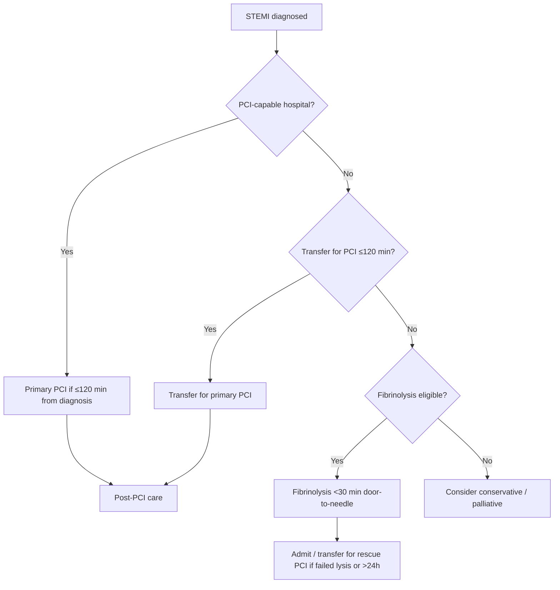
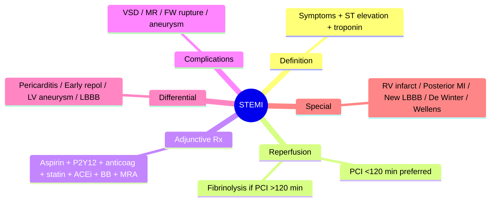

# STEMI

Related: [[../Cardiology MOC|Cardiology MOC]] · [[../Davidson Chapter 16 - Cardiology Hierarchy|Cardiology Hierarchy]] · [[../Ischaemic Heart Disease and Acute Coronary Syndromes|Ischaemic Heart Disease and Acute Coronary Syndromes]] · [[Acute coronary syndromes and myocardial infarction]] · [[Reperfusion strategy in STEMI]] · [[Mechanical complications of myocardial infarction]] · [[Post-myocardial infarction secondary prevention]] · [[Acute Coronary Syndrome]] · [[Ischemic Heart Disease]]

> [!important]
> STEMI is a time-critical emergency. **Door-to-balloon ≤90 min** (primary PCI) or **door-to-needle ≤30 min** (fibrinolysis) targets drive every decision. FCPS/MRCP exams test reperfusion algorithms, contraindications, complication recognition, and special populations.

## Learning Objectives
- Define STEMI using universal criteria: symptoms + ST elevation + troponin rise
- Localize infarct territory by ECG lead groups and reciprocal changes
- Apply reperfusion decision framework: primary PCI vs fibrinolysis vs no reperfusion
- Manage absolute/relative contraindications to fibrinolysis
- Recognize and manage mechanical complications (VSD, papillary muscle rupture, free wall rupture)
- Implement post-STEMI secondary prevention and discharge planning

## Definition
**ST-Elevation Myocardial Infarction (STEMI)** is an acute coronary syndrome with:
1. **Ischemic symptoms** (typically ≥20 min chest pain)
2. **New ST elevation** at J-point in ≥2 anatomically contiguous leads:
   - ≥2.5 mm in men <40 years; ≥2 mm in men ≥40 years; ≥1.5 mm in women (V2–V3)
   - ≥1 mm in other leads
3. **Rise and/or fall of troponin** with at least one value >99th percentile URL

**STEMI equivalent patterns** requiring emergent reperfusion:
- New LBBB (with appropriate clinical context + Sgarbossa criteria)
- Posterior MI (ST depression V1–V3 + tall R in V1–V3)
- RV infarction (inferior MI + ST elevation in V4R)
- Isolated posterior leads ST elevation (V7–V9)

## Pathophysiology
- **Plaque rupture/erosion** → **occlusive thrombus** → complete coronary occlusion
- **Transmural ischemia** → subepicardial injury current → **ST elevation**
- **Wavefront of necrosis**: subendocardium → epicardium over 3-6 hours
- **Myocardial salvage** depends on time-to-reperfusion; "time is muscle"

## ECG Localization

### Lead Groups and Coronary Territories
| Territory | Leads | Culprit Artery | Reciprocal Changes |
|-----------|-------|----------------|-------------------|
| **Inferior** | II, III, aVF | RCA (80%), LCx (20%) | I, aVL (ST depression) |
| **Anterior** | V1–V4 | LAD (proximal/wrap) | Inferior (II, III, aVF) |
| **Anteroseptal** | V1–V2 | Proximal LAD | — |
| **Anterolateral** | V3–V6, I, aVL | LAD + diagonal/LCx | Inferior |
| **High lateral** | I, aVL | LCx / diagonal | Inferior |
| **Posterior** | V7–V9 (ST elevation) | LCx / RCA | V1–V3 (ST depression + tall R) |
| **RV** | V4R (ST elevation) | Proximal RCA | — |

> [!tip]
> **De Winter T waves** in V1–V4 (upsloping ST depression + tall positive T) = proximal LAD occlusion equivalent.
> **Wellens syndrome** (deep T inversion V2–V3) = critical proximal LAD stenosis – NOT STEMI but pre-infarction.

## Clinical Assessment
- **Pain**: central, crushing, ≥20 min, radiation to jaw/arm/back, diaphoresis, nausea
- **Hemodynamics**: assess for cardiogenic shock (cold, hypotensive, oliguric)
- **Heart failure**: Killip class I–IV
- **Arrhythmias**: VT/VF (primary VF in ischemia), high-grade AV block (inferior MI)

## Reperfusion Strategy (Algorithm)

### Time Window
- **≤12 h from symptom onset**: reperfusion indicated (PCI preferred)
- **12–24 h**: reperfusion if ongoing ischemia, HF, or shock
- **>24 h**: no routine reperfusion unless ischemic symptoms persist

### Choice: PCI vs Fibrinolysis
| Factor | Favors Primary PCI | Favors Fibrinolysis |
|--------|-------------------|---------------------|
| **PCI delay** | Can achieve <120 min | Cannot (rural, no PCI centre) |
| **Bleeding risk** | Lower | Higher (absolute contraindications) |
| **Presentation** | Late (>3h), cardiogenic shock, uncertain diagnosis | Early (<3h), large anterior MI |
| **Resources** | PCI-capable centre on-site | Non-PCI hospital, transfer >120 min |

> [!warning]
> **Primary PCI is preferred** if achievable within 120 min of STEMI diagnosis (guideline standard). Fibrinolysis reserved for when PCI delay >120 min.

## Fibrinolysis

### Agents
- **Tenecteplase (TNK)** – single bolus, preferred (lower bleeding, easier)
- **Alteplase (tPA)** – 90-min infusion
- **Reteplase** – double bolus
- **Streptokinase** – non-fibrin specific, antigenic, cheaper (avoid if prior exposure)

### Absolute Contraindications
1. Prior intracranial hemorrhage
2. Known structural cerebral vascular lesion (AVM, aneurysm)
3. Known malignant intracranial neoplasm
4. Ischemic stroke within 3 months (except acute ischemic stroke ≤4.5h — different protocol)
5. Suspected aortic dissection
6. Active bleeding or bleeding diathesis
7. Significant closed-head/facial trauma within 3 months
8. Intracranial/intraspinal surgery within 2 months
9. Severe uncontrolled hypertension (SBP >180 / DBP >110)

### Relative Contraindications
- SBP >180 or DBP >110 on presentation
- History of chronic severe hypertension
- Traumatic/prolonged CPR (>10 min) within 2 weeks
- Recent (≤3 months) internal bleeding
- Non-compressible vascular punctures
- Pregnancy (can use with caution)
- Active peptic ulcer
- Current anticoagulation (INR >2, DOAC within 48h)

## Adjunctive Medical Therapy (All STEMI)

| Drug | Dose / Timing | Notes |
|------|---------------|-------|
| **Aspirin** | 300 mg PO chewed immediately | Lifelong |
| **P2Y12 inhibitor** | Ticagrelor 180 mg LD → 90 mg BD, or Clopidogrel 600 mg LD → 75 mg OD | Ticagrelor preferred (PLATO); Prasugrel 60 mg LD in PCI if <75y, no prior stroke |
| **Anticoagulation** | UFH 60 U/kg IV bolus (max 4000 U) + infusion; or Enoxaparin 0.5 mg/kg SC q12h | For fibrinolysis: use UFH/enoxaparin per protocol; for PCI: bivalirudin or UFH |
| **ACEi/ARB** | Start within 24h if no hypotension (esp. anterior MI, HF, EF<40%) | Ramipril 2.5 mg BD titrate |
| **Beta-blocker** | IV metoprolol 5 mg ×3 if no contraindication; oral 25 mg BD | Avoid in HF, shock, bradycardia, AV block, severe COPD |
| **Statin** | High-intensity (atorvastatin 80 mg or rosuvastatin 20-40 mg) | Start immediately |
| **MRA** | Eplerenone 25 mg OD if EF≤40% + HF/DM (EPHESUS) | Start after 3-7 days, monitor K+/Cr |

## Mechanical Complications (Timing ~3-7 days post-MI)

| Complication | Presentation | Key Clues | Management |
|--------------|--------------|-----------|------------|
| **VSD** | New harsh holosystolic murmur (LLSB), shock, RV heave | Systolic RV pressure step-up on RHC | Surgical repair (delayed if stable) |
| **Papillary muscle rupture** | Acute severe MR, pulmonary edema, ** murmur radiates to axilla** | Flail leaflet on echo, large V-wave on PCWP | Urgent mitral valve surgery |
| **Free wall rupture** | Sudden cardiac arrest, PEA, tamponade | Usually inferior MI, older women | Pericardiocentesis → emergency surgery (usually fatal) |
| **LV pseudoaneurysm** | Contained rupture, late presentation | Narrow neck on echo/CT | Surgical repair |

## Differential Diagnosis of ST Elevation
| Condition | Distinguishing Features |
|-----------|------------------------|
| **Pericarditis** | Diffuse concave ST elevation, PR depression, no reciprocal changes, no troponin rise (or minimal) |
| **Early repolarization** | J-point elevation, concave ST, tall T, terminal QRS notching (fish hook), young/male |
| **LV aneurysm** | Persistent ST elevation >3 weeks post-MI, dyskinetic wall, no reciprocal changes |
| **LBBB** | Discordant ST-T; Sgarbossa criteria for ischemia |
| **RVH / Brugada** | V1–V3 ST elevation, specific patterns |

## Prognosis
- **TIMI Risk Score STEMI**: age, DM, prior CAD, HTN, Killip class, weight, time to treatment, anterior MI, HR, SBP
- In-hospital mortality: ~5-7% (modern PCI era)
- Major determinants: time to reperfusion, infarct size (peak troponin, EF), complications

## Red Flags / Exam Traps
- Inferior MI + hypotension = **RV infarction** → fluids, avoid nitrates
- New LBBB + chest pain = **treat as STEMI** (Sgarbossa: concordant STE ≥1mm, concordant STD ≥1mm in V1–V3, discordant STE ≥5mm)
- Posterior MI = ST depression V1–V3 → get V7–V9
- High lateral MI (I, aVL) = **LCx** → circumflex occlusion often missed
- Cardiac arrest post-STEMI: check for mechanical complication, recurrent arrhythmia, pump failure

## FCPS/MRCP High-Yield Points
- **Door-to-balloon ≤90 min** (PCI); **door-to-needle ≤30 min** (lysis)
- **Primary PCI preferred** if <120 min delay
- **Ticagrelor > clopidogrel > prasugrel** (if PCI, <75y)
- **Inferior MI + RV infarct** → avoid nitrates/diuretics, give fluids
- **New LBBB with symptoms** → treat as STEMI
- **Mechanical complications** at 3-7 days: VSD, acute MR, free wall rupture
- **Posterior MI** = ST depression V1–V3 + tall R → V7–V9
- **Wellens/De Winter** = high-risk pre-infarction patterns

## Common Viva Questions
1. What are the ECG criteria for STEMI in V2–V3?
2. When is fibrinolysis preferred over PCI?
3. Absolute contraindications to fibrinolysis?
4. How do you recognize RV infarction on ECG?
5. What is the Sgarbossa criteria?
6. Timing of mechanical complications post-MI?
7. What is Wellens syndrome and its significance?
8. Post-STEMI P2Y12 choice and duration?

## Common Confusions / Exam Traps
- Calling every new LBBB "STEMI" without clinical correlation
- Missing posterior MI (V1–V3 ST depression)
- Giving nitrates in RV infarction
- Delaying PCI for fibrinolysis when PCI delay <120 min
- Forgetting Sgarbossa in new LBBB

## Mind Map

## One-Page Revision Summary
- **STEMI** = ischemic pain + new STE in contiguous leads + troponin rise
- **Reperfusion**: PCI <120 min > fibrinolysis; lysis if PCI >120 min
- **Contraindications to lysis**: ICH, stroke <3m, dissection, active bleed, severe HTN
- **Inferior MI + shock** = RV infarct → V4R STE, fluids, avoid nitrates
- **Posterior MI** = STD V1–V3 → V7–V9; LCx/RCA
- **New LBBB + pain** = STEMI until proven otherwise (Sgarbossa)
- **VSD/MR rupture** day 3-7: new murmur + shock → echo → surgery
- **Adjuncts**: ASA 300mg, ticagrelor 180/90, UFH/enox, high-intensity statin, ACEi, BB, MRA if EF≤40%

## 24-Hour Recall Prompts
- Reproduce the reperfusion decision flowchart
- List absolute contraindications to fibrinolysis
- Draw STEMI lead localization table from memory
- State Sgarbossa criteria for LBBB
- Time mechanical complications post-MI

## 7-Day / 15-Day / 30-Day Revision Tracker
- [ ] Day 1 completed
- [ ] 24-hour recall completed
- [ ] Day 7 revision completed
- [ ] Day 15 revision completed
- [ ] Day 30 revision completed

## Must Know / Should Know / Nice to Know
### Must Know
- STEMI definition + ECG criteria
- PCI vs lysis decision + time targets
- Fibrinolysis contraindications
- RV infarction recognition + management
- Mechanical complications timing + presentation
- Inferior MI + hypotension = RV infarct

### Should Know
- Sgarbossa criteria details
- De Winter / Wellens patterns
- Posterior MI ECG + leads
- PEITHO trial (fibrinolysis in intermediate-risk PE – not STEMI)
- TIMI/GRACE scores

### Nice to Know
- Specific fibrinolytic dosing differences (TNK vs tPA vs reteplase)
- Primary PCI vs rescue PCI vs pharmaco-invasive strategy
- Complete revascularization timing (DANAMI-3 PRIMULTI, PRAMI, COMPLETE trials)

## Self-Test Scorecard
- Understanding /10
- Recall /10
- ECG pattern recognition /10
- MCQ performance /10
- Viva confidence /10
- **Total /50**

> [!tip]
> **Interpretation**: <35 = weak topic; 35-44 = acceptable but insecure; 45+ = strong exam-ready topic.

## Exam Answer Modes
### Long Answer Skeleton
1. Definition + universal criteria
2. Pathophysiology (occlusive thrombus, wavefront)
3. ECG localization table
4. Reperfusion algorithm (PCI vs lysis)
5. Adjunctive pharmacotherapy
6. Complications (mechanical + arrhythmic)
7. Post-STEMI secondary prevention

### Short Note Skeleton
- STEMI criteria
- PCI <120 min preferred
- Fibrinolysis contraindications
- RV infarct: V4R, fluids, no nitrates
- VSD/MR day 3-7
- Discharge meds: DAPT 12m, statin, ACEi, BB, MRA

### Viva One-Liners
- "ST elevation in V4R = RV infarct"
- "ST depression V1-V3 = posterior MI until proven otherwise"
- "New LBBB + chest pain = STEMI unless Sgarbossa negative"
- "Door-to-balloon 90 min; door-to-needle 30 min"
- "Mechanical rupture day 3-7 post-MI"

### Ward-Case Discussion Points
- 60M, inferior STEMI, BP 80/50: "RV infarct likely. Check V4R. Fluids first. No nitrates. Urgent PCI."
- 75F, anterior STEMI, failed lysis, ongoing pain: "Rescue PCI now. Not repeat lysis."
- 55M, day 4 post-inferior STEMI, new pansystolic murmur, shock: "VSD or papillary muscle rupture. Echo. Surgery."

### Last-Night-Before-Exam Sheet
- STEMI criteria per lead
- PCI vs lysis: 120 min rule
- Lysis contraindications: ICH, stroke, dissection, bleed, HTN
- RV infarct = inferior + V4R STE + hypotension → fluids, no nitrates
- Posterior = STD V1-V3 + tall R → V7-V9
- Sgarbossa in LBBB: concordant STE 1mm, concordant STD 1mm V1-V3, discordant STE 5mm
- Mechanical: VSD (harsh systolic), acute MR (soft systolic + flash pulmonary edema), free wall rupture (sudden death)

## Summary
STEMI is a **time-critical occlusive coronary thrombosis** requiring **immediate reperfusion**. Primary PCI within 120 min is preferred; fibrinolysis reserved for >120 min PCI delay. Key adjuncts: dual antiplatelet therapy, anticoagulation, high-intensity statin, ACEi, beta-blocker, MRA if reduced EF. Mechanical complications (VSD, acute MR, free wall rupture) peak at 3-7 days. Inferior MI + shock = **RV infarct** (V4R) — fluids, avoid nitrates. Posterior MI = **ST depression V1–V3** — confirm with V7–V9. New LBBB with ischemic symptoms = **STEMI equivalent** (Sgarbossa).

## MCQs (10)
1. A 62-year-old man presents with 2 hours of crushing chest pain. ECG shows ST elevation 3 mm in II, III, aVF with reciprocal ST depression in I, aVL. He is hypotensive (BP 85/50). What is the most appropriate initial management?
   A. IV nitroglycerin
   B. IV furosemide
   C. IV crystalloid fluid bolus
   D. IV metoprolol
2. Which of the following is an absolute contraindication to fibrinolytic therapy?
   A. Age >75 years
   B. Prior stroke 4 months ago
   C. Current warfarin with INR 2.5
   D. History of intracranial hemorrhage
3. Posterior MI is best confirmed by which additional leads?
   A. V1–V3
   B. V4R
   C. V7–V9
   D. aVR
4. A patient with new LBBB presents with typical ischemic chest pain. Which Sgarbossa criterion is most specific for acute occlusion?
   A. Discordant ST elevation ≥5 mm in leads with negative QRS
   B. Concordant ST elevation ≥1 mm
   C. Concordant ST depression ≥1 mm in V1–V3
   D. All of the above are equally specific
5. Mechanical ventricular septal defect typically presents:
   A. Within 24 hours of MI
   B. Day 3–7 post-MI
   C. Week 2–3 post-MI
   D. Month 1 post-MI
6. Preferred P2Y12 inhibitor for STEMI undergoing primary PCI (per PLATO)?
   A. Prasugrel
   B. Clopidogrel
   C. Ticagrelor
   D. Cangrelor
7. Maximum door-to-balloon time target for primary PCI:
   A. 60 minutes
   B. 90 minutes
   C. 120 minutes
   D. 180 minutes
8. Wellens syndrome is characterized by:
   A. ST elevation in V1–V3
   B. Deep symmetric T inversion in V2–V3
   C. ST depression in V1–V3
   D. Hyperacute T waves in V4–V6
9. De Winter pattern (upsloping ST depression + tall T in V1–V4) signifies:
   A. RV infarction
   B. Proximal LAD occlusion
   C. Posterior MI
   D. Pericarditis
10. Eplerenone post-MI indication (EPHESUS):
    A. All STEMI patients
    B. EF <40% with HF or diabetes
    C. Anterior MI only
    D. Age >75

## SBA Questions (10)
1. A 68-year-old man, 3 hours post-onset anterior STEMI, presents to a non-PCI hospital. Transfer time to PCI centre is 150 minutes. No contraindications to fibrinolysis. Best reperfusion strategy?
   A. Transfer for primary PCI
   B. Administer tenecteplase now
   C. Administer alteplase now, then transfer
   D. Conservative management
2. Inferior STEMI with hypotension. ECG shows ST elevation in V4R. Avoid:
   A. IV saline
   B. Norepinephrine
   C. Nitroglycerin
   D. Atropine
3. Patient with prior ICH presents with 2-hour inferior STEMI. PCI available in 90 min. Best option:
   A. Tenecteplase
   B. Primary PCI
   C. Streptokinase
   D. Reteplase
4. Day 5 post-inferior MI, new harsh holosystolic murmur LLSB, hypotension. Echo shows RV pressure step-up. Diagnosis:
   A. Acute MR
   B. VSD
   C. Free wall rupture
   D. LV thrombus
5. Sgarbossa criteria for STEMI in LBBB – which is NOT a criterion?
   A. Concordant STE ≥1 mm
   B. Discordant STE ≥5 mm
   C. Concordant STD ≥1 mm in V1–V3
   D. Discordant STD ≥2 mm in V5–V6
6. Post-STEMI medical therapy – which is NOT routinely started within 24h?
   A. High-intensity statin
   B. ACE inhibitor
   C. MRA (eplerenone)
   D. Beta-blocker
7. A 45-year-old man with inferior STEMI, recurrent VF despite amiodarone and lidocaine. Next step:
   A. Procainamide
   B. Magnesium
   C. Coronary angiography
   D. ICD implantation
8. Which ECG pattern represents a STEMI equivalent requiring emergent reperfusion?
   A. Early repolarization in V4–V6
   B. De Winter T waves in V1–V4
   C. LVH with strain pattern
   D. Pericarditis with PR depression
9. In fibrinolysis for STEMI, when is rescue PCI indicated?
   A. Immediately after lysis
   B. If <50% ST resolution at 60-90 min post-lysis
   C. 24 hours post-lysis routinely
   D. Only if re-occlusion on angiography
10. Discharge DAPT duration after STEMI with stent:
    A. 1 month
    B. 3 months
    C. 6 months
    D. 12 months

## Flashcards
- Q: STEMI threshold V2-V3 men <40y / ≥40y / women?
  A: 2.5 / 2.0 / 1.5 mm
- Q: Sgarbossa 3 criteria?
  A: Concordant STE 1mm, Concordant STD 1mm V1-V3, Discordant STE 5mm
- Q: RV infarct leads + management?
  A: V4R STE + hypotension → fluids, no nitrates
- Q: Posterior MI recognition?
  A: STD V1-V3 + tall R → V7-V9 for STE
- Q: Mechanical complications timing?
  A: VSD, acute MR, FW rupture day 3-7
- Q: TNK dose?
  A: Weight-based single bolus (30-50mg)
- Q: Wellens =?
  A: Deep T inversion V2-V3 = critical proximal LAD stenosis
- Q: De Winter =?
  A: Upsloping STD + tall T in V1-V4 = proximal LAD occlusion
- Q: Door targets?
  A: Balloon ≤90 min, Needle ≤30 min
- Q: MRA post-MI?
  A: Eplerenone if EF≤40% + HF/DM

## Answer Key with Explanations
### MCQs
1. **C** — Inferior MI + hypotension = RV infarction. Give fluids, avoid nitrates/diuretics which reduce preload.
2. **D** — Prior ICH is absolute contraindication. Warfarin INR 2.5 is relative; stroke 4 months is >3 months (not absolute).
3. **C** — Posterior leads V7-V9 show ST elevation.
4. **B** — Concordant STE ≥1mm is most specific (high PPV). Discordant STE ≥5mm is sensitive but less specific. Modified Sgarbossa uses STE/S ratio.
5. **B** — Mechanical complications peak at 3-7 days post-MI.
6. **C** — Ticagrelor (PLATO: lower mortality vs clopidogrel). Prasugrel not studied in medically managed STEMI; cangrelor IV for PCI only.
7. **B** — Door-to-balloon ≤90 min (guideline). 120 min is PCI delay threshold for lysis.
8. **B** — Wellens: deep T inversion V2-V3 = critical LAD stenosis.
9. **B** — De Winter = proximal LAD occlusion equivalent.
10. **B** — EPHESUS: eplerenone 25mg OD if EF≤40% with HF or diabetes.

### SBAs
1. **B** — PCI delay 150 min >120 min threshold → fibrinolysis indicated (TNK preferred).
2. **C** — RV infarct: avoid nitrates (preload reduction worsens hypotension).
3. **B** — Prior ICH absolute contraindication to lysis → primary PCI (only option).
4. **B** — VSD: harsh holosystolic murmur LLSB + RV pressure step-up (shunt).
5. **D** — Discordant STD in V5-V6 is not a Sgarbossa criterion.
6. **C** — MRA started after 3-7 days, not within 24h.
7. **C** — Recurrent VF = ischemic driver → coronary angiography for revascularization.
8. **B** — De Winter T waves = STEMI equivalent, proximal LAD.
9. **B** — Rescue PCI if <50% ST resolution at 60-90 min (failed lysis).
10. **D** — DAPT 12 months post-STEMI with stent (guideline standard).

---

## PasTest Scenario SBAs (Clinical Vignettes)

> **Auto-generated PasTest/Mediscope-style scenario SBAs** grounded in the authored source. Each scenario tests a real clinical fact (triad, specific sign, contraindication, trial, first-line Rx) extracted from the topic. *Source: Ch 16: Cardiology — STEMI ECG criteria (ST elevation*

**Q1.** Which of the following features is most specific or characteristic of STEMI ECG criteria (ST elevation?

  - **A.** painless in 20-30%
  - **B.** A feature common to many acute inflammatory conditions
  - **C.** A non-specific sign that does not localise the diagnosis
  - **D.** An investigation finding rather than a clinical feature

  > **Answer: A** — painless in 20-30%
  >
  > *Source:* evere crushing central chest pain >20 min at rest, diaphoresis, dyspnoea, nausea, radiation to jaw/left arm, **painless in 20-30%** (diabetics, elderly, women, post-CABG). Examination: tachycardia, S3

**Q2.** What is the most appropriate first-line therapy for STEMI ECG criteria (ST elevation?

  - **A.** Primary PCI <90 min
  - **B.** An advanced/surgical therapy reserved for refractory disease
  - **C.** Symptomatic treatment only, no disease-modifying therapy
  - **D.** Empiric broad-spectrum therapy without specific indication

  > **Answer: A** — Primary PCI <90 min
  >
  > *Source:* **Primary PCI <90 min** with DES preferred (or <120 min if transfer).

