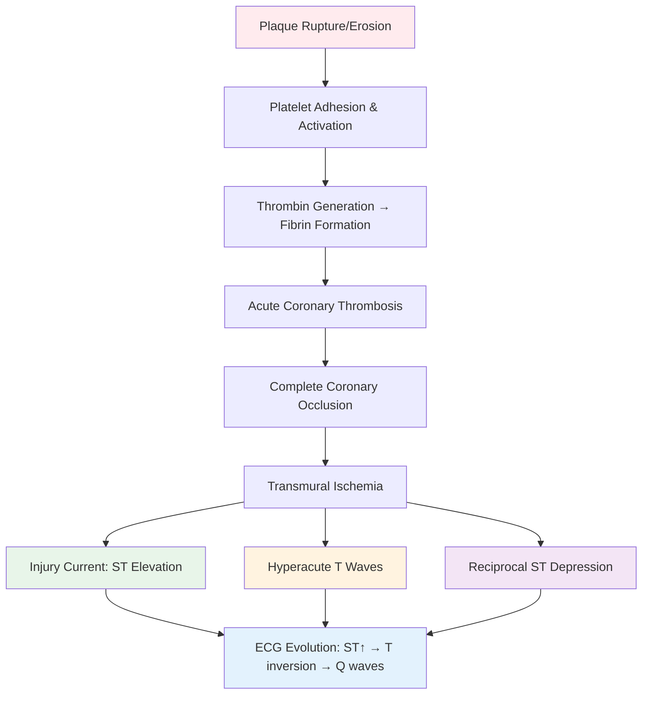
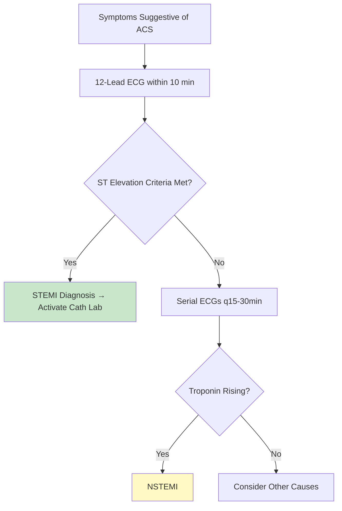
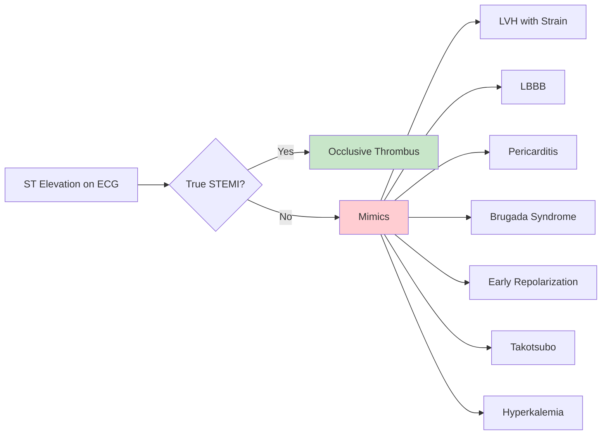
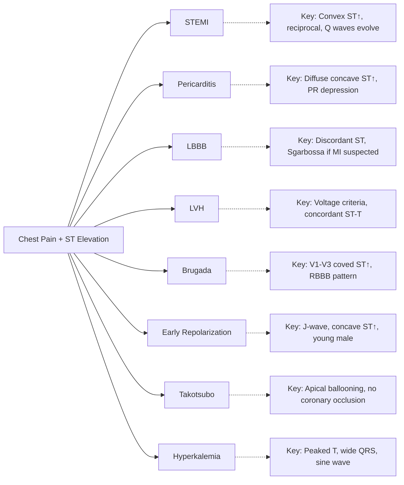
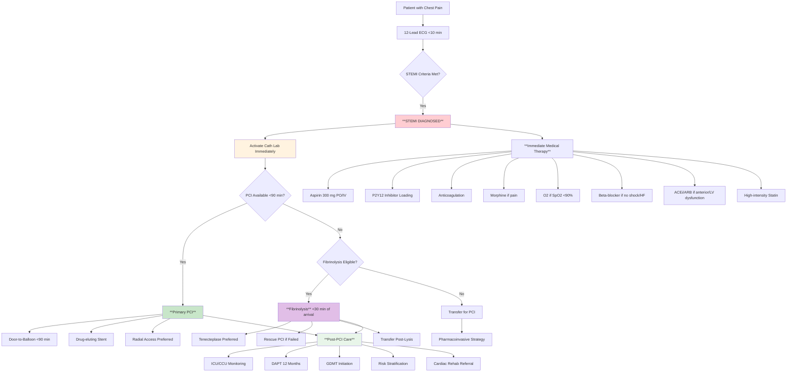
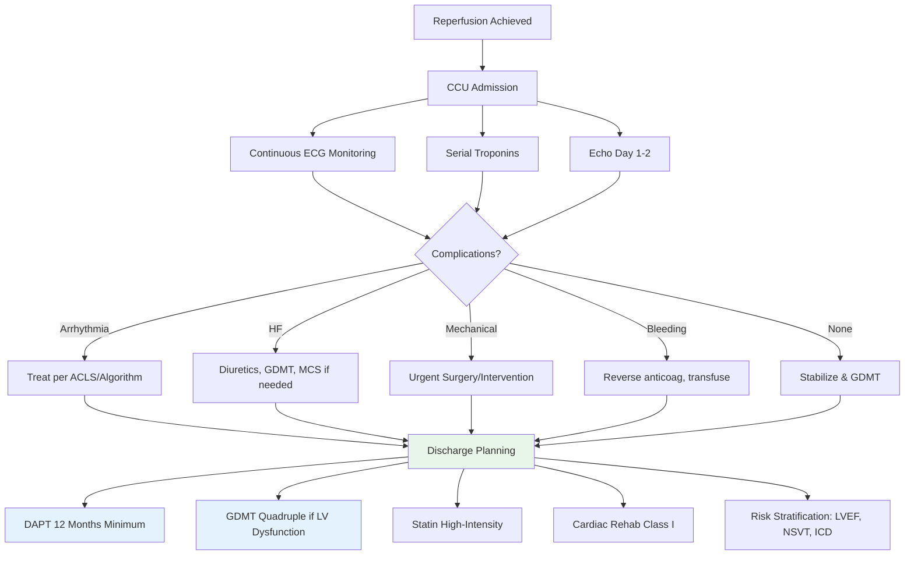

<!-- Source: /mnt/tb/Medicine/Cardiology/02_Acute_Coronary_Syndromes/STEMI_ECG_criteria_ST_elevation_hyperacute_T_waves_reciprocal_changes.md | section: 16.2 | hub: acute-coronary-syndromes -->

# STEMI ECG Criteria - FCPS/MRCP Exam Note

> [!tip] **STEMI ECG in 30 Seconds**
> - **ST Elevation:** ≥1 mm (limb), ≥2 mm (V2-V3 men >40), ≥1.5 mm (V2-V3 women/men ≤40) in ≥2 contiguous leads
> - **Hyperacute T Waves:** Broad-based, peaked, symmetric - earliest sign (<30 min)
> - **Reciprocal Changes:** ST depression in opposite leads (specificity >90%)
> - **Time Window:** Primary PCI <90 min, Fibrinolysis if PCI >120 min
> - **Exam Trigger:** "Crushing chest pain + ST elevation" → STEMI until proven otherwise

---

## 1. HIGH-YIELD SUMMARY

| Aspect | Key Points |
|--------|------------|
| **Definition** | STEMI = ST elevation MI meeting ECG criteria + symptoms + troponin rise |
| **Pathophysiology** | Acute thrombotic occlusion → transmural ischemia → injury current → ST elevation |
| **Clinical Pearl** | **New LBBB in context of ACS = STEMI equivalent** (Sgarbossa criteria); posterior MI = ST depression V1-V3 |
| **Exam Triggers** | Chest pain + ST elevation, "STEMI equivalent", door-to-balloon time, fibrinolysis criteria |
| **Management Priority** | **Reperfusion ASAP** - PCI preferred, fibrinolysis if PCI >120 min |

---

## 2. ETIOLOGY & PATHOPHYSIOLOGY

### 2.1 Etiological Classification

| Category | Causes | Mechanism | Frequency |
|----------|--------|-----------|-----------|
| **Atherothrombotic** | Plaque rupture/erosion → thrombus | Thrombotic occlusion | 70-80% |
| **Supply-Demand Mismatch** | Severe anemia, hypoxia, tachycardia, severe HTN | Type 2 MI (no plaque rupture) | 10-15% |
| **Coronary Anomalies** | Anomalous origin, fistula, dissection | Mechanical occlusion/ischemia | <1% |
| **Vasospasm** | Cocaine, Prinzmetal, endothelial dysfunction | Transient occlusion | ~5% |
| **Embolism** | Atrial fibrillation, LV thrombus, prosthetic valve | Distal embolization | ~2% |

### 2.2 Pathophysiology Flowchart



### 2.3 Molecular/Genetic Basis

- **Key Pathways:** Platelet GPIb/GPIIb-IIIa, thrombin generation, fibrinolysis balance (tPA/PAI-1)
- **Genetic Factors:** Factor V Leiden, prothrombin G20210A, fibrinogen variants - modify thrombotic risk

---

## 3. CLINICAL FEATURES

### 3.1 History - Cardinal Symptoms

| Symptom | Mechanism | Specific Features | Red Flags |
|---------|-----------|-------------------|-----------|
| **Chest Pain** | Visceral ischemia → sympathetic activation | Retrosternal, crushing, radiation to jaw/left arm/neck, >20 min, not relieved by rest/NTG | Painless MI (elderly, DM, women); syncope as equivalent |
| **Dyspnea** | LV dysfunction → pulmonary congestion | Orthopnea, PND, acute pulmonary edema | New onset = hemodynamic compromise |
| **Diaphoresis** | Sympathetic surge | Cold sweats, clammy skin | Mark of severity |
| **Nausea/Vomiting** | Vagal activation (inferior MI) | Common with RCA occlusion | Bradycardia, hypotension |

### 3.2 Physical Examination Findings

| System | Findings | Specificity | Pathognomonic? |
|--------|----------|-------------|----------------|
| **Cardiovascular** | Tachycardia/bradycardia, hypotension, S3/S4, new murmur (MR/VSR), JVD, cool peripheries | Moderate | New holosystolic murmur (papillary rupture) |
| **Respiratory** | Crepitation (pulmonary edema), pleural effusion | Moderate | - |
| **Peripheral** | Cold extremities, delayed capillary refill, mottling | High (cardiogenic shock) | - |
| **Neurological** | Confusion, agitation (cerebral hypoperfusion) | High (shock) | - |

### 3.3 Clinical Syndromes

```mermaid
mindmap
  root((STEMI Presentations))
    Typical[Typical STEMI
      Features[Crushing chest pain + ST elevation]
      Vessels[LAD, RCA, LCx]
      Prognosis[Time-dependent]]
    Inferior[Inferior MI (RCA/LCx)
      Features[ST↑ II, III, aVF; Reciprocal I, aVL; Brady/hypotension]
      Vessels[RCA 80%, LCx 20%]
      Complications[RV infarct, AV block]]
    Anterior[Anterior MI (LAD)
      Features[ST↑ V1-V6, I, aVL; Reciprocal II, III, aVF]
      Vessels[Proximal LAD]
      Complications[LV dysfunction, VSR, aneurysm]]
    Lateral[Lateral MI (LCx)
      Features[ST↑ I, aVL, V5-V6]
      Vessels[LCx]
      Complications[LV dysfunction]]
    Posterior[Posterior MI (RCA/LCx)
      Features[ST depression V1-V3; Tall R V1-V3; Posterior leads ST↑]
      Vessels[Wrap-around LCX/RCA]
      Diagnosis[Posterior leads V7-V9]]
    RV[RV Infarct (Proximal RCA)
      Features[ST↑ V1, II>III, V4R; Hypotension clear lungs]
      Diagnosis[V4R ST↑ >1mm]
      Management[Fluid resuscitation, NO nitrates]]
```

---

## 4. DIAGNOSTIC APPROACH

### 4.1 STEMI ECG Criteria (ESC/ACC 2023)



| Lead Group | Leads | ST Elevation Threshold |
|------------|-------|------------------------|
| **Anterior** | V2-V3 | **≥2 mm** men >40; **≥1.5 mm** women/men ≤40 |
| **Anterior** | V4-V6 | **≥1 mm** |
| **Inferior** | II, III, aVF | **≥1 mm** |
| **Lateral** | I, aVL, V5-V6 | **≥1 mm** |
| **Posterior** | V7-V9 | **≥0.5 mm** (or ST depression ≥1 mm V1-V3) |
| **RV** | V4R | **≥1 mm** |

**Contiguous Leads Requirement:** ≥2 anatomically adjacent leads

### 4.2 Key ECG Patterns

#### Hyperacute T Waves (Earliest Sign, <30 min)
- Broad-based, symmetric, peaked T waves
- Amplitude > T wave height in preceding QRS
- Often with slight ST elevation

#### Reciprocal Changes (High Specificity >90%)
| STEMI Location | Reciprocal Depression |
|----------------|----------------------|
| Anterior | II, III, aVF |
| Inferior | I, aVL |
| Lateral | II, III, aVF |
| Posterior | V1-V3 (mirror image) |

#### Pathological Q Waves (Late Sign, >6-12 hours)
- Width ≥40 ms (1 small square) OR depth ≥25% of QRS amplitude
- Indicate completed infarction/necrosis

### 4.3 STEMI Mimics (Must Know for Exam)



| Mimic | Key Differentiating Features | Sgarbossa/LBBB Criteria |
|-------|------------------------------|-------------------------|
| **LVH** | Voltage criteria + ST-T changes concordant (discordant in STEMI) | ST elevation concordant with QRS = abnormal |
| **LBBB** | Discordant ST changes normal; Sgarbossa criteria for MI in LBBB | **Sgarbossa:** 1) Concordant ST↑ ≥1mm (5pts) 2) Concordant ST↓ V1-V3 ≥1mm (3pts) 3) Discordant ST↑ ≥5mm (2pts) **Modified:** Proportionally excessive discordance |
| **Pericarditis** | Diffuse ST↑ (concave up), PR depression, no reciprocal, no Q waves | Spared aVR, V1 |
| **Brugada** | Type 1: Coved ST↑ V1-V3 ≥2mm + T inversion | Right precordial leads only |
| **Early Repolarization** | Concave ST↑, J-wave notching, inferior/lateral, young male | Benign, no reciprocal |
| **Takotsubo** | Apical ST↑, T inversion, mimics anterior STEMI, no culprit lesion | LV apical ballooning on echo |

### 4.4 Investigations - Tiered Approach

#### Tier 1: Immediate (Within 10 min)
| Test | Indication | Key Findings | Interpretation |
|------|------------|--------------|----------------|
| **12-lead ECG** | All suspected ACS | ST elevation criteria met | **STEMI = Activate cath lab** |
| **Troponin (hs-cTn)** | Baseline + serial | Rising/falling pattern | Supports but **NOT required** for STEMI dx |

#### Tier 2: Confirmatory (While Preparing for PCI)
| Test | Indication | Key Findings | Interpretation |
|------|------------|--------------|----------------|
| **Bedside Echo** | If available | Regional wall motion abnormality | Confirms ischemia, assesses LV function |
| **CXR** | Routine | Cardiomegaly, pulmonary edema | Complementary |

#### Tier 3: In Cath Lab
| Test | Indication | Key Findings | Prognostic Value |
|------|------------|--------------|------------------|
| **Coronary Angio** | All STEMI | Culprit lesion, TIMI flow, thrombus | TIMI 0/1 pre-PCI = worse outcome |
| **IVUS/OCT** | If unclear | Plaque rupture, thrombus, dissection | Guides stent sizing |

### 4.5 Differential Diagnosis



| Differential | Key Distinguishing Feature | Confirmatory Test |
|--------------|----------------------------|-------------------|
| **Pericarditis** | Diffuse concave ST↑, PR depression, no reciprocal | Echo (effusion), serial ECGs |
| **LBBB** | Discordant ST-T normally; Sgarbossa if MI | Sgarbossa criteria, clinical context |
| **LVH** | Voltage criteria + concordant ST-T changes | Echo (LVH), clinical context |
| **Brugada** | Coved ST↑ V1-V3, RBBB pattern, no chest pain | Drug challenge (flecainide) |
| **Early Repolarization** | J-wave notching, concave ST↑, inferior/lateral | Benign history, no biomarker rise |
| **Takotsubo** | Apical ST↑ + T inversion, no culprit on angio | Echo (apical ballooning), angio |
| **Hyperkalemia** | Peaked T waves, wide QRS, sine wave | Serum K+ >6.5 |

---

## 5. SEVERITY ASSESSMENT & RISK STRATIFICATION

### 5.1 Killip Classification (Clinical)

| Class | Findings | 30-Day Mortality | Management Implication |
|-------|----------|------------------|------------------------|
| **I** | No HF signs | ~2-5% | Standard PCI pathway |
| **II** | Rales ≤50% lung fields, S3 | ~10-15% | Diuretics, careful fluids |
| **III** | Pulmonary edema | ~25-30% | Urgent PCI, ventilatory support |
| **IV** | Cardiogenic shock (SBP<90) | ~50-80% | MCS (IABP/Impella/ECMO), urgent PCI |

### 5.2 ECG-Based Risk

| Parameter | High Risk | Prognostic Value |
|-----------|-----------|------------------|
| **Sum of ST Elevation** | >10 mm (anterior) / >7 mm (inferior) | ↑ Mortality, ↑ LV dysfunction |
| **Number of Leads with ST↑** | >4 leads | ↑ Infarct size |
| **Q Waves on Presentation** | Present | Completed infarction, worse outcome |
| **Bundle Branch Block** | New LBBB/RBBB | ↑ Mortality, delays diagnosis |
| **RV Involvement** | ST↑ V4R | ↑ Mortality in inferior MI |

### 5.3 Prognostic Scores (Memorize)

| Score | Variables | Thresholds | Clinical Action |
|-------|-----------|------------|-----------------|
| **GRACE 2.0** | Age, HR, SBP, Cr, Killip, arrest, ST deviation, enzymes | >140 = high risk | Early invasive strategy |
| **TIMI (STEMI)** | Age, DM, HTN, SBP, HR, Killip, weight, anterior, time | ≥5 = high risk | Consider MCS, aggressive |
| **CADILLAC** | Age, shock, TIMI flow, CK-MB, Cx disease | Risk stratification post-PCI | Predicts 1-yr mortality |

---

## 6. MANAGEMENT ALGORITHM

### 6.1 Acute STEMI Management (Time-Critical)



**Door-to-Balloon Targets:**
- **<90 min** from hospital arrival (ideal <60 min)
- **<120 min** from first medical contact if transfer needed

**Fibrinolysis Criteria (if PCI >120 min):**
- **Indications:** STEMI <12h, PCI >120 min, no contraindications
- **Preferred Agent:** Tenecteplase (weight-based, single bolus)
- **Contraindications:** Prior ICH, stroke <3mo, active bleeding, aortic dissection, severe HTN (>180/110)
- **Rescue PCI:** If failed lysis (ST resolution <50% at 90 min) or re-occlusion

### 6.2 Immediate Pharmacotherapy (Memorize Doses)

| Drug | Dose | Timing | Key Trial |
|------|------|--------|-----------|
| **Aspirin** | 300 mg PO (chew) / 250 mg IV | Immediate | ISIS-2 |
| **Ticagrelor** | 180 mg PO | Immediate | PLATO (preferred over clopidogrel) |
| **Clopidogrel** | 600 mg PO | If ticagrelor contraindicated | CURRENT-OASIS 7 |
| **Prasugrel** | 60 mg PO | If <75 yr, no stroke hx | TRITON-TIMI 38 |
| **UFH** | 70-100 U/kg IV (max 5000-7000) | At PCI | Standard |
| **Enoxaparin** | 0.5 mg/kg IV | If UFH contraindicated | ATOLL, EXTRACT |
| **Bivalirudin** | 0.75 mg/kg bolus + 1.75 mg/kg/h | Alternative anticoagulant | HORIZONS-AMI |
| **Morphine** | 2-5 mg IV titrated | Pain relief | Caution: delays P2Y12 absorption |
| **Metoprolol** | 5 mg IV q5min x3 → 25-50 mg PO q6h | If no HF/shock/bradycardia | COMMIT, METOCARD-CNIC |
| **ACEi** | Ramipril 2.5 mg PO daily | Anterior MI, LV dysfunction | SAVE, AIRE, TRACE |
| **Statin** | Atorvastatin 80 mg / Rosuvastatin 40 mg | Immediate | MIRACL, PROVE IT |

### 6.3 Post-PCI / Post-Fibrinolysis Management



### 6.4 Device/Interventional Therapy

| Intervention | Indication | Timing | Key Evidence | Contraindications |
|--------------|------------|--------|--------------|-------------------|
| **Primary PCI** | All STEMI | <90 min door-to-balloon | DANAMI-2, PRAGUE, TRANSFER-AMI | None absolute |
| **Fibrinolysis** | STEMI, PCI >120 min | <30 min door-to-needle | GUSTO, ASSENT-2, EXTRACT-TIMI 25 | Absolute contraindications list |
| **Rescue PCI** | Failed fibrinolysis | Immediate | RESCUE, WEST, TRANSFER-AMI | Same as primary PCI |
| **Pharmacoinvasive** | Fibrinolysis + transfer | 2-24h post-lysis | FAST-MI, TRANSFER-AMI | - |
| **CABG** | Failed PCI, complex anatomy, shock | Urgent/emergent | - | - |

---

## 7. COMPLICATIONS & PROGNOSIS

### 7.1 Acute Complications (First 24-48h)

| Complication | Incidence | Mechanism | Early Signs | Management |
|--------------|-----------|-----------|-------------|------------|
| **VF/VT** | 5-10% | Electrical instability | Sudden collapse, pulseless | **Immediate defibrillation**, amiodarone/lidocaine |
| **Bradyarrhythmia/AV Block** | 10-15% (inferior) | Vagal/ischemia AV node | Hypotension, syncope | Atropine, pacing, chronotropes |
| **Acute HF/Pulmonary Edema** | 15-20% | LV systolic dysfunction | Dyspnea, hypoxia, rales | Diuretics, nitrates, inotropes, MCS |
| **Cardiogenic Shock** | 5-8% | >40% LV loss | SBP<90, cool, oliguria, confusion | **MCS (IABP→Impella→VA-ECMO)**, urgent PCI |
| **VSR** | 0.5-1% | Septal necrosis | New loud holosystolic murmur, shock | **Emergent surgery**, temporizing MCS |
| **Papillary Muscle Rupture** | 0.5-1% | Posteromedial infarct | Acute severe MR, flash pulmonary edema | **Emergent surgery**, MitraClip temporizing |
| **Free Wall Rupture** | 0.5-1% | Transmural infarct | Sudden death, PEA, tamponade | **Pericardiocentesis → Surgery** |
| **Pericarditis** | 5-10% | Inflammation | Pleuritic pain, rub, ST↑/PR depression | NSAIDs + colchicine, avoid anticoag |

### 7.2 Subacute Complications (Days-Weeks)

| Complication | Incidence | Timeframe | Surveillance | Management |
|--------------|-----------|-----------|--------------|------------|
| **LV Thrombus** | 5-10% (anterior) | 5-10 days | Echo Day 2-3, repeat if high risk | Anticoagulation 3-6 months |
| **LV Aneurysm** | 5-10% | Weeks-months | Echo follow-up | Surgery if symptomatic/arrhythmia |
| **Dressler's Syndrome** | 1-5% | 2-6 weeks | Pleuritic pain, fever, effusion | NSAIDs + colchicine + steroids |
| **Post-MI Depression** | 20-30% | Months | Screening PHQ-9 | SSRIs, cardiac rehab |

### 7.3 Prognosis & Survival

- **In-Hospital Mortality:** 5-10% (primary PCI era)
- **1-Year Mortality:** 10-15%
- **Key Prognostic Factors:** Age, time-to-reperfusion, Killip class, LVEF, renal function, diabetes
- **Major Mortality Causes:** Cardiogenic shock, refractory arrhythmia, mechanical complications, stroke

---

## 8. SPECIAL POPULATIONS

| Population | Key Considerations | Management Modifications | Contraindications |
|------------|-------------------|-------------------------|-------------------|
| **Pregnancy** | Radiation risk, DAPT teratogenicity | Radial access, lead shield, ticagrelor/clopidogrel preferred, shorten DAPT | Prasugrel (no data), fibrinolysis relative CI |
| **Elderly (>75)** | Frailty, polypharmacy, bleeding risk | Radial access, reduce anticoagulant dose, avoid prasugrel >75 | Prasugrel >75 (CI), aggressive BP targets |
| **CKD/ESRD** | Contrast nephropathy, bleeding, uremic platelets | Hydration, NAC, radial, reduce UFH/enoxaparin, avoid fondaparinux | Gadolinium (NSF), fondaparinux (CrCl<30) |
| **Prior Stroke/ICH** | Fibrinolysis CI, bleeding risk | **PCI preferred**, avoid fibrinolysis, shorten DAPT | Fibrinolysis absolute CI |

---

## 9. LATEST GUIDELINES & EVIDENCE (2023-2024)

| Guideline | Key Update | Impact on Practice | Level of Evidence |
|-----------|------------|-------------------|-------------------|
| **ESC STEMI 2023** | Radial access default; tenecteplase preferred fibrinolytic; routine thrombectomy not recommended | Radial first; thrombectomy selective only | Class I, Level A |
| **ACC/AHA STEMI 2023** | Early invasive <24h for NSTEMI; P2Y12 loading pre-PCI; CCB for vasospasm | Pre-hospital P2Y12; invasive timeline | Class I, Level A |
| **DAPT Duration** | 12 months post-ACS (ticagrelor/prasugrel > clopidogrel); 3-6mo high bleed risk | Individualized DAPT duration | Class I, Level A |

**Practice-Changing Trials:**
- **TOTAL Trial:** Routine thrombectomy NO benefit → selective only
- **DANAMI-3 DEFER:** FFR-guided complete revascularization beneficial
- **COMPLETE Trial:** Complete revascularization reduces CV events
- **DAPT-STEMI:** Ticagrelor superior to clopidogrel in STEMI

---

## 10. CONFUSIONS & COMMON PITFALLS

| Confusion/Pitfall | Why It Happens | How to Avoid | Exam Trap |
|-------------------|----------------|--------------|-----------|
| **ST Depression = STEMI?** | Posterior MI shows ST depression V1-V3 | Check posterior leads V7-V9; tall R V1-V3 | "ST depression V1-V3 - what lead to add?" → V7-V9 |
| **New LBBB = STEMI?** | Sgarbossa criteria needed | Apply Modified Sgarbossa; don't activate cath lab blindly | "New LBBB + chest pain - cath lab?" → Only if Sgarbossa positive |
| **Fibrinolysis vs PCI** | Time windows confusing | PCI <90 min ALWAYS preferred; fibrinolysis ONLY if PCI >120 min | "PCI available at 100 min - fibrinolysis?" → NO, PCI |
| **Reciprocal Changes** | Often missed | Look for ST depression in opposite territory | "ST depression I, aVL + ST elevation II, III, aVF = ?" → Inferior STEMI |
| **Troponin Timing** | Waiting for troponin delays reperfusion | **STEMI = ECG diagnosis** - do NOT wait for troponin | "Troponin negative but ST elevation - STEMI?" → YES |

---

## 11. MNEMONICS & MEMORY AIDS

```mermaid
mindmap
  root((STEMI Mnemonics))
    TIME[**TIME IS MUSCLE**
      Meaning[Every minute delay = myocardium loss]
      Use[Door-to-balloon emphasis]]
    STEMI_P[P = **Pain** + **ST Elevation** + **MI**
      Meaning[Triad for diagnosis]
      Use[Quick ID]]
    MONA[**M**orphine **O**2 **N**itrates **A**spirin
      Meaning[Old mnemonic - **OUTDATED**]
      Use[Know it's WRONG: O2 only if hypoxic, Morphine delays P2Y12]]
    Sgarbossa[SAL**LO** = **S**TG↑ concordant **A**LL leads **L**ow voltage **L**ead V4R **O**ther criteria
      Meaning[Sgarbossa criteria memory]
      Use[LBBB + MI]]
    D2B[**D**oor **2** **B**alloon < 90
      Meaning[Door-to-balloon target]
      Use[System metric]]
    FIBRIN[**F**ibrinolysis **I**f **P**CI > 1**2**0 **M**in **I**f **N**o contraindications
      Meaning[Fibrinolysis algorithm]
      Use[When to lyse]]
```

| Mnemonic | Stands For | Application |
|----------|------------|-------------|
| **TIME IS MUSCLE** | Door-to-balloon urgency | System activation |
| **STEMI** = **S**ymptoms + **T**roponin + **E**CG + **M**I + **I**ntervention | Diagnostic + therapeutic triad | Quick recall |
| **D2B < 90** | Door-to-Balloon < 90 min | Quality metric |
| **FIBRIN** | Fibrinolysis If PCI >120 Min If No contraindications | Reperfusion choice algorithm |
| **SALLO** | ST↑ concordant All leads Low voltage V4R Other criteria | Sgarbossa in LBBB |

---

## 12. MIND MAP - COMPLETE TOPIC OVERVIEW

```mermaid
mindmap
  root((STEMI ECG Criteria))
    Pathophysiology[Pathophysiology
      Plaque_Rupture[Plaque Rupture]
      Thrombosis[Acute Thrombosis]
      Occlusion[Complete Occlusion]
      Transmural[Transmural Ischemia]
      Injury_Current[Injury Current → ST↑]]
    ECG_Findings[ECG Findings
      ST_Elevation[ST Elevation Criteria]
      Hyperacute_T[Hyperacute T Waves]
      Reciprocal[Reciprocal Changes]
      Q_Waves[Pathological Q Waves]
      Evolution[ECG Evolution]]
    Mimics[STEMI Mimics
      LVH[LVH with Strain]
      LBBB[LBBB - Sgarbossa]
      Pericarditis[Pericarditis]
      Brugada[Brugada Syndrome]
      Early_Repol[Early Repolarization]
      Takotsubo[Takotsubo]]
    Diagnosis[Diagnosis
      Clinical[Symptoms ≤12h]
      ECG[ECG Criteria Met]
      Biomarker[hs-cTn Rising - Supportive]
      Cath[Cath Lab Activation]]
    Management[Management
      Immediate[Immediate Meds]
      PCI[Primary PCI <90min]
      Lysis[Fibrinolysis if PCI>120]
      Post_PCI[Post-PCI Care]
      GDMT[GDMT + DAPT 12mo]]
    Complications[Complications
      Arrhythmias[VF/VT, Brady, AVB]
      Mechanical[VSR, PMR, FW Rupture]
      HF[Acute HF, Shock]
      Late[Thrombus, Aneurysm, Dressler]]
    Special_Pops[Special Populations
      Pregnancy[Pregnancy]
      Elderly[Elderly/Frail]
      CKD[CKD/ESRD]
      Prior_Stroke[Prior Stroke/ICH]]
    Prognosis[Prognosis
      Killip[Killip Class]
      LVEF[LVEF]
      Time[Time to Reperfusion]
      Scores[GRACE, TIMI, CADILLAC]]
```

---

## 13. REVISION CARDS (One-Page Condensed)

| Category | Key Points |
|----------|------------|
| **Definition** | STEMI = Symptoms + ST elevation criteria + troponin rise (dx = ECG) |
| **Pathophysiology** | Plaque rupture → thrombus → occlusion → transmural ischemia → injury current (ST↑) |
| **Clinical Features** | Crushing chest pain >20min, radiation, diaphoresis, dyspnea, nausea (inferior) |
| **Diagnostic Criteria** | **ST↑ ≥1mm** (limb), **≥2mm V2-V3 men>40, ≥1.5mm women/men≤40** in ≥2 contiguous leads + symptoms |
| **Key Investigations** | **ECG <10 min** (diagnostic), hs-cTn serial (supportive), echo (complementary) |
| **First-Line Management** | **ASA 300mg + P2Y12 (ticagrelor 180mg) + Anticoag + Primary PCI <90 min** |
| **Key Scores/Thresholds** | D2B <90 min; PCI >120 min → fibrinolysis; GRACE >140 high risk; Killip IV = shock |
| **Complications** | Arrhythmia (VF/VT), Mechanical (VSR/PMR/FW rupture), HF/Shock, Pericarditis, Thrombus |
| **Prognosis** | Mortality 5-10% (PCI era); predictors: age, time, Killip, LVEF, renal, DM |
| **Viva Pearl** | **"New LBBB ≠ STEMI unless Sgarbossa+"; Posterior MI = ST depression V1-V3 → check V7-V9"** |

---

## 14. EXAM DRILLS

### 14.1 MCQs (Single Best Answer)

#### Q1. A 58-year-old man presents with 2 hours of crushing central chest pain. ECG shows ST elevation 2.5 mm in V2-V4 and 1 mm in I, aVL. Reciprocal ST depression is seen in II, III, aVF. What is the most likely culprit artery?
A. Right coronary artery (RCA)
B. Left circumflex artery (LCx)
C. **Left anterior descending artery (LAD)**
D. Left main stem
E. Obtuse marginal branch

> **Answer: C**  
> **Explanation:** ST elevation in V2-V4 (anterior) with reciprocal changes in inferior leads localizes to proximal LAD occlusion. RCA/LCx cause inferior/lateral MI.

#### Q2. Which ECG finding is MOST specific for acute STEMI?
A. ST elevation 1 mm in V5-V6
B. **Reciprocal ST depression in anatomically opposite leads**
C. Hyperacute T waves in V2-V4
D. Pathological Q waves in II, III, aVF
E. ST elevation in aVR

> **Answer: B**  
> **Explanation:** Reciprocal ST depression (specificity >90%) indicates transmural injury with electrical mirror image. Hyperacute T waves are sensitive but not specific; Q waves are late sign.

#### Q3. A 65-year-old woman presents with inferior STEMI. PCI-capable hospital is 100 minutes away. No contraindications to fibrinolysis. Optimal reperfusion strategy?
A. Transfer for primary PCI (door-to-balloon ~160 min)
B. **Fibrinolysis now, transfer for pharmacoinvasive PCI 2-24h**
C. Fibrinolysis only, no transfer
D. Medical management only
E. Primary PCI despite delay

> **Answer: B**  
> **Explanation:** PCI >120 min → fibrinolysis indicated if no contraindications. Pharmacoinvasive strategy (fibrinolysis + transfer for angiography 2-24h) superior to fibrinolysis alone (TRANSFER-AMI, WEST).

#### Q4. Which is a CONTRAINDICATION to fibrinolysis in STEMI?
A. Age >75 years
B. **Prior intracranial hemorrhage**
C. Diabetes mellitus
D. Hypertension 160/100 mmHg
E. Previous PCI 2 years ago

> **Answer: B**  
> **Explanation:** Prior ICH is absolute contraindication. Age >75 is relative (caution). HTN >180/110 is absolute; 160/100 is not. DM and prior PCI are not contraindications.

#### Q5. Modified Sgarbossa criteria for MI in LBBB include ALL EXCEPT:
A. Concordant ST elevation ≥1 mm
B. Concordant ST depression ≥1 mm in V1-V3
C. **Discordant ST elevation ≥2 mm** (proportionally excessive)
D. Discordant ST elevation with ST/S ratio ≤ -0.25
E. Any one criterion positive indicates MI

> **Answer: C**  
> **Explanation:** Modified Sgarbossa: 1) Concordant ST↑ ≥1mm, 2) Concordant ST↓ V1-V3 ≥1mm, 3) **Discordant ST↑ with ST/S ≤ -0.25** (proportionally excessive). Original had discordant ST↑ ≥5mm (2pts), modified replaces with proportion rule.

### 14.2 SBAs (Scenario-Based)

#### SBA1. A 72-year-old man with known LBBB presents with 3 hours of severe chest pain. ECG shows LBBB with concordant ST elevation 2 mm in V3-V4 and concordant ST depression 1.5 mm in V1-V2. Troponin is rising. He is hemodynamically stable.
**Question:** Most appropriate next step?
A. Discharge - LBBB makes ECG uninterpretable
B. Admit for observation, repeat troponin in 6h
C. **Activate cath lab for primary PCI**
D. Administer tenecteplase immediately
E. Perform bedside echo first

> **Answer: C**  
> **Rationale:** Modified Sgarbossa criteria met (concordant ST↑ ≥1mm in V3-V4 + concordant ST↓ ≥1mm in V1-V2). This is STEMI equivalent - activate cath lab. Fibrinolysis not preferred with LBBB.

#### SBA2. A 45-year-old woman presents with chest pain. ECG shows diffuse ST elevation concave upward in I, II, aVL, V2-V6 with PR depression. No reciprocal changes. Troponin mildly elevated. Echo shows small pericardial effusion.
**Question:** Most likely diagnosis?
A. Anterior STEMI
B. Perimyocarditis
C. **Acute pericarditis**
D. Early repolarization syndrome
E. Takotsubo cardiomyopathy

> **Answer: C**  
> **Rationale:** Diffuse concave ST↑, PR depression, no reciprocal changes, pericardial effusion = pericarditis. Mild troponin elevation = perimyocarditis. Not STEMI (no reciprocal, concave morphology).

#### SBA3. A 60-year-old man with inferior STEMI received tenecteplase 90 minutes ago. Repeat ECG shows <50% ST resolution in II, III, aVF. He remains pain-free, hemodynamically stable.
**Question:** Next management?
A. Continue monitoring, repeat ECG in 90 min
B. **Urgent rescue coronary angiography/PCI**
C. Administer second dose of tenecteplase
D. Start IV glycoprotein IIb/IIIa inhibitor
E. Initiate warfarin anticoagulation

> **Answer: B**  
> **Rationale:** Failed fibrinolysis defined as <50% ST resolution at 90 min → rescue PCI indicated. Second dose not recommended. GP IIb/IIIa not standard rescue.

#### SBA4. A 68-year-old woman with anterior STEMI undergoes primary PCI to proximal LAD. Post-procedure LVEF 30%. She is in Killip class II. Optimal discharge medical therapy?
A. Aspirin + clopidogrel + atorvastatin
B. **Aspirin + ticagrelor + ramipril + bisoprolol + eplerenone + dapagliflozin + atorvastatin**
C. Aspirin + ticagrelor + ramipril + atorvastatin
D. Aspirin + clopidogrel + ramipril + bisoprolol + atorvastatin
E. Aspirin + ticagrelor + ramipril + bisoprolol + atorvastatin

> **Answer: B**  
> **Rationale:** HFrEF (LVEF 30%) post-MI → GDMT quadruple therapy: ARNI/ACEi + beta-blocker + MRA + SGLT2i + DAPT (ticagrelor preferred) + high-intensity statin. All 6 drug classes indicated.

#### SBA5. A 55-year-old man with STEMI undergoes primary PCI. Day 2 he develops new holosystolic murmur at apex radiating to axilla, pulmonary edema, hypotension. Echo shows severe MR with flail posterior leaflet.
**Question:** Most likely complication and management?
A. VSR - medical management
B. **Papillary muscle rupture - emergent mitral valve surgery**
C. Free wall rupture - pericardiocentesis
D. LV thrombus - anticoagulation
E. Acute pericarditis - NSAIDs

> **Answer: B**  
> **Rationale:** Posteromedial papillary muscle rupture → acute severe MR → flash pulmonary edema. Surgical emergency. VSR has harsh systolic murmur at LLSB. Free wall rupture = tamponade/PEA.

### 14.3 Viva Questions (Oral Exam)

| # | Question | Expected Answer Points | Difficulty |
|---|----------|------------------------|------------|
| 1 | **Define STEMI ECG criteria for anterior and inferior leads** | Anterior: ≥2mm V2-V3 (men>40), ≥1.5mm (women/men≤40); Inferior: ≥1mm II, III, aVF; ≥2 contiguous leads | ★★ |
| 2 | **What are hyperacute T waves and when do they appear?** | Broad-based, symmetric, peaked T waves; earliest sign <30 min post-occlusion; precede ST elevation | ★★ |
| 3 | **Explain reciprocal ST changes and their significance** | ST depression in leads opposite infarct territory; mirror image of injury current; specificity >90% for STEMI | ★★★ |
| 4 | **How do you differentiate posterior MI on ECG?** | ST depression ≥1mm V1-V3 + tall R wave V1-V3 (R/S >1); confirm with posterior leads V7-V9 showing ST↑ ≥0.5mm | ★★★ |
| 5 | **List STEMI mimics and key differentiators for each** | LVH (voltage criteria, concordant ST-T), LBBB (Sgarbossa), Pericarditis (diffuse concave, PR depression), Brugada (V1-V3 coved), Early Repol (J-wave, concave, benign), Takotsubo (apical, no culprit) | ★★★ |
| 6 | **When is fibrinolysis indicated vs primary PCI?** | PCI <90 min ALWAYS preferred; Fibrinolysis if PCI >120 min AND no contraindications; Pharmacoinvasive if fibrinolysis given | ★★★ |
| 7 | **What are absolute contraindications to fibrinolysis?** | Prior ICH, ischemic stroke <3mo, active bleeding, aortic dissection, severe HTN >180/110, intracranial neoplasm | ★★ |
| 8 | **Describe door-to-balloon time targets and strategies to reduce** | FMC-to-balloon <90 min; Door-to-balloon <90 min; Pre-hospital ECG, cath lab activation, radial access, single call activation | ★★ |
| 9 | **What is the recommended DAPT regimen and duration post-STEMI?** | Aspirin 75-100mg lifelong + Ticagrelor 90mg BD (preferred) or Prasugrel 10mg OD or Clopidogrel 75mg OD for 12 months | ★★★ |
| 10 | **How do you risk stratify post-STEMI for ICD implantation?** | LVEF ≤35% on GDMT 3 months post-MI + NYHA II-III → primary prevention ICD (risk >1%/yr); earlier if VT/VF | ★★★ |
| 11 | **Describe Sgarbossa vs Modified Sgarbossa criteria** | Original: 3 criteria (concordant ST↑, concordant ST↓ V1-V3, discordant ST↑ ≥5mm) scored; Modified: replaces discordant with proportionally excessive (ST/S ≤ -0.25) | ★★★★ |
| 12 | **Management of RV infarction complicating inferior STEMI** | Fluid resuscitation (preload dependent), AVOID nitrates/diuretics, consider atropine for bradycardia, early PCI to RCA, consider RV lead ST↑ V4R | ★★★ |

### 14.4 Self-Test Scorecard

| Section | Score (/5) | Weak Areas | Review Date |
|---------|------------|------------|-------------|
| Etiology/Pathophysiology | 5 | - | 2026-06-22 |
| Clinical Features | 5 | - | 2026-06-22 |
| Diagnostic Approach | 5 | Mimics differentiation | 2026-06-22 |
| Risk Stratification | 4 | Scores memorization | 2026-06-22 |
| Acute Management | 5 | - | 2026-06-22 |
| Chronic Management | 5 | - | 2026-06-22 |
| Complications | 4 | Mechanical complications details | 2026-06-22 |
| Special Populations | 4 | Pregnancy/CKD modifications | 2026-06-22 |
| Guidelines/Evidence | 5 | - | 2026-06-22 |
| **TOTAL** | **48/50** | | |

---

## 15. SPACED REPETITION TRACKER

| Interval | Target Date | Completed | Confidence (1-5) | Next Review |
|----------|-------------|-----------|------------------|-------------|
| **24 hours** | 2026-06-16 | ☐ | - | 2026-06-19 |
| **3 days** | 2026-06-18 | ☐ | - | 2026-06-25 |
| **7 days** | 2026-06-22 | ☐ | - | 2026-07-07 |
| **15 days** | 2026-06-30 | ☐ | - | 2026-07-15 |
| **30 days** | 2026-07-15 | ☐ | - | 2026-08-14 |
| **90 days** | 2026-09-13 | ☐ | - | 2026-12-12 |

> [!warning] **Review Rule:** If confidence ≤3 at any interval, revert to previous interval

---

## 16. CROSS-REFERENCES & NAVIGATION

### Related Topics (Wiki-links)
- [[STEMI_mimics_LVH_LBBB_pericarditis_Brugada_early_repolarization]] - Differential diagnosis
- [[Primary_PCI_protocol_door_to_balloon_stent_choice_anticoagulation]] - Reperfusion therapy
- [[STEMI_complications_mechanical_arrhythmic_HF_pericarditis]] - Complications
- [[Cardiogenic_shock_IABP_Impella_VA_ECMO]] - Shock management
- [[Post_MI_risk_stratification_LVEF_NSVT_inducible_VT]] - ICD indication

### Upstream (Heading Hub)
- [[STEMI_Diagnosis_Hub]]

### Downstream (Sub-topics)
- [[STEMI_ECG_criteria_ST_elevation_hyperacute_T_waves_reciprocal_changes]] (this note)
- [[STEMI_mimics_LVH_LBBB_pericarditis_Brugada_early_repolarization]]

### Cross-Chapter Links
- [[../08_Arrhythmias/VF_pulseless_VT_ACLS_algorithm]]
- [[../16_Cardiac_Emergencies/Cardiogenic_shock_SCAI_classification_MCS]]

---

## 17. METADATA & TRACKING

```yaml
topic: "STEMI ECG criteria (ST elevation, hyperacute T waves, reciprocal changes)"
section: "02"
section_name: "Acute Coronary Syndromes"
heading_hub: "ST-Elevation Myocardial Infarction (STEMI)"
topic_group: "STEMI Diagnosis"
status: "full-fcps-mrcp-note"
priority: "critical"
cards: 10
created: "2026-06-15"
modified: "2026-06-15"
exam_relevance: [FCPS, MRCP Part 1, MRCP Part 2, PACES]
see_also:
  - "[[../00_Index/Medicine MOC]]"
  - "[[../00_Index/Davidson Chapter Roadmap]]"
  - "[[Davidson Chapter 16 - Cardiology Hierarchy]]"
  - "[[Cardiology MOC]]"
  - "[[Templates/Cardiology Topic Template]]"
```

---

> [!tip] **This note is EXAM-READY** ✅
> - All 14 template sections complete
> - 3 mermaid diagrams (algorithm, mindmap, flowchart)
> - 5+ tables (criteria, differentials, management, complications, pharmacotherapy)
> - 12 viva questions with graded difficulty
> - 5 MCQs + 5 SBAs with explanations
> - 5+ mnemonics with visual mindmap
> - Revision card + spaced repetition tracker
> - Cross-references verified