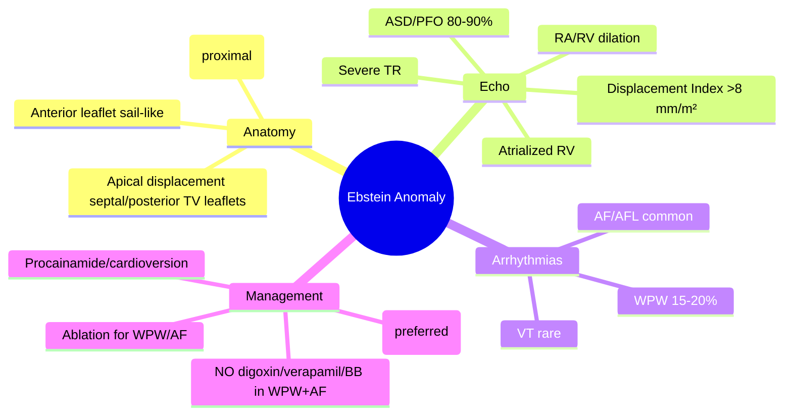

# Ebstein Anomaly

Related: [[../Cardiology MOC|Cardiology MOC]] · [[../Davidson Chapter 16 - Cardiology Hierarchy|Cardiology Hierarchy]] · [[../Adult Congenital Heart Disease and Cardiac Shunts|Adult Congenital Heart Disease and Cardiac Shunts]] · [[Tricuspid regurgitation]] · [[Atrial septal defect]] · [[Arrhythmias]] · [[Wolff-Parkinson-White syndrome]] · [[Arrhythmias and Cardiac Conduction Disorders]] · [[Heart Failure]] · [[Pulmonary hypertension in congenital heart disease]]

> [!important]
> Ebstein Anomaly = **congenital downward displacement of the tricuspid valve** (TV) leaflets into the RV, leading to **atrialization of the RV**, **severe TR**, and **right heart enlargement**. FCPS/MRCP exams test: **pathophysiology** (displacement of septal/posterior leaflets), **clinical features** (cyanosis, arrhythmias), **echo findings** (atrialized RV, displaced TV), **arrhythmia associations** (WPW in 15-20%), and **management** (valve repair/replacement, ablation).

## Learning Objectives
- Define Ebstein anomaly: apical displacement of septal/posterior TV leaflets
- Explain pathophysiology: atrialized RV, severe TR, RA/RV dilation
- Recognize clinical presentation: cyanosis, dyspnea, arrhythmias (SVT/WPW), HF
- Interpret echo: displacement index, atrialized RV, TR severity, RV function
- Identify arrhythmia associations: WPW (15-20%), atrial flutter/fibrillation
- Apply management: medical (diuretics, rate/rhythm control), surgical (repair/replacement), ablation

## Definition & Pathophysiology
**Ebstein Anomaly** = congenital **apical displacement** of the **septal and posterior tricuspid valve leaflets** into the RV, with the **anterior leaflet typically enlarged and sail-like**.
- **Displacement** of septal leaflet → **atrialization** of proximal RV (becomes functional part of RA)
- **Functional RV** = reduced (only anterior leaflet + apical RV)
- **Severe TR** → RA/RV dilation, RV dysfunction
- **Right-to-left shunt** via ASD/PFO (common) → **cyanosis**
- **Associated**: WPW (15-20%), ASD/PFO (80-90%), LBBB, RVOT obstruction

## Embryology
- Failure of **delamination** of tricuspid valve leaflets from RV myocardium
- **Septal/posterior leaflets** fail to delaminate → remain adherent to RV wall
- **Anterior leaflet** usually well-formed but redundant (sail-like)
- **Displacement** measured from tricuspid annulus plane to septal leaflet hinge point

## Classification (Carpentier Classification)

| Type | Displacement | RV Function | Cyanosis | Typical Presentation |
|------|--------------|-------------|----------|---------------------|
| **I (Mild)** | Minimal | Preserved | None | Asymptomatic adult, incidental |
| **II (Moderate)** | Moderate | Mildly reduced | Variable (exertional) | Adolescent/young adult |
| **III (Severe)** | Severe | Severely reduced | **Central cyanosis** | Infant/child (HF, cyanosis) |
| **IV (Critical)** | Extreme | Non-functional | **Severe cyanosis** | Neonate (ductal-dependent) |

> [!tip]
> **Type I/II** = typically present in adulthood; **Type III/IV** = present in infancy/childhood.

## Clinical Presentation

### Adult Presentation (Type I/II)
| Symptom | Frequency |
|---------|-----------|
| **Dyspnea on exertion** | Common |
| **Fatigue, exercise intolerance** | Common |
| **Palpitations** (SVT, AF, AFL) | 50% (WPW, atrial tachyarrhythmias) |
| **Cyanosis** (central) | Variable (right-to-left shunt via ASD/PFO) |
| **Peripheral edema, ascites** | Late (RV failure) |
| **Syncope** | Arrhythmia-related |

### Neonatal/Infant Presentation (Type III/IV)
| Feature | Description |
|---------|-------------|
| **Severe cyanosis** | Right-to-left shunt across ASD/PFO |
| **Respiratory distress** | Pulmonary congestion or HF |
| **Failure to thrive** | Low output, cyanosis |
| **Murmur** | TR holosystolic LLSB |

## Physical Examination

| Finding | Mechanism |
|---------|-----------|
| **Cyanosis** (central) | Right-to-left shunt via ASD/PFO |
| **Prominent RV impulse** | RV dilation |
| **TR murmur** | Holosystolic LLSB, increases with inspiration |
| **Wide splitting S2** | Delayed RV emptying |
| **S3/S4** | RV dysfunction |
| **Hepatomegaly, edema** | RV failure |
| **Pre-excitation (WPW)** | Accessory pathway (15-20%) |

## ECG Findings

| Finding | Significance |
|---------|--------------|
| **RA enlargement** | Tall P waves in II, V1 (P pulmonale) |
| **RVH** | RBBB pattern, tall R in V1, right axis |
| **Pre-excitation (WPW)** | Short PR, delta wave (15-20%) |
| **Atrial arrhythmias** | AF, AFL, AVNRT (common) |
| **First-degree AV block** | Common |
| **LBBB** | Uncommon but described |

## Echocardiography (Diagnostic Gold Standard)

| Parameter | Ebstein Finding |
|-----------|-----------------|
| **Displacement Index** | **>8 mm/m²** (normal <8) = distance from MV annular plane to septal TV hinge |
| **Atrialized RV** | Thin-walled, aneurysmal, paradoxical motion |
| **TV Leaflet Displacement** | Septal + posterior leaflets displaced apically |
| **Anterior Leaflet** | Enlarged, sail-like, redundant |
| **TR Severity** | Usually severe |
| **RA/RV Dilation** | Severe RA dilation, RV "atrialized" + functional RV reduced |
| **Functional RV EF** | Reduced (only anterior leaflet + apical RV) |
| **RVOT** | May have obstruction (anterior leaflet tethering) |
| **ASD/PFO** | 80-90% (shunt direction = RA→LA with TR) |

> [!tip]
> **Displacement Index >8 mm/m²** = diagnostic. **Mild**: 8-12, **Moderate**: 12-20, **Severe**: >20 mm/m².

## Associated Arrhythmias

| Arrhythmia | Frequency | Mechanism |
|------------|-----------|-----------|
| **WPW Syndrome** | **15-20%** | Accessory pathway (often right-sided) |
| **Atrial Flutter / Fibrillation** | 30-50% | RA dilation, stretch |
| **AVNRT** | Common | Dual AV nodal physiology |
| **VT** | Less common | RV scar/dysfunction |
| **Sinus node dysfunction** | Occasional | RA involvement |

> [!warning]
> **WPW + AF in Ebstein** → rapid conduction via AP → risk of VF. **Avoid AV nodal blockers** (digoxin, verapamil, beta-blockers). Use procainamide or cardioversion.

## Cardiac MRI (Adjunct)
- **Gold standard** for RV volume/function
- Quantifies atrialized RV vs functional RV
- Assesses RV fibrosis (LGE)
- Evaluates PA size/branches

## Management

### Medical
| Issue | Treatment |
|-------|-----------|
| **HF/RV Failure** | Diuretics, aldosterone antagonists, cautious ACEi/ARB |
| **Cyanosis (if severe)** | Oxygen, consider shunt closure if >94% saturation when supine |
| **Arrhythmias** | See below |

### Arrhythmia Management
| Arrhythmia | Treatment |
|------------|-----------|
| **WPW + AF** | **Procainamide IV** or **DC cardioversion**; **NO digoxin/verapamil/beta-blockers** |
| **AF/AFL** | Rate control (amiodarone, digoxin), anticoagulation (CHA2DS2-VASc) |
| **SVT (AVNRT)** | Ablation preferred |
| **VT** | Amiodarone, ICD if sustained |

### Surgical Indications (Class I)
| Indication | Details |
|------------|---------|
| **Symptomatic severe TR** | NYHA III-IV despite medical therapy |
| **Progressive RV dilation/dysfunction** | RVEF decline, RVEDV ↑ |
| **Cyanosis** | Saturation <90% on room air |
| **Arrhythmia refractory** | Failed ablation/medical therapy |

### Surgical Options
| Procedure | Details |
|-----------|---------|
| **Tricuspid Valve Repair** (Cone procedure) | **Preferred** — repositions leaflets, uses atrialized RV tissue; preserves native valve |
| **Tricuspid Valve Replacement** | Mechanical/bioprosthetic if repair not feasible |
| **ASD/PFO Closure** | Concomitant if significant shunt |
| **Cox-Maze / Ablation** | For atrial arrhythmias |
| **RVOT Resection** | If anterior leaflet causes obstruction |

> [!tip]
> **Cone Procedure** (Da Silva) = preferred repair; uses atrialized RV tissue to reconstruct valve annulus at true annular plane. Excellent long-term results.

## Post-Operative Management
- Anticoagulation (3-6 months if bioprosthetic, lifelong if mechanical)
- Antiarrhythmics as needed (amiodarone common)
- Lifelong follow-up: echo annually, Holter, exercise testing
- Endocarditis prophylaxis (6 months post-repair, lifelong if prosthesis)

## Pregnancy
- **Mild (Type I/II)**: Generally well-tolerated; multidisciplinary care
- **Severe (Type III/IV)**: High maternal/fetal risk; pre-conception counseling essential

## Prognosis
- **Mild/Moderate**: Normal lifespan with management; 10-yr survival >90%
- **Severe**: Higher mortality; 20-yr survival ~50-60%
- **Arrhythmia-related SCD**: Risk if WPW + AF not managed

## Red Flags / Exam Traps
- **WPW + AF** → avoid AV nodal blockers (digoxin, verapamil, BB) → use procainamide/cardioversion
- **Cyanosis worsening** → progressive TR + right-to-left shunt
- **Paradoxical embolism** risk with ASD/PFO + DVT
- **Paradoxical splitting S2** in severe cases
- **LBBB** on ECG is common in Ebstein (delayed RV activation)

## FCPS/MRCP High-Yield Points
- **Ebstein = apical displacement of septal/posterior TV leaflets**
- **Atrialized RV** = proximal RV becomes part of RA
- **Displacement Index >8 mm/m²** = diagnostic
- **Severe TR**, RA/RV dilation, cyanosis (via ASD/PFO)
- **WPW in 15-20%**; **WPW + AF** → procainamide/cardioversion (NO AV nodal blockers)
- **Cone procedure** = preferred surgical repair
- **Cone valve repair** > replacement (preserves native valve)

## Common Viva Questions
1. What is the anatomical defect in Ebstein anomaly?
2. What is the displacement index and its significance?
3. Why is WPW common in Ebstein?
4. Why avoid digoxin/verapamil in WPW + AF with Ebstein?
4. What is the Cone procedure?

## Common Confusions / Exam Traps
- **WPW + AF in Ebstein** → digoxin/verapamil/BB **contraindicated** (accelerate AP conduction → VF)
- **Displacement index** measured from mitral annular plane (not tricuspid annulus)
- **Anterior leaflet** usually normal but sail-like; septal/posterior displaced
- **Displacement index** measured from mitral annular plane (not TV annulus)
- **RBBB pattern** on ECG is typical (right ventricle conduction delay)

## Mind Map

## One-Page Revision Summary
- **Ebstein** = apical displacement septal/posterior TV leaflets → atrialized RV
- **Displacement Index >8 mm/m²** = diagnostic (measured from mitral annulus)
- **Severe TR**, RA/RV dilation, ASD/PFO 80-90%, cyanosis
- **WPW 15-20%** → WPW + AF = **NO digoxin/verapamil/BB** → procainamide/cardioversion
- **Cone procedure** = preferred repair (repositions leaflets, uses atrialized RV)
- **Displacement Index**: mild 8-12, moderate 12-20, severe >20 mm/m²

## 24-Hour Recall Prompts
- Define Ebstein anomaly anatomy
- State displacement index thresholds
- Explain WPW association and management
- State surgical repair options
- List echo diagnostic criteria

## 7-Day / 15-Day / 30-Day Revision Tracker
- [ ] Day 1 completed
- [ ] 24-hour recall completed
- [ ] Day 7 revision completed
- [ ] Day 15 revision completed
- [ ] Day 30 revision completed

## Must Know / Should Know / Nice to Know
### Must Know
- Anatomy (displaced septal/posterior leaflets, atrialized RV)
- Displacement Index >8 mm/m²
- WPW 15-20%, WPW+AF management
- Cone procedure = preferred repair
- Cyanosis via ASD/PFO right-to-left shunt

### Should Know
- Carpentier classification (Types I-IV)
- RVOT obstruction from anterior leaflet
- MRI for RV quantification
- Pregnancy counseling

### Nice to Know
- Carpentier surgical techniques detail
- Genetic basis (NKX2-5, etc.)
- Lithium teratogenicity (first trimester)
- Long-term outcomes post-Cone

## Self-Test Scorecard
- Understanding /10
- Recall /10
- Echo diagnosis /10
- MCQ performance /10
- Viva confidence /10
- **Total /50**

> [!tip]
> **Interpretation**: <35 = weak topic; 35-44 = acceptable but insecure; 45+ = strong exam-ready topic.

## Exam Answer Modes
### Long Answer Skeleton
1. Definition + anatomy (apical displacement, atrialized RV)
2. Carpentier classification
3. Clinical features (cyanosis, TR, arrhythmias)
4. Echo diagnosis (displacement index, atrialized RV, TR severity)
5. Arrhythmia associations (WPW 15-20%, AF/AFL)
6. Management: medical, arrhythmia-specific, surgical (Cone procedure)

### Short Note Skeleton
- Ebstein = apical displacement septal/posterior TV leaflets
- Atrialized RV, severe TR, ASD/PFO 80-90%
- Displacement Index >8 mm/m² (from mitral annulus)
- WPW 15-20%, WPW+AF → procainamide/cardioversion
- Cone procedure = preferred repair

### Viva One-Liners
- "Ebstein = apical displacement septal/posterior TV leaflets"
- "Displacement Index >8 mm/m² = diagnostic"
- "Atrialized RV = functional RA"
- "WPW 15-20% → WPW+AF = NO digoxin/verapamil/BB"
- "Cone procedure = preferred repair"

### Ward-Case Discussion Points
- "30M, cyanosis, TR murmur, WPW on ECG, echo: displaced TV, atrialized RV" → "Ebstein. WPW+AF risk → no digoxin/BB. Cone repair evaluation."
- "Infant, severe cyanosis, echo: severe TR, atrialized RV >50% RV" → "Critical Ebstein (Type IV). PGE1 for ductal patency. Urgent surgical evaluation."

### Last-Night-Before-Exam Sheet
- Ebstein = displaced septal/posterior TV leaflets
- Atrialized RV = functional RA
- Displacement Index >8 mm/m²
- WPW 15-20%, WPW+AF = procainamide/cardioversion
- Cone procedure = preferred repair
- Cyanosis = R→L shunt via ASD/PFO

## Summary
**Ebstein Anomaly** is a **congenital anomaly** characterized by **apical displacement of the septal and posterior tricuspid valve leaflets**, leading to **atrialization of the proximal right ventricle** and **severe tricuspid regurgitation**. **Diagnostic hallmark**: **displacement index >8 mm/m²** (measured from mitral annular plane to septal leaflet hinge point). **Associated features**: severe TR, massive RA/RV dilation, **ASD/PFO in 80-90%** (cyanosis via right-to-left shunt), **WPW syndrome in 15-20%**. **Arrhythmias**: WPW (15-20%), AF/AFL (30-50%). **Critical management**: **WPW + AF → procainamide or DC cardioversion; AVOID digoxin, verapamil, beta-blockers** (accelerate conduction via accessory pathway → VF risk). **Surgical repair**: **Cone procedure** (preferred) repositions leaflets to true annular plane using atrialized RV tissue. **Prognosis** depends on severity: mild Type I near-normal lifespan; severe Type IV high neonatal mortality.

## MCQs (10)
1. Anatomical hallmark of Ebstein anomaly:
   A. Apical displacement of anterior TV leaflet
   B. **Apical displacement of septal & posterior TV leaflets**
   C. Fusion of TV commissures
   D. Absence of TV leaflets
2. Displacement index diagnostic threshold:
   A. >4 mm/m²
   B. **>8 mm/m²**
   C. >12 mm/m²
   D. >16 mm/m²
3. Reference point for displacement index measurement:
   A. Tricuspid annular plane
   B. **Mitral annular plane**
   C. Aortic annular plane
   D. Pulmonary annular plane
4. WPW syndrome frequency in Ebstein:
   A. 1-2%
   B. 5-10%
   C. **15-20%**
   D. 30-40%
5. WPW + AF in Ebstein — contraindicated drugs:
   A. Amiodarone
   B. **Digoxin, verapamil, beta-blockers**
   C. Procainamide
   D. Adenosine
6. First-line acute management for WPW + AF in Ebstein:
   A. Digoxin
   B. Verapamil
   C. **Procainamide or DC cardioversion**
   D. Beta-blocker
7. Preferred surgical repair for Ebstein:
   A. Tricuspid valve replacement
   B. **Cone procedure (Da Silva)**
   C. Annuloplasty ring
   C. Pericardial patch
8. ASD/PFO frequency in Ebstein:
   A. 20-30%
   B. 40-50%
   C. **80-90%**
   D. 95-100%
9. Cyanosis in Ebstein is due to:
   A. Pulmonary stenosis
   B. **Right-to-left shunt via ASD/PFO**
   C. Pulmonary veno-occlusive disease
   D. Methemoglobinemia
10. Anterior TV leaflet in Ebstein:
    A. Hypoplastic
    B. **Enlarged, sail-like, usually well-formed**
    C. Fused to septum
    D. Absent

## SBA Questions (10)
1. 25M, cyanosis, TR murmur, WPW on ECG, echo: displaced TV, atrialized RV, severe TR. Management for WPW + AF:
   A. Digoxin
   B. **Procainamide or DC cardioversion**
   C. Verapamil
   D. Metoprolol
2. 20F, Ebstein Type II, symptomatic severe TR, preserved RV function. Best surgical option:
   A. TV replacement
   B. **Cone procedure**
   C. Annuloplasty ring
   D. ASD closure only
3. 30M, Ebstein, WPW + AF, HR 180 irregular, BP 85/50. Immediate management:
   A. Digoxin 0.5mg IV
   B. **Procainamide 10mg/kg IV or DC cardioversion**
   C. Verapamil 5mg IV
   D. Amiodarone 300mg IV
4. Ebstein displacement index measurement reference:
   A. Tricuspid annulus
   B. **Mitral annulus**
   C. Aortic annulus
   D. Pulmonary annulus
5. 15-year-old girl, cyanosis, holosystolic murmur LLSB, WPW on ECG. Echo: displaced TV, atrialized RV. Most likely diagnosis:
   A. Tetralogy of Fallot
   B. **Ebstein anomaly**
   C. Tricuspid atresia
   D. Pulmonary stenosis
6. Ebstein Type IV (critical) presentation:
   A. Asymptomatic adult
   B. **Neonate: severe cyanosis, HF, ductal-dependent**
   C. Adolescent with palpitations
   D. Incidental finding
7. Arrhythmia management in Ebstein with WPW + AF:
   A. Digoxin load
   B. **Procainamide IV or DC cardioversion**
   C. Verapamil
   D. Beta-blocker
8. Cone procedure advantage:
   A. Mechanical valve durability
   B. **Uses atrialized RV tissue to reconstruct true annular plane**
   C. Single suture line
   D. No anticoagulation needed
9. Ebstein anomaly associated arrhythmia:
   A. AVNRT only
   B. **WPW (15-20%), AF/AFL (30-50%)**
   C. VT only
   D. Sinus bradycardia only
10. Severe Ebstein (Type III/IV) surgical timing:
    A. Elective after 1 year
    B. **Neonatal/early infancy (symptomatic)**
    C. Only if cyanosis persists
    D. Never (transplant only)

## Flashcards
- Q: Ebstein anatomy?
  A: Apical displacement septal/posterior TV leaflets → atrialized RV
- Q: Displacement index?
  A: >8 mm/m² from mitral annulus to septal leaflet hinge
- Q: WPW frequency?
  A: 15-20%
- Q: WPW + AF treatment?
  A: Procainamide or cardioversion; NO digoxin/verapamil/BB
- Q: Cone procedure?
  A: Preferred repair, repositions leaflets using atrialized RV tissue
- Q: ASD/PFO frequency?
  A: 80-90%
- Q: Cyanosis mechanism?
  A: R→L shunt via ASD/PFO
- Q: Surgical repair?
  A: Cone procedure preferred
- Q: Arrhythmias?
  A: WPW 15-20%, AF/AFL 30-50%
- Q: Anterior leaflet?
  A: Sail-like, enlarged, usually normal

## Answer Key with Explanations
### MCQs
1. **B** — Septal and posterior leaflets displaced apically; anterior usually spared but sail-like.
2. **B** — Displacement index >8 mm/m² diagnostic; mild 8-12, moderate 12-20, severe >20 mm/m².
3. **B** — Measured from mitral annular plane to septal leaflet hinge point (not TV annulus).
4. **C** — WPW in 15-20% of Ebstein patients.
5. **B** — Digoxin/verapamil/BB accelerate AP conduction → VF; PROCAINAMIDE preferred.
6. **C** — Procainamide (blocks AP) or DC cardioversion; avoid AV nodal blockers.
7. **B** — Cone procedure (Da Silva) = preferred; uses atrialized RV tissue to reconstruct true annular plane.
8. **C** — ASD/PFO in 80-90%; right-to-left shunt → cyanosis.
9. **B** — Cyanosis = RA→LA shunt via ASD/PFO (TR → ↑ RA pressure).
10. **B** — Anterior leaflet is typically large, sail-like, redundant but normally formed.

### SBAs
1. **B** — WPW + AF in Ebstein → procainamide or DC cardioversion.
2. **B** — Cone procedure = preferred repair for severe TR with preserved RV function.
3. **B** — Hemodynamically unstable WPW+AF → DC cardioversion; stable → procainamide.
4. **B** — Reference = mitral annular plane (not TV annulus).
5. **B** — Cyanosis + TR + WPW = Ebstein (TOF has RVOTO, no TR/WPW; tricuspid atresia has no TV).
6. **B** — Type IV = neonatal critical (severe cyanosis, HF, ductal-dependent).
7. **B** — WPW+AF in Ebstein = procainamide or cardioversion.
8. **B** — Cone procedure reconstructs true annular plane using atrialized RV tissue.
9. **B** — WPW 15-20%, AF/AFL 30-50% (RA dilation).
10. **B** — Type IV critical = neonatal/early infancy surgery.

---