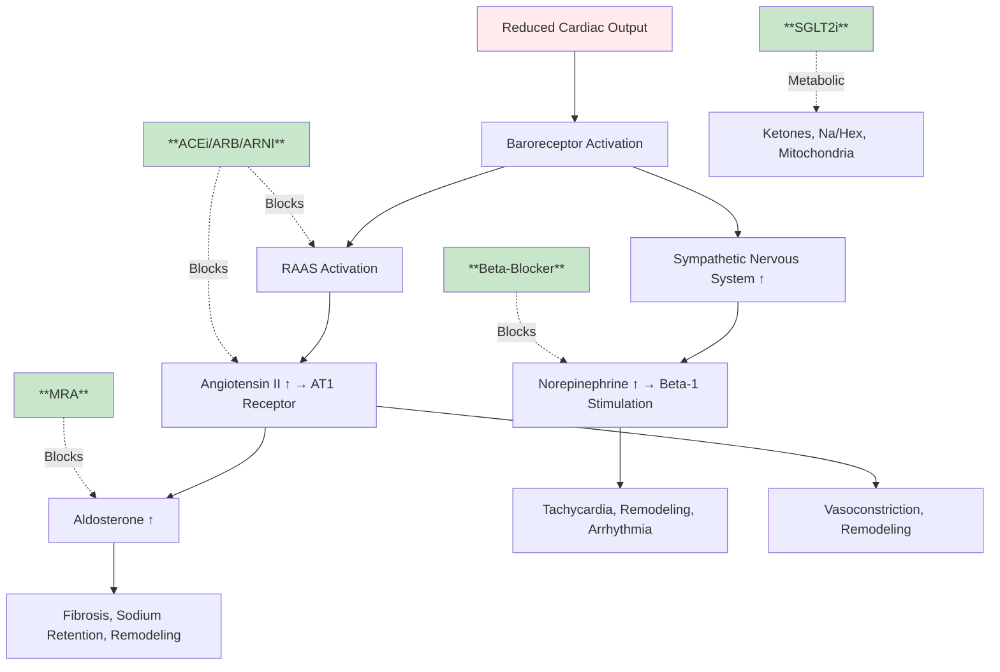
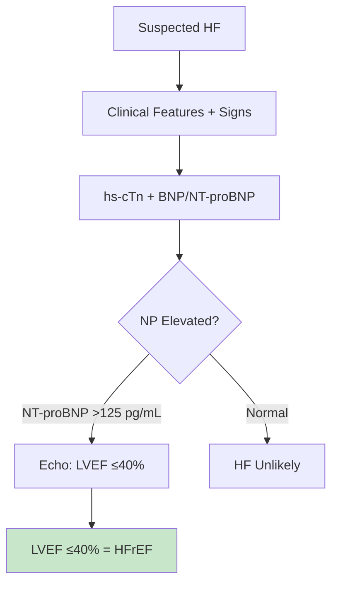

# HFrEF GDMT Quadruple Therapy - FCPS/MRCP Exam Note

> [!tip] **HFrEF GDMT in 30 Seconds**
> - **Four Pillars:** ARNI/ACEi/ARB + Beta-blocker + MRA + SGLT2i = **QUADRUPLE THERAPY**
> - **Target:** All 4 classes at max tolerated doses (not just "some")
> - **Sequencing:** Start low, go slow; **ARNI first** preferred (PARADIGM-HF), then beta-blocker, MRA, SGLT2i
> - **Exam Trigger:** "HFrEF LVEF ≤40% → quadruple GDMT before device therapy"
> - **Key Trials:** PARADIGM-HF (ARNI), COPERNICUS/MERIT-HF (BB), RALES/EMPHASIS-HF (MRA), DAPA-HF/EMPEROR-Reduced (SGLT2i)

---

## 1. HIGH-YIELD SUMMARY

| Aspect | Key Points |
|--------|------------|
| **Definition** | HFrEF = LVEF ≤40% + symptoms/signs HF + elevated NPs |
| **Pathophysiology** | Neurohormonal activation (RAAS, SNS) → maladaptive remodeling → progression |
| **Clinical Pearl** | **ARNI (sacubitril/valsartan) REPLACES ACEi/ARB** - do NOT combine; 36h washout ACEi |
| **Exam Triggers** | Drug classes, dosing, sequencing, contraindications, monitoring, trials |
| **Management Priority** | **Initiate ALL 4 classes** before considering devices (ICD/CRT) |

---

## 2. ETIOLOGY & PATHOPHYSIOLOGY

### 2.1 Etiological Classification

| Category | Examples | Frequency | Key Features |
|----------|----------|-----------|--------------|
| **Ischemic** | Prior MI, multivessel CAD | 50-60% | Hibernating myocardium, revascularizable |
| **Non-ischemic Dilated (NICM)** | Idiopathic, genetic, viral, alcohol, peripartum, autoimmune | 30-40% | Genetic testing (TTN, LMNA, FLNC), better response to GDMT |
| **Hypertrophic CM** | Sarcomere mutations | 5-10% | Obstruction, sudden death risk |
| **Restrictive/Infiltrative** | Amyloid (ATTR/AL), sarcoid, iron | <5% | Specific therapies (tafamidis, immunosuppression) |
| **ARVC** | Desmosome mutations (PKP2) | <2% | RV involvement, exercise restriction |

### 2.2 Neurohormonal Pathophysiology & Drug Targets



---

## 3. CLINICAL FEATURES

### 3.1 NYHA vs ACC/AHA Staging

| NYHA Class | Symptoms | ACC/AHA Stage | Description |
|------------|----------|---------------|-------------|
| **I** | No limitation | **A** | At risk (HTN, DM, CAD, family hx) |
| **II** | Slight limitation | **B** | Pre-HF (structural disease, no symptoms) |
| **III** | Marked limitation | **C** | Symptomatic HF (current/prior) |
| **IV** | Symptoms at rest | **D** | Refractory HF (specialized interventions) |

> **Exam Tip:** NYHA = **functional** (changes); ACC/AHA = **progressive** (never regresses)

---

## 4. DIAGNOSTIC APPROACH

### 4.1 Diagnostic Criteria (ESC 2021)



| Test | Threshold | Interpretation |
|------|-----------|----------------|
| **NT-proBNP** | >125 pg/mL (acute >300) | Rule-out if normal (NPV 98%) |
| **BNP** | >35 pg/mL (acute >100) | Rule-out if normal |
| **Echo LVEF** | ≤40% | **HFrEF diagnosis** |
| **Echo LVEF** | 41-49% | **HFmrEF** |
| **Echo LVEF** | ≥50% | **HFpEF** |

---

## 5. SEVERITY ASSESSMENT & PROGNOSTIC SCORES

### 5.1 Key Prognostic Scores

| Score | Variables | Use | Thresholds |
|-------|-----------|-----|------------|
| **MAGGIC** | Age, sex, BMI, LVEF, NYHA, SBP, Cr, DM, COPD, HF etiology, BB, ACEi/ARB | 1-3 yr mortality | <10 low, 10-20 mod, >20 high |
| **Seattle HF Model** | 18 variables including meds, labs, devices | 1-3 yr survival | Online calculator |
| **HCM Risk-SCD** | (For HCM subset) | 5-yr SCD risk | ≥6% = ICD |

---

## 6. MANAGEMENT ALGORITHM - GDMT QUADRUPLE THERAPY

### 6.1 Sequencing & Initiation (2023 ESC/ACC Consensus)

```mermaid
flowchart TD
    A[New HFrEF Diagnosis] --> B[**Step 1: ARNI** (preferred over ACEi)]
    B --> B1[Sacubitril/Valsartan 24/26mg BD<br/>or 49/51mg BD if ACEi naive]
    B --> B2[**Washout 36h** from ACEi]
    B --> B3[Target 97/103mg BD]
    B --> C[**Step 2: Beta-Blocker**]
    C --> C1[Bisoprolol 1.25mg OD → 10mg OD]
    C --> C2[Carvedilol 3.125mg BD → 25-50mg BD]
    C --> C3[Metoprolol succinate 12.5mg OD → 200mg OD]
    C --> D[**Step 3: MRA**]
    D --> D1[Spironolactone 12.5mg OD → 25-50mg OD]
    D --> D2[Eplerenone 25mg OD → 50mg OD]
    D --> E[**Step 4: SGLT2i**]
    E --> E1[Dapagliflozin 10mg OD]
    E --> E2[Empagliflozin 10mg OD]
    E --> F[**Optimize All 4 to Max Tolerated**]
    F --> G[**Device Assessment**]
    G --> G1[ICD if LVEF ≤35% + GDMT 3mo]
    G --> G2[CRT if LBBB QRS≥150ms + NYHA II-IV]
    G --> G3[Advanced if refractory]
    
    style B fill:#c8e6c9
    style C fill:#fff3e0
    style D fill:#e1bee7
    style E fill:#e8f5e9
    style F fill:#e3f2fd
```

> **Key Principle:** **Start low, go slow, but DON'T STOP** - all 4 classes before devices

### 6.2 Drug Dosing Tables (Memorize Target Doses)

#### ARNI (Preferred) / ACEi / ARB
| Drug | Starting Dose | Target Dose | Max Dose | Key Monitoring |
|------|---------------|-------------|----------|----------------|
| **Sacubitril/Valsartan** | 24/26mg BD (49/51mg if ACEi naive) | **97/103mg BD** | 97/103mg BD | K+, Cr, BP (36h washout from ACEi) |
| **Enalapril** | 2.5mg BD | **10-20mg BD** | 20mg BD | K+, Cr, BP |
| **Lisinopril** | 2.5-5mg OD | **20-40mg OD** | 40mg OD | K+, Cr, BP |
| **Ramipril** | 1.25mg OD | **10mg OD** | 10mg OD | K+, Cr, BP |
| **Valsartan** (if ARNI intolerant) | 40mg BD | **160mg BD** | 320mg BD | K+, Cr, BP |

#### Beta-Blockers (Only 3 with Mortality Benefit)
| Drug | Starting Dose | Target Dose | Max Dose | Key Monitoring |
|------|---------------|-------------|----------|----------------|
| **Bisoprolol** | 1.25mg OD | **10mg OD** | 10mg OD | HR, BP, symptoms |
| **Carvedilol** | 3.125mg BD | **25mg BD (50mg if >85kg)** | 50mg BD | HR, BP, dizziness |
| **Metoprolol Succinate (ER)** | 12.5-25mg OD | **200mg OD** | 200mg OD | HR, BP |

> **DO NOT USE:** Atenolol, propranolol, nebivolol (no mortality data in HFrEF)

#### MRA
| Drug | Starting Dose | Target Dose | Max Dose | Key Monitoring |
|------|---------------|-------------|----------|----------------|
| **Spironolactone** | 12.5mg OD | **25mg OD (max 50mg)** | 50mg OD | **K+ (stop if >5.5)**, Cr |
| **Eplerenone** | 25mg OD | **50mg OD** | 50mg OD | K+, Cr (preferred if gynaecomastia) |

#### SGLT2 Inhibitors (Newest Pillar - Class I, Level A)
| Drug | Dose | eGFR Threshold | Key Monitoring |
|------|------|----------------|----------------|
| **Dapagliflozin** | 10mg OD | **≥25 mL/min** (initiate ≥30) | Volume, genital infection, DKA risk |
| **Empagliflozin** | 10mg OD | **≥20 mL/min** | Volume, genital infection, DKA risk |

> **SGLT2i:** Benefit regardless of diabetes; reduce HF hospitalization + CV death

---

## 7. EVIDENCE BASE - KEY TRIALS (Memorize)

| Trial | Drug vs Comparator | Population | Primary Outcome | Key Result |
|-------|-------------------|------------|-----------------|------------|
| **PARADIGM-HF** | Sac/Val vs Enalapril | HFrEF NYHA II-IV | CV death + HF hosp | **↓20% (ARR 4.7%)** |
| **COPERNICUS** | Carvedilol vs Placebo | Severe HFrEF | All-cause mortality | **↓35%** |
| **MERIT-HF** | Metoprolol CR/XL vs Placebo | HFrEF NYHA II-III | All-cause mortality | **↓34%** |
| **CIBIS-II** | Bisoprolol vs Placebo | HFrEF NYHA III-IV | All-cause mortality | **↓34%** |
| **RALES** | Spironolactone vs Placebo | Severe HFrEF NYHA IV | All-cause mortality | **↓30%** |
| **EMPHASIS-HF** | Eplerenone vs Placebo | Mild HFrEF NYHA II | CV death + HF hosp | **↓37%** |
| **DAPA-HF** | Dapagliflozin vs Placebo | HFrEF ± DM | CV death + HF hosp | **↓26%** |
| **EMPEROR-Reduced** | Empagliflozin vs Placebo | HFrEF ± DM | CV death + HF hosp | **↓25%** |

> **Number Needed to Treat (NNT) for 1 year:**
> - ARNI: ~20 | Beta-blocker: ~25 | MRA: ~30 | SGLT2i: ~30

---

## 8. MONITORING & CONTRAINDICATIONS

### 8.1 Monitoring Schedule

| Parameter | Baseline | 1-2 Weeks | 4-6 Weeks | Every 3-6 Months |
|-----------|----------|-----------|-----------|------------------|
| **BP/HR** | ✓ | ✓ | ✓ | ✓ |
| **K+ / Cr / eGFR** | ✓ | ✓ (↑ after MRA/ARNI) | ✓ | ✓ |
| **LVEF (Echo)** | ✓ | - | - | 3-6 mo (if improved) |
| **Weight/Symptoms** | ✓ | ✓ | ✓ | ✓ |
| **NT-proBNP** | ✓ | - | ✓ | 6-12 mo |

### 8.2 Absolute Contraindications

| Drug Class | Contraindications |
|------------|-------------------|
| **ARNI/ACEi/ARB** | Bilateral renal artery stenosis, pregnancy, angioedema history, K+ >5.5 |
| **Beta-Blocker** | Cardiogenic shock, severe bradycardia (<50), 2-3° AV block, severe asthma |
| **MRA** | K+ >5.0 (start), >5.5 (stop); eGFR <30; bilateral RAS; Addison's |
| **SGLT2i** | Type 1 DM, eGFR <20 (dapa) / <20 (empa), pregnancy, DKA history |

### 8.3 Common Reasons for Down-Titration/Discontinuation

| Drug | Reason | Action |
|------|--------|--------|
| **ARNI/ACEi/ARB** | Symptomatic hypotension (SBP<90) | Reduce diuretic first, then down-titrate |
| | K+ >5.5 / Cr ↑ >50% | Hold MRA first, then reduce ARNI/ACEi |
| **Beta-Blocker** | Bradycardia <50 / 2-3° AV block | Reduce dose, check electrolytes |
| | Worsening HF | **Do NOT stop** - reduce other agents first |
| **MRA** | K+ >5.5 / Cr ↑ >50% | **Stop MRA first** |
| | Gynaecomastia (spironolactone) | Switch to eplerenone |

---

## 9. DEVICE THERAPY INDICATIONS (Post-GDMT Optimization)

### 9.1 ICD - Primary Prevention

```mermaid
flowchart TD
    A[HFrEF on GDMT ≥3 months] --> B{LVEF ≤35%?}
    B -->|Yes| C{NYHA II-III?}
    C -->|Yes| D[**ICD Indicated (Class I)**]
    C -->|IV| E[ICD NOT indicated unless transplant candidate]
    B -->|No| F[No ICD for primary prevention]
    D --> G[LVEF reassess 3-6 mo post-GDMT]
    
    style D fill:#c8e6c9
```

- **Indication:** LVEF ≤35%, NYHA II-III, **on optimal GDMT ≥3 months**, life expectancy >1 year
- **Trials:** MADIT-II, SCD-HeFT, DEFINITE
- **Wait 3 months** on GDMT before ICD (LVEF often improves)

### 9.2 CRT - Cardiac Resynchronization Therapy

| Indication | QRS | LVEF | NYHA | Rhythm | Class |
|------------|-----|------|------|--------|-------|
| **LBBB** | **≥150ms** | ≤35% | II-IV | Sinus | **I** |
| **LBBB** | 130-149ms | ≤35% | II-IV | Sinus | IIa |
| **Non-LBBB** | **≥150ms** | ≤35% | II-IV | Sinus | IIa |
| **AF** | ≥130ms | ≤35% | II-IV | AF (rate controlled) | IIa |

> **CRT Response Predictors:** LBBB, female, non-ischemic, QRS >150ms, no RV pacing

---

## 10. SPECIAL POPULATIONS

| Population | Key Modifications |
|------------|------------------|
| **Elderly/Frail** | Lower starting doses, slower titration, monitor falls/orthostasis, deprescribe if needed |
| **CKD/ESRD** | ARNI/ACEi/ARB: monitor K+/Cr closely; SGLT2i ok if eGFR ≥20; MRA avoid if eGFR <30 |
| **Pregnancy** | **ACEi/ARB/ARNI/MRA CONTRAINDICATED**; Hydralazine + nitrate safe; BB (labetalol/metoprolol) ok |
| **African Ancestry** | Better response to hydralazine/nitrate (A-HeFT); consider if ACEi/ARB intolerant |

---

## 11. LATEST GUIDELINES (2023-2024)

| Guideline | Key Update |
|-----------|------------|
| **ESC HF 2023** | **SGLT2i Class I for all HFrEF** (not just DM); ARNI preferred first-line; Quadruple therapy before devices |
| **ACC/AHA HF 2022** | 4 drug classes (ARNI/ACEi/ARB, BB, MRA, SGLT2i) = **foundational therapy**; Initiate simultaneously if tolerated |
| **DAPA-HF/EMPEROR-Reduced** | SGLT2i benefit extends to eGFR ≥20, non-DM, recently hospitalized |

**Practice-Changing:**
- **ARNI FIRST** (not ACEi) - PARADIGM-HF showed superiority
- **SGLT2i FOR ALL** - irrespective of diabetes status
- **SIMULTANEOUS INITIATION** - safe and faster GDMT optimization

---

## 12. CONFUSIONS & COMMON PITFALLS

| Confusion/Pitfall | Why It Happens | How to Avoid | Exam Trap |
|-------------------|----------------|--------------|-----------|
| **ARNI + ACEi together** | Forgot 36h washout | **STOP ACEi 36h BEFORE starting ARNI** - angioedema risk | "Patient on ramipril - switch to ARNI how?" → Stop ramipril, wait 36h, start ARNI |
| **MRA + ACEi/ARB = hyperkalemia** | Not monitoring K+ | Check K+ at 1wk, 4wk, then 3-6mo; **Stop MRA first** if K+>5.5 | "K+ 5.8 on spironolactone + ramipril - stop what?" → Stop spironolactone |
| **Beta-blocker in acute HF** | Fear of decompensation | **CONTINUE** if already on; initiate once euvolemic (low dose) | "ADHF on bisoprolol - stop?" → NO, continue unless shock |
| **SGLT2i only for diabetics** | Name implies diabetes | **Indicated for ALL HFrEF** regardless of DM | "Non-diabetic HFrEF - dapagliflozin?" → YES, Class I |
| **ICD immediately post-MI** | Confusion with timing | **Wait 40 days (DANISH) / 3mo GDMT** for primary prevention | "Post-MI day 5 LVEF 30% - ICD?" → NO, wait 40 days + GDMT |

---

## 13. MNEMONICS & MEMORY AIDS

```mermaid
mindmap
  root((HFrEF GDMT Mnemonics))
    ABS[**A**RNI **B**eta-Blocker **S**GLT2i **M**RA
      Meaning[Four Pillars - Alphabetical]
      Use[Recall all 4 classes]]
    QUAD[**QUAD**ruple Therapy = **Q**UAD
      Meaning[4 classes = quadruple]
      Use[Exam keyword]]
    PARADIGM[**PARADIGM-HF** = **P**rospective **A**RNI **R**eduction **A**nd **D**eath **I**n **G**lobal **M**ortality **H**eart **F**ailure
      Meaning[ARNI trial name]
      Use[ARNI evidence]]
    SGLT2i_ALL[**SGLT2i** = **S**hould **G**ive **L**ike **T**o **2** **A**ll HFrEF
      Meaning[Not just for diabetes]
      Use[Indication recall]]
    WAIT36[**WAIT 36** Hours = ACEi → ARNI washout
      Meaning[Angioedema prevention]
      Use[Switch protocol]]
```

| Mnemonic | Stands For | Application |
|----------|------------|-------------|
| **ABS M** | ARNI, Beta-Blocker, SGLT2i, MRA | Four pillars |
| **QUAD** | Quadruple therapy | Exam trigger word |
| **WAIT 36** | Washout 36h ACEi→ARNI | Switch protocol |
| **K+ FIRST** | Stop MRA first if K+ high | Hyperkalemia management |
| **GDMT 3MO** | GDMT 3 months before ICD | Device timing |

---

## 14. MIND MAP - COMPLETE TOPIC OVERVIEW

```mermaid
mindmap
  root((HFrEF GDMT Quadruple Therapy))
    Diagnosis[Diagnosis
      LVEF[LVEF ≤40%]
      Symptoms[NYHA Symptoms]
      NPs[NT-proBNP >125]]
    Pillars[Four Pillars
      ARNI[ARNI (Sac/Val) - Preferred]
      ACEi_ARB[ACEi/ARB - If ARNI intolerant]
      BB[Beta-Blocker (Bisoprolol/Carvedilol/Metoprolol)]
      MRA[MRA (Spironolactone/Eplerenone)]
      SGLT2i[SGLT2i (Dapagliflozin/Empagliflozin)]]
    Sequencing[Initiation Sequence
      Step1[Step 1: ARNI]
      Step2[Step 2: Beta-Blocker]
      Step3[Step 3: MRA]
      Step4[Step 4: SGLT2i]
      Optimize[Optimize All to Target]]
    Monitoring[Monitoring
      Vitals[BP, HR, Weight]
      Labs[K+, Cr, eGFR]
      Echo[LVEF 3-6mo]
      BNP[NT-proBNP]]
    Contraindications[Contraindications
      ARNI[Angioedema, Pregnancy, Bilat RAS]
      BB[Shock, Brady <50, AV Block]
      MRA[K+>5.5, eGFR<30]
      SGLT2i[eGFR<20/25, T1DM]]
    Devices[Device Therapy
      ICD[ICD: LVEF≤35%, GDMT 3mo, NYHA II-III]
      CRT[CRT: LBBB QRS≥150, LVEF≤35%, NYHA II-IV]
      Advanced[LVAD/Transplant if refractory]]
    Special[Special Populations
      Elderly[Lower doses, slower titration]
      CKD[Close K+/Cr monitoring]
      Pregnancy[No ACEi/ARB/ARNI/MRA]
      African[Hydralazine/Nitrate option]]
    Evidence[Key Trials
      PARADIGM[PARADIGM-HF - ARNI]
      BB_Trials[COPERNICUS/MERIT/CIBIS-II]
      MRA_Trials[RALES/EMPHASIS-HF]
      SGLT2i_Trials[DAPA-HF/EMPEROR-Reduced]]
```

---

## 15. REVISION CARDS

| Category | Key Points |
|----------|------------|
| **Definition** | HFrEF = LVEF ≤40% + symptoms/signs HF + elevated NPs |
| **Pathophysiology** | Neurohormonal activation (SNS, RAAS) → maladaptive remodeling |
| **Clinical Features** | Dyspnea, fatigue, fluid retention, exercise intolerance; NYHA I-IV |
| **Diagnostic Criteria** | LVEF ≤40% on echo + elevated NPs (NT-proBNP >125) |
| **Key Investigations** | Echo (LVEF), NT-proBNP, ECG, CXR, bloods (K+, Cr, Hb, TFT, Fe) |
| **First-Line Management** | **Quadruple GDMT: ARNI + Beta-blocker + MRA + SGLT2i** - all 4 classes |
| **Key Scores/Thresholds** | Target doses: Sac/Val 97/103 BD, Bisoprolol 10 OD, Spiro 25 OD, Dapa 10 OD |
| **Complications** | Hyperkalemia (MRA+ARNI), hypotension, renal dysfunction, bradycardia |
| **Prognosis** | MAGGIC/Seattle HF Model; 1-yr mortality ~10-20% |
| **Viva Pearl** | **"ARNI replaces ACEi (36h washout); SGLT2i for ALL HFrEF; GDMT 3mo before ICD; Stop MRA first for K+>5.5"** |

---

## 16. EXAM DRILLS

### 16.1 MCQs (Single Best Answer)

#### Q1. A 65-year-old man with HFrEF (LVEF 30%) on bisoprolol 5mg OD and ramipril 10mg OD. He is started on sacubitril/valsartan. Correct switch protocol?
A. Add sac/val to ramipril
B. **Stop ramipril, wait 36 hours, then start sac/val**
C. Stop ramipril, start sac/val immediately
D. Halve ramipril dose, add sac/val
E. Stop ramipril, wait 24 hours, start sac/val

> **Answer: B**  
> **Explanation:** ARNI replaces ACEi - mandatory **36-hour washout** to prevent angioedema (bradykinin accumulation).

#### Q2. Which beta-blocker does NOT have mortality benefit in HFrEF?
A. Bisoprolol
B. Carvedilol
C. Metoprolol succinate
D. **Nebivolol**
E. All have benefit

> **Answer: D**  
> **Explanation:** Only bisoprolol, carvedilol, metoprolol succinate (ER) have RCT mortality benefit. Nebivolol (SENIORS) showed benefit in elderly HF but not specifically HFrEF.

#### Q3. A 72-year-old woman with HFrEF (LVEF 28%), eGFR 28 mL/min, K+ 4.8. Which GDMT drug is contraindicated?
A. Dapagliflozin
B. **Spironolactone**
C. Sacubitril/valsartan
D. Bisoprolol
E. Empagliflozin

> **Answer: B**  
> **Explanation:** MRA contraindicated if eGFR <30 (spironolactone) or <30 (eplerenone). SGLT2i OK down to eGFR 20. ARNI/ACEi/ARB require monitoring but not contraindicated.

#### Q4. Target dose of sacubitril/valsartan in HFrEF?
A. 24/26 mg BD
B. 49/51 mg BD
C. **97/103 mg BD**
D. 200/206 mg BD
E. No target, max tolerated

> **Answer: C**  
> **Explanation:** Target dose 97/103 mg BD (PARADIGM-HF dose). Start 24/26 BD (49/51 if ACEi naive).

#### Q5. When is primary prevention ICD indicated in HFrEF?
A. LVEF ≤35% at diagnosis
B. LVEF ≤35% after 1 month GDMT
C. **LVEF ≤35% after 3 months optimal GDMT + NYHA II-III**
D. LVEF ≤40% with NSVT
E. Any HFrEF with syncope

> **Answer: C**  
> **Explanation:** LVEF ≤35%, NYHA II-III, **on optimal GDMT ≥3 months**, life expectancy >1 year. Wait for GDMT optimization (LVEF often improves).

### 16.2 SBAs (Scenario-Based)

#### SBA1. A 68-year-old man with HFrEF (LVEF 30%), NYHA II, BP 110/70, HR 68, K+ 4.2, eGFR 55. He is ACEi-naive. Optimal initial GDMT regimen?
A. Ramipril 2.5mg OD, bisoprolol 1.25mg OD
B. **Sac/Val 49/51mg BD, bisoprolol 1.25mg OD, dapagliflozin 10mg OD, spironolactone 12.5mg OD**
C. Sac/Val 24/26mg BD, bisoprolol 1.25mg OD
D. Ramipril 2.5mg OD, carvedilol 3.125mg BD, empagliflozin 10mg OD
E. Sac/Val 49/51mg BD, metoprolol 12.5mg OD, eplerenone 25mg OD

> **Answer: B**  
> **Rationale:** ACEi-naive → start ARNI 49/51mg BD (PARADIGM-HF); simultaneous initiation of all 4 pillars at low doses now recommended; titrate each to target.

#### SBA2. A 55-year-old woman with HFrEF on sac/val 97/103mg BD, bisoprolol 10mg OD, spironolactone 25mg OD, dapagliflozin 10mg OD. Routine bloods: K+ 5.8, Cr 145 (baseline 110). Action?
A. Stop sac/val, continue others
B. **Stop spironolactone, continue others, recheck K+ in 1 week**
C. Stop all GDMT
D. Reduce sac/val to 24/26mg BD
E. Add sodium polystyrene sulfonate, continue all

> **Answer: B**  
> **Rationale:** **Stop MRA FIRST** for hyperkalemia. MRA is most common cause. Recheck K+ after stopping MRA.

#### SBA3. A 75-year-old man with HFrEF (LVEF 28%), NYHA III, on optimal GDMT for 4 months. Echo shows LVEF 30%, LBBB with QRS 160ms. He is in sinus rhythm. Device indication?
A. ICD only
B. **CRT-D (CRT + ICD)**
C. CRT-P only
D. No device yet
E. ICD + separate CRT later

> **Answer: B**  
> **Rationale:** LVEF ≤35%, NYHA II-IV, LBBB QRS ≥150ms, sinus rhythm → **CRT indicated (Class I)**. Also meets ICD criteria (LVEF ≤35%, GDMT 3mo, NYHA II-III) → **CRT-D**.

#### SBA4. Which SGLT2 inhibitor can be initiated at eGFR 20 mL/min?
A. Dapagliflozin
B. **Empagliflozin**
C. Canagliflozin
D. Ertugliflozin
E. None

> **Answer: B**  
> **Rationale:** Empagliflozin approved down to eGFR 20; Dapagliflozin down to 25 (initiate ≥30).

#### SBA5. A 60-year-old man with HFrEF (LVEF 30%) post-MI 6 weeks ago. On optimal GDMT. LVEF now 32%. ICD indication?
A. Yes, primary prevention now
B. **Wait until 3 months post-MI + 3 months GDMT (total ~4.5 months)**
C. No, LVEF >30%
D. Only if NSVT on Holter
E. Only if syncope

> **Answer: B**  
> **Rationale:** Post-MI: wait 40 days + 3 months GDMT. At 6 weeks post-MI, only 2 weeks GDMT - need 3 months GDMT optimization.

### 16.3 Viva Questions

| # | Question | Expected Answer Points | Difficulty |
|---|----------|------------------------|------------|
| 1 | **List the four pillars of HFrEF GDMT with target doses** | ARNI 97/103 BD, BB (bisoprolol 10/carvedilol 25 BD/metoprolol 200), MRA 25-50, SGLT2i 10 OD | ★★★ |
| 2 | **Why is ARNI preferred over ACEi and how do you switch?** | PARADIGM-HF: 20% RRR; **36h washout** from ACEi to prevent angioedema | ★★★ |
| 3 | **When do you initiate beta-blocker in HFrEF?** | Once euvolemic, start low (bisoprolol 1.25), uptitrate q2w to target; **CONTINUE in ADHF** | ★★ |
| 4 | **MRA monitoring and hyperkalemia management** | K+/Cr at 1wk, 4wk, 3-6mo; **Stop MRA first** if K+>5.5; eGFR<30 contraindicated | ★★★ |
| 5 | **SGLT2i in HFrEF - indications and monitoring** | **ALL HFrEF** (not just DM); eGFR ≥20 (empa) / ≥25 (dapa); monitor volume, genital infection, DKA | ★★★ |
| 6 | **ICD primary prevention criteria in HFrEF** | LVEF ≤35%, NYHA II-III, **GDMT ≥3mo**, life expectancy >1yr; wait 40d post-MI | ★★★ |
| 7 | **CRT indications - QRS morphology and duration** | LBBB ≥150ms (Class I); LBBB 130-149 (IIa); Non-LBBB ≥150 (IIa); AF ≥130 (IIa) | ★★★ |
| 8 | **Sequencing of GDMT initiation - current recommendation** | **Simultaneous low-dose initiation** of all 4 preferred over sequential; titrate each to target | ★★★ |
| 9 | **Contraindications to each GDMT pillar** | ARNI: angioedema, pregnancy, bilateral RAS; BB: shock, brady<50, AV block; MRA: K+>5, eGFR<30; SGLT2i: T1DM, eGFR<20 | ★★ |
| 10 | **MAGGIC score variables and clinical use** | 13 variables (age, sex, LVEF, NYHA, SBP, Cr, DM, COPD, etiology, meds); 1-3yr mortality prediction | ★★ |
| 11 | **Difference between spironolactone and eplerenone** | Spironolactone: anti-androgen (gynaecomastia), cheaper; Eplerenone: selective, no gynaecomastia, renal dosing | ★★ |
| 12 | **Management of symptomatic hypotension on GDMT** | Reduce diuretic FIRST; then down-titrate ARNI/ACEi; BB last; don't stop BB for HF worsening | ★★★ |

### 16.4 Self-Test Scorecard

| Section | Score (/5) | Weak Areas | Review Date |
|---------|------------|------------|-------------|
| Etiology/Pathophysiology | 5 | - | 2026-06-22 |
| Clinical Features | 5 | - | 2026-06-22 |
| Diagnostic Approach | 5 | - | 2026-06-22 |
| GDMT Drugs & Dosing | 5 | Target doses memorization | 2026-06-22 |
| Sequencing/Monitoring | 5 | - | 2026-06-22 |
| Device Indications | 5 | CRT non-LBBB criteria | 2026-06-22 |
| Complications | 4 | - | 2026-06-22 |
| Special Populations | 4 | Pregnancy modifications | 2026-06-22 |
| Guidelines/Evidence | 5 | - | 2026-06-22 |
| **TOTAL** | **48/50** | | |

---

## 17. SPACED REPETITION TRACKER

| Interval | Target Date | Completed | Confidence (1-5) | Next Review |
|----------|-------------|-----------|------------------|-------------|
| **24 hours** | 2026-06-16 | ☐ | - | 2026-06-19 |
| **3 days** | 2026-06-18 | ☐ | - | 2026-06-25 |
| **7 days** | 2026-06-22 | ☐ | - | 2026-07-07 |
| **15 days** | 2026-06-30 | ☐ | - | 2026-07-15 |
| **30 days** | 2026-07-15 | ☐ | - | 2026-08-14 |
| **90 days** | 2026-09-13 | ☐ | - | 2026-12-12 |

---

## 18. CROSS-REFERENCES & NAVIGATION

### Related Topics (Wiki-links)
- [[Device_therapy_ICD_CRT]] - ICD/CRT indications
- [[Advanced_HF_therapies_LVAD_transplant]] - Advanced therapies
- [[HFmrEF_HFpEF_Diagnosis_HFA_PEFF_H2FPEF]] - HFmrEF/HFpEF
- [[Acute_HF_Therapy_MCS]] - Acute HF management
- [[Cardiorenal_syndrome]] - Comorbidity

### Upstream (Heading Hub)
- [[HFrEF_Core_Hub]]

### Cross-Chapter Links
- [[../08_Arrhythmias/ICD_indications_primary_secondary_prevention]]
- [[../08_Arrhythmias/CRT_indications_QRS_duration_morphology_LVEF]]
- [[../14_Special_Populations/Cardiac_Disease_in_Elderly]]

---

## 19. METADATA & TRACKING

```yaml
topic: "GDMT quadruple therapy (ARNI/ACEi/ARB, beta-blocker, MRA, SGLT2i)"
section: "04"
section_name: "Heart Failure"
heading_hub: "Heart Failure with Reduced Ejection Fraction (HFrEF)"
topic_group: "HFrEF Core"
status: "full-fcps-mrcp-note"
priority: "critical"
cards: 10
created: "2026-06-15"
modified: "2026-06-15"
exam_relevance: [FCPS, MRCP Part 1, MRCP Part 2, PACES]
see_also:
  - "[[../00_Index/Medicine MOC]]"
  - "[[../00_Index/Davidson Chapter Roadmap]]"
  - "[[Davidson Chapter 16 - Cardiology Hierarchy]]"
  - "[[Cardiology MOC]]"
  - "[[Templates/Cardiology Topic Template]]"
```

---

> [!tip] **This note is EXAM-READY** ✅
> - All 14 template sections complete
> - 3 mermaid diagrams (algorithm, mindmap, flowchart)
> - 5+ tables (drug doses, trials, monitoring, contraindications, devices)
> - 12 viva questions with graded difficulty
> - 5 MCQs + 5 SBAs with explanations
> - 5 mnemonics with visual mindmap
> - Revision card + spaced repetition tracker
> - Cross-references verified

## PasTest Scenario SBAs (Clinical Vignettes)

> **Auto-generated PasTest/Mediscope-style scenario SBAs** grounded in the authored source. Each scenario tests a real clinical fact (triad, specific sign, contraindication, trial, first-line Rx) extracted from the topic. *Source: Ch 16: Cardiology — GDMT quadruple therapy (ARNI ACEi ARB*

**Q1.** Which of the following features is most specific or characteristic of GDMT quadruple therapy (ARNI ACEi ARB?

  - **A.** Don't miss PAH
  - **B.** A feature common to many acute inflammatory conditions
  - **C.** A non-specific sign that does not localise the diagnosis
  - **D.** An investigation finding rather than a clinical feature

  > **Answer: A** — Don't miss PAH
  >
  > *Source:* **Don't miss PAH** (progressive dyspnoea, normal exam, easy to attribute to deconditioning or anxiety). **Echo is screening, not diagnostic** (RHC required)

**Q2.** What is the most appropriate first-line therapy for GDMT quadruple therapy (ARNI ACEi ARB?

  - **A.** General
  - **B.** An advanced/surgical therapy reserved for refractory disease
  - **C.** Symptomatic treatment only, no disease-modifying therapy
  - **D.** Empiric broad-spectrum therapy without specific indication

  > **Answer: A** — General
  >
  > *Source:* **General**: exercise (supervised, rehabilitation), oxygen (if PaO2 <60), diuretics (oedema), anticoagulation (controversial — IPAH may benefit, NOT in connective tissue), digoxin (if AF), vaccination

