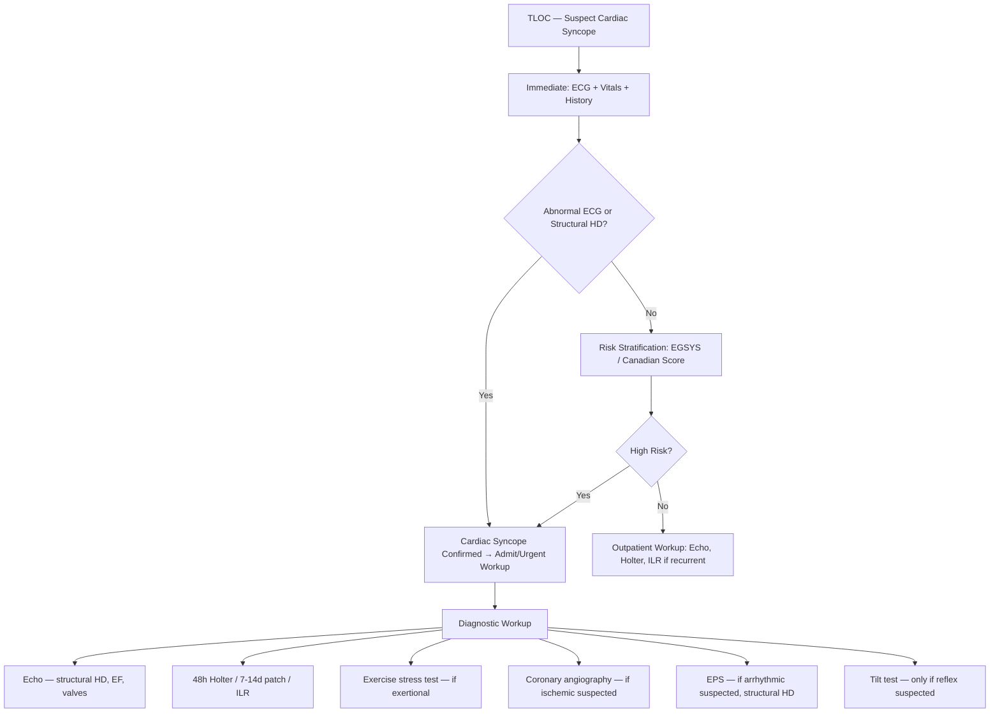
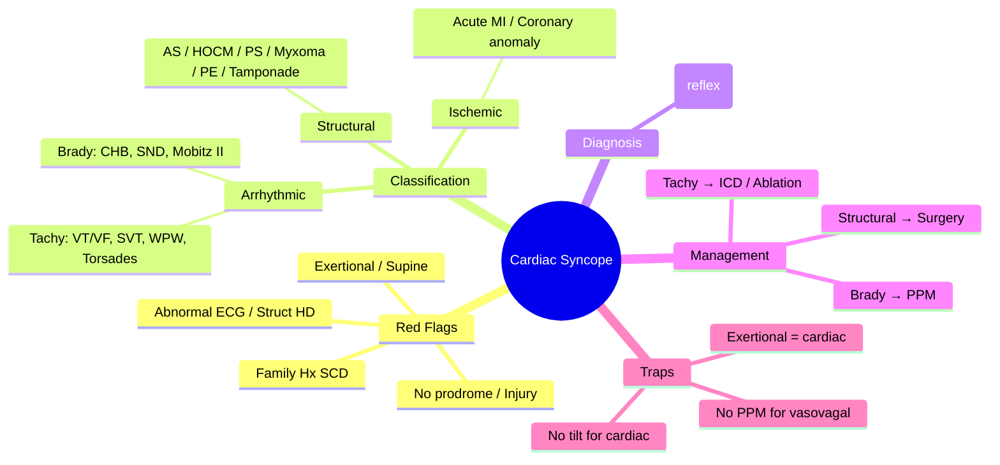

# Cardiac Syncope

Related: [[../Cardiology MOC|Cardiology MOC]] · [[../Davidson Chapter 16 - Cardiology Hierarchy|Cardiology Hierarchy]] · [[../Syncope, Shock, and Acute Hemodynamic Emergencies|Syncope, Shock, and Acute Hemodynamic Emergencies]] · [[Syncope and transient loss of consciousness]] · [[Vasovagal syncope]] · [[Orthostatic hypotension]] · [[Arrhythmias]] · [[Structural Heart Disease]] · [[Complete heart block]] · [[Ventricular tachycardia and VF]] · [[Hypertrophic cardiomyopathy]] · [[Pacemaker indications]]

> [!important]
> Cardiac syncope is **high-risk syncope** — carries **increased mortality** and **SCD risk**. FCPS/MRCP exams test: **differentiation from vasovagal/orthostatic**, **red flags** (exertional, supine, no prodrome, injury, abnormal ECG, structural HD), **structural vs arrhythmic causes**, and **indications for urgent evaluation** (EPS, ICD, pacemaker). **Any syncope with abnormal ECG or structural HD = cardiac until proven otherwise.**

## Learning Objectives
- Define cardiac syncope and distinguish from reflex (vasovagal), orthostatic, and non-cardiac (neurologic, metabolic) causes
- Apply risk stratification: **OESIL**, **EGSYS**, **Canadian Syncope Risk Score**
- Identify **red flags** for cardiac syncope: exertional/supine, no prodrome, injury, abnormal ECG, structural HD, family history SCD
- Differentiate **arrhythmic** (bradyarrhythmia, tachyarrhythmia) vs **structural** (obstructive, myocardial) causes
- Determine diagnostic workup: ECG, echo, Holter, EPS, ILR, stress test, coronary angiography
- Apply management: treat cause, pacemaker (brady), ICD/ablation (tachy), valve surgery (structural)

## Definition
**Cardiac syncope** = transient loss of consciousness (TLOC) due to **global cerebral hypoperfusion** caused by **cardiac mechanism** (arrhythmia or structural obstruction).
- **Duration**: typically <1 min (often seconds)
- **Recovery**: spontaneous, complete, rapid
- **Mechanism**: ↓ cardiac output → ↓ cerebral perfusion → TLOC
- **Mortality**: 1-year ~20-30% (vs <5% vasovagal) if untreated

## Classification

### 1. Arrhythmic Syncope (Most Common ~60-70% of Cardiac)
| Bradyarrhythmia | Tachyarrhythmia |
|-----------------|-----------------|
| **Complete heart block** | **VT/VF** (most lethal) |
| High-grade AV block (Mobitz II) | SVT with very rapid rate |
| Sinus node dysfunction (sinus arrest, SA block) | AF/AFL with rapid ventricular response |
| Drug-induced (BB, CCB, digoxin, amiodarone) | WPW + pre-excited AF |
| Post-cardiac surgery | Torsades de pointes |

### 2. Structural/Obstructive Syncope
| Obstruction | Mechanism |
|-------------|-----------|
| **Aortic stenosis** (critical) | Fixed outflow obstruction → ↓ CO on exertion |
| **HOCM** (dynamic LVOT obstruction) | Systolic anterior motion → dynamic gradient |
| **Pulmonary stenosis** | RV outflow obstruction |
| **Atrial myxoma** | Intermittent mitral valve obstruction |
| **Pulmonary embolism** (massive) | RV failure → ↓ LV preload |
| **Cardiac tamponade** | Diastolic filling impairment |
| **Prosthetic valve thrombosis** | Acute obstruction |

### 3. Myocardial/Ischemic Syncope
- **Acute MI** (especially inferior → bradyarrhythmia; anterior → tachyarrhythmia/HF)
- **Coronary artery anomaly** (exertional syncope)

## Clinical Red Flags — Cardiac Syncope Likely

| Red Flag | Significance |
|----------|--------------|
| **Exertional syncope** (during exercise) | **Aortic stenosis, HOCM, coronary anomaly, VT** |
| **Supine syncope** | **Arrhythmic** (vasovagal rare supine) |
| **No / brief prodrome** (<10 sec) | **Arrhythmic** (vasovagal typically >30 sec) |
| **Injury** (facial, fracture) | **No protective response** = sudden onset |
| **Palpitations before/after** | **Arrhythmic** |
| **Abnormal ECG** (baseline) | **Structural HD, channelopathy, pre-excitation** |
| **Known structural HD** (EF<40%, prior MI, CMO) | **High risk** |
| **Family history SCD / young SCD** | **Inherited channelopathy / CMO** |
| **Age >60** | Higher pre-test probability |
| **Congestive HF history** | Arrhythmic or low output |

> [!tip]
> **EGSYS Score** for cardiac syncope prediction (points):
> - Abnormal ECG / structural HD: 3
> - Palpitations before syncope: 4
> - Exertional syncope: 3
> - No prodrome: 2
> - Syncope supine: 2
> **Score ≥3 = cardiac syncope likely (95% specificity)**

## Diagnostic Workup Algorithm

## Specific Diagnostic Yields

| Test | Yield | Indication |
|------|-------|------------|
| **ECG** | High (immediate) | All syncope — baseline |
| **Echo** | 20-30% | All cardiac syncope — EF, valves, CMO, pericardial |
| **48h Holter** | 5-10% | Frequent symptoms (>1/week) |
| **ILR (implantable loop recorder)** | 20-50% | Recurrent unexplained, high risk, no frequent symptoms |
| **EPS** | 30-40% | Structural HD + syncope; suspected brady/tachy |
| **Tilt test** | 60-70% | Reflex syncope suspected (low risk) |
| **Stress test** | 15-20% | Exertional syncope |

## Management by Cause

### Bradyarrhythmic Syncope
| Cause | Definitive Treatment |
|-------|---------------------|
| **Complete heart block** | **Permanent pacemaker** (DDD) — Class I |
| Mobitz II / High-grade AV block | **Permanent pacemaker** — Class I |
| Sinus node dysfunction (symptomatic) | **Permanent pacemaker** (DDDR) — Class I |
| Drug-induced | **Stop offending drug** — monitor, PPM if persistent |

### Tachyarrhythmic Syncope
| Cause | Definitive Treatment |
|-------|---------------------|
| **VT/VF** (structural HD, EF<35%) | **ICD** (primary/secondary prevention) — Class I |
| VT (no structural HD, e.g., RVOT) | **Catheter ablation** — curative |
| AF/AFL rapid VR | Rate control ± rhythm control; PPM if pause-dependent |
| WPW + pre-excited AF | Ablation of accessory pathway |
| Torsades | Correct QT, Mg2+, pacing/ICD if congenital |

### Structural Syncope
| Cause | Definitive Treatment |
|-------|---------------------|
| **Critical AS** (mean grad >40, symptomatic) | **AVR (TAVR/SAVR)** — Class I |
| **HOCM** (gradient >50, symptomatic) | **Septal reduction** (myectomy/ablation) + ICD if high risk |
| **Pulmonary stenosis** (symptomatic) | Balloon valvuloplasty |
| **Atrial myxoma** | Surgical resection |
| **Massive PE** | Thrombolysis / thrombectomy |
| **Tamponade** | Pericardiocentesis |

## Temporary Measures (Bridge)
- **External pacing pads** applied immediately if bradyarrhythmia suspected
- **Atropine 0.5-1mg IV** (temporizing for bradycardia)
- **Isoproterenol infusion** (temporizing for bradyarrythmia/pause-dependent torsades)
- **Antiarrhythmic** (amiodarone/lidocaine) for VT storm
- **Telemetry monitoring** continuous

## Prognosis
| Cause | 1-Year Mortality (Untreated) | With Treatment |
|-------|------------------------------|----------------|
| **VT/VF** (structural HD) | 30-50% | ICD: ↓ to 10-15% |
| **Complete heart block** | 20-30% | PPM: near normal |
| **Critical AS (syncope)** | 50% at 1yr | AVR: ↓ to 5-10% |
| **HOCM (syncope)** | SCD risk ~1-2%/yr | ICD + myectomy: ↓ SCD |
| **Reflex/vasovagal** | <1% | Reassurance, lifestyle |

## Red Flags / Exam Traps
- **Assuming all syncope is vasovagal** — must rule out cardiac first
- **Missing exertional syncope** = AS/HOCM/VT until proven otherwise
- **Discharging abnormal ECG syncope** without workup — high SCD risk
- **Attributing syncope to drugs** without excluding structural cause
- **Tilt test for cardiac syncope** — low yield; use for reflex diagnosis only
- **Holter for infrequent syncope** — low yield; use ILR instead
- **Pacemaker for reflex syncope** — contraindicated (no benefit, RCT: ISSUE-3, SPAIN)

## FCPS/MRCP High-Yield Points
- **Cardiac syncope = high mortality** — admit/workup urgently
- **Red flags**: exertional, supine, no prodrome, injury, abnormal ECG, structural HD
- **EGSYS ≥3** = cardiac syncope likely
- **Arrhythmic > structural** (brady: CHB, sinus arrest; tachy: VT, WPW, torsades)
- **Structural**: AS, HOCM, pulmonary stenosis, myxoma, tamponade, massive PE
- **Workup**: ECG → Echo → Holter/ILR → EPS (if structural HD) → Tilt (if reflex)
- **Treatment**: PPM (brady), ICD/ablation (tachy), AVR/myectomy (structural)
- **No pacemaker for vasovagal** — contraindicated

## Common Viva Questions
1. How do you differentiate cardiac from vasovagal syncope clinically?
2. What is the EGSYS score and how is it used?
3. What are the red flags for cardiac syncope?
4. Workup algorithm for suspected cardiac syncope?
4. When is ILR indicated vs Holter?
5. Treatment for syncope due to complete heart block? Critical AS? VT?
6. Why is tilt test NOT for cardiac syncope?

## Common Confusions / Exam Traps
- Calling all syncope "vasovagal" — cardiac first!
- Exertional syncope = benign — NO, it's cardiac until proven otherwise
- Supine syncope = vasovagal — NO, vasovagal almost never supine
- Tilt test positive = cardiac — NO, tilt test diagnoses REFLEX syncope
- Holter for monthly syncope — low yield; use ILR
- Pacemaker for vasovagal — trials show NO benefit
- ICD for all syncope with EF<35% — need documented VT/VF or EPS-inducible

## Mind Map

## One-Page Revision Summary
- **Cardiac syncope** = high mortality (20-30% 1yr untreated)
- **Red flags**: exertional, supine, no prodrome, injury, abnormal ECG, structural HD
- **EGSYS ≥3** = cardiac likely (specificity 95%)
- **Arrhythmic**: brady (CHB, SND) > tachy (VT, AF RVR, WPW)
- **Structural**: AS (exertional), HOCM, PS, myxoma, tamponade, massive PE
- **Workup**: ECG → Echo → ILR (recurrent) / Holter (frequent) → EPS (structural HD)
- **Treatment**: PPM (brady), ICD/ablation (tachy), surgery (structural)
- **No PPM for vasovagal**; tilt test only for reflex

## 24-Hour Recall Prompts
- List 8 red flags for cardiac syncope
- Draw cardiac syncope classification
- State EGSYS scoring
- Compare Holter vs ILR indications
- Treatment for syncope from CHB / AS / VT

## 7-Day / 15-Day / 30-Day Revision Tracker
- [ ] Day 1 completed
- [ ] 24-hour recall completed
- [ ] Day 7 revision completed
- [ ] Day 15 revision completed
- [ ] Day 30 revision completed

## Must Know / Should Know / Nice to Know
### Must Know
- Cardiac syncope red flags (exertional, supine, no prodrome, injury, abnormal ECG)
- EGSYS score ≥3 = cardiac
- Arrhythmic causes: brady (CHB) > tachy (VT)
- Structural: AS, HOCM
- PPM for brady, ICD for tachy, surgery for structural

### Should Know
- EGSYS scoring details
- ILR vs Holter indications
- EPS indications
- Canadian Syncope Risk Score

### Nice to Know
- Genetic testing in unexplained syncope + family Hx
- Tilt test protocols (Westminster)
- Pacemaker syndrome in VVI for vasovagal

## Self-Test Scorecard
- Understanding /10
- Recall /10
- Differential diagnosis /10
- MCQ performance /10
- Viva confidence /10
- **Total /50**

> [!tip]
> **Interpretation**: <35 = weak topic; 35-44 = acceptable but insecure; 45+ = strong exam-ready topic.

## Exam Answer Modes
### Long Answer Skeleton
1. Definition + mortality significance
2. Red flags (exertional, supine, no prodrome, injury, abnormal ECG, structural HD)
3. Classification: arrhythmic (brady/tachy) + structural + ischemic
4. Risk stratification: EGSYS, Canadian score
5. Diagnostic algorithm (ECG → Echo → ILR/Holter → EPS → Tilt)
6. Management by cause (PPM, ICD, ablation, surgery)
7. Red flags/traps (no tilt for cardiac, no PPM for vasovagal)

### Short Note Skeleton
- Cardiac syncope = high mortality
- Red flags: exertional, supine, no prodrome, injury, abnormal ECG
- EGSYS ≥3 = cardiac
- Brady (CHB) → PPM; Tachy (VT) → ICD/ablation; Structural (AS/HOCM) → surgery
- Workup: ECG → Echo → ILR → EPS
- No tilt for cardiac; no PPM for vasovagal

### Viva One-Liners
- "Exertional/supine/no prodrome/injury = cardiac syncope"
- "EGSYS ≥3 = 95% specificity for cardiac"
- "CHB → PPM; VT → ICD; AS → AVR"
- "Tilt test for REFLEX syncope only"
- "No pacemaker for vasovagal (RCT negative)"

### Ward-Case Discussion Points
- "45M, syncope while jogging, normal ECG, no prodrome" → "Exertional = cardiac. Echo for AS/HOCM. Stress test. ILR if negative."
- "70F, syncope, found on floor, injury, CHB on ECG" → "Cardiac syncope from CHB. PPM urgent (DDD)."
- "30F, recurrent syncope, normal ECG/echo, no prodrome, sitting" → "Vasovagal likely. EGSYS low. Tilt test if unclear. No PPM."

### Last-Night-Before-Exam Sheet
- Cardiac syncope mortality 20-30%/yr
- Red flags: exertional, supine, no prodrome, injury, abnormal ECG, structural HD
- EGSYS: abnormal ECG/HD=3, palpitations=4, exertional=3, no prodrome=2, supine=2
- Brady: CHB/SND → PPM; Tachy: VT → ICD/ablation; Structural: AS/HOCM → surgery
- Workup: ECG→Echo→ILR→EPS
- Tilt test = reflex only; No PPM for vasovagal

## Summary
**Cardiac syncope** is **syncope due to cardiac etiology** (arrhythmic or structural) carrying **high mortality** (~20-30% at 1 year untreated). **Clinical red flags** distinguish it from vasovagal: **exertional onset, supine position, absent/brief prodrome (<10s), physical injury, palpitations, abnormal baseline ECG, known structural heart disease, family history of SCD**. **EGSYS score ≥3** predicts cardiac syncope with 95% specificity. **Classification**: **arrhythmic** (bradyarrhythmia: CHB, Mobitz II, sinus node dysfunction; tachyarrhythmia: VT/VF, AF RVR, WPW, torsades) and **structural/obstructive** (critical aortic stenosis, HOCM, pulmonary stenosis, atrial myxoma, massive PE, tamponade). **Diagnostic algorithm**: ECG → Echo → **ILR for recurrent/unexplained** (Holter only if frequent >1/week) → **EPS if structural HD** → Tilt test **only if reflex suspected**. **Definitive treatment**: permanent pacemaker (bradyarrhythmia), ICD/ablation (tachyarrhythmia), valve surgery/sepal reduction (structural). **Critical traps**: exertional syncope = cardiac until proven otherwise; tilt test diagnoses reflex NOT cardiac; pacemaker contraindicated in vasovagal (RCT negative); ILR not Holter for infrequent syncope.

## MCQs (10)
1. Most specific clinical feature for cardiac syncope vs vasovagal:
   A. Nausea before syncope
   B. **Exertional onset**
   C. Prolonged prodrome
   D. Syncope standing
2. EGSYS score assigns highest points (4) to:
   A. Exertional syncope
   B. **Palpitations before syncope**
   C. Abnormal ECG
   D. Supine syncope
3. EGSYS score ≥3 indicates:
   A. Vasovagal syncope
   B. **Cardiac syncope likely (95% specificity)**
   C. Orthostatic hypotension
   D. Neurologic cause
4. Syncope during exertion in young athlete — most concerning cause:
   A. Vasovagal
   B. **HOCM / Coronary anomaly / VT**
   C. Orthostatic hypotension
   D. Situational
5. Best initial test for suspected cardiac syncope:
   A. Tilt table test
   B. **12-lead ECG**
   C. Holter monitor
   D. Echocardiogram
6. Implantable loop recorder (ILR) indicated for:
   A. Daily syncope
   B. **Recurrent unexplained syncope, infrequent (>1 month)**
   C. First syncope with normal ECG
   D. Vasovagal syncope diagnosis
7. Tilt table test is diagnostic for:
   A. Cardiac syncope
   B. **Reflex (vasovagal) syncope**
   C. Orthostatic hypotension
   C. VT
8. Complete heart block presenting with syncope — definitive treatment:
   A. Atropine infusion
   B. **Permanent pacemaker (DDD)**
   C. Isoproterenol
   D. ICD
9. Syncope in aortic stenosis — mechanism:
   A. Vasodilation
   B. **Fixed outflow obstruction → inability to ↑ CO on exertion**
   C. Arrhythmia
   D. Orthostatic hypotension
10. Pacemaker for vasovagal syncope — evidence:
    A. Reduces recurrence by 50%
    B. **No benefit (ISSUE-3, SPAIN trials); contraindicated**
    C. First-line for recurrent
    D. Only if >65 years

## SBA Questions (10)
1. 58M, syncope while climbing stairs, no prodrome, facial laceration. ECG normal. Echo awaited. Next:
   A. Discharge with vasovagal diagnosis
   B. **Admit, echo, Holter/ILR — exertional = cardiac until proven**
   C. Tilt test
   D. Reassure
2. 75F, found on floor, no witness, facial injury, HR 40, ECG: complete heart block. Management:
   A. Atropine infusion
   B. **Permanent pacemaker urgently**
   C. Observe 24h
   D. Isoproterenol
3. 30M, recurrent unexplained syncope ×3 in 6 months, normal ECG/echo, no prodrome. Best monitor:
   A. 24h Holter
   B. **ILR (implantable loop recorder)**
   C. Event recorder 30d
   D. Tilt test
4. 65F, exertional syncope, systolic murmur, Echo: AS mean grad 45 mmHg, AVA 0.8 cm². Definitive Rx:
   A. Beta-blocker
   B. **AVR (TAVR/SAVR) — Class I**
   C. Diuretic
   D. Nitrates
5. 40M, syncope with palpitations, ECG: WPW + AF. Definitive Rx:
   A. Digoxin
   B. **Ablation of accessory pathway**
   C. Amiodarone
   D. ICD
6. 25M, syncope, family Hx SCD (brother age 28), normal ECG/echo. Next:
   A. Reassure
   B. **Genetic testing, ILR, exercise stress, consider Brugada/CPVT/LQTS**
   C. Tilt test
   D. ICD
7. 70M, syncope, no prodrome, sitting, CHB on ECG. Atropine given, HR improves transiently. Next:
   A. Discharge on atropine
   B. **Permanent pacemaker (atropine temporizing only)**
   C. Isoproterenol infusion
   D. ICD
8. EGSYS score for: 60M, exertional syncope, no prodrome, normal ECG. Score:
   A. 2
   B. **5 (exertional 3 + no prodrome 2)**
   C. 3
   D. 7
9. Syncope due to HOCM — mechanism:
   A. Bradyarrhythmia
   B. **Dynamic LVOT obstruction → ↓ CO on exertion**
   C. Orthostatic hypotension
   D. Coronary steal
10. Tilt test positive for vasovagal — management:
    A. Permanent pacemaker
    B. **Fludrocortisone, midodrine, compression stockings, counter-pressure maneuvers, education**
    C. ICD
    D. Beta-blocker

## Flashcards
- Q: Cardiac syncope red flags?
  A: Exertional, supine, no prodrome, injury, abnormal ECG, structural HD
- Q: EGSYS ≥3?
  A: Cardiac syncope (95% spec)
- Q: EGSYS points?
  A: Palpitations=4, abnormal ECG/HD=3, exertional=3, no prodrome=2, supine=2
- Q: Brady syncope causes?
  A: CHB, Mobitz II, SND, drug-induced
- Q: Tachy syncope causes?
  A: VT/VF, AF RVR, WPW, Torsades
- Q: Structural syncope?
  A: AS, HOCM, PS, myxoma, PE, tamponade
- Q: Cardiac syncope workup?
  A: ECG → Echo → ILR → EPS
- Q: CHB syncope treatment?
  A: PPM (DDD)
- Q: AS syncope treatment?
  A: AVR
- Q: Tilt test for?
  A: Reflex/vasovagal ONLY

## Answer Key with Explanations
### MCQs
1. **B** — Exertional syncope is essentially never vasovagal; cardiac until proven otherwise.
2. **B** — Palpitations before syncope = 4 points (highest single item).
3. **B** — EGSYS ≥3 = cardiac syncope likely (sensitivity 95%, specificity 95%).
4. **B** — Young athlete + exertional syncope = HOCM, coronary anomaly, or VT.
5. **B** — ECG is first, cheapest, highest yield (abnormal in 90% cardiac syncope).
6. **B** — ILR for infrequent recurrent syncope; Holter for frequent (>1/week).
7. **B** — Tilt test diagnoses reflex (vasovagal) syncope; NOT cardiac.
8. **B** — CHB with syncope = Class I permanent PPM; atropine/isoproterenol temporizing only.
9. **B** — AS: fixed obstruction → inability to increase CO on exertion → cerebral hypoperfusion.
10. **B** — ISSUE-3, SPAIN RCTs: no benefit of pacing in vasovagal; contraindicated.

### SBAs
1. **B** — Exertional syncope + injury = cardiac until proven otherwise; admit, echo, monitoring.
2. **B** — CHB + syncope = Class I permanent PPM urgently.
3. **B** — ILR for recurrent unexplained (monthly); Holter for frequent (weekly).
4. **B** — Symptomatic severe AS = Class I AVR.
5. **B** — WPW + AF = ablation of accessory pathway (curative).
6. **B** — Unexplained syncope + family Hx SCD = genetic channelopathy/CMO workup.
7. **B** — CHB: atropine temporizing; permanent PPM definitive.
8. **B** — Exertional (3) + no prodrome (2) = 5.
9. **B** — HOCM: dynamic LVOT obstruction → ↓ CO on exertion/Valsalva.
10. **B** — Vasovagal: conservative (fluids, salt, counter-maneuvers, education); no pacing.

---

## PasTest Scenario SBAs (Clinical Vignettes)

> **Auto-generated PasTest/Mediscope-style scenario SBAs** grounded in the authored source. Each scenario tests a real clinical fact (triad, specific sign, contraindication, trial, first-line Rx) extracted from the topic. *Source: Ch 16: Cardiology — Hemodynamic profiling (wet dry, warm cold)*

**Q1.** Which of the following features is most specific or characteristic of Hemodynamic profiling (wet dry, warm cold)?

  - **A.** Cardinal symptoms
  - **B.** A feature common to many acute inflammatory conditions
  - **C.** A non-specific sign that does not localise the diagnosis
  - **D.** An investigation finding rather than a clinical feature

  > **Answer: A** — Cardinal symptoms
  >
  > *Source:* **Cardinal symptoms**: chest pain (typical: central, crushing, radiating to jaw/left arm, exertion-related; atypical more common in women, elderly, diabetics), dyspnoea (exertional, orthopnoea, PND, n

