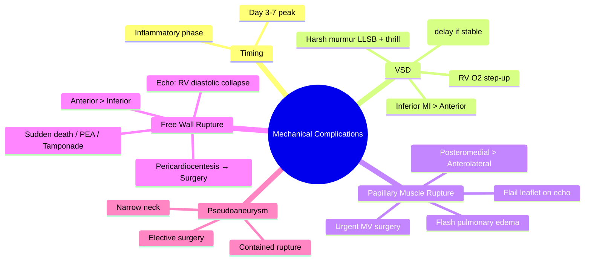

# Mechanical Complications of Myocardial Infarction

Related: [[../Cardiology MOC|Cardiology MOC]] · [[../Davidson Chapter 16 - Cardiology Hierarchy|Cardiology Hierarchy]] · [[../Ischaemic Heart Disease and Acute Coronary Syndromes|Ischaemic Heart Disease and Acute Coronary Syndromes]] · [[STEMI]] · [[Reperfusion strategy in STEMI]] · [[Cardiogenic shock]] · [[Acute Coronary Syndrome]] · [[Heart Failure]]

> [!important]
> Mechanical complications are **high-mortality emergencies** occurring typically **3-7 days** post-MI due to necrotic tissue rupture. FCPS/MRCP exams test timing, clinical presentation, echo findings, and urgent management. **VSD, papillary muscle rupture (acute MR), free wall rupture (tamponade), LV pseudoaneurysm.**

## Learning Objectives
- Identify the four major mechanical complications: VSD, papillary muscle rupture, free wall rupture, LV pseudoaneurysm
- Recognize typical timing (3-7 days post-MI) and clinical presentations
- Interpret bedside echo findings for each complication
- Apply emergency stabilization and definitive surgical management
- Differentiate from other post-MI shock etiologies (arrhythmic, pump failure)

## Definition
Mechanical complications result from **rupture of infarcted myocardium** during the necrotic/inflammatory phase (days 3-7), before mature scar formation.

## Timing and Pathophysiology
| Phase | Days | Pathology | Risk |
|-------|------|-----------|------|
| **Necrotic** | 1-3 | Coagulative necrosis, neutrophil infiltration | Early rupture rare |
| **Inflammatory** | **3-7** | Macrophages, collagenases → tissue weakening | **PEAK rupture risk** |
| **Proliferative** | 7-14 | Granulation tissue, early collagen | Rupture risk declining |
| **Maturation** | >14 | Dense collagen scar | Rupture very rare |

> [!warning]
> **Peak incidence: Day 3-7** post-MI. Early reperfusion (PCI/lysis) reduces but doesn't eliminate risk. Inferior MI favors RV free wall rupture; Anterior MI favors VSD and papillary muscle rupture.

## Clinical Comparison Table

| Complication | Anatomy | Timing | Key Presentation | Echo Finding | Management |
|--------------|---------|--------|------------------|--------------|------------|
| **VSD** | Interventricular septum (inferior > anterior) | Day 1-7 (peak 3-5) | New harsh holosystolic murmur LLSB, RV heave, shock | Color Doppler: LV→RV shunt, RV pressure step-up | Emergency surgery (delayed if stable) |
| **Papillary Muscle Rupture** | Posteromedial (LCx/RCA) > anterolateral (LAD) | Day 2-7 (peak 3-7) | Acute severe MR, flash pulmonary edema, soft murmur | Flail leaflet, large eccentric MR jet, large V-wave | Urgent mitral valve repair/replacement |
| **Free Wall Rupture** | LV free wall (anterior > inferior) | Day 3-7 (peak 5-7) | Sudden death, PEA, tamponade, electromechanical dissociation | Pericardial effusion, tamponade physiology, systolic collapse RV | Pericardiocentesis → emergency surgery (often fatal) |
| **LV Pseudoaneurysm** | Contained free wall rupture | Weeks-months | Late heart failure, thromboembolism, rupture risk | Narrow neck, sealed by pericardium/adjacent structures | Surgical repair (elective) |

## Ventricular Septal Defect (VSD)

### Pathophysiology
- Septal necrosis → rupture → left-to-right shunt
- Inferior MI (RCA/LCx) → basal/inferior septum (85%)
- Anterior MI (LAD) → apical septum (15%)
- Shunt magnitude depends on defect size and PVR/SVR ratio

### Clinical Features
- **New harsh holosystolic murmur** at LLSB (Grade 3-6/6), often with **thrill**
- **RV heave** (right ventricular volume/pressure overload)
- **Shock** if large shunt (pulmonary overcirculation + LV failure)
- **Hypoxemia** if Eisenmenger physiology develops (late)

### Diagnosis
| Modality | Finding |
|----------|---------|
| **TTE/TEE** | Defect visualization, color Doppler LV→RV shunt |
| **RHC (Swan-Ganz)** | **Step-up O2 saturation** in RV vs RA (>7%) — **gold standard** |
| **ECG** | Often new Q waves inferior/anterior; not diagnostic |
| **CXR** | Pulmonary venous congestion, enlarged PA |

### Management
1. **Stabilize**: diuretics, inotropes (dobutamine), avoid excessive afterload reduction (worsens shunt)
2. **IABP**: controversial — may ↑ shunt by reducing afterload
3. **Surgery**: **Definitive treatment** — infarct exclusion + patch closure
   - **Timing**: Delay 2-4 weeks if hemodynamically stable (allows scar maturation)
   - **Emergent**: if refractory shock, failed medical management
4. **Percutaneous closure**: Amplatzer device — selected high-surgical-risk patients

## Papillary Muscle Rupture (Acute Severe MR)

### Pathophysiology
- **Posteromedial papillary muscle** (single blood supply: PDA from RCA/LCx) → higher rupture risk
- Anterolateral (dual supply: LAD + LCx) → less common
- Rupture → flail mitral leaflet → acute severe regurgitation → LA pressure ↑ → pulmonary edema

### Clinical Features
- **Flash pulmonary edema**, dyspnea at rest, hypoxemia
- **Murmur**: soft, early systolic or holosystolic at apex (radiates to axilla) — **NOT harsh** (low pressure gradient LA-LV)
- **S3 gallop**, wide pulse pressure
- **Hypotension**, cool extremities (low forward output)
- **Large V-wave** on PCWP trace

### Diagnosis
| Modality | Finding |
|----------|---------|
| **TTE/TEE** | **Flail leaflet** (posterior > anterior), eccentric MR jet, hyperdynamic LV |
| **RHC** | Large V-wave on PCWP, elevated PA pressures |
| **CXR** | Acute pulmonary edema, normal heart size (acute) |

### Management
1. **Vasodilators** (nitroprusside): ↓ afterload → ↑ forward flow (avoid excessive hypotension)
2. **IABP**: ↓ afterload, ↑ coronary perfusion — **bridge to surgery**
3. **DOBUTAMINE**: inotropic support
4. **Urgent surgery**: **Mitral valve repair (preferred) or replacement** — mortality 20-30%
   - Timing: **ASAP** — medical stabilization only as bridge

## Free Wall Rupture (Cardiac Tamponade)

### Pathophysiology
- Transmural necrosis → full-thickness rupture → hemopericardium → tamponade
- **Anterior MI** (LAD) → anterior/lateral wall
- **Inferior MI** (RCA) → inferior/posterior wall (may track to RV)
- **Most lethal** — 50% die before hospital, 90% within 24h of presentation

### Clinical Features
- **Sudden hemodynamic collapse**: hypotension, PEA, electromechanical dissociation
- **Beck's triad**: hypotension, JVD, muffled heart sounds
- **Pulsus paradoxus** >10 mmHg
- **Kussmaul's sign** (JVD ↑ inspiration) if RV involved
- **ECG**: Low voltage, electrical alternans (if effusion large)

### Diagnosis
| Modality | Finding |
|----------|---------|
| **Bedside Echo** | **Pericardial effusion**, diastolic RV collapse, systolic RA collapse, IVC plethora |
| **ECG** | Electrical alternans, low voltage |

### Management
1. **Immediate pericardiocentesis** (echo-guided): temporizing, 20-30% survive to surgery
2. **Volume resuscitation** (preload for tamponade)
3. **Emergency surgery**: pericardial window + infarct exclusion + patch repair
4. **Outcome**: Mortality >90% even with surgery

## LV Pseudoaneurysm

### Pathophysiology
- **Contained rupture**: free wall rupture sealed by pericardium/adhesions
- **Narrow neck** (<50% diameter of cavity) — distinguishes from true aneurysm
- High rupture risk → elective repair indicated
- May present weeks to months post-MI

### Clinical Features
- Heart failure symptoms, thromboembolism (stroke, peripheral), rupture risk
- May be asymptomatic, found on follow-up echo

### Diagnosis
| Modality | Finding |
|----------|---------|
| **Echo** | Outpouching with **narrow neck**, bidirectional flow at neck |
| **CT/MRI** | Defines anatomy, relationship to coronaries, extent of adhesions |
| **Angio** | Contrast extravasation with contained cavity |

### Management
- **Surgical repair**: infarct exclusion + patch closure
- **Elective** but don't delay (rupture risk high)

## Differential Diagnosis of Post-MI Shock

| Etiology | Key Features | Echo |
|----------|--------------|------|
| **Pump failure** | Gradual, large MI, LV dilation, low EF | Global hypokinesis, low EF |
| **Mechanical (VSD/MR/rupture)** | **Sudden**, new murmur, specific echo findings | See above |
| **Arrhythmic** | VT/VF, bradyarrhythmia | Normal/prior MI |
| **RV infarction** | Inferior MI, hypotension, clear lungs, JVD | RV dilation, hypokinesis, IVC plethora |
| **Tamponade (non-mechanical)** | Post-PCI, anticoagulation | Effusion, tamponade physiology |

## Prognosis and Mortality
| Complication | In-Hospital Mortality (Modern Era) |
|--------------|-----------------------------------|
| VSD | 20-40% (surgical era) |
| Papillary Muscle Rupture | 20-30% (with urgent surgery) |
| Free Wall Rupture | >90% (rarely survive to surgery) |
| LV Pseudoaneurysm | 10-20% (elective repair) |

> [!tip]
> **Risk factors for mechanical complications**: older age, female, hypertension, anterior MI, delayed/no reperfusion, NSAID/steroid use, prior MI.

## FCPS/MRCP High-Yield Points
- **Timing**: Day 3-7 post-MI (inflammatory phase)
- **VSD**: harsh holosystolic LLSB murmur + thrill + RV heave → RV O2 step-up on Swan-Ganz
- **Papillary muscle rupture**: flash pulmonary edema + soft apical MR murmur → flail leaflet on echo
- **Free wall rupture**: sudden death/PEA + tamponade → echo effusion + RV diastolic collapse → pericardiocentesis bridge to surgery
- **Pseudoaneurysm**: contained rupture, narrow neck, high rupture risk → elective surgery
- **IABP**: helps MR (↓ afterload), may worsen VSD (↑ shunt)

## Common Viva Questions
1. When do mechanical complications peak post-MI? (Day 3-7)
2. Which papillary muscle ruptures more often? (Posteromedial - single blood supply)
3. What murmur character distinguishes VSD from acute MR? (VSD = harsh + thrill; MR = soft)
4. RHC finding diagnostic for VSD? (O2 step-up in RV >7%)
5. Echo findings for tamponade? (RV diastolic collapse, RA systolic collapse, IVC plethora)
6. Why avoid excessive afterload reduction in VSD? (↑ left-to-right shunt)
7. Pseudoaneurysm vs true aneurysm? (Narrow neck, contained rupture)
8. Management of free wall rupture? (Pericardiocentesis → emergency surgery)

## Common Confusions / Exam Traps
- Confusing acute MR murmur (soft) with chronic MR (holosystolic, radiates to axilla)
- Missing VSD because murmur is not loud (small defect)
- Using IABP in VSD (increases shunt)
- Thinking free wall rupture always has murmur (usually no time for murmur)
- Forgetting posteromedial papillary muscle = single blood supply = higher rupture risk

## Mind Map

## One-Page Revision Summary
- **Day 3-7** = peak mechanical complication window
- **VSD**: harsh systolic LLSB + thrill + RV heave → RV O2 step-up → surgery (delayed if stable)
- **Papillary muscle rupture**: posteromedial > anterolateral → flash pulmonary edema + soft MR murmur → flail leaflet on echo → **urgent MV surgery**
- **Free wall rupture**: sudden collapse, tamponade → echo effusion + RV diastolic collapse → pericardiocentesis → emergency surgery (mortality >90%)
- **Pseudoaneurysm**: contained rupture, narrow neck → elective surgical repair
- **IABP**: good for MR, avoid in VSD (↑ shunt)
- **Risk factors**: elderly, female, HTN, anterior MI, no reperfusion

## 24-Hour Recall Prompts
- State the 4 mechanical complications with timing
- Draw VSD vs acute MR comparison table
- List echo findings for tamponade
- Explain why IABP contraindicated in VSD
- Describe posteromedial vs anterolateral papillary muscle blood supply

## 7-Day / 15-Day / 30-Day Revision Tracker
- [ ] Day 1 completed
- [ ] 24-hour recall completed
- [ ] Day 7 revision completed
- [ ] Day 15 revision completed
- [ ] Day 30 revision completed

## Must Know / Should Know / Nice to Know
### Must Know
- Timing: Day 3-7 post-MI
- VSD: harsh murmur, RV step-up, surgery
- Papillary muscle: flash edema, flail leaflet, urgent MV surgery
- Free wall: tamponade, pericardiocentesis, >90% mortality
- Posteromedial single supply

### Should Know
- Pseudoaneurysm: narrow neck, elective repair
- RV infarction differential
- IABP effects on VSD vs MR
- Percutaneous VSD closure options

### Nice to Know
- Surgical techniques (infarct exclusion vs direct closure)
- MRI criteria for pseudoaneurysm
- Long-term outcomes post-repair

## Self-Test Scorecard
- Understanding /10
- Recall /10
- Echo pattern recognition /10
- MCQ performance /10
- Viva confidence /10
- **Total /50**

> [!tip]
> **Interpretation**: <35 = weak topic; 35-44 = acceptable but insecure; 45+ = strong exam-ready topic.

## Exam Answer Modes
### Long Answer Skeleton
1. Timing and pathophysiology (inflammatory phase Day 3-7)
2. VSD: anatomy, presentation, diagnosis (RV step-up), management
3. Papillary muscle rupture: posteromedial predilection, flash edema, flail leaflet, urgent surgery
3. Free wall rupture: tamponade, echo findings, pericardiocentesis bridge to surgery
4. Pseudoaneurysm: contained rupture, narrow neck, elective repair
5. Differential diagnosis of post-MI shock table
6. Risk factors and prognosis

### Short Note Skeleton
- Day 3-7 post-MI
- VSD: harsh systolic, RV step-up
- Papillary rupture: flash edema, flail, urgent surgery
- Free wall: tamponade, >90% mortality
- Pseudoaneurysm: narrow neck

### Viva One-Liners
- "Day 3-7 = mechanical complications peak"
- "VSD = harsh LLSB + RV O2 step-up"
- "Papillary muscle rupture = flash edema + flail leaflet"
- "Free wall rupture = tamponade = pericardiocentesis → surgery"
- "Posteromedial PM = single supply (PDA) = rupture risk"

### Ward-Case Discussion Points
- "Day 4 post-inferior MI, new harsh murmur LLSB, thrill, shock" → "VSD. Echo for shunt, Swan-Ganz for step-up. Surgery delayed if stable."
- "Day 5 post-anterolateral MI, sudden flash pulmonary edema, soft apical murmur" → "Papillary muscle rupture. Echo for flail leaflet. Urgent MV surgery."
- "Day 6 post-anterior MI, sudden PEA, JVD, muffled sounds" → "Free wall rupture → tamponade. Bedside echo. Pericardiocentesis. Emergency surgery."

### Last-Night-Before-Exam Sheet
- Timing: Day 3-7
- VSD: harsh murmur, RV step-up → surgery
- Papillary muscle: posteromedial, flash edema, flail leaflet → urgent surgery
- Free wall: tamponade → pericardiocentesis → surgery (>90% die)
- Pseudoaneurysm: narrow neck → elective repair
- IABP: helps MR, worsens VSD

## Summary
Mechanical complications of MI result from **myocardial rupture during the inflammatory phase (Days 3-7)**. The four major entities are **VSD** (harsh murmur, RV O2 step-up), **papillary muscle rupture** (flash pulmonary edema, flail leaflet, **posteromedial > anterolateral** due to single PDA blood supply), **free wall rupture** (tamponade, sudden death/PEA, pericardiocentesis bridge to surgery, >90% mortality), and **LV pseudoaneurysm** (contained rupture, narrow neck, elective repair). VSD surgery often delayed for scar maturation; papillary muscle rupture requires **urgent mitral valve surgery**; free wall rupture is mostly fatal despite intervention. **IABP reduces afterload → helps MR, worsens VSD shunt**.

## MCQs (10)
1. Mechanical complications of MI peak during which post-MI phase?
   A. Necrotic (Day 1-3)
   B. **Inflammatory (Day 3-7)**
   C. Proliferative (Day 7-14)
   D. Maturation (Day >14)
2. Which papillary muscle is more prone to rupture and why?
   A. Anterolateral - dual blood supply
   B. **Posteromedial - single blood supply (PDA)**
   C. Both equally
   D. Posteromedial - dual blood supply
3. Characteristic murmur of post-MI VSD:
   A. Soft early systolic at apex
   B. **Harsh holosystolic at LLSB with thrill**
   C. Diastolic rumble at apex
   D. Continuous at base
4. Swan-Ganz finding diagnostic for VSD:
   A. Elevated PCWP
   B. **Oxygen saturation step-up in RV (>7% vs RA)**
   C. Reduced cardiac index
   D. Elevated PA diastolic pressure
5. Free wall rupture most commonly presents as:
   A. New murmur
   B. Gradual heart failure
   C. **Sudden death / PEA / tamponade**
   D. Atrial fibrillation
6. Bedside echo finding most specific for cardiac tamponade:
   A. Pericardial effusion alone
   B. **Diastolic RV collapse + systolic RA collapse + IVC plethora**
   C. LV hypokinesis
   D. Dilated IVC alone
7. LV pseudoaneurysm is distinguished from true aneurysm by:
   A. Wide neck
   B. **Narrow neck with contained rupture**
   C. Fibrous wall
   D. Thrombus formation
8. IABP effect on VSD vs acute MR:
   A. Beneficial for both
   B. Harmful for both
   C. **Worsens VSD (↑ shunt), improves MR (↓ afterload)**
   D. Improves VSD, worsens MR
9. Typical timing of papillary muscle rupture post-MI:
   A. Day 1-2
   B. **Day 3-7 (peak 5-7)**
   C. Day 10-14
   D. Day >21
10. Most common anatomic location for post-MI VSD:
    A. Apical septum (anterior MI)
    B. **Basal/inferior septum (inferior MI)**
    C. Mid septum
    D. Membranous septum

## SBA Questions (10)
1. Day 4 post-inferior STEMI, new harsh holosystolic murmur LLSB with thrill, BP 85/50, JVD. Echo shows RV dilation. Next diagnostic step:
   A. Coronary angiography
   B. **Right heart catheterization for O2 step-up**
   C. Cardiac MRI
   D. CT angiography
2. Day 5 post-anterolateral STEMI, flash pulmonary edema, soft apical systolic murmur, hypotension. TTE shows flail posterior leaflet. Best management:
   A. IV nitroglycerin + furosemide
   B. IABP + delayed surgery
   C. **IABP + urgent mitral valve surgery**
   D. Percutaneous MitraClip
3. Day 6 post-anterior STEMI, sudden PEA arrest, distended neck veins, muffled heart sounds, BP unmeasurable. Bedside echo: large pericardial effusion, RV diastolic collapse. Immediate step:
   A. IV adrenaline 1 mg
   B. **Echo-guided pericardiocentesis**
   C. Urgent sternotomy in ED
   D. IV fluids + norepinephrine
4. Mechanism of increased left-to-right shunt with IABP in VSD:
   A. ↑ LV contractility
   B. **↓ SVR → ↓ systemic afterload → ↑ LV→RV gradient**
   C. ↑ RV afterload
   D. ↓ heart rate
5. Posteromedial papillary muscle blood supply:
   A. LAD + LCx
   B. **PDA (RCA/LCx) — single supply**
   C. LAD only
   D. PDA + LAD
6. Electrocardiographic sign of large pericardial effusion/tamponade:
   A. ST elevation
   B. **Electrical alternans + low voltage**
   C. Pathological Q waves
   D. Right bundle branch block
7. Pseudoaneurysm management:
   A. Anticoagulation only
   B. **Elective surgical repair**
   C. Percutaneous closure
   D. Observation
8. Day 3 post-inferior MI, hypotension, clear lungs, JVD at 45°, RV dilation on echo. Most likely:
   A. Papillary muscle rupture
   B. **RV infarction**
   C. Free wall rupture
   D. VSD
9. Mortality of free wall rupture with modern management:
   A. <10%
   B. 20-30%
   C. 40-50%
   D. **>90%**
10. VSD surgical timing in hemodynamically stable patient:
    A. Immediate (<24h)
    B. **2-4 weeks (scar maturation)**
    C. 3-6 months
    D. Never (medical management only)

## Flashcards
- Q: Mechanical complications peak timing?
  A: Day 3-7 (inflammatory phase)
- Q: VSD murmur + diagnostic?
  A: Harsh holosystolic LLSB + thrill; RV O2 step-up on Swan-Ganz
- Q: Papillary muscle rupture: which + why + presentation?
  A: Posteromedial (single PDA supply), flash pulmonary edema, flail leaflet on echo
- Q: Free wall rupture: presentation + echo + management?
  A: Sudden death/PEA/tamponade; RV diastolic collapse; pericardiocentesis → surgery
- Q: Pseudoaneurysm vs true aneurysm?
  A: Narrow neck, contained rupture, high rupture risk
- Q: IABP in VSD vs MR?
  A: Worsens VSD (↓ SVR → ↑ shunt), improves MR (↓ afterload)
- Q: Posteromedial papillary muscle supply?
  A: PDA (RCA/LCx) — single supply
- Q: Tamponade echo triad?
  A: RV diastolic collapse, RA systolic collapse, IVC plethora
- Q: VSD surgery timing if stable?
  A: Delay 2-4 weeks for scar maturation
- Q: Free wall rupture mortality?
  A: >90%

## Answer Key with Explanations
### MCQs
1. **B** — Inflammatory phase (Day 3-7) with macrophage collagenase activity peaks rupture risk.
2. **B** — Posteromedial papillary muscle supplied only by PDA (RCA/LCx); anterolateral has dual supply (LAD + LCx).
3. **B** — VSD: harsh holosystolic murmur at LLSB, often with palpable thrill (high-pressure LV→RV shunt).
4. **B** — O2 saturation step-up in RV >7% above RA = left-to-right shunt (gold standard).
5. **C** — Free wall rupture: sudden hemodynamic collapse, PEA, tamponade; most lethal.
6. **B** — Tamponade echo: diastolic RV collapse (earliest), systolic RA collapse, IVC plethora with minimal respiratory variation.
7. **B** — Pseudoaneurysm = contained rupture sealed by pericardium with narrow neck (<50% cavity diameter); true aneurysm = wide neck, fibrous wall.
8. **C** — IABP ↓ SVR → ↓ systemic afterload → ↑ LV→RV pressure gradient → ↑ shunt in VSD; in MR, ↓ afterload → ↑ forward flow.
9. **B** — Papillary muscle rupture peaks Day 5-7 (slightly later than VSD).
10. **B** — Inferior MI (RCA/LCx) → basal/inferior septum accounts for 85% of VSDs.

### SBAs
1. **B** — Clinical presentation classic for VSD; RHC O2 step-up confirms.
2. **C** — Acute severe MR from papillary muscle rupture: IABP bridge, urgent MV surgery (repair > replacement).
3. **B** — Tamponade from free wall rupture: immediate pericardiocentesis is life-saving bridge to surgery.
4. **B** — IABP reduces SVR → ↑ shunt gradient in VSD.
5. **B** — Posteromedial = PDA only; anterolateral = LAD + LCx (dual).
6. **B** — Electrical alternans (swinging heart) + low voltage = large effusion/tamponade.
7. **B** — Pseudoaneurysm = high rupture risk → elective surgical repair.
8. **B** — RV infarction: inferior MI + hypotension + clear lungs + JVD + RV dilation.
9. **D** — Free wall rupture mortality >90% despite modern care.
10. **B** — Stable VSD: delay surgery 2-4 weeks for infarct scar maturation; emergent if unstable.

---