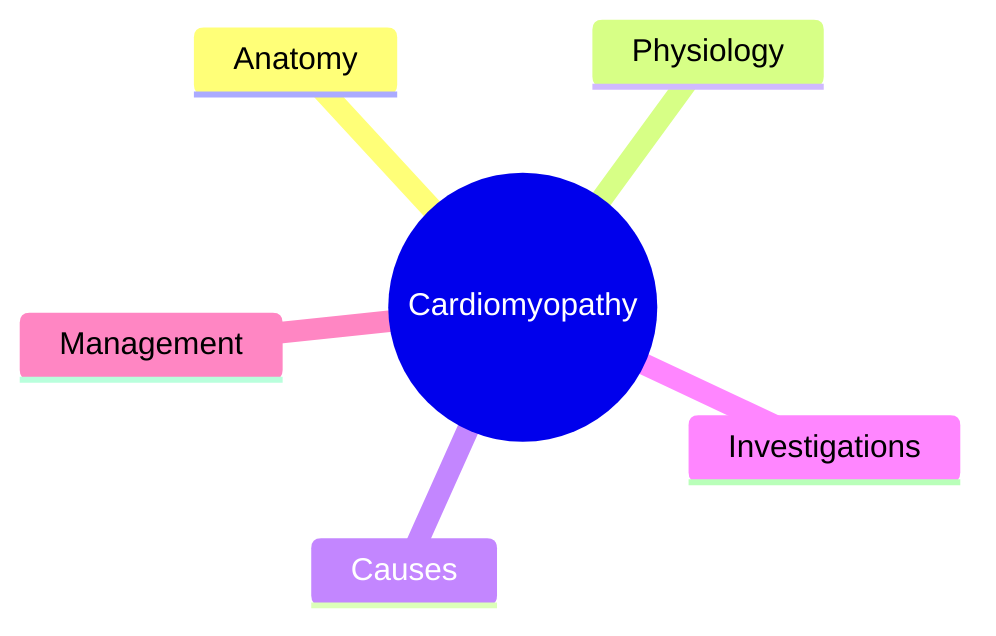
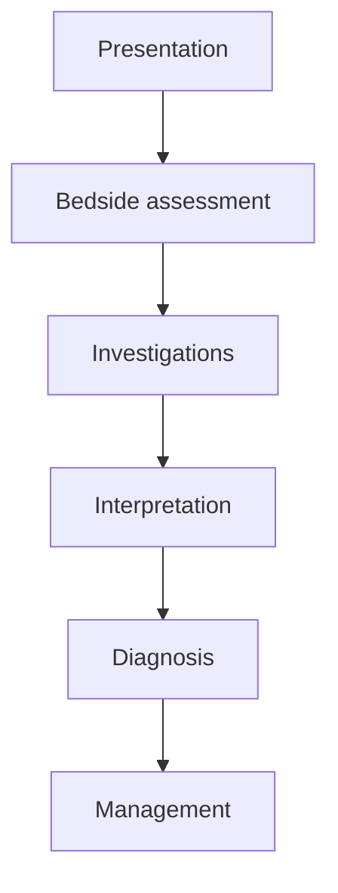

# Cardiomyopathy

> [!note]
> Starter Chapter 16 note seeded from the cardiology template. Expand into a full high-yield note topic-by-topic.

Related: [[ACS]], [[Heart Failure]], [[Arrhythmias]], [[Valvular Heart Disease]]

> [!important]
> Use Gray's + Davidson for anatomy, Ganong + Guyton & Hall + Davidson for physiology, and Davidson + PasTest + notes for clinical discussion.

> [!tip]
> Add ECG interpretation, murmur clues, hemodynamic profiling, ACS pathways, and drug cautions when relevant.

## Learning Objectives
- Recognize the core classification and clinical spectrum of Cardiomyopathy.
- Build an exam-ready diagnostic and interpretation approach for Cardiomyopathy.
- Connect bedside findings, investigations, and management priorities in Cardiomyopathy.

## Definition

## Core Anatomy

## Core Physiology

## Normal Values / Important Cut-offs

## Classification

## Etiology / Causes

## Risk Factors

## Pathophysiology

## Clinical Features

## Approach / Algorithm

## Investigations

## Interpretation Frameworks

## Diagnosis

## Differential Diagnosis

## Tables / Comparison Charts

## Management

## Drug Interactions / Contraindications / Comorbidity Cautions

## Procedures / Indications / Contraindications

## Procedure Mini-Sections
- Procedure:
- Indications:
- Contraindications:
- Complications:
- Viva Pearls:

## Complications

## Red Flags / Emergencies

## Prognosis

## Topic Correlation

## Special Situations

## FCPS/MRCP High-Yield Points

## Common Viva Questions
1. 
2. 
3. 
4. 
5. 

## Common Confusions / Exam Traps

## Mnemonics

## Mind Map

## Flowchart

## Suggested Visuals / Image Notes

## Suggested Video References

## One-Page Revision Summary
- 
- 
- 
- 
- 

## 24-Hour Recall Prompts
- Explain the topic in 2 minutes without looking at the note.
- Write the core diagnostic approach from memory.
- State the first-line management and one important contraindication/caution.
- Compare this topic with one close differential diagnosis.

## 7-Day / 15-Day / 30-Day Revision Tracker
- [ ] Day 1 completed
- [ ] 24-hour recall completed
- [ ] Day 7 revision completed
- [ ] Day 15 revision completed
- [ ] Day 30 revision completed

## Must Know / Should Know / Nice to Know
### Must Know
- 
- 
- 

### Should Know
- 
- 
- 

### Nice to Know
- 
- 

## My Weak Points
- 
- 
- 

## Self-Test Scorecard
- Understanding: /10
- Recall: /10
- MCQ Performance: /10
- SBA Performance: /10
- Viva Confidence: /10
- Total: /50

> [!tip]
> Interpretation: <35 = weak topic, 35-44 = acceptable but insecure, 45+ = strong exam-ready topic.

## Exam Answer Modes
### Long Answer Skeleton
- 

### Short Note Skeleton
- 

### Viva One-Liners
- 

### Ward-Case Discussion Points
- 

### Last-Night-Before-Exam Sheet
- 

## Summary

## MCQs (10)
1. 
2. 
3. 
4. 
5. 
6. 
7. 
8. 
9. 
10. 

## SBA Questions (10)
1. 
2. 
3. 
4. 
5. 
6. 
7. 
8. 
9. 
10. 

## Flashcards
- Q: 
  A: 
- Q: 
  A: 
- Q: 
  A: 

## Answer Key with Explanations
1. 
2. 
3. 
4. 
5. 
6. 
7. 
8. 
9. 
10.

## PasTest Scenario SBAs (Clinical Vignettes)

> **Auto-generated PasTest/Mediscope-style scenario SBAs** grounded in the authored source. Each scenario tests a real clinical fact (triad, specific sign, contraindication, trial, first-line Rx) extracted from the topic. *Source: Ch 16: Cardiology — Restrictive infiltrative cardiomyopathies (amyloid*

**Q1.** What is the most appropriate first-line therapy for Restrictive infiltrative cardiomyopathies (amyloid?

  - **A.** Diuretics
  - **B.** An advanced/surgical therapy reserved for refractory disease
  - **C.** Symptomatic treatment only, no disease-modifying therapy
  - **D.** Empiric broad-spectrum therapy without specific indication

  > **Answer: A** — Diuretics
  >
  > *Source:* **Diuretics** for congestion.

