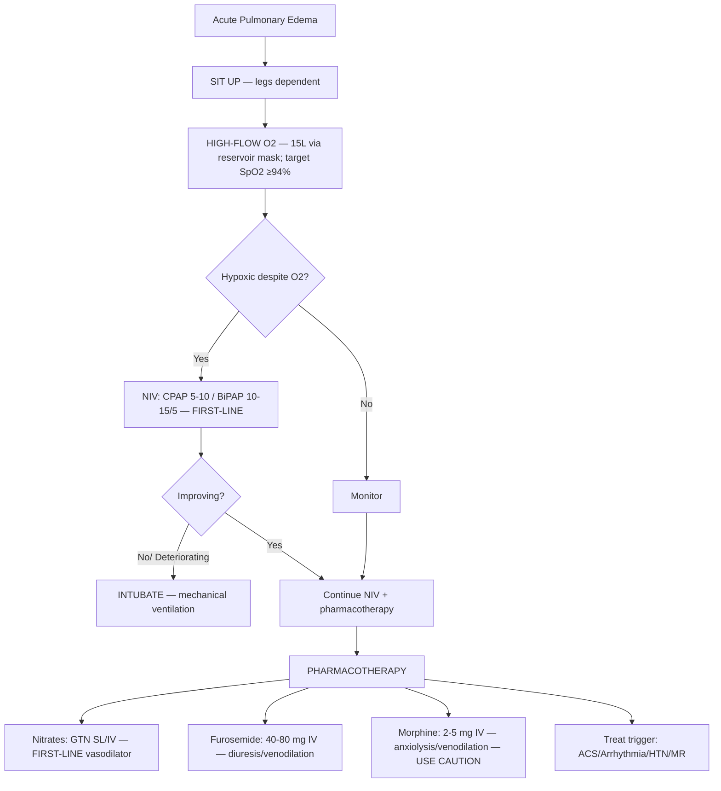

# Acute Pulmonary Edema (Flash Pulmonary Edema)

Related: [[../Cardiology MOC|Cardiology MOC]] · [[../Davidson Chapter 16 - Cardiology Hierarchy|Cardiology Hierarchy]] · [[../Heart Failure and Acute Cardiac Decompensation|Heart Failure and Acute Cardiac Decompensation]] · [[Acute decompensated heart failure]] · [[Cardiogenic shock]] · [[Hypertensive emergency]] · [[Acute Coronary Syndrome]] · [[Mitral regurgitation]] · [[Acute Respiratory Distress Syndrome]]

> [!important]
> Acute pulmonary edema is a **life-threatening cardiogenic emergency** — "flash" onset dyspnea, hypoxia, frothy sputum. FCPS/MRCP exams test: **immediate ABC management** (sit up, high-flow O2, NIV/intubation), **vasodilators + diuretics** (nitrates first-line, furosemide), **treat the trigger** (ACS, arrhythmia, HTN emergency, MR), and **differentiate from non-cardiogenic** (ARDS, altitude, opioid, neurogenic).

## Learning Objectives
- Recognize acute pulmonary edema: sudden dyspnea, orthopnea, hypoxia, pink frothy sputum, bilateral crackles
- Initiate immediate life-saving management: positioning, O2, NIV, IV diuretics, vasodilators
- Identify and treat precipitating causes: ACS, arrhythmia, hypertensive emergency, acute MR, medication non-adherence
- Differentiate cardiogenic from non-cardiogenic pulmonary edema (ARDS, high-altitude, neurogenic, opioid)
- Determine escalation criteria: NIV failure → intubation, refractory shock → mechanical support
- Understand pathophysiology: ↑ LA pressure → ↑ pulmonary capillary pressure → alveolar flooding

## Definition
**Acute pulmonary edema** = rapid accumulation of fluid in pulmonary alveoli and interstitium due to **acutely elevated left atrial pressure** (>25 mmHg).
- **Flash pulmonary edema**: onset minutes-hours, severe dyspnea at rest, "drowning" sensation
- **Cardiogenic** (this topic) vs **non-cardiogenic** (ARDS, high-altitude, neurogenic, opioid, toxin)
- **Precipitants**: ACS, arrhythmia (AF RVR), hypertensive emergency, acute MR (papillary rupture), volume overload, medication non-adherence

## Pathophysiology
```
↑ LVEDP → ↑ LA pressure → ↑ Pulmonary venous pressure → ↑ Pulmonary capillary pressure (>25 mmHg)
     → Fluid transudation into interstitium → Alveolar flooding → Impaired gas exchange → Hypoxemia
```
- **Starling forces**: capillary hydrostatic pressure > oncotic pressure → filtration
- **Lymphatic drainage** overwhelmed (>20 mL/hr)
- **Surfactant washout** → atelectasis → V/Q mismatch → hypoxemia

## Clinical Features

| Feature | Finding |
|---------|---------|
| **Dyspnea** | Sudden, severe, at rest, "air hunger" |
| **Orthopnea** | Cannot lie flat; sits upright, tripod position |
| **Cough** | **Pink frothy sputum** (classic) |
| **Vitals** | Tachycardia, **hypertension** (early), hypotension (late/shock), tachypnea >30, SpO2 <90% |
| **JVP** | Elevated (if RV failure/tricuspid regurg) |
| **Lungs** | **Bilateral basal crackles** → diffuse; wheeze ("cardiac asthma") |
| **Heart** | S3 gallop, tachycardia, new MR (functional), displaced apex |
| **Extremities** | Cool, diaphoresis (sympathetic surge) |
| **Mental** | Anxiety, confusion (hypoxia/hypercapnia) |

## Immediate Management (First 15 Minutes) — ABC



### 1. Positioning
- **Sit upright, legs dangling** — ↓ venous return, ↓ LV preload

### 2. Oxygen & Ventilation
| Modality | Indication | Settings |
|----------|------------|----------|
| **High-flow O2** | All patients | 15L reservoir mask, SpO2 ≥94% |
| **NIV (CPAP/BiPAP)** | **First-line for respiratory failure** (pH<7.35, RR>25, SpO2<90% on O2) | CPAP 5-10 cmH2O or BiPAP 10-15/5 cmH2O |
| **Intubation** | NIV failure, GCS<8, hemodynamic collapse, cardiac arrest | Lung-protective ventilation |

> [!tip]
> **3CPO / REVIVE trials**: NIV (CPAP/BiPAP) ↓ intubation rate, ↓ mortality in cardiogenic pulmonary edema. **Start early.**

### 3. Pharmacotherapy

| Drug | Dose | Mechanism | Notes |
|------|------|-----------|-------|
| **IV Nitrates (GTN)** | **SL 0.5 mg → IV 5-20 μg/min titrate** | Venodilation → ↓ preload; arteriodilation → ↓ afterload | **First-line**; avoid if SBP<90, RV infarct, recent PDE5i |
| **IV Furosemide** | **40-80 mg IV bolus** (200 mg if on chronic diuretic) | Loop diuretic + **acute venodilation** (prostaglandins) | Give **after** nitrates; monitor K+, renal |
| **Morphine** | 2-5 mg IV | Venodilation, anxiolysis, ↓ sympathetic drive | **Caution**: respiratory depression, hypotension; less favored now |
| **Inotropes** (dobutamine) | 2.5-20 μg/kg/min | ↑ contractility, ↓ afterload | Only if **SBP<90 + signs of hypoperfusion** |
| **Vasopressors** (norepinephrine) | 0.05-0.5 μg/kg/min | ↑ SVR | Only if **cardiogenic shock** (SBP<90) |

> [!warning]
> **Morphine contraindicated** if SBP<90, respiratory depression risk, elderly. **NICE/ESC**: nitrates + diuretics first.

### 4. Treat the Trigger (Essential)

| Trigger | Specific Management |
|---------|---------------------|
| **ACS** (STEMI/NSTEMI) | Urgent coronary angiography ± PCI |
| **Arrhythmia** (AF RVR, VT) | Rate control (BB/CCB/digoxin) or cardioversion if unstable |
| **Hypertensive emergency** | IV labetalol/nitroprusside/clevidipine — target MAP ↓25% in 1h |
| **Acute MR** (papillary rupture) | Vasodilators (↓ afterload), IABP, **urgent surgery** |
| **Volume overload** (non-adherence, renal failure) | Aggressive diuresis ± ultrafiltration/dialysis |
| **Infection/sepsis** | Antibiotics, fluids cautious, source control |

## Differentiation: Cardiogenic vs Non-Cardiogenic

| Feature | Cardiogenic Pulmonary Edema | Non-Cardiogenic (ARDS) |
|---------|----------------------------|------------------------|
| **Onset** | Acute (minutes-hours) | Subacute (hours-days) |
| **BP** | **Hypertension** common | Normal/hypotension |
| **JVP** | Elevated | Normal/low |
| **PCWP** | **>18 mmHg** | <18 mmHg |
| **Cardiac echo** | LV dysfunction, high E/e' | Normal LV, normal E/e' |
| **CXR** | Cardiomegaly, cephalization, Kerley B, pleural effusions | Normal heart, diffuse bilateral infiltrates |
| **BNP/NT-proBNP** | **Markedly elevated** | Normal/mildly elevated |
| **PaO2/FiO2** | Variable | **<300** (ARDS criteria) |

## Complications
- **Respiratory failure** → intubation, VAP, barotrauma
- **Cardiogenic shock** → end-organ hypoperfusion
- **Arrhythmias** (AF, VT) from hypoxemia/stretch
- **Acute kidney injury** (cardiorenal syndrome)
- **Pneumonia** (aspiration, VAP post-intubation)

## Prognosis
- **In-hospital mortality**: 7-15% (lower with early NIV)
- **Predictors of death**: age >75, SBP<90, renal failure, acidosis (pH<7.25), cardiac arrest
- **Recurrence**: high if trigger not addressed (medication adherence, BP control, HF optimization)

## Red Flags / Exam Traps
- **NIV contraindicated**: GCS<8, hemodynamic instability, facial trauma, inability to protect airway
- **Morphine in hypotensive/elderly** — respiratory depression, hypotension
- **Furosemide before nitrates** — less effective, more ototoxicity
- **Beta-blockers in acute setting** — can worsen HF/shock; hold until stable
- **Missing ischemic trigger** — ECG/troponin mandatory in all new-onset flash pulmonary edema
- **Non-cardiogenic mimic** (ARDS, altitude, opioid, neurogenic) — different management

## FCPS/MRCP High-Yield Points
- **Sit up + O2 + NIV** = immediate life-saving steps
- **Nitrates (GTN) FIRST** — venodilation ↓ preload, arteriodilation ↓ afterload
- **Furosemide 40-80mg IV** — after nitrates; venodilator effect in minutes
- **NIV (CPAP/BiPAP)** ↓ intubation, ↓ mortality — start early
- **Treat trigger**: ACS, AF RVR, HTN emergency, acute MR
- **Differentiate from ARDS**: HTN + JVP + high BNP + cardiomegaly = cardiogenic
- **Morphine caution**: avoid if hypotensive, respiratory depression risk

## Common Viva Questions
1. Immediate management of acute pulmonary edema?
2. Why NIV in cardiogenic pulmonary edema?
3. Nitrates vs furosemide — which first and why?
4. How to differentiate cardiogenic from non-cardiogenic pulmonary edema?
5. When to intubate acute pulmonary edema?
6. Precipitating causes to look for?

## Common Confusions / Exam Traps
- Giving furosemide before nitrates (nitrates work faster, less renal risk)
- Starting beta-blocker in acute decompensation (hold until euvolemic/stable)
- Using morphine routinely (NICE: avoid; ESC: caution)
- Missing non-cardiogenic causes (ARDS, opioid, altitude, neurogenic)
- Delaying NIV → worse outcomes

## Mind Map
```mermaid
mindmap
  root((Acute Pulmonary Edema))
    Immediate ABC
      Sit up, legs down
      High-flow O2
      NIV (CPAP/BiPAP) early
    Pharmacotherapy
      Nitrates FIRST (GTN SL/IV)
      Furosemide IV after nitrates
      Morphine caution
      Inotropes if shock
    Triggers
      ACS / Arrhythmia / HTN emergency
      Acute MR / Volume overload
      Non-adherence / Infection
    Differentiation
      Cardiogenic: HTN, JVP, high BNP, cardiomegaly
      Non-cardiogenic: normal BP/JVP, low BNP, normal heart
    Escalation
      NIV fail → Intubate
      Shock → Inotropes/vasopressors
      Refractory → Mechanical support
```

## One-Page Revision Summary
- **Flash pulmonary edema** = sudden severe dyspnea, pink frothy sputum, bilateral crackles
- **Immediate**: Sit up → O2 → NIV (CPAP/BiPAP) → **GTN SL/IV first** → Furosemide IV → Treat trigger
- **NIV** ↓ intubation & mortality — early!
- **Triggers**: ACS, AF RVR, HTN emergency, acute MR, volume overload
- **Cardiogenic vs ARDS**: HTN + JVP + high BNP + cardiomegaly = cardiogenic
- **Morphine caution**: avoid if hypotensive/elderly
- **Hold BB** until stable

## 24-Hour Recall Prompts
- State immediate ABC management in order
- Why GTN before furosemide?
- List 5 precipitating causes
- Draw cardiogenic vs non-cardiogenic comparison table
- NIV criteria and settings for pulmonary edema

## 7-Day / 15-Day / 30-Day Revision Tracker
- [ ] Day 1 completed
- [ ] 24-hour recall completed
- [ ] Day 7 revision completed
- [ ] Day 15 revision completed
- [ ] Day 30 revision completed

## Must Know / Should Know / Nice to Know
### Must Know
- Sit up, O2, NIV, GTN, Furosemide
- NIV early ↓ intubation/mortality
- GTN first, then furosemide
- Triggers: ACS, AF, HTN, MR
- Cardiogenic vs ARDS differentiation

### Should Know
- NIV settings (CPAP 5-10, BiPAP 10-15/5)
- Morphine caution
- Inotropes/vasopressors for shock
- Acute MR = urgent surgery

### Nice to Know
- Ultrafiltration for diuretic resistance
- Mechanical support (IABP, Impella) in refractory
- Long-term HD optimization post-discharge

## Self-Test Scorecard
- Understanding /10
- Recall /10
- Management algorithm /10
- MCQ performance /10
- Viva confidence /10
- **Total /50**

> [!tip]
> **Interpretation**: <35 = weak topic; 35-44 = acceptable but insecure; 45+ = strong exam-ready topic.

## Exam Answer Modes
### Long Answer Skeleton
1. Definition + pathophysiology (Starling forces, LA pressure >25 mmHg)
2. Clinical presentation (dyspnea, frothy sputum, crackles, hypoxia)
3. Immediate management (ABC: sit up, O2, NIV, pharmacotherapy)
4. Pharmacotherapy algorithm (GTN → furosemide → treat trigger)
5. Precipitating causes table
6. Cardiogenic vs non-cardiogenic differentiation
7. Escalation: NIV failure → intubation; shock → inotropes
8. Prognosis and recurrence prevention

### Short Note Skeleton
- Flash pulmonary edema: dyspnea, frothy sputum, crackles, hypoxia
- ABC: sit up, O2, NIV
- GTN first (venodilation), then furosemide
- NIV early = ↓ intubation, ↓ death
- Triggers: ACS, AF, HTN, MR
- Cardiogenic: HTN, JVP, high BNP, big heart
- ARDS: normal BP/JVP, normal BNP, normal heart

### Viva One-Liners
- "Sit up, O2, NIV, GTN, Furosemide = first 15 minutes"
- "GTN before furosemide — faster venodilation, renal sparing"
- "NIV in cardiogenic edema ↓ intubation AND mortality"
- "Pink frothy sputum = flash pulmonary edema"
- "Cardiogenic: hypertensive, high BNP; ARDS: normotensive, normal BNP"

### Ward-Case Discussion Points
- "65M, HTN, sudden dyspnea, pink frothy sputum, BP 180/100, bilateral crackles" → "Flash pulmonary edema. Sit up, O2, CPAP 8, GTN 10 μg/min, furosemide 80mg IV. CT angio if ACS suspected."
- "75F, AF RVR 140, acute dyspnea, crackles, BP 110/70" → "AF-triggered pulmonary edema. Rate control (digoxin/amiodarone if hypotensive). NIV. GTN + furosemide."
- "50M, post-MI day 3, acute dyspnea, new MR, pink sputum, hypotension" → "Papillary muscle rupture. Echo for flail leaflet. Nitroprusside, IABP, URGENT MV surgery."

### Last-Night-Before-Exam Sheet
- Sit up → O2 → NIV → GTN → Furosemide
- GTN first (venodilation fast)
- NIV: CPAP 5-10 / BiPAP 10-15/5
- Triggers: ACS, AF, HTN, MR
- Cardiogenic = HTN + JVP + high BNP
- Morphine caution
- No BB in acute

## Summary
**Acute pulmonary edema** is a **cardiogenic emergency** caused by **acute left atrial pressure elevation** (>25 mmHg) leading to alveolar flooding. **Immediate management (first 15 min)**: **Sit upright** → **high-flow O2** → **NIV (CPAP/BiPAP) early** (↓ intubation & mortality) → **IV nitrates FIRST** (GTN SL/IV — rapid venodilation ↓ preload, arteriodilation ↓ afterload) → **IV furosemide** (40-80 mg) → **treat the trigger** (ACS → angiography; AF RVR → rate control; HTN emergency → IV antihypertensives; acute MR → vasodilators + urgent surgery). **Differentiate from ARDS/non-cardiogenic**: cardiogenic = hypertension, elevated JVP, high BNP, cardiomegaly, cephalization; non-cardiogenic = normal BP/JVP, normal BNP, normal heart size. **NIV is first-line for respiratory failure** (↓ intubation, ↓ mortality). **Morphine caution** (hypotension, respiratory depression). **Hold beta-blockers** until euvolemic and stable.

## MCQs (10)
1. First-line vasodilator in acute pulmonary edema:
   A. Furosemide
   B. **IV nitrates (GTN)**
   C. Nitroprusside
   D. Hydralazine
2. Optimal sequence of initial drugs:
   A. Furosemide → Nitrates
   B. **Nitrates → Furosemide**
   C. Morphine → Nitrates
   D. Furosemide → Morphine
3. NIV in acute cardiogenic pulmonary edema — evidence:
   A. Increases intubation rate
   B. **Reduces intubation rate AND mortality** (3CPO, REVIVE)
   C. No benefit
   D. Only BiPAP works, not CPAP
4. Key feature distinguishing cardiogenic from non-cardiogenic (ARDS) pulmonary edema:
   A. Bilateral infiltrates
   B. **Hypertension + elevated JVP + high BNP**
   C. Hypoxemia
   D. Crackles on auscultation
5. Contraindication to NIV in pulmonary edema:
   A. Age >80
   B. **GCS <8 / hemodynamic instability / inability to protect airway**
   C. COPD history
   D. Atrial fibrillation
6. Morphine in acute pulmonary edema — current recommendation:
   A. First-line for all
   B. **Use with caution; avoid if hypotensive, elderly, respiratory depression risk**
   C. Contraindicated in all
   D. Only if pain
7. Most common precipitant of acute pulmonary edema in hypertensive patients:
   A. ACS
   B. **Hypertensive emergency (afterload mismatch)**
   C. Arrhythmia
   D. Acute MR
8. Acute pulmonary edema with new harsh holosystolic murmur at apex radiating to axilla — cause:
   A. Functional MR
   B. **Acute severe MR (papillary muscle rupture / chordal rupture)**
   C. Aortic stenosis
   D. VSD
9. BiPAP settings for acute pulmonary edema:
   A. EPAP 5, IPAP 10
   B. **EPAP 5-10, IPAP 10-15 (PS 5-10)**
   C. EPAP 10, IPAP 20
   D. EPAP 3, IPAP 8
10. When to intubate acute pulmonary edema on NIV:
    A. pH <7.30
    B. **NIV failure: worsening hypoxia, fatigue, GCS<8, hemodynamic instability**
    C. SpO2 <95%
    D. Always after 1 hour

## SBA Questions (10)
1. 68M, sudden dyspnea, pink frothy sputum, BP 190/110, bilateral crackles, SpO2 85% on 15L O2. Best next step:
   A. Furosemide 80 mg IV
   B. **GTN SL + CPAP 8 cmH2O**
   C. Morphine 5 mg IV
   D. Intubation
2. 72F, acute pulmonary edema, BP 85/50, cool peripheries, confusion. Management:
   A. GTN IV + furosemide
   B. **Norepinephrine + dobutamine + consider mechanical support**
   C. Morphine + furosemide
   D. High-dose nitrates
3. 55M, acute dyspnea, pink frothy sputum, BP 90/60, HR 120 irregular (AF RVR). Best rate control:
   A. Metoprolol IV
   B. **Digoxin IV load or amiodarone if hemodynamically unstable**
   C. Verapamil IV
   D. Diltiazem IV
4. 45F, acute dyspnea, bilateral crackles, pink sputum, BP 100/60, normal JVP, normal heart size on CXR, BNP 80 pg/mL. Most likely:
   A. Cardiogenic pulmonary edema
   B. **Non-cardiogenic (ARDS/other)**
   C. Hypertensive emergency
   D. Acute MR
5. Patient on NIV for pulmonary edema — indication for intubation:
   A. SpO2 92% on FiO2 0.6
   B. **Exhaustion, GCS drop, worsening acidosis (pH<7.25), hemodynamic collapse**
   C. RR 25
   D. 2 hours on NIV
6. Acute pulmonary edema post-MI day 3, new loud apical pansystolic murmur radiating to axilla, flash edema, hypotension. Diagnosis:
   A. Functional MR
   B. **Papillary muscle rupture**
   C. VSD
   D. Free wall rupture
7. Why GTN before furosemide?
   A. More potent diuretic
   B. **Rapid venodilation (minutes), preload reduction; furosemide venodilation slower, renal risk**
   C. Cheaper
   D. Lower hypotension risk
8. Acute pulmonary edema — contraindicated drug in RV infarction component:
   A. Furosemide
   B. **Nitrates**
   C. Oxygen
   D. Morphine
9. CPAP vs BiPAP in cardiogenic pulmonary edema:
   A. BiPAP superior mortality benefit
   B. **Equivalent; CPAP simpler, BiPAP if hypercapnic**
   C. CPAP contraindicated
   D. BiPAP only
10. Acute pulmonary edema with SBP 80 mmHg — priority:
    A. High-dose nitrates
    B. **Inotropes (dobutamine) + consider mechanical support**
    C. Aggressive diuresis
    D. Morphine

## Flashcards
- Q: First drug in flash pulmonary edema?
  A: GTN (SL/IV) — rapid venodilation
- Q: NIV settings?
  A: CPAP 5-10; BiPAP EPAP 5-10, IPAP 10-15 (PS 5-10)
- Q: Drug sequence?
  A: GTN → Furosemide → Treat trigger
- Q: Cardiogenic vs ARDS?
  A: Cardiogenic = HTN + JVP + high BNP + big heart
- Q: Morphine?
  A: Caution — avoid if hypotensive/elderly
- Q: Acute MR murmur?
  A: Apical pansystolic, radiates axilla = papillary rupture
- Q: Triggers?
  A: ACS, AF RVR, HTN emergency, MR, volume overload
- Q: Intubation criteria on NIV?
  A: Exhaustion, GCS drop, worsening acidosis, hemodynamic collapse
- Q: HTN emergency pulmonary edema?
  A: Afterload mismatch → nitroprusside/labetalol + GTN
- Q: IV furosemide dose?
  A: 40-80mg (200mg if chronic diuretic)

## Answer Key with Explanations
### MCQs
1. **B** — GTN provides rapid venodilation (minutes) and arteriodilation; first-line.
2. **B** — Nitrates act faster (venodilation in 2-3 min), furosemide follows.
3. **B** — 3CPO/REVIVE: NIV ↓ intubation 50-60%, ↓ mortality.
4. **B** — Cardiogenic: HTN, JVD, high BNP, cardiomegaly; ARDS: normal BP/JVP, low BNP, normal heart.
5. **B** — NIV contraindicated if GCS<8, hemodynamic instability, facial trauma, unable to protect airway.
6. **B** — Morphine: caution — respiratory depression, hypotension; not first-line (NICE/ESC).
7. **B** — Hypertensive emergency → afterload mismatch → flash edema; half of cases.
8. **B** — New apical pansystolic radiating to axilla = papillary muscle rupture (posteromedial).
9. **B** — Equivalent outcomes; CPAP simpler; BiPAP if hypercapnic (PaCO2>45).
10. **B** — Cardiogenic shock: inotropes + mechanical support; nitrates/diuretics contraindicated.

### SBAs
1. **B** — Hypertensive flash edema: immediate CPAP + GTN (venodilation + afterload reduction).
2. **B** — Cardiogenic shock (SBP<90, hypoperfusion): inotropes/vasopressors ± mechanical support; nitrates/diuretics worsen.
3. **B** — AF RVR with hypotension: digoxin (safe, slow) or amiodarone; BB/CCB contraindicated.
4. **B** — Normal JVP, normal heart, low BNP = non-cardiogenic (ARDS likely).
5. **B** — NIV failure = exhaustion, GCS drop, pH<7.25, hemodynamic collapse.
6. **B** — Post-MI day 3 + flash edema + new apical pansystolic/axilla = papillary rupture.
7. **B** — GTN venodilation in 2-3 min; furosemide renal excretion delay, less acute preload reduction.
8. **B** — RV infarct = preload dependent; nitrates cause profound hypotension.
9. **B** — 3CPO: CPAP/BiPAP equivalent mortality; CPAP simpler.
10. **B** — SBP<90 = cardiogenic shock; inotropes (dobutamine) ± IABP/Impella; no nitrates.

---