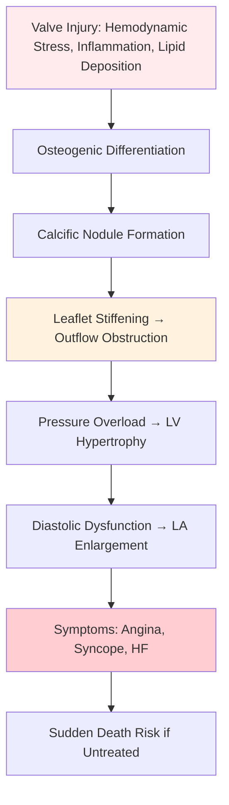

<!-- Source: /mnt/tb/Medicine/Cardiology/05_Valvular_Heart_Disease/TAVI_vs_SAVR_risk_scores_heart_team.md | section: 16.5 | hub: valvular-heart-disease -->

# TAVI vs SAVR - FCPS/MRCP Exam Note

> [!tip] **TAVI vs SAVR in 30 Seconds**
> - **Indication:** Symptomatic severe AS (or asymptomatic with LV dysfunction/very severe gradients)
> - **Decision:** **Heart Team** assessment using **STS-PROM/EuroSCORE II** + anatomical/clinical factors
> - **TAVI Preferred:** Age ≥75, STS >4-8%, frailty, porcelain aorta, prior chest RT, hostile chest
> - **SAVR Preferred:** Age <65-70, low surgical risk, bicuspid AS, need for concomitant CABG/other surgery
> - **Key Trials:** PARTNER 1-3, CoreValve, EVOLUT, NOTION, SURTAVI → TAVI non-inferior/superior in high/intermediate risk

---

## 1. HIGH-YIELD SUMMARY

| Aspect | Key Points |
|--------|------------|
| **Definition** | TAVI = Transcatheter Aortic Valve Implantation; SAVR = Surgical Aortic Valve Replacement |
| **Indication** | Severe symptomatic AS (or asymptomatic with LVEF<50%, very severe gradients, exercise symptoms) |
| **Clinical Pearl** | **Heart Team decision mandatory**; Age and STS-PROM are primary drivers but anatomy/frailty matter |
| **Exam Triggers** | TAVI vs SAVR indications, risk scores (STS, EuroSCORE), valve types, complications (PPM, conduction, leak) |
| **Management Priority** | Severe symptomatic AS → **Revascularization ASAP** (TAVI or SAVR based on risk) |

---

## 2. ETIOLOGY & PATHOPHYSIOLOGY

### 2.1 Aortic Stenosis Etiology (Context for Procedure Choice)

| Etiology | Age Group | Implications for TAVI/SAVR |
|----------|-----------|---------------------------|
| **Degenerative (Calcific)** | >65-70 | **Most common**; suitable for both TAVI/SAVR |
| **Bicuspid Aortic Valve** | <65 | **SAVR traditionally preferred**; TAVI off-label (anatomical challenges: asymmetry, calcification, aortopathy) |
| **Rheumatic** | <50 (developing) | Rare in West; often mixed AS/AR; SAVR often needed for concomitant MV disease |

### 2.2 Pathophysiology of AS Progression



---

## 3. CLINICAL FEATURES & INDICATIONS FOR INTERVENTION

### 3.1 Symptomatic Severe AS - CLASS I INDICATION

| Symptom | Mechanism | Significance |
|---------|-----------|--------------|
| **Angina** | Supply-demand mismatch (LVH + reduced coronary perfusion) | 50% 5-yr mortality if untreated |
| **Syncope** | Fixed CO → cerebral hypoperfusion on exertion/arrhythmia | 50% 3-yr mortality if untreated |
| **Heart Failure** | Diastolic/systolic dysfunction | 50% 2-yr mortality if untreated |

### 3.2 Asymptomatic Severe AS - Intervention Indications (Class IIa/IIb)

| Indication | Class | Threshold |
|------------|-------|-----------|
| **LVEF <50%** | IIa | Clear benefit |
| **Very Severe AS** (Vmax >5.5 m/s, MG >60, AVA <0.6) | IIa | Rapid progression |
| **Exercise Test Positive** (symptoms, ↓BP, arrhythmia) | IIa | Objective evidence |
| **Very Severe + Rapid Progression** | IIb | Individualize |
| **Extreme Gradients + Surgery Planned** | IIa | Concomitant surgery |

---

## 4. RISK STRATIFICATION - SURGICAL RISK SCORES

### 4.1 STS-PROM (Society of Thoracic Surgeons Predicted Risk of Mortality)

> **Primary risk score for TAVI/SAVR decision**
> - **Online calculator:** age, sex, BMI, NYHA, LVEF, Cr, dialysis, COPD, PVD, CVD, prior cardiac surgery, MI timing, urgency, etc.
> - **Thresholds:** <4% = Low; 4-8% = Intermediate; >8% = High/Extreme

### 4.2 EuroSCORE II

> **European alternative; similar variables**
> - **Thresholds:** <2% Low; 2-5% Intermediate; >5% High

### 4.3 Frailty Assessment (Essential for Elderly)

| Domain | Tools |
|--------|-------|
| **Physical** | 5-m walk test, grip strength, SPPB |
| **Nutritional** | Albumin, weight loss, MNA |
| **Cognitive** | MoCA, MMSE |
| **Disability** | Katz ADL, IADL |
| **Composite** | **Essential Frailty Toolset (EFT)** - gait speed, cognition, hemoglobin, albumin |

> **Frailty + High STS → TAVI Preferred**

---

## 5. TAVI VS SAVR - DECISION ALGORITHM

```mermaid
flowchart TD
    A[Severe Symptomatic AS] --> B[Heart Team Assessment]
    B --> C{Anatomical Suitability for TAVI?}
    C -->|No: Bicuspid, Severe Calcification, Small/Root, Coronary obstruction risk| D[**SAVR**]
    C -->|Yes| E{Risk Assessment}
    E --> F[STS-PROM / EuroSCORE II]
    E --> G[Frailty Assessment]
    E --> H[Patient Preference]
    F --> I{Age & Risk}
    I -->|Age ≥75 OR STS >4-8% OR Frail| J[**TAVI Preferred**]
    I -->|Age <70 AND Low Risk (STS<4%)| K[**SAVR Preferred**]
    I -->|Gray Zone: Age 70-75, Intermediate| L[**Heart Team / Patient Choice**]
    L --> M[TAVI: Faster recovery, less bleeding]
    L --> N[SAVR: Durability, lower PPM, lower paravalvular leak]
    
    style J fill:#c8e6c9
    style K fill:#e1bee7
    style L fill:#fff3e0
```

### 5.1 Key Decision Factors

| Factor | Favors **TAVI** | Favors **SAVR** |
|--------|-----------------|-----------------|
| **Age** | ≥75-80 | <65-70 |
| **STS-PROM** | >4-8% | <4% |
| **Frailty** | Present (EFT+) | Absent |
| **Anatomy** | TAVI-suitable annulus/access | Bicuspid, heavy LVOT calcification |
| **Coronary Disease** | Prior CABG, hostile chest | Concomitant CABG needed |
| **Aorta** | Porcelain aorta, prior chest RT | Normal |
| **Bleeding Risk** | High (HAS-BLED) | Standard |
| **Durability Need** | Limited life expectancy | Long life expectancy (>15-20yr) |
| **Conduction** | Pre-existing LBBB/RBBB (higher PPM risk) | Lower PPM risk |

---

## 6. VALVE TYPES & EVIDENCE

### 6.1 TAVI Valve Platforms

| Valve | Type | Key Features | Key Trials |
|-------|------|--------------|------------|
| **Edwards SAPIEN 3/3 Ultra** | Balloon-expandable | Low profile (14Fr), sealing skirt | PARTNER 3, SURTAVI |
| **Medtronic Evolut R/PRO/FX** | Self-expanding | Repositionable, supra-annular | CoreValve, EVOLUT, SURTAVI |
| **Boston Scientific ACURATE** | Self-expanding | Stable, low leak | VISIONARY |
| **JenaValve Trilogy** | Self-expanding | Tri-leaflet, anchoring | ALIGN AR |

### 6.2 Key Trial Evidence (Memorize)

| Trial | Population | Comparison | Key Finding |
|-------|------------|------------|-------------|
| **PARTNER 1A** | High risk (STS>15%) | TAVI (Sapien) vs SAVR | **Non-inferior mortality at 1yr**; ↑ vascular comp, ↑ pacemaker |
| **PARTNER 2A** | Intermediate risk (STS 4-8%) | TAVI (Sapien XT) vs SAVR | **Non-inferior 2yr mortality**; ↓ bleeding, ↑ pacemaker, ↑ PVR |
| **PARTNER 3** | Low risk (STS<4%) | TAVI (Sapien 3) vs SAVR | **Superior 1yr death/stroke/rehosp**; ↓ AF, ↓ bleed, ↑ PPM |
| **CoreValve US Pivotal** | High/Extreme risk | TAVI (CoreValve) vs SAVR | **Superior 1yr mortality** in high risk |
| **SURTAVI** | Intermediate risk | TAVI (Evolut) vs SAVR | **Non-inferior 2yr death/stroke** |
| **EVOLUT Low Risk** | Low risk | TAVI (Evolut) vs SAVR | **Non-inferior 3yr death/disabling stroke** |
| **NOTION** | Low risk | TAVI (CoreValve) vs SAVR | **Non-inferior 5yr** |

> **Overall:** TAVI **non-inferior or superior** across all risk strata; **durability >10yr data emerging**

---

## 7. PROCEDURAL COMPLICATIONS (Exam High-Yield)

| Complication | TAVI Incidence | SAVR Incidence | Management/Prevention |
|--------------|----------------|----------------|----------------------|
| **Conduction Disturbance (PPM)** | **10-25%** (higher self-expanding) | 5-10% | New LBBB → monitor 48-72h; PPM if persistent AV block |
| **Paravalvular Leak (PVR)** | **5-15%** (mild-mod), <2% severe | <1% (sutured) | Post-dilation, valve sizing, newer skirts |
| **Vascular Complications** | 5-10% (access site) | Rare | Ultrasound-guided access, closure devices |
| **Stroke** | 2-3% | 2-3% | Cerebral protection devices (Sentinel) |
| **Coronary Obstruction** | <1% | Rare | Pre-procedural CT, BASILICA technique |
| **Annular Rupture** | <1% | Rare | Careful sizing, avoid over-dilation |
| **Acute Kidney Injury** | 10-15% (contrast) | 5-10% (CPB) | Hydration, NAC, limit contrast |

### 7.1 Permanent Pacemaker (PPM) - Key Points

| Risk Factor | Impact |
|-------------|--------|
| **Pre-existing RBBB** | ↑↑ Risk (especially self-expanding) |
| **Valve Type** | Self-expanding > Balloon-expandable |
| **Implantation Depth** | Deep implantation → ↑ PPM |
| **New LBBB post-TAVI** | 20-30% → 50% resolve by 48h; persistent → PPM |
| **Guideline** | Monitor 48-72h; PPM if persistent high-grade AV block |

---

## 8. ANTICOAGULATION POST-TAVI/SAVR

| Scenario | Recommendation |
|----------|----------------|
| **TAVI - No other indication** | **Aspirin 75-100mg lifelong + Clopidogrel 75mg × 3-6mo** (ATLANTIS, POPular TAVI) |
| **TAVI + AF (CHA2DS2-VASc ≥2)** | **DOAC preferred** (ENVISAGE-TAVI, ATLAS) - monotherapy or +asa briefly |
| **SAVR - Bioprosthetic** | Aspirin lifelong; Warfarin × 3-6mo if risk factors (atrial fib, LV thrombus) |
| **SAVR - Mechanical** | **Warfarin INR 2.5 (2.0-3.0)** lifelong + Aspirin 75-100mg if low bleed risk |

> **Key Trials:** ATLANTIS (TAVI+AF → DOAC), POPular TAVI (TAVI no AF → ASA mono non-inf), ENVISAGE-TAVI-AF (Edoxaban vs VKA)

---

## 9. SPECIAL POPULATIONS

| Population | TAVI vs SAVR Considerations |
|------------|----------------------------|
| **Bicuspid AS** | **SAVR traditionally**; TAVI off-label (asymmetry, aortopathy, younger); if TAVI → self-expanding, CT sizing |
| **Small Annulus (<20mm)** | **TAVI preferred** (lower PPM risk with supra-annular valves); SAVR → root enlargement |
| **Porcelain Aorta** | **TAVI mandatory** (no cross-clamp) |
| **Prior Chest RT / Hostile Chest** | **TAVI preferred** (no redo sternotomy) |
| **Endocarditis** | **SAVR** (debridement, tissue valves); TAVI contraindicated (active infection) |
| **Dialysis/CKD** | TAVI preferred (no CPB); contrast minimization |

---

## 10. LATEST GUIDELINES (2023-2024)

| Guideline | Key Update |
|-----------|------------|
| **ESC/EACTS VHD 2021/2023** | TAVI **Class I** for age ≥75; Class I for intermediate risk; **Heart Team mandatory** |
| **ACC/AHA VHD 2020/2023** | TAVI **Class I** for >80; Class IIa for 65-80; Shared decision-making emphasized |
| **TAVI Durability** | **PARTNER 3 5yr, NOTION 8yr** - structural valve deterioration low; TAVI durability acceptable |

---

## 11. CONFUSIONS & COMMON PITFALLS

| Confusion/Pitfall | Why It Happens | How to Avoid | Exam Trap |
|-------------------|----------------|--------------|-----------|
| **TAVI = only for inoperable** | Old PARTNER 1A era | **TAVI now Class I for all risk strata** (age-adjusted) | "TAVI for low risk?" → YES (PARTNER 3, EVOLUT Low Risk) |
| **Bicuspid = always SAVR** | Historical exclusion from trials | **TAVI off-label but increasingly used**; CT sizing, self-expanding preferred | "Bicuspid AS 75yr - TAVI?" → Reasonable if high surgical risk |
| **PPM = TAVI failure** | High PPM rates reported | **Expected complication**; monitor 72h; does not negate TAVI benefit | "New LBBB post-TAVI = immediate PPM?" → NO, monitor 48-72h |
| **TAVI valve durability unknown** | Early trials short follow-up | **5-8yr data now available** (PARTNER 3, NOTION) - SVD <5% | "TAVI durability <5yr?" → FALSE |
| **Anticoagulation post-TAVI** | Confusion with DOAC trials | **ATLANTIS/ENVISAGE: DOAC for AF; POPular TAVI: ASA mono if no AF** | "TAVI + AF on apixaban - add aspirin?" → NO, DOAC mono (ATLANTIS) |

---

## 12. MNEMONICS & MEMORY AIDS

```mermaid
mindmap
  root((TAVI vs SAVR Mnemonics))
    HEART_TEAM[**HEART TEAM** = **H**eart **E**am **A**natomy **R**isk **T**eam
      Meaning[Mandatory multidisciplinary decision]
      Use[Every severe AS case]]
    TAVI_IND[TAVI Indications = **A**ge ≥75 **R**isk High **C**onduit **T**issue **A**ccess
      Meaning[ARC TA framework]
      Use[When to choose TAVI]]
    STS_PROM[**STS-PROM** = **S**urgical **T**eam **S**core **P**redicted **R**isk **O**f **M**ortality
      Meaning[Primary risk score]
      Use[TAVI/SAVR threshold]]
    PARTNER[PARTNER = **P**lacement **A**o**RT**ic **N**on-surgical **E**dwards **R**esearch
      Meaning[Landmark TAVI trials]
      Use[Trial evidence recall]]
    POPULAR[POPular TAVI = **A**spirin **M**ono vs **D**ual **A**ntiplatelet
      Meaning[Anticoagulation trial]
      Use[Post-TAVI antithrombotic]]
```

| Mnemonic | Stands For | Application |
|----------|------------|-------------|
| **HEART TEAM** | Mandatory multidisciplinary team | Every severe AS decision |
| **STS >4-8%** | Intermediate risk = TAVI Class I | Risk threshold |
| **AGE ≥75** | TAVI preferred (Class I) | Age threshold |
| **PARTNER 3** | Low risk TAVI superior | Trial evidence |
| **NOAC for AF post-TAVI** | ATLANTIS/ENVISAGE | Anticoagulation choice |

---

## 13. MIND MAP - COMPLETE TOPIC OVERVIEW

```mermaid
mindmap
  root((TAVI vs SAVR))
    Indication[Indication
      Symptomatic[Symptomatic Severe AS]
      Asymptomatic[Asymptomatic: LVEF<50%, Vmax>5.5, Exertional]]
    HeartTeam[Heart Team
      Interventional[Interventional Cardiology]
      Surgery[Cardiac Surgery]
      Imaging[Imaging/Non-invasive]
      Geriatrics[Geriatrics/Frailty]]
    RiskScores[Risk Scores
      STS_PROM[STS-PROM Primary]
      EuroSCORE[EuroSCORE II]
      Frailty[Frailty Assessment]]
    Decision[Decision Algorithm
      Age75[Age ≥75 → TAVI]
      LowRisk[Low Risk <70 → SAVR]
      Gray[Gray Zone → Team/Patient Choice]]
    Valves[Valve Platforms
      Balloon[Balloon-Expandable: Sapien 3]
      Self[Self-Expanding: Evolut]
      Comparison[Leak: BE < SE; PPM: SE > BE]]
    Trials[Key Trials
      Partner1[PARTNER 1: High Risk]
      Partner2[PARTNER 2: Intermediate]
      Partner3[PARTNER 3: Low Risk]
      CoreValve[CoreValve: High/Int]
      Survati[SURTAVI: Intermediate]
      Evolut[EVOLUT: Low Risk]]
    Complications[Complications
      PPM[PPM: SE > BE, RBBB risk]
      PVR[PVR: TAVI > SAVR]
      Stroke[Stroke: ~2-3% both]
      Vascular[Vascular: TAVI access]
      Coronary[Coronary Obstruction]]
    Anticoagulation[Post-Procedure
      No_AF[No AF: ASA + Clopi ×3-6mo]
      AF[AF: DOAC mono]
      SAVR_Bio[SAVR Bio: ASA ± Warfarin]
      SAVR_Mech[SAVR Mech: Warfarin]]
    Special[Special Populations
      Bicuspid[Bicuspid: SAVR preferred]
      Small[Small Annulus: TAVI]
      Porcelain[Porcelain Aorta: TAVI]
      Endo[Endocarditis: SAVR]]
```

---

## 14. REVISION CARDS

| Category | Key Points |
|----------|------------|
| **Definition** | TAVI = transcatheter valve implantation; SAVR = surgical replacement |
| **Indication** | Severe symptomatic AS (angina/syncope/HF); Asymptomatic: LVEF<50%, Vmax>5.5 |
| **Decision** | **Heart Team mandatory**; STS-PROM + Frailty + Anatomy + Patient preference |
| **Key Thresholds** | Age ≥75 → TAVI; Age <70 low risk → SAVR; Intermediate → Shared decision |
| **Key Trials** | PARTNER 3 (low risk TAVI superior); SURTAVI/EVOLUT (intermediate non-inferior) |
| **Complications** | **TAVI: ↑ PPM (esp SE + RBBB), ↑ PVR, vascular**; SAVR: ↑ bleeding, AF, longer recovery |
| **Anticoagulation** | TAVI no AF: ASA + Clopi ×3-6mo; TAVI + AF: DOAC mono; SAVR mechanical: Warfarin |
| **Viva Pearl** | **"Heart Team mandatory; TAVI Class I ≥75; PPM monitor 72h not failure; Bicuspid → SAVR preferred"** |

---

## 15. EXAM DRILLS

### 15.1 MCQs (Single Best Answer)

#### Q1. An 82-year-old man with severe symptomatic AS, STS-PROM 6%, frailty positive. Preferred intervention?
A. SAVR
B. **TAVI**
C. Balloon valvuloplasty
D. Medical management
E. Ross procedure

> **Answer: B**  
> **Explanation:** Age >75 + intermediate STS (4-8%) + frailty → **TAVI preferred (Class I)**.

#### Q2. Which complication is MORE common with self-expanding TAVI valves vs balloon-expandable?
A. Paravalvular leak
B. **Permanent pacemaker implantation**
C. Coronary obstruction
D. Annular rupture
E. Stroke

> **Answer: B**  
> **Explanation:** Self-expanding valves have **higher PPM rates (15-25%)** due to deeper implantation and radial force on conduction system.

#### Q3. A 68-year-old man with bicuspid AS, STS-PROM 3%, no frailty. Preferred intervention?
A. **SAVR**
B. TAVI
C. Balloon valvuloplasty
D. Ross procedure
E. Medical management

> **Answer: A**  
> **Explanation:** Bicuspid AS, low surgical risk, younger age → **SAVR traditionally preferred** (anatomical challenges with TAVI, durability, aortopathy surveillance).

#### Q4. Post-TAVI, a patient develops new LBBB. Next step?
A. Immediate permanent pacemaker
B. **Monitor for 48-72 hours, PPM if persistent high-grade AV block**
C. Urgent electrophysiology study
D. Temporary pacing wire for 1 week
E. Start isoproterenol infusion

> **Answer: B**  
> **Explanation:** New LBBB post-TAVI **resolves in 50% by 48-72h**. Monitor; PPM only if persistent high-grade AV block.

#### Q5. Anticoagulation for TAVI patient with AF (CHA2DS2-VASc 4)?
A. Warfarin INR 2-3
B. **Apixaban 5mg BD (DOAC monotherapy)**
C. Aspirin + Clopidogrel + Apixaban
D. Aspirin + Rivaroxaban
E. No anticoagulation (valve thrombosis risk)

> **Answer: B**  
> **Explanation:** **ATLANTIS/ENVISAGE-TAVI: DOAC monotherapy preferred over VKA** in TAVI+AF. No triple therapy.

### 15.2 SBAs

#### SBA1. A 77-year-old woman with severe AS (AVA 0.7cm², Vmax 4.2 m/s), symptomatic (NYHA III), STS-PROM 5%, frail. Coronary angiography shows 70% mid-LAD stenosis suitable for PCI. Recommended strategy?
A. SAVR + CABG
B. **TAVI + Staged PCI** (or PCI first)
C. TAVI + CABG hybrid
D. Medical management
E. Balloon valvuloplasty

> **Answer: B**  
> **Rationale:** TAVI preferred (age >75, intermediate risk, frail). Coronary disease → staged PCI before/after TAVI (hybrid approach if needed). SAVR+CABG higher risk in frail elderly.

#### SBA2. A 72-year-old man post-TAVI (Evolut) with new LBBB on day 1. Day 2 ECG shows persistent LBBB with PR 220ms. Day 3: high-grade AV block. Action?
A. Continue monitoring
B. **Permanent pacemaker implantation**
C. Temporary pacing wire
D. Isoproterenol infusion
E. Revert to SAVR

> **Answer: B**  
> **Rationale:** Persistent high-grade AV block at 72h → **PPM indicated**. New LBBB + PR prolongation = high risk.

#### SBA3. A 65-year-old man with AS undergoes SAVR with bioprosthetic valve. No AF. Post-op antithrombotic regimen?
A. Warfarin INR 2.5 lifelong
B. **Aspirin 75-100mg lifelong**
C. Aspirin + Clopidogrel × 1yr
D. DOAC × 3mo
E. No antithrombotic needed

> **Answer: B**  
> **Rationale:** Bioprosthetic SAVR, no AF → **Aspirin lifelong** (ACC/AHA Class I). Warfarin ×3-6mo only if additional risk factors (atrial enlargement, LVEF<30%).

---

## 16. VIVA QUESTIONS

| # | Question | Expected Answer Points | Difficulty |
|---|----------|------------------------|------------|
| 1 | **Indications for intervention in severe AS** | Symptomatic (Class I); Asymptomatic: LVEF<50%, Vmax>5.5, exercise symptoms (IIa) | ★★ |
| 2 | **How do you decide TAVI vs SAVR?** | Heart Team; STS-PROM/EuroSCORE II; Frailty; Age; Anatomy; Patient preference | ★★★ |
| 3 | **STS-PROM thresholds for TAVI** | Low <4% (SAVR), Intermediate 4-8% (TAVI Class I), High >8% (TAVI Class I) | ★★★ |
| 4 | **Key differences TAVI vs SAVR complications** | TAVI: ↑ PPM (esp SE+RBBB), ↑ PVR, vascular; SAVR: ↑ bleeding, AF, stroke similar | ★★★ |
| 5 | **New LBBB post-TAVI management** | Monitor 48-72h; 50% resolve; PPM if persistent high-grade AV block | ★★★ |
| 6 | **Bicuspid AS - TAVI or SAVR?** | SAVR preferred (anatomy, aortopathy, younger); TAVI off-label if high risk | ★★★ |
| 7 | **Anticoagulation post-TAVI without AF** | ASA + Clopi ×3-6mo (POPular TAVI); ASA mono if high bleed risk | ★★ |
| 8 | **Anticoagulation post-TAVI with AF** | DOAC monotherapy (ATLANTIS/ENVISAGE); NO triple therapy | ★★★ |
| 9 | **PARTNER 3 trial implications** | Low risk: TAVI superior to SAVR for death/stroke/rehosp at 1yr | ★★★ |
| 10 | **Porcelain aorta - management** | TAVI mandatory (no cross-clamp) | ★★ |
| 11 | **TAVI valve durability evidence** | PARTNER 3 5yr, NOTION 8yr - SVD <5%, hemodynamic durability good | ★★★ |
| 12 | **Frailty assessment tools** | 5m walk, grip strength, SPPB, albumin, MoCA, EFT composite | ★★ |

---

## 17. SPACED REPETITION TRACKER

| Interval | Target Date | Completed | Confidence (1-5) | Next Review |
|----------|-------------|-----------|------------------|-------------|
| **24 hours** | 2026-06-16 | ☐ | - | 2026-06-19 |
| **3 days** | 2026-06-18 | ☐ | - | 2026-06-25 |
| **7 days** | 2026-06-22 | ☐ | - | 2026-07-07 |
| **15 days** | 2026-06-30 | ☐ | - | 2026-07-15 |
| **30 days** | 2026-07-15 | ☐ | - | 2026-08-14 |
| **90 days** | 2026-09-13 | ☐ | - | 2026-12-12 |

---

## 18. CROSS-REFERENCES & NAVIGATION

### Related Topics (Wiki-links)
- [[Etiology_degenerative_bicuspid_rheumatic]] - AS etiology
- [[Hemodynamic_assessment_peak_velocity_mean_gradient_AVA_DVI]] - AS grading
- [[Symptomatic_vs_asymptomatic_management]] - Management criteria
- [[Post_procedure_complications_conduction_disturbances_PPM_leak]] - Complications detail
- [[../08_Cardiac_Devices_EP/Pacemaker_Therapy]] - PPM post-TAVI

### Upstream (Heading Hub)
- [[../05_Valvular_Heart_Disease/Valvular_Heart_Disease_Hub.md]]

---

## 19. METADATA & TRACKING

```yaml
topic: "TAVI vs SAVR (risk scores, heart team)"
section: "05"
section_name: "Valvular Heart Disease"
heading_hub: "Aortic Stenosis (AS)"
topic_group: "Aortic Stenosis"
status: "full-fcps-mrcp-note"
priority: "critical"
cards: 10
created: "2026-06-15"
modified: "2026-06-15"
exam_relevance: [FCPS, MRCP Part 1, MRCP Part 2, PACES]
see_also:
  - "[[../00_Index/Medicine MOC]]"
  - "[[../00_Index/Davidson Chapter Roadmap]]"
  - "[[Davidson Chapter 16 - Cardiology Hierarchy]]"
  - "[[Cardiology MOC]]"
  - "[[Templates/Cardiology Topic Template]]"
```

---

> [!tip] **This note is EXAM-READY** ✅