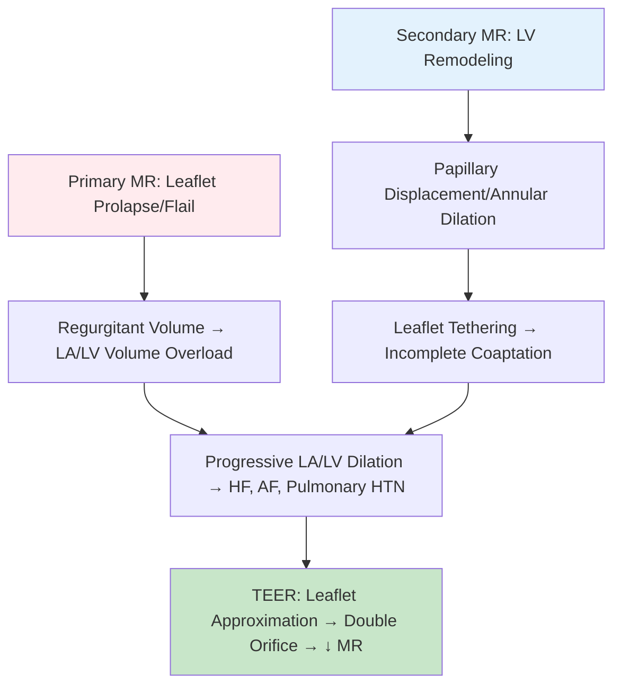

<!-- Source: /mnt/tb/Medicine/Cardiology/05_Valvular_Heart_Disease/Transcatheter_edge_to_edge_repair_TEER_MitraClip.md | section: 16.5 | hub: valvular-heart-disease -->

# TEER / MitraClip - FCPS/MRCP Exam Note

> [!tip] **TEER / MitraClip in 30 Seconds**
> - **Indication:** **Primary MR** (degenerative): Surgical repair preferred (Class I); TEER if high surgical risk/prohibitive
> - **Indication:** **Secondary MR** (functional): **GDMT first**; TEER if symptomatic despite GDMT + favorable anatomy (COAPT criteria)
> - **Anatomy:** Flail gap <10mm, flail width <15mm, coaptation length >2mm, no cleft, no mitral stenosis
> - **Key Trials:** EVEREST II (primary MR), **COAPT** (secondary MR - positive), MITRA-FR (secondary MR - negative - different population)
> - **Contraindication:** Rheumatic MR, mitral stenosis, LAA thrombus, active endocarditis

---

## 1. HIGH-YIELD SUMMARY

| Aspect | Key Points |
|--------|------------|
| **Definition** | TEER = Transcatheter Edge-to-Edge Repair (MitraClip); percutaneous mitral valve repair |
| **Mechanism** | Clip approximates anterior (A2) and posterior (P2) leaflets → double-orifice valve → ↓ MR |
| **Clinical Pearl** | **Primary MR = Surgery first** (repair > replacement); **Secondary MR = GDMT first**, then TEER if COAPT criteria |
| **Exam Triggers** | Primary vs secondary MR, COAPT vs MITRA-FR, anatomical criteria, EVEREST II, surgical risk |
| **Management Priority** | Assess MR etiology → **Primary: Surgery Class I**; **Secondary: GDMT → COAPT-criteria TEER** |

---

## 2. ETIOLOGY & PATHOPHYSIOLOGY

### 2.1 MR Classification - Critical for TEER Decision

| Type | Etiology | Pathophysiology | TEER Role |
|------|----------|-----------------|-----------|
| **Primary (Degenerative)** | Myxomatous (Barlow's, fibroelastic deficiency), rheumatic, endocarditis | **Leaflet/prolapse/flail** - structural abnormality | **Surgery Class I**; TEER if high/prohibitive surgical risk |
| **Secondary (Functional)** | **Ischemic** (papillary displacement), **Non-ischemic** (LV dilation, annular dilation) | **Ventricular remodeling** → tethering, annular dilation - leaflets normal | **GDMT first**; TEER if symptomatic despite GDMT + favorable anatomy (COAPT) |

### 2.2 Pathophysiology



---

## 3. ANATOMICAL CRITERIA FOR TEER (EVEREST II / COAPT)

### 3.1 Inclusion Criteria (Memorize)

| Parameter | Threshold | Assessment |
|-----------|-----------|------------|
| **Flail Gap** | **<10mm** | Distance between leaflet tips in systole |
| **Flail Width** | **<15mm** | Width of prolapsing/flailing segment |
| **Coaptation Length** | **>2mm** | Length of leaflet overlap after clipping |
| **Coaptation Depth** | **<11mm** | Depth of leaflet coaptation below annulus |
| **Mitral Valve Area** | **>4.0 cm²** (pre-procedure) | Avoid iatrogenic stenosis |
| **Leaflet Calcification** | Minimal in grasping zone | Echo/TOE grading |

### 3.2 Exclusion Criteria

| Criterion | Reason |
|-----------|--------|
| **Rheumatic MR** | Leaflet thickening, commissural fusion - poor durability |
| **Mitral Stenosis** (MVA <4 cm²) | Risk of worsening stenosis |
| **LAA Thrombus** | Embolic risk |
| **Active Endocarditis** | Infection risk |
| **Severe LV Dysfunction** (LVEF <20%) | Poor outcomes (MITRA-FR population) |
| **Unfavorable Anatomy** | Cleft, large gap/width, short coaptation |

---

## 4. PRIMARY MR vs SECONDARY MR - TEER INDICATIONS

### 4.1 Primary MR (Degenerative)

```mermaid
flowchart TD
    A[Severe Primary MR] --> B{Symptomatic OR LV Dysfunction?}
    B -->|Yes| C[**Surgery Class I**]
    C --> C1[**Repair > Replacement**]
    C --> C2[Surgery: Robotic, Minimally invasive, Sternotomy]
    B -->|No/Asymptomatic| D[Surveillance]
    D --> D1[Exercise test, serial echo]
    C --> E{**High/Prohibitive Surgical Risk?**}
    E -->|Yes| F[**TEER (MitraClip) Class IIa**]
    E -->|No| G[Surgery Preferred]
    F --> H[Heart Team Decision]
    H --> I[EVEREST II Criteria: Flail gap<10mm, width<15mm]
    
    style C fill:#c8e6c9
    style F fill:#fff3e0
```

| Scenario | Recommendation | Class |
|----------|----------------|-------|
| Severe primary MR, symptomatic, low surgical risk | **Surgery (repair)** | **I** |
| Severe primary MR, symptomatic, high surgical risk | **TEER** | **IIa** |
| Severe primary MR, asymptomatic, LVEF<60% or LVESD>40mm | **Surgery** | **I** |
| Asymptomatic, preserved LV | Surveillance | - |

### 4.2 Secondary MR (Functional) - COAPT vs MITRA-FR

```mermaid
flowchart TD
    A[Severe Secondary MR on GDMT] --> B{**COAPT Criteria?**}
    B -->|LVEF 20-50%, <80% max pharm, MR severe (EROA≥20/30mm²), symptomatic| C[**TEER + GDMT → ↓ HF Hosp, ↓ Mortality**]
    B -->|LVEF <20%, not on max GDMT, MR moderate| D[**MITRA-FR: TEER NO benefit**]
    C --> E[**TEER Class IIa (ESC) / IIb (ACC)**]
    
    style C fill:#c8e6c9
    style D fill:#ffcdd2
```

| Trial | Population | Key Inclusion | Result |
|-------|------------|---------------|--------|
| **COAPT** | Secondary MR, LVEF 20-50%, **on MAX GDMT**, EROA≥20mm² (central)/30mm² (eccentric), symptomatic | **TEER + GDMT** vs GDMT alone | **↓ HF Hosp (HR 0.52), ↓ Mortality (HR 0.62)** |
| **MITRA-FR** | Secondary MR, LVEF 15-40%, **NOT on max GDMT**, EROA≥20/30mm² | TEER + GDMT vs GDMT | **NO difference** in death/HF hosp |
| **Difference** | COAPT: "Disproportionate MR" (MR worse than LV); MITRA-FR: "Proportionate MR" (MR = LV dysfunction) | **GDMT optimization KEY** | **TEER for disproportionate MR on GDMT** |

> **Clinical Rule:** For secondary MR → **Optimize GDMT first**; if still severe symptomatic MR with preserved LV size (disproportionate) → **TEER (COAPT criteria)**

---

## 5. PROCEDURAL DETAILS

| Step | Description |
|------|-------------|
| **Access** | Femoral vein → Transseptal puncture → LA |
| **Steerable Guide** | Advances to LV, withdraws to capture leaflets |
| **Clip Delivery** | Grasps A2/P2 (central), can add 2nd clip if residual MR |
| **Assessment** | Real-time TOE: MR grade, gradients, MVA |
| **Targets** | MR ≤2+, Mean gradient <5 mmHg, MVA >4 cm² |

---

## 6. KEY TRIALS - MEMORIZE

| Trial | Population | Comparison | Primary Outcome | Result |
|-------|------------|------------|-----------------|--------|
| **EVEREST II** | Primary MR, surgical candidates | TEER vs Surgery | Freedom from death/surgery/MR≥3+ at 1yr | Surgery superior (73% vs 55%); TEER safer |
| **EVEREST II HRR** | Primary MR, high surgical risk | TEER vs Medical | Composite at 1yr | TEER superior to medical |
| **COAPT** | Secondary MR (disproportionate), max GDMT | TEER+GDMT vs GDMT | HF Hosp/Death at 2yr | **TEER Wins (HR 0.52/0.62)** |
| **MITRA-FR** | Secondary MR (proportionate), not max GDMT | TEER+GDMT vs GDMT | Death/HF Hosp at 1yr | **No difference** |
| **REPAIR MR** | Primary MR, prohibitive risk | TEER vs Surgery (propensity) | 1yr survival | Similar |

---

## 7. COMPLICATIONS

| Complication | Incidence | Management |
|--------------|-----------|------------|
| **Single Leaflet Device Attachment (SLDA)** | 1-2% | Urgent surgery if hemodynamic compromise |
| **Clip Embolization** | <1% | Snare retrieval / surgery |
| **Mitral Stenosis** | 3-5% (mean grad >5mmHg) | Avoid if MVA<4cm²; balloon dilation if needed |
| **LAA Thrombus** | <1% (pre-proc TOE mandatory) | Anticoagulation |
| **Vascular Access** | 3-5% | Ultrasound-guided, closure devices |
| **Stroke/TIA** | 1-2% | Peri-procedural anticoagulation |

---

## 8. POST-PROCEDURE MANAGEMENT

| Medication | Duration | Notes |
|------------|----------|-------|
| **Aspirin** 75-100mg | **Lifelong** | All patients |
| **Clopidogrel** 75mg | **6 months** | Dual antiplatelet |
| **Anticoagulation** | If AF/other indication | DOAC/Warfarin per CHA2DS2-VASc |
| **Echo Follow-up** | 30 days, 6mo, 1yr, then annual | MR grade, gradients, MVA, clip position |

---

## 9. CONFUSIONS & COMMON PITFALLS

| Confusion/Pitfall | Why It Happens | How to Avoid | Exam Trap |
|-------------------|----------------|--------------|-----------|
| **TEER for all MR** | Device availability | **Primary: Surgery first**; Secondary: GDMT first | "Severe primary MR, low risk - TEER?" → NO, Surgery |
| **COAPT vs MITRA-FR contradiction** | Different populations | **COAPT: Max GDMT + disproportionate MR** → TEER works; **MITRA-FR: Proportionate MR** → TEER fails | "Secondary MR, LVEF 25%, on max GDMT, EROA 25mm² - TEER?" → YES (COAPT) |
| **Rheumatic MR** | Morphology confusion | **Rheumatic = CONTRAINDICATION** (commissural fusion, calcification) | "Rheumatic severe MR - TEER?" → NO |
| **Anatomical criteria** | Numbers hard to memorize | **Flail gap <10mm, width <15mm, coaptation >2mm** | "Flail gap 12mm - TEER?" → NO |

---

## 10. MNEMONICS

```mermaid
mindmap
  root((TEER Mnemonics))
    COAPT[COAPT = **C**Ompensated **O**ptimized **A**natomy **P**roportionate **T**herapy
      Meaning[Secondary MR on max GDMT + disproportionate]
      Use[TEER indication]]
    MITRA_FR[MITRA-FR = **M**atched **I**n **T**reatment **R**esponse **A** - **F**unction **R**elated
      Meaning[Proportionate MR = LV dysfunction drives MR]
      Use[TEER NOT indicated]]
    EVEREST[EVEREST = **E**dge-to-edge **V**alve **E**xclusion **R**epair **E**valuation **S**afety **T**rial
      Meaning[Primary MR trials]
      Use[Trial recall]]
    ANATOMY[ANATOMY = **A**2 **N**o **A**trial **T**hrombus **O**ptinimal **M**itral **Y**earning
      Meaning[Key anatomical criteria]
      Use[Flail gap<10, width<15, coaptation>2]]
```

| Mnemonic | Stands For | Application |
|----------|------------|-------------|
| **COAPT** | Disproportionate MR + Max GDMT → TEER | TEER indication |
| **MITRA-FR** | Proportionate MR = LV dysfunction → TEER fails | TEER contraindication |
| **GAP<10 WIDTH<15 COAP>2** | Flail gap <10mm, width <15mm, coaptation >2mm | Anatomical criteria |
| **A2-P2** | Anterior 2, Posterior 2 segments grasped | Clip placement |

---

## 11. REVISION CARDS

| Category | Key Points |
|----------|------------|
| **Definition** | TEER = Transcatheter Edge-to-Edge Repair (MitraClip) - percutaneous MV repair |
| **Primary MR** | Surgery Class I (repair); TEER if high/prohibitive surgical risk (IIa) |
| **Secondary MR** | **GDMT FIRST**; TEER if COAPT criteria (disproportionate MR, max GDMT, symptomatic) - Class IIa |
| **Anatomy** | Flail gap <10mm, width <15mm, coaptation >2mm, MVA >4cm², no rheumatic/MS/LAA thrombus |
| **Key Trials** | EVEREST II (surgery > TEER primary); COAPT (TEER wins secondary); MITRA-FR (TEER fails secondary) |
| **Complications** | SLDA, embolization, iatrogenic MS, access complications |
| **Post-TEER** | ASA lifelong + Clopi ×6mo; Echo 30d, 6m, 1yr, annually |
| **Viva Pearl** | **"Primary MR = Surgery; Secondary MR = GDMT → COAPT then TEER; Rheumatic = NO TEER; MITRA-FR ≠ COAPT"** |

---

## 12. EXAM DRILLS

### 12.1 MCQs

#### Q1. A 75-year-old man with severe primary MR (flail P2, gap 8mm, width 12mm), symptomatic, STS-PROM 8%. Best management?
A. Medical therapy
B. **TEER (MitraClip)**
C. Surgical repair
D. Surgical replacement
E. Balloon valvuloplasty

> **Answer: B**  
> **Explanation:** Primary MR, symptomatic, **high surgical risk (STS>8%)** → TEER Class IIa. Anatomy favorable (gap<10, width<15).

#### Q2. Which patient with secondary MR meets COAPT criteria for TEER?
A. LVEF 15%, on max GDMT, EROA 25mm², symptomatic
B. **LVEF 35%, on max GDMT, EROA 25mm², symptomatic, LVESV 80mL**
C. LVEF 40%, NOT on GDMT, EROA 30mm²
D. LVEF 25%, on max GDMT, moderate MR
E. LVEF 30%, on GDMT, EROA 15mm²

> **Answer: B**  
> **Explanation:** COAPT: LVEF 20-50%, **on MAX GDMT**, severe MR (EROA≥20 central/30 eccentric), **disproportionate** (LVESV <95mL), symptomatic.

#### Q3. Contraindication to TEER?
A. Functional MR with LVEF 30%
B. **Rheumatic mitral regurgitation**
C. Degenerative MR with flail gap 8mm
D. High surgical risk primary MR
E. Secondary MR on max GDMT

> **Answer: B**  
> **Explanation:** **Rheumatic MR = absolute contraindication** (commissural fusion, calcification, poor durability).

---

## 13. VIVA QUESTIONS

| # | Question | Expected Answer Points | Difficulty |
|---|----------|------------------------|------------|
| 1 | **TEER indications: Primary vs Secondary MR** | Primary: Surgery 1st, TEER if high risk; Secondary: GDMT 1st, TEER if COAPT criteria | ★★★ |
| 2 | **COAPT vs MITRA-FR - why different results?** | COAPT: Max GDMT + disproportionate MR (EROA/LVESV); MITRA-FR: Proportionate MR, not max GDMT | ★★★★ |
| 3 | **Anatomical criteria for TEER** | Flail gap <10mm, width <15mm, coaptation >2mm, depth <11mm, MVA >4cm² | ★★★ |
| 4 | **Contraindications to TEER** | Rheumatic MR, MS, LAA thrombus, active endocarditis, severe calcification, unfavorable anatomy | ★★ |
| 5 | **EVEREST II trial outcome** | Surgery superior for MR reduction; TEER safer; TEER vs Medical - TEER superior in high risk | ★★ |
| 6 | **Post-TEER antithrombotic** | ASA lifelong + Clopi ×6mo; Anticoag if AF | ★★ |
| 7 | **SLDA management** | Single Leaflet Device Attachment - urgent surgery if hemodynamically significant | ★★★ |
| 8 | **Mean gradient post-TEER target** | <5 mmHg (avoid iatrogenic MS) | ★★ |
| 9 | **When is surgery preferred over TEER in primary MR?** | Low/intermediate surgical risk (STS<8%), favorable anatomy for repair | ★★★ |
| 10 | **Disproportionate vs proportionate MR** | Disproportionate: MR severe for LV size (COAPT); Proportionate: MR matches LV dysfunction (MITRA-FR) | ★★★★ |

---

## 14. SPACED REPETITION TRACKER

| Interval | Target Date | Completed | Confidence (1-5) | Next Review |
|----------|-------------|-----------|------------------|-------------|
| **24 hours** | 2026-06-16 | ☐ | - | 2026-06-19 |
| **3 days** | 2026-06-18 | ☐ | - | 2026-06-25 |
| **7 days** | 2026-06-22 | ☐ | - | 2026-07-07 |
| **15 days** | 2026-06-30 | ☐ | - | 2026-07-15 |
| **30 days** | 2026-07-15 | ☐ | - | 2026-08-14 |
| **90 days** | 2026-09-13 | ☐ | - | 2026-12-12 |

---

## 15. CROSS-REFERENCES & NAVIGATION

### Related Topics
- [[Primary_degenerative_rheumatic_vs_secondary_functional]] - MR classification
- [[Hemodynamic_assessment_VC_width_EROA_regurgitant_volume]] - MR grading
- [[Surgical_repair_vs_replacement]] - Surgery details
- [[P2_flail_chordal_rupture_Barlows]] - Primary MR anatomy

### Upstream
- [[../05_Valvular_Heart_Disease/Valvular_Heart_Disease_Hub.md]]

---

## 16. METADATA & TRACKING

```yaml
topic: "Transcatheter edge-to-edge repair (TEER, MitraClip)"
section: "05"
section_name: "Valvular Heart Disease"
heading_hub: "Mitral Regurgitation (MR)"
topic_group: "Mitral Regurgitation"
status: "full-fcps-mrcp-note"
priority: "critical"
cards: 10
created: "2026-06-15"
modified: "2026-06-15"
exam_relevance: [FCPS, MRCP Part 1, MRCP Part 2, PACES]
see_also:
  - "[[../00_Index/Medicine MOC]]"
  - "[[Davidson Chapter 16 - Cardiology Hierarchy]]"
  - "[[Cardiology MOC]]"
  - "[[Templates/Cardiology Topic Template]]"
```

---

> [!tip] **This note is EXAM-READY** ✅