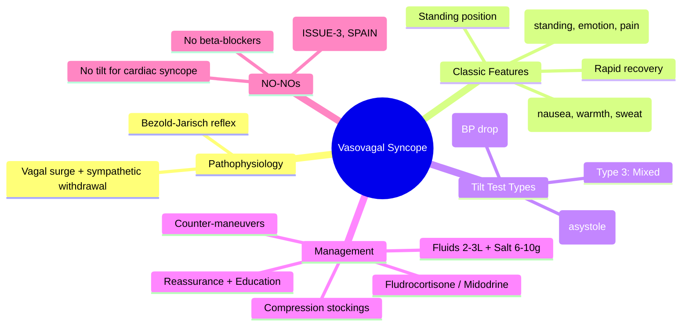

# Vasovagal Syncope (Neurocardiogenic / Reflex Syncope)

Related: [[../Cardiology MOC|Cardiology MOC]] · [[../Davidson Chapter 16 - Cardiology Hierarchy|Cardiology Hierarchy]] · [[../Syncope, Shock, and Acute Hemodynamic Emergencies|Syncope, Shock, and Acute Hemodynamic Emergencies]] · [[Syncope and transient loss of consciousness]] · [[Cardiac syncope]] · [[Orthostatic hypotension]] · [[Syncope risk stratification]] · [[Tilt table test]] · [[Autonomic Nervous System]]

> [!important]
> Vasovagal syncope is the **most common cause of syncope** (~50-60% of all TLOC) and is **benign** with excellent prognosis. FCPS/MRCP exams test: **clinical features** (triggers, prodrome, posture), **differentiation from cardiac syncope**, **tilt table test** diagnosis, **conservative management** (fluids, salt, counter-maneuvers, education), and **why pacing is NOT indicated** (RCT evidence).

## Learning Objectives
- Define vasovagal syncope and its pathophysiology (Bezold-Jarisch reflex)
- Recognize classic clinical features: triggers, prodrome, posture, recovery
- Differentiate from cardiac syncope using red flags and risk scores
- Interpret tilt table test results (Vasovagal types 1-3)
- Apply conservative management: education, counter-maneuvers, fluids, salt, compression
- Understand why permanent pacing is **NOT indicated** (ISSUE-3, SPAIN trials)
- Identify when to suspect mimics: POTS, orthostatic hypotension, situational syncope

## Definition
**Vasovagal syncope (VVS)** = **reflex syncope** triggered by emotional stress, pain, prolonged standing, or situational stimuli → **parasympathetic surge + sympathetic withdrawal** → bradycardia/vasodilation → hypotension → cerebral hypoperfusion → TLOC.
- **Syncope**: transient loss of consciousness, brief (<1 min), complete spontaneous recovery
- **Prodrome**: typical (nausea, warmth, diaphoresis, pallor, blurred vision, "graying out")
- **Trigger**: identifiable (standing, emotion, pain, blood draw, heat, dehydration)
- **Recovery**: rapid, complete, no post-ictal confusion

## Pathophysiology (Bezold-Jarisch Reflex)
```
Trigger (standing, emotion, pain)
       ↓
↓ Venous return → ↓ LV filling → ↑ LV contractility (empty ventricle)
       ↓
Mechanoreceptors (C-fibers) in LV inferoposterior wall stimulated
       ↓
Vagal afferents → Nucleus tractus solitarius → ↑ Parasympathetic + ↓ Sympathetic
       ↓
Vagal efferents → Sinus bradycardia / AV block / asystole
Sympathetic withdrawal → Vasodilation (venous > arterial)
       ↓
Profound hypotension + bradycardia → Cerebral hypoperfusion → Syncope
```

## Clinical Features — Classic Triad

| Component | Typical Features |
|-----------|------------------|
| **Triggers** | Prolonged standing, hot/crowded environments, emotional stress, pain, blood draw, medical procedures, dehydration, alcohol, post-exercise |
| **Prodrome** (seconds-minutes) | **Nausea, warmth/flushing, diaphoresis, pallor, blurred vision, "graying out," lightheadedness, abdominal discomfort, palpitations** |
| **Syncope** | Brief (<1 min), often with fall, may have brief myoclonic jerks (convulsive syncope) |
| **Recovery** | **Rapid, complete** — orientation returns within seconds; **no post-ictal confusion** |
| **Post-event** | Fatigue, nausea may persist 15-60 min |

## Typical vs Atypical Presentation

| Feature | **Typical VVS** | **Atypical / Cardiac Red Flags** |
|---------|-----------------|----------------------------------|
| **Trigger** | Clear (standing, emotion, pain) | **None / spontaneous** |
| **Prodrome** | **Prolonged** (>30 sec), classic | **Absent / brief** (<10 sec) |
| **Position** | **Standing / sitting** | **Supine / exertional** |
| **Injury** | Rare (slow fall) | **Common** (sudden fall) |
| **ECG** | Normal | **Abnormal** (structural HD, arrhythmia) |
| **Age** | Young (<40) | **Older (>60)** |
| **Heart disease** | None | **Known structural HD** |
| **Family Hx SCD** | No | **Yes** |

## Pathophysiological Subtypes (Tilt Table Classification)

| Type | Heart Rate Response | BP Response | Mechanism |
|------|---------------------|-------------|-----------|
| **Type 1 (Cardioinhibitory)** | **Asystole >3s** or bradycardia <40 bpm | Falls with HR | Predominant vagal → asystole |
| **Type 2 (Vasodepressor)** | HR does not fall >10% | **Falls >20 mmHg** without bradycardia | Predominant sympathetic withdrawal |
| **Type 3 (Mixed)** | **Asystole >3s** + **BP fall >20 mmHg** | Both | Combined vagal + sympathetic withdrawal |

> [!tip]
> **Type 1** = cardioinhibitory → may respond to pacing (but trials show no benefit)
> **Type 2/3** = vasodepressor → pacing ineffective; fluids, salt, counter-maneuvers

## Differential Diagnosis

| Condition | Key Differentiating Features |
|-----------|------------------------------|
| **Cardiac syncope** | Exertional/supine, no prodrome, injury, abnormal ECG, structural HD, family Hx SCD |
| **Orthostatic hypotension** | **BP drop >20/10 within 3 min standing**, no bradycardia, OH on standing test |
| **POTS** | **HR ↑ ≥30 bpm standing, no BP drop**, chronic symptoms (fatigue, brain fog) |
| **Situational syncope** | Trigger-specific: micturition, defecation, cough, swallow, post-prandial |
| **Carotid sinus syndrome** | Triggered by neck pressure/shaving/collar; >50y; carotid massage reproduces |
| **Seizure** | Tonic-clonic, post-ictal confusion, tongue bite, incontinence, prolonged >2 min |
| **Psychogenic pseudosyncope** | Frequent, long duration, no hemodynamic change, normal tilt, psychiatric history |

## Diagnostic Criteria (ESC 2018)

**Definite VVS** = Tilt test positive (type 1/2/3) + spontaneous syncope reproduced
**Probable VVS** = Classic history (trigger + prodrome + standing) + no cardiac red flags + normal ECG/echo
**Possible VVS** = Atypical features but no cardiac red flags, tilt negative/equivocal

## Tilt Table Test (Head-Up Tilt Test)

| Protocol | Details |
|----------|---------|
| **Position** | 60-70° head-up |
| **Duration** | 20-45 min passive phase ± drug provocation (GTN 0.4mg SL / isoproterenol) |
| **Monitoring** | Continuous ECG, beat-to-beat BP (Finapres), symptoms |
| **Positive Criteria** | Syncope reproduction + hypotension/bradycardia per type 1/2/3 |

| Indication | Contraindication |
|------------|------------------|
| Unexplained recurrent syncope | Known structural HD / abnormal ECG |
| Differentiate reflex vs OH vs POTS | High-risk features (cardiac syncope likely) |
| Exclude POTS / OH | Severe carotid stenosis |
| Guide therapy (rare) | Pregnancy |

> [!warning]
> **Tilt test is for REFLEX syncope diagnosis ONLY** — do not use to diagnose cardiac syncope.

## Management Algorithm

```mermaid
flowchart TD
A[Suspected Vasovagal Syncope] --> B{High-risk features? (Cardiac red flags)}
B -->|Yes| C[Workup for CARDIAC SYNCOPE]
B -->|No| D[Probable VVS]
D --> E[Reassurance + Education]
E --> F[Conservative Measures]
F --> F1[Fluid 2-3L/d + Salt 6-10g/d]
F --> F2[Compression stockings (thigh-high, 20-30 mmHg)]
F --> F3[Counter-pressure maneuvers: leg crossing, squatting, arm tensing]
F --> F4[Avoid triggers: prolonged standing, heat, dehydration, alcohol]
F --> F5[Review medications — stop diuretics, vasodilators if possible]
F --> G{Recurrent / Refractory?}
G -->|Yes| H[Tilt test for confirmation / phenotyping]
H --> I{Type 1 (Cardioinhibitory)?}
I -->|Yes| J[Consider midodrine / fludrocortisone / pacing (limited evidence)]
I -->|No (Type 2/3)| K[Fludrocortisone / midodrine / ivabradine]
G -->|No| L[Reassurance + Lifestyle]
```

## Pharmacotherapy (If Conservative Fails)

| Drug | Dose | Indication | Evidence |
|------|------|------------|----------|
| **Fludrocortisone** | 0.1-0.2 mg OD | Volume expansion (Type 2/3) | Modest benefit |
| **Midodrine** | 2.5-10 mg TID (daytime only) | α-agonist → vasoconstriction | Modest benefit |
| **Ivabradine** | 5-7.5 mg BD | If cardioinhibitory component | Small RCTs |
| **Beta-blockers** | Metoprolol 25-50 mg BD | **Not recommended** (RCT: no benefit) | PREVENT, VASIS: no benefit |

> [!warning]
> **Permanent pacing NOT indicated** for VVS — **ISSUE-3, SPAIN, VASIS trials: NO benefit** over placebo. Even in cardioinhibitory type, pacing does not prevent syncope (vasodepressor component dominates).

## Counter-Pressure Maneuvers (Physical Countermeasures)

| Maneuver | Technique | Effect |
|----------|-----------|--------|
| **Leg crossing** | Cross legs, tense leg/abdominal muscles | ↑ venous return, ↑ BP |
| **Squatting** | Squat down, hold | ↑ venous return, ↑ BP |
| **Arm tensing** | Grip hands together, pull apart | ↑ BP via muscle pump |
| **Marching in place** | Alternate leg raises | Muscle pump ↑ venous return |

> [!tip]
> **Teach at first visit** — patients can abort prodrome if recognized early.

## Prognosis
- **Benign** — no increased mortality
- **Recurrence**: 30-50% at 2 years without treatment
- **Quality of life** impact: fear, driving restriction, anxiety
- **Mortality**: same as general population

## Driving Regulations (UK DVLA / General)
| Condition | Group 1 (Car) | Group 2 (HGV/PSV) |
|-----------|---------------|-------------------|
| **VVS (controlled)** | No restriction if no recurrence 3 months | 3 months asymptomatic |
| **Recurrent unexplained** | 6 months | 12 months |
| **Cardiac syncope** | 6 months post-treatment | 12 months post-treatment |

## Red Flags / Exam Traps
- **Assuming all syncope is vasovagal** — must exclude cardiac first
- **Pacing for VVS** — **contraindicated** (RCTs negative)
- **Beta-blockers for VVS** — **no benefit** (PREVENT, VASIS trials)
- **Tilt test for cardiac syncope** — **wrong use**; tilt diagnoses reflex only
- **Missing situational syncope** (micturition, defecation, cough) — specific triggers
- **Confusing POTS with VVS** — POTS: HR↑30, no BP drop, chronic symptoms
- **Missing orthostatic hypotension** — check standing BP at 1, 3 min

## FCPS/MRCP High-Yield Points
- **VVS = most common syncope** (~50-60%), benign
- **Classic triad**: trigger + prodrome (nausea, warmth, sweat) + standing
- **Red flags for cardiac**: exertional, supine, no prodrome, injury, abnormal ECG, structural HD
- **Tilt test types**: 1=cardioinhibitory (asystole), 2=vasodepressor (BP drop), 3=mixed
- **Management**: reassurance, fluids/salt, compression, counter-maneuvers, avoid triggers
- **Drugs**: fludrocortisone, midodrine (modest); **beta-blockers NO benefit**
- **Pacing**: **NOT indicated** (ISSUE-3, SPAIN RCTs negative)
- **Tilt test**: diagnoses REFLEX syncope only

## Common Viva Questions
1. Classic features of vasovagal syncope?
2. How to differentiate vasovagal from cardiac syncope?
3. What are the three types of tilt table response?
4. Management of refractory vasovagal syncope?
5. Why is permanent pacing not indicated in VVS?
6. Difference between VVS, orthostatic hypotension, and POTS?

## Common Confusions / Exam Traps
- Calling all syncope "vasovagal" — cardiac first!
- Pacing for recurrent VVS — RCTs show NO benefit
- Beta-blockers for VVS — no benefit (PREVENT, VASIS)
- Tilt test positive = cardiac syncope — WRONG, tilt = reflex only
- Situational syncope (micturition, cough) = subtype of reflex
- POTS vs VVS — POTS: chronic, HR↑30 standing, no BP drop

## Mind Map


## One-Page Revision Summary
- **VVS** = reflex syncope, Bezold-Jarisch reflex, most common (50-60%)
- **Classic**: trigger + prodrome (nausea/warmth/sweat) + standing + rapid recovery
- **Tilt test**: Type 1 (asystole), Type 2 (BP drop), Type 3 (mixed)
- **Treatment**: reassurance, fluids 2-3L, salt 6-10g, compression, counter-maneuvers
- **Drugs**: fludrocortisone/midodrine modest; **no beta-blockers**
- **Pacing NOT indicated** (ISSUE-3, SPAIN negative)
- **Red flags for cardiac**: exertional, supine, no prodrome, injury, abnormal ECG

## 24-Hour Recall Prompts
- Describe Bezold-Jarisch reflex
- List 3 tilt table types with hemodynamics
- State conservative management steps
- Explain why pacing not indicated
- Differentiate VVS vs OH vs POTS vs cardiac syncope

## 7-Day / 15-Day / 30-Day Revision Tracker
- [ ] Day 1 completed
- [ ] 24-hour recall completed
- [ ] Day 7 revision completed
- [ ] Day 15 revision completed
- [ ] Day 30 revision completed

## Must Know / Should Know / Nice to Know
### Must Know
- VVS = reflex, Bezold-Jarisch, benign
- Classic triad: trigger, prodrome, standing
- Tilt types: 1=asystole, 2=BP drop, 3=mixed
- Conservative: fluids, salt, compression, counter-maneuvers
- NO pacing (ISSUE-3, SPAIN), NO beta-blockers
- Red flags for cardiac

### Should Know
- Situational syncope subtypes
- Carotid sinus syndrome
- Driving regulations
- Fludrocortisone/midodrine dosing
- POTS vs VVS vs OH differentiation

### Nice to Know
- Tilt protocols (Westminster, Italian)
- Genetic predisposition
- Psychogenic pseudosyncope differentiation
- Quality of life impact measures

## Self-Test Scorecard
- Understanding /10
- Recall /10
- Differential diagnosis /10
- MCQ performance /10
- Viva confidence /10
- **Total /50**

> [!tip]
> **Interpretation**: <35 = weak topic; 35-44 = acceptable but insecure; 45+ = strong exam-ready topic.

## Exam Answer Modes
### Long Answer Skeleton
1. Definition + pathophysiology (Bezold-Jarisch reflex)
2. Clinical features (trigger, prodrome, posture, recovery)
3. Tilt table test (types 1/2/3)
4. Differential diagnosis table (cardiac, OH, POTS, situational, seizure)
5. Conservative management (reassurance, fluids, salt, compression, counter-maneuvers)
6. Pharmacotherapy (fludrocortisone, midodrine; no beta-blockers)
7. Why pacing NOT indicated (ISSUE-3, SPAIN)
8. Red flags for cardiac syncope

### Short Note Skeleton
- VVS = reflex, Bezold-Jarisch, benign
- Trigger + prodrome (nausea/warmth/sweat) + standing
- Tilt: 1=asystole, 2=BP drop, 3=mixed
- Mgmt: reassurance, fluids/salt, compression, counter-maneuvers
- Drugs: fludro/midodrine; NO beta-blockers
- NO pacing (ISSUE-3, SPAIN)
- Red flags: exertional, supine, no prodrome, injury, abnormal ECG

### Viva One-Liners
- "VVS = reflex, Bezold-Jarisch, benign, most common"
- "Classic: trigger + prodrome + standing + rapid recovery"
- "Tilt: 1=asystole, 2=BP drop, 3=mixed"
- "NO pacing for VVS — ISSUE-3, SPAIN negative"
- "NO beta-blockers — PREVENT, VASIS negative"
- "Tilt test = reflex syncope diagnosis ONLY"

### Ward-Case Discussion Points
- "20F, syncope at blood draw, nausea, sweating, rapid recovery" → "Classic VVS. Reassure. Fluids, salt, counter-maneuvers. No tilt needed."
- "45M, recurrent syncope standing, normal ECG/echo, tilt: BP drop 30mmHg, HR stable" → "Type 2 VVS. Fluids, salt, compression, midodrine. No pacing."
- "60F, syncope supine, injury, no prodrome, LBBB on ECG" → "NOT VVS. Cardiac syncope. Admit. Echo, Holter, EPS. Pacemaker if brady."

### Last-Night-Before-Exam Sheet
- VVS = reflex, Bezold-Jarisch, benign
- Trigger + prodrome + standing
- Tilt: Type 1=asystole, 2=BP drop, 3=mixed
- Fluids 2-3L, salt 6-10g, compression, counter-maneuvers
- Fludrocortisone 0.1mg, Midodrine 5mg TID
- NO pacing (ISSUE-3, SPAIN)
- NO beta-blockers (PREVENT, VASIS)
- Tilt = reflex only
- Red flags: exertional, supine, no prodrome, injury, abnormal ECG

## Summary
**Vasovagal syncope (VVS)** is the **most common cause of syncope** (~50-60%), mediated by the **Bezold-Jarisch reflex**: trigger → ↓ venous return → empty hypercontractile ventricle → C-fiber activation → vagal surge + sympathetic withdrawal → bradycardia/asystole + vasodilation → hypotension → cerebral hypoperfusion. **Classic presentation**: identifiable trigger (standing, emotion, pain), **classic prodrome** (nausea, warmth, diaphoresis, pallor), **upright posture**, **brief TLOC**, **rapid complete recovery**. **Tilt table test** phenotyping: **Type 1** cardioinhibitory (asystole >3s), **Type 2** vasodepressor (BP drop without bradycardia), **Type 3** mixed. **Management**: **reassurance + education** (benign), **fluids 2-3L/d + salt 6-10g/d**, **compression stockings**, **physical counter-maneuvers** (leg crossing, squatting), **trigger avoidance**. **Pharmacotherapy** (if refractory): **fludrocortisone 0.1-0.2mg**, **midodrine 2.5-10mg TID**, **ivabradine** — **beta-blockers NO benefit** (PREVENT, VASIS). **Permanent pacing NOT indicated** — **ISSUE-3, SPAIN, VASIS RCTs: no benefit** over placebo (vasodepressor component dominates). **Tilt table test diagnoses REFLEX syncope ONLY** — not for cardiac syncope. **Red flags for cardiac syncope**: exertional, supine, no prodrome, injury, abnormal ECG, structural HD, family Hx SCD.

## MCQs (10)
1. Most common cause of syncope overall:
   A. Cardiac syncope
   B. Orthostatic hypotension
   C. **Vasovagal syncope**
   D. Situational syncope
2. Bezold-Jarisch reflex is triggered by:
   A. Atrial stretch
   B. **Ventricular mechanoreceptors (empty hypercontractile ventricle)**
   C. Carotid sinus baroreceptors
   D. Aortic arch baroreceptors
3. Tilt table test type 2 (vasodepressor) response:
   A. Asystole >3s
   B. **BP fall >20 mmHg without significant bradycardia**
   C. Asystole + BP fall
   D. HR rise >30 bpm
4. First-line management of vasovagal syncope:
   A. Beta-blocker
   B. **Reassurance + fluids 2-3L/d + salt 6-10g/d + compression + counter-maneuvers**
   C. Permanent pacemaker
   D. Fludrocortisone
5. Which trial showed NO benefit of permanent pacing in vasovagal syncope?
   A. PREVENT
   B. **ISSUE-3 / SPAIN**
   C. VASIS
   D. 3CPO
6. Beta-blockers in vasovagal syncope — evidence:
   A. Reduce recurrence by 50%
   B. **No benefit (PREVENT, VASIS trials)**
   C. First-line for cardioinhibitory type
   D. Only if tilt type 1
6. Physical counter-maneuvers for aborting prodrome:
   A. Lying flat
   B. **Leg crossing, squatting, arm tensing**
   C. Deep breathing
   D. Coughing
7. Tilt table test is indicated for:
   A. Diagnosing cardiac syncope
   B. **Diagnosing reflex (vasovagal) syncope**
   C. All syncope
   D. Orthostatic hypotension only
8. Fludrocortisone dose for VVS:
   A. 0.1-0.2 mg OD
   B. 0.5-1 mg OD
   C. 2.5-5 mg OD
   D. 10-20 mg OD
9. Driving restriction for controlled VVS (Group 1/car):
   A. 6 months
   B. **No restriction if asymptomatic 3 months**
   C. 12 months
   D. Permanent ban
10. Red flag suggesting CARDIAC rather than vasovagal syncope:
    A. Nausea before syncope
    B. **Exertional onset**
    C. Prolonged prodrome
    D. Standing position

## SBA Questions (10)
1. 19F, syncope during blood draw, nausea, warmth, pallor, rapid recovery. ECG normal. Diagnosis:
   A. Cardiac syncope
   B. **Vasovagal syncope**
   C. Orthostatic hypotension
   D. Seizure
2. 35M, recurrent syncope standing, normal ECG/echo, tilt test: asystole 8s, BP falls with HR. Tilt type:
   A. Type 2
   B. **Type 1 (Cardioinhibitory)**
   C. Type 3
   D. Negative
3. Same patient — best long-term management:
   A. Permanent pacemaker (cardioinhibitory)
   B. **Fludrocortisone / midodrine / counter-maneuvers — pacing NOT indicated**
   C. Beta-blocker
   D. ICD
4. 28F, recurrent syncope, HR ↑40 bpm standing, no BP drop, chronic fatigue/brain fog. Diagnosis:
   A. Vasovagal syncope
   B. **POTS**
   C. Orthostatic hypotension
   C. IST
5. 60M, syncope while shaving, reproduces with carotid massage. Diagnosis:
   A. Vasovagal syncope
   B. **Carotid sinus syndrome**
   C. Orthostatic hypotension
   D. Cardiac syncope
6. 70F, post-micturition syncope, normal ECG. Diagnosis:
   A. Cardiac syncope
   B. **Situational syncope (micturition)**
   C. Orthostatic hypotension
   D. Cardiac syncope
7. Counter-pressure maneuver to abort VVS prodrome:
   A. Lying down immediately
   B. **Leg crossing + tensing leg/abdominal muscles**
   C. Deep breathing only
   D. Drinking water
8. Beta-blocker for vasovagal syncope — trial evidence:
   A. PREVENT: reduced recurrence
   B. **PREVENT: no benefit vs placebo**
   C. VASIS: reduced syncope in type 1
   D. ISSUE-3: pacing + beta-blocker best
9. Driving advice for controlled VVS (car license):
   A. Stop 6 months
   B. **No restriction if event-free 3 months**
   C. Stop 12 months
   D. Inform DVLA only
10. 45M, syncope supine, no prodrome, facial fracture, ECG: LBBB. Next:
    A. Tilt test
    B. **Workup for cardiac syncope — admit, echo, Holter/ILR**
    C. Reassure, fluids
    D. Fludrocortisone

## Flashcards
- Q: VVS pathophysiology?
  A: Bezold-Jarisch reflex: empty ventricle → vagal surge + symp withdrawal → brady/vasodilation
- Q: Classic triad?
  A: Trigger + prodrome (nausea/warmth/sweat) + standing + rapid recovery
- Q: Tilt types?
  A: 1=asystole, 2=BP drop, 3=mixed
- Q: Management?
  A: Reassurance, fluids 2-3L, salt 6-10g, compression, counter-maneuvers
- Q: Drugs?
  A: Fludrocortisone 0.1mg, Midodrine 5mg TID; NO beta-blockers
- Q: Pacing?
  A: NOT indicated (ISSUE-3, SPAIN negative)
- Q: Tilt test for?
  A: Reflex syncope ONLY
- Q: Red flags for cardiac?
  A: Exertional, supine, no prodrome, injury, abnormal ECG, structural HD
- Q: POTS vs VVS?
  A: POTS = HR↑30 standing, no BP drop, chronic
- Q: Situational syncope?
  A: Micturition, defecation, cough, swallow

## Answer Key with Explanations
### MCQs
1. **C** — VVS accounts for 50-60% of all syncope.
2. **B** — Empty hypercontractile LV stimulates C-fiber mechanoreceptors → Bezold-Jarisch reflex.
3. **B** — Type 2 = vasodepressor: BP falls without significant bradycardia.
4. **B** — Conservative first: reassurance, fluids, salt, compression, counter-maneuvers.
5. **B** — ISSUE-3 and SPAIN RCTs: permanent pacing no better than placebo in VVS.
6. **B** — PREVENT and VASIS RCTs: beta-blockers no benefit vs placebo in VVS.
7. **B** — Leg crossing, squatting, arm tensing increase venous return and BP.
8. **B** — Tilt test diagnoses reflex (neurally mediated) syncope; cardiac syncope excluded before tilt.
9. **A** — Fludrocortisone 0.1-0.2 mg OD for volume expansion.
10. **B** — Exertional syncope is essentially never vasovagal; cardiac until proven otherwise.

### SBAs
1. **B** — Classic VVS: trigger (blood draw), prodrome (nausea, warmth), rapid recovery, normal ECG.
2. **B** — Asystole 8s = Type 1 cardioinhibitory.
3. **B** — Even Type 1: pacing not indicated (ISSUE-3, SPAIN); conservative + drugs first.
4. **B** — HR↑40 standing, no OH, chronic symptoms = POTS (HR↑≥30, no BP drop).
5. **B** — Carotid sinus massage reproduces = carotid sinus syndrome.
6. **B** — Post-micturition = situational (reflex) syncope.
7. **B** — Leg crossing + tensing = physical counter-maneuver ↑ venous return/BP.
8. **B** — PREVENT trial: metoprolol no benefit vs placebo in VVS.
9. **B** — DVLA: no restriction if event-free 3 months (Group 1).
10. **B** — Supine + no prodrome + injury + LBBB = cardiac syncope red flags → admit/workup.

---