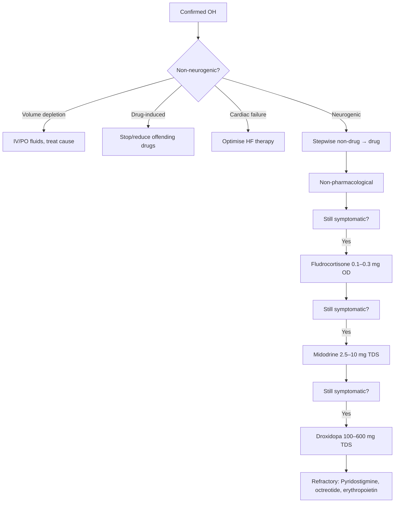

# Orthostatic Hypotension

Related: [[../Cardiology MOC|Cardiology MOC]] · [[../Davidson Chapter 16 - Cardiology Hierarchy|Cardiology Hierarchy]] · [[../Syncope, Shock, and Acute Hemodynamic Emergencies|Syncope, Shock, and Acute Hemodynamic Emergencies]] · [[Syncope and transient loss of consciousness]] · [[../Syncope risk stratification|Syncope risk stratification]] · [[../Vasovagal syncope|Vasovagal syncope]] · [[../Cardiac syncope|Cardiac syncope]] · [[../../Arrhythmias and Cardiac Conduction Disorders/Sinus node dysfunction|Sinus node dysfunction]] · [[../../Heart Failure and Acute Cardiac Decompensation/HFrEF|HFrEF]]

> [!important]
> **Orthostatic hypotension (OH)** = sustained BP drop **≥ 20 mmHg systolic or ≥ 10 mmHg diastolic** within **3 minutes of standing** (or head-up tilt). FCPS/MRCP exams test: **definition**, **classification** (neurogenic vs non-neurogenic), **causes** (drugs, volume, autonomic failure), **diagnosis** (active stand test, tilt table), **management** (non-drug first, then fludrocortisone/midodrine/droxidopa), and **falls risk** in elderly. **OH is a major cause of syncope/falls** — up to 20% of elderly.

## Learning Objectives
- Define OH (classic, initial, delayed) and distinguish from POTS, vasovagal, cardiac syncope
- Classify aetiology: **neurogenic** (autonomic failure) vs **non-neurogenic** (volume, drugs, cardiac)
- Apply diagnostic criteria: active stand test, tilt table, Valsalga, HR response
- Manage stepwise: lifestyle → compression → fludrocortisone → midodrine → droxidopa
- Assess falls risk and quality of life impact
- Recognise OH as cause of pseudo-resistance in hypertension

## Definition & Classification

### Consensus Definition (2017 ESC/ACC)
| Type | Systolic Drop | Diastolic Drop | Timeframe |
|------|---------------|----------------|-----------|
| **Classic OH** | **≥ 20 mmHg** | **≥ 10 mmHg** | **Within 3 min** of standing |
| **Initial OH** | ≥ 40 mmHg | ≥ 20 mmHg | **Within 15 sec** (transient, resolves) |
| **Delayed OH** | ≥ 20/10 mmHg | — | **After 3 min** (often > 5–10 min) |

> [!tip]
> **Classic OH = sustained drop**. Initial OH = transient overshoot on standing. Delayed OH = often early autonomic failure, neurodegenerative.

### Aetiological Classification

| Category | Mechanism | Examples |
|----------|-----------|----------|
| **Non-neurogenic** (most common) | Volume depletion, drugs, cardiac pump failure | Diuretics, vasodilators, dehydration, haemorrhage, HF, aortic stenosis |
| **Neurogenic** | Autonomic failure (central/peripheral) | **Primary**: MSA, PD, PAF, DLB, dementia **Secondary**: Diabetes, amyloidosis, Sjogren's, paraneoplastic, autoimmune |
| **Iatrogenic** | Drug-induced (often + neurogenic susceptibility) | Antihypertensives, antidepressants, antipsychotics, dopaminergic, opioids |

## Pathophysiology

### Normal Orthostatic Response
1. **Standing** → 500–1000 mL blood pools in splanchnic/leg veins
2. **↓ Venous return** → ↓ CO → ↓ BP
3. **Baroreceptors** (carotid sinus, aortic arch) → ↑ sympathetic, ↓ parasympathetic
4. **Response**: ↑ HR (10–20 bpm), vasoconstriction (α₁), venoconstriction → BP stabilised

### OH = Failure of Compensation
| Mechanism | Result |
|-----------|--------|
| **Afferent failure** | Baroreceptor dysfunction (carotid sinus denervation, radiation) |
| **Central failure** | Medullary/cerebellar lesions (MSA, stroke, tumours) |
| **Efferent failure** | Peripheral autonomic neuropathy (diabetes, amyloid, toxins) |
| **Volume depletion** | Inadequate preload despite intact reflexes |
| **Drug interference** | Blockade of sympathetic efferents or vascular response |

## Causes (Exhaustive)

### Drug-Induced (Most Common Reversible Cause)
| Drug Class | Examples | Mechanism |
|------------|----------|-----------|
| **Diuretics** | Loop, thiazide | Volume depletion |
| **Vasodilators** | ACEi, ARB, CCB, nitrates, hydralazine | ↓ Vascular tone |
| **Alpha-blockers** | Tamsulosin, doxazosin, prazosin | ↓ Sympathetic vasoconstriction |
| **Beta-blockers** | Non-selective, carvedilol | ↓ HR response, ↓ contractility |
| **Antidepressants** | TCAs, SSRIs, SNRIs, MAOIs | Central autonomic, α₁ blockade |
| **Antipsychotics** | Clozapine, quetiapine, risperidone | α₁ blockade |
| **Dopaminergics** | Levodopa, dopamine agonists | Vasodilation, central |
| **Opioids** | Morphine, tramadol | Central, histamine |

> [!critical]
> **Medication review is FIRST step** in OH management. **> 4 antihypertensives** = major risk factor.

### Neurogenic (Autonomic Failure)
| Syndrome | Features | OH Characteristics |
|----------|----------|-------------------|
| **Diabetic autonomic neuropathy** | DM > 10y, gastroparesis, erectile dysfunction, fixed HR | Early, severe; often asymptomatic (denervation) |
| **Multiple System Atrophy (MSA)** | Parkinsonism + cerebellar + autonomic | **Early, severe OH** (often presenting feature) |
| **Parkinson's Disease (PD)** | Tremor, rigidity, bradykinesia | Later, moderate OH (levodopa worsens) |
| **Pure Autonomic Failure (PAF)** | Isolated autonomic failure (peripheral) | **Severe OH**; supine hypertension common |
| **Dementia with Lewy Bodies (DLB)** | Fluctuating cognition, visual hallucinations, parkinsonism | OH common |
| **Amyloidosis (AL/ATTR)** | Multi-organ; cardiac, renal, neuropathy | Severe OH; pseudo-hypertension (non-compressible vessels) |

### Non-Neurogenic
- **Volume depletion**: Dehydration, haemorrhage, diuretics, adrenal insufficiency, salt-wasting nephropathy
- **Cardiac pump failure**: Severe AS, HOCM, HFrEF, tamponade
- **Endocrine**: Adrenal insufficiency, hypothyroidism, hyperthyroidism
- **Prolonged bedrest**: Deconditioning

## Clinical Features

| Symptom | Timing | Triggers |
|---------|--------|----------|
| **Lightheadedness / dizziness** | On standing | Morning, post-prandial, post-exercise, hot environment |
| **Presyncope / syncope** | Seconds–minutes | Rapid standing, prolonged standing |
| **Falls** | Recurrent | Elderly, polypharmacy |
| **"Coat-hanger" pain** | Neck/shoulders | Cerebral hypoperfusion |
| **Visual blurring / greying out** | On standing | — |
| **Fatigue / exercise intolerance** | Chronic | — |
| **Cognitive slowing** | On standing | — |

> [!warning]
> **Supine hypertension** (SBP ≥ 140 or DBP ≥ 90 supine) occurs in **50% of neurogenic OH** (PAF, MSA, PD). **Complicates drug treatment**.

## Diagnosis

### 1. Active Stand Test (Bedside, First-Line)
- **Protocol**: Supine 5 min → BP/HR at baseline, 1, 3 min standing
- **Positive**: SBP drop ≥ 20 or DBP ≥ 10 within 3 min
- **HR response**:
  - **ΔHR < 15 bpm** → **neurogenic** (autonomic failure)
  - **ΔHR ≥ 15 bpm** → **non-neurogenic** (volume, drugs) or compensatory

### 2. Head-Up Tilt Table (Gold Standard)
- **Protocol**: 70° tilt, 5–10 min (extend to 20 min for delayed OH)
- **Beat-to-beat BP** (Finometer/Portapres) preferred
- **Provocative**: GTN spray after 20 min if negative

### 3. Autonomic Function Tests (If Neurogenic Suspected)
| Test | Normal | Neurogenic OH |
|------|--------|---------------|
| **Valsalva ratio** | > 1.5 | < 1.2 (impaired) |
| **Deep breathing HRV (E:I)** | > 1.2 | < 1.0 |
| **30:15 ratio** | > 1.04 | < 1.0 |
| **Plasma noradrenaline** | ↑ on standing | **No rise** (efferent failure) |

### 4. Investigations for Underlying Cause
- **FBC, U&E, glucose, HbA1c** (diabetes, anaemia, renal)
- **TSH, cortisol** (endocrine)
- **B12, folate, protein electrophoresis** (neuropathy, amyloid)
- **Autoimmune screen** (ANA, ANCA, anti-ganglionic AChR Ab)
- **CT/MRI brain** (MSA, stroke, tumour)
- **DaTSCAN** (PD/MSA vs PAF)
- **Cardiac: Echo, ECG** (HFrEF, AS, amyloid — low voltage + thick walls)

## Differential Diagnosis

| Condition | Distinguishing Feature |
|-----------|------------------------|
| **Vasovagal syncope** | Prodrome (nausea, sweat), triggered by emotion/pain/standing, **normal BP supine**, HR ↑ then ↓ |
| **POTS** | **HR ↑ ≥ 30 bpm (40 if < 19y)** within 10 min, **no BP drop**, chronic orthostatic intolerance |
| **Cardiac syncope** | Exertional, structural HD, abnormal ECG, no orthostatic BP drop |
| **Post-prandial hypotension** | ≥ 20 mmHg drop within 2h of meal, elderly, autonomic failure |
| **Post-exercise hypotension** | Transient BP drop after exercise, normalises |
| **Drug-induced** | Temporal relation to new drug/dose change |

## Management Algorithm

### Non-Pharmacological (First-Line for All)
| Intervention | Details |
|--------------|---------|
| **Compression garments** | **Waist-high stockings (30–40 mmHg)**; abdominal binder additive |
| **Fluid bolus** | **500 mL water rapidly** → ↑ BP 10–20 mmHg for 30–60 min |
| **Salt supplementation** | **6–10 g/day** (unless HF/CKD) |
| **Head-up sleeping** | **6–10°** (blocks) → ↓ nocturnal natriuresis, ↓ supine HTN |
| **Physical counter-manoeuvres** | Leg crossing, squatting, toe raises, handgrip → ↑ BP 20–30 mmHg |
| **Small frequent meals** | Avoid post-prandial hypotension (↓ carbs, ↑ protein) |
| **Avoid triggers** | Hot baths, alcohol, prolonged standing, rapid position changes |

### Pharmacological (If Non-Drug Fails)

| Drug | Dose | Onset | Mechanism | Key Points |
|------|------|-------|-----------|------------|
| **Fludrocortisone** | 0.1–0.3 mg OD | Days–weeks | Mineralocorticoid → ↑ Na⁺ retention, ↑ volume, ↑ vascular sensitivity | **Monitor**: K⁺, supine HTN, oedema, weight; **K⁺ supplementation often needed** |
| **Midodrine** | 2.5–10 mg TDS (last dose ≤ 6 PM) | 30–60 min | α₁ agonist → vasoconstriction | **Supine HTN risk** — no dosing after 6 PM; monitor supine BP |
| **Droxidopa** | 100–600 mg TDS | 1–2h | Noradrenaline prodrug → ↑ NE | **Supine HTN risk**; expensive; approved for neurogenic OH |
| **Pyridostigmine** | 30–60 mg TDS | Hours | AChE inhibitor → ↑ ganglionic transmission | Modest effect; less supine HTN; cholinergic SE |
| **Octreotide** | 25–50 µg SC TDS | 30 min | Splanchnic vasoconstriction | Post-prandial OH; injection burden |
| **Erythropoietin** | 25–50 IU/kg 3x/week | Weeks | ↑ RBC mass, ↑ vascular sensitivity | Anaemic patients; thrombosis risk |

> [!warning]
> **Supine hypertension management**: Avoid supine dosing of midodrine/droxidopa; short-acting nitrates at night (cautious); fludrocortisone may worsen; head-up sleeping essential.

## Falls Risk Assessment (Elderly)

| Tool | Action if Positive |
|------|-------------------|
| **FRAT / STRATIFY** | Multifactorial falls intervention |
| **Orthostatic vitals** | At every visit in > 65y |
| **Medication review** | **STOPP/START criteria** — deprescribe |
| **Home hazards** | OT referral |
| **Vitamin D** | 800–1000 IU/day if deficient |
| **Exercise** | Balance/strength (Tai Chi, OTAGO) |

## Drug Interactions / Contraindications / Comorbidity Cautions

| Situation | Caution |
|-----------|---------|
| **Supine HTN + OH** | Avoid fludrocortisone (worsens supine); midodrine/droxidopa timed (no post-6 PM); head-up sleep |
| **Heart failure** | **Fludrocortisone contraindicated** (fluid retention); midodrine/droxidopa cautious (afterload ↑) |
| **CKD** | Fludrocortisone → K⁺ loss; midodrine dose adjust (renal clearance) |
| **Prostatic hyperplasia** | Midodrine → urinary retention (α₁); tamsulosin worsens OH |
| **Coronary disease** | Midodrine/droxidopa ↑ afterload → ischaemia risk |
| **Pregnancy** | Fludrocortisone (C), midodrine (C), droxidopa (C) — limited data; non-drug first |

## Procedures / Indications / Contraindications

### Tilt Table Test
- **Indication**: Diagnostic uncertainty, delayed OH suspected, research
- **Contraindication**: Recent MI/stroke, severe CAD, severe carotid stenosis, pregnancy

### Carotid Sinus Massage
- **Indication**: Suspected carotid sinus syndrome (> 40y, unexplained falls/syncope)
- **Contraindication**: Carotid stenosis > 50%, recent MI/stroke/TIA (< 3 months), ventricular arrhythmia

## Complications of Mismanagement
- **Falls → fractures** (hip, wrist, vertebral) — major morbidity/mortality in elderly
- **Supine hypertension untreated** → stroke, LVH, renal damage
- **Fludrocortisone in HF** → acute decompensation
- **Midodrine at bedtime** → nocturnal hypertension, stroke
- **Missing neurogenic cause** (MSA, PD, amyloid) → delayed diagnosis
- **Attributing OH to "age"** → missed reversible drug cause

## Red Flags
- **Unexplained syncope + OH** → rule out cardiac syncope
- **Severe OH + parkinsonism** → MSA (early autonomic failure)
- **OH + supine HTN + anhidrosis + neuro deficits** → autoimmune autonomic ganglionopathy
- **Rapidly progressive OH** → paraneoplastic, acute autonomic neuropathy
- **OH + diarrhoea/weight loss** → amyloid, malignancy

## Prognosis
| Aetiology | Prognosis |
|-----------|-----------|
| **Drug-induced / volume** | **Excellent** if reversible |
| **Diabetic autonomic neuropathy** | Progressive; 5-yr mortality ↑ (cardiac autonomic neuropathy) |
| **PAF** | Slow progression; 10–15 yr survival; supine HTN major issue |
| **PD** | OH develops later; overall PD prognosis dominates |
| **MSA** | Poor; median survival 6–10 yr from onset; OH often presenting |

## Topic Correlation
- [[../Syncope risk stratification|Syncope risk stratification]] — OH as syncope cause
- [[../Vasovagal syncope|Vasovagal syncope]] — differential
- [[../Cardiac syncope|Cardiac syncope]] — differential
- [[../../Arrhythmias and Cardiac Conduction Disorders/Sinus node dysfunction|Sinus node dysfunction]] — autonomic overlap
- [[../../Heart Failure and Acute Cardiac Decompensation/HFrEF|HFrEF]] — OH in HF, drug interactions

## Special Situations

### Post-Prandial Hypotension
- **Definition**: SBP drop ≥ 20 mmHg within 2h of meal
- **Mechanism**: Splanchnic pooling + insulin-mediated vasodilation + impaired compensation
- **Management**: Small low-carb meals, avoid alcohol, acarbose, octreotide, water bolus pre-meal

### Post-Exercise Hypotension
- **Definition**: Transient BP drop after exercise
- **Usually benign** — prolonged in autonomic failure

### Deconditioning / Bedrest
- **Astronauts, prolonged hospitalisation**
- **Management**: Graded exercise, compression, volume loading

### COVID-19 / Long COVID
- **POTS/OH** reported post-COVID; autoantibodies to autonomic receptors
- **Management**: As per standard; consider IVIG if autoimmune proven

## FCPS/MRCP High-Yield Points
- **OH**: SBP drop ≥ 20 or DBP ≥ 10 within **3 min** of standing
- **Initial OH**: Transient drop within 15 sec
- **Delayed OH**: Drop after 3 min (early autonomic failure)
- **Active stand test**: Bedside, first-line; HR response differentiates neurogenic (< 15 bpm) vs non-neurogenic
- **Tilt table**: Gold standard; Valsalga, deep breathing for autonomic function
- **Drugs #1 reversible cause** — review at every visit
- **Neurogenic OH**: ΔHR < 15 bpm; supine HTN common (PAF, MSA, PD, amyloid)
- **Management**: Non-drug (fluids, salt, compression, head-up sleep) → fludrocortisone → midodrine → droxidopa
- **Supine HTN**: Complicates drug treatment; no midodrine/droxidopa after 6 PM; head-up sleep
- **Falls risk**: OH major cause in elderly; multifactorial intervention

## Common Viva Questions
- Define orthostatic hypotension (classic, initial, delayed).
- How do you distinguish neurogenic from non-neurogenic OH at bedside?
- What is the active stand test protocol?
- What does HR response tell you?
- List non-pharmacological and pharmacological treatments.
- What is supine hypertension and how does it complicate OH treatment?
- How does tilted table test differ from active stand test?
- What is post-prandial hypotension?

## Common Confusions / Exam Traps
- Confusing POTS (HR ↑, no BP drop) with OH (BP drop)
- Missing drug-induced OH (most common reversible)
- Giving midodrine at bedtime (supine HTN)
- Using fludrocortisone in heart failure
- Not checking HR response on stand test (miss neurogenic)
- Attributing falls to "age" without OH assessment
- Confusing initial OH (transient) with classic OH (sustained)

## Mnemonics
- **OH Definition**: **2**0/ **1**0 in **3** minutes — **213**
- **HR response**: **< 15** = **N**eurogenic; **≥ 15** = **Non-neurogenic** — **<15 N, ≥15 NON**
- **Drug causes**: **D**iuretics, **V**asodilators, **A**lpha-blockers, **B**eta-blockers, **A**ntidepressants, **A**ntipsychotics, **D**opaminergics, **O**pioids — **DVABADO**
- **Neurogenic causes**: **M**SA, **P**D, **P**AF, **D**iabetes, **A**myloid, **A**utoimmune — **MPPDAA**
- **Treatment ladder**: **F**luids/Compression → **F**ludrocortisone → **M**idodrine → **D**roxidopa — **FFMD**

## Mind Map
- Orthostatic Hypotension
  - Definition: 20/10 in 3 min (classic); 40/20 in 15 sec (initial); >3 min (delayed)
  - Classification
    - Non-neurogenic: drugs, volume, cardiac
    - Neurogenic: autonomic failure (MSA, PD, PAF, diabetes, amyloid)
  - Diagnosis
    - Active stand (bedside, HR response)
    - Tilt table (gold, beat-to-beat)
    - Autonomic tests (Valsalva, HRV)
  - Management
    - Non-drug: fluids, salt, compression, head-up sleep
    - Drugs: fludrocortisone → midodrine → droxidopa
    - Supine HTN management
  - Falls: elderly, multifactorial
  - Special: post-prandial, post-exercise, deconditioning, Long COVID

## Suggested Visuals / Image Notes
- Active stand test protocol diagram
- HR response interpretation (neurogenic vs non)
- Treatment algorithm flowchart
- Supine HTN management strategies
- Autonomic function test battery (Valsalva, deep breathing, 30:15)

## Suggested Video References
- Search for: "orthostatic hypotension active stand test autonomic function"
- Search for: "neurogenic vs non-neurogenic orthostatic hypotension"
- Search for: "midodrine droxidopa fludrocortisone orthostatic hypotension"
- Search for: "supine hypertension orthostatic hypotension management"

## One-Page Revision Summary
- **OH**: SBP ↓ ≥ 20 or DBP ↓ ≥ 10 within 3 min standing
- **Initial OH**: Transient > 40/20 within 15 sec
- **Delayed OH**: After 3 min (early autonomic failure)
- **Active stand**: ΔHR < 15 = neurogenic; ≥ 15 = non-neurogenic
- **Drugs = #1 cause** (diuretics, vasodilators, alpha-blockers, antidepressants)
- **Neurogenic OH**: MSA, PD, PAF, diabetes, amyloid; supine HTN common
- **Treatment**: Non-drug (fluids, salt, compression, head-up) → fludrocortisone → midodrine → droxidopa
- **Supine HTN**: No midodrine/droxidopa after 6 PM; head-up sleep; cautious nitrates
- **Falls**: OH major cause in elderly; STOPP/START medication review

## 24-Hour Recall Prompts
- State OH, initial OH, delayed OH definitions
- How does HR response differentiate neurogenic vs non-neurogenic?
- List non-drug then drug treatment ladder
- What is supine HTN and how does it complicate treatment?
- What is post-prandial hypotension definition?

## 7-Day / 15-Day / 30-Day Revision Tracker
- **Day 1**: Read note + MCQs/SBAs
- **Day 7**: Perform active stand test on 3 patients; list drug causes
- **Day 15**: Practice 3 vignettes (drug OH, MSA, diabetic autonomic, POTS vs OH)
- **Day 30**: Rapid revision + treatment ladder + supine HTN management

## Must Know / Should Know / Nice to Know
### Must Know
- OH definition (20/10 in 3 min)
- Active stand test + HR interpretation
- Drug causes (top reversible)
- Non-drug → fludrocortisone → midodrine → droxidopa
- Supine HTN management

### Should Know
- Initial vs delayed OH
- Neurogenic aetiologies (MSA, PD, PAF, diabetes)
- Post-prandial hypotension
- Tilt table protocol
- Falls risk assessment

### Nice to Know
- Autonomic function test battery details
- Droxidopa pharmacokinetics
- Autoimmune autonomic ganglionopathy
- Long COVID autonomic dysfunction
- Paraneoplastic OH

## My Weak Points
- [ ] I state OH/initial/delayed definitions precisely
- [ ] I explain HR < 15 = neurogenic, ≥ 15 = non-neurogenic
- [ ] I list treatment ladder with supine HTN cautions
- [ ] I differentiate POTS (HR ↑, no BP drop) from OH
- [ ] I recall post-prandial hypotension definition

## Self-Test Scorecard
- Understanding /10
- Recall /10
- Vignette interpretation /10
- MCQ performance /10
- Viva confidence /10

**Interpretation**
- **<35/50** = weak topic, needs re-study
- **35–44/50** = acceptable but not secure
- **45+/50** = strong exam-ready topic

## Exam Answer Modes