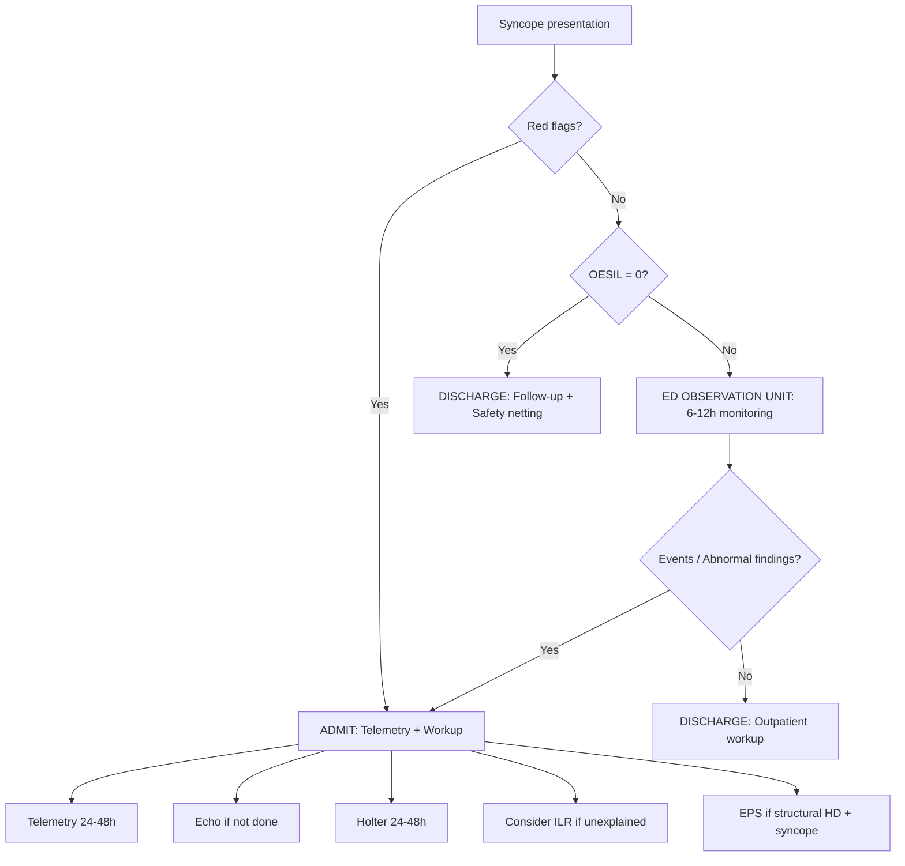

# Syncope Risk Stratification

Related: [[../Cardiology MOC|Cardiology MOC]] · [[../Davidson Chapter 16 - Cardiology Hierarchy|Cardiology Hierarchy]] · [[../Syncope, Shock, and Acute Hemodynamic Emergencies|Syncope, Shock, and Acute Hemodynamic Emergencies]] · [[Syncope and transient loss of consciousness]] · [[../Cardiac syncope|Cardiac syncope]] · [[../Vasovagal syncope|Vasovagal syncope]] · [[../Orthostatic hypotension|Orthostatic hypotension]] · [[../../Arrhythmias and Cardiac Conduction Disorders/Atrioventricular block|AV block]] · [[../../Arrhythmias and Cardiac Conduction Disorders/Ventricular tachycardia and VF|VT/VF]] · [[../../Heart Failure and Acute Cardiac Decompensation/Cardiogenic shock|Cardiogenic shock]]

> [!important]
> **Syncope risk stratification** is a core FCPS/MRCP skill. Exams test: **distinguishing benign (vasovagal, orthostatic) from life-threatening (cardiac) causes**, **validated clinical decision rules** (OESIL, San Francisco, ROSE, Canadian, EGSYS), **red flags mandating admission**, and **disposition decisions**. The goal: **identify low-risk for safe discharge** vs **high-risk for admission/workup**. Cardiac syncope = **mortality ~10–20% at 1 year** if missed.

## Learning Objectives
- Apply structured approach: history → exam → ECG → risk score
- Use validated scores: **OESIL, San Francisco, ROSE, Canadian, EGSYS**
- Identify **high-risk features** mandating admission/monitoring
- Distinguish **cardiac** (arrhythmic, structural) from **reflex** and **orthostatic** syncope
- Select appropriate investigations: Echo, Holter, ILR, EPS, tilt table
- Make evidence-based disposition decisions (discharge vs admit vs observation)

## Definition & Initial Classification

**Syncope** = transient loss of consciousness (TLOC) due to **global cerebral hypoperfusion**, with **rapid onset, short duration, spontaneous complete recovery**.

| Category | Mechanism | Prognosis |
|----------|-----------|-----------|
| **Reflex (Neurally mediated)** | Vasovagal, situational, carotid sinus | **Benign** (recurrence common, mortality not increased) |
| **Orthostatic hypotension** | Volume depletion, autonomic failure, drugs | **Variable** (falls, fractures, underlying cause) |
| **Cardiac (Arrhythmic/Structural)** | **Most dangerous** | **High mortality** if missed (10–20% at 1 year) |

> [!warning]
> **Cardiac syncope kills**; reflex syncope **embarrasses**. Default assumption in unclear cases: **cardiac until proven otherwise**.

## Structured Clinical Assessment (ESC 2018)

### 1. History — Key Discriminators

| Feature | **Cardiac Syncope** | **Reflex Syncope** | **Orthostatic** |
|---------|---------------------|-------------------|-----------------|
| **Prodrome** | **Absent / abrupt** (< 5 sec) | **Typical** (nausea, warmth, tunnel vision, sweat) | **Lightheadedness on standing** |
| **Trigger** | **Exertion, supine, none** | Emotion, pain, prolonged standing, cough, micturition | Standing up |
| **Position** | Any (including supine) | Usually upright | Upright only |
| **Palpitations** | **Before/at onset** | Rare | Variable |
| **Injury** | **Common** (fall without protection) | Less (protective prodrome) | Variable |
| **Post-ictal** | Confusion, fatigue | Rapid recovery | Rapid recovery |
| **CHD / HF history** | **Strong predictor** | Not typical | Drug-induced common |

### 2. Physical Examination

| Finding | Suggests |
|---------|----------|
| **Heart murmur** (AS, HOCM) | Structural cardiac syncope |
| **BP difference > 20 mmHg** | Aortic dissection, subclavian steal |
| **Orthostatic drop** (≥ 20/10 mmHg) | Orthostatic hypotension |
| **Carotid sinus massage** → > 3 sec pause | Carotid sinus syndrome |
| **JVD, hepatojugular reflux** | Heart failure, tamponade |
| **Neurological deficits** | Stroke/TIA (not syncope) |

### 3. ECG — **Mandatory in All Syncope**

| ECG Finding | Risk | Implication |
|-------------|------|-------------|
| **Normal** | Low (but does not exclude) | Reassuring if history reflex |
| **Sinus bradycardia < 50** | High | Sick sinus, AV block |
| **Sinus pause > 3 sec** | High | Sick sinus syndrome |
| **AV block** (Mobitz II, 3rd degree) | **Very high** | Pacemaker indicated |
| **Pre-excitation (WPW)** | High | Accessory pathway, AF risk |
| **QT prolongation** (QTc ≥ 500) | High | Torsades risk |
| **Brugada pattern** (coved ST V1–V3) | High | VF risk |
| **LVH + strain** | High | HOCM, AS |
| **RV hypertrophy** | High | PH, ARVC |
| **Prior MI (Q waves)** | High | VT substrate |
| **TWI V1–V3 (ARVC)** | High | ARVC |
| **Epsilon wave** | High | ARVC |

> [!critical]
> **Abnormal ECG = admit for monitoring/workup** (Class I ESC). Normal ECG ≠ low risk if history suggests cardiac.

### 4. Bedside Echo (If Available)
- LVH, HOCM (SAM, LVOT gradient)
- Severe AS (gradient, AVA)
- RV dilation/dysfunction (PE)
- Pericardial effusion (tamponade)
- Wall motion abnormality (ischaemia)
- LV systolic dysfunction (EF ≤ 35%)

## Validated Risk Scores

### OESIL Score (Osservatorio Epidemiologico sulla Sincope nel Lazio)
| Variable | Points |
|----------|--------|
| **Age > 65** | 1 |
| **History of CVD** (MI, HF, arrhythmia) | 1 |
| **No prodrome** | 1 |
| **Abnormal ECG** | 1 |

| Score | 30-day Serious Outcome | Disposition |
|-------|------------------------|-------------|
| **0** | 0.7% | **Safe discharge** |
| **1** | 3.6% | Consider observation |
| **2** | 12% | **Admit** |
| **3–4** | 22–34% | **Admit + urgent workup** |

> [!tip]
> **OESIL is the simplest, best-validated for ED use**. Score 0 = safe discharge.

### San Francisco Syncope Rule (SFSR)
**Admit if ANY:**
- **C**ongestive heart failure history
- **H**ematocrit < 30%
- **E**CG abnormal
- **S**hortness of breath
- **S**ystolic BP < 90 mmHg at triage

**Sensitivity 96%** for 7-day serious outcomes.

### ROSE Rule (Risk Stratification of Syncope in the ED)
**Admit if ANY:**
- BNP > 300 pg/mL
- **Bradycardia < 50** or **Rectal temp > 37.5°C** (sepsis)
- O₂ sat < 94%
- **ECG**: Q wave, ST deviation, bundle branch block, arrhythmia

### Canadian Syncope Risk Score (CSRS) — **Most Comprehensive**
| Variable | Points |
|----------|--------|
| Vasovagal predisposition | −2 to −1 |
| Cardiac history | +1 to +2 |
| ED SBP < 90 or > 180 | +2 |
| Troponin ↑ | +2 |
| Abnormal ECG (Q wave, ST, BBB, arrhythmia) | +1 to +2 |
| Diagnosis: cardiac | +2 |
| Diagnosis: orthostatic | 0 |

**Score −2 to −1**: Very low risk (0.1% 30-day serious) → **Discharge**
**Score 0–1**: Low risk (1%) → **Discharge/observation**
**Score 2–3**: Medium risk (4%) → **Observation**
**Score ≥ 4**: High risk (8–20%) → **Admit**

### EGSYS Score (Evaluation of Guidelines in Syncope Study) — **Reflex vs Cardiac**
| Variable | Points |
|----------|--------|
| **Predisposing factors** (emotion, pain, standing) | −2 |
| **Typical prodrome** (nausea, sweat, pallor) | −2 |
| **Trigger** (cough, micturition, defecation) | −2 |
| **Cardiac history** | +3 |
| **Abnormal ECG** | +3 |
| **Exertional syncope** | +3 |
| **Supine syncope** | +3 |

**Score ≤ −2**: Reflex probable; **≥ 3**: Cardiac probable

> [!tip]
> **Use OESIL for quick ED triage; CSRS for comprehensive risk; EGSYS for reflex vs cardiac distinction**.

## High-Risk Features Mandating Admission (ESC Class I)

**"Red Flags" — Any ONE = Admit**
1. **Abnormal ECG** (see table above)
2. **History of structural heart disease / HF / prior MI / cardiomyopathy**
3. **Syncope during exertion or supine**
4. **No prodrome / abrupt onset**
5. **Palpitations at onset**
6. **Severe injury** (trauma from fall)
7. **Age > 65 with comorbidities**
8. **Family history of SCD / cardiomyopathy**
9. **Abnormal echo** (if done): LVH, severe AS, HOCM, RV dysfunction, low EF
10. **Troponin elevation** (if checked)

## Disposition Algorithm



## Investigations by Suspected Mechanism

### Cardiac Syncope Suspected
| Test | Indication | Yield |
|------|------------|-------|
| **Telemetry** | All admitted | High (arrhythmia capture) |
| **Echo** | All (if not recent) | Structural HD |
| **Holter (24-48h)** | Frequent symptoms (< weekly) | Low (< 5%) if infrequent |
| **ILR (Implantable Loop Recorder)** | **Recurrent unexplained, structural HD, high risk** | **High (gold standard)** |
| **EPS** | Structural HD + syncope (EF ≤ 40%, prior MI, HCM) | VT/VF inducibility → ICD |
| **Exercise test** | Exertional syncope | Ischaemia, arrhythmia, BP response |

### Reflex Syncope Suspected
| Test | Indication | Yield |
|------|------------|-------|
| **Tilt Table Test** | Recurrent, diagnosis uncertain, occupational driving | **High** (VVS, OH, POTS) |
| **Carotid Sinus Massage** | Age > 40, unexplained | Carotid sinus syndrome |

### Orthostatic Hypotension
| Test | Indication |
|------|------------|
| **Active stand test / Tilt** | Confirm OH (drop ≥ 20/10 at 3 min) |
| **Autonomic function tests** | Suspected autonomic failure (PD, MSA) |

## Outpatient Workup Pathway (After Low-Risk Discharge)

```mermaid
flowchart TD
A[Discharged low-risk] --> B[48-72h follow-up]
B --> C{Recurrence / New symptoms?}
C -->|Yes| D[Re-evaluate + Admit if needed]
C -->|No| E[Structured outpatient workup]
E --> E1[Echo: LVH, AS, HOCM, EF]
E --> E2[Ambulatory ECG: Holter (frequent) / ILR (infrequent)]
E --> E3[Exercise test if exertional]
E --> E4[Tilt table if reflex suspected]
E --> E5[Cardiac MRI if ARVC/HCM/infiltrative suspected]
```

## Special Populations

### Older Adults (> 65)
- **Higher baseline risk** — lower threshold for admission
- **Polypharmacy** — review antihypertensives, diuretics, psychotropics
- **Frailty/falls** — orthostatic assessment mandatory
- **Cognitive impairment** — may not recall prodrome

### Athletes
- **Bradycardia, repolarization changes** common — correlate with symptoms
- **HCM, ARVC, WPW** — higher index of suspicion
- **Exertional syncope = cardiac until proven otherwise**

### Pregnancy
- **Vasovagal common** (caval compression, hormonal)
- **Orthostatic common** (volume redistribution)
- **PE, peripartum cardiomyopathy, aortic dissection** — rare but fatal
- **Tilt table avoided**; echo safe

### Structural Heart Disease (Known)
- **Any syncope = high risk** — admit
- **EF ≤ 35%** — EPS for ICD decision
- **HCM** — risk stratification (HCMS 2020) + ICD if high risk
- **ARVC** — ICD if syncope (Class I)

## Drug Interactions / Contraindications / Comorbidity Cautions

- **Orthostatic drugs**: α-blockers, diuretics, nitrates, ACEi/ARB, antipsychotics, antidepressants, dopaminergic, levodopa
- **Bradycardia drugs**: Beta-blockers, non-DHP CCB, digoxin, ivabradine, clonidine — **review if syncope + bradycardia**
- **QT-prolonging drugs**: Antiarrhythmics, macrolides, fluoroquinolones, antipsychotics, antiemetics — **stop if torsades risk**
- **Dual therapy fall risk**: ≥ 4 antihypertensives → ↑ orthostatic syncope

## Procedures / Indications / Contraindications

### Tilt Table Test
- **Indication**: Recurrent reflex syncope suspected, diagnosis uncertain, occupational driving
- **Protocol**: 20 min passive tilt → 70° → if negative, GTN spray → 15 min
- **Positive**: Syncope + hypotension/bradycardia (vasodepressor/cardioinhibitory/mixed)
- **Contraindication**: Recent MI/stroke, severe CAD, severe carotid stenosis, pregnancy

### Implantable Loop Recorder (ILR)
- **Indication**: **Recurrent unexplained syncope**, high-risk features, structural HD, AF detection post-stroke
- **Duration**: 3 years (battery)
- **Yield**: ~50% diagnostic at 2 years in unexplained syncope

### Electrophysiology Study (EPS)
- **Indication**: Structural HD + syncope (EF ≤ 40%, prior MI, HCM, ARVC), suspected WPW, Brugada
- **Diagnostic**: Inducible sustained VT/VF → ICD; HV interval > 70 ms → pacemaker
- **Contraindication**: Acute MI (< 3 months), untreated sepsis

## Complications of Mismanagement
- **Discharging cardiac syncope** → SCD, recurrent syncope with injury, stroke (if AF missed)
- **Over-admitting reflex syncope** → resource waste, nosocomial risk, delay in reflex-specific Rx
- **Missing OH** → falls, fractures, recurrent admissions
- **Not doing ILR in recurrent unexplained** → missed arrhythmia, delayed ICD/pacemaker

## Red Flags / Emergencies (Act Immediately)
- **Ongoing ischaemia** (chest pain, dynamic ECG) → ACS pathway
- **Haemodynamic instability** → shock pathway
- **Sustained VT / VF** → cardioversion/defibrillation
- **Complete heart block with instability** → pacing
- **Aortic dissection** (tearing pain, pulse deficit) → surgery
- **Massive PE** (hypoxia, RV strain) → thrombolysis

## Prognosis by Cause
| Cause | 1-Year Mortality | Recurrence |
|-------|------------------|------------|
| **Cardiac (arrhythmic)** | **10–20%** | High if untreated |
| **Cardiac (structural: AS, HOCM)** | **15–25%** | High |
| **Orthostatic** | Variable (comorbidities) | High |
| **Reflex (VVS)** | **Normal** (no excess mortality) | ~30% at 3 years |
| **Unexplained** | Intermediate (2–5%) | Variable |

> [!tip]
> **Cardiac syncope has mortality; reflex syncope has morbidity (injury, QoL).**

## Topic Correlation
- [[../Cardiac syncope|Cardiac syncope]] — detailed cardiac causes
- [[../Vasovagal syncope|Vasovagal syncope]] — reflex syncope
- [[../Orthostatic hypotension|Orthostatic hypotension]] — OH
- [[../../Arrhythmias and Cardiac Conduction Disorders/Atrioventricular block|AV block]] — conduction disease
- [[../../Arrhythmias and Cardiac Conduction Disorders/Ventricular tachycardia and VF|VT/VF]] — arrhythmic causes
- [[../Syncope and transient loss of consciousness|Syncope and TLOC]] — framework

## Special Situations

### Driving / Occupational
- **Syncope with high-risk features**: Driving restriction until diagnosed/treated (DVLA: 4 weeks if cause identified/treated; 6 months if unexplained)
- **Commercial drivers**: Stricter (6–12 months)
- **ILR implantation**: May allow earlier return if monitoring

### Pacemaker / ICD Patients
- **Syncope with device** → interrogate → mode switch, lead failure, arrhythmia, inappropriate shock

### Post-COVID
- **POTS/dysautonomia** common — orthostatic intolerance, tachycardia on standing
- **Tilt table helpful** for POTS diagnosis

## FCPS/MRCP High-Yield Points
- **Cardiac syncope kills, reflex syncope doesn't** — default to cardiac if uncertain
- **OESIL score**: 0 = safe discharge; ≥ 2 = admit
- **ECG mandatory**: Abnormal = admit (Class I)
- **Red flags**: Exertional, supine, no prodrome, palpitations, structural HD, abnormal ECG, injury
- **ILR**: Gold standard for recurrent unexplained syncope
- **EPS + ICD**: Structural HD + syncope → EPS → if VT inducible → ICD
- **Tilt table**: For reflex syncope diagnosis when uncertain
- **Canadian score**: Most comprehensive; −2 to −1 = very low risk discharge

## Common Viva Questions
- How do you risk-stratify a syncope patient in the ED?
- What are the red flags that mandate admission?
- Compare OESIL, San Francisco, and Canadian scores.
- When do you use ILR vs Holter?
- What is the role of EPS in syncope with structural heart disease?
- How does reflex syncope differ from cardiac syncope clinically?
- When is tilt table testing indicated?
- What is the mortality of cardiac vs reflex syncope?

## Common Confusions / Exam Traps
- Discharging patient with abnormal ECG (Class I admit)
- Thinking normal ECG excludes cardiac syncope (it doesn't)
- Using Holter for infrequent symptoms (low yield — use ILR)
- Missing exertional syncope as cardiac (HOCM, AS, ARVC, CAD)
- Assuming young age = low risk (ARVC, WPW, Brugada, LQTS in young)
- Not reviewing drugs causing orthostatic hypotension
- Forgetting driving restrictions

## Mnemonics
- **OESIL**: **O**ld (>65), **E**xisting CVD, **S**ilent (no prodrome), **I**rregular ECG, **L**evel
- **SFSR (CHESS)**: **C**HF, **H**ct < 30, **E**CG abnormal, **S**OB, **S**BP < 90
- **Cardiac syncope clues**: **E**xertional, **S**upine, **S**udden, **S**tructural HD, **S**ilent (no prodrome), **S**evere injury — **ESSSSS**
- **Reflex syncope**: **T**rigger, **T**ypical prodrome, **T**ime (recovery < 1 min) — **TTT**
- **Admission**: **A**bnormal ECG, **C**ardiac history, **E**xertional/Supine, **P**rodrome absent — **ACEP**

## Mind Map
- Syncope Risk Stratification
  - Initial triage: History + Exam + ECG
  - Risk Scores
    - OESIL (simple, ED)
    - San Francisco (sensitivity)
    - ROSE (biomarker)
    - Canadian (comprehensive)
    - EGSYS (reflex vs cardiac)
  - Red Flags → Admit
  - Disposition: Discharge (OESIL 0) ↔ Observation ↔ Admit (red flags)
  - Workup
    - Cardiac: Telemetry, Echo, Holter/ILR, EPS, Exercise
    - Reflex: Tilt table
    - Orthostatic: Stand test, Autonomic
  - Prognosis: Cardiac = mortality; Reflex = recurrence

## Suggested Visuals / Image Notes
- OESIL score card
- Canadian syncope risk score calculator
- Disposition algorithm flowchart
- ILR vs Holter yield curve
- Tilt table response patterns (vasodepressor, cardioinhibitory, mixed)

## Suggested Video References
- Search for: "syncope risk stratification OESIL Canadian San Francisco"
- Search for: "implantable loop recorder syncope"
- Search for: "tilt table test vasovagal syncope"
- Search for: "EPS ICD syncope structural heart disease"

## One-Page Revision Summary
- **Syncope risk stratification**: History → Exam → ECG → Score
- **Cardiac syncope = mortality; Reflex syncope = recurrence**
- **OESIL 0** = safe discharge; **≥ 2 = admit**
- **Abnormal ECG = admit** (Class I)
- **Red flags**: Exertional, supine, no prodrome, palpitations, structural HD, injury, age > 65
- **ILR**: Gold standard for recurrent unexplained
- **EPS + ICD**: Structural HD + syncope
- **Tilt table**: Reflex diagnosis when uncertain
- **Canadian score**: −2 to −1 = very low risk discharge

## 24-Hour Recall Prompts
- State OESIL criteria and disposition per score
- List 5 red flags mandating admission
- When do you use ILR vs Holter?
- What is EPS indication in syncope?
- Compare cardiac vs reflex syncope mortality

## 7-Day / 15-Day / 30-Day Revision Tracker
- **Day 1**: Read note + MCQs/SBAs
- **Day 7**: Reproduce OESIL/Canadian scores; list red flags
- **Day 15**: Practice 5 syncope vignettes (cardiac, reflex, orthostatic, unexplained)
- **Day 30**: Rapid revision + disposition algorithm + driving rules

## Must Know / Should Know / Nice to Know
### Must Know
- OESIL, Canadian scores
- Red flags for admission
- Abnormal ECG = admit
- ILR for recurrent unexplained
- EPS + ICD in structural HD

### Should Know
- San Francisco, ROSE, EGSYS scores
- Tilt table protocol
- Drug review for OH
- Driving restrictions

### Nice to Know
- POTS/post-COVID dysautonomia
- ILR cost-effectiveness data
- Carotid sinus massage technique
- Genetic testing in unexplained syncope with family history

## My Weak Points
- [ ] I can calculate OESIL and Canadian scores
- [ ] I list red flags without hesitation
- [ ] I know ILR vs Holter indications
- [ ] I state EPS + ICD criteria
- [ ] I differentiate cardiac vs reflex on history

## Self-Test Scorecard
- Understanding /10
- Recall /10
- Vignette interpretation /10
- MCQ performance /10
- Viva confidence /10

**Interpretation**
- **<35/50** = weak topic, needs re-study
- **35–44/50** = acceptable but not secure
- **45+/50** = strong exam-ready topic

## Exam Answer Modes