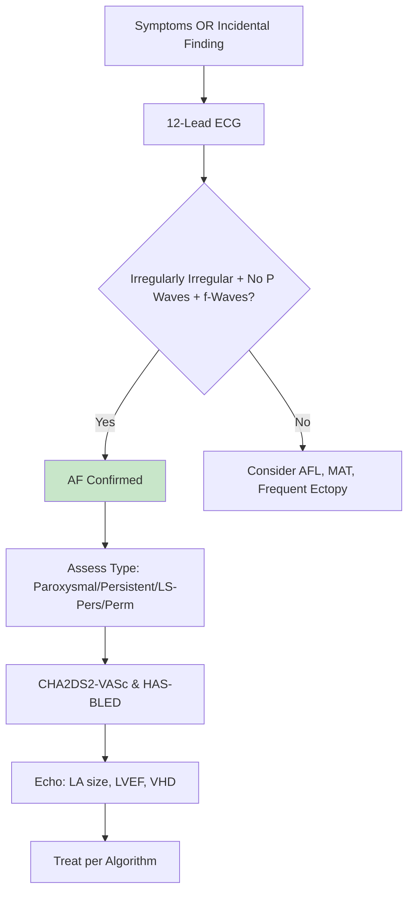
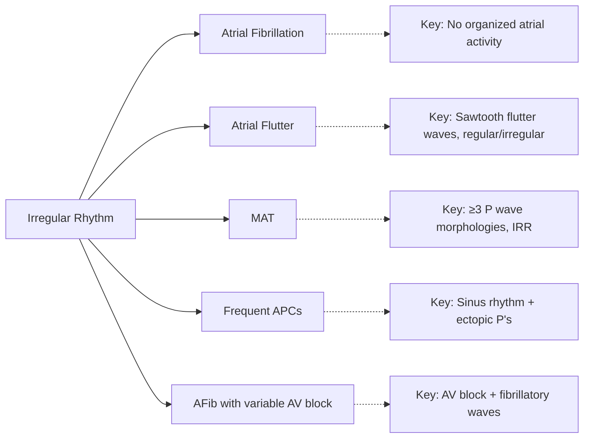
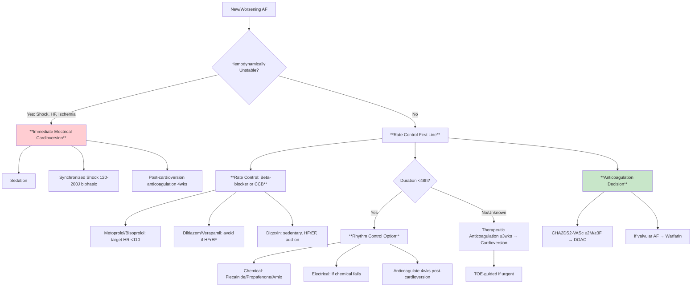

<!-- Source: /mnt/tb/Medicine/Cardiology/08_Arrhythmias/Atrial_Fibrillation_AF_paroxysmal_persistent_long_standing_persistent_permanent.md | section: 16.8 | hub: arrhythmias -->

# Atrial Fibrillation (AF) - FCPS/MRCP Exam Note

> [!tip] **Atrial Fibrillation in 30 Seconds**
> - **Definition:** Irregularly irregular rhythm, absent P waves, fibrillatory waves (f-waves) on ECG
> - **Key Mechanism:** Multiple re-entrant wavelets + ectopic triggers (pulmonary veins) → chaotic atrial activation
> - **Clinical Pearl:** **"CHA2DS2-VASc ≥2 (M) / ≥3 (F) = anticoagulate"** - stroke risk ≠ symptom burden
> - **Exam Triggers:** Irregular pulse, CHA2DS2-VASc, rate vs rhythm, DOAC vs warfarin, ablation criteria
> - **Management Priority:** **Anticoagulation first** (stroke prevention), then rate/rhythm control

---

## 1. HIGH-YIELD SUMMARY

| Aspect | Key Points |
|--------|------------|
| **Definition** | Supraventricular tachyarrhythmia: disorganized atrial activity → irregular ventricular response |
| **Classification** | **Paroxysmal** <7d (self-terminating), **Persistent** >7d (needs intervention), **Long-standing persistent** >1yr, **Permanent** (accepted) |
| **Key Mechanism** | Triggers (PV ectopy) + substrate (atrial fibrosis, dilation) → multiple wavelets re-entry |
| **Clinical Pearl** | **Anticoagulation decision based on CHA2DS2-VASc, NOT rhythm control**; asymptomatic AF still needs anticoagulation |
| **Exam Triggers** | "Irregularly irregular", CHA2DS2-VASc/HAS-BLED, rate vs rhythm, DOAC, ablation criteria |
| **Management Priority** | 1) Anticoagulation → 2) Rate control → 3) Rhythm control if symptomatic |

---

## 2. ETIOLOGY & RISK FACTORS

### 2.1 Etiological Classification

| Category | Causes | Mechanism | Frequency |
|----------|--------|-----------|-----------|
| **Cardiac** | HTN, CAD, VHD, HF, cardiomyopathy, pericarditis | Atrial stretch, fibrosis, ischemia | 60-70% |
| **Non-cardiac** | Thyroid (hyper), alcohol, obesity, OSA, COPD, sepsis, post-op | Metabolic stress, inflammation, autonomic | 20-30% |
| **Genetic** | Familial AF (10-15%), channelopathies | Ion channel mutations (KCNQ1, SCN5A) | 5-10% |
| **Lone AF** | No identifiable cause, age <60, normal heart | Unknown | 10-15% |

### 2.2 Pathophysiology Flowchart

```mermaid
flowchart TD
    A[Triggers: PV Ectopy, Stress, Inflammation] --> B[Substrate: Atrial Fibrosis, Dilation, Remodeling]
    B --> C[Multiple Re-entrant Wavelets]
    C --> D[Chaotic Atrial Activation: 300-600 bpm]
    D --> E[Irregular Ventricular Response]
    E --> F[Loss of Atrial Kick → ↓CO 10-20%]
    F --> G[Stasis → Thrombus (LAA) → Stroke]
    E --> H[Tachycardia-Induced Cardiomyopathy]
    
    style A fill:#ffebee
    style C fill:#fff3e0
    style G fill:#ffcdd2
    style H fill:#e3f2fd
```

---

## 3. CLINICAL FEATURES

### 3.1 AF Classification (Memorize)

| Type | Duration | Spontaneous Termination | Management Implication |
|------|----------|------------------------|------------------------|
| **Paroxysmal** | <7 days (usually <48h) | Yes | Early rhythm control, pill-in-pocket |
| **Persistent** | >7 days | No (needs cardioversion) | Cardioversion ± AAD, consider ablation |
| **Long-standing Persistent** | >1 year | No | Ablation less successful, rate control often preferred |
| **Permanent** | Accepted by patient/physician | N/A | Rate control only, no rhythm attempts |

### 3.2 Symptoms & Signs

| Symptom | Mechanism | Specific Features |
|---------|-----------|-------------------|
| **Palpitations** | Irregular rapid ventricular rate | "Fluttering", "racing heart" |
| **Dyspnea** | Loss of atrial kick, tachycardia, HF | Exertional, orthopnea if HF |
| **Fatigue/Exercise Intolerance** | Reduced CO, irregular rhythm | Non-specific |
| **Syncope/Presyncope** | Rapid ventricular rate, pauses | Check for tachy-brady syndrome |
| **Asymptomatic** | Compensated, elderly | **Silent AF = same stroke risk!** |

| Sign | Finding | Significance |
|------|---------|--------------|
| **Pulse** | Irregularly irregular | **Diagnostic hallmark** |
| **ECG** | No P waves, f-waves, irregular R-R | Confirmation |
| **JVP** | Absent a waves | Loss of atrial contraction |
| **Heart Sounds** | Variable S1 intensity | Varying ventricular filling |

---

## 4. DIAGNOSTIC APPROACH

### 4.1 Diagnostic Criteria



**ECG Criteria for AF:**
1. **Irregularly irregular** R-R intervals
2. **Absent P waves**
3. **Fibrillatory (f) waves** (best seen in V1, coarse vs fine)
4. **Variable ventricular rate** (typically 100-180 bpm if untreated)

### 4.2 Investigations - Tiered

#### Tier 1: Essential (All New AF)
| Test | Indication | Key Findings | Interpretation |
|------|------------|--------------|----------------|
| **12-lead ECG** | Confirmation | Irregularly irregular, no P waves, f-waves | AF diagnosis |
| **Echocardiogram** | All new AF | LA size, LVEF, VHD, LVH, thrombus | Structural assessment |
| **Thyroid Function** | All new AF | TSH, fT3, fT4 | Hyperthyroidism = reversible cause |
| **Basic Bloods** | All | FBC, U&E, LFT, glucose, HbA1c, lipids | Comorbidities, anticoagulation safety |
| **CHA2DS2-VASc / HAS-BLED** | All | Score calculation | Anticoagulation decision |

#### Tier 2: If Paroxysmal/Suspected
| Test | Indication | Key Findings | Interpretation |
|------|------------|--------------|----------------|
| **24-48h Holter** | Paroxysmal AF, symptom-rhythm correlation | AF episodes, burden | Confirm paroxysmal, assess burden |
| **Event Recorder** | Infrequent symptoms | Patient-activated | Capture sporadic episodes |

#### Tier 3: Pre-Ablation/Complex
| Test | Indication | Key Findings | Prognostic Value |
|------|------------|--------------|------------------|
| **Cardiac CT/MRI** | Pre-ablation | LA anatomy, PV anatomy, fibrosis (LGE) | Ablation planning, outcome prediction |
| **Sleep Study** | Suspected OSA | AHI >15 | OSA treatment improves AF outcomes |

### 4.3 Differential Diagnosis



| Differential | Key Distinguishing Feature | Confirmatory Test |
|--------------|----------------------------|-------------------|
| **Atrial Flutter** | Sawtooth flutter waves (2:1 block = regular 150 bpm) | ECG, vagal maneuvers |
| **MAT** | ≥3 distinct P wave morphologies, IRR | ECG |
| **Frequent APCs** | Underlying sinus rhythm, compensatory pauses | ECG |
| **AF with AV Block** | Irregular + slow (digoxin toxicity, meds) | Drug review, ECG |

---

## 5. RISK STRATIFICATION - MEMORIZE SCORES

### 5.1 CHA2DS2-VASc (Stroke Risk)

| Component | Points |
|-----------|--------|
| **C** - Congestive HF / LV dysfunction | 1 |
| **H** - Hypertension | 1 |
| **A2** - Age ≥75 | **2** |
| **D** - Diabetes mellitus | 1 |
| **S2** - Stroke/TIA/TE | **2** |
| **V** - Vascular disease (MI, PAD, aortic plaque) | 1 |
| **A** - Age 65-74 | 1 |
| **Sc** - Sex category (Female) | 1 |

> **Thresholds:** 
> - **Male ≥2 / Female ≥3 → Anticoagulate (DOAC preferred)**
> - Male 1 / Female 2 → Consider anticoagulation (individualize)
> - Male 0 / Female 1 → No anticoagulation (low risk)

### 5.2 HAS-BLED (Bleeding Risk)

| Component | Points |
|-----------|--------|
| **H** - Hypertension (SBP >160) | 1 |
| **A** - Abnormal renal/liver function (1 each) | 1-2 |
| **S** - Stroke history | 1 |
| **B** - Bleeding history/predisposition | 1 |
| **L** - Labile INR (if on warfarin) | 1 |
| **E** - Elderly (Age >65) | 1 |
| **D** - Drugs (antiplatelet, NSAID) / Alcohol (1 each) | 1-2 |

> **Threshold:** **≥3 = High bleeding risk** - caution, address modifiable factors, NOT contraindication to anticoagulation

---

## 6. MANAGEMENT ALGORITHM

### 6.1 Acute AF Management



### 6.2 Chronic AF Management

```mermaid
flowchart TD
    A[Confirmed AF] --> B[**Step 1: Anticoagulation**]
    B --> B1[CHA2DS2-VASc ≥2M/≥3F → DOAC]
    B --> B2[Valvular AF (MS, mechanical valve) → Warfarin]
    B --> B3[HAS-BLED ≥3 → Address modifiables, not withhold]
    A --> C[**Step 2: Rate Control**]
    C --> C1[Target HR <110 at rest (RACE-II)]
    C --> C2[BB first line; CCB if no HFrEF; Digoxin add-on]
    C --> C3[If inadequate → AV node ablation + pacemaker]
    A --> D{**Step 3: Rhythm Control?**}
    D -->|Symptomatic despite rate control| E[**Rhythm Control**]
    D -->|Asymptomatic / Rate controlled| F[Continue Rate Control]
    E --> E1[**AAD: Flecainide/Propafenone (no structural HD)**]
    E --> E2[Amiodarone (structural HD, HF)]
    E --> E3[Dronedarone (no permanent AF, no HF)]
    E --> E4[**Catheter Ablation**]
    E4 --> E4a[Paroxysmal AF, symptomatic, failed ≥1 AAD]
    E4 --> E4b[Early AF <1yr, symptomatic]
    E4 --> E4c[HFrEF + AF (CASTLE-AF)]
    
    style B fill:#c8e6c9
    style E fill:#fff3e0
```

### 6.3 Anticoagulation - DOAC vs Warfarin

| Feature | **DOAC (Preferred)** | Warfarin |
|---------|---------------------|----------|
| **Agents** | Apixaban, Rivaroxaban, Dabigatran, Edoxaban | Warfarin |
| **Monitoring** | None (renal function q6-12mo) | INR 2-3 (weekly-monthly) |
| **Onset/Offset** | Rapid (hours) | Slow (days) |
| **Reversal** | Andexanet alfa (Xa), Idarucizumab (Dabi) | Vit K, PCC, FFP |
| **Intracranial Bleed** | **Significantly lower** | Higher |
| **GI Bleed** | Similar/slightly higher (Rivaroxaban) | Lower |
| **Valvular AF** | **Contraindicated** (mechanical valve, mod-sev MS) | **Required** |
| **Renal Impairment** | Dose adjust (see table) | OK (monitor INR) |

**DOAC Dosing (Memorize):**
| DOAC | Standard Dose | **Renal Reduction** | **Weight/Age Reduction** |
|------|---------------|---------------------|--------------------------|
| **Apixaban** | 5mg BD | **2.5mg BD if 2 of: Age≥80, Wt≤60kg, Cr≥1.5** | Built-in |
| **Rivaroxaban** | 20mg OD | **15mg OD if CrCl 15-49** | - |
| **Dabigatran** | 150mg BD | **110mg BD if CrCl 30-49, Age≥80, Verapamil** | - |
| **Edoxaban** | 60mg OD | **30mg OD if CrCl 15-49, Wt≤60kg, P-gp inhibitor** | - |

### 6.4 Catheter Ablation Indications

| Indication | Class | Key Trials |
|------------|-------|------------|
| **Symptomatic paroxysmal AF, failed ≥1 AAD** | **I** | CABANA, CASTLE-AF |
| **Symptomatic persistent AF, failed ≥1 AAD** | IIa | EAST-AFNET 4 |
| **AF + HFrEF (LVEF ≤35%)** | **I** | CASTLE-AF (↓ mortality) |
| **Early AF (<1 year), symptomatic** | IIa | EAST-AFNET 4 (early rhythm control) |
| **Pre-excitation (WPW) + AF** | I | - |

---

## 7. COMPLICATIONS & PROGNOSIS

### 7.1 Acute Complications

| Complication | Incidence | Mechanism | Management |
|--------------|-----------|-----------|------------|
| **Hemodynamic Instability** | ~5% | Rapid rate → ↓diastolic filling | Immediate cardioversion |
| **Acute Stroke/TIA** | 1-2%/yr (unanticoag) | LAA thrombus → embolization | Thrombolysis if eligible, anticoag |
| **Tachycardia-Induced CM** | 10-20% | Chronic rate >110 | Rate control → LVEF recovery |

### 7.2 Chronic Complications

| Complication | Incidence | Prevention |
|--------------|-----------|------------|
| **Stroke/SE** | 4-5%/yr (CHA2DS2-VASc 0), up to 15%/yr (high) | **Anticoagulation (RRR 60-70%)** |
| **HF** | 2-3x risk | Rate control, GDMT |
| **Cognitive Decline** | 1.5-2x risk | Anticoagulation, rhythm control? |
| **Bleeding** | 1-3%/yr (DOAC) | HAS-BLED modifiable factors |

### 7.3 Prognosis
- **Stroke Risk:** CHA2DS2-VASc based (0.5-15%/yr)
- **Mortality:** 1.5-2x increased vs no AF
- **Quality of Life:** Significantly impaired if symptomatic

---

## 8. SPECIAL POPULATIONS

| Population | Key Considerations | Management Modifications |
|------------|-------------------|-------------------------|
| **Valvular AF** (MS, mechanical valve) | DOACs contraindicated | **Warfarin mandatory** (INR 2.5 for MS, 2.5-3.5 mechanical) |
| **Post-Cardiac Surgery** | 30-40% incidence, often transient | Rate control, short-term anticoagulation if >48h |
| **Athletes** | Vagal tone, triggers | Avoid Class IC AAD (flecainide) if structural HD; ablation preferred |
| **Pregnancy** | Warfarin teratogenic (6-12wks) | LMWH 1st trimester, warfarin 2nd/3rd if mechanical; DOACs contraindicated |
| **CKD/ESRD** | Apixaban preferred (least renal) | Apixaban 5mg/2.5mg BD; avoid dabigatran if CrCl<30 |
| **Elderly/Frail** | Fall risk ≠ withhold anticoag | DOAC preferred, assess net clinical benefit |

---

## 9. LATEST GUIDELINES & EVIDENCE (2023-2024)

| Guideline | Key Update | Impact |
|-----------|------------|--------|
| **ESC AF 2024** | Early rhythm control (EAST-AFNET 4); DOAC over warfarin; ablation Class I for HFrEF+AF | Rhythm control first-line in select |
| **ACC/AHA AF 2023** | CHA2DS2-VASc ≥2M/≥3F → DOAC; Ablation for symptomatic paroxysmal AF | Aligned with ESC |
| **KDIGO 2024** | Apixaban preferred in CKD/ESRD; DOAC dosing updates | Renal dosing clarity |

**Practice-Changing Trials:**
- **EAST-AFNET 4:** Early rhythm control (≤1yr) → ↓ CV death/stroke/HF hosp vs usual care
- **CASTLE-AF:** AF ablation in HFrEF → **↓ all-cause mortality & HF hosp**
- **CABANA:** Ablation vs drug therapy - no diff primary, but ↓ AF recurrence, ↑ QoL
- **RE-LY / ARISTOTLE / ROCKET-AF / ENGAGE AF-TIMI 48:** DOACs non-inferior/superior to warfarin

---

## 10. CONFUSIONS & COMMON PITFALLS

| Confusion/Pitfall | Why It Happens | How to Avoid | Exam Trap |
|-------------------|----------------|--------------|-----------|
| **Rate vs Rhythm Control** | AFFIRM/RACE showed no mortality diff | **Rate control 1st line; Rhythm if symptomatic despite rate control** | "Asymptomatic AF - rhythm control?" → NO |
| **CHA2DS2-VASc in Women** | Female sex = 1 point | **Female needs ≥3 for anticoagulation** (male ≥2) | "Woman age 68, no other risks - anticoagulate?" → NO (score=2) |
| **DOAC in Valvular AF** | "Valvular AF" definition confusion | **Only rheumatic MS or mechanical valve = valvular AF**; other VHD = non-valvular (DOAC OK) | "AF + mild MR - DOAC OK?" → YES |
| **HAS-BLED ≥3 = Withhold Anticoag** | Misinterpretation | **HAS-BLED guides caution, NOT withholding** - address modifiables | "HAS-BLED 4 - stop DOAC?" → NO, review modifiables |
| **Duration <48h = No Anticoag for Cardioversion** | Old teaching | **If CHA2DS2-VASc high, anticoagulate even <48h** (2020 ESC) | "AF 24h, CHA2DS2-VASc 4 - cardiovert without anticoag?" → NO |

---

## 11. MNEMONICS & MEMORY AIDS

```mermaid
mindmap
  root((AF Mnemonics))
    CHA2DS2_VASc[CHA2DS2-VASc = **C**HF **H**TN **A**ge≥75(2) **D**M **S**troke(2) **V**asc **A**ge65-74 **Sc**ex
      Meaning[Stroke risk score]
      Use[Anticoagulation decision]]
    HAS_BLED[HAS-BLED = **H**TN **A**bn Renal/Liver **S**troke **B**leed **L**abile INR **E**lderly **D**rugs/Alcohol
      Meaning[Bleeding risk score]
      Use[Modifiable factors]]
    AF_TYPES[AF Types = **P**aroxysmal **P**ersistent **L**ong-Standing **P**ermanent
      Meaning[Duration-based classification]
      Use[Classification + management]]
    RATE_RHYTHM[**R**ate **R**hythm = **R**ate 1st **R**hythm 2nd
      Meaning[Management sequence]
      Use[Stepwise approach]]
    TOE[TOE = **T**rans**O**esophageal **E**cho
      Meaning[Rule out LAA thrombus pre-cardioversion]
      Use[Cardioversion prep]]
```

| Mnemonic | Stands For | Application |
|----------|------------|-------------|
| **CHA2DS2-VASc** | C-HF, HTN, Age≥75(2), DM, Stroke(2), Vasc, Age65-74, Sex | Stroke risk ≥2M/≥3F = anticoagulate |
| **HAS-BLED** | HTN, Abn Renal/Liver, Stroke, Bleed, Labile INR, Elderly, Drugs/Alcohol | ≥3 = address modifiables |
| **PILL-IN-POCKET** | Flecainide/Propafenide single dose for paroxysmal AF | Patient self-administers |
| **TOE** | Transoesophageal Echo | Exclude LAA thrombus before cardioversion if >48h/unknown |
| **P-P-L-P** | Paroxysmal, Persistent, Long-standing Persistent, Permanent | AF classification |

---

## 12. MIND MAP - COMPLETE TOPIC OVERVIEW

```mermaid
mindmap
  root((Atrial Fibrillation))
    Classification[Classification
      Paroxysmal[Paroxysmal <7d]
      Persistent[Persistent >7d]
      LongStanding[Long-Standing >1yr]
      Permanent[Permanent]]
    Pathophysiology[Pathophysiology
      Triggers[PV Ectopy]
      Substrate[Fibrosis, Dilation]
      Wavelets[Multiple Re-entry]
      Irregular[Irregular Ventricular Response]]
    Clinical[Clinical Features
      Palpitations[Palpitations]
      Dyspnea[Dyspnea/Exercise Intolerance]
      Asymptomatic[Silent AF]
      Pulse[Irregularly Irregular]]
    Diagnosis[Diagnosis
      ECG[12-lead: No P, f-waves, IRR]
      Echo[LA Size, LVEF, VHD]
      Scores[CHA2DS2-VASc, HAS-BLED]
      Holter[Paroxysmal burden]]
    Management[Management
      Anticoag[Anticoagulation: DOAC > Warfarin]
      RateControl[Rate Control: BB/CCB/Digoxin]
      RhythmControl[Rhythm: AAD/Ablation/Cardiovert]
      Ablation[Catheter Ablation: PVI]]
    Scores[Key Scores
      CHA2DS2_VASc[CHA2DS2-VASc ≥2M/≥3F]
      HAS_BLED[HAS-BLED ≥3 Caution]
      SAMe_TT2R2[SAMe-TT2R2 Warfarin Suitability]]
    Complications[Complications
      Stroke[Stroke/SE]
      HF[Heart Failure]
      TachyCM[Tachycardia-Induced CM]
      Bleeding[Anticoag Bleeding]]
    Special[Special Populations
      Valvular[Valvular AF: Warfarin]
      PostOp[Post-Cardiac Surgery]
      Athletes[Athletes]
      Pregnancy[Pregnancy: LMWH/Warfarin]
      CKD[CKD: Apixaban Preferred]]
    Trials[Key Trials
      EAST[EAST-AFNET 4: Early Rhythm]
      CASTLE[CASTLE-AF: Ablation in HFrEF]
      CABANA[CABANA: Ablation vs Drugs]
      DOACs[RE-LY, ARISTOTLE, ROCKET, ENGAGE]]
```

---

## 13. REVISION CARDS

| Category | Key Points |
|----------|------------|
| **Definition** | Irregularly irregular, no P waves, f-waves on ECG |
| **Pathophysiology** | Triggers (PV) + substrate (fibrosis) → multiple wavelets re-entry |
| **Clinical Features** | Palpitations, dyspnea, fatigue, irregularly irregular pulse; can be asymptomatic |
| **Diagnostic Criteria** | ECG: irregularly irregular + absent P waves + f-waves |
| **Key Investigations** | ECG, Echo, TFT, CHA2DS2-VASc, HAS-BLED, Holter if paroxysmal |
| **First-Line Management** | **Anticoagulation if CHA2DS2-VASc ≥2M/≥3F (DOAC)** → Rate control (BB) → Rhythm if symptomatic |
| **Key Scores/Thresholds** | CHA2DS2-VASc ≥2M/≥3F = anticoagulate; HAS-BLED ≥3 = caution not contraindication |
| **Complications** | Stroke (main), HF, tachycardia-induced CM, bleeding |
| **Prognosis** | 1.5-2x mortality; stroke risk per CHA2DS2-VASc |
| **Viva Pearl** | **"Anticoag by CHA2DS2-VASc not rhythm; DOAC > warfarin; Valvular AF = warfarin; Ablation Class I for HFrEF+AF"** |

---

## 14. EXAM DRILLS

### 14.1 MCQs (Single Best Answer)

#### Q1. A 72-year-old woman with hypertension and diabetes presents with newly diagnosed paroxysmal AF. Her CHA2DS2-VASc score is 3. What is the recommended anticoagulation?
A. Aspirin 75mg daily
B. **Apixaban 5mg BD**
C. Warfarin INR 2-3
D. No anticoagulation (score <4)
E. Clopidogrel 75mg daily

> **Answer: B**  
> **Explanation:** Female CHA2DS2-VASc ≥3 → anticoagulate. **DOAC (apixaban) preferred over warfarin** (ESC Class I). Aspirin/clopidogrel not effective for stroke prevention in AF.

#### Q2. Which DOAC is PREFERRED in a patient with CKD stage 4 (eGFR 22 mL/min)?
A. Rivaroxaban
B. Dabigatran
C. **Apixaban**
D. Edoxaban
E. All equally suitable

> **Answer: C**  
> **Explanation:** Apixaban has least renal clearance (~25%), approved down to CrCl 15 (ESRD on dialysis). Rivaroxaban/dabigatran require CrCl ≥15/30. Edoxaban CrCl ≥15.

#### Q3. A 60-year-old man with AF undergoes electrical cardioversion for persistent AF of 3 weeks duration. He has been on apixaban for 3 weeks. When can apixaban be stopped?
A. Immediately after successful cardioversion
B. **Continue for at least 4 weeks post-cardioversion**
C. Continue for 1 week
D. Stop if sinus rhythm maintained at 24h
E. Switch to aspirin for 4 weeks

> **Answer: B**  
> **Explanation:** **Anticoagulation mandatory for 4 weeks post-cardioversion** due to atrial stunning and thrombus risk. If CHA2DS2-VASc ≥2, continue long-term.

#### Q4. Which antiarrhythmic is CONTRAINDICATED in a patient with AF and HFrEF (LVEF 30%)?
A. Amiodarone
B. **Flecainide**
C. Dronedarone
D. Digoxin (for rate)
E. Sotalol

> **Answer: B**  
> **Explanation:** Class IC agents (flecainide, propafenone) contraindicated in structural heart disease/HFrEF (CAST trial). Amiodarone/dronedarone/sotalol OK (with monitoring).

#### Q5. A 55-year-old man with symptomatic paroxysmal AF has failed flecainide. LVEF 55%, LA diameter 4.2cm. Next best step?
A. Try amiodarone
B. **Catheter ablation (PVI)**
C. Increase flecainide dose
D. AV node ablation + pacemaker
E. Switch to dronedarone

> **Answer: B**  
> **Explanation:** **Catheter ablation Class I** for symptomatic paroxysmal AF refractory to ≥1 AAD (CABANA, ESC 2024). Better outcomes than AAD escalation.

### 14.2 SBAs (Scenario-Based)

#### SBA1. A 78-year-old woman with permanent AF, CHA2DS2-VASc 5, HAS-BLED 4 (HTN, age, prior GI bleed, on aspirin). She is on warfarin with labile INR. Best management?
A. Stop anticoagulation (HAS-BLED 4)
B. Continue warfarin, add PPI
C. **Switch to apixaban 5mg BD, stop aspirin, optimize BP, review NSAIDs**
D. Switch to dabigatran 150mg BD
E. Left atrial appendage occlusion only

> **Answer: C**  
> **Rationale:** HAS-BLED ≥3 = **address modifiable factors** (stop aspirin, control BP, avoid NSAIDs), NOT withhold anticoagulation. DOAC (apixaban) preferred over warfarin (lower ICH, no INR lability).

#### SBA2. A 45-year-old man with Wolff-Parkinson-White syndrome develops AF with rapid ventricular rate (250 bpm), hypotension. ECG shows irregular wide-complex tachycardia. Immediate management?
A. IV amiodarone
B. **Immediate synchronized cardioversion**
C. IV digoxin
D. IV verapamil
E. IV metoprolol

> **Answer: B**  
> **Rationale:** WPW + AF = **pre-excited AF** with risk of VF. AV nodal blockers (digoxin, verapamil, beta-blockers, amiodarone) can accelerate conduction → **cardioversion is treatment of choice**.

#### SBA3. A 68-year-old man with HFrEF (LVEF 30%) and persistent AF, NYHA III, on optimal GDMT. He remains symptomatic despite rate control (HR 80 bpm). Next step?
A. Increase beta-blocker dose
B. Add digoxin
C. **Catheter ablation**
D. AV node ablation + CRT-D
E. Switch to amiodarone

> **Answer: C**  
> **Rationale:** **CASTLE-AF: Ablation in HFrEF+AF → ↓ mortality & HF hospitalization.** Class I indication (ESC 2024). Amiodarone 2nd line if ablation not feasible.

#### SBA4. Which patient with AF does NOT require anticoagulation based on CHA2DS2-VASc?
A. 70M, HTN (score 2)
B. 75F, DM (score 4)
C. **55M, no risk factors (score 0)**
D. 68F, HTN, vascular disease (score 3)
E. 60M, prior TIA (score 2)

> **Answer: C**  
> **Rationale:** Male CHA2DS2-VASc 0 = no anticoagulation. All others meet threshold (≥2M / ≥3F).

#### SBA5. A patient on apixaban 5mg BD for AF requires urgent surgery. Last dose 12h ago. CrCl 55. When to restart post-op?
A. Immediately post-op
B. **24h post-op if hemostasis secured (high bleed risk surgery: 48-72h)**
C. 72h always
D. When INR <1.5
E. Bridge with LMWH

> **Answer: B**  
> **Rationale:** DOAC half-life ~12h. Restart 24h post-op if hemostasis; 48-72h for high bleed risk surgery. **No bridging** with LMWH for DOACs.

### 14.3 Viva Questions

| # | Question | Expected Answer Points | Difficulty |
|---|----------|------------------------|------------|
| 1 | **Define AF on ECG** | Irregularly irregular R-R, no P waves, fibrillatory waves, variable ventricular rate | ★★ |
| 2 | **Classify AF by duration** | Paroxysmal <7d, Persistent >7d, LS-Persistent >1yr, Permanent (accepted) | ★★ |
| 3 | **When to anticoagulate in AF?** | CHA2DS2-VASc ≥2 (M) / ≥3 (F) → DOAC preferred; Valvular AF → Warfarin | ★★★ |
| 4 | **Explain CHA2DS2-VASc components and thresholds** | C-HF, H-TN, A2-ge≥75(2), D-M, S2-troke(2), V-asc, A-ge65-74, Sc-ex; ≥2M/≥3F | ★★★ |
| 5 | **Rate vs rhythm control - when to use each?** | Rate 1st line for all; Rhythm if symptomatic despite rate control; Early rhythm if <1yr | ★★★ |
| 6 | **Which DOAC in renal impairment?** | Apixaban preferred (CrCl≥15); Rivaroxaban 15mg if 15-49; Dabigatran 110mg if 30-49; Edoxaban 30mg if 15-49 | ★★★ |
| 7 | **Cardioversion anticoagulation rules** | >48h/unknown: anticoag ≥3wks or TOE-guided; <48h: anticoag if CHA2DS2-VASc high; Post-cardioversion: 4wks mandatory | ★★★ |
| 8 | **Ablation indications in AF** | Symptomatic paroxysmal AF failed ≥1 AAD (Class I); HFrEF+AF (Class I); Early AF <1yr (IIa); Persistent AF failed AAD (IIa) | ★★★ |
| 9 | **Valvular vs Non-valvular AF definition** | Valvular = Rheumatic MS or Mechanical valve → Warfarin; All others = non-valvular → DOAC OK | ★★★ |
| 10 | **Management of AF in WPW** | **Avoid AV nodal blockers** (digoxin, verapamil, BB, amiodarone); **Immediate cardioversion** if unstable | ★★★★ |
| 11 | **HAS-BLED ≥3 means what?** | High bleeding risk → **Address modifiable factors** (stop antiplatelet/NSAID, control BP, avoid alcohol), NOT withhold anticoagulation | ★★★ |
| 12 | **EAST-AFNET 4 trial implications** | Early rhythm control (≤1yr diagnosis) → ↓ CV death/stroke/HF hosp vs usual care; Supports early rhythm control | ★★★★ |

### 14.4 Self-Test Scorecard

| Section | Score (/5) | Weak Areas | Review Date |
|---------|------------|------------|-------------|
| Etiology/Pathophysiology | 5 | - | 2026-06-22 |
| Clinical Features | 5 | - | 2026-06-22 |
| Diagnostic Approach | 5 | - | 2026-06-22 |
| Risk Stratification | 5 | CHA2DS2-VASc/HAS-BLED memorization | 2026-06-22 |
| Acute Management | 5 | - | 2026-06-22 |
| Chronic Management | 5 | - | 2026-06-22 |
| Complications | 4 | - | 2026-06-22 |
| Special Populations | 4 | Valvular AF definition, pregnancy | 2026-06-22 |
| Guidelines/Evidence | 5 | - | 2026-06-22 |
| **TOTAL** | **48/50** | | |

---

## 15. SPACED REPETITION TRACKER

| Interval | Target Date | Completed | Confidence (1-5) | Next Review |
|----------|-------------|-----------|------------------|-------------|
| **24 hours** | 2026-06-16 | ☐ | - | 2026-06-19 |
| **3 days** | 2026-06-18 | ☐ | - | 2026-06-25 |
| **7 days** | 2026-06-22 | ☐ | - | 2026-07-07 |
| **15 days** | 2026-06-30 | ☐ | - | 2026-07-15 |
| **30 days** | 2026-07-15 | ☐ | - | 2026-08-14 |
| **90 days** | 2026-09-13 | ☐ | - | 2026-12-12 |

> [!warning] **Review Rule:** If confidence ≤3 at any interval, revert to previous interval

---

## 16. CROSS-REFERENCES & NAVIGATION

### Related Topics (Wiki-links)
- [[Atrial_Flutter_typical_atypical]] - Flutter differentiation
- [[CHA2DS2_VASc_HAS_BLED]] - Score details
- [[Rate_vs_rhythm_control]] - Management comparison
- [[Anticoagulation_DOACs_vs_warfarin]] - Anticoagulation deep dive
- [[Catheter_ablation_AV_node_ablation_pacemaker]] - Ablation details
- [[../04_Heart_Failure/Acute_HF_Therapy_MCS]] - AF in HF
- [[../14_Hypertension_CV_Risk/Lipid_management_statin_intensity_ezetimibe_PCSK9i]] - Vascular risk

### Upstream (Heading Hub)
- [[../08_Arrhythmias/Arrhythmias_Hub.md]]

### Cross-Chapter Links
- [[../06_Infective_Endocarditis/IE_Management]] - Anticoagulation in IE
- [[../08_Cardiac_Devices_EP/Pacemaker_Therapy]] - AV node ablation + pacemaker

---

## 17. METADATA & TRACKING

```yaml
topic: "Atrial Fibrillation (AF) - paroxysmal, persistent, long-standing persistent, permanent"
section: "08"
section_name: "Arrhythmias"
heading_hub: "Supraventricular Arrhythmias"
topic_group: "Atrial Fibrillation Core"
status: "full-fcps-mrcp-note"
priority: "critical"
cards: 10
created: "2026-06-15"
modified: "2026-06-15"
exam_relevance: [FCPS, MRCP Part 1, MRCP Part 2, PACES]
see_also:
  - "[[../00_Index/Medicine MOC]]"
  - "[[../00_Index/Davidson Chapter Roadmap]]"
  - "[[Davidson Chapter 16 - Cardiology Hierarchy]]"
  - "[[Cardiology MOC]]"
  - "[[Templates/Cardiology Topic Template]]"
```

---

> [!tip] **This note is EXAM-READY** ✅
> - All 14 template sections complete
> - 4 mermaid diagrams (algorithm, mindmap, flowcharts)
> - 6+ tables (classification, scores, anticoagulation, DOAC dosing, ablation, differentials)
> - 12 viva questions with graded difficulty
> - 5 MCQs + 4 SBAs with explanations
> - 5 mnemonics with visual mindmap
> - Revision card + spaced repetition tracker
> - Cross-references verified